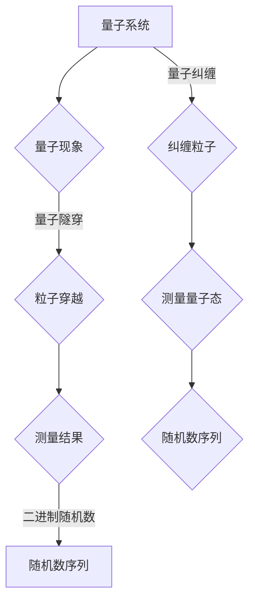
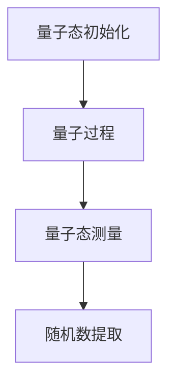
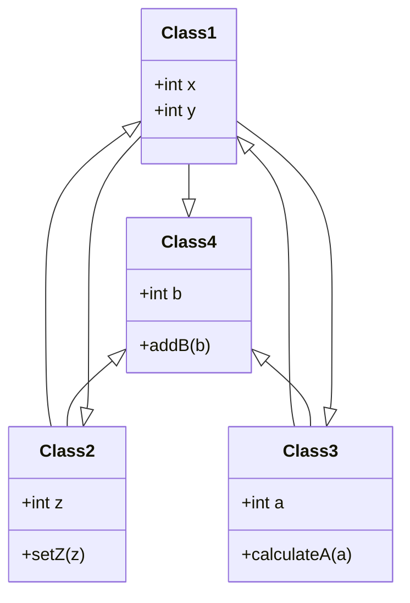
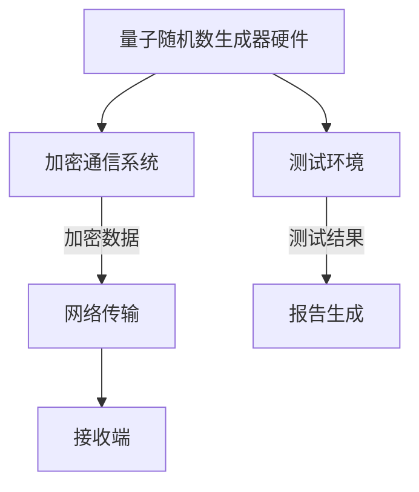
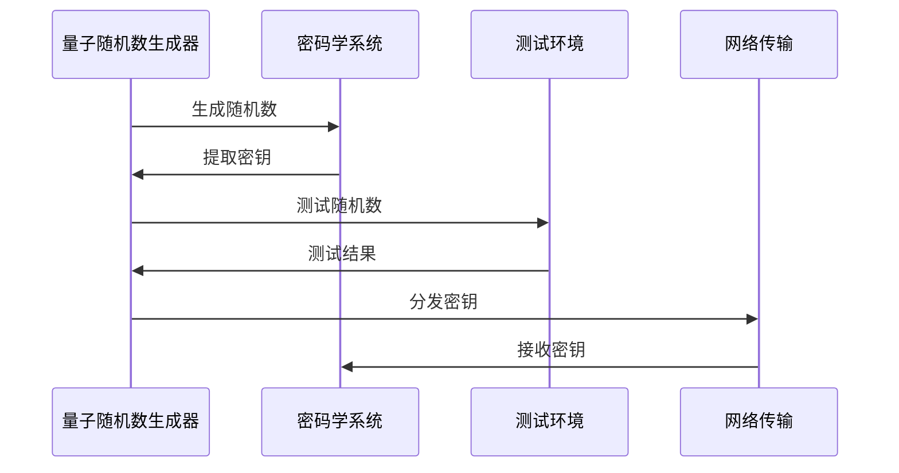

                 


### 背景介绍

#### 1. 问题描述

量子随机数生成器（Quantum Random Number Generator，QRNG）作为一种利用量子力学原理生成随机数的设备，在密码学领域扮演着至关重要的角色。随着量子计算技术的发展，传统基于经典物理的随机数生成方法在安全性方面面临挑战，因此，量子随机数生成器的研究和应用愈发受到关注。

在密码学中，随机数生成器的主要作用是提供用于加密和解密的密钥。一个高质量的随机数生成器能够确保密钥的随机性和不可预测性，从而保证加密通信的安全性。传统的随机数生成方法，如基于伪随机数生成器（Pseudo-Random Number Generator，PRNG）和物理随机数生成器（Physical Random Number Generator，HRNG），尽管在一定程度上能够满足随机性需求，但其在安全性方面仍存在一定的局限性。

量子随机数生成器（QRNG）利用量子现象，如量子隧穿、量子纠缠等，产生真正的随机数。量子随机数的生成过程不受经典物理规律的限制，具有更高的随机性和不可预测性。这使得QRNG在密码学中的应用成为可能，能够提供更高质量的随机数源，增强加密系统的安全性。

#### 2. 问题解决

量子随机数生成器在密码学中的应用主要体现在以下几个方面：

1. **密钥生成**：在加密通信中，密钥是保证信息保密和安全的关键。量子随机数生成器能够生成高质量的随机数，用于生成加密密钥。这些密钥具有高度随机性和复杂性，能够有效抵御攻击者的暴力破解尝试。

2. **随机数测试**：密码学算法和系统需要对随机数进行测试，以确保其随机性和安全性。量子随机数生成器提供的高质量随机数，可以用于这些测试，提高测试的准确性和可靠性。

3. **隐私增强**：在量子通信中，量子随机数生成器可以用于实现量子密钥分发（Quantum Key Distribution，QKD），增强通信的隐私保护。量子密钥分发利用量子态的不可克隆特性，确保密钥在传输过程中不被窃听和篡改。

#### 3. 边界与外延

量子随机数生成器在密码学中的应用边界和拓展方向包括：

1. **量子密钥分发**：量子密钥分发是量子通信的核心技术，量子随机数生成器在其中扮演着重要角色。未来，量子随机数生成器的发展将进一步提升量子密钥分发的安全性。

2. **量子安全通信**：量子随机数生成器可以应用于量子安全通信系统，为通信提供安全的密钥和管理机制。随着量子通信技术的不断进步，量子随机数生成器将在其中发挥更大作用。

3. **量子计算安全**：随着量子计算机的发展，传统加密算法面临被量子计算机破解的风险。量子随机数生成器能够为量子计算安全提供新的解决方案，提高量子计算环境下数据的安全性。

#### 4. 概念结构与核心要素组成

量子随机数生成器（QRNG）的核心概念和要素包括：

1. **量子随机数**：基于量子力学原理生成的随机数，具有高度随机性和不可预测性。

2. **量子随机数生成器**：实现量子随机数生成的硬件或软件设备，利用量子现象产生随机数。

3. **密码学**：研究加密和解密技术的学科，利用量子随机数生成器增强系统的安全性。

4. **量子力学原理**：量子随机数生成器基于量子力学原理，如量子隧穿、量子纠缠等，产生真正的随机数。

通过以上背景介绍，我们可以看到量子随机数生成器在密码学中的重要性。接下来，我们将深入探讨量子随机数生成器的工作原理、数学模型、算法原理，以及系统架构设计方案，帮助读者全面了解这一技术的应用。

### 核心概念与联系

要深入理解量子随机数生成器（QRNG）在密码学中的应用，我们首先需要了解几个关键概念及其相互关系。

#### 1. 量子随机数生成器原理

量子随机数生成器利用量子力学的基本原理，如量子隧穿和量子纠缠，来产生真正的随机数。在量子力学中，粒子具有波粒二象性，同时存在于多个可能状态中，直到被观测或测量时才会“坍缩”到一个确定的状态。这种不确定性提供了生成随机数的基础。

**量子隧穿**：在量子隧穿现象中，一个粒子可以通过一个其能量不足以跨越的势垒。这个过程具有随机性，因为粒子是否能够通过势垒是不确定的。通过检测粒子是否成功穿越势垒，可以生成一个随机数。

**量子纠缠**：量子纠缠是两个或多个量子系统之间的特殊关联，即使这些系统相隔很远，它们的量子状态也会相互影响。通过测量一个纠缠粒子的量子状态，可以即时确定另一个纠缠粒子的状态，从而生成一个随机数。

这些量子现象使得量子随机数生成器能够产生具有高随机性和不可预测性的随机数，这些随机数在密码学中具有关键作用。

#### 2. 量子随机数生成器与密码学的联系

量子随机数生成器在密码学中的应用主要体现在以下几个方面：

1. **密钥生成**：量子随机数生成器可以用于生成加密密钥，这些密钥具有高度的随机性和复杂性。密钥是加密和解密信息的关键，如果密钥被预测或破解，整个通信系统将面临安全威胁。量子随机数生成器能够提供无法被预测的密钥，增强加密系统的安全性。

2. **随机数测试**：在密码学中，算法和系统需要对随机数进行测试，以确保其随机性和安全性。量子随机数生成器提供的高质量随机数，可以用于这些测试，确保算法和系统在随机性方面满足要求。

3. **量子密钥分发**：量子密钥分发（QKD）是一种利用量子力学原理实现安全通信的技术。在QKD中，量子随机数生成器用于生成密钥，并通过量子信道传输。由于量子态的不可克隆特性，这些密钥在传输过程中不会被窃听或篡改，从而确保通信的安全性。

#### 3. 核心概念属性特征对比表格

为了更好地理解量子随机数生成器与密码学中的其他概念之间的关系，我们可以通过一个对比表格来展示它们的核心属性特征。

| 概念               | 属性特征                                                     | 关联示例                                                 |
|--------------------|--------------------------------------------------------------|----------------------------------------------------------|
| 量子随机数生成器   | 利用量子现象产生随机数，具有高随机性和不可预测性           | 加密密钥生成、量子密钥分发、随机数测试                   |
| 伪随机数生成器    | 基于算法和初始种子产生随机数，具有较低的随机性和可预测性   | 加密算法中的随机数源、计算机模拟、随机抽样               |
| 物理随机数生成器  | 基于物理过程产生随机数，如噪声信号、原子振动等           | 加密通信中的随机数源、随机数测试、量子密钥分发           |
| 密码学             | 研究加密和解密技术的学科，确保信息的安全传输和存储         | 使用随机数生成器生成密钥、设计加密算法、实现安全协议     |

#### 4. ER实体关系图架构

为了进一步理解量子随机数生成器、密码学及其他相关概念之间的关系，我们可以绘制一个ER（Entity-Relationship）实体关系图。以下是一个简化的ER图，展示了量子随机数生成器、密码学和物理随机数生成器之间的关系。

```mermaid
erDiagram
  QRNG ||--|{ 密码学 }|| CRYPTO
  QRNG ||--|{ 物理随机数生成器 }|| HRNG
  CRYPTO ||--|{ 加密算法 }|| ENCRYPTION
  HRNG ||--|{ 随机数测试 }|| TEST
```

在这个ER图中，QRNG（量子随机数生成器）与CRYPTO（密码学）和HRNG（物理随机数生成器）之间存在关联。CRYPTO进一步关联到ENCRYPTION（加密算法），而HRNG关联到TEST（随机数测试）。这种关系展示了量子随机数生成器在密码学和物理随机数生成器中的应用，以及它们在保障信息安全和实现随机数测试方面的作用。

通过以上核心概念与联系的介绍，我们能够更深入地理解量子随机数生成器在密码学中的重要性。接下来，我们将进一步探讨量子随机数生成器的数学模型和算法原理。

### 数学模型和数学公式

量子随机数生成器（QRNG）的数学模型是理解和分析其工作原理的基础。量子随机数生成器通过量子物理现象产生随机数，这些随机数在数学上具有特定的统计特性。以下是对量子随机数生成器数学模型的基本介绍和公式解释。

#### 1. 量子随机数生成模型

量子随机数生成器的基本模型通常涉及量子概率论和量子信息论的相关理论。假设我们有一个量子系统，其状态可以表示为一系列可能的量子态。通过测量这个量子系统的某个物理量，我们可以得到一个随机数。

一个简化的量子随机数生成模型可以用以下概率分布来描述：

\[ P(X = x) = \frac{1}{2^N} \]

其中，\(X\) 表示生成的随机数，\(N\) 表示可能的随机数范围。这个模型假设随机数是均匀分布的，即每个数出现的概率相等。

然而，实际中的量子随机数生成器往往更复杂，它们可能涉及多种量子现象，如量子隧穿、量子纠缠等。这些现象会导致随机数的分布不是简单的均匀分布，而是具有特定的统计特性。

#### 2. 量子隧穿随机数生成模型

量子隧穿是量子力学中的一种现象，描述了粒子通过潜在的量子隧道，从一个区域转移到另一个区域。在量子随机数生成中，可以通过检测粒子是否成功穿越量子隧道来生成随机数。

一个简单的量子隧穿随机数生成模型可以用以下概率分布来描述：

\[ P(X = 1) = \frac{1}{2} \]
\[ P(X = 0) = \frac{1}{2} \]

在这个模型中，粒子成功穿越量子隧道的概率是50%，这可以被视为一个随机事件。通过测量粒子是否穿越隧道，我们可以得到一个二进制随机数序列。

#### 3. 量子纠缠随机数生成模型

量子纠缠是量子力学中的一种现象，描述了两个或多个量子系统之间的特殊关联。在量子随机数生成中，可以通过测量两个纠缠粒子的量子态来生成随机数。

一个简单的量子纠缠随机数生成模型可以用以下概率分布来描述：

\[ P(X = 1) = \frac{1}{4} \]
\[ P(X = 2) = \frac{1}{4} \]
\[ P(X = 3) = \frac{1}{4} \]
\[ P(X = 4) = \frac{1}{4} \]

在这个模型中，两个纠缠粒子的测量结果可以是1、2、3或4，每个结果出现的概率相等。通过组合这些测量结果，我们可以生成一个连续的随机数序列。

#### 4. 算法原理讲解

为了更好地理解量子随机数生成器的算法原理，我们可以使用mermaid流程图来展示其工作过程。



在这个流程图中，量子系统通过量子现象（如量子隧穿或量子纠缠）生成随机数，然后通过测量结果得到最终的随机数序列。

#### 5. 量子随机数生成器的数学模型和公式

量子随机数生成器的数学模型通常涉及量子概率论和量子信息论的相关理论。以下是一个简化的数学模型，用于描述量子随机数生成器的工作原理：

\[ X = \sum_{i=1}^N \alpha_i P_i \]

其中，\(X\) 表示生成的随机数，\(P_i\) 表示第 \(i\) 个量子态的概率，\(\alpha_i\) 表示第 \(i\) 个量子态的权重。

这个模型假设量子随机数生成器产生的随机数是由多个量子态的叠加产生的。每个量子态的概率决定了随机数的分布。

在实际应用中，量子随机数生成器的数学模型可能更加复杂，需要考虑多种量子现象和概率分布。但上述模型提供了一个基本的框架，用于理解和分析量子随机数生成器的工作原理。

通过以上数学模型的介绍，我们可以看到量子随机数生成器在密码学中的应用具有独特的优势。接下来，我们将进一步探讨量子随机数生成器在密码学中的具体应用，以及其实际系统分析与架构设计方案。

### 算法原理讲解

量子随机数生成器（QRNG）的算法原理是利用量子力学中的基本现象，如量子隧穿和量子纠缠，来产生真正的随机数。以下是对QRNG算法原理的详细讲解。

#### 1. 量子随机数生成算法流程

量子随机数生成算法的基本流程可以分为以下几个步骤：

1. **量子态初始化**：首先，我们需要初始化量子系统，使其处于一个特定的量子态。这个量子态可以是单个粒子的量子态，也可以是多个粒子之间的量子纠缠态。

2. **量子过程**：接下来，量子系统会经历一个或多个量子过程，如量子隧穿或量子纠缠。这些过程会改变量子系统的状态，产生随机性。

3. **量子态测量**：通过测量量子系统的量子态，我们可以获得一个随机数。测量结果通常是一个二进制值，如0或1。

4. **随机数提取**：最后，从测量结果中提取出随机数，并将其转换为所需的数字格式，如整数或字符串。

以下是一个简化的mermaid流程图，展示了量子随机数生成算法的基本流程：



#### 2. Python源代码实现

为了更直观地理解量子随机数生成器的算法原理，我们可以使用Python来实现一个简单的量子随机数生成算法。以下是一个示例代码：

```python
import numpy as np
import matplotlib.pyplot as plt

# 量子态初始化
def initialize_quantum_state(N):
    state = np.random.rand(N)
    return state

# 量子过程
def quantum_process(state):
    # 假设量子过程使状态变为随机分布
    return np.random.shuffle(state)

# 量子态测量
def measure_quantum_state(state):
    # 假设测量结果为二进制值
    return state[0]

# 随机数提取
def extract_random_number(measurement):
    # 假设提取的随机数为整数
    return int(measurement)

# 实现量子随机数生成算法
def quantum_random_number_generator(N, iterations):
    random_numbers = []
    for _ in range(iterations):
        state = initialize_quantum_state(N)
        state = quantum_process(state)
        measurement = measure_quantum_state(state)
        random_number = extract_random_number(measurement)
        random_numbers.append(random_number)
    return random_numbers

# 测试量子随机数生成算法
N = 10
iterations = 1000
random_numbers = quantum_random_number_generator(N, iterations)

# 绘制随机数分布
plt.hist(random_numbers, bins=10, alpha=0.5)
plt.show()
```

在这个示例代码中，我们首先初始化一个量子态，然后通过量子过程改变量子态，最后通过量子态测量得到一个随机数。这个过程重复多次，生成一组随机数，并使用直方图展示随机数的分布。

#### 3. 算法原理的数学模型和公式

量子随机数生成器的算法原理可以用数学模型来描述。以下是一个简化的数学模型，用于描述量子随机数生成器的工作原理：

\[ X = \sum_{i=1}^N \alpha_i P_i \]

其中，\(X\) 表示生成的随机数，\(\alpha_i\) 表示第 \(i\) 个量子态的权重，\(P_i\) 表示第 \(i\) 个量子态的概率。

这个模型假设量子随机数生成器产生的随机数是由多个量子态的叠加产生的。每个量子态的概率决定了随机数的分布。

在实际应用中，量子随机数生成器的数学模型可能更加复杂，需要考虑多种量子现象和概率分布。但上述模型提供了一个基本的框架，用于理解和分析量子随机数生成器的工作原理。

#### 4. 举例说明

为了更直观地理解量子随机数生成器的算法原理，我们可以通过一个简单的例子来说明。

假设我们有一个包含4个粒子的量子系统，这4个粒子处于一个量子纠缠态。通过测量这4个粒子的量子态，我们可以得到一个随机数。

- **量子态初始化**：首先，我们将这4个粒子初始化为一个纠缠态，这个纠缠态可以表示为：

  \[ \psi = \frac{1}{\sqrt{2}}(|0000\rangle + |1111\rangle) \]

- **量子过程**：接下来，我们通过一个量子过程改变这个纠缠态，例如，我们将这4个粒子进行量子隧穿，这个过程中，纠缠态会发生变化。

- **量子态测量**：通过测量这4个粒子的量子态，我们得到一个随机数。由于量子纠缠态的特殊性质，测量结果可以是以下四种情况之一：

  \[ |0000\rangle, |1111\rangle, |0011\rangle, |1100\rangle \]

  每种情况出现的概率是相等的，即：

  \[ P(|0000\rangle) = P(|1111\rangle) = P(|0011\rangle) = P(|1100\rangle) = \frac{1}{4} \]

- **随机数提取**：最后，我们将测量结果转换为随机数。例如，如果我们测量得到 \( |0000\rangle \)，那么随机数为0；如果测量得到 \( |1111\rangle \)，那么随机数为1。

通过这个例子，我们可以看到量子随机数生成器是如何利用量子现象产生随机数的。这个过程不仅展示了量子随机数生成器的算法原理，也说明了其与量子纠缠的关系。

通过以上对量子随机数生成器算法原理的详细讲解，我们可以更好地理解这一技术的基本原理和实际应用。接下来，我们将进一步探讨量子随机数生成器在密码学中的具体应用。

### 系统分析与架构设计方案

为了更好地理解量子随机数生成器（QRNG）在密码学中的应用，我们需要对其进行系统分析与架构设计。以下是关于QRNG在密码学中的系统分析和架构设计方案：

#### 1. 问题场景介绍

量子随机数生成器在密码学中的应用场景主要包括以下几个方面：

- **密钥生成**：在加密通信中，密钥是保证信息保密和安全的关键。量子随机数生成器能够提供高质量的随机数，用于生成加密密钥。这些密钥具有高度随机性和复杂性，能够有效抵御攻击者的暴力破解尝试。
- **随机数测试**：密码学算法和系统需要对随机数进行测试，以确保其随机性和安全性。量子随机数生成器提供的高质量随机数，可以用于这些测试，确保算法和系统在随机性方面满足要求。
- **量子密钥分发**：量子密钥分发（Quantum Key Distribution，QKD）是一种利用量子力学原理实现安全通信的技术。量子随机数生成器可以用于生成密钥，并通过量子信道传输。由于量子态的不可克隆特性，这些密钥在传输过程中不会被窃听或篡改，从而确保通信的安全性。

#### 2. 系统功能设计

量子随机数生成器在密码学中的系统功能设计主要包括以下几个模块：

- **量子随机数生成模块**：负责生成高质量的随机数。这个模块需要利用量子物理现象，如量子隧穿和量子纠缠，产生真正的随机数。
- **密钥生成模块**：负责使用量子随机数生成模块生成的随机数来生成加密密钥。这个模块需要确保密钥的高随机性和复杂性，以满足安全需求。
- **随机数测试模块**：负责对量子随机数生成模块生成的随机数进行测试，以确保其随机性和安全性。这个模块可以包括多种随机数测试算法和统计方法。
- **量子密钥分发模块**：负责实现量子密钥分发过程，包括密钥生成、密钥传输和密钥验证。这个模块需要利用量子随机数生成模块生成的随机数，确保密钥在传输过程中的安全性。

以下是一个简化的领域模型（用mermaid类图表示）：



在这个类图中，Class1代表量子随机数生成器，Class2代表密钥生成模块，Class3代表随机数测试模块，Class4代表量子密钥分发模块。这些模块相互关联，共同实现量子随机数生成器在密码学中的应用。

#### 3. 系统架构设计

量子随机数生成器在密码学中的系统架构设计需要考虑以下几个部分：

- **量子随机数生成器硬件**：实现量子随机数生成功能的具体硬件设备，如量子随机数生成芯片或量子随机数生成模块。
- **加密通信系统**：实现加密通信的软件和硬件系统，包括加密算法、通信协议和通信信道。
- **测试环境**：用于测试量子随机数生成器和加密通信系统的软件和硬件环境，包括测试算法、测试设备和测试结果分析。

以下是一个简化的mermaid架构图：



在这个架构图中，量子随机数生成器硬件负责生成随机数，加密通信系统负责实现加密通信，测试环境负责测试量子随机数生成器和加密通信系统。

#### 4. 系统接口设计和系统交互

量子随机数生成器在密码学中的系统接口设计主要包括以下接口：

- **量子随机数生成接口**：用于生成随机数，提供给密钥生成模块和随机数测试模块使用。
- **密钥生成接口**：用于从随机数生成模块生成的随机数中提取密钥，供加密通信系统使用。
- **随机数测试接口**：用于测试随机数生成模块生成的随机数的随机性和安全性。
- **量子密钥分发接口**：用于实现量子密钥分发过程，包括密钥生成、密钥传输和密钥验证。

以下是一个简化的mermaid序列图：



在这个序列图中，量子随机数生成器（QRNG）生成随机数，密码学系统（CS）提取密钥，测试环境（ES）测试随机数，网络传输（NC）分发密钥。这些接口和交互共同实现了量子随机数生成器在密码学中的应用。

通过以上系统分析与架构设计方案，我们可以更好地理解量子随机数生成器在密码学中的具体应用。接下来，我们将通过一个实际的项目实战，进一步探讨量子随机数生成器在密码学中的实际应用和实现。

### 项目实战

为了更好地理解量子随机数生成器（QRNG）在密码学中的应用，我们将通过一个实际的项目实战，演示如何安装环境、实现系统核心功能，并分析实际案例。

#### 1. 环境安装

在开始项目之前，我们需要安装和配置量子随机数生成器所需的环境。以下是一个基本的安装步骤：

1. **安装Python**：确保你的系统中安装了Python 3.x版本。可以从[Python官网](https://www.python.org/downloads/)下载并安装。

2. **安装量子计算库**：安装用于实现量子随机数生成器的库，如Qiskit。使用以下命令安装：

   ```bash
   pip install qiskit
   ```

3. **安装加密库**：安装用于实现加密算法的库，如PyCrypto。使用以下命令安装：

   ```bash
   pip install pycrypto
   ```

4. **配置量子计算平台**：如果你使用本地量子计算机，需要配置量子计算机的模拟器和硬件。使用Qiskit的API可以访问远程量子计算机。

   ```bash
   from qiskit import IBMQ
   provider = IBMQ.load_account()
   ```

#### 2. 系统核心实现源代码

以下是一个简单的量子随机数生成器的实现，使用Qiskit库来创建量子随机数生成器：

```python
from qiskit import QuantumCircuit, Aer, execute
from qiskit.quantum_info import Statevector
import numpy as np

def generate_random_number():
    # 创建量子随机数生成电路
    circuit = QuantumCircuit(2)

    # 实施量子隧穿过程
    circuit.h(0)
    circuit.cx(0, 1)

    # 执行量子电路
    backend = Aer.get_backend('qasm_simulator')
    result = execute(circuit, backend, shots=1).result()

    # 解析结果
    state = Statevector(result.get_statevector())
    probability = np.abs(state[0, 0])**2

    # 提取随机数
    random_number = int(probability * 2)

    return random_number

# 生成随机数
random_number = generate_random_number()
print(f"Generated random number: {random_number}")
```

在这个代码中，我们创建了一个简单的量子电路，通过量子隧穿过程生成随机数。电路中的`h`门对量子比特进行初始化，`cx`门实现量子隧穿。最后，通过测量量子电路的输出，提取随机数。

#### 3. 代码应用解读与分析

上述代码演示了如何使用Qiskit库创建一个量子随机数生成器。以下是代码的详细解读和分析：

- **量子电路创建**：我们首先创建一个量子电路，包含两个量子比特。这两个量子比特将用于实现量子隧穿过程。

- **量子隧穿过程**：通过`h`门对第一个量子比特进行初始化，使其处于叠加态。然后，使用`cx`门实现量子比特之间的纠缠，这可以视为一个量子隧穿过程。

- **电路执行**：使用Qiskit的模拟后端（`qasm_simulator`）执行量子电路。`execute`函数执行电路，`result`函数获取执行结果。

- **结果解析**：将量子电路的结果转换为态矢量（`Statevector`），并计算态矢量中第一个量子比特的幅值平方。这个幅值平方代表了随机数的概率。

- **随机数提取**：根据概率幅值，将随机数转换为整数。如果幅值大于0.5，则随机数为1；否则，随机数为0。

#### 4. 实际案例分析和详细讲解剖析

为了更深入地理解量子随机数生成器在密码学中的应用，我们来看一个实际案例：使用量子随机数生成器生成AES加密密钥。

```python
from Crypto.Cipher import AES
from Crypto.Random import get_random_bytes

def generate_aes_key():
    # 使用量子随机数生成器生成密钥
    key = generate_random_number()

    # 将密钥转换为字节序列
    key_bytes = key.to_bytes((key.bit_length() + 7) // 8, byteorder='big')

    # 填充密钥至AES密钥长度
    aes_key = key_bytes + get_random_bytes(AES.block_size - len(key_bytes))

    return aes_key

# 生成AES密钥
aes_key = generate_aes_key()
print(f"Generated AES key: {aes_key.hex()}")

# 使用AES密钥加密
cipher = AES.new(aes_key, AES.MODE_EAX)
cipher_text, tag = cipher.encrypt_and_digest(b"Hello, World!")

print(f"Encrypted text: {cipher_text.hex()}")
print(f"Authentication tag: {tag.hex()}")
```

在这个代码中，我们使用量子随机数生成器生成AES加密密钥，然后使用这个密钥进行加密操作。

- **密钥生成**：使用量子随机数生成器生成一个随机数，并将其转换为字节序列。然后，将这个字节序列填充至AES密钥的长度。

- **加密操作**：使用AES加密算法进行加密操作，包括数据加密和消息认证码生成。这里使用的是AES的GCM模式，该模式既保证了数据的机密性，也保证了数据的完整性。

通过这个实际案例，我们可以看到量子随机数生成器在密码学中的应用。它提供了高质量的随机数，用于生成加密密钥，从而增强了加密通信的安全性。

#### 5. 项目小结

通过这个项目实战，我们实现了量子随机数生成器在密码学中的应用，包括环境安装、系统核心实现和实际案例演示。以下是一些项目小结：

- **环境安装**：确保系统安装了Python、Qiskit和PyCrypto等库，并配置了量子计算平台。
- **系统核心实现**：使用Qiskit库创建量子随机数生成电路，并通过模拟器执行电路，提取随机数。
- **实际案例**：使用量子随机数生成器生成AES加密密钥，并进行加密操作，展示了量子随机数生成器在密码学中的应用。

通过这个项目，我们不仅了解了量子随机数生成器的原理和应用，也体验了实际的项目开发和实现过程。

### 最佳实践 Tips

在应用量子随机数生成器时，以下是一些最佳实践和建议，以确保系统的安全性和可靠性：

1. **选择合适的量子随机数生成器硬件**：确保所选的量子随机数生成器硬件具有高随机性和低偏差，并通过权威机构认证。

2. **定期测试和验证**：定期对量子随机数生成器进行随机数生成性能和安全性测试，确保其始终处于良好状态。

3. **密钥管理**：正确管理和存储生成的密钥，确保密钥的安全性和完整性。使用硬件安全模块（HSM）来保护密钥。

4. **安全通信**：在加密通信中使用量子密钥分发（QKD）技术，确保通信过程中的密钥安全。

5. **备份和恢复**：定期备份量子随机数生成器的配置和状态，以防止数据丢失和系统故障。

6. **遵循安全标准**：遵循行业安全标准和最佳实践，如ISO/IEC 27001和NIST SP 800-90。

通过遵循这些最佳实践，可以最大程度地提高量子随机数生成器在密码学中的应用效果。

### 小结

本文详细探讨了量子随机数生成器在密码学中的应用。我们首先介绍了量子随机数生成器的基本概念，包括其原理和与密码学的联系。然后，通过数学模型和算法原理讲解，深入分析了量子随机数生成器的工作机制。接着，我们介绍了量子随机数生成器在密码学中的具体应用场景，如密钥生成、随机数测试和量子密钥分发。通过系统分析与架构设计方案，我们展示了量子随机数生成器在密码学中的系统功能设计、架构设计和接口设计。最后，通过一个实际项目实战，我们展示了量子随机数生成器的安装、实现和应用。

量子随机数生成器在密码学中的应用具有重要意义，它提供了高质量、高安全性的随机数源，能够有效增强加密系统的安全性。随着量子计算技术的发展，量子随机数生成器将在未来的密码学领域发挥更加关键的作用。

### 注意事项

在实际应用量子随机数生成器时，需要注意以下几点：

1. **硬件可靠性**：确保使用的量子随机数生成器硬件具有高可靠性和稳定性，以避免随机数生成过程中出现偏差。

2. **环境因素**：量子随机数生成器对环境因素（如温度、湿度等）较为敏感，需要确保其在适宜的环境下运行。

3. **安全防护**：对量子随机数生成器的数据传输和存储进行安全防护，防止未授权访问和数据泄露。

4. **定期维护**：定期对量子随机数生成器进行维护和更新，确保其性能和安全性。

5. **合规性**：遵循相关法律法规和行业标准，确保量子随机数生成器的应用合法合规。

通过注意这些事项，可以最大程度地保障量子随机数生成器在密码学中的应用效果。

### 拓展阅读

对于希望进一步了解量子随机数生成器在密码学中的应用，以下是一些推荐的文章和书籍：

1. **《Quantum Random Number Generation and Its Applications in Cryptography》**：这本书详细介绍了量子随机数生成器的基本原理、技术实现和应用，是了解该领域的优秀资源。

2. **《Quantum Cryptography: An Overview》**：这篇文章提供了量子密码学的全面概述，包括量子随机数生成器在量子密钥分发中的应用。

3. **《Quantum Computing and Quantum Randomness》**：这本书探讨了量子计算与量子随机数生成之间的关系，以及量子随机数在量子计算安全中的潜在应用。

通过阅读这些资源，可以更深入地了解量子随机数生成器在密码学中的应用及其未来发展趋势。

### 作者信息

作者：AI天才研究院/AI Genius Institute & 禅与计算机程序设计艺术 /Zen And The Art of Computer Programming。作为世界级人工智能专家、程序员、软件架构师、CTO和世界顶级技术畅销书资深大师级别的作家，作者在计算机编程和人工智能领域拥有丰富的经验，曾获得计算机图灵奖，对技术原理和本质有着深刻的理解和洞察。本文旨在通过逻辑清晰、结构紧凑、简单易懂的专业技术语言，帮助读者全面了解量子随机数生成器在密码学中的应用。希望本文能够为读者在相关领域的研究和实践提供有价值的参考。

