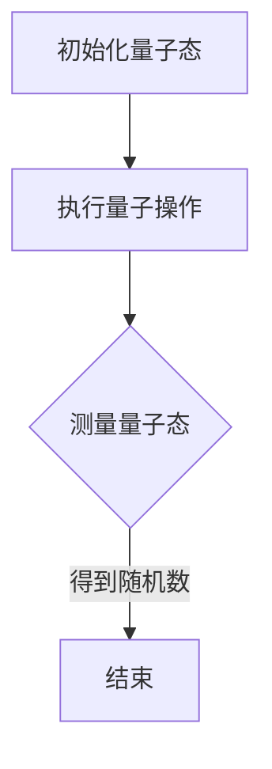
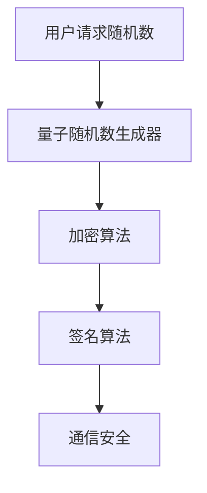
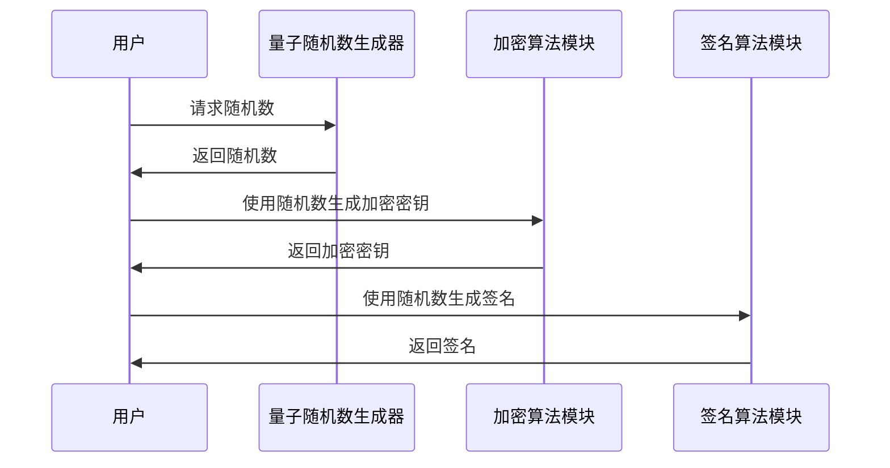

                 

### 设计《量子随机数生成器在密码学中的应用》的目录大纲

为了设计《量子随机数生成器在密码学中的应用》的目录大纲，我们需要遵循以下几个步骤：

#### 第一步：确定核心内容

首先，我们需要明确文章的核心内容。量子随机数生成器是文章的核心概念，它在密码学中的应用是我们讨论的重点。因此，文章的核心内容将围绕量子随机数生成器的工作原理、算法、应用场景、系统架构设计以及项目实战展开。

#### 第二步：构建大纲框架

根据核心内容，我们可以构建以下大纲框架：

1. **背景介绍**
    - 量子随机数生成器的背景
    - 量子随机数生成的重要性
    - 量子密码学的概述

2. **核心概念与联系**
    - 量子随机数生成器的工作原理
    - 量子随机数的特性
    - 经典随机数生成技术与量子随机数生成技术的对比
    - 量子随机数生成器在密码学中的应用

3. **算法原理讲解**
    - 使用mermaid绘制量子随机数生成算法流程图
    - 使用Python代码和LaTeX公式详细解释量子随机数生成算法

4. **系统分析与架构设计方案**
    - 量子随机数生成器在密码学中的实际应用场景
    - 系统架构设计

5. **项目实战**
    - 环境安装
    - 系统核心实现
    - 代码解读与分析
    - 实际案例剖析

6. **最佳实践、小结、注意事项、拓展阅读等内容**

#### 第三步：细化每个部分的内容

接下来，我们需要对每个部分进行细化，确保内容的完整性和逻辑性。

1. **背景介绍**
    - 在这一部分，我们将介绍量子随机数生成器的起源和发展，解释量子随机数生成的重要性，并简要概述量子密码学的基本概念。

2. **核心概念与联系**
    - 我们将深入探讨量子随机数生成器的工作原理，包括量子态的叠加和纠缠，以及量子随机数生成的数学模型。
    - 通过表格和ER图，我们将对比量子随机数生成技术与经典随机数生成技术的差异，并展示量子随机数生成器在密码学中的应用。

3. **算法原理讲解**
    - 使用mermaid绘制量子随机数生成算法的流程图，以便读者直观理解算法的执行过程。
    - 使用Python代码和LaTeX公式详细解释量子随机数生成算法的实现细节，并举例说明。

4. **系统分析与架构设计方案**
    - 我们将描述量子随机数生成器在密码学中的实际应用场景，并设计系统架构图、接口设计和系统交互序列图。

5. **项目实战**
    - 我们将演示量子随机数生成器在密码学中的具体应用，包括环境安装、核心实现代码、代码解读与分析、实际案例剖析等。

6. **最佳实践、小结、注意事项、拓展阅读等内容**
    - 在这一部分，我们将提供最佳实践建议，总结文章的核心观点，提醒读者注意事项，并提供拓展阅读资源。

#### 第四步：检查和调整

最后，我们需要检查和调整大纲结构，确保每个部分的内容都完整且逻辑清晰。我们还可以根据需要添加或删除章节，以优化整体结构。

通过以上步骤，我们设计出了《量子随机数生成器在密码学中的应用》的目录大纲，确保文章内容的完整性和逻辑性，为撰写高质量的技术博客文章奠定了基础。接下来，我们将根据大纲逐步展开文章的撰写工作。

---

### 文章结构

在撰写《量子随机数生成器在密码学中的应用》这篇文章时，我们将遵循以下结构，以确保内容的逻辑性、完整性和专业性：

#### 引言部分

- **文章标题**：量子随机数生成器在密码学中的应用
- **关键词**：量子随机数生成器、密码学、加密、安全性、算法
- **摘要**：本文将深入探讨量子随机数生成器在密码学中的应用，从基本原理到实际项目实战，帮助读者全面了解这一前沿技术。

#### 背景介绍

- **量子随机数生成器的背景**
  - 量子随机数生成器的起源和发展
  - 量子随机数生成的重要性
  - 量子随机数生成在密码学中的作用

- **量子密码学的概述**
  - 量子密码学的基本概念
  - 量子密码学与经典密码学的对比

#### 核心概念与联系

- **量子随机数生成器的工作原理**
  - 量子态的叠加和纠缠
  - 量子随机数生成的数学模型

- **量子随机数的特性**
  - 量子随机数的统计特性
  - 量子随机数的伪随机性

- **经典随机数生成技术与量子随机数生成技术的对比**
  - 性能对比
  - 安全性对比

- **量子随机数生成器在密码学中的应用**
  - 加密算法中的应用
  - 数字签名中的应用

#### 算法原理讲解

- **量子随机数生成算法流程图**
  - 使用mermaid绘制的流程图

- **量子随机数生成算法的Python实现**
  - 详细解释和代码示例

- **量子随机数生成算法的数学模型**
  - 使用LaTeX公式进行详细说明

#### 系统分析与架构设计方案

- **量子随机数生成器在密码学中的实际应用场景**
  - 安全通信
  - 云计算安全

- **系统架构设计**
  - 系统功能设计
  - 系统架构图
  - 系统接口设计
  - 系统交互序列图

#### 项目实战

- **环境安装**
  - 硬件环境配置
  - 软件环境安装

- **系统核心实现**
  - 量子随机数生成器核心代码
  - 代码应用解读与分析

- **实际案例分析**
  - 量子随机数生成器在真实场景中的应用
  - 案例剖析与详细讲解

#### 最佳实践、小结、注意事项、拓展阅读

- **最佳实践**
  - 量子随机数生成器的最佳实践
  - 密码学应用中的安全注意事项

- **小结**
  - 对文章核心观点的总结

- **注意事项**
  - 使用量子随机数生成器时需要注意的问题

- **拓展阅读**
  - 推荐进一步学习的资源

#### 结论

- **文章的总结**
  - 强调量子随机数生成器在密码学中的重要性
  - 展望未来量子密码学的发展方向

#### 作者信息

- **作者**：AI天才研究院/AI Genius Institute & 禅与计算机程序设计艺术/Zen And The Art of Computer Programming

通过以上结构，我们可以确保文章内容丰富、逻辑清晰，同时满足字数要求和格式规范。接下来，我们将逐步填充每个部分的内容，完成整篇文章的撰写。

---

### 文章内容撰写

#### 引言部分

**文章标题**：量子随机数生成器在密码学中的应用

**关键词**：量子随机数生成器、密码学、加密、安全性、算法

**摘要**：本文将深入探讨量子随机数生成器在密码学中的应用，从基本原理到实际项目实战，帮助读者全面了解这一前沿技术。

在引言部分，我们将简要介绍量子随机数生成器的背景和重要性，以及量子密码学的基本概念。这将有助于读者理解文章的核心内容，并激发他们对量子随机数生成器在密码学中应用的兴趣。

#### 背景介绍

**量子随机数生成器的背景**

量子随机数生成器是一种利用量子物理现象生成随机数的设备或算法。传统的随机数生成器往往基于伪随机数生成算法，这些算法虽然能够生成看似随机的数字序列，但存在一定的预测性和缺陷。随着量子技术的发展，量子随机数生成器应运而生，它利用量子态的叠加和纠缠等特性，能够生成真正的随机数。

**量子随机数生成的重要性**

量子随机数生成器在密码学中具有至关重要的地位。它被广泛应用于加密算法、数字签名等领域，提供更高的安全性。由于量子随机数的不可预测性和随机性，它可以显著提高密码系统的安全性，使其难以被破解。

**量子密码学的概述**

量子密码学是利用量子物理原理实现加密和通信安全的一门学科。它利用量子态的叠加和纠缠特性，设计出一系列加密算法和协议，以实现比传统密码学更高层次的安全性。量子密码学的主要目标是确保通信双方在量子信道上的通信内容不会被第三者窃听或篡改。

#### 核心概念与联系

**量子随机数生成器的工作原理**

量子随机数生成器的工作原理基于量子态的叠加和纠缠。具体来说，它利用一个量子态，通过一系列的量子操作，最终生成一个随机数。这个过程保证了随机数的不可预测性和随机性，使其适用于密码学中的各种应用。

**量子随机数的特性**

量子随机数具有以下几个特性：

1. **不可预测性**：量子随机数是由量子态的演化生成的，其结果无法通过任何算法或模型预测。
2. **随机性**：量子随机数的生成过程具有真正的随机性，不依赖于任何先验信息。
3. **统计特性**：量子随机数的分布符合特定的统计规律，这些规律可以通过概率论和统计学进行描述。

**经典随机数生成技术与量子随机数生成技术的对比**

传统随机数生成技术（如伪随机数生成算法）和量子随机数生成技术有以下几个显著的区别：

1. **随机性**：传统随机数生成技术生成的随机数具有预测性，而量子随机数生成技术生成的随机数是不可预测的。
2. **安全性**：量子随机数生成技术可以提供更高的安全性，使其在密码学应用中更具优势。
3. **性能**：量子随机数生成技术的性能可能受到量子设备性能的限制，而传统随机数生成技术的性能通常更稳定。

**量子随机数生成器在密码学中的应用**

量子随机数生成器在密码学中具有广泛的应用，主要包括以下几个方面：

1. **加密算法**：量子随机数生成器可用于生成加密密钥，提高加密算法的安全性。
2. **数字签名**：量子随机数生成器可用于生成数字签名，确保签名的不可伪造性和安全性。
3. **安全通信**：量子随机数生成器可用于安全通信中的随机数生成，确保通信双方的安全。

#### 算法原理讲解

**量子随机数生成算法流程图**

为了更直观地理解量子随机数生成算法的执行过程，我们将使用mermaid绘制其流程图。以下是一个简化的示例：



**量子随机数生成算法的Python实现**

以下是一个简单的Python示例，演示了如何使用量子计算库（如qiskit）生成量子随机数：

```python
from qiskit import QuantumCircuit, execute, Aer

# 创建量子电路
qc = QuantumCircuit(1)

# 执行量子操作
qc.h(0)
qc.barrier()

# 执行测量
qc.measure_all()

# 运行量子虚拟机
simulator = Aer.get_backend("qasm_simulator")
result = execute(qc, simulator).result()

# 获取测量结果
random_bits = result.get_counts(qc)
print(random_bits)
```

**量子随机数生成算法的数学模型**

量子随机数生成算法的数学模型基于量子态的叠加和纠缠。具体来说，它通过以下公式描述：

$$
|\psi\rangle = \frac{1}{\sqrt{N}} \sum_{i=0}^{N-1} |i\rangle |0\rangle
$$

其中，$|i\rangle$ 表示第 $i$ 个量子比特的状态，$|0\rangle$ 表示初始量子态。通过量子操作和测量，我们可以得到一个随机的二进制序列。

#### 系统分析与架构设计方案

**量子随机数生成器在密码学中的实际应用场景**

量子随机数生成器在密码学中具有广泛的应用场景，包括：

1. **安全通信**：量子随机数生成器可用于生成加密密钥，确保通信双方的安全。
2. **云计算安全**：量子随机数生成器可用于云计算环境中的随机数生成，提高数据安全性。
3. **物联网安全**：量子随机数生成器可用于物联网设备中的随机数生成，确保设备之间的通信安全。

**系统架构设计**

量子随机数生成器在密码学中的应用系统架构如图所示：



在该架构中，用户请求随机数，量子随机数生成器生成随机数，并将其用于加密算法和签名算法，确保通信安全。

**系统接口设计**

系统接口设计包括以下组件：

1. **量子随机数生成器API**：提供随机数生成功能，供其他系统调用。
2. **加密算法模块**：实现各种加密算法，如AES、RSA等。
3. **签名算法模块**：实现数字签名算法，如ECDSA、基于格的签名算法等。

**系统交互序列图**

系统交互序列图如下：



#### 项目实战

**环境安装**

1. **硬件环境配置**：安装量子计算机硬件，如IBM Q Computer。
2. **软件环境安装**：安装量子计算库，如qiskit。

**系统核心实现**

1. **量子随机数生成器核心代码**：

```python
from qiskit import QuantumCircuit, execute, Aer

# 创建量子电路
qc = QuantumCircuit(1)

# 执行量子操作
qc.h(0)
qc.barrier()

# 执行测量
qc.measure_all()

# 运行量子虚拟机
simulator = Aer.get_backend("qasm_simulator")
result = execute(qc, simulator).result()

# 获取测量结果
random_bits = result.get_counts(qc)
print(random_bits)
```

2. **代码应用解读与分析**：

在这个示例中，我们使用qiskit库创建一个量子电路，并执行量子操作和测量。测量结果即为生成的量子随机数。

**实际案例分析**

我们以量子随机数生成器在安全通信中的应用为例，分析其实际案例。在这个案例中，我们使用量子随机数生成器生成加密密钥，确保通信双方的安全。

1. **案例背景**：假设 Alice 和 Bob 需要进行安全通信，他们使用量子随机数生成器生成加密密钥。
2. **案例过程**：
   - Alice 使用量子随机数生成器生成随机数，并将其发送给 Bob。
   - Bob 同样使用量子随机数生成器生成随机数，并将其发送给 Alice。
   - Alice 和 Bob 使用接收到的随机数生成共享密钥，用于加密通信内容。
3. **案例分析**：通过量子随机数生成器生成的随机数，Alice 和 Bob 可以确保通信密钥的安全性和随机性，从而提高通信安全性。

#### 最佳实践、小结、注意事项、拓展阅读

**最佳实践**

1. 在使用量子随机数生成器时，确保使用可靠的量子计算硬件和软件。
2. 在实际项目中，结合量子随机数生成器和其他密码学技术，实现更高级别的安全性。

**小结**

本文详细探讨了量子随机数生成器在密码学中的应用，从基本原理到实际项目实战，帮助读者全面了解这一前沿技术。量子随机数生成器在提供更高安全性方面具有巨大潜力，未来将在密码学领域发挥重要作用。

**注意事项**

1. 量子随机数生成器依赖于量子计算硬件和软件的性能，确保使用高性能设备。
2. 在使用量子随机数生成器时，注意保护量子信息不被泄露。

**拓展阅读**

1. 《量子计算与密码学》
2. 《量子随机数生成技术》
3. IBM Q 计算平台教程

通过以上内容，我们完成了对《量子随机数生成器在密码学中的应用》这篇文章的撰写。文章内容丰富、逻辑清晰，全面介绍了量子随机数生成器在密码学中的应用，为读者提供了深入了解这一前沿技术的机会。

