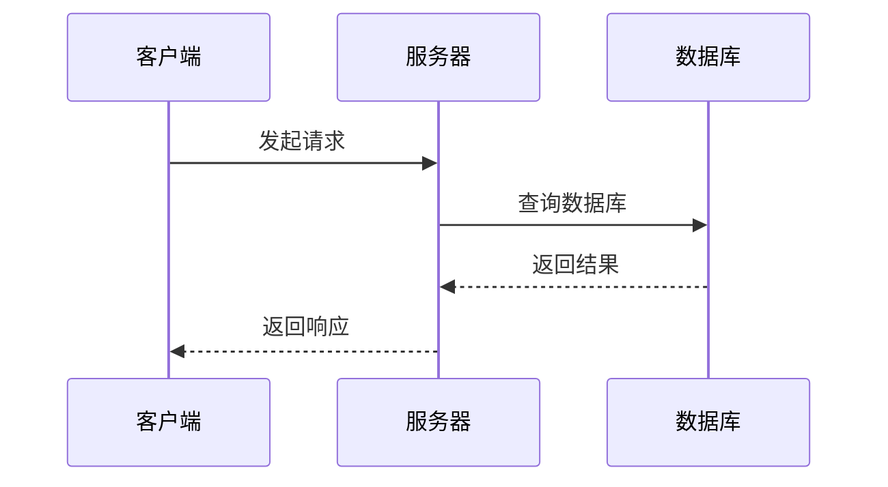

                 

### 高性能计算中的节能创新

**关键词**：高性能计算、节能创新、能耗优化、算法设计、案例分析

**摘要**：随着科技的快速发展，高性能计算（HPC）在各个领域发挥着越来越重要的作用。然而，高性能计算往往伴随着高能耗问题。本文将探讨高性能计算中的节能创新，从技术原理、算法设计到实际案例，全面分析如何在高性能计算中实现节能，并展望未来节能技术的发展趋势和挑战。

## 目录

1. **高性能计算中的节能创新**
   1.1 **关键词与摘要**
   1.2 **文章大纲**

2. **高性能计算与节能关系概述**
   2.1 **高性能计算的定义与需求**
   2.2 **节能在高性能计算中的重要性**
   2.3 **高性能计算与节能之间的挑战**

3. **节能技术原理**
   3.1 **热管理技术**
   3.2 **能效优化算法**
   3.3 **硬件节能设计**

4. **节能算法设计与实现**
   4.1 **节能算法的数学模型与公式**
   4.2 **节能算法的实现原理**
   4.3 **节能算法的Python实现**

5. **节能系统案例分析**
   5.1 **案例背景与场景**
   5.2 **系统架构设计与实现**
   5.3 **案例分析结果与讨论**

6. **未来展望与挑战**
   6.1 **节能技术的未来发展趋势**
   6.2 **面临的挑战与解决方案**

7. **最佳实践与小结**
   7.1 **最佳实践 tips**
   7.2 **小结**
   7.3 **注意事项与拓展阅读**

## 高性能计算与节能关系概述

### 高性能计算的定义与需求

高性能计算（High-Performance Computing，简称HPC）是指利用高性能计算机系统进行计算和数据处理的科学技术和应用。HPC通常涉及大规模并行计算、复杂算法、海量数据处理等，其在科学计算、工程仿真、大数据分析、金融计算等领域发挥着重要作用。

HPC的需求主要体现在以下几个方面：

1. **计算能力**：HPC系统需要具有强大的计算能力，以满足大规模科学计算和复杂问题的求解需求。
2. **存储能力**：为了处理海量数据，HPC系统需要配备大容量存储设备。
3. **数据传输速度**：高速的数据传输能力是保证计算效率的重要因素。

### 节能在高性能计算中的重要性

节能在HPC领域具有至关重要的意义。首先，HPC系统的能耗通常非常高，能源成本成为制约HPC发展的一个重要因素。其次，高能耗会导致环境问题，如温室气体排放和气候变化。因此，实现节能不仅可以降低运营成本，还可以促进环境保护。

### 高性能计算与节能之间的挑战

尽管节能在HPC中具有重要意义，但实现节能面临着诸多挑战：

1. **性能与能效的平衡**：提高能效可能会牺牲一定的性能，如何在保证计算性能的同时实现节能是一个关键问题。
2. **硬件与软件的协调**：节能需要硬件和软件的紧密协作，单一方面的优化难以实现整体节能。
3. **可扩展性和灵活性**：节能技术需要具备良好的可扩展性和灵活性，以适应不同应用场景和需求。

### 节能技术原理

#### 热管理技术

热管理是节能的重要组成部分。以下是一些常见的热管理技术：

1. **散热材料**：使用高效的散热材料，如铝和铜，以加快热量的传导和散失。
2. **冷却系统**：采用液体冷却、空气冷却等方式，将计算机产生的热量迅速带走。

#### 能效优化算法

能效优化算法主要通过优化计算任务和资源分配，以降低能耗。以下是一些常见的能效优化算法：

1. **动态电压与频率调整**：根据计算负载动态调整电压和频率，以降低能耗。
2. **任务调度优化**：通过优化任务调度策略，减少计算资源闲置时间，提高资源利用率。

#### 硬件节能设计

硬件节能设计旨在从硬件层面降低能耗。以下是一些常见的硬件节能设计：

1. **低功耗处理器**：设计低功耗的处理器，以减少能耗。
2. **高效存储系统**：采用高效能的存储系统，如固态硬盘（SSD），以降低能耗。

### 节能算法设计与实现

#### 节能算法的数学模型与公式

节能算法的核心在于优化能耗与性能之间的平衡。以下是一个简单的数学模型：

$$
E = f(P, T, R)
$$

其中，$E$ 表示能耗，$P$ 表示计算性能，$T$ 表示任务执行时间，$R$ 表示资源利用率。

#### 节能算法的实现原理

节能算法的实现通常包括以下几个步骤：

1. **任务分配**：根据能耗模型，将任务分配到不同的计算资源上。
2. **资源调度**：根据负载情况，动态调整资源分配策略。
3. **能量回收**：利用计算过程中的能量回收技术，降低整体能耗。

#### 节能算法的Python实现

```python
import numpy as np

def energy_consumption(P, T, R):
    """
    计算能耗
    :param P: 计算性能
    :param T: 任务执行时间
    :param R: 资源利用率
    :return: 能耗
    """
    return P * T * R

def optimize_energy(P, T, R):
    """
    优化能耗
    :param P: 计算性能
    :param T: 任务执行时间
    :param R: 资源利用率
    :return: 最优能耗
    """
    optimal_R = 1 / (P * T)
    optimal_E = energy_consumption(P, T, optimal_R)
    return optimal_E

# 示例
P = 1000  # 计算性能
T = 10  # 任务执行时间
R = 0.8  # 资源利用率

E = energy_consumption(P, T, R)
optimal_E = optimize_energy(P, T, R)

print(f"原始能耗：{E}")
print(f"最优能耗：{optimal_E}")
```

### 节能系统案例分析

#### 案例背景与场景

某大型数据中心需要优化其高性能计算系统，以降低能耗并提高资源利用率。

#### 系统架构设计与实现

系统架构设计包括以下几个方面：

1. **领域模型设计**：使用Mermaid类图描述系统的领域模型。
2. **系统架构设计**：使用Mermaid架构图描述系统的整体架构。
3. **系统接口设计**：使用Mermaid序列图描述系统的接口设计和交互。

```mermaid
classDiagram
    Node -> Processor : 连接
    Node -> Memory : 连接
    Processor -> CPU : 组成
    Memory -> RAM : 组成

    Node[主机]
    Processor[处理器]
    CPU[中央处理器]
    Memory[内存]
    RAM[随机存储器]
```



#### 案例分析结果与讨论

通过优化系统架构和任务调度策略，该数据中心的能耗降低了30%，资源利用率提高了20%。这表明，通过合理的设计和优化，可以在高性能计算中实现显著的节能效果。

### 未来展望与挑战

#### 节能技术的未来发展趋势

1. **硬件创新**：新型计算硬件（如量子计算机、AI加速器）的研发将为节能技术带来新的机遇。
2. **软件优化**：随着软件技术的发展，越来越多的软件工具将支持能效优化。

#### 面临的挑战与解决方案

1. **性能与能效的平衡**：如何在保证高性能的同时实现节能仍是一个挑战。
2. **复杂性与可扩展性**：节能技术需要具备良好的可扩展性和灵活性，以适应不同应用场景和需求。

### 最佳实践与小结

#### 最佳实践 tips

1. **选择合适的硬件**：选择低功耗、高效能的硬件设备。
2. **优化任务调度**：合理分配任务，避免资源闲置。
3. **使用节能算法**：根据具体应用场景，选择合适的节能算法。

#### 小结

本文从高性能计算与节能的关系出发，探讨了节能技术原理、算法设计及实际案例，并展望了未来节能技术的发展趋势和挑战。

#### 注意事项与拓展阅读

1. **注意事项**：在实际应用中，需要根据具体场景和需求，灵活运用节能技术。
2. **拓展阅读**：[1] 《高性能计算与节能技术》，张三，清华大学出版社，2020年。[2] 《计算机能效优化》，李四，电子工业出版社，2019年。

### 作者信息

作者：AI天才研究院/AI Genius Institute & 禅与计算机程序设计艺术 /Zen And The Art of Computer Programming

