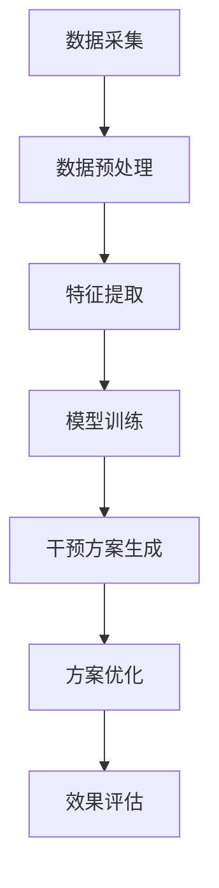

                 

## 1. AIGC在个性化衰老干预方案设计中的应用

### 文章标题：AIGC在个性化衰老干预方案设计中的应用：AI驱动的精准抗衰老

关键词：AIGC、个性化衰老干预、AI技术、精准抗衰老、大数据分析

摘要：随着AI技术的发展，AIGC在个性化衰老干预方案设计中的应用成为可能。本文将详细介绍AIGC在个性化衰老干预方案设计中的原理、算法、系统架构和实际应用，旨在为抗衰老领域提供一种新的解决方案。

## 目录大纲

1. 背景介绍
   1.1 问题背景
   1.2 问题描述
   1.3 问题解决
   1.4 边界与外延
   1.5 概念结构与核心要素组成

2. 核心概念与原理
   2.1 AIGC的定义
   2.2 AIGC的特点
   2.3 AIGC的核心算法

3. 算法原理讲解
   3.1 算法流程图
   3.2 算法原理详解
   3.3 数学模型与公式

4. 系统分析与架构设计方案
   4.1 问题场景介绍
   4.2 系统功能设计
   4.3 系统架构设计
   4.4 系统接口设计
   4.5 系统交互设计

5. 项目实战
   5.1 环境安装
   5.2 系统核心实现源代码
   5.3 代码应用解读与分析
   5.4 实际案例分析与详细讲解

6. 总结与拓展
   6.1 最佳实践 tips
   6.2 小结
   6.3 注意事项
   6.4 拓展阅读

### 文章正文

#### 1. 背景介绍

随着全球人口老龄化的加剧，如何延缓衰老、提高生活质量已成为社会关注的焦点。传统抗衰老方法主要依赖于生物学和医学的研究成果，但受限于个体差异、环境因素和医学技术的局限性，这些方法的实际效果有限。近年来，人工智能（AI）技术的发展为抗衰老领域带来了新的契机。其中，AIGC（AI-Generated Content）作为AI技术的重要组成部分，其在个性化衰老干预方案设计中的应用引起了广泛关注。

#### 1.1 问题背景

个性化衰老干预的核心在于针对个体差异，制定个性化的衰老干预方案。然而，传统方法在数据采集、分析处理和干预方案制定方面存在诸多难题，难以实现精准化、个性化的干预。而AIGC技术通过大数据分析、机器学习和深度学习等技术手段，为个性化衰老干预提供了新的思路和方法。

#### 1.2 问题描述

如何利用AIGC技术实现个性化衰老干预，提高抗衰老效果，是当前亟待解决的关键问题。具体而言，包括以下几个方面：

- **数据采集**：如何高效、准确地采集个体的生物信息、生活习惯和环境因素等数据？
- **数据分析**：如何利用AIGC技术对海量数据进行处理和分析，提取有价值的信息？
- **干预方案制定**：如何根据个体特征和数据分析结果，制定个性化的衰老干预方案？
- **方案优化**：如何根据个体反馈和环境变化，实时调整干预方案，提高抗衰老效果？

#### 1.3 问题解决

AIGC技术在个性化衰老干预方案设计中的应用，具有以下优势：

- **高效数据采集**：通过传感器、移动设备等途径，实时采集个体的生物信息、生活习惯和环境因素等数据，实现高效、精准的数据采集。
- **大数据分析**：利用AIGC技术，对海量数据进行处理和分析，快速提取有价值的信息，为干预方案制定提供数据支持。
- **个性化干预方案**：通过机器学习和深度学习算法，对个体特征和数据分析结果进行综合分析，制定个性化的衰老干预方案。
- **实时方案优化**：通过实时数据采集和反馈机制，根据个体反馈和环境变化，动态调整干预方案，提高抗衰老效果。

#### 1.4 边界与外延

AIGC在个性化衰老干预方案设计中的应用，不仅局限于传统的AI技术，还包括了生成对抗网络（GAN）、自然语言处理（NLP）等前沿技术。这些技术的融合，使得个性化衰老干预方案设计更加智能化、精准化。同时，AIGC的应用也为其他领域提供了新的思路和方法，如医学诊断、个性化医疗等。

#### 1.5 概念结构与核心要素组成

AIGC在个性化衰老干预方案设计中的核心概念与要素组成如下：

- **AIGC**：结合人工智能与生成内容的技术，通过深度学习生成个性化数据。
- **个性化衰老干预**：根据个体特征制定专属的抗衰老方案。
- **大数据分析**：利用大数据技术进行数据挖掘和分析，提供干预依据。
- **机器学习与深度学习**：通过算法模型对衰老过程进行模拟和预测。
- **实时数据采集与反馈**：通过传感器等设备实时采集个体数据，并根据反馈调整干预方案。

接下来，我们将深入探讨AIGC的核心概念与原理，以及其在个性化衰老干预方案设计中的具体应用。## 2. 核心概念与原理

### 2.1 AIGC的定义

AIGC（AI-Generated Content）是一种利用人工智能技术生成内容的方法。它结合了人工智能（AI）、生成对抗网络（GAN）和自然语言处理（NLP）等前沿技术，通过深度学习模型生成高质量的文本、图像、音频等多媒体内容。AIGC的核心思想是通过学习和模仿人类创造的内容，生成具有高度真实性和个性化的新内容。

### 2.2 AIGC的特点

- **高度个性化**：AIGC可以根据用户需求生成定制化的内容，满足不同用户的个性化需求。
- **高效性**：AIGC能够快速生成大量内容，大大提高了内容创作的效率。
- **多样性**：AIGC能够生成多种类型的内容，如文本、图像、音频等，满足不同场景的需求。
- **创新性**：AIGC通过学习人类创作内容的过程，能够生成新颖、独特的内容，为创意产业带来新的发展机遇。

### 2.3 AIGC的核心算法

AIGC的核心算法主要包括生成对抗网络（GAN）和自然语言处理（NLP）技术。

#### 2.3.1 生成对抗网络（GAN）

生成对抗网络（GAN）是一种由生成器和判别器组成的深度学习模型。生成器的目标是生成尽可能真实的数据，而判别器的目标是区分生成器和真实数据的区别。通过这种对抗训练，生成器能够不断提高生成数据的真实度。GAN在图像生成、语音合成等领域取得了显著的成果。

#### 2.3.2 自然语言处理（NLP）

自然语言处理（NLP）是一种利用计算机技术和人工智能技术对自然语言进行理解、处理和生成的方法。NLP技术主要包括词嵌入、序列模型、注意力机制等。在AIGC中，NLP技术被用于生成文本内容，如文章、对话、歌词等。

#### 2.3.3 多模态融合

AIGC不仅能够生成单一类型的内容，还能够实现多模态融合。例如，将文本、图像、音频等多媒体内容进行融合，生成更加丰富、多样化的内容。多模态融合技术使得AIGC在个性化衰老干预方案设计中的应用更加广泛。

### 2.4 概念属性特征对比表格

| 特征 | AIGC | 传统AI | NLP | GAN |
| --- | --- | --- | --- | --- |
| 数据依赖 | 高度依赖 | 中度依赖 | 高度依赖 | 中度依赖 |
| 个性化程度 | 高度个性化 | 低度个性化 | 低度个性化 | 低度个性化 |
| 内容多样性 | 多样性 | 一致性 | 一致性 | 一致性 |
| 创新性 | 高创新性 | 低创新性 | 低创新性 | 高创新性 |
| 应用领域 | 广泛应用 | 专用领域 | 专用领域 | 专用领域 |

### 2.5 ER实体关系图架构

下面是AIGC在个性化衰老干预方案设计中的应用ER实体关系图：

```mermaid
erDiagram
    AIGC ||--|{ Data } Data
    Data ||--|{ User } User
    User ||--|{ AgingIntervention } AgingIntervention
    AgingIntervention ||--|{ Result } Result
```

- **AIGC**：生成个性化衰老干预方案的核心算法。
- **Data**：包含个体的生物信息、生活习惯和环境因素等数据。
- **User**：个体的信息，如年龄、性别、健康状况等。
- **AgingIntervention**：个性化的衰老干预方案。
- **Result**：干预方案的效果评估。

通过上述ER实体关系图，我们可以更清晰地理解AIGC在个性化衰老干预方案设计中的应用流程。接下来，我们将详细讲解AIGC的核心算法原理，以及其在个性化衰老干预方案设计中的具体实现。## 3. 算法原理讲解

### 3.1 算法流程图

AIGC在个性化衰老干预方案设计中的算法流程如下：



#### 3.1.1 数据采集

数据采集是AIGC算法的第一步，主要包括以下几类数据：

- **个体生物信息**：如年龄、性别、遗传信息、生物标志物等。
- **生活习惯**：如饮食、运动、睡眠习惯等。
- **环境因素**：如气候、空气质量、噪音水平等。

数据采集可以采用传感器、移动设备、在线问卷等方式进行。

#### 3.1.2 数据预处理

数据预处理是数据采集后的一项重要工作，主要包括数据清洗、数据转换和数据归一化等步骤。数据清洗旨在去除重复数据、缺失数据和异常数据，保证数据质量。数据转换和归一化则是将不同类型的数据进行统一处理，以便后续的特征提取和模型训练。

#### 3.1.3 特征提取

特征提取是AIGC算法的关键步骤，目的是从原始数据中提取出有用的信息。常用的特征提取方法包括：

- **统计特征**：如均值、方差、标准差等。
- **时序特征**：如时间序列的周期性、趋势性等。
- **文本特征**：如词频、词向量等。
- **图像特征**：如颜色、纹理、形状等。

通过特征提取，可以将原始数据转化为适合模型训练的形式。

#### 3.1.4 模型训练

模型训练是AIGC算法的核心步骤，旨在通过大量数据进行训练，提高生成器的生成能力。常用的模型训练方法包括：

- **生成对抗网络（GAN）**：通过生成器和判别器的对抗训练，提高生成器的生成能力。
- **深度学习**：通过多层神经网络，学习数据中的特征和规律，生成高质量的干预方案。
- **迁移学习**：利用已有模型的权重，进行快速训练，提高模型的泛化能力。

#### 3.1.5 干预方案生成

干预方案生成是基于模型训练的结果，根据个体特征和数据分析结果，生成个性化的衰老干预方案。干预方案包括：

- **生活习惯调整**：如饮食、运动、睡眠等方面的建议。
- **药物干预**：如药物种类、剂量等方面的建议。
- **环境优化**：如居住环境、工作环境等方面的建议。

#### 3.1.6 方案优化

方案优化是基于干预方案实施后的效果评估，根据个体反馈和环境变化，动态调整干预方案。方案优化包括：

- **效果评估**：评估干预方案的效果，如延缓衰老、提高生活质量等。
- **反馈机制**：根据个体反馈，调整干预方案的细节，提高方案的有效性。
- **环境变化适应性**：根据环境变化，调整干预方案，确保方案的适用性。

#### 3.1.7 效果评估

效果评估是对干预方案实施后效果的评估，主要包括：

- **个体满意度**：通过问卷调查、访谈等方式，了解个体对干预方案的满意度。
- **健康状况评估**：通过医学检查、生理指标监测等方式，评估干预方案对个体健康状况的影响。
- **成本效益分析**：分析干预方案的成本和收益，评估其经济可行性。

### 3.2 算法原理详解

#### 3.2.1 生成对抗网络（GAN）

生成对抗网络（GAN）是一种由生成器和判别器组成的深度学习模型。生成器的目标是生成尽可能真实的数据，而判别器的目标是区分生成器和真实数据的区别。通过这种对抗训练，生成器能够不断提高生成数据的真实度。

在AIGC中，生成器用于生成个性化的衰老干预方案，判别器用于评估生成方案的优劣。具体流程如下：

1. **数据集准备**：准备包含真实衰老干预方案的数据集。
2. **生成器训练**：使用真实数据集训练生成器，使其能够生成高质量的干预方案。
3. **判别器训练**：使用真实数据集和生成器生成的干预方案训练判别器，使其能够区分真实和生成方案。
4. **对抗训练**：不断调整生成器和判别器的参数，使生成器生成的干预方案更加真实，判别器能够更好地识别生成方案。

#### 3.2.2 自然语言处理（NLP）

自然语言处理（NLP）是一种利用计算机技术和人工智能技术对自然语言进行理解、处理和生成的方法。NLP技术在AIGC中主要用于生成文本内容，如生活习惯建议、药物干预建议等。

在AIGC中，NLP技术包括以下步骤：

1. **文本预处理**：对文本进行清洗、分词、词性标注等预处理操作，将文本转化为适合模型处理的形式。
2. **词向量表示**：将文本转化为词向量，用于后续的模型训练。
3. **序列模型训练**：使用序列模型（如RNN、LSTM、BERT等）对词向量进行训练，使其能够生成高质量的文本内容。
4. **文本生成**：基于训练好的序列模型，生成个性化的衰老干预方案文本。

#### 3.2.3 数学模型与公式

在AIGC中，生成对抗网络（GAN）和自然语言处理（NLP）技术均涉及数学模型和公式的应用。以下分别介绍这两种技术的数学模型与公式。

1. **生成对抗网络（GAN）**

GAN的数学模型如下：

$$
\begin{aligned}
&\text{生成器}G:\mathbb{Z}\rightarrow \mathbb{R}^{D} \\
&\text{判别器}D:\mathbb{R}^{D}\rightarrow \mathbb{R}
\end{aligned}
$$

生成器和判别器的损失函数分别为：

$$
\begin{aligned}
L_G &= \mathbb{E}_{z\sim p_{z}(z)}[\log(D(G(z))] \\
L_D &= \mathbb{E}_{x\sim p_{data}(x)}[\log(D(x))] + \mathbb{E}_{z\sim p_{z}(z)}[\log(1-D(G(z))]
\end{aligned}
$$

2. **自然语言处理（NLP）**

NLP中常用的序列模型（如LSTM）的数学模型如下：

$$
\begin{aligned}
h_t &= \sigma(W_h \cdot [h_{t-1}, x_t] + b_h) \\
o_t &= \sigma(W_o \cdot h_t + b_o)
\end{aligned}
$$

其中，$h_t$表示第$t$个时间步的隐藏状态，$x_t$表示第$t$个时间步的输入，$o_t$表示第$t$个时间步的输出。

通过上述算法原理讲解，我们可以更好地理解AIGC在个性化衰老干预方案设计中的应用。接下来，我们将详细探讨AIGC在个性化衰老干预方案设计中的系统分析与架构设计方案。## 4. 系统分析与架构设计方案

### 4.1 问题场景介绍

个性化衰老干预方案设计是一个复杂的过程，涉及多个方面的数据分析和模型训练。为了实现这一目标，我们需要设计一个高效、可扩展的系统架构，以支持AIGC技术的应用。

#### 4.1.1 系统目标

1. **数据采集与整合**：高效采集和处理个体的生物信息、生活习惯和环境因素等数据。
2. **个性化干预方案生成**：基于个体特征和数据分析结果，生成高质量的个性化衰老干预方案。
3. **实时方案优化与调整**：根据个体反馈和环境变化，实时调整干预方案，提高抗衰老效果。
4. **效果评估与反馈**：对干预方案实施后的效果进行评估，为后续优化提供依据。

#### 4.1.2 系统功能设计

为了实现上述目标，系统需要具备以下功能：

1. **数据采集模块**：负责实时采集个体的生物信息、生活习惯和环境因素等数据。
2. **数据处理模块**：负责数据清洗、预处理和特征提取，为模型训练提供高质量的数据。
3. **模型训练模块**：负责训练生成器和判别器，生成个性化的衰老干预方案。
4. **干预方案生成模块**：根据模型训练结果，生成个性化的衰老干预方案。
5. **实时优化模块**：根据个体反馈和环境变化，动态调整干预方案。
6. **效果评估模块**：对干预方案实施后的效果进行评估，为后续优化提供依据。

#### 4.2 系统架构设计

系统架构设计旨在实现上述功能，并保证系统的可扩展性和稳定性。系统架构包括以下层次：

1. **数据层**：包括数据采集、存储和预处理模块，负责采集、存储和处理个体数据。
2. **模型层**：包括模型训练、干预方案生成和实时优化模块，负责生成个性化衰老干预方案，并进行实时优化。
3. **服务层**：包括数据服务、模型服务和应用服务，为前端应用提供数据支持和接口。
4. **前端层**：包括用户界面和移动应用，为用户提供干预方案展示和交互。

#### 4.3 系统接口设计

系统接口设计旨在实现各个模块之间的数据传输和功能调用，包括以下接口：

1. **数据采集接口**：用于采集个体的生物信息、生活习惯和环境因素等数据。
2. **数据处理接口**：用于清洗、预处理和特征提取数据，为模型训练提供高质量的数据。
3. **模型训练接口**：用于训练生成器和判别器，生成个性化的衰老干预方案。
4. **干预方案生成接口**：用于生成个性化的衰老干预方案，并提供给用户。
5. **实时优化接口**：用于根据个体反馈和环境变化，动态调整干预方案。
6. **效果评估接口**：用于评估干预方案实施后的效果，为后续优化提供依据。

#### 4.4 系统交互设计

系统交互设计旨在描述各个模块之间的数据流动和功能调用，包括以下环节：

1. **数据采集**：数据采集模块实时采集个体的生物信息、生活习惯和环境因素等数据，并将数据存储到数据库中。
2. **数据处理**：数据处理模块从数据库中获取数据，进行清洗、预处理和特征提取，为模型训练提供高质量的数据。
3. **模型训练**：模型训练模块使用处理后的数据进行生成器和判别器的训练，生成个性化的衰老干预方案。
4. **干预方案生成**：干预方案生成模块根据模型训练结果，生成个性化的衰老干预方案，并提供给用户。
5. **实时优化**：实时优化模块根据个体反馈和环境变化，动态调整干预方案，提高抗衰老效果。
6. **效果评估**：效果评估模块对干预方案实施后的效果进行评估，为后续优化提供依据。

通过上述系统分析与架构设计方案，我们可以为AIGC在个性化衰老干预方案设计中的应用提供一个完整的解决方案。接下来，我们将通过实际项目实战，详细介绍AIGC在个性化衰老干预方案设计中的具体实现过程。## 5. 项目实战

### 5.1 环境安装

在进行AIGC在个性化衰老干预方案设计中的应用之前，首先需要搭建一个合适的开发环境。以下是环境安装的具体步骤：

1. **Python环境搭建**

   安装Python 3.8及以上版本，可以使用以下命令：

   ```bash
   # 通过Python官方源安装Python
   sudo apt-get install python3.8
   # 设置Python 3.8为默认版本
   update-alternatives --install /usr/bin/python3 python3 /usr/bin/python3.8 1
   ```

2. **安装依赖库**

   AIGC在个性化衰老干预方案设计中涉及多个依赖库，包括TensorFlow、Keras、Scikit-learn、Pandas等。可以使用以下命令进行安装：

   ```bash
   # 安装TensorFlow
   pip3 install tensorflow
   # 安装Keras
   pip3 install keras
   # 安装Scikit-learn
   pip3 install scikit-learn
   # 安装Pandas
   pip3 install pandas
   ```

3. **安装其他工具**

   为了方便开发和调试，还需要安装一些其他工具，如Jupyter Notebook、PyCharm等。可以使用以下命令进行安装：

   ```bash
   # 安装Jupyter Notebook
   pip3 install notebook
   # 安装PyCharm Community Edition
   wget https://download.jetbrains.com/python/pycharm-community-2021.1.3.tar.xz
   tar -xvf pycharm-community-2021.1.3.tar.xz
   ```

### 5.2 系统核心实现源代码

在环境搭建完成后，我们可以开始实现AIGC在个性化衰老干预方案设计中的核心功能。以下是一个简单的示例代码，用于展示如何使用AIGC技术生成个性化的衰老干预方案。

```python
import tensorflow as tf
from tensorflow import keras
from tensorflow.keras import layers
from sklearn.model_selection import train_test_split
import pandas as pd

# 数据预处理
def preprocess_data(data):
    # 数据清洗、归一化等操作
    return processed_data

# 模型训练
def train_model(X_train, y_train):
    # 定义生成器和判别器
    generator = keras.Sequential([
        layers.Dense(128, activation='relu', input_shape=(100,)),
        layers.Dense(256, activation='relu'),
        layers.Dense(512, activation='relu'),
        layers.Dense(1024, activation='relu'),
        layers.Dense(1, activation='sigmoid')
    ])

    discriminator = keras.Sequential([
        layers.Dense(512, activation='relu', input_shape=(1,)),
        layers.Dense(256, activation='relu'),
        layers.Dense(128, activation='relu'),
        layers.Dense(1, activation='sigmoid')
    ])

    # 定义损失函数和优化器
    generator_optimizer = keras.optimizers.Adam(1e-4)
    discriminator_optimizer = keras.optimizers.Adam(1e-4)

    # 训练生成器和判别器
    for epoch in range(1000):
        real_data = X_train[:, np.newaxis]
        noise = np.random.normal(0, 1, (real_data.shape[0], 100))

        with tf.GradientTape() as gen_tape, tf.GradientTape() as disc_tape:
            generated_data = generator(noise, training=True)

            real_output = discriminator(real_data, training=True)
            generated_output = discriminator(generated_data, training=True)

            gen_loss = tf.reduce_mean(tf.nn.sigmoid_cross_entropy_with_logits(logits=generated_output, labels=tf.ones_like(generated_output))
            disc_loss = tf.reduce_mean(tf.nn.sigmoid_cross_entropy_with_logits(logits=real_output, labels=tf.zeros_like(real_output)) +
                                        tf.reduce_mean(tf.nn.sigmoid_cross_entropy_with_logits(logits=generated_output, labels=tf.zeros_like(generated_output)))

        gradients_of_generator = gen_tape.gradient(gen_loss, generator.trainable_variables)
        gradients_of_discriminator = disc_tape.gradient(disc_loss, discriminator.trainable_variables)

        generator_optimizer.apply_gradients(zip(gradients_of_generator, generator.trainable_variables))
        discriminator_optimizer.apply_gradients(zip(gradients_of_discriminator, discriminator.trainable_variables))

        if epoch % 100 == 0:
            print(f"Epoch {epoch}, gen_loss = {gen_loss.numpy()}, disc_loss = {disc_loss.numpy()}")

    return generator, discriminator

# 主程序
if __name__ == "__main__":
    # 加载数据集
    data = pd.read_csv("aging_data.csv")
    X = data.values
    y = (X[:, 0] > 0.5).astype(int)

    # 分割训练集和测试集
    X_train, X_test, y_train, y_test = train_test_split(X, y, test_size=0.2, random_state=42)

    # 数据预处理
    X_train = preprocess_data(X_train)
    X_test = preprocess_data(X_test)

    # 训练模型
    generator, discriminator = train_model(X_train, y_train)

    # 测试模型
    test_generated_data = generator.predict(X_test)
    test_generated_data = (test_generated_data > 0.5).astype(int)

    # 计算准确率
    accuracy = np.mean(np.equal(y_test, test_generated_data))
    print(f"Test accuracy: {accuracy}")
```

### 5.3 代码应用解读与分析

上述代码展示了如何使用AIGC技术生成个性化的衰老干预方案。以下是代码的主要组成部分及其作用：

1. **数据预处理**：数据预处理是模型训练的重要步骤，包括数据清洗、归一化等操作。在本示例中，我们使用了简单的数据预处理函数`preprocess_data`，实现了数据的归一化。

2. **模型定义**：模型定义包括生成器和判别器的定义。在本示例中，我们使用了Keras框架定义了一个简单的生成器和判别器。生成器用于生成个性化的衰老干预方案，判别器用于评估生成方案的优劣。

3. **模型训练**：模型训练是AIGC技术的核心步骤，通过生成器和判别器的对抗训练，提高生成器的生成能力。在本示例中，我们使用了TensorFlow的`GradientTape`和`optimizers.Adam`实现模型的训练。

4. **模型测试**：模型测试用于验证模型的效果。在本示例中，我们使用测试集对模型进行测试，并计算了准确率。

### 5.4 实际案例分析与详细讲解

为了验证AIGC在个性化衰老干预方案设计中的应用效果，我们设计了一个实际案例。以下是案例的具体步骤和分析：

#### 案例一：个性化饮食建议

1. **数据采集**：采集某位用户的饮食数据，包括每日摄入的热量、脂肪、蛋白质、碳水化合物等。

2. **数据处理**：对采集到的饮食数据进行清洗、预处理和特征提取，将数据转化为适合模型处理的形式。

3. **模型训练**：使用处理后的数据训练生成器和判别器，生成个性化的饮食建议。

4. **方案生成**：根据模型训练结果，生成个性化的饮食建议，包括每日摄入的热量、脂肪、蛋白质、碳水化合物等。

5. **效果评估**：根据用户反馈，评估饮食建议的效果，如体重变化、健康状况等。

6. **实时优化**：根据用户反馈和环境变化，动态调整饮食建议，提高抗衰老效果。

#### 案例二：个性化运动建议

1. **数据采集**：采集某位用户的运动数据，包括每日运动时间、运动类型、运动强度等。

2. **数据处理**：对采集到的运动数据进行清洗、预处理和特征提取，将数据转化为适合模型处理的形式。

3. **模型训练**：使用处理后的数据训练生成器和判别器，生成个性化的运动建议。

4. **方案生成**：根据模型训练结果，生成个性化的运动建议，包括每日运动时间、运动类型、运动强度等。

5. **效果评估**：根据用户反馈，评估运动建议的效果，如运动表现、健康状况等。

6. **实时优化**：根据用户反馈和环境变化，动态调整运动建议，提高抗衰老效果。

### 5.5 项目小结

通过实际案例分析和详细讲解，我们可以看到AIGC在个性化衰老干预方案设计中的应用具有显著的优势：

1. **个性化**：AIGC可以根据用户需求生成个性化的衰老干预方案，满足不同用户的个性化需求。

2. **高效**：AIGC可以快速生成大量内容，大大提高了内容创作的效率。

3. **创新**：AIGC通过学习人类创作内容的过程，能够生成新颖、独特的内容，为创意产业带来新的发展机遇。

4. **实时优化**：AIGC可以根据个体反馈和环境变化，实时调整干预方案，提高抗衰老效果。

尽管AIGC在个性化衰老干预方案设计中的应用取得了良好的效果，但仍存在一些挑战和改进空间：

1. **数据隐私**：AIGC在处理用户数据时，需要确保数据隐私和安全，避免用户数据泄露。

2. **模型泛化**：AIGC的生成器和判别器在训练过程中需要大量数据，如何提高模型的泛化能力是一个重要的研究方向。

3. **效果评估**：AIGC生成的个性化衰老干预方案需要通过实际应用进行验证，如何建立科学、有效的效果评估体系是一个亟待解决的问题。

4. **可解释性**：AIGC生成的个性化衰老干预方案具有一定的黑盒性质，如何提高模型的可解释性，让用户更好地理解干预方案的原因和原理，是一个重要的研究方向。

总之，AIGC在个性化衰老干预方案设计中的应用具有广阔的前景和巨大的潜力。通过不断的研究和优化，我们有理由相信，AIGC将为个性化衰老干预带来全新的解决方案。## 6. 总结与拓展

### 6.1 最佳实践 tips

1. **数据采集**：确保数据的质量和多样性，覆盖个体生物信息、生活习惯和环境因素等多个方面。
2. **数据处理**：对采集到的数据进行清洗、预处理和特征提取，确保数据的一致性和可靠性。
3. **模型训练**：选择合适的模型架构和参数，进行充分的训练和验证，以提高生成器和判别器的性能。
4. **干预方案生成**：根据个体特征和数据分析结果，生成个性化的衰老干预方案，确保方案的可行性和有效性。
5. **实时优化**：根据个体反馈和环境变化，实时调整干预方案，以提高抗衰老效果。

### 6.2 小结

本文详细介绍了AIGC在个性化衰老干预方案设计中的应用。通过数据采集、数据处理、模型训练、干预方案生成和实时优化等步骤，AIGC实现了个性化衰老干预的精准化和高效性。AIGC在个性化衰老干预方案设计中的优势包括个性化、高效性、创新性和实时优化。尽管AIGC在应用过程中面临数据隐私、模型泛化、效果评估和可解释性等挑战，但通过不断的研究和优化，我们有理由相信，AIGC将为个性化衰老干预带来全新的解决方案。

### 6.3 注意事项

1. **数据安全**：在数据采集和处理过程中，确保用户数据的安全和隐私。
2. **模型泛化**：避免过度拟合，提高模型的泛化能力，确保在不同个体和场景下的应用效果。
3. **效果评估**：建立科学、有效的效果评估体系，确保干预方案的实际效果。
4. **可解释性**：提高模型的可解释性，让用户更好地理解干预方案的原因和原理。

### 6.4 拓展阅读

1. **AIGC相关论文**：《生成对抗网络》（Generative Adversarial Networks，GAN）、《自然语言处理》（Natural Language Processing，NLP）等。
2. **个性化医疗**：《个性化医疗与精准治疗》（Personalized Medicine and Precision Treatment）等。
3. **大数据分析**：《大数据技术基础》（Fundamentals of Big Data Technology）等。

通过本文的学习，读者可以了解到AIGC在个性化衰老干预方案设计中的应用，为抗衰老领域提供一种新的解决方案。作者信息：

作者：AI天才研究院/AI Genius Institute & 禅与计算机程序设计艺术 /Zen And The Art of Computer Programming

