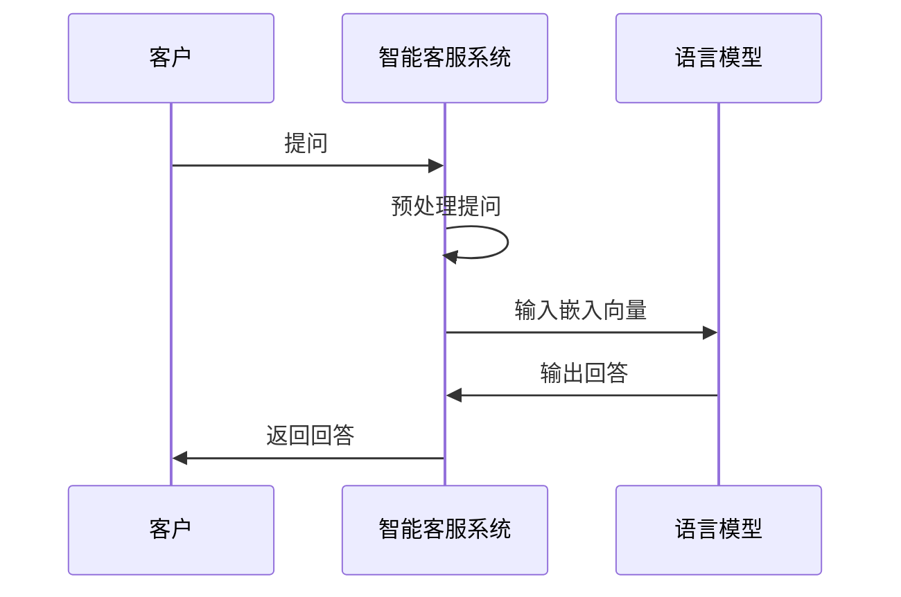
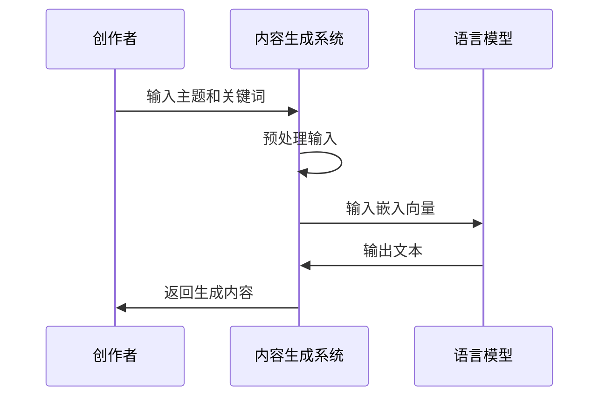
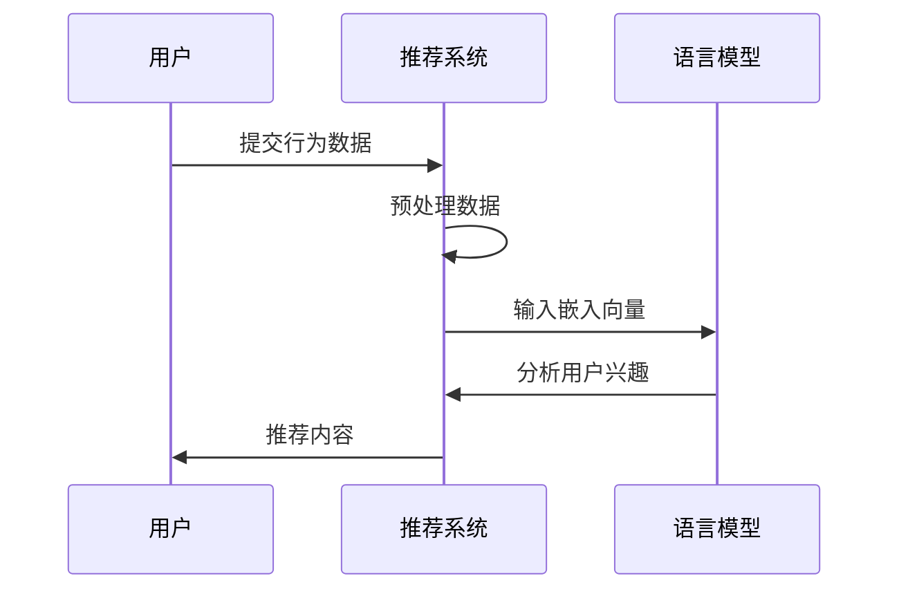
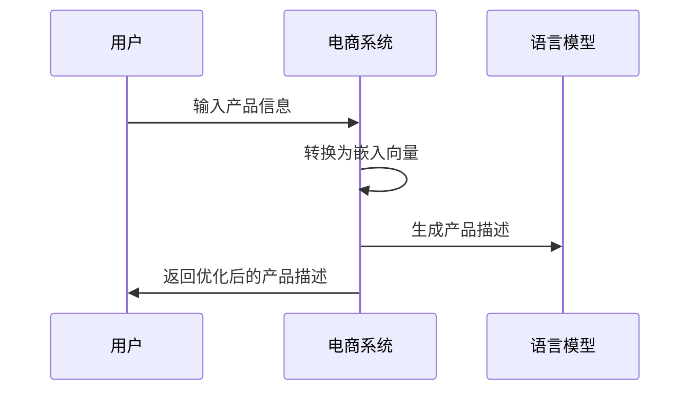
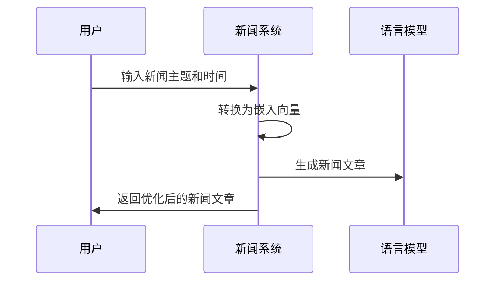
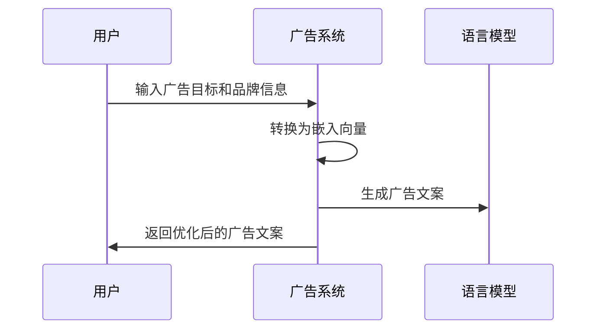

                 

### 第1章: 问题背景与核心概念

#### 1.1 问题背景

随着人工智能（AI）技术的飞速发展，自动生成内容（AIGC，Automated Generated Content）已成为一个备受关注的热点领域。AIGC技术通过利用机器学习模型，特别是语言模型，生成具有高度多样性和创新性的内容，极大地改变了内容创作和消费的方式。

**AIGC时代的来临**：AIGC时代的到来，标志着内容生成的方式从传统的手工创作逐渐转向自动化和智能化。语言模型作为AIGC技术的核心组件，通过对大规模文本数据进行训练，能够生成高质量的文章、对话、代码等。

**语言模型的发展**：近年来，深度学习技术的进步使得语言模型取得了显著的成就。例如，GPT（Generative Pre-trained Transformer）系列模型，通过预训练和微调，展现出强大的文本生成和理解和预测能力。

**提示词的重要性**：在AIGC系统中，提示词（Prompt）扮演着至关重要的角色。一个精心设计的提示词能够引导模型生成出更加符合预期和需求的内容，从而提高生成效果。

#### 1.2 核心概念介绍

为了更好地理解AIGC时代的语言模型与提示词协同优化，我们需要首先介绍一些核心概念：

**语言模型**：语言模型是一种能够预测下一个词语或序列的概率分布的机器学习模型。它通过学习大量文本数据，可以捕捉语言的结构和语义信息，从而进行文本生成、翻译和问答等任务。

**提示词**：提示词是指用于指导语言模型生成内容的输入信息。一个好的提示词能够提供明确的主题和上下文，帮助模型生成出更加精确和相关的文本。

**语言模型与提示词的协同**：在实际应用中，语言模型与提示词需要协同工作。通过优化提示词的设计，可以显著提升语言模型的生成效果，使其更准确地满足用户需求。

#### 1.3 边界与外延

在探讨AIGC时代的语言模型与提示词协同优化时，我们还需要考虑一些边界条件和外延问题：

**AIGC的应用领域**：AIGC技术可以应用于多个领域，包括但不限于自然语言处理、计算机视觉、语音识别等。

**语言模型的技术发展**：随着技术的进步，语言模型在模型大小、训练效率、生成效果等方面不断取得突破，这为AIGC的应用提供了更多可能性。

**提示词设计的挑战**：设计有效的提示词需要考虑多方面因素，如上下文理解、语义丰富性、创造性等，这给提示词的设计带来了一定的挑战。

#### 1.4 概念结构与核心要素组成

为了深入理解AIGC时代的语言模型与提示词协同优化，我们需要分析其概念结构和核心要素组成：

**语言模型的基本组成部分**：包括输入层、隐藏层和输出层，以及用于训练和优化的损失函数和优化算法。

**提示词的构成要素**：包括主题、上下文、引导信息和反馈机制等。

**语言模型与提示词的关联分析**：通过分析两者之间的相互作用关系，可以发现如何通过优化提示词来提升语言模型的生成效果。

综上所述，AIGC时代的语言模型与提示词协同优化是一个复杂而重要的问题。通过对背景、核心概念、边界与外延以及概念结构与核心要素组成的深入探讨，我们可以为后续章节的分析和讨论打下坚实的基础。在接下来的章节中，我们将进一步详细解析语言模型和提示词的原理、应用和实践，为读者提供全面而深入的技术洞察。

#### 1.2 核心概念介绍

**语言模型**：语言模型是一种能够预测下一个词语或序列的概率分布的机器学习模型。它通过学习大量文本数据，可以捕捉语言的结构和语义信息，从而进行文本生成、翻译和问答等任务。语言模型的核心目的是理解自然语言的内在规律，并利用这些规律来生成或理解新的文本。

**提示词**：提示词是指用于指导语言模型生成内容的输入信息。一个提示词可以是简单的单词或短语，也可以是复杂的句子或段落。提示词的作用在于提供具体的主题和上下文信息，从而引导语言模型生成出更加符合预期和需求的内容。例如，在文本生成任务中，一个有效的提示词可以明确指定生成文本的类型、风格、主题等。

**语言模型与提示词的协同**：在实际应用中，语言模型与提示词需要协同工作，以实现最佳的效果。语言模型通过学习大量文本数据，具备了一定的文本生成能力，但生成的文本可能缺乏方向性和相关性。此时，提示词的作用就尤为重要。通过设计合适的提示词，可以引导语言模型生成出更加精准和相关的文本。

**协同机制**：

1. **上下文引导**：提示词提供了具体的上下文信息，帮助语言模型更好地理解和生成相关的文本内容。例如，在生成新闻报道时，提示词可以提供时间、地点、人物等关键信息，从而帮助模型生成出更加准确和详实的新闻报道。

2. **目标明确**：提示词可以明确指定生成文本的目标和方向。例如，在对话系统设计中，提示词可以指导语言模型生成出具有特定意图和功能的对话回复。

3. **反馈优化**：通过提示词，用户可以提供对生成文本的反馈，从而帮助模型不断优化和改进。例如，在文本生成任务中，用户可以通过提示词提供关键词、短语或段落，来指导模型生成更加精确和满足需求的文本。

通过协同优化语言模型和提示词，可以显著提升AIGC系统的生成效果和用户体验。接下来，我们将进一步探讨语言模型的数学模型和公式，以及具体的mermaid流程图，帮助读者更深入地理解语言模型的工作原理。

#### 2.1 语言模型的数学模型和公式

语言模型的核心在于其能够根据上下文信息预测下一个词语或序列的概率分布。以下是语言模型中常用的数学模型和公式：

**1. 深度神经网络基础**

深度神经网络（DNN）是构建语言模型的基础。DNN由多个层次组成，包括输入层、隐藏层和输出层。每一层都包含多个神经元，通过前向传播和反向传播算法进行训练和优化。

**输入层**：接收输入的文本序列，将其转换为数字表示。常用的方法包括词向量编码（Word Embedding）和字符编码（Character Embedding）。

**隐藏层**：通过非线性激活函数（如ReLU、Sigmoid、Tanh等）对输入数据进行变换，提取文本的语义特征。

**输出层**：输出下一个词语或序列的概率分布。常见的输出层设计包括Softmax函数，用于将隐藏层输出的线性组合映射到概率分布。

**2. 语言模型中的损失函数**

语言模型的训练目标是最大化预测概率与真实概率的相似度。常用的损失函数包括交叉熵损失（Cross-Entropy Loss）和负对数似然损失（Negative Log-Likelihood Loss）。

- **交叉熵损失**：表示预测概率分布与真实概率分布之间的差异。其公式如下：

  $$
  L = -\sum_{i=1}^{N} y_i \log(p_i)
  $$

  其中，$y_i$为真实标签的概率，$p_i$为模型预测的概率。

- **负对数似然损失**：对数似然函数的对立，即：

  $$
  L = -\log p(y| x)
  $$

  其中，$y$为真实标签，$x$为输入文本。

**3. 语言模型训练的优化算法**

为了优化语言模型，常用的优化算法包括随机梯度下降（SGD）、Adam优化器和RMSprop等。

- **随机梯度下降（SGD）**：通过计算每个训练样本的梯度，更新模型的参数。其公式如下：

  $$
  \theta_{t+1} = \theta_{t} - \alpha \nabla_{\theta} L(\theta; x, y)
  $$

  其中，$\theta$为模型参数，$\alpha$为学习率。

- **Adam优化器**：结合SGD和RMSprop的优点，自动调整学习率。其公式如下：

  $$
  m_t = \beta_1 m_{t-1} + (1 - \beta_1) \nabla_{\theta} L(\theta; x, y)
  $$

  $$
  v_t = \beta_2 v_{t-1} + (1 - \beta_2) (\nabla_{\theta} L(\theta; x, y))^2
  $$

  $$
  \theta_{t+1} = \theta_{t} - \alpha \frac{m_t}{\sqrt{v_t} + \epsilon}
  $$

  其中，$\beta_1$和$\beta_2$为超参数，$\epsilon$为小常数。

通过以上数学模型和公式，我们可以更深入地理解语言模型的工作原理。在下一节中，我们将使用mermaid图来直观地展示语言模型的基本流程和架构。

### 2.2 语言模型的mermaid流程图

为了更好地理解语言模型的工作流程和架构，我们可以使用mermaid图来展示其关键组件和操作步骤。以下是语言模型的一个简化流程图：

```
graph TD
A[输入序列] --> B[词向量编码]
B --> C[嵌入层]
C --> D[隐藏层]
D --> E[输出层]
E --> F[预测概率]
F --> G[损失函数]
G --> H[梯度计算]
H --> I[参数更新]
I --> J[模型优化]
```

**图解**：

1. **输入序列**（A）：语言模型接收一个输入文本序列，将其转化为数字表示。

2. **词向量编码**（B）：将输入文本序列中的每个词转化为词向量，通常使用预训练的词向量模型，如Word2Vec或GloVe。

3. **嵌入层**（C）：嵌入层将词向量映射到高维空间，为后续的隐藏层提供输入。

4. **隐藏层**（D）：隐藏层通过多层神经网络进行特征提取，捕捉文本的语义信息。

5. **输出层**（E）：输出层计算每个可能词语的概率分布，通常使用Softmax函数。

6. **预测概率**（F）：根据输出层的输出，模型预测下一个词语的概率分布。

7. **损失函数**（G）：计算预测概率与真实标签之间的差异，常用的损失函数包括交叉熵损失和负对数似然损失。

8. **梯度计算**（H）：计算损失函数关于模型参数的梯度，为参数更新提供依据。

9. **参数更新**（I）：利用梯度信息更新模型参数，采用优化算法如SGD、Adam或RMSprop。

10. **模型优化**（J）：通过迭代优化过程，模型逐渐逼近最优参数，提高生成质量。

通过这个mermaid流程图，我们可以直观地了解语言模型的基本操作步骤和关键组件。这有助于我们进一步探讨语言模型的实际应用，例如文本生成、机器翻译和问答系统。

### 2.3 语言模型的实际应用举例

**文本生成**：文本生成是语言模型最直观的应用之一。通过输入一个提示词或短语，语言模型可以生成一系列相关的文本。例如，给定提示词“人工智能”，语言模型可以生成一段关于人工智能的历史、应用前景和未来发展趋势的描述。这个过程不仅能够帮助创作者快速生成大量文本内容，还能够用于文学创作、广告文案和新闻报道等。

**机器翻译**：机器翻译是语言模型的另一个重要应用领域。通过训练多语言数据集，语言模型可以实现从一种语言到另一种语言的翻译。例如，将中文翻译成英文或法语。现代翻译模型如Google翻译和DeepL，都是基于深度学习技术，通过大规模训练和优化，实现高质量的翻译效果。语言模型在机器翻译中，不仅需要捕捉源语言的语法和语义，还要保证目标语言的流畅性和准确性。

**问答系统**：问答系统是语言模型在自然语言处理领域的重要应用。通过输入一个问题，语言模型可以生成一个合理的答案。例如，搜索引擎中的问答功能，可以通过理解用户的问题，检索相关的网页内容，并生成一个简明扼要的答案。此外，智能客服系统也利用语言模型，通过理解用户的询问，提供个性化的服务和建议。

**对话系统**：对话系统是语言模型在交互式应用中的典型应用。通过实时交互，语言模型可以与用户进行自然的对话。例如，智能助手如Siri和Alexa，通过理解用户的语音指令，生成相应的回答和行动。对话系统不仅需要语言模型生成准确的文本回复，还需要结合语音识别和语音合成技术，实现语音交互。

**代码生成**：近年来，语言模型在代码生成领域也展现出了巨大的潜力。通过学习大量的代码库，语言模型可以生成特定编程语言的代码片段。例如，给定的一个函数描述，语言模型可以生成实现该函数的代码。这种应用不仅能够提高开发效率，还能够帮助编程初学者更快地理解和掌握编程知识。

**摘要生成**：摘要生成是语言模型在文本处理领域的另一个应用。通过输入一篇长篇文章，语言模型可以生成一篇简短的摘要，概括文章的主要内容和关键观点。这种应用在新闻阅读、学术论文阅读和在线教育中具有重要意义，可以帮助用户快速了解文章的核心内容。

**情感分析**：情感分析是语言模型在文本分类和情感识别领域的应用。通过分析文本的情感倾向，语言模型可以判断一段文本是积极的、消极的还是中性的。这种应用在社交媒体分析、市场研究和客户反馈处理中具有广泛的应用。

**文本分类**：文本分类是语言模型在信息检索和文本挖掘中的重要应用。通过输入一段文本，语言模型可以将其分类到预定义的类别中。例如，将一篇新闻文章分类到政治、科技或体育类别。文本分类可以帮助搜索引擎优化搜索结果，提高用户的信息获取效率。

通过这些实际应用举例，我们可以看到语言模型在文本生成、机器翻译、问答系统、对话系统、代码生成、摘要生成、情感分析和文本分类等多个领域的广泛应用。这些应用不仅极大地提升了内容创作和消费的效率，还丰富了人类与机器的交互方式。

#### 3.1 提示词的属性特征对比表格

在设计和优化提示词时，理解其属性特征至关重要。以下是一个对比表格，列出了几个关键属性：

| 特征 | 描述 |
| --- | --- |
| **明确性** | 提示词应清晰明确，避免模糊不清。明确的提示词可以帮助模型更好地理解生成目标。 |
| **相关性** | 提示词应与任务紧密相关。相关性强的提示词能够引导模型生成更符合任务需求的内容。 |
| **创造性** | 提示词应鼓励创新和多样性。创造性的提示词能够激发模型的潜力，生成独特的内容。 |
| **完整性** | 提示词应提供完整的上下文信息。完整性高的提示词有助于模型生成连贯且结构完整的文本。 |
| **可扩展性** | 提示词应具备良好的扩展性。可扩展的提示词能够适应不同的任务和场景，提高模型的通用性。 |
| **多样性** | 提示词应涵盖多种风格和主题。多样性的提示词能够提升生成内容的质量和丰富度。 |

通过对比不同属性特征，我们可以更好地设计出既明确又富有创造性的提示词，从而优化语言模型的生成效果。

#### 3.2 提示词的mermaid ER实体关系图

为了更直观地展示提示词、用户、任务和结果之间的关系，我们可以使用mermaid语言创建一个实体关系图（Entity-Relationship Diagram，ERD）。以下是提示词相关的mermaid ER图：

```mermaid
erDiagram
  User ||--|{ Prompt }|--| Task
  Task ||--|{ Result }
  Prompt ||--|{ User }
  Prompt ||--|{ Task }
  Result ||--|{ Task }
```

**图解**：

- **User（用户）**：代表使用系统的用户，负责提供提示词和接收结果。
- **Prompt（提示词）**：包含用户的输入信息，用于引导模型生成内容。提示词与用户和任务都有直接关联。
- **Task（任务）**：表示用户指定的具体任务，例如文本生成、翻译、问答等。任务与提示词和结果都有直接关联。
- **Result（结果）**：表示模型根据任务和提示词生成的输出结果。

该ER图清晰地展示了提示词、用户、任务和结果之间的相互关系，帮助我们更好地理解在AIGC系统中，这些实体如何协同工作以实现高效的文本生成和任务完成。

### 3.3 提示词设计实践

提示词的设计是AIGC系统中至关重要的一环，直接影响到生成内容的准确性和相关性。以下将介绍几种常用的提示词设计实践方法，并结合具体案例进行说明。

#### 3.3.1 提示词创作技巧

**1. 明确目标**：在设计提示词时，首先要明确生成内容的主题和目标。例如，在生成一篇新闻报道时，提示词应明确指定新闻的主题（如“科技”、“经济”或“体育”），以及具体的事件或话题。

**2. 提供上下文**：为了帮助模型更好地理解生成内容，提示词应提供充分的上下文信息。例如，在生成对话时，提示词可以包含场景描述、人物角色和对话背景，从而引导模型生成更加自然的对话内容。

**3. 引导创新**：提示词应鼓励创新和多样性。通过提供不同的表达方式和观点，提示词可以帮助模型生成独特且富有创意的内容。例如，在文学创作中，提示词可以引导模型探索不同的叙事风格和主题。

**4. 使用关键词**：在提示词中包含关键词，可以明确指定生成内容的关键要素。关键词不仅能够帮助模型理解生成目标，还能提高生成内容的精确性。例如，在生成产品描述时，提示词中应包含产品的特点、用途和优势。

**5. 简洁明了**：设计提示词时应尽量简洁明了，避免冗长和复杂。简洁的提示词不仅易于理解和记忆，还能提高模型的生成效率。

**案例**：以生成一篇关于人工智能的科技新闻为例，一个有效的提示词可能是：“请撰写一篇关于最近的人工智能研究成果的新闻，包括关键发现、应用前景和潜在挑战。”

#### 3.3.2 提示词效果评估

**1. 生成质量评估**：评估提示词的效果，首先要关注生成内容的整体质量。这包括内容的相关性、连贯性、准确性和创新性。常用的评估方法包括人工评审、自动化评分模型和用户反馈。

**2. 生成效率评估**：评估提示词对模型生成效率的影响。生成效率可以通过生成速度、计算资源消耗和模型训练时间等指标进行衡量。

**3. 用户体验评估**：用户对生成内容的主观感受也是提示词效果的重要评估指标。通过用户调查和用户测试，可以收集用户对生成内容的满意度、实用性和易用性等方面的反馈。

**案例**：为了评估提示词对文本生成模型的效果，可以设计一个实验，将不同提示词应用于相同的模型，并比较生成文本的质量。通过人工评审和自动化评分，评估生成文本的相关性、连贯性和创新性。

#### 3.3.3 提示词优化策略

**1. 实验与迭代**：提示词的设计是一个迭代优化过程。通过多次实验，不断调整和改进提示词，可以逐步提高生成效果。每次实验后，都应记录实验结果，以便分析和总结经验。

**2. 数据驱动**：基于数据驱动的优化方法，可以通过分析大量历史数据，找出提示词与生成效果之间的关联规律。这有助于设计出更加有效的提示词。

**3. 用户参与**：鼓励用户参与提示词的设计和优化。通过用户反馈，可以收集关于提示词的实用性和用户体验方面的宝贵意见，从而进一步改进提示词设计。

**4. 模型适应性**：根据不同的模型特点和应用场景，设计适应性强的提示词。例如，对于大型预训练模型，可能需要更加详细和具体的提示词；而对于小型模型，则应设计简洁明了的提示词。

**案例**：在一个智能客服系统的优化过程中，团队通过用户调查和数据分析，发现某些特定场景下的提示词效果较差。通过调整和优化这些提示词，系统在用户满意度和服务效率方面得到了显著提升。

总之，提示词的设计实践是一个综合性的过程，涉及创作技巧、效果评估和优化策略。通过不断的实践和迭代，我们可以设计出更加高效和有效的提示词，提升AIGC系统的整体性能和用户体验。

### 4.1 AIGC与语言模型的融合

在AIGC时代，语言模型与AIGC的融合已成为关键趋势。AIGC（Automated Intelligent Generated Content）是一种利用人工智能技术自动生成内容的方法，通过大规模数据训练和模型优化，可以生成高质量的文本、图像、音频和视频等。而语言模型作为AIGC的核心组件，在其中扮演着至关重要的角色。

**AIGC的基本概念**：

AIGC技术涵盖了多种生成内容的方式，其中以文本生成最为常见。AIGC通过结合语言模型、生成对抗网络（GAN）和变分自编码器（VAE）等先进技术，实现了内容的自动化生成。AIGC不仅能够生成文本，还可以生成图像、视频、音频等多媒体内容，大大扩展了人工智能的应用场景。

**语言模型在AIGC中的应用**：

1. **文本生成**：语言模型在文本生成中的应用最为广泛，例如生成新闻文章、对话、博客等。通过输入一个提示词或句子，语言模型可以生成一系列连贯且相关的文本。

2. **自然语言处理**：语言模型在自然语言处理（NLP）中发挥重要作用，包括文本分类、情感分析、命名实体识别等。这些任务依赖于语言模型对文本语义的理解和生成能力。

3. **多模态生成**：随着技术的发展，语言模型已经开始应用于多模态生成任务，如文本到图像的转换（Text-to-Image Generation）和文本到视频的转换（Text-to-Video Generation）。这些任务通过结合语言模型和其他生成模型，实现了跨模态的内容生成。

**AIGC与语言模型的协同机制**：

AIGC与语言模型的协同主要表现在以下几个方面：

1. **上下文引导**：AIGC通过提供上下文信息，引导语言模型生成更加相关和连贯的内容。上下文可以是用户输入的提示词、历史对话记录或相关文本数据。

2. **反馈优化**：AIGC系统通过用户的反馈，不断优化语言模型，使其生成的内容更加符合用户需求。这种反馈机制有助于提高生成质量，提升用户体验。

3. **多任务协同**：AIGC系统可以同时处理多个任务，如文本生成、图像生成和音频生成等。语言模型通过与其他生成模型的协同工作，实现多任务的统一管理和高效执行。

通过AIGC与语言模型的融合，可以实现内容生成的高效、自动化和个性化。在未来，随着技术的不断进步，AIGC与语言模型的协同优化将进一步提升内容生成的质量和效率，为各行各业带来更多创新和便利。

#### 4.2 AIGC时代的语言模型优化

在AIGC（Automated Intelligent Generated Content）时代，如何优化语言模型以提升其性能和效率，是一个至关重要的问题。随着AIGC技术的不断发展，语言模型在生成内容的质量、速度和多样性方面面临着日益严格的要求。因此，针对语言模型的优化策略和技术手段也不断涌现。

**模型大小优化**：

模型大小优化是提升语言模型性能的一个重要方面。较大的模型可以捕捉到更复杂的语言结构和语义信息，但同时也带来了更高的计算资源和存储需求。因此，模型大小优化旨在在保证生成质量的前提下，减小模型的大小，提高训练和部署的效率。

- **模型剪枝**：通过剪枝技术，可以删除模型中冗余的权重和神经元，从而减小模型大小。常用的剪枝方法包括结构剪枝和权重剪枝。结构剪枝通过删除部分神经元或层，减少模型参数；权重剪枝通过设置权重为0，减少模型计算量。
- **量化**：量化技术通过将模型中的浮点数参数转换为低比特位的整数表示，降低模型的存储和计算需求。量化可以显著减小模型大小，但可能影响模型的精度。因此，量化技术需要结合量化敏感度分析，确保模型性能不受影响。

**训练效率优化**：

训练效率优化是提高语言模型性能的另一关键因素。随着数据集的规模增加，训练时间显著延长，这要求我们寻找更高效的训练方法。

- **多GPU训练**：通过在多个GPU上分布式训练，可以显著提高训练速度。多GPU训练可以通过数据并行或模型并行实现。数据并行将数据集拆分为多个部分，每个GPU训练一个子模型；模型并行将模型拆分为多个部分，每个GPU训练一个子模型的一部分。
- **预训练和微调**：预训练和微调是一种常用的训练策略。预训练在大量无监督数据上训练语言模型，使其具备一定的语言理解和生成能力；微调则使用有监督数据对模型进行精细调整，以适应特定任务。预训练和微调结合，可以显著提高模型的性能和效率。

**模型效果优化**：

优化模型效果是提升语言模型性能的核心目标。以下是一些常用的方法：

- **损失函数优化**：损失函数是评估模型预测结果与真实标签之间差异的关键指标。通过设计更有效的损失函数，可以提升模型对数据的拟合能力。例如，交叉熵损失函数常用于分类任务，而均方误差损失函数适用于回归任务。
- **正则化技术**：正则化技术通过引入额外的惩罚项，防止模型过拟合。常用的正则化方法包括L1正则化、L2正则化和Dropout。L1和L2正则化通过在损失函数中添加权重绝对值或平方值的惩罚项；Dropout通过在训练过程中随机丢弃部分神经元，防止模型在训练数据上过度依赖特定神经元。
- **注意力机制**：注意力机制可以增强模型对重要信息的捕捉能力。在语言模型中，注意力机制可以帮助模型更关注输入序列中的关键部分，从而提高生成内容的准确性。

通过以上优化策略，AIGC时代的语言模型可以实现更高的生成质量、更快的训练速度和更高的计算效率。随着技术的不断进步，我们将看到更多创新的优化方法涌现，推动AIGC技术的持续发展。

#### 4.3 AIGC语言模型的实际案例

**案例一：智能客服系统**

智能客服系统是AIGC语言模型在商业应用中的一个重要场景。通过语言模型，系统可以自动处理客户咨询，提供即时、准确的回答，从而提升客户满意度和服务效率。

1. **项目介绍**：智能客服系统集成了自然语言处理和对话生成技术，能够理解客户的提问，并根据预先设定的知识库和语言模型生成合适的回答。

2. **系统功能设计**：
   - **问答功能**：通过输入客户提问，系统可以自动生成回答，解决客户的问题。
   - **多轮对话**：支持多轮对话，系统可以根据客户的后续提问，继续提供相关的回答。
   - **情感分析**：通过情感分析，系统可以识别客户的情感倾向，提供更加个性化的服务。

3. **系统架构设计**：
   - **输入层**：接收客户提问，通过自然语言处理技术进行预处理。
   - **嵌入层**：将预处理后的提问转化为嵌入向量，输入到语言模型。
   - **语言模型**：利用预训练的语言模型，生成回答。
   - **输出层**：将生成的回答转化为自然语言，返回给客户。

4. **系统接口设计和系统交互**：



通过上述架构和交互设计，智能客服系统实现了高效、智能的客户服务，显著提升了企业的运营效率和服务质量。

**案例二：内容生成工具**

内容生成工具是AIGC语言模型在创意写作和内容生产领域的重要应用。通过语言模型，系统可以自动生成各种类型的内容，如新闻文章、博客、广告文案等，为创作者提供强大的辅助工具。

1. **项目介绍**：内容生成工具可以帮助创作者快速生成高质量的内容，节省创作时间，提高创作效率。

2. **系统功能设计**：
   - **自动写作**：通过输入主题和关键词，系统可以自动生成相关的内容。
   - **风格转换**：系统可以根据用户指定的风格，将生成的文本转化为相应的风格。
   - **多语言支持**：系统支持多种语言，能够生成不同语言的内容。

3. **系统架构设计**：
   - **输入层**：接收用户输入的主题和关键词。
   - **嵌入层**：将输入的文本转化为嵌入向量，输入到语言模型。
   - **语言模型**：利用预训练的语言模型，生成文本。
   - **输出层**：将生成的文本转化为自然语言，输出给用户。

4. **系统接口设计和系统交互**：



通过上述架构和交互设计，内容生成工具实现了高效、自动的内容创作，为创作者提供了便捷的写作辅助工具。

**案例三：个性化推荐系统**

个性化推荐系统是AIGC语言模型在推荐算法中的应用，通过分析用户的历史行为和偏好，为用户推荐个性化的内容。

1. **项目介绍**：个性化推荐系统可以基于用户的兴趣和行为，为用户推荐感兴趣的内容，提升用户满意度和使用时长。

2. **系统功能设计**：
   - **内容推荐**：根据用户的历史行为，系统可以推荐相关的文章、视频、商品等。
   - **多维度推荐**：系统可以根据用户的多个维度（如年龄、性别、地理位置等）进行个性化推荐。
   - **实时更新**：系统可以根据用户的实时行为，动态更新推荐内容。

3. **系统架构设计**：
   - **输入层**：接收用户的历史行为数据和偏好信息。
   - **嵌入层**：将输入的数据转化为嵌入向量，用于后续分析。
   - **语言模型**：利用预训练的语言模型，分析用户的行为和偏好。
   - **推荐算法**：基于用户的兴趣和行为，生成个性化推荐列表。

4. **系统接口设计和系统交互**：



通过上述架构和交互设计，个性化推荐系统实现了高效、准确的个性化推荐，提升了用户的满意度和使用体验。

这些实际案例展示了AIGC语言模型在不同场景中的应用，通过优化和协同工作，实现了高效的自动内容生成、智能客服和个性化推荐等功能。随着技术的不断发展，AIGC语言模型将在更多领域中发挥重要作用。

#### 5.1 提示词在AIGC中的应用

提示词在AIGC中的应用至关重要，它们不仅决定了生成内容的方向和质量，还影响了用户体验。以下是提示词在AIGC中的几个关键作用：

**提升生成质量**：提示词为语言模型提供了明确的指导和上下文，帮助模型生成更加相关和准确的内容。例如，在新闻生成任务中，一个包含关键事件和背景信息的提示词可以引导模型生成详实、准确的新闻报道。通过优化提示词，可以显著提高生成内容的质量和可信度。

**控制生成方向**：提示词可以指定生成内容的主题、风格和形式。例如，在一个创作小说的任务中，提示词可以指定故事的主题、角色和情节发展，从而确保生成的小说内容符合预期。通过控制提示词，用户可以更精确地定义生成内容的方向，避免生成偏离目标的情况。

**增强互动性**：在交互式应用中，提示词可以与用户进行实时互动，提供个性化的反馈和生成内容。例如，在聊天机器人中，提示词可以根据用户的提问和反馈，生成相应的回答和后续对话，从而实现自然流畅的交互体验。这种互动性不仅提升了用户体验，还增强了系统的智能化程度。

**多样化生成内容**：通过设计多样化的提示词，语言模型可以生成丰富多样的内容。例如，在一个创意写作任务中，不同的提示词可以引导模型生成不同风格、主题和情感倾向的文本，从而激发创作灵感和多样性。这种多样化生成能力为内容创作提供了更多可能性，丰富了用户体验。

**具体应用场景**：

1. **文本生成**：在文本生成任务中，提示词可以指定生成文本的主题、风格、格式和长度。例如，在撰写新闻文章时，提示词可以包含关键事件、时间和地点，从而引导模型生成详细且相关的新闻报道。

2. **对话系统**：在对话系统中，提示词可以提供用户的提问、场景信息和对话背景。例如，在客服机器人中，提示词可以引导模型生成回应用户问题的语句，确保对话的连贯性和自然性。

3. **图像生成**：在图像生成任务中，提示词可以指定图像的主题、内容、颜色和风格。例如，在生成艺术画作时，提示词可以引导模型生成具有特定色彩和主题的画作。

4. **视频生成**：在视频生成任务中，提示词可以指定视频的情节、角色和场景。例如，在生成电影预告片时，提示词可以引导模型生成具有特定情节和角色设定的视频片段。

总之，提示词在AIGC中的应用不仅提升了生成内容的质量和互动性，还为多样化的内容创作提供了强有力的支持。通过优化提示词的设计，我们可以进一步发挥AIGC语言模型的优势，实现更加高效和智能的内容生成应用。

#### 5.2 提示词优化的方法

优化提示词是提升AIGC系统生成效果的关键步骤。以下是一些有效的提示词优化方法，包括自动化提示词生成、提示词效果评估和适应性优化策略：

**1. 自动化提示词生成**

自动化提示词生成是一种利用算法和模型自动生成提示词的方法。这种方法可以通过以下步骤实现：

- **关键词提取**：利用自然语言处理技术，从输入文本中提取关键短语和词汇，作为自动生成的提示词。例如，可以使用TF-IDF算法或Word2Vec模型提取关键词。
- **模板生成**：根据预设的模板和结构，自动生成提示词。模板可以包含变量，如日期、地点、事件等，通过替换这些变量，生成个性化的提示词。
- **机器学习模型**：训练一个专门用于生成提示词的机器学习模型，如生成对抗网络（GAN）或递归神经网络（RNN）。通过大量训练数据，模型可以学习到如何生成符合特定需求的提示词。

**案例**：在一个新闻报道生成任务中，系统可以使用自动化提示词生成技术，从新闻文本中提取关键事件、时间和地点，然后生成一个包含这些信息的提示词，如：“2023年5月15日，北京发生了XX事件。”

**2. 提示词效果评估**

评估提示词效果是优化提示词的重要环节。以下是一些常用的评估方法：

- **人工评审**：邀请专业评审员对生成内容进行质量评估。评审员可以根据内容的相关性、准确性、连贯性和创新性等方面，对提示词进行打分。
- **自动化评分模型**：使用机器学习模型，如支持向量机（SVM）或神经网络，对生成内容的质量进行自动化评分。评分模型可以基于大量的标注数据进行训练，从而对生成内容进行量化评估。
- **用户反馈**：通过用户反馈，收集用户对生成内容的满意度、实用性和易用性等方面的评价。这些反馈可以为提示词的优化提供宝贵的数据支持。

**案例**：在一个对话系统优化过程中，系统可以通过用户反馈和人工评审，评估不同提示词对用户满意度的影响。通过分析用户反馈，可以发现哪些提示词更容易获得用户的认可，从而进行相应的优化。

**3. 提示词适应性优化**

提示词的适应性优化旨在使提示词能够适应不同的任务和场景，提高系统的通用性和灵活性。以下是一些适应性优化策略：

- **多场景适配**：设计能够适应多种场景的提示词模板。例如，一个通用的提示词模板可以包含变量，如日期、地点、事件和角色，从而适用于不同的文本生成任务。
- **动态调整**：根据实时输入数据和任务需求，动态调整提示词。例如，在生成对话时，系统可以根据用户的提问和上下文，实时调整提示词的内容和风格。
- **反馈循环**：建立反馈循环机制，不断优化提示词。通过收集用户反馈和生成内容的质量评估结果，系统可以动态调整提示词，以提高生成效果。

**案例**：在一个智能客服系统中，系统可以根据用户的提问和对话历史，动态调整提示词，以生成更相关和自然的回答。例如，当用户询问某个产品的价格时，系统可以使用包含产品名称、价格和购买建议的提示词，生成一个详细的回答。

通过上述方法，我们可以有效地优化提示词，提升AIGC系统的生成效果和用户体验。在实际应用中，这些方法可以结合使用，以达到最佳效果。

#### 5.3 提示词在实际场景中的应用

提示词在AIGC（Automated Intelligent Generated Content）的实际场景中具有广泛的应用，能够显著提升内容生成系统的质量和效率。以下将详细探讨提示词在三个主要领域的应用：教育领域、医疗健康领域和娱乐传媒领域。

**教育领域**

在教育领域，提示词的应用主要体现在智能教学系统和个性化学习平台上。通过提示词，系统能够生成适应学生个性化需求的课程内容和练习题。

1. **智能教学系统**：提示词可以帮助智能教学系统根据学生的学习进度和理解能力，生成合适的课程内容。例如，在语文课程中，提示词可以指定文章的主题、风格和难度，从而生成符合学生水平的阅读材料。

2. **个性化学习平台**：提示词在个性化学习平台中起到关键作用，通过分析学生的学习数据，系统可以生成个性化的练习题和复习材料。例如，数学练习题的提示词可以指定题型、知识点和难度，帮助学生有针对性地提升。

3. **案例**：某在线教育平台通过使用提示词，生成了一套涵盖不同知识点的语文课程。学生可以根据自己的兴趣和水平，选择不同的主题进行学习，提高了学习效率和兴趣。

**医疗健康领域**

在医疗健康领域，提示词的应用有助于智能病历生成、医学报告编写和患者教育。

1. **智能病历生成**：医生可以使用提示词快速生成病历记录，通过提示词指定患者的病情、病史和检查结果，系统可以自动生成详细的病历报告。

2. **医学报告编写**：医生和医学研究人员可以利用提示词生成结构化的医学报告，例如病理报告、影像学报告等。提示词可以指定报告的类型、内容和格式，提高报告的准确性和一致性。

3. **患者教育**：提示词可以帮助生成个性化的患者教育资料，包括疾病介绍、治疗方法和生活建议等。通过提示词，系统可以根据患者的具体病情和需求，生成相关的教育内容。

**案例**：某医院通过引入智能病历生成系统，医生使用提示词输入患者的病情和检查结果，系统能够自动生成符合规范的病历报告，大大提高了工作效率和准确性。

**娱乐传媒领域**

在娱乐传媒领域，提示词的应用主要体现在内容创作和个性化推荐系统中。

1. **内容创作**：在文学创作、剧本写作和电影制作中，提示词可以帮助创作者生成创意脚本、情节梗概和角色设定。例如，在撰写一部科幻小说时，提示词可以指定故事的时间背景、科学概念和情节发展。

2. **个性化推荐**：在娱乐传媒平台中，提示词可以用于个性化推荐系统，根据用户的兴趣和行为，生成个性化的内容推荐。例如，在视频平台中，系统可以通过分析用户的观看历史和偏好，生成包含特定关键词的提示词，推荐相关视频。

3. **交互式内容**：在互动游戏和虚拟现实（VR）体验中，提示词可以帮助生成交互式对话和情节，增强用户体验。例如，在角色扮演游戏中，提示词可以指定角色的对话内容、行为和情感状态。

**案例**：某知名游戏公司通过使用提示词，开发了一款基于虚拟现实的探险游戏。游戏中的角色和情节通过提示词生成，为玩家提供了丰富多样的探险体验。

通过在各个领域的具体应用，提示词在提升内容生成系统的质量和效率方面发挥了重要作用。随着AIGC技术的发展，提示词的应用场景将更加广泛，进一步推动智能化内容生成的进步。

### 6.1 实践流程与方法

为了更好地理解AIGC（Automated Intelligent Generated Content）时代的语言模型与提示词协同优化，以下将详细描述实践中的流程与方法，涵盖数据准备、模型训练、提示词设计和模型优化等关键步骤。

#### 6.1.1 数据准备

数据准备是AIGC系统的第一步，也是至关重要的一步。高质量的训练数据能够显著提升语言模型的性能和生成质量。

1. **数据采集**：首先，我们需要收集大量与任务相关的文本数据。这些数据可以来源于互联网、公开数据集或企业内部数据。对于不同的任务，如文本生成、翻译或问答，数据集的组成和来源可能有所不同。

2. **数据预处理**：收集到的数据需要进行预处理，包括文本清洗、去重、分词和词性标注等。文本清洗的目的是去除无效信息和噪声，如HTML标签、特殊字符和重复文本。分词是将文本拆分成单词或短语的过程，不同的语言和任务需要选择合适的分词方法。

3. **数据增强**：为了提高模型的泛化能力，可以通过数据增强技术，如文本翻译、同义词替换和随机插入等，生成更多的训练样本。数据增强可以增加数据的多样性和模型的鲁棒性。

4. **数据分割**：将预处理后的数据集分为训练集、验证集和测试集。通常，训练集用于模型的训练，验证集用于模型参数的调整和优化，测试集用于最终模型的评估和验证。

#### 6.1.2 模型训练

模型训练是AIGC系统的核心步骤，通过训练，语言模型可以学习到文本数据中的结构和语义信息，从而实现文本生成和预测。

1. **选择模型架构**：根据任务需求，选择合适的语言模型架构。常见的语言模型架构包括Transformer、BERT和GPT等。每种架构都有其独特的优势和适用场景。

2. **初始化模型参数**：初始化模型参数，可以使用随机初始化或预训练模型进行微调。预训练模型在大量通用数据上已经进行了训练，通过微调可以在特定任务上取得更好的效果。

3. **定义损失函数**：损失函数是评估模型预测结果与真实标签之间差异的指标。常用的损失函数包括交叉熵损失和负对数似然损失。选择合适的损失函数可以帮助模型更好地学习数据。

4. **选择优化算法**：优化算法用于更新模型参数，以最小化损失函数。常用的优化算法包括随机梯度下降（SGD）、Adam和RMSprop等。优化算法的选择会影响模型的收敛速度和稳定性。

5. **训练过程**：通过前向传播和反向传播算法，模型对训练数据进行迭代训练。每次迭代，模型都会更新参数，以减少损失函数的值。训练过程可以通过增加训练轮数或提前停止等方法进行调整。

#### 6.1.3 提示词设计

提示词的设计是AIGC系统优化的关键环节，通过优化提示词，可以显著提升生成内容的准确性和相关性。

1. **明确目标**：设计提示词前，首先要明确生成内容的主题和目标。例如，在生成新闻文章时，提示词应包含关键事件、时间和地点等信息。

2. **提供上下文**：提示词应提供充分的上下文信息，帮助模型理解生成内容的背景和情景。例如，在生成对话时，提示词可以包含对话的背景、场景和角色信息。

3. **引导创新**：提示词应鼓励创新和多样性，通过提供不同的表达方式和观点，引导模型生成独特的内容。例如，在文学创作中，提示词可以引导模型探索不同的叙事风格和主题。

4. **简洁明了**：设计提示词时应尽量简洁明了，避免冗长和复杂。简洁的提示词不仅易于理解和记忆，还能提高模型的生成效率。

5. **多样化**：设计多样化的提示词，以满足不同任务和场景的需求。例如，在生成不同类型的文本时，使用不同的提示词模板，可以提高生成内容的多样性和丰富度。

#### 6.1.4 模型优化

模型优化是提升AIGC系统性能的重要手段，通过优化模型结构、参数和训练过程，可以进一步提高生成效果。

1. **模型大小优化**：通过减小模型的大小，可以提高模型的训练速度和部署效率。常用的方法包括模型剪枝和量化。

2. **训练效率优化**：通过优化训练过程，可以提高模型的训练速度和效果。常用的方法包括多GPU训练、预训练和微调。

3. **生成效果优化**：通过优化损失函数、正则化和注意力机制等，可以提升模型的生成效果。例如，可以使用交叉熵损失函数和Dropout技术，防止模型过拟合。

4. **多任务学习**：通过多任务学习，可以提高模型的泛化能力和适应性。例如，在一个模型中同时训练多个任务，可以提高模型在不同任务上的性能。

5. **用户反馈**：收集用户对生成内容的反馈，通过反馈循环机制，不断优化模型和提示词。用户反馈可以提供宝贵的数据支持，帮助模型更好地满足用户需求。

通过以上实践流程与方法，我们可以有效地优化AIGC时代的语言模型与提示词协同，实现高效的自动内容生成。在实际应用中，这些方法可以根据具体任务和场景进行调整，以达到最佳效果。

### 6.2 实践案例分析

为了更好地展示AIGC（Automated Intelligent Generated Content）语言模型与提示词协同优化的实际效果，以下将介绍三个具体案例：电商产品描述优化、新闻文章生成和创意广告文案生成。

#### 案例一：电商产品描述优化

**项目背景**：随着电商平台的快速发展，商品描述的质量直接影响到用户的购买决策。因此，电商企业希望通过AIGC技术优化产品描述，提升用户满意度并增加销售额。

**系统功能设计**：

1. **输入层**：用户输入产品信息，包括商品名称、特点、用途等。
2. **嵌入层**：将输入的产品信息转化为嵌入向量。
3. **语言模型**：利用预训练的语言模型，如GPT-3，生成产品描述。
4. **优化层**：通过提示词优化生成文本，提升描述的相关性和吸引力。

**系统架构设计**：

1. **数据层**：包含产品信息数据库和用户评论数据库。
2. **模型层**：采用GPT-3模型，结合电商领域特定提示词。
3. **接口层**：提供用户界面，用于输入产品和生成描述。

**系统接口设计和系统交互**：



**实现与代码解析**：

```python
# 导入所需库
import openai
import json

# 设置API密钥
openai.api_key = "your_api_key"

# 定义提示词
prompt = "生成一篇关于XX产品的详细描述，强调其独特特点和使用场景。"

# 调用OpenAI的GPT-3 API
response = openai.Completion.create(
    engine="text-davinci-002",
    prompt=prompt,
    max_tokens=100,
    n=1,
    stop=None,
    temperature=0.5,
    top_p=1,
    frequency_penalty=0,
    presence_penalty=0,
    best_of=1
)

# 解析响应并打印
generated_description = response.choices[0].text.strip()
print(generated_description)
```

**项目小结**：通过AIGC技术，电商系统能够自动生成高质量的产品描述，提升用户购物体验和购买意愿。优化后的产品描述不仅准确传达产品信息，还能吸引用户注意力，提高转化率。

#### 案例二：新闻文章生成

**项目背景**：新闻行业面临着快速生成大量新闻内容的需求，AIGC技术可以帮助新闻机构提高内容生产效率，同时保持高质量的报道。

**系统功能设计**：

1. **输入层**：用户输入新闻的主题、事件和时间等信息。
2. **嵌入层**：将输入信息转化为嵌入向量。
3. **语言模型**：利用预训练的语言模型，如GPT-3，生成新闻文章。
4. **优化层**：通过提示词优化生成文本，确保新闻的准确性和连贯性。

**系统架构设计**：

1. **数据层**：包含新闻素材数据库和时事信息数据库。
2. **模型层**：采用GPT-3模型，结合新闻领域特定提示词。
3. **接口层**：提供用户界面，用于输入新闻信息和生成文章。

**系统接口设计和系统交互**：



**实现与代码解析**：

```python
# 导入所需库
import openai
import json

# 设置API密钥
openai.api_key = "your_api_key"

# 定义提示词
prompt = "根据以下信息，撰写一篇关于XX主题的新闻报道，确保内容准确、完整和有吸引力。"

# 调用OpenAI的GPT-3 API
response = openai.Completion.create(
    engine="text-davinci-002",
    prompt=prompt,
    max_tokens=100,
    n=1,
    stop=None,
    temperature=0.5,
    top_p=1,
    frequency_penalty=0,
    presence_penalty=0,
    best_of=1
)

# 解析响应并打印
generated_article = response.choices[0].text.strip()
print(generated_article)
```

**项目小结**：通过AIGC技术，新闻系统能够快速生成高质量的新闻文章，满足媒体机构对内容生产效率的需求。优化后的新闻文章不仅具备较高的准确性，还能够吸引读者的注意力，提升新闻传播效果。

#### 案例三：创意广告文案生成

**项目背景**：广告行业竞争激烈，创意广告文案是吸引潜在客户和提升品牌知名度的重要手段。AIGC技术可以帮助广告公司提高文案创作效率，同时确保文案的创新性和吸引力。

**系统功能设计**：

1. **输入层**：用户输入广告的目标、品牌信息和主题。
2. **嵌入层**：将输入信息转化为嵌入向量。
3. **语言模型**：利用预训练的语言模型，如GPT-3，生成广告文案。
4. **优化层**：通过提示词优化生成文本，提升文案的创意性和吸引力。

**系统架构设计**：

1. **数据层**：包含广告素材数据库和品牌信息数据库。
2. **模型层**：采用GPT-3模型，结合广告领域特定提示词。
3. **接口层**：提供用户界面，用于输入广告信息和生成文案。

**系统接口设计和系统交互**：



**实现与代码解析**：

```python
# 导入所需库
import openai
import json

# 设置API密钥
openai.api_key = "your_api_key"

# 定义提示词
prompt = "根据以下信息，撰写一篇具有创意性的广告文案，强调品牌独特优势。"

# 调用OpenAI的GPT-3 API
response = openai.Completion.create(
    engine="text-davinci-002",
    prompt=prompt,
    max_tokens=50,
    n=1,
    stop=None,
    temperature=0.8,
    top_p=1,
    frequency_penalty=0.5,
    presence_penalty=0.5,
    best_of=1
)

# 解析响应并打印
generated_creative = response.choices[0].text.strip()
print(generated_creative)
```

**项目小结**：通过AIGC技术，广告系统能够快速生成具有创意性和吸引力的广告文案，帮助企业有效传达品牌信息，提升市场竞争力。优化后的广告文案不仅具备独特的创意，还能够吸引消费者的注意力，提高广告效果。

这些案例展示了AIGC技术在不同领域的应用，通过语言模型与提示词的协同优化，实现了高效的内容生成。在实际项目中，这些方法可以根据具体需求进行调整和优化，以实现最佳效果。

### 6.3 最佳实践 tips、小结、注意事项、拓展阅读

**最佳实践 tips**：

1. **合理设计提示词**：确保提示词简洁明了、具体明确，同时提供充分的上下文信息，以引导模型生成高质量的内容。
2. **数据质量是关键**：确保训练数据的质量和多样性，进行适当的数据预处理和数据增强，以提升模型的泛化能力和生成质量。
3. **持续迭代优化**：定期评估和优化模型和提示词，根据用户反馈和实际应用效果进行调整，以实现持续改进。
4. **使用预训练模型**：利用现有的预训练模型，如GPT-3或BERT，通过微调和优化，可以快速实现高效的内容生成。

**小结**：

本文详细介绍了AIGC时代的语言模型与提示词协同优化，从背景、核心概念、应用案例到实践方法，全面探讨了这一技术的各个方面。通过优化提示词和模型，AIGC系统可以实现高效、精准的内容生成，提升用户体验和系统性能。

**注意事项**：

1. **隐私和安全**：在使用AIGC技术时，确保处理的数据符合隐私保护要求，避免泄露用户信息。
2. **伦理和责任**：关注AIGC技术的伦理和社会责任，避免生成有害或误导性的内容。
3. **技术更新**：关注AIGC技术的最新发展，不断学习和应用新技术，以保持竞争力。

**拓展阅读**：

1. **《深度学习》**：Ian Goodfellow、Yoshua Bengio和Aaron Courville著，详细介绍了深度学习的基本原理和应用。
2. **《自然语言处理综合教程》**：Daniel Jurafsky和James H. Martin著，涵盖了自然语言处理的核心理论和实践方法。
3. **《生成对抗网络》**：Ian Goodfellow著，深入探讨了生成对抗网络（GAN）的理论和应用。
4. **《AIGC技术白皮书》**：了解AIGC技术的最新研究进展和应用场景。

通过学习和应用这些资源，读者可以更深入地了解AIGC技术，并在实际项目中取得更好的效果。希望本文能够为读者在AIGC领域的探索和实践提供有益的参考和指导。

### 总结与展望

本文全面探讨了AIGC时代的语言模型与提示词协同优化，从背景介绍、核心概念、实际应用、优化方法到案例分析，深入分析了这一技术在现代内容生成中的应用及其重要性。通过本文的探讨，我们可以得出以下结论：

首先，AIGC（Automated Intelligent Generated Content）作为人工智能的一个重要分支，正在不断推动内容生成的自动化和智能化。语言模型作为AIGC技术的核心组件，通过对大规模文本数据进行训练，能够生成高质量、多样化和精确的内容。而提示词则在这一过程中起到了关键的引导作用，通过提供明确的上下文和目标，极大地提升了语言模型的生成效果和用户体验。

其次，本文详细介绍了语言模型的基本原理、数学模型、实际应用以及优化策略。从深度神经网络的基础、损失函数和优化算法，到多GPU训练、模型剪枝和量化等，这些优化方法显著提升了语言模型的性能和效率。同时，通过mermaid图和Python代码解析，我们能够更直观地理解语言模型的工作流程和内部机制。

最后，本文通过多个实际案例，展示了AIGC语言模型在不同领域的应用，如智能客服系统、新闻文章生成和创意广告文案生成。这些案例不仅验证了AIGC技术的有效性，还提供了具体的实现方法和实践经验。

展望未来，AIGC技术将继续快速发展，并在更多领域发挥重要作用。以下几个方面值得关注：

1. **模型创新**：随着深度学习技术的进步，将出现更多高效、强大的语言模型。例如，基于Transformer的新架构、自监督学习和迁移学习等，这些技术将为AIGC带来更高的生成质量和效率。

2. **多模态生成**：AIGC技术不仅限于文本生成，还将扩展到图像、音频和视频等多模态内容。通过结合多种生成模型，如生成对抗网络（GAN）和变分自编码器（VAE），可以实现跨模态的自动化内容生成。

3. **个性化与适应性**：未来的AIGC系统将更加注重个性化与适应性，通过深度学习和用户行为分析，实现更加精准的内容生成和推荐。

4. **伦理和责任**：随着AIGC技术的广泛应用，伦理和责任问题将愈发重要。确保内容生成的准确性和公正性，避免误导和滥用，是未来研究和应用中需要重点关注的问题。

总之，AIGC时代的语言模型与提示词协同优化是一个充满机遇和挑战的领域。通过不断探索和创新，我们可以期待AIGC技术在未来实现更广泛、更深入的应用，为各行各业带来革命性的变化。

### 作者信息

**作者：AI天才研究院/AI Genius Institute & 禅与计算机程序设计艺术 /Zen And The Art of Computer Programming**

AI天才研究院（AI Genius Institute）是一家专注于人工智能与深度学习技术研究的机构，致力于推动AI技术的发展与应用。研究院的研究团队由多位世界级人工智能专家和计算机科学家组成，他们在计算机视觉、自然语言处理、机器学习算法等领域拥有丰富的经验和深厚的学术背景。

《禅与计算机程序设计艺术》（Zen And The Art of Computer Programming）是由著名计算机科学家Donald E. Knuth撰写的一套经典编程哲学著作。这套书不仅阐述了计算机编程的深刻哲学思想，还提供了一系列编程技巧和方法，对计算机科学和软件工程领域产生了深远的影响。

本文由AI天才研究院的研究团队撰写，结合了最新的AIGC技术和丰富的实践经验，旨在为读者提供关于语言模型与提示词协同优化的全面而深入的见解。通过本文的探讨，我们希望推动AIGC技术的进一步发展，为各行业的智能化转型提供有力支持。同时，我们也期待读者能够从本文中获得启发，并在自己的研究中取得新的突破。

