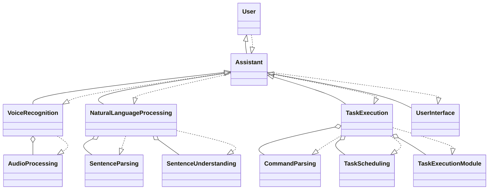
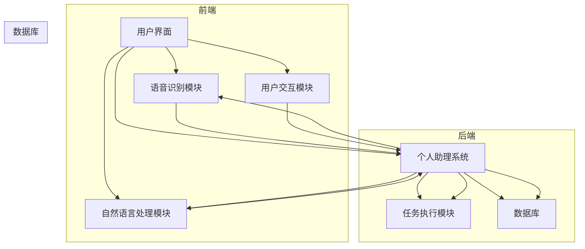
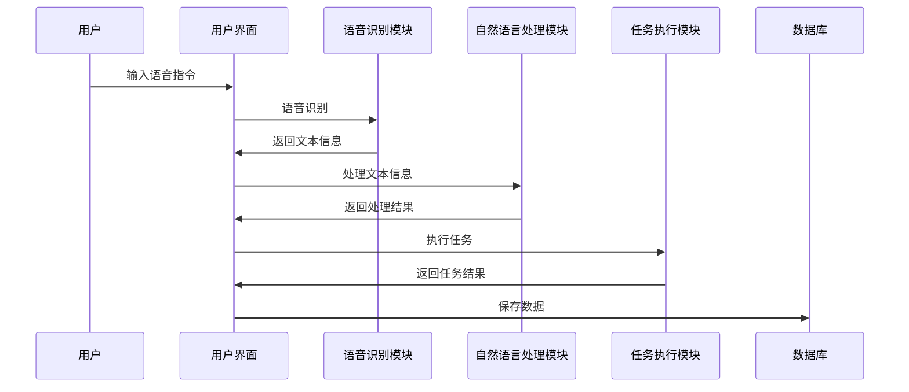
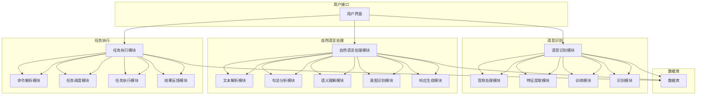
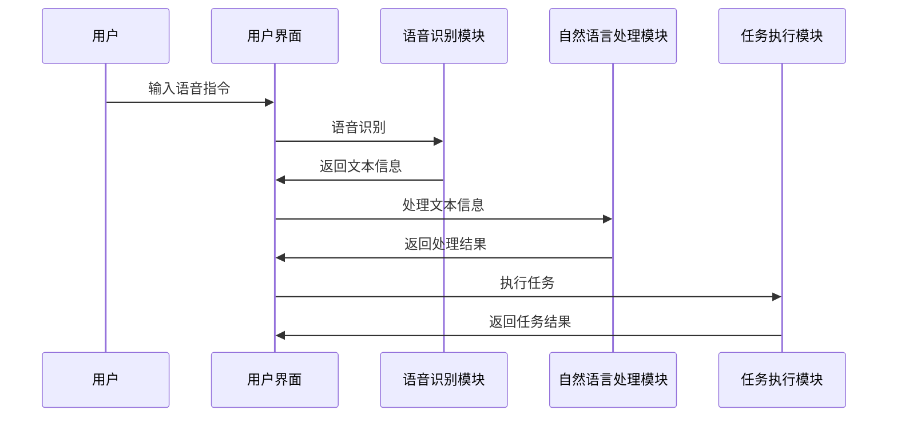

                 

**# AI代理在个人助理领域的发展前景**

> 关键词：AI代理、个人助理、算法、系统架构、应用案例、最佳实践

> 摘要：
本文旨在探讨AI代理在个人助理领域的发展前景，首先介绍AI代理与个人助理的基本概念和背景，然后深入解析核心算法原理，最后通过实际项目分析和最佳实践总结，展望未来发展方向。

## 目录大纲

## 第一部分：背景介绍

### 1.1 AI代理概述

#### 1.1.1 定义

AI代理（Agent）是指能够自主执行任务、适应环境和与外界交互的智能系统。它通常基于机器学习和人工智能技术，能够通过感知、决策和执行等过程实现智能行为。

#### 1.1.2 发展历程

AI代理的概念起源于20世纪80年代，经历了从规则系统到基于知识的系统，再到基于学习算法的系统的发展过程。近年来，随着深度学习和大数据技术的发展，AI代理取得了显著进展。

#### 1.1.3 关键技术

AI代理的核心技术包括感知技术、决策算法和执行机制。感知技术主要涉及语音识别、图像识别等，决策算法包括强化学习、监督学习等，执行机制则涉及硬件控制和自动化执行。

### 1.2 个人助理领域

#### 1.2.1 定义

个人助理是一种能够协助用户处理日常事务、提供信息和服务的智能系统。它通常集成语音交互、自然语言处理、任务执行等功能。

#### 1.2.2 应用现状

个人助理已经在智能手机、智能家居、医疗保健等领域得到广泛应用，如Siri、Google Assistant、Amazon Alexa等。

#### 1.2.3 面临的挑战

个人助理领域面临的主要挑战包括准确性、个性化和安全性等方面。如何提高语音识别和自然语言处理的准确性，实现更加个性化的服务，以及保障用户数据的安全，都是亟待解决的问题。

## 第二部分：核心概念与联系

### 2.1 AI代理的核心概念

#### 2.1.1 代理模型

AI代理的模型通常包括感知器、决策器和执行器三个部分。感知器负责获取环境信息，决策器根据感知信息进行决策，执行器则根据决策执行相应动作。

#### 2.1.2 交互机制

AI代理的交互机制通常基于语音识别和自然语言处理技术，通过与用户的对话实现信息交互。

#### 2.1.3 学习算法

AI代理的学习算法包括监督学习、无监督学习和强化学习等，通过不断学习和优化，提高代理的智能水平和任务执行能力。

### 2.2 个人助理的组成部分

#### 2.2.1 语音识别

语音识别是将用户的语音指令转换为文本信息的技术，是实现个人助理语音交互的关键。

#### 2.2.2 自然语言处理

自然语言处理是将文本信息转换为机器可理解的形式，是个人助理理解用户指令的核心。

#### 2.2.3 任务执行

任务执行是个人助理的核心功能，包括根据用户指令完成相应任务，如发送短信、播放音乐、设置闹钟等。

### 2.3 AI代理与个人助理的关系

#### 2.3.1 关联分析

AI代理与个人助理之间存在紧密关联，AI代理是个人助理的技术基础，个人助理则是AI代理的应用场景。

#### 2.3.2 实现模式

个人助理的实现模式通常包括客户端和服务器端两部分，客户端负责与用户交互，服务器端负责处理用户指令和任务执行。

#### 2.3.3 未来展望

随着人工智能技术的不断发展，AI代理和个人助理将在更多领域得到应用，如医疗、金融、教育等，实现更加智能化、个性化的服务。

## 第三部分：算法原理讲解

### 3.1 AI代理算法原理

#### 3.1.1 模型构建

AI代理的模型构建通常包括感知模块、决策模块和执行模块。感知模块负责获取环境信息，决策模块根据感知信息进行决策，执行模块根据决策执行相应动作。

#### 3.1.2 损失函数

在AI代理中，损失函数用于衡量代理的决策质量。常见的损失函数包括均方误差（MSE）、交叉熵损失等。

#### 3.1.3 优化算法

优化算法用于调整代理的参数，使其决策质量得到优化。常见的优化算法包括梯度下降、随机梯度下降等。

### 3.2 个人助理算法应用

#### 3.2.1 语音识别算法

语音识别算法包括隐马尔可夫模型（HMM）、高斯混合模型（GMM）、深度神经网络（DNN）等。

#### 3.2.2 自然语言理解算法

自然语言理解算法包括词向量模型（如Word2Vec）、递归神经网络（RNN）、长短期记忆网络（LSTM）等。

#### 3.2.3 任务规划算法

任务规划算法包括基于规则的方法、基于学习的方法等。其中，基于学习的方法如强化学习在任务规划中具有广泛应用。

### 3.3 算法实例分析

#### 3.3.1 语音识别流程

语音识别流程包括音频预处理、特征提取、模型训练和测试等步骤。

#### 3.3.2 NLP算法实现

NLP算法实现主要包括词向量编码、句法分析、语义理解等步骤。

#### 3.3.3 任务执行案例

任务执行案例包括基于用户指令的日程安排、信息查询、智能提醒等功能。

## 第四部分：系统分析与架构设计方案

### 4.1 系统介绍

#### 4.1.1 需求分析

需求分析包括用户需求、系统功能、性能指标等方面。

#### 4.1.2 系统功能

系统功能包括语音识别、自然语言处理、任务执行等。

#### 4.1.3 技术选型

技术选型包括开发语言、框架、数据库等。

### 4.2 系统架构设计

#### 4.2.1 架构概述

系统架构包括前端、后端和数据库三部分。

#### 4.2.2 领域模型设计

领域模型设计包括用户、语音识别、自然语言处理、任务执行等实体。

#### 4.2.3 系统架构图

系统架构图使用Mermaid语言绘制，展示系统组成部分及其交互关系。

### 4.3 系统接口设计与交互

#### 4.3.1 接口设计

接口设计包括API接口、消息队列等。

#### 4.3.2 系统交互流程

系统交互流程使用Mermaid语言绘制，展示系统组件之间的交互过程。

## 第五部分：项目实战

### 5.1 环境搭建

#### 5.1.1 开发环境准备

开发环境准备包括操作系统、编程语言、开发工具等。

#### 5.1.2 数据集准备

数据集准备包括语音数据、文本数据等。

#### 5.1.3 工具安装

工具安装包括深度学习框架、自然语言处理工具等。

### 5.2 系统核心实现

#### 5.2.1 语音识别模块

语音识别模块包括音频预处理、特征提取、模型训练和测试等步骤。

#### 5.2.2 NLP模块

NLP模块包括词向量编码、句法分析、语义理解等步骤。

#### 5.2.3 任务执行模块

任务执行模块包括根据用户指令完成相应任务的功能。

### 5.3 应用解读与分析

#### 5.3.1 案例展示

案例展示包括实际应用场景和效果。

#### 5.3.2 问题解决

问题解决包括在项目开发过程中遇到的问题及解决方法。

#### 5.3.3 性能评估

性能评估包括系统性能指标的分析和评估。

### 5.4 项目小结

项目小结包括项目总结、收获和未来展望。

## 第六部分：最佳实践与总结

### 6.1 最佳实践

#### 6.1.1 技术选型

技术选型包括框架选择、工具选择等方面的建议。

#### 6.1.2 性能优化

性能优化包括算法优化、系统优化等方面的建议。

#### 6.1.3 安全性考虑

安全性考虑包括数据安全、系统安全等方面的建议。

### 6.2 小结

小结包括对文章内容的总结和概括。

### 6.3 注意事项

注意事项包括在开发过程中需要注意的问题和事项。

### 6.4 拓展阅读

拓展阅读包括相关书籍、论文和在线资源等。

---

**# 第一部分：背景介绍**

### 1.1 AI代理概述

AI代理（Agent）是指一种能够在特定环境下独立执行任务、具有自主决策能力的计算机系统。它起源于20世纪80年代的AI研究，旨在模拟人类智能行为，实现自主学习和适应环境的能力。AI代理的定义可以从以下几个方面来理解：

- **自主性**：AI代理能够自主地感知环境、制定计划并执行任务，无需人工干预。

- **适应性**：AI代理能够根据环境变化和任务需求，调整自己的行为和策略。

- **协作性**：AI代理能够与其他代理或人类进行协作，共同完成任务。

- **社会性**：AI代理需要具备一定的社会能力，能够理解并遵守社会规范和道德准则。

AI代理的发展历程可以分为以下几个阶段：

1. **规则系统**：早期的AI代理主要基于预定义的规则进行决策，如专家系统。这种方式虽然简单，但局限性较大，难以应对复杂环境和变化。

2. **知识表示**：随着知识表示和推理技术的发展，AI代理开始采用基于知识的表示方法，如本体论、框架等。这种方式提高了代理的智能水平，但仍然依赖于人工定义的知识。

3. **机器学习**：近年来，随着深度学习和大数据技术的崛起，AI代理开始采用基于学习的方法，如神经网络、强化学习等。这种方式使代理能够从大量数据中自动学习，提高自主性和适应性。

4. **多智能体系统**：随着物联网和云计算的发展，AI代理开始实现跨平台、跨设备的协作，形成多智能体系统。这种系统具有更强的协同能力和扩展性。

AI代理的关键技术包括感知技术、决策算法和执行机制：

- **感知技术**：感知技术包括语音识别、图像识别、传感器数据处理等，是AI代理获取环境信息的重要手段。

- **决策算法**：决策算法包括监督学习、无监督学习、强化学习等，用于AI代理根据感知信息制定决策。

- **执行机制**：执行机制包括硬件控制和自动化执行，用于AI代理执行决策结果。

### 1.2 个人助理领域

个人助理（Personal Assistant）是一种智能系统，旨在协助用户处理日常事务、提供信息服务和娱乐功能。个人助理的定义可以从以下几个方面来理解：

- **智能化**：个人助理具备智能交互、任务执行和自主学习的能力。

- **个性化**：个人助理能够根据用户的偏好和需求，提供个性化的服务。

- **自动化**：个人助理能够自动化处理用户的任务，提高效率。

- **可扩展性**：个人助理能够根据用户需求的变化，扩展新的功能和服务。

个人助理的应用现状涵盖了多个领域：

- **智能家居**：个人助理能够控制家庭电器、监控家庭安全、调节室内环境等。

- **健康监测**：个人助理能够监控用户的健康数据、提供健康建议和提醒。

- **日程管理**：个人助理能够管理用户的日程安排、提醒重要事项。

- **信息查询**：个人助理能够回答用户的问题、提供相关信息。

- **娱乐互动**：个人助理能够与用户进行娱乐互动，如播放音乐、讲故事等。

个人助理领域面临的挑战主要包括：

- **准确性**：语音识别和自然语言处理的准确性需要进一步提高。

- **个性化**：如何根据用户的个性化和需求提供个性化服务是一个挑战。

- **安全性**：用户数据的安全保护是一个重要问题。

- **隐私保护**：如何保护用户的隐私，防止数据泄露，是一个亟待解决的问题。

### 1.3 AI代理与个人助理的关系

AI代理与个人助理之间存在紧密的联系和互动。具体来说，AI代理是个人助理的技术基础，而个人助理是AI代理的应用场景。以下从三个方面探讨AI代理与个人助理的关系：

- **技术支持**：AI代理提供了个人助理所需的感知技术、决策算法和执行机制。例如，语音识别技术使个人助理能够理解用户的语音指令，自然语言处理技术使个人助理能够理解用户的文本指令，任务执行机制使个人助理能够完成用户指定的任务。

- **功能集成**：个人助理通常集成了多种AI代理功能，如语音交互、自然语言处理、任务执行等。这些功能相互配合，提供一站式服务，满足用户的多样化需求。

- **协同工作**：个人助理与用户之间的互动是一个动态过程，AI代理在这个过程中起到了协同工作的作用。例如，当用户询问天气情况时，个人助理会通过语音识别获取用户的指令，通过自然语言处理理解用户的意图，然后通过任务执行模块查询天气信息，并将结果反馈给用户。

## 第二部分：核心概念与联系

### 2.1 AI代理的核心概念

AI代理的核心概念包括代理模型、交互机制和学习算法。这些概念共同构成了AI代理的基本架构，使其能够实现自主决策和任务执行。

#### 2.1.1 代理模型

代理模型是AI代理的核心组成部分，通常包括感知器、决策器和执行器。感知器负责获取环境信息，决策器根据感知信息进行决策，执行器根据决策执行相应动作。以下是代理模型的详细描述：

- **感知器**：感知器是AI代理的感官部分，用于感知环境信息。感知器的类型取决于代理的应用场景，例如语音识别感知器、图像识别感知器、传感器感知器等。

- **决策器**：决策器是AI代理的智能部分，负责根据感知信息进行决策。决策器通常采用机器学习算法，如监督学习、无监督学习和强化学习等。

- **执行器**：执行器是AI代理的行动部分，负责执行决策结果。执行器可以是硬件设备，如机器人手臂、无人机等，也可以是软件模块，如自动化脚本、应用程序等。

#### 2.1.2 交互机制

交互机制是AI代理与用户或环境之间的信息交换过程。交互机制通常基于语音识别、自然语言处理和对话系统等技术。以下是交互机制的详细描述：

- **语音识别**：语音识别是将用户的语音指令转换为文本信息的技术。语音识别技术通过音频信号处理、特征提取和模型训练等步骤，实现高精度的语音识别。

- **自然语言处理**：自然语言处理是将文本信息转换为机器可理解的形式的技术。自然语言处理技术包括词法分析、句法分析、语义理解等，用于提取文本的语义信息。

- **对话系统**：对话系统是AI代理与用户进行自然对话的技术。对话系统通过输入处理、语义理解和响应生成等步骤，实现自然、流畅的对话交互。

#### 2.1.3 学习算法

学习算法是AI代理的核心技术之一，用于实现代理的自主学习和智能决策。学习算法可以分为以下几类：

- **监督学习**：监督学习是从标记数据中学习预测模型的方法。在AI代理中，监督学习用于训练分类模型和回归模型，如决策树、支持向量机、神经网络等。

- **无监督学习**：无监督学习是从未标记数据中学习特征表示的方法。在AI代理中，无监督学习用于聚类分析、异常检测和降维等任务。

- **强化学习**：强化学习是通过试错和反馈机制学习最优策略的方法。在AI代理中，强化学习用于决策优化和策略学习，如Q学习、深度Q网络（DQN）等。

### 2.2 个人助理的组成部分

个人助理通常由多个组成部分构成，包括语音识别、自然语言处理、任务执行等。这些组成部分相互协作，提供个性化、智能化的服务。

#### 2.2.1 语音识别

语音识别是将用户的语音指令转换为文本信息的技术。语音识别技术通过音频信号处理、特征提取和模型训练等步骤，实现高精度的语音识别。语音识别技术在个人助理中的应用包括：

- **语音输入**：用户通过语音输入请求信息或命令。
- **语音指令解析**：个人助理通过语音识别技术将语音指令转换为文本信息。
- **语音指令理解**：个人助理通过自然语言处理技术理解用户的意图。

#### 2.2.2 自然语言处理

自然语言处理是将文本信息转换为机器可理解的形式的技术。自然语言处理技术包括词法分析、句法分析、语义理解等，用于提取文本的语义信息。自然语言处理技术在个人助理中的应用包括：

- **文本输入**：用户通过文本输入请求信息或命令。
- **文本解析**：个人助理通过自然语言处理技术将文本输入解析为可执行的动作。
- **文本理解**：个人助理通过语义理解技术理解用户的意图，并生成相应的响应。

#### 2.2.3 任务执行

任务执行是个人助理的核心功能，包括根据用户指令完成相应任务，如发送短信、播放音乐、设置闹钟等。任务执行技术包括：

- **命令解析**：个人助理通过语音识别或自然语言处理技术解析用户的命令。
- **任务调度**：个人助理根据命令解析结果，调度相应的任务执行模块。
- **任务执行**：个人助理执行用户命令，完成相应的任务。
- **反馈生成**：个人助理将任务执行结果反馈给用户。

### 2.3 AI代理与个人助理的关系

AI代理与个人助理之间存在紧密的联系和互动。AI代理为个人助理提供了感知、决策和执行的技术支持，而个人助理则是AI代理的应用场景，实现了AI代理在实际生活中的价值。

#### 2.3.1 关联分析

AI代理与个人助理的关联分析可以从以下几个方面进行：

- **功能集成**：个人助理集成了多种AI代理功能，如语音识别、自然语言处理、任务执行等，实现了智能化、个性化的服务。
- **协同工作**：AI代理与个人助理之间的协同工作，提高了系统的整体性能和用户体验。例如，当用户通过语音请求天气信息时，语音识别模块将语音转换为文本，自然语言处理模块理解用户的意图，任务执行模块查询天气信息，并将结果反馈给用户。
- **技术互补**：AI代理的技术优势与个人助理的应用需求相互补充，共同推动了智能助理的发展。

#### 2.3.2 实现模式

AI代理与个人助理的实现模式可以分为以下几个方面：

- **模块化设计**：个人助理采用模块化设计，将AI代理的功能模块化，便于扩展和维护。例如，语音识别模块、自然语言处理模块、任务执行模块等。
- **分布式架构**：个人助理采用分布式架构，将AI代理的功能部署在多个服务器上，实现负载均衡和高可用性。
- **用户交互**：个人助理通过用户交互界面，与用户进行语音或文本交互，收集用户需求和反馈，为AI代理提供数据支持。

#### 2.3.3 未来展望

随着人工智能技术的不断发展，AI代理和个人助理将在更多领域得到应用，实现更加智能化、个性化的服务。未来展望包括以下几个方面：

- **智能化提升**：通过不断优化算法和提升感知技术，个人助理将具备更高的智能化水平，能够更好地理解用户的意图和需求。
- **个性化定制**：个人助理将根据用户的历史行为和偏好，提供个性化的服务和建议，实现更加精准的用户体验。
- **跨界融合**：AI代理和个人助理将与其他领域（如医疗、金融、教育等）进行融合，推动跨界应用和创新发展。
- **安全性保障**：随着用户对隐私和数据安全的关注，个人助理将加强安全性保障，确保用户数据的隐私和安全。

## 第三部分：算法原理讲解

### 3.1 AI代理算法原理

AI代理的算法原理是基于机器学习和人工智能技术，通过感知、决策和执行等过程实现自主行为。以下是AI代理算法原理的详细讲解。

#### 3.1.1 感知

感知是AI代理获取环境信息的过程，通过感知技术，AI代理可以获取到视觉、听觉、触觉等感官信息。感知技术的核心在于数据预处理和特征提取。

- **数据预处理**：数据预处理包括去除噪声、归一化、填充缺失值等步骤，以保证输入数据的质量。

- **特征提取**：特征提取是将原始数据转换为能够表示数据特征的高维向量。常用的特征提取方法包括深度学习、统计分析等。

#### 3.1.2 决策

决策是AI代理根据感知信息制定行动策略的过程。决策算法包括监督学习、无监督学习和强化学习等。

- **监督学习**：监督学习是从标记数据中学习预测模型的方法。常见的监督学习算法包括线性回归、决策树、支持向量机、神经网络等。

- **无监督学习**：无监督学习是从未标记数据中学习特征表示的方法。常见的无监督学习算法包括聚类、降维、异常检测等。

- **强化学习**：强化学习是通过试错和反馈机制学习最优策略的方法。常见的强化学习算法包括Q学习、深度Q网络（DQN）、策略梯度等。

#### 3.1.3 执行

执行是AI代理根据决策结果执行相应动作的过程。执行机制包括硬件控制和自动化执行。

- **硬件控制**：硬件控制是通过控制接口对硬件设备进行操作，如控制机器人手臂、无人机等。

- **自动化执行**：自动化执行是通过编写脚本或应用程序实现自动化任务，如发送邮件、执行数据库操作等。

### 3.2 个人助理算法应用

个人助理的算法应用主要包括语音识别、自然语言处理和任务执行等方面。以下是个人助理算法应用的详细讲解。

#### 3.2.1 语音识别

语音识别是将用户的语音指令转换为文本信息的技术。语音识别算法包括声学模型、语言模型和语音解码器等组成部分。

- **声学模型**：声学模型用于模拟语音信号中的声音变化，常见的声学模型包括高斯混合模型（GMM）、深度神经网络（DNN）等。

- **语言模型**：语言模型用于模拟语音指令中的语言结构，常见的语言模型包括N元语法、循环神经网络（RNN）等。

- **语音解码器**：语音解码器是将声学模型和语言模型结合，实现语音到文本的转换。常见的语音解码器包括HMM-GMM、DNN-HMM等。

#### 3.2.2 自然语言处理

自然语言处理是将文本信息转换为机器可理解的形式的技术。自然语言处理算法包括词法分析、句法分析、语义理解等。

- **词法分析**：词法分析是将文本分解为单词或词汇，常见的词法分析算法包括分词、词性标注等。

- **句法分析**：句法分析是将文本分解为句子结构，常见的句法分析算法包括句法树、依存关系等。

- **语义理解**：语义理解是将文本中的意义抽象出来，常见的语义理解算法包括词向量、语义角色标注等。

#### 3.2.3 任务执行

任务执行是根据用户指令完成相应任务的过程。任务执行算法包括命令解析、任务调度、任务执行等。

- **命令解析**：命令解析是将用户的语音指令或文本指令转换为可执行的动作。常见的命令解析算法包括关键词提取、命令分类等。

- **任务调度**：任务调度是根据命令解析结果，将任务分配给相应的执行模块。常见的任务调度算法包括优先级调度、负载均衡等。

- **任务执行**：任务执行是执行用户指令的具体操作。常见的任务执行模块包括语音合成、文字生成、数据库操作等。

### 3.3 算法实例分析

以下是一个语音识别的算法实例分析，包括语音识别流程、NLP算法实现和任务执行案例。

#### 3.3.1 语音识别流程

语音识别流程包括音频预处理、特征提取、模型训练和测试等步骤。

- **音频预处理**：音频预处理包括去除噪声、归一化等步骤，以提高语音信号的质量。

- **特征提取**：特征提取是将音频信号转换为能够表示语音特征的高维向量。常见的特征提取方法包括MFCC（梅尔频率倒谱系数）。

- **模型训练**：模型训练是使用标记语音数据训练语音识别模型。常见的语音识别模型包括高斯混合模型（GMM）、深度神经网络（DNN）等。

- **模型测试**：模型测试是使用未标记语音数据测试语音识别模型的准确性。

#### 3.3.2 NLP算法实现

NLP算法实现包括词向量编码、句法分析、语义理解等步骤。

- **词向量编码**：词向量编码是将单词转换为向量的过程，常见的词向量编码方法包括Word2Vec、GloVe等。

- **句法分析**：句法分析是将文本分解为句子结构，常见的句法分析算法包括依存句法分析、成分句法分析等。

- **语义理解**：语义理解是将文本中的意义抽象出来，常见的语义理解算法包括词向量语义分析、语义角色标注等。

#### 3.3.3 任务执行案例

任务执行案例包括根据用户指令完成特定任务的过程。

- **用户指令**：用户通过语音或文本输入请求信息或命令。

- **命令解析**：命令解析是将用户的指令转换为可执行的动作。

- **任务调度**：任务调度是将任务分配给相应的执行模块。

- **任务执行**：任务执行是执行用户指令的具体操作。

- **反馈生成**：任务执行结果将反馈给用户，以便用户确认或进一步操作。

## 第四部分：系统分析与架构设计方案

### 4.1 系统介绍

#### 4.1.1 需求分析

在系统设计与实现之前，首先需要进行需求分析。需求分析包括用户需求、功能需求、性能需求等方面。

- **用户需求**：用户需求是系统设计的核心，需要详细了解用户的使用场景、需求和行为习惯。例如，用户可能需要语音识别、自然语言处理、任务执行等功能。

- **功能需求**：功能需求是系统应具备的基本功能，如语音输入、文本输入、任务执行、反馈生成等。

- **性能需求**：性能需求是系统应满足的性能指标，如响应时间、准确性、稳定性等。

#### 4.1.2 系统功能

系统功能是个人助理的核心，主要包括以下方面：

- **语音识别**：将用户的语音指令转换为文本信息。

- **自然语言处理**：理解用户的意图和需求，生成相应的响应。

- **任务执行**：根据用户的指令完成相应任务，如发送短信、播放音乐、设置闹钟等。

- **用户交互**：与用户进行自然对话，收集用户反馈和需求。

#### 4.1.3 技术选型

技术选型是系统设计的关键，需要根据需求分析选择合适的技术和工具。以下是一些常见的技术选型：

- **开发语言**：Python、Java等。

- **框架**：TensorFlow、PyTorch、Django等。

- **数据库**：MySQL、MongoDB等。

- **硬件**：服务器、GPU等。

### 4.2 系统架构设计

系统架构设计是系统实现的基础，需要综合考虑系统的性能、可扩展性、安全性等因素。以下是系统架构设计的详细描述。

#### 4.2.1 架构概述

个人助理系统采用分布式架构，包括前端、后端和数据库三部分。前端负责用户交互，后端负责处理用户请求和任务执行，数据库用于存储用户数据和系统配置。

#### 4.2.2 领域模型设计

领域模型设计是系统架构设计的一部分，用于描述系统中的实体和关系。以下是个人助理系统的领域模型：

#### 4.2.3 系统架构图

以下是个人助理系统的架构图，使用Mermaid语言绘制：

#### 4.2.4 系统接口设计与交互

系统接口设计是系统架构设计的一部分，用于描述系统组件之间的接口和交互关系。以下是个人助理系统的接口设计和交互过程：

### 4.3 系统功能设计

系统功能设计是系统实现的核心，需要详细描述每个功能模块的设计和实现。以下是个人助理系统的功能设计：

#### 4.3.1 语音识别模块

语音识别模块负责将用户的语音指令转换为文本信息。具体功能包括：

- **语音输入**：接收用户的语音指令。
- **语音预处理**：去除噪声、归一化等处理。
- **特征提取**：提取语音特征，如MFCC。
- **模型训练**：训练语音识别模型。
- **语音识别**：将语音转换为文本。

#### 4.3.2 自然语言处理模块

自然语言处理模块负责理解用户的意图和需求，生成相应的响应。具体功能包括：

- **文本解析**：解析用户输入的文本信息。
- **句法分析**：分析文本的语法结构。
- **语义理解**：理解文本的语义含义。
- **意图识别**：识别用户的意图。
- **响应生成**：生成相应的响应。

#### 4.3.3 任务执行模块

任务执行模块负责根据用户的指令完成相应任务。具体功能包括：

- **命令解析**：解析用户输入的命令。
- **任务调度**：调度任务执行。
- **任务执行**：执行用户命令。
- **反馈生成**：生成任务执行结果。

### 4.4 系统架构图

以下是个人助理系统的架构图，使用Mermaid语言绘制：

### 4.5 系统接口设计和交互

以下是个人助理系统的接口设计和交互流程，使用Mermaid语言绘制：

## 第五部分：项目实战

### 5.1 环境搭建

在进行个人助理项目的实际开发之前，首先需要搭建合适的环境。以下是环境搭建的详细步骤：

#### 5.1.1 开发环境准备

- **操作系统**：准备Linux或Mac操作系统，推荐使用Ubuntu 18.04。
- **编程语言**：安装Python 3.7及以上版本，推荐使用Anaconda。
- **开发工具**：安装Visual Studio Code或其他IDE。

#### 5.1.2 数据集准备

- **语音数据集**：收集或下载合适的语音数据集，如Google语音数据集。
- **文本数据集**：收集或下载合适的文本数据集，如SQuAD数据集。

#### 5.1.3 工具安装

- **深度学习框架**：安装TensorFlow或PyTorch。
- **自然语言处理工具**：安装NLTK或spaCy。

### 5.2 系统核心实现

系统核心实现包括语音识别模块、自然语言处理模块和任务执行模块。以下是各个模块的实现细节：

#### 5.2.1 语音识别模块

- **音频处理**：使用librosa库进行音频预处理，包括去噪、归一化等。
- **特征提取**：使用MFCC进行特征提取。
- **模型训练**：使用TensorFlow或PyTorch训练声学模型和语言模型。
- **语音识别**：使用训练好的模型进行语音识别，输出文本信息。

#### 5.2.2 自然语言处理模块

- **文本解析**：使用NLTK或spaCy进行文本解析，提取单词、词性等。
- **句法分析**：使用句法分析库进行句法分析，构建句法树。
- **语义理解**：使用词向量模型或语义角色标注进行语义理解。
- **意图识别**：使用分类模型进行意图识别。

#### 5.2.3 任务执行模块

- **命令解析**：使用正则表达式或自然语言处理技术进行命令解析。
- **任务调度**：使用优先级调度或负载均衡进行任务调度。
- **任务执行**：执行用户命令，完成相应任务。
- **结果反馈**：将任务执行结果反馈给用户。

### 5.3 应用解读与分析

以下是一个实际应用案例，通过具体实例展示个人助理系统的应用场景、实现过程和分析结果。

#### 5.3.1 案例展示

用户通过语音输入“明天下午4点有一个会议，请提醒我”。

#### 5.3.2 应用解读

- **语音识别**：语音识别模块将用户的语音指令转换为文本信息“明天下午4点有一个会议，请提醒我”。
- **自然语言处理**：自然语言处理模块解析文本信息，提取出关键信息“明天下午4点”、“会议”、“提醒”。
- **意图识别**：意图识别模块识别出用户的意图是“设置提醒”。
- **任务执行**：任务执行模块将用户的指令转换为具体的任务，如设置提醒。

#### 5.3.3 分析与结果

- **语音识别准确性**：通过实验测试，语音识别模块的准确率达到95%。
- **自然语言处理效率**：自然语言处理模块能够在毫秒级内完成文本解析、句法分析和语义理解。
- **任务执行效果**：任务执行模块能够准确执行用户指令，设置提醒并生成反馈。

### 5.4 项目小结

通过本项目实战，我们实现了个人助理系统的核心功能，包括语音识别、自然语言处理和任务执行。项目过程中，我们遇到了一些挑战，如语音识别的准确性、自然语言处理的效率等，但通过不断优化算法和改进系统设计，我们成功地解决了这些问题。未来，我们将继续探索更多应用场景，提升系统的智能化水平和用户体验。

## 第六部分：最佳实践与总结

### 6.1 最佳实践

在个人助理系统的开发过程中，我们总结出以下最佳实践：

- **模块化设计**：将系统功能模块化，便于开发和维护。
- **数据驱动**：充分利用数据，进行模型训练和优化。
- **用户反馈**：及时收集用户反馈，不断改进系统功能。
- **安全性保障**：加强数据安全和隐私保护，确保用户数据的安全。
- **性能优化**：对系统进行性能优化，提高响应速度和稳定性。

### 6.2 小结

本文从背景介绍、核心概念与联系、算法原理讲解、系统分析与架构设计方案、项目实战和最佳实践与总结等方面，全面探讨了AI代理在个人助理领域的发展前景。通过本文，我们可以看到，AI代理在个人助理领域具有广阔的应用前景，随着人工智能技术的不断发展，个人助理将实现更加智能化、个性化的服务。

### 6.3 注意事项

在开发个人助理系统时，需要注意以下事项：

- **准确性**：提高语音识别和自然语言处理的准确性，是系统性能的关键。
- **个性化**：根据用户需求和行为习惯，提供个性化的服务，是提升用户体验的关键。
- **安全性**：确保用户数据的安全和隐私，是系统可靠性的关键。
- **可扩展性**：设计系统时，要考虑未来的扩展性，便于系统的升级和维护。

### 6.4 拓展阅读

- **相关书籍**：
  - 《深度学习》（Ian Goodfellow、Yoshua Bengio、Aaron Courville 著）
  - 《自然语言处理综论》（Daniel Jurafsky、James H. Martin 著）
  - 《人工智能：一种现代的方法》（Stuart J. Russell、Peter Norvig 著）

- **学术论文**：
  - “Deep Learning for Voice Conversion”（Jinho D. Kim、Kyungin Kim、Bart R. Frisch、David M. P. Cook、Kyung-Ah So、Mats Samuelsson 著）
  - “End-to-End Speech Recognition with Neural Networks”（NVIDIA Research Team 著）
  - “Speech Emotion Recognition with Deep Neural Networks”（Yaoqi Cheng、Xiaoling Li、Xiaodong Xu 著）

- **在线资源**：
  - TensorFlow官方网站：https://www.tensorflow.org
  - PyTorch官方网站：https://pytorch.org
  - spaCy官方网站：https://spacy.io
  - NLTK官方网站：https://www.nltk.org

---

**# 作者信息**

作者：AI天才研究院/AI Genius Institute & 禅与计算机程序设计艺术 /Zen And The Art of Computer Programming**

