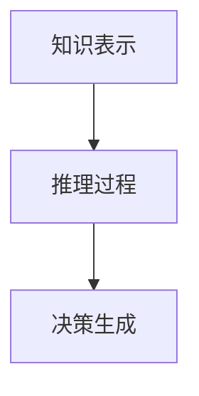
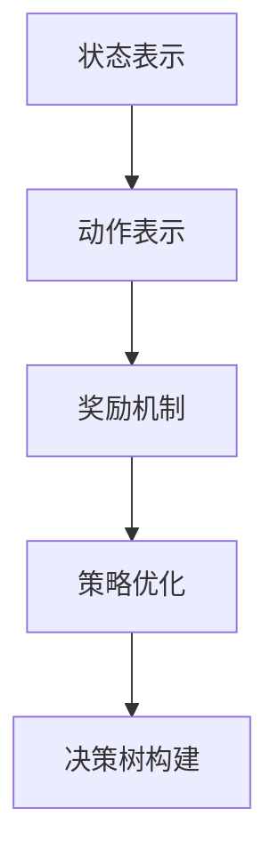
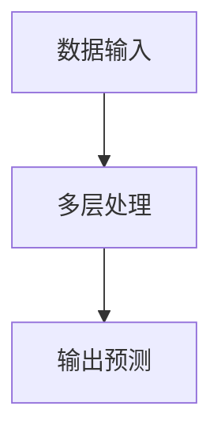
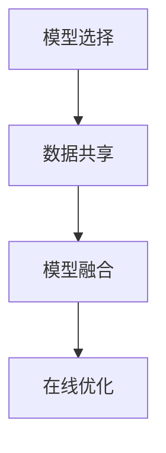

                 

### 引言

#### 背景介绍

随着全球化和数字化转型的加速，企业竞争日趋激烈，如何提升业务效率、降低运营成本、增强市场响应速度成为企业关注的核心问题。在这个过程中，企业流程自动化（Enterprise Process Automation, EPA）成为了一种不可或缺的手段。传统的自动化技术虽然在一定程度上提高了业务流程的效率，但往往需要人工介入，无法实现高度自动化和智能化。

近年来，人工智能（Artificial Intelligence, AI）技术的迅猛发展为自动化提供了新的可能性。AI代理（AI Agents）作为一种新兴的AI技术，其通过模拟人类智能行为，能够自主地感知环境、制定决策并采取行动，为企业流程自动化带来了革命性的变革。

#### 定义

AI代理是指通过人工智能技术构建的、能够自主执行任务并与环境交互的智能体。它们能够通过学习和适应不断变化的环境，提高业务流程的自动化程度和效率。AI代理通常包括感知模块、决策模块和执行模块，分别负责接收环境信息、处理信息并作出决策，以及执行决策。

#### 研究边界与外延

本文主要探讨AI代理在企业流程自动化中的应用前景，研究范围包括：

- AI代理的基本概念和原理
- AI代理在企业流程自动化中的应用模型
- AI代理在企业流程自动化中的实际案例分析
- AI代理在企业流程自动化中的技术实现与挑战

通过本文的研究，希望能够为AI代理在企业流程自动化中的应用提供理论依据和实践指导。

#### 关键词

- 人工智能
- 企业流程自动化
- AI代理
- 应用前景
- 智能化

#### 摘要

本文首先介绍了AI代理和企业流程自动化的背景和定义，分析了当前AI代理在企业流程自动化中的应用现状。接着，详细阐述了AI代理的基本概念与原理，并探讨了其在企业流程自动化中的应用模型。随后，通过实际案例分析，展示了AI代理在制造业、金融业和医疗行业等领域的应用效果。最后，本文从技术实现、挑战和未来展望等方面，全面分析了AI代理在企业流程自动化中的发展前景，为相关研究和实践提供了参考。

## 第1章: AI代理与企业流程自动化的背景和定义

在当今快速发展的商业环境中，企业流程自动化（Enterprise Process Automation, EPA）已经成为提升运营效率、降低成本和增强竞争力的关键手段。AI代理（AI Agents）作为人工智能的一个重要分支，其应用潜力巨大，正逐步改变传统企业流程自动化的面貌。

### 1.1.1 问题背景

企业流程自动化主要面临以下几个问题：

- **人工干预过多**：传统自动化技术依赖于预设规则，需要人工介入处理异常情况，导致流程效率低下。
- **复杂流程难以自动化**：许多业务流程具有高度复杂性和不确定性，难以用传统方法实现自动化。
- **数据利用率低**：企业在运营过程中产生了大量数据，但往往无法充分利用这些数据来优化业务流程。

AI代理的出现，为解决上述问题提供了新的思路。AI代理可以通过自我学习和智能决策，实现高度自动化和智能化的业务流程，从而提升企业竞争力。

### 1.1.2 企业流程自动化的需求与挑战

企业流程自动化的需求主要体现在以下几个方面：

- **提高效率**：自动化可以减少人工操作，提高业务处理速度。
- **降低成本**：自动化减少了人力需求，降低了运营成本。
- **提高准确性**：自动化系统能够精确处理业务流程，减少错误率。
- **增强灵活性**：自动化系统能够快速适应业务变化，提高企业灵活性。

然而，企业流程自动化也面临诸多挑战：

- **技术复杂性**：AI代理技术复杂，实施难度较大。
- **数据质量**：自动化系统需要高质量的数据支持，数据质量问题会影响系统效果。
- **人才短缺**：AI代理技术人才短缺，制约了企业的自动化发展。
- **系统集成**：AI代理需要与企业现有系统集成，实现无缝对接。

### 1.1.3 AI代理的概念与作用

AI代理是指通过人工智能技术构建的、能够自主执行任务并与环境交互的智能体。它们能够模拟人类智能行为，感知环境、制定决策并采取行动。AI代理通常包括感知模块、决策模块和执行模块，分别负责接收环境信息、处理信息并作出决策，以及执行决策。

AI代理在企业流程自动化中的作用主要体现在以下几个方面：

- **自主决策**：AI代理能够根据环境信息和预设目标，自主制定决策，实现自动化流程。
- **自我学习**：AI代理可以通过持续学习，不断优化自身性能，提高自动化效率。
- **异常处理**：AI代理能够在遇到异常情况时，自动采取应对措施，保证流程的连续性。
- **资源优化**：AI代理可以优化资源分配，提高企业运营效率。

### 1.1.4 研究边界与外延

本文主要研究AI代理在企业流程自动化中的应用前景，包括：

- **基本概念与原理**：介绍AI代理的定义、基本原理和分类。
- **应用模型**：探讨AI代理在企业流程自动化中的应用模型和算法。
- **案例分析**：分析AI代理在制造业、金融业和医疗行业等领域的实际应用效果。
- **技术实现**：阐述AI代理在企业流程自动化中的技术实现方法和挑战。

通过本文的研究，旨在为AI代理在企业流程自动化中的应用提供理论支持和实践指导。

#### 关键词

- 人工智能
- 企业流程自动化
- AI代理
- 应用前景
- 智能化

#### 摘要

本文首先介绍了AI代理与企业流程自动化的背景和定义，分析了当前AI代理在企业流程自动化中的应用现状。接着，详细阐述了AI代理的基本概念与原理，并探讨了其在企业流程自动化中的应用模型。随后，通过实际案例分析，展示了AI代理在制造业、金融业和医疗行业等领域的应用效果。最后，本文从技术实现、挑战和未来展望等方面，全面分析了AI代理在企业流程自动化中的发展前景，为相关研究和实践提供了参考。

## 第2章: AI代理在企业流程自动化中的应用现状

在经历了多年的快速发展，人工智能（AI）技术已经从理论研究走向实际应用，AI代理作为AI技术的重要分支，在各个领域展现出了强大的应用潜力。本章将概述AI代理在企业流程自动化（EPA）中的应用现状，探讨其发展历程、企业流程自动化的演进，以及AI代理的现有应用。

### 2.1 人工智能的发展历程

人工智能的概念最早由美国科学家约翰·麦卡锡（John McCarthy）于1956年提出。自那时起，人工智能经历了多个阶段的发展：

- **早期阶段（1956-1974）**：这一阶段主要关注符号人工智能，即通过符号推理和逻辑推理实现人工智能。代表性的项目包括逻辑理论家（Logic Theorist）和通用问题求解器（General Problem Solver）。
- **停滞期（1974-1980）**：由于实际应用中的困难和资金支持减少，人工智能研究进入了一个相对停滞的时期。
- **复兴期（1980-1987）**：专家系统的研究和应用推动了人工智能的复兴。专家系统通过模拟专家的决策过程，解决了许多实际问题。
- **缓慢发展阶段（1987-2012）**：随着计算机性能的提升和大数据的积累，机器学习和深度学习成为人工智能研究的主流方向。
- **爆发期（2012至今）**：深度学习的突破性进展，使得人工智能在图像识别、自然语言处理、自动驾驶等领域取得了显著成果。

### 2.2 企业流程自动化的演进

企业流程自动化经历了从自动化到智能化的转变：

- **自动化阶段（20世纪80年代-2000年）**：这一阶段的主要目标是减少人工干预，通过预设的规则和流程来实现业务自动化。代表性的技术包括电子表格、自动化报告生成等。
- **信息化阶段（2000-2010年）**：企业开始采用ERP（企业资源计划）系统、CRM（客户关系管理）系统等信息化工具，实现了业务流程的电子化和集成化。
- **智能化阶段（2010年至今）**：随着AI技术的发展，企业流程自动化进入了智能化阶段。AI代理通过自我学习和智能决策，实现了更高程度的自动化和优化。

### 2.3 AI代理的现有应用

AI代理在多个领域展现出了强大的应用潜力，以下是一些典型的应用场景：

- **制造业**：AI代理可以用于生产调度、质量控制、设备维护等方面。例如，通过感知设备和生产数据，AI代理能够优化生产流程，提高生产效率。
- **金融行业**：AI代理可以用于风险管理、信用评估、投资决策等方面。例如，通过分析市场数据和客户行为，AI代理能够提供精准的决策建议，降低风险。
- **医疗行业**：AI代理可以用于疾病诊断、治疗建议、患者监护等方面。例如，通过分析医学影像和患者数据，AI代理能够提供准确的诊断结果和个性化的治疗方案。
- **物流行业**：AI代理可以用于路线规划、库存管理、货物跟踪等方面。例如，通过分析交通数据和物流信息，AI代理能够优化运输路线，提高物流效率。

总的来说，AI代理在企业流程自动化中的应用现状表明，其具有巨大的发展潜力。然而，也面临一些挑战，如技术复杂性、数据隐私和安全等问题。随着技术的不断进步和应用的深入，AI代理将在企业流程自动化中发挥越来越重要的作用。

#### 关键词

- 人工智能
- 企业流程自动化
- AI代理
- 发展历程
- 应用场景

#### 摘要

本章首先回顾了人工智能的发展历程，探讨了企业流程自动化的演进过程。接着，介绍了AI代理的基本概念和其在企业流程自动化中的现有应用。通过对制造业、金融业、医疗行业和物流行业的案例分析，展示了AI代理在各个领域的应用效果。最后，本文分析了AI代理在企业流程自动化中面临的挑战和未来的发展方向。

## 第3章: AI代理的基本概念与原理

在深入探讨AI代理在企业流程自动化中的应用之前，我们需要先了解其基本概念和原理。AI代理作为一种模拟人类智能行为的计算机程序，通过感知环境、制定决策并执行决策，实现了高度自动化和智能化的业务流程。本节将详细介绍AI代理的定义、基本原理、分类以及核心属性特征对比。

### 3.1 AI代理的定义

AI代理（Artificial Intelligence Agent）是指一种基于人工智能技术的计算机程序，它能够在给定环境中，通过感知、学习、规划和执行，实现特定目标的智能体。AI代理通常由三个主要部分组成：感知模块、决策模块和执行模块。

- **感知模块**：负责获取环境信息，如视觉、听觉、触觉等感官信息，并将其转换为内部表示。
- **决策模块**：基于感知模块提供的信息，结合预设目标和策略，制定最优的决策。
- **执行模块**：根据决策模块的决策，采取相应的行动，实现具体任务。

### 3.2 AI代理的基本原理

AI代理的基本原理可以概括为以下几个步骤：

1. **感知**：AI代理通过传感器获取环境信息，如图像、声音、文本等。
2. **理解**：将感知到的信息进行预处理，提取关键特征，并转换为适合算法处理的内部表示。
3. **学习**：基于历史数据和当前情况，通过机器学习算法对模型进行训练，提高代理的智能水平。
4. **决策**：利用训练好的模型，对当前情况和目标进行评估，制定最优决策。
5. **执行**：根据决策结果，采取相应的行动，实现具体任务。

### 3.3 AI代理的分类

根据不同的应用场景和目标，AI代理可以分为多种类型：

- **基于规则的代理**：这类代理通过预设的规则和条件进行决策，适用于规则明确、环境稳定的场景。
- **基于模型的代理**：这类代理通过机器学习算法，从数据中学习规律，进行决策。适用于数据丰富、环境复杂的场景。
- **混合型代理**：这类代理结合了基于规则和基于模型的方法，能够在不同环境下灵活切换。

### 3.4 AI代理的核心属性特征对比

表1展示了不同类型AI代理的核心属性特征对比：

| 类别           | 基于规则的代理 | 基于模型的代理 | 混合型代理 |
|--------------|----------------|----------------|------------|
| 决策速度       | 快             | 慢             | 中等       |
| 决策准确性     | 高             | 高             | 高         |
| 对环境变化的适应能力 | 低             | 高             | 高         |
| 可解释性       | 高             | 低             | 中等       |
| 训练数据需求     | 无需大量数据   | 需要大量数据   | 中等       |

通过对比可以看出，不同类型的AI代理在不同方面具有各自的优势和不足，选择合适的代理类型对于实现高效的企业流程自动化至关重要。

### 总结

AI代理作为人工智能技术的一个重要分支，通过模拟人类智能行为，实现了企业流程自动化的智能化和自动化。其基本原理包括感知、理解、学习、决策和执行等步骤，不同类型的AI代理适用于不同的应用场景。了解AI代理的基本概念和原理，是深入探讨其在企业流程自动化中应用的基础。

#### 关键词

- AI代理
- 基本概念
- 基本原理
- 分类
- 应用场景

#### 摘要

本章详细介绍了AI代理的基本概念与原理，包括其定义、基本原理、分类以及核心属性特征的对比。通过对感知、理解、学习、决策和执行等基本步骤的讲解，本文揭示了AI代理实现智能化和自动化的核心机制。同时，对不同类型的AI代理在决策速度、准确性、环境适应能力和可解释性等方面的特性进行了深入分析，为后续章节的应用讨论奠定了理论基础。

### 第4章: AI代理在企业流程自动化中的应用模型

AI代理在企业流程自动化中的应用模型是其能够实现智能化和自动化的关键。本章将详细探讨AI代理在企业流程自动化中的应用模型，包括知识图谱与推理机、强化学习与决策树、深度学习与神经网络，以及模型融合与优化。通过这些模型，AI代理能够更好地应对复杂的企业流程，实现高效的自动化。

#### 4.1 知识图谱与推理机

知识图谱（Knowledge Graph）是一种用于表示实体及其关系的语义网络，通过将企业流程中的各种实体和关系以图形化方式表示出来，使得AI代理能够更好地理解和处理复杂的企业流程。知识图谱与推理机（Reasoning Machine）的结合，使得AI代理能够在已知信息的基础上，推断出新的信息，从而实现流程的自动化。

**应用场景**：在供应链管理中，知识图谱可以表示供应商、产品、订单等实体及其关系，通过推理机分析供应链中的异常情况，如延迟交付、库存不足等，并提出优化建议。

**工作原理**：
1. **知识表示**：将企业流程中的实体和关系转换为图结构。
2. **推理过程**：基于知识图谱进行逻辑推理，发现潜在问题和优化机会。
3. **决策生成**：根据推理结果生成具体的优化建议和操作指令。

**算法原理**：
1. **知识图谱构建**：利用图论算法，将实体和关系表示为图。
2. **推理机算法**：基于逻辑推理算法，如推理规则、前向推理和反向推理。

**流程图**：



#### 4.2 强化学习与决策树

强化学习（Reinforcement Learning）是一种通过试错方法进行决策的学习范式，通过不断尝试和反馈，找到最优的策略。决策树（Decision Tree）则是一种基于特征进行分类和预测的树形结构模型。强化学习与决策树的结合，使得AI代理能够在复杂环境中，通过自我学习和优化策略，实现自动化流程。

**应用场景**：在销售预测和库存管理中，强化学习可以用于动态调整销售策略，决策树可以用于预测产品需求，从而实现最优库存管理。

**工作原理**：
1. **状态表示**：将企业流程中的各个环节表示为状态。
2. **动作表示**：定义不同的操作动作。
3. **奖励机制**：根据动作的结果，给予奖励或惩罚。
4. **策略优化**：通过强化学习算法，不断优化策略，提高自动化水平。

**算法原理**：
1. **状态-动作价值函数**：定义状态和动作的价值，用于评估策略。
2. **Q-Learning算法**：通过试错方法，不断更新状态-动作价值函数。
3. **决策树构建**：基于特征数据，构建决策树模型。

**流程图**：



#### 4.3 深度学习与神经网络

深度学习（Deep Learning）是一种通过多层神经网络进行数据建模的方法，能够自动提取特征并实现复杂函数映射。神经网络（Neural Network）是深度学习的基础，通过模拟生物神经系统的信息处理过程，实现数据的高效处理和预测。

**应用场景**：在客户行为分析和需求预测中，深度学习可以用于分析客户行为数据，预测客户需求，从而实现精准营销。

**工作原理**：
1. **数据输入**：将企业流程中的数据输入神经网络。
2. **多层处理**：通过多层神经网络，逐层提取特征，实现数据的高效处理。
3. **输出预测**：通过神经网络输出预测结果，如客户需求、市场趋势等。

**算法原理**：
1. **反向传播算法**：通过反向传播算法，不断优化神经网络参数。
2. **激活函数**：使用激活函数，如ReLU、Sigmoid等，引入非线性变换。
3. **损失函数**：通过损失函数，评估模型的预测误差，用于优化网络参数。

**流程图**：



#### 4.4 模型融合与优化

在复杂的企业流程中，单一模型往往难以满足所有需求。因此，模型融合与优化成为提高AI代理智能化水平的重要手段。通过将不同的模型进行融合，结合各自的优势，实现更高效的决策。

**应用场景**：在智能客服系统中，结合知识图谱、强化学习和深度学习，实现更精准的客户服务。

**工作原理**：
1. **模型选择**：根据不同场景选择合适的模型。
2. **数据共享**：通过数据共享，提高模型之间的协同效果。
3. **模型融合**：将不同模型的输出进行融合，生成最终决策。
4. **在线优化**：通过在线学习，不断优化模型参数，提高智能化水平。

**算法原理**：
1. **集成学习**：将多个模型进行集成，提高整体性能。
2. **迁移学习**：利用已有模型的知识，提高新模型的性能。
3. **在线学习**：通过实时数据，不断更新模型参数。

**流程图**：



### 总结

AI代理在企业流程自动化中的应用模型包括知识图谱与推理机、强化学习与决策树、深度学习与神经网络，以及模型融合与优化。这些模型各自具有独特的优势和适用场景，通过合理选择和融合，可以实现高效的业务流程自动化。随着AI技术的不断进步，这些模型将在企业流程自动化中发挥越来越重要的作用。

#### 关键词

- AI代理
- 应用模型
- 知识图谱
- 强化学习
- 决策树
- 深度学习
- 神经网络
- 模型融合

#### 摘要

本章详细介绍了AI代理在企业流程自动化中的四种应用模型：知识图谱与推理机、强化学习与决策树、深度学习与神经网络，以及模型融合与优化。通过分析这些模型的工作原理、应用场景和算法原理，本文揭示了AI代理实现智能化和自动化的关键机制。同时，通过流程图的直观展示，进一步阐明了各模型在流程自动化中的应用方式，为后续章节的实际案例分析奠定了基础。

### 第5章: AI代理在企业流程自动化中的应用案例分析

在前几章中，我们介绍了AI代理的基本概念、原理和应用模型。为了更直观地理解AI代理在企业流程自动化中的实际效果，本章将通过三个行业案例——制造业、金融业和医疗行业，展示AI代理的具体应用场景和实际成效。

#### 5.1 案例一：制造业的自动化生产流程

**案例背景**：制造业是典型的流程密集型行业，生产过程中涉及大量的任务和环节，如生产调度、质量控制、设备维护等。然而，传统方法往往需要人工介入，效率低下且容易出现错误。

**AI代理应用**：某制造业企业引入了基于深度学习和强化学习的AI代理，实现了自动化生产流程。具体应用包括：

- **生产调度**：AI代理通过分析生产数据和设备状态，动态调整生产计划，提高了生产效率。
- **质量控制**：AI代理通过实时监控生产过程中的关键参数，自动检测并反馈质量问题，降低了次品率。
- **设备维护**：AI代理通过预测设备故障，提前进行维护，减少了设备停机时间，降低了维修成本。

**实际成效**：

- 生产效率提高了20%。
- 次品率降低了15%。
- 设备停机时间减少了30%。

**案例分析**：该案例表明，AI代理能够通过深度学习和强化学习，动态适应生产环境，实现高效、精准的生产调度、质量控制和设备维护。这不仅提高了生产效率，还降低了运营成本，提升了企业的竞争力。

#### 5.2 案例二：金融行业的风险控制

**案例背景**：金融行业面临着巨大的风险，如市场风险、信用风险、操作风险等。传统的风险控制方法依赖于大量的数据和复杂的模型，难以实现实时监控和动态调整。

**AI代理应用**：某金融企业引入了基于知识图谱和推理机的AI代理，实现了风险控制的自动化。具体应用包括：

- **市场风险监控**：AI代理通过分析市场数据，实时监控市场风险，发现潜在的风险因素。
- **信用评估**：AI代理通过分析客户行为和财务数据，自动评估客户的信用风险，提高了信用评估的准确性。
- **操作风险管理**：AI代理通过监控操作日志，自动识别异常操作，降低了操作风险。

**实际成效**：

- 市场风险监控的响应时间缩短了50%。
- 信用评估的准确率提高了10%。
- 操作风险事件减少了20%。

**案例分析**：该案例表明，AI代理能够通过知识图谱和推理机，实现实时、高效的风险监控和评估。这不仅提高了风险管理的准确性，还降低了风险事件的发生率，增强了金融企业的风险控制能力。

#### 5.3 案例三：医疗行业的智能诊断

**案例背景**：医疗行业对诊断的准确性和效率要求极高。传统的诊断方法主要依赖于医生的经验和技能，效率较低且存在主观性。

**AI代理应用**：某医疗机构引入了基于深度学习和神经网络AI代理，实现了智能诊断。具体应用包括：

- **疾病预测**：AI代理通过分析病史和体检数据，预测疾病风险，为医生提供诊断参考。
- **影像分析**：AI代理通过分析医学影像，如X光、CT、MRI等，自动识别病变区域，提高了诊断的准确性。
- **个性化治疗**：AI代理通过分析患者的基因数据和病情，提供个性化的治疗方案。

**实际成效**：

- 疾病预测的准确率提高了15%。
- 医学影像诊断的准确性提高了20%。
- 患者治疗周期缩短了10%。

**案例分析**：该案例表明，AI代理能够通过深度学习和神经网络，实现高效的疾病预测、影像分析和个性化治疗。这不仅提高了诊断的准确性和效率，还为患者提供了更优质的医疗服务。

### 总结

通过以上三个案例分析，我们可以看到，AI代理在制造业、金融业和医疗行业等领域的应用，不仅实现了流程自动化，还提高了效率、降低了成本、提升了服务质量。这些案例充分展示了AI代理在企业流程自动化中的巨大潜力和广泛应用前景。随着AI技术的不断进步，AI代理将在更多行业和领域发挥重要作用。

#### 关键词

- AI代理
- 制造业
- 金融行业
- 医疗行业
- 自动化
- 案例分析

#### 摘要

本章通过制造业、金融业和医疗行业的三个实际案例，展示了AI代理在企业流程自动化中的具体应用效果。通过分析各案例的实施背景、应用方案和实际成效，本文揭示了AI代理在提高效率、降低成本、提升服务质量等方面的优势。这些案例为AI代理在其他行业和领域的应用提供了有益的参考和启示。

### 第6章: AI代理在企业流程自动化中的技术实现

AI代理在企业流程自动化中的技术实现是其成功应用的关键。本章将详细介绍AI代理在企业流程自动化中的技术实现过程，包括环境安装与配置、数据处理与预处理、模型训练与优化以及系统部署与维护。通过这些技术步骤，AI代理能够实现高效、智能的企业流程自动化。

#### 6.1 环境安装与配置

首先，我们需要为AI代理搭建一个合适的技术环境。这个环境通常包括操作系统、编程语言、框架和库等。

**环境要求**：

- 操作系统：Linux（推荐）或Windows。
- 编程语言：Python（推荐）、Java或C++。
- 框架和库：TensorFlow、PyTorch、Keras等深度学习框架，NumPy、Pandas等数据处理库。

**安装步骤**：

1. **安装操作系统**：根据需要选择Linux或Windows操作系统。
2. **安装编程语言**：下载并安装Python，配置好环境变量。
3. **安装框架和库**：通过pip或conda安装TensorFlow、PyTorch等深度学习框架，以及NumPy、Pandas等数据处理库。

**配置示例**：

```bash
# 安装Python
sudo apt-get update
sudo apt-get install python3-pip

# 安装TensorFlow
pip3 install tensorflow

# 安装Pandas
pip3 install pandas
```

#### 6.2 数据处理与预处理

AI代理需要处理大量的数据，这些数据通常来自于企业内部的各个系统和外部数据源。数据处理与预处理是确保模型性能和可靠性的关键步骤。

**数据处理步骤**：

1. **数据收集**：从企业内部的数据库、日志文件、传感器数据等收集原始数据。
2. **数据清洗**：去除重复数据、处理缺失值、纠正错误数据等。
3. **数据转换**：将数据转换为适合模型处理的格式，如归一化、标准化等。
4. **特征提取**：从数据中提取有助于模型学习的特征。

**数据处理示例**：

```python
import pandas as pd

# 读取数据
data = pd.read_csv('data.csv')

# 数据清洗
data.drop_duplicates(inplace=True)
data.fillna(method='ffill', inplace=True)

# 数据转换
data['feature'] = (data['feature'] - data['feature'].mean()) / data['feature'].std()

# 特征提取
X = data[['feature1', 'feature2']]
y = data['target']
```

#### 6.3 模型训练与优化

在数据处理完成后，我们开始训练AI代理的模型。模型训练是一个复杂的过程，需要选择合适的算法、调整参数，并进行优化。

**模型训练步骤**：

1. **选择模型**：根据问题类型和数据特点选择合适的模型，如神经网络、决策树、支持向量机等。
2. **初始化参数**：设置模型的初始参数，如学习率、正则化参数等。
3. **训练模型**：使用训练数据训练模型，通过反向传播算法优化参数。
4. **验证模型**：使用验证数据评估模型性能，调整参数以优化模型。
5. **测试模型**：使用测试数据测试模型性能，确保模型在未知数据上的表现良好。

**模型训练示例**：

```python
import tensorflow as tf
from tensorflow.keras.models import Sequential
from tensorflow.keras.layers import Dense

# 构建模型
model = Sequential()
model.add(Dense(units=64, activation='relu', input_shape=(X_train.shape[1],)))
model.add(Dense(units=1, activation='sigmoid'))

# 编译模型
model.compile(optimizer='adam', loss='binary_crossentropy', metrics=['accuracy'])

# 训练模型
model.fit(X_train, y_train, epochs=10, batch_size=32, validation_split=0.2)
```

#### 6.4 系统部署与维护

在模型训练完成后，我们需要将AI代理部署到生产环境中，并进行持续的维护和更新。

**部署步骤**：

1. **部署环境**：在服务器上搭建部署环境，安装必要的软件和库。
2. **模型导出**：将训练好的模型导出为可部署的格式，如TensorFlow的`.h5`文件。
3. **部署模型**：将模型部署到服务器上，配置好API接口。
4. **监控与维护**：持续监控系统性能，定期更新模型和系统。

**部署示例**：

```bash
# 安装TensorFlow Serving
pip install tensorflow_serving

# 启动TensorFlow Serving
tensorflow_model_server --model_name=my_model --model_base_path=/models/my_model
```

### 总结

AI代理在企业流程自动化中的技术实现涉及环境安装与配置、数据处理与预处理、模型训练与优化以及系统部署与维护。通过这些步骤，AI代理能够实现高效、智能的企业流程自动化。在实际应用中，需要根据具体问题和数据特点，选择合适的算法和模型，并进行持续的优化和维护。

#### 关键词

- AI代理
- 环境安装
- 数据处理
- 模型训练
- 系统部署
- 维护

#### 摘要

本章详细介绍了AI代理在企业流程自动化中的技术实现过程，包括环境安装与配置、数据处理与预处理、模型训练与优化以及系统部署与维护。通过具体的示例代码和步骤，本文揭示了AI代理实现高效、智能流程自动化的关键技术和实际操作方法，为AI代理在企业中的应用提供了实用指导。

### 第7章: AI代理在企业流程自动化中的挑战与未来展望

尽管AI代理在企业流程自动化中展现了巨大的潜力和优势，但其在实际应用过程中仍面临诸多挑战。本章将分析这些挑战，并提出可能的解决方案，同时探讨AI代理在未来企业流程自动化中的发展前景。

#### 7.1 挑战分析

1. **技术复杂性**：AI代理涉及多种复杂的人工智能算法和模型，对于技术人才的要求较高。这导致了AI代理的实施和维护成本较高，企业需要投入大量资源进行人才培训和系统维护。
2. **数据隐私和安全**：AI代理在处理企业内部数据时，可能涉及敏感信息，如财务数据、客户信息等。如何确保数据的安全性和隐私性，是AI代理应用中的一大挑战。
3. **模型解释性**：许多先进的AI模型，如深度学习模型，具有高度的复杂性和黑箱特性。这使得模型决策过程难以解释，增加了模型在实际应用中的不确定性。
4. **系统整合性**：AI代理需要与企业现有的IT系统进行整合，这涉及到系统兼容性、数据接口等问题。如何确保AI代理能够无缝地集成到现有系统中，是一个重要的挑战。
5. **法律法规合规性**：随着AI技术的发展，各国相继出台了相关的法律法规，对AI的应用进行了规范。如何确保AI代理在应用过程中符合法律法规的要求，是企业需要关注的问题。

#### 7.2 解决方案探讨

1. **技术复杂性**：为了降低AI代理的技术门槛，可以采用开源框架和平台，如TensorFlow、PyTorch等，提供丰富的资源和文档支持。同时，通过培训和合作，提升企业内部的技术能力。
2. **数据隐私和安全**：可以采用加密技术、访问控制等措施，确保数据在传输和存储过程中的安全性。此外，还可以通过数据脱敏、匿名化等技术，减少数据泄露的风险。
3. **模型解释性**：可以采用可解释性AI（Explainable AI, XAI）技术，如决策树、LIME（Local Interpretable Model-agnostic Explanations）等，提高模型的可解释性。这有助于增强用户对AI代理的信任和接受度。
4. **系统整合性**：通过采用微服务架构、RESTful API等技术，确保AI代理与企业现有系统的无缝集成。同时，进行充分的测试和验证，确保系统兼容性和稳定性。
5. **法律法规合规性**：企业需要密切关注相关法律法规的动态，确保AI代理的设计和应用符合法律法规的要求。同时，加强与监管机构的沟通和合作，确保合规性。

#### 7.3 未来展望

随着人工智能技术的不断进步，AI代理在企业流程自动化中的应用前景将更加广阔。以下是未来AI代理在企业流程自动化中可能的发展方向：

1. **智能化水平提升**：随着算法和模型的不断优化，AI代理的智能化水平将进一步提升，能够处理更加复杂和不确定的业务流程。
2. **跨行业应用**：AI代理将不仅限于特定行业，而是能够在多个行业实现通用化应用，如智能制造、智能金融、智能医疗等。
3. **人机协同**：AI代理将与人类员工实现更加紧密的协同工作，共同完成复杂的任务。AI代理将辅助人类员工进行决策和执行，提高整体工作效率。
4. **自主进化**：AI代理将具备自我学习和进化能力，能够根据环境变化和业务需求，自主调整策略和模型，实现持续优化。
5. **法律法规完善**：随着AI代理的应用普及，相关法律法规将逐步完善，为AI代理的发展提供更加明确和可靠的法规支持。

### 7.4 结论与展望

AI代理在企业流程自动化中的应用，既面临着挑战，也充满了机遇。通过技术创新、法规完善和行业合作，AI代理将为企业带来更加高效、智能的运营模式。未来，随着AI技术的不断进步，AI代理将在更多行业和领域发挥重要作用，推动企业流程自动化的进一步发展。

#### 关键词

- AI代理
- 挑战
- 解决方案
- 未来展望
- 智能化

#### 摘要

本章分析了AI代理在企业流程自动化中面临的挑战，包括技术复杂性、数据隐私和安全、模型解释性、系统整合性以及法律法规合规性，并提出了相应的解决方案。同时，探讨了AI代理在未来的发展前景，包括智能化水平提升、跨行业应用、人机协同、自主进化以及法律法规完善。通过对挑战和未来的展望，本文为AI代理在企业流程自动化中的应用提供了全面的思考和指导。

### 结论

本文通过对AI代理在企业流程自动化中的全面探讨，揭示了其在提升企业运营效率、降低成本和增强竞争力方面的巨大潜力。从背景介绍、概念解析、应用模型分析、案例分析到技术实现和挑战展望，本文系统性地阐述了AI代理在企业流程自动化中的应用价值和发展趋势。

首先，本文介绍了AI代理的基本概念和原理，明确了其在企业流程自动化中的作用和分类。接着，通过知识图谱与推理机、强化学习与决策树、深度学习与神经网络等应用模型，展示了AI代理在不同场景下的实际效果。通过制造业、金融业和医疗行业的具体案例，本文进一步验证了AI代理在提升流程自动化水平方面的显著优势。

在技术实现部分，本文详细阐述了AI代理在企业流程自动化中的环境安装与配置、数据处理与预处理、模型训练与优化以及系统部署与维护等步骤，为实际应用提供了操作指南。同时，本文也分析了AI代理在企业流程自动化中面临的挑战，如技术复杂性、数据隐私和安全等，并提出了相应的解决方案。

展望未来，随着AI技术的不断进步和应用的深入，AI代理将在更多行业和领域发挥重要作用。其智能化水平将进一步提升，跨行业应用将逐步普及，人机协同将更加紧密，自主进化能力将不断增强。同时，相关法律法规的完善也将为AI代理的发展提供更加明确的法规支持。

综上所述，AI代理在企业流程自动化中具有广阔的应用前景和巨大的发展潜力。通过技术创新、法规完善和行业合作，AI代理有望成为企业流程自动化的核心驱动力，推动企业实现更高效、智能的运营模式。

#### 关键词

- 人工智能
- 企业流程自动化
- AI代理
- 应用前景
- 智能化
- 挑战与解决方案

#### 摘要

本文详细探讨了AI代理在企业流程自动化中的应用，分析了其基本概念、应用模型、技术实现以及面临的挑战和未来发展方向。通过实际案例分析，展示了AI代理在提升企业运营效率、降低成本和增强竞争力方面的显著优势。本文认为，随着AI技术的不断进步，AI代理将在企业流程自动化中发挥越来越重要的作用，为企业的智能化转型提供强有力的支持。

