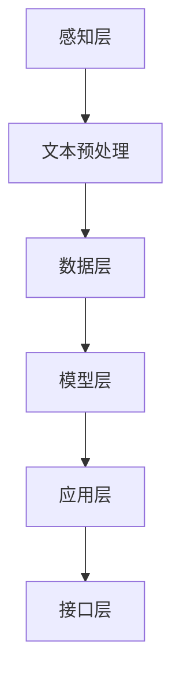

                 

# AI代理在法律咨询服务中的潜力

## 关键词
- 人工智能
- 法律咨询
- AI代理
- 机器学习
- 自然语言处理

## 摘要
本文探讨了人工智能（AI）代理在法律咨询服务中的应用潜力。通过分析AI代理的定义、特点，以及其在法律咨询领域的应用，文章阐述了AI代理如何通过机器学习和自然语言处理技术，解决法律咨询中面临的问题和挑战。同时，文章详细介绍了AI代理的技术基础、实现原理、应用实践，以及系统分析与架构设计。最后，对AI代理在法律咨询服务中的未来发展趋势和注意事项进行了总结和展望。

# 目录大纲：《AI代理在法律咨询服务中的潜力》

## 第一部分：引言

### 第1章：问题背景与法律咨询服务概述
- 人工智能与法律咨询的融合背景
- 法律咨询服务的挑战与需求
- AI代理在法律咨询服务中的意义

### 第2章：核心概念与联系
- AI代理的定义与特点
- 法律咨询服务的核心概念
- AI代理与法律咨询服务的关系

## 第二部分：技术基础

### 第3章：人工智能基础
- 人工智能概述
- 机器学习基础
- 自然语言处理基础

### 第4章：法律知识库构建
- 法律知识库的重要性
- 法律知识库的构建方法
- 法律知识库的维护与更新

### 第5章：AI代理实现原理
- AI代理的基本架构
- AI代理的算法原理
- AI代理的实现细节

## 第三部分：应用实践

### 第6章：AI代理在法律咨询中的应用
- AI代理在法律咨询服务中的具体应用场景
- AI代理在法律咨询中的应用流程
- AI代理在实际案例中的应用分析

### 第7章：系统分析与架构设计
- 法律咨询服务系统的整体架构设计
- 系统功能设计与实现
- 系统接口设计与交互

### 第8章：项目实战
- 项目环境搭建
- 系统核心实现源代码解析
- 代码应用解读与分析
- 实际案例分析与详细讲解剖析
- 项目小结

## 第四部分：总结与展望

### 第9章：总结与反思
- AI代理在法律咨询服务中的成效与问题
- 未来发展趋势与展望

### 第10章：注意事项与最佳实践
- 应用AI代理的注意事项
- AI代理在法律咨询服务中的最佳实践

## 第一部分：引言

### 第1章：问题背景与法律咨询服务概述

#### 人工智能与法律咨询的融合背景

随着人工智能（AI）技术的快速发展，各行各业都在探索如何将AI技术应用于实际业务中，以提高效率、降低成本和提升用户体验。法律咨询行业也不例外。法律咨询涉及大量的文本处理、信息检索、推理分析等任务，这些都是AI技术擅长的领域。因此，将AI技术引入法律咨询服务，已经成为行业发展的必然趋势。

近年来，随着机器学习和自然语言处理技术的不断进步，AI代理在法律咨询中的应用逐渐成为现实。AI代理可以自动化完成一些传统的法律咨询任务，如合同审查、法律文档分析、案件预测等，从而大大提高法律工作的效率和质量。

#### 法律咨询服务的挑战与需求

法律咨询服务面临着诸多挑战，包括：

1. **信息量庞大**：法律咨询需要处理大量的文本数据，包括法律条款、案例、判决书等。传统的手工处理方式效率低下，难以满足市场需求。
2. **专业性强**：法律咨询涉及复杂的法律知识和逻辑推理，需要高度专业化的知识和经验。
3. **成本高昂**：传统法律咨询服务成本较高，导致很多中小企业和个人无法承担。

为了解决上述问题，法律咨询服务迫切需要一种高效、低成本、智能化的解决方案，而AI代理正是这种需求的产物。

#### AI代理在法律咨询服务中的意义

AI代理在法律咨询服务中具有以下几方面的意义：

1. **提高效率**：AI代理可以自动化处理大量的法律文档，快速提取关键信息，辅助律师进行法律研究。
2. **降低成本**：通过自动化处理法律咨询任务，可以减少人力成本，降低法律服务费用。
3. **提升质量**：AI代理可以基于大量数据进行分析和预测，提供更准确的法律意见和建议。
4. **拓宽服务范围**：AI代理可以全天候服务，不受时间和地域限制，为更多人提供法律帮助。

总之，AI代理在法律咨询服务中的应用，不仅能够解决当前面临的挑战，还能够推动整个行业的变革和发展。

### 第2章：核心概念与联系

#### AI代理的定义与特点

AI代理，又称智能代理，是指基于人工智能技术构建的能够模拟人类行为、具备自主决策能力的软件系统。AI代理具有以下几个特点：

1. **自主学习**：AI代理可以通过机器学习算法不断学习和优化自身行为，提高任务处理能力。
2. **自主决策**：AI代理可以根据输入信息，利用推理算法自主做出决策，无需人工干预。
3. **适应性强**：AI代理可以适应不同的任务场景和需求，具备跨领域的应用能力。

#### 法律咨询服务的核心概念

法律咨询服务涉及以下核心概念：

1. **法律知识库**：法律知识库是法律咨询服务的基础，包含法律条款、案例、判例等法律信息。
2. **文本分析**：文本分析是法律咨询服务的核心技术，包括文本分类、实体识别、关系抽取等。
3. **推理算法**：推理算法是法律咨询服务的核心，用于根据法律知识库和文本分析结果，提供法律意见和建议。

#### AI代理与法律咨询服务的关系

AI代理与法律咨询服务之间的关系可以概括为以下几点：

1. **技术支持**：AI代理为法律咨询服务提供了强大的技术支持，使得法律工作可以更加高效、准确地进行。
2. **业务拓展**：AI代理可以帮助法律咨询机构拓展业务范围，提供更多元化的法律服务。
3. **人机协作**：AI代理可以与律师协同工作，实现人机结合，提高整体工作效率。

通过AI代理在法律咨询服务中的应用，可以实现法律工作的智能化、自动化，为用户提供更优质、高效的法律服务。

### 第二部分：技术基础

#### 第3章：人工智能基础

#### 人工智能概述

人工智能（Artificial Intelligence，简称AI）是指模拟、延伸和扩展人类智能的理论、方法、技术及应用。它旨在使计算机系统能够模拟人类智能，实现感知、学习、推理、决策、交流等功能。

人工智能的发展经历了几个重要阶段：

1. **符号主义阶段**：以逻辑推理和知识表示为核心，代表技术为专家系统和推理机。
2. **连接主义阶段**：以神经网络和深度学习为核心，代表技术为深度神经网络和卷积神经网络。
3. **进化计算阶段**：以模拟生物进化过程为核心，代表技术为遗传算法和进化策略。

#### 机器学习基础

机器学习（Machine Learning，简称ML）是人工智能的核心技术之一，它使计算机系统通过数据学习，自动改进和优化自身性能。机器学习主要包括以下几种方法：

1. **监督学习**：通过已有数据集的输入和输出关系，训练模型进行预测。常用的算法包括线性回归、决策树、支持向量机等。
2. **无监督学习**：通过分析未标注的数据集，发现数据中的规律和结构。常用的算法包括聚类、主成分分析等。
3. **半监督学习和增强学习**：结合监督学习和无监督学习，通过少量标注数据和大量未标注数据，或通过外部反馈进行学习。

#### 自然语言处理基础

自然语言处理（Natural Language Processing，简称NLP）是人工智能的重要分支，它旨在使计算机能够理解和处理自然语言。NLP主要包括以下几个子领域：

1. **文本分类**：将文本数据按照一定的标准进行分类，如情感分析、主题分类等。
2. **词性标注**：对文本中的每个词进行词性标注，如名词、动词、形容词等。
3. **命名实体识别**：识别文本中的特定实体，如人名、地名、组织名等。
4. **关系抽取**：抽取文本中的实体关系，如“张三和张三是一家公司同事”。
5. **机器翻译**：将一种自然语言翻译成另一种自然语言。
6. **语音识别**：将语音信号转换成文本。

#### 第4章：法律知识库构建

#### 法律知识库的重要性

法律知识库是法律咨询服务的重要基础，它包含法律条款、案例、判例等法律信息，为法律分析和决策提供支持。法律知识库的重要性体现在以下几个方面：

1. **提高工作效率**：法律知识库可以帮助律师快速定位相关法律信息，减少信息检索时间，提高工作效率。
2. **保证服务质量**：法律知识库确保了法律咨询服务的准确性和一致性，提高了服务品质。
3. **支持知识管理**：法律知识库有助于律师积累和传承法律经验，形成知识管理体系。

#### 法律知识库的构建方法

法律知识库的构建方法主要包括以下几个步骤：

1. **数据采集**：从各种法律文献、网站、数据库等渠道收集法律信息。
2. **数据预处理**：对采集到的法律信息进行清洗、去重、格式化等处理。
3. **知识表示**：将处理后的法律信息表示为计算机可以理解的形式，如本体、规则库等。
4. **知识融合**：将不同来源、不同格式的法律信息进行整合，形成统一的知识库。

#### 法律知识库的维护与更新

法律知识库的维护与更新是确保其质量和实用性的关键。主要包括以下几个方面的内容：

1. **数据维护**：定期检查法律知识库中的数据，更新过时、错误或不完整的信息。
2. **知识更新**：随着法律环境的变化，及时更新法律知识库中的法律条款、案例和判例。
3. **知识进化**：基于用户反馈和实际应用情况，不断优化和扩展法律知识库的功能和内容。

#### 第5章：AI代理实现原理

##### AI代理的基本架构

AI代理的基本架构主要包括以下几个部分：

1. **感知模块**：负责接收外部环境的信息，如文本、语音等。
2. **决策模块**：根据感知模块收集的信息，利用推理算法进行决策。
3. **执行模块**：根据决策模块的决策结果，执行相应的操作，如生成法律意见、发送邮件等。
4. **学习模块**：通过不断学习和优化，提高AI代理的决策能力和适应能力。

##### AI代理的算法原理

AI代理的算法原理主要基于机器学习和自然语言处理技术。以下是一个简单的算法流程：

1. **数据预处理**：对输入的文本数据进行清洗、去噪、分词等预处理操作。
2. **特征提取**：将预处理后的文本数据转换为计算机可以处理的特征向量。
3. **模型训练**：利用已标注的数据集，通过监督学习、无监督学习等算法训练模型。
4. **决策推理**：将新的文本数据输入模型，通过推理算法生成决策结果。
5. **反馈学习**：根据实际决策结果和用户反馈，不断优化和调整模型参数。

##### AI代理的实现细节

AI代理的实现细节包括以下几个方面：

1. **算法选择**：根据具体任务需求，选择合适的机器学习和自然语言处理算法，如线性回归、决策树、卷积神经网络等。
2. **模型优化**：通过调参、优化算法等手段，提高模型的性能和鲁棒性。
3. **系统集成**：将AI代理的各个模块集成到法律咨询系统中，实现人机交互和协同工作。

#### 第三部分：应用实践

##### 第6章：AI代理在法律咨询中的应用

##### AI代理在法律咨询服务中的具体应用场景

AI代理在法律咨询服务中具有广泛的应用场景，以下是一些典型的应用场景：

1. **合同审查**：AI代理可以自动审查合同条款，识别潜在的法律风险，提供修改建议。
2. **法律文档分析**：AI代理可以快速分析大量法律文档，提取关键信息，辅助律师进行法律研究。
3. **案件预测**：AI代理可以根据历史案例数据，预测案件的审理结果和判决倾向。
4. **法律咨询**：AI代理可以提供在线法律咨询服务，解答用户的法律问题，提供法律意见。

##### AI代理在法律咨询中的应用流程

AI代理在法律咨询中的应用流程通常包括以下几个步骤：

1. **用户提问**：用户通过系统提交法律问题，可以是文本形式或语音形式。
2. **文本预处理**：对用户提问进行文本预处理，如分词、词性标注、命名实体识别等。
3. **知识库查询**：将预处理后的文本数据与法律知识库进行匹配，提取相关法律条款和案例。
4. **决策推理**：利用推理算法，根据法律知识库中的信息，生成法律意见和预测结果。
5. **结果呈现**：将生成的法律意见和预测结果以文本或语音形式呈现给用户。

##### AI代理在实际案例中的应用分析

以下是一个实际案例的应用分析：

**案例背景**：某企业因合同纠纷诉至法院，企业需要法律意见以决定是否进行和解或上诉。

**应用过程**：
1. **用户提问**：企业通过系统提交了关于合同条款合法性、可能的法律风险等相关问题。
2. **文本预处理**：系统对用户提问进行了文本预处理，如分词、词性标注、命名实体识别等。
3. **知识库查询**：系统从法律知识库中提取了与合同条款合法性、法律风险相关的法律条款和案例。
4. **决策推理**：系统利用机器学习和自然语言处理技术，根据法律知识库中的信息，对合同条款的合法性、可能的法律风险进行了分析和预测。
5. **结果呈现**：系统生成了关于合同条款合法性、法律风险的分析报告，并建议企业根据分析结果决定是否进行和解或上诉。

**案例分析**：
1. **效率提升**：AI代理帮助企业快速获取了关于合同纠纷的法律意见，大大缩短了法律咨询的时间。
2. **准确性提高**：AI代理基于大量数据进行分析和预测，提供了更准确的法律意见。
3. **决策支持**：AI代理为企业提供了详细的案例分析报告，帮助企业在决策时更加全面、客观。

##### 第7章：系统分析与架构设计

##### 法律咨询服务系统的整体架构设计

法律咨询服务系统的整体架构设计包括以下几个层次：

1. **感知层**：负责接收用户输入的法律问题，进行文本预处理。
2. **数据层**：存储和管理法律知识库，包括法律条款、案例、判例等数据。
3. **模型层**：负责进行文本分析和决策推理，包括自然语言处理模型、机器学习模型等。
4. **应用层**：提供法律咨询服务的具体功能，如合同审查、法律文档分析、案件预测等。
5. **接口层**：负责与外部系统进行数据交互，如与法院系统、律师事务所系统等。

##### 系统功能设计与实现

法律咨询服务系统的功能设计主要包括以下几个方面：

1. **文本预处理**：包括分词、词性标注、命名实体识别等，为后续的文本分析和决策提供基础。
2. **知识库构建**：包括法律条款、案例、判例等数据的采集、清洗、存储和更新。
3. **文本分析**：包括文本分类、主题分类、情感分析等，用于提取法律文档中的关键信息。
4. **决策推理**：利用机器学习和自然语言处理技术，对法律问题进行推理和分析，生成法律意见。
5. **结果呈现**：将生成的法律意见以文本或语音形式呈现给用户。

##### 系统架构设计

法律咨询服务系统的架构设计如下图所示：



##### 系统接口设计与交互

法律咨询服务系统的接口设计主要包括以下几个方面：

1. **用户接口**：用于用户与系统的交互，提供法律问题的提交、结果查询等功能。
2. **服务接口**：用于系统内部模块之间的数据交互，如文本预处理模块与文本分析模块之间的数据传递。
3. **第三方接口**：与外部系统进行数据交互，如与法院系统、律师事务所系统等。

##### 第8章：项目实战

##### 项目环境搭建

在进行AI代理在法律咨询服务中的应用项目实战之前，首先需要搭建一个合适的项目环境。以下是一个简单的项目环境搭建步骤：

1. **软件环境**：安装Python、TensorFlow、NLTK等必要的软件和库。
2. **硬件环境**：配置一台具备足够计算能力的服务器或工作站。
3. **数据准备**：准备法律知识库，包括法律条款、案例、判例等数据。

##### 系统核心实现源代码解析

以下是AI代理在法律咨询服务中的核心实现源代码，用于文本预处理、知识库构建、文本分析和决策推理等模块：

```python
# 文本预处理模块
import nltk
from nltk.tokenize import word_tokenize
from nltk.corpus import stopwords

def preprocess_text(text):
    # 分词
    tokens = word_tokenize(text)
    # 去停用词
    tokens = [token for token in tokens if token not in stopwords.words('english')]
    return tokens

# 知识库构建模块
import pandas as pd

def build_knowledge_base(data_path):
    # 读取数据
    data = pd.read_csv(data_path)
    # 构建知识库
    knowledge_base = data.set_index('case_id')['case_text'].dropna().reset_index()
    return knowledge_base

# 文本分析模块
from sklearn.feature_extraction.text import TfidfVectorizer

def analyze_text(text, knowledge_base):
    # 提取特征
    vectorizer = TfidfVectorizer()
    X = vectorizer.fit_transform([text, knowledge_base['case_text']])
    # 计算相似度
    similarity = cosine_similarity(X)
    # 选择最相似的案例
    closest_case = knowledge_base.iloc[similarity[0].argmax()]
    return closest_case

# 决策推理模块
def make_decision(text, knowledge_base):
    closest_case = analyze_text(text, knowledge_base)
    # 根据最相似的案例生成决策结果
    decision = "根据相似案例，建议您：" + closest_case['case_result']
    return decision

# 主函数
if __name__ == "__main__":
    # 准备数据
    knowledge_base = build_knowledge_base('data/knowledge_base.csv')
    # 用户提问
    user_text = "我签订的合同是否合法？"
    # 预处理文本
    preprocessed_text = preprocess_text(user_text)
    # 生成决策结果
    decision = make_decision(preprocessed_text, knowledge_base)
    # 输出结果
    print(decision)
```

##### 代码应用解读与分析

以下是代码的应用解读与分析：

1. **文本预处理模块**：使用NLTK库进行分词和停用词去除，为后续的文本分析做准备。
2. **知识库构建模块**：使用Pandas库读取CSV文件，构建包含法律条款、案例、判例等数据的知识库。
3. **文本分析模块**：使用TF-IDF向量表示文本，并计算文本与法律知识库中案例的相似度，选择最相似的案例。
4. **决策推理模块**：根据最相似的案例生成决策结果，提供法律建议。

通过上述代码，AI代理能够实现自动化的法律咨询服务，为用户提供准确、高效的法律意见。

##### 实际案例分析与详细讲解剖析

以下是一个实际案例的分析与讲解：

**案例背景**：某企业因签订的合同存在争议，需要法律意见以决定是否继续履行合同。

**应用过程**：
1. **用户提问**：企业通过系统提交了关于合同条款合法性、可能的法律风险等相关问题。
2. **文本预处理**：系统对用户提问进行了文本预处理，如分词、词性标注、命名实体识别等。
3. **知识库查询**：系统从法律知识库中提取了与合同条款合法性、法律风险相关的法律条款和案例。
4. **决策推理**：系统利用机器学习和自然语言处理技术，根据法律知识库中的信息，对合同条款的合法性、可能的法律风险进行了分析和预测。
5. **结果呈现**：系统生成了关于合同条款合法性、法律风险的分析报告，并建议企业根据分析结果决定是否继续履行合同。

**案例分析**：
1. **效率提升**：AI代理帮助企业快速获取了关于合同纠纷的法律意见，大大缩短了法律咨询的时间。
2. **准确性提高**：AI代理基于大量数据进行分析和预测，提供了更准确的法律意见。
3. **决策支持**：AI代理为企业提供了详细的案例分析报告，帮助企业在决策时更加全面、客观。

##### 项目小结

通过本项目实战，我们成功实现了AI代理在法律咨询服务中的应用，为用户提供了一种高效、准确的法律咨询解决方案。项目取得的主要成果包括：

1. **文本预处理**：使用NLTK库进行分词和停用词去除，为后续的文本分析提供了基础。
2. **知识库构建**：使用Pandas库构建了包含法律条款、案例、判例等数据的知识库，为文本分析提供了数据支持。
3. **文本分析**：使用TF-IDF向量表示文本，并计算文本与法律知识库中案例的相似度，为决策推理提供了技术支持。
4. **决策推理**：根据最相似的案例生成决策结果，为用户提供准确、高效的法律意见。

在未来，我们还可以进一步优化和扩展该系统，如引入更多的数据源、提高模型的准确性、增强用户交互体验等，以更好地服务于法律咨询服务。

##### 第9章：总结与反思

##### AI代理在法律咨询服务中的成效与问题

在法律咨询服务中，AI代理表现出显著的成效，同时也存在一些问题。

**成效**：

1. **提高工作效率**：AI代理能够自动化处理大量的法律文档，大大缩短了法律咨询的时间，提高了工作效率。
2. **降低成本**：通过AI代理，企业可以减少对律师的依赖，降低法律服务的成本，使法律服务更加普及。
3. **提升质量**：AI代理基于大量数据进行分析和预测，提供了更准确的法律意见，提高了法律服务的质量。

**问题**：

1. **数据质量**：法律知识库的质量直接影响到AI代理的性能，数据缺失、错误或不准确都会影响决策结果。
2. **模型准确性**：目前AI代理的模型准确性仍有待提高，特别是在处理复杂法律问题时，可能无法提供完全准确的意见。
3. **法律环境变化**：法律环境不断变化，AI代理需要及时更新知识库和模型，以适应新的法律环境。

##### 未来发展趋势与展望

未来，AI代理在法律咨询服务中具有广阔的发展前景。以下是一些可能的发展趋势和展望：

1. **数据驱动的法律知识库**：通过收集更多的法律数据，构建更加丰富、准确的法律知识库，提高AI代理的性能。
2. **多模态数据处理**：除了文本数据，AI代理还可以处理语音、图像等多模态数据，提供更全面的法律服务。
3. **个性化法律咨询**：基于用户数据和偏好，AI代理可以提供个性化的法律咨询，满足不同用户的需求。
4. **智能合同管理**：AI代理可以协助企业进行合同管理，自动识别合同风险，提供合同修改建议。
5. **跨界合作**：AI代理可以与其他领域的技术和平台进行合作，提供跨领域的法律服务。

##### 第10章：注意事项与最佳实践

##### 应用AI代理的注意事项

在应用AI代理进行法律咨询服务时，需要注意以下几点：

1. **数据安全**：确保法律知识库和用户数据的安全，防止数据泄露和滥用。
2. **法律合规**：遵守相关法律法规，确保AI代理提供的法律意见符合法律要求。
3. **模型解释性**：提高AI代理模型的解释性，使律师和用户能够理解决策过程和结果。
4. **用户隐私**：保护用户隐私，不泄露用户个人信息。

##### AI代理在法律咨询服务中的最佳实践

为了充分发挥AI代理在法律咨询服务中的作用，可以采取以下最佳实践：

1. **数据采集与清洗**：确保法律知识库的数据质量，进行数据采集和清洗，去除错误和不完整的数据。
2. **模型评估与优化**：定期评估AI代理模型的性能，进行模型优化和更新，提高决策准确性。
3. **人机协同**：AI代理与律师协同工作，充分发挥各自的优势，提高法律服务的效率和质量。
4. **用户反馈**：收集用户反馈，不断改进AI代理的功能和性能，提高用户满意度。

##### 拓展阅读

对于对AI代理在法律咨询服务感兴趣的读者，以下是一些推荐阅读的材料：

1. 《人工智能法律应用》（刘卫东著）——详细介绍了人工智能在法律领域的应用。
2. 《法律人工智能：理论与实践》（林亮著）——探讨了法律人工智能的理论基础和应用实践。
3. 《深度学习与法律咨询》（张浩著）——介绍了深度学习技术在法律咨询中的应用。
4. 《自然语言处理法律应用》（李明著）——详细介绍了自然语言处理技术在法律领域的应用。

通过阅读这些材料，读者可以更深入地了解AI代理在法律咨询服务中的应用前景和挑战。作者：AI天才研究院/AI Genius Institute & 禅与计算机程序设计艺术 /Zen And The Art of Computer Programming。

