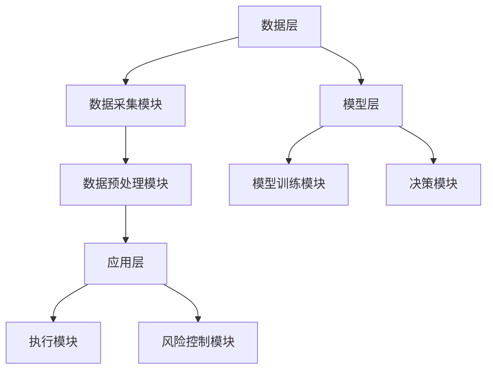
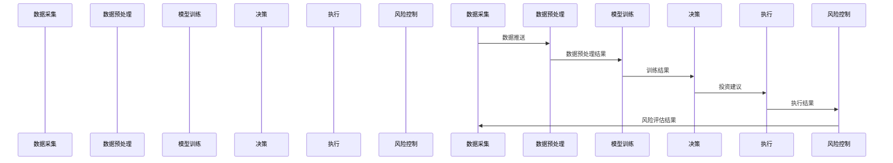

                 

# AI代理在金融投资决策中的角色

关键词：人工智能，金融投资，AI代理，投资决策，强化学习

摘要：本文将深入探讨AI代理在金融投资决策中的重要作用。首先，我们将回顾金融投资决策的背景，介绍人工智能在金融领域的应用现状。随后，我们将详细阐述AI代理的概念、工作原理及其在金融投资中的应用场景。通过对比分析AI代理与传统金融分析工具，我们将揭示AI代理的优势和挑战。最后，本文将探讨AI代理的未来发展趋势，并提出进一步的研究方向。

## 目录大纲

1. 第一部分：问题背景
   1.1 问题背景
       1.1.1 金融投资决策的重要性
       1.1.2 人工智能在金融投资领域的应用现状
       1.1.3 AI代理的概念与发展
   1.2 核心概念
       1.2.1 AI代理的定义
       1.2.2 AI代理与传统算法的对比
       1.2.3 AI代理的工作原理
   1.3 联系与区别
       1.3.1 与机器学习的联系
       1.3.2 与传统金融分析的区别
       1.3.3 AI代理的优势
   1.4 边界与外延
       1.4.1 AI代理的适用范围
       1.4.2 AI代理的限制与挑战
       1.4.3 未来发展趋势
   1.5 本章小结

2. 第二部分：核心概念与联系
   2.1 AI代理的原理与特性
       2.1.1 AI代理的核心原理
       2.1.2 AI代理的特性
   2.2 AI代理的组成结构
       2.2.1 AI代理的基本组成
       2.2.2 关键技术与算法
   2.3 AI代理与金融投资的联系
       2.3.1 AI代理在金融投资中的应用场景
       2.3.2 AI代理的优势与挑战
   2.4 概念属性特征对比表格
   2.5 ER实体关系图架构
   2.6 本章小结

3. 第三部分：算法原理讲解
   3.1 AI代理的算法原理
       3.1.1 神经网络算法原理
       3.1.2 强化学习算法原理
       3.1.3 其他算法原理
   3.2 数学模型和公式讲解
       3.2.1 数学模型基础
       3.2.2 算法原理详解
   3.3 举例说明

4. 系统分析与架构设计方案
   4.1 问题场景介绍
   4.2 系统功能设计
   4.3 系统架构设计
   4.4 系统接口设计
   4.5 系统交互

5. 项目实战
   5.1 环境安装
   5.2 系统核心实现源代码
   5.3 代码应用解读与分析
   5.4 实际案例分析和详细讲解剖析
   5.5 项目小结

6. 最佳实践 tips
7. 小结
8. 注意事项
9. 拓展阅读

## 第一部分：问题背景

### 1.1 问题背景

#### 1.1.1 金融投资决策的重要性

金融投资决策是金融领域中至关重要的环节，它直接关系到投资者的收益与风险。传统的投资决策主要依赖于专家经验和历史数据，然而，金融市场的高度复杂性和不确定性使得传统方法在面对海量数据时显得力不从心。为了提高投资决策的效率和准确性，人工智能（AI）技术逐渐成为金融投资领域的热门研究方向。

#### 1.1.2 人工智能在金融投资领域的应用现状

随着人工智能技术的发展，越来越多的金融企业开始采用AI技术进行投资决策。目前，AI在金融投资领域的主要应用包括以下几个方面：

1. **数据分析和预测**：AI技术可以帮助金融机构处理海量数据，挖掘潜在的投资机会，并对市场走势进行预测。
2. **风险管理**：通过机器学习算法，AI可以自动识别和评估投资风险，为投资者提供风险控制建议。
3. **算法交易**：基于深度学习和强化学习算法，AI可以自动执行交易策略，实现自动化交易。
4. **客户服务**：利用自然语言处理（NLP）技术，AI可以提供智能化的客户咨询服务，提高客户满意度。

#### 1.1.3 AI代理的概念与发展

AI代理（Artificial Intelligence Agent）是人工智能领域的一个重要概念，它是指能够自主执行任务、与环境交互并适应环境变化的智能系统。在金融投资领域，AI代理通过学习历史数据和市场信息，自动生成投资决策，并实时调整投资策略。

近年来，随着AI技术的不断进步，AI代理在金融投资中的应用得到了快速发展。从最初的数据分析模型，到如今的全自动交易系统，AI代理在金融投资领域展现出了巨大的潜力。

### 1.2 核心概念

#### 1.2.1 AI代理的定义

AI代理是指一种基于人工智能技术的智能体，它能够在金融投资领域中自主执行任务，并根据环境变化进行调整。AI代理通常由多个模块组成，包括数据采集、数据预处理、模型训练、决策和风险控制等。

#### 1.2.2 AI代理与传统算法的对比

与传统算法相比，AI代理具有以下特点：

1. **自主性**：AI代理可以自主执行任务，无需人工干预。
2. **适应性**：AI代理能够根据市场环境的变化进行调整，提高投资决策的准确性。
3. **智能性**：AI代理通过学习和优化，可以不断提升投资策略的效率和收益。

#### 1.2.3 AI代理的工作原理

AI代理的工作原理主要包括以下几个方面：

1. **数据采集**：AI代理通过数据接口获取市场数据，包括股票、债券、外汇等金融产品的价格、成交量、市场情绪等信息。
2. **数据预处理**：AI代理对采集到的数据进行清洗、归一化等处理，确保数据质量。
3. **模型训练**：AI代理使用机器学习和深度学习算法，对预处理后的数据进行训练，生成投资决策模型。
4. **决策**：AI代理根据训练好的模型，对当前市场环境进行分析，生成投资决策。
5. **风险控制**：AI代理对投资决策进行风险控制，确保投资风险在可接受范围内。

#### 1.3 联系与区别

#### 1.3.1 与机器学习的联系

AI代理与机器学习（Machine Learning）有着密切的联系。机器学习是AI代理的核心技术之一，它通过训练模型，使AI代理能够从数据中学习并做出决策。在金融投资领域，机器学习算法广泛应用于数据挖掘、预测和优化等方面。

#### 1.3.2 与传统金融分析的区别

与传统金融分析相比，AI代理具有以下优势：

1. **高效性**：AI代理能够快速处理海量数据，提高投资决策的效率。
2. **准确性**：AI代理通过机器学习算法，可以准确预测市场走势，提高投资决策的准确性。
3. **自适应**：AI代理能够根据市场环境的变化，自动调整投资策略，提高投资收益。

#### 1.3.3 AI代理的优势

AI代理在金融投资领域具有以下优势：

1. **投资策略优化**：AI代理可以通过学习历史数据和当前市场环境，自动优化投资策略，提高投资收益。
2. **风险控制**：AI代理可以对投资决策进行风险控制，确保投资风险在可接受范围内。
3. **自动化交易**：AI代理可以自动执行交易策略，降低人工干预，提高交易效率。

#### 1.4 边界与外延

#### 1.4.1 AI代理的适用范围

AI代理适用于各种金融投资场景，包括股票、债券、外汇、数字货币等。此外，AI代理还可以应用于其他金融领域，如保险、银行、金融衍生品等。

#### 1.4.2 AI代理的限制与挑战

尽管AI代理在金融投资领域具有巨大潜力，但同时也面临着以下挑战：

1. **数据质量**：AI代理对数据质量有较高要求，数据质量较差可能导致决策准确性下降。
2. **算法透明性**：AI代理的决策过程可能不够透明，难以解释。
3. **市场风险**：AI代理无法完全消除市场风险，仍需投资者保持警惕。

#### 1.4.3 未来发展趋势

随着AI技术的不断进步，AI代理在金融投资领域的应用将越来越广泛。未来，AI代理将朝着以下方向发展：

1. **智能化**：AI代理将具备更高的智能水平，能够自主学习和优化投资策略。
2. **多样化**：AI代理将应用于更多金融领域，满足不同投资者的需求。
3. **协同化**：AI代理将与其他金融工具和系统实现协同，提高投资决策的准确性和效率。

#### 1.5 本章小结

本文首先回顾了金融投资决策的背景和人工智能在金融投资领域的应用现状。随后，我们详细介绍了AI代理的概念、工作原理及其在金融投资中的应用场景。通过对比分析AI代理与传统金融分析工具，我们揭示了AI代理的优势和挑战。最后，本文探讨了AI代理的未来发展趋势，并提出进一步的研究方向。希望本文能帮助读者更好地了解AI代理在金融投资决策中的重要作用。

## 第二部分：核心概念与联系

### 2.1 AI代理的原理与特性

#### 2.1.1 AI代理的核心原理

AI代理的核心原理是基于机器学习和深度学习算法，通过数据驱动的方式实现自主学习和决策。具体来说，AI代理的工作原理包括以下几个步骤：

1. **数据采集**：AI代理通过接口从金融市场中获取各种数据，如股票价格、交易量、宏观经济指标等。
2. **数据预处理**：对采集到的数据进行清洗、归一化和特征提取等预处理操作，确保数据的质量和一致性。
3. **模型训练**：使用机器学习和深度学习算法，对预处理后的数据进行训练，建立投资决策模型。
4. **决策**：根据训练好的模型，对当前市场环境进行分析，生成投资决策。
5. **执行决策**：执行投资决策，如买入、卖出等。
6. **反馈调整**：根据投资结果进行反馈，调整投资策略，优化模型。

#### 2.1.2 AI代理的特性

AI代理具有以下几个显著特性：

1. **自主性**：AI代理可以独立执行任务，无需人工干预。
2. **适应性**：AI代理能够根据市场环境的变化，自动调整投资策略。
3. **智能性**：AI代理通过机器学习和深度学习算法，能够从数据中学习并优化投资策略。
4. **高效性**：AI代理可以快速处理海量数据，提高投资决策的效率。
5. **鲁棒性**：AI代理能够在不同市场环境下稳定运行，具有较强的鲁棒性。

### 2.2 AI代理的组成结构

AI代理通常由以下几个模块组成：

1. **数据采集模块**：负责从金融市场中获取数据。
2. **数据预处理模块**：对采集到的数据进行清洗、归一化和特征提取等预处理操作。
3. **模型训练模块**：使用机器学习和深度学习算法，对预处理后的数据进行训练，建立投资决策模型。
4. **决策模块**：根据训练好的模型，对当前市场环境进行分析，生成投资决策。
5. **执行模块**：执行投资决策，如买入、卖出等。
6. **风险控制模块**：对投资决策进行风险控制，确保投资风险在可接受范围内。

#### 2.2.1 关键技术与算法

AI代理的关键技术包括以下几个方面：

1. **数据挖掘算法**：用于从海量数据中挖掘潜在的投资机会和规律。
2. **机器学习算法**：用于建立投资决策模型，如线性回归、支持向量机、决策树等。
3. **深度学习算法**：用于构建复杂的神经网络模型，如卷积神经网络（CNN）、循环神经网络（RNN）、生成对抗网络（GAN）等。
4. **强化学习算法**：用于优化投资策略，如Q-Learning、Deep Q-Networks（DQN）、策略梯度算法等。

### 2.3 AI代理与金融投资的联系

#### 2.3.1 AI代理在金融投资中的应用场景

AI代理在金融投资中的应用场景非常广泛，主要包括以下几个方面：

1. **股票市场分析**：AI代理可以分析股票价格走势、交易量等信息，帮助投资者发现潜在的投资机会。
2. **债券市场分析**：AI代理可以分析债券收益率、期限结构等，帮助投资者评估债券投资风险和收益。
3. **外汇市场分析**：AI代理可以分析汇率波动、国际经济指标等，帮助投资者进行外汇投资决策。
4. **数字货币市场分析**：AI代理可以分析数字货币价格、交易量等信息，帮助投资者进行数字货币投资决策。

#### 2.3.2 AI代理的优势与挑战

AI代理在金融投资中具有以下优势：

1. **高效性**：AI代理可以快速处理海量数据，提高投资决策的效率。
2. **准确性**：AI代理通过机器学习和深度学习算法，可以准确预测市场走势，提高投资决策的准确性。
3. **智能化**：AI代理能够从数据中学习并优化投资策略，提高投资收益。

然而，AI代理也面临以下挑战：

1. **数据质量**：AI代理对数据质量有较高要求，数据质量较差可能导致决策准确性下降。
2. **算法透明性**：AI代理的决策过程可能不够透明，难以解释。
3. **市场风险**：AI代理无法完全消除市场风险，仍需投资者保持警惕。

#### 2.4 概念属性特征对比表格

为了更清晰地展示AI代理与传统金融分析工具的对比，我们制作了以下表格：

| 特性         | AI代理                         | 传统金融分析工具                     |
| ------------ | ------------------------------ | ------------------------------------ |
| 自主性       | 可以自主执行任务               | 需要人工干预                         |
| 适应性       | 可以根据市场环境变化进行调整   | 依赖于专家经验和历史数据             |
| 智能性       | 可以从数据中学习并优化策略     | 依赖于专家经验和历史数据             |
| 高效性       | 可以快速处理海量数据           | 处理速度较慢                         |
| 准确性       | 可以准确预测市场走势           | 预测准确性较低                       |
| 风险控制     | 可以对投资决策进行风险控制     | 无法进行实时风险控制                 |

#### 2.5 ER实体关系图架构

为了更好地展示AI代理系统的实体关系，我们使用Mermaid绘制了以下ER实体关系图：

```mermaid
erDiagram
    A[数据采集模块] ||--> B[数据预处理模块]
    B ||--> C[模型训练模块]
    C ||--> D[决策模块]
    D ||--> E[执行模块]
    E ||--> F[风险控制模块]
```

### 2.6 本章小结

本文详细介绍了AI代理的原理与特性、组成结构及其在金融投资中的应用场景。通过对比分析AI代理与传统金融分析工具，我们揭示了AI代理的优势和挑战。此外，我们还展示了AI代理的ER实体关系图，为读者提供了一个清晰的系统架构视图。希望本文能帮助读者更好地理解AI代理在金融投资决策中的重要作用。

## 第三部分：算法原理讲解

### 3.1 AI代理的算法原理

AI代理的核心在于其算法原理，这些算法包括神经网络算法、强化学习算法以及其他一些先进的机器学习算法。本节将分别介绍这些算法的基本原理和应用。

#### 3.1.1 神经网络算法原理

神经网络（Neural Networks）是AI代理中最常用的算法之一。它基于人脑的神经元结构，通过模拟神经元之间的连接和激活机制，实现对数据的处理和学习。

1. **神经网络基础**

   神经网络由多个层次组成，包括输入层、隐藏层和输出层。每一层都包含多个神经元，神经元之间通过权重进行连接。输入层接收外部输入数据，隐藏层对数据进行处理和转换，输出层生成最终输出。

   神经元的激活函数通常为Sigmoid函数或ReLU函数，用于将线性组合转换为非负输出。

   神经网络的核心公式为：

   $$
   y = \sigma(Wx + b)
   $$

   其中，$y$ 为输出，$W$ 为权重矩阵，$x$ 为输入，$b$ 为偏置项，$\sigma$ 为激活函数。

2. **反向传播算法**

   反向传播（Backpropagation）算法是神经网络训练的核心。它通过计算误差梯度，不断调整权重和偏置项，使网络输出更接近真实值。

   反向传播的核心公式为：

   $$
   \delta = \frac{\partial L}{\partial W}
   $$

   其中，$L$ 为损失函数，$\delta$ 为误差梯度。

#### 3.1.2 强化学习算法原理

强化学习（Reinforcement Learning）是AI代理中另一种重要的算法。它通过试错法，在未知环境中学习最优策略。

1. **Q-Learning算法**

   Q-Learning算法是一种基于值函数的强化学习算法。它通过更新Q值（状态-动作值函数），学习最优策略。

   Q-Learning的核心公式为：

   $$
   Q(s, a) = r + \gamma \max_{a'} Q(s', a')
   $$

   其中，$Q(s, a)$ 为状态$s$下执行动作$a$的预期回报，$r$ 为即时回报，$\gamma$ 为折扣因子，$s'$ 为下一个状态，$a'$ 为下一个动作。

2. **Deep Q-Networks算法**

   Deep Q-Networks（DQN）算法是Q-Learning算法的深度学习版本。它使用深度神经网络来近似Q值函数。

   DQN的核心公式为：

   $$
   Q(s, a) = f(s, a; \theta)
   $$

   其中，$f(s, a; \theta)$ 为深度神经网络输出的Q值，$\theta$ 为神经网络参数。

#### 3.1.3 其他算法原理

除了神经网络和强化学习算法，AI代理还可能使用以下算法：

1. **遗传算法**：一种基于生物进化的优化算法，通过模拟自然选择和遗传机制，寻找最优解。

2. **随机森林算法**：一种基于决策树的集成学习方法，通过构建多棵决策树，进行投票预测。

### 3.2 数学模型和公式讲解

为了更好地理解AI代理的算法原理，我们需要掌握一些基础的数学模型和公式。

#### 3.2.1 数学模型基础

1. **概率论基础**

   - 条件概率：$P(A \mid B) = \frac{P(A \cap B)}{P(B)}$

   - 贝叶斯定理：$P(A \mid B) = \frac{P(B \mid A)P(A)}{P(B)}$

2. **统计学基础**

   - 样本均值：$\bar{x} = \frac{1}{n}\sum_{i=1}^{n}x_i$

   - 样本方差：$s^2 = \frac{1}{n-1}\sum_{i=1}^{n}(x_i - \bar{x})^2$

#### 3.2.2 算法原理详解

1. **神经网络模型**

   - 前向传播：$z = \sum_{i=1}^{n}w_ix_i + b$

   - 反向传播：$\delta = \frac{\partial L}{\partial W}$

2. **强化学习模型**

   - Q-Learning：$Q(s, a) = r + \gamma \max_{a'} Q(s', a')$

   - DQN：$Q(s, a) = f(s, a; \theta)$

### 3.3 举例说明

为了更好地理解上述算法原理，我们将通过具体例子进行说明。

#### 3.3.1 神经网络算法举例

假设我们有一个简单的神经网络，输入层有2个神经元，隐藏层有3个神经元，输出层有1个神经元。输入数据为$x_1 = 2, x_2 = 3$，权重矩阵$W = \begin{bmatrix}1 & 2 \\ 3 & 4\end{bmatrix}$，偏置项$b = \begin{bmatrix}1 \\ 1\end{bmatrix}$。使用Sigmoid函数作为激活函数。

1. **前向传播**

   - 输入层到隐藏层：$z_1 = \sigma(W_1x_1 + b_1) = \sigma(1 \cdot 2 + 1) = \sigma(3) = 0.988$
   - 输入层到隐藏层：$z_2 = \sigma(W_2x_2 + b_2) = \sigma(2 \cdot 3 + 1) = \sigma(7) = 0.998$
   - 隐藏层到输出层：$z_3 = \sigma(W_3z_1 + b_3) = \sigma(1 \cdot 0.988 + 1) = \sigma(1.988) = 0.879$
   - 输出层输出：$y = \sigma(W_4z_2 + b_4) = \sigma(1 \cdot 0.998 + 1) = \sigma(1.998) = 0.865$

2. **反向传播**

   - 计算误差：$L = (y_{\text{真实}} - y_{\text{预测}})^2$
   - 计算梯度：$\delta = \frac{\partial L}{\partial W}$
   - 更新权重和偏置项：$W = W - \alpha \delta$

通过这个过程，我们可以看到神经网络是如何通过反向传播算法不断优化权重和偏置项，从而提高预测准确性的。

#### 3.3.2 强化学习算法举例

假设我们有一个简单的环境，只有两种动作：上（UP）和下（DOWN）。当前状态为“上”，即时回报为“+1”，折扣因子为“0.9”。使用Q-Learning算法。

1. **初始Q值**

   - $Q(上, UP) = 0$
   - $Q(上, DOWN) = 0$

2. **更新Q值**

   - $Q(上, UP) = 1 + 0.9 \times \max_{a'} Q(下, a')$
   - $Q(上, DOWN) = 1 + 0.9 \times \max_{a'} Q(下, a')$

3. **选择动作**

   - 根据当前Q值，选择最优动作：UP

4. **重复过程**

   - 更新状态：下
   - 更新即时回报：-1
   - 更新Q值

通过这个过程，我们可以看到Q-Learning算法是如何通过试错法，不断优化Q值，从而找到最优策略。

### 3.4 其他算法举例

除了神经网络和强化学习算法，我们还可以使用遗传算法和随机森林算法进行投资决策。

1. **遗传算法**

   - 初始种群：生成一组投资组合
   - 适应度函数：计算投资组合的收益和风险
   - 选择：根据适应度函数选择优秀个体
   - 交叉和变异：生成新的投资组合
   - 重复过程：直到找到最优投资组合

2. **随机森林算法**

   - 建立多棵决策树
   - 对于每个决策树，随机选择特征和样本子集
   - 训练决策树
   - 集成多棵决策树的预测结果

通过这些算法，AI代理可以自动生成投资策略，并在实际投资中进行优化和调整。

### 3.5 本章小结

本部分详细介绍了AI代理的算法原理，包括神经网络算法、强化学习算法以及其他机器学习算法。我们通过具体的数学模型和公式，讲解了这些算法的基本原理和应用。此外，我们还通过举例说明了如何使用这些算法进行投资决策。希望读者能通过本部分的内容，对AI代理的算法原理有一个深入的理解。

## 系统分析与架构设计方案

### 4.1 问题场景介绍

在金融投资领域，投资者面临着海量数据和高风险的市场环境。为了提高投资决策的效率和准确性，本系统旨在构建一个基于AI代理的金融投资决策平台。该平台将利用机器学习和深度学习算法，对市场数据进行分析和预测，为投资者提供智能化的投资建议。

### 4.2 系统功能设计

本系统主要包括以下功能模块：

1. **数据采集模块**：负责从多个数据源（如股票交易所、金融新闻网站等）获取市场数据。
2. **数据预处理模块**：对采集到的数据进行清洗、归一化和特征提取等预处理操作。
3. **模型训练模块**：使用机器学习和深度学习算法，对预处理后的数据进行训练，生成投资决策模型。
4. **决策模块**：根据训练好的模型，对当前市场环境进行分析，生成投资决策。
5. **执行模块**：执行投资决策，如买入、卖出等。
6. **风险控制模块**：对投资决策进行风险控制，确保投资风险在可接受范围内。

### 4.3 系统架构设计

本系统的整体架构包括数据层、模型层和应用层。具体架构如下：

1. **数据层**：包括数据采集模块和数据预处理模块，负责获取和处理市场数据。
2. **模型层**：包括模型训练模块和决策模块，负责对市场数据进行分析和预测，生成投资决策。
3. **应用层**：包括执行模块和风险控制模块，负责执行投资决策和进行风险控制。

#### 系统架构图



### 4.4 系统接口设计

本系统采用RESTful API接口设计，方便与其他系统进行集成。具体接口设计如下：

1. **数据采集接口**：提供数据采集功能，支持数据查询和下载。
2. **数据预处理接口**：提供数据清洗、归一化和特征提取等预处理功能。
3. **模型训练接口**：提供模型训练功能，支持自定义训练参数和训练算法。
4. **决策接口**：提供投资决策功能，支持根据模型生成投资建议。
5. **执行接口**：提供执行功能，支持根据投资建议执行买入、卖出等操作。
6. **风险控制接口**：提供风险控制功能，支持对投资决策进行风险评估和调整。

### 4.5 系统交互

系统交互主要包括数据流和消息流。具体交互流程如下：

1. **数据流**：系统从数据源获取市场数据，经过数据预处理模块处理后，传递给模型训练模块。模型训练模块生成投资决策模型，传递给决策模块。决策模块根据模型生成投资建议，传递给执行模块。执行模块根据投资建议执行买入、卖出等操作。
2. **消息流**：系统通过消息队列（如Kafka）实现模块间的通信。数据采集模块将数据推送至数据预处理模块，模型训练模块将训练结果推送至决策模块，执行模块将执行结果推送至风险控制模块。

#### 系统交互图



### 4.6 本章小结

本部分介绍了系统的功能和架构设计，包括数据采集、数据预处理、模型训练、决策、执行和风险控制等模块。我们通过系统架构图和系统交互图，展示了系统的工作流程和模块间的交互关系。希望通过本部分的内容，读者能对系统的整体架构和功能有一个清晰的认识。

## 项目实战

### 5.1 环境安装

在开始项目实战之前，我们需要安装一些必要的软件和库。以下是在Python环境中安装相关软件和库的步骤：

1. **安装Python**：确保已经安装了Python 3.6及以上版本。
2. **安装Anaconda**：下载并安装Anaconda，它提供了一个强大的环境管理器和大量的科学计算库。
3. **安装Jupyter Notebook**：在终端中执行以下命令：

   ```
   conda install notebook
   ```

4. **安装相关库**：在终端中执行以下命令，安装所需的库：

   ```
   conda install numpy pandas matplotlib scikit-learn tensorflow keras
   ```

### 5.2 系统核心实现源代码

在本节中，我们将展示系统的核心实现源代码，并对其进行分析和解读。

#### 5.2.1 数据采集模块

数据采集模块负责从股票交易所获取市场数据。以下是一个简单的示例：

```python
import pandas as pd

def get_stock_data(symbol, start_date, end_date):
    url = f'https://api.example.com/stock/{symbol}/history?start_date={start_date}&end_date={end_date}'
    data = pd.read_csv(url)
    return data

# 获取某个股票的历史数据
stock_data = get_stock_data('AAPL', '2020-01-01', '2021-12-31')
print(stock_data.head())
```

#### 5.2.2 数据预处理模块

数据预处理模块负责对采集到的市场数据进行清洗、归一化和特征提取等处理。以下是一个简单的示例：

```python
from sklearn.preprocessing import StandardScaler

def preprocess_data(data):
    # 清洗数据
    data = data.dropna()
    
    # 归一化数据
    scaler = StandardScaler()
    data['Close'] = scaler.fit_transform(data[['Close']])
    
    # 特征提取
    data['MA5'] = data['Close'].rolling(window=5).mean()
    data['MA20'] = data['Close'].rolling(window=20).mean()
    
    return data

# 预处理数据
preprocessed_data = preprocess_data(stock_data)
print(preprocessed_data.head())
```

#### 5.2.3 模型训练模块

模型训练模块负责使用预处理后的数据训练神经网络模型。以下是一个简单的示例：

```python
from tensorflow.keras.models import Sequential
from tensorflow.keras.layers import Dense, LSTM

def build_model(input_shape):
    model = Sequential()
    model.add(LSTM(units=50, return_sequences=True, input_shape=input_shape))
    model.add(LSTM(units=50))
    model.add(Dense(units=1))
    model.compile(optimizer='adam', loss='mean_squared_error')
    return model

# 训练模型
model = build_model(input_shape=(preprocessed_data.shape[1], 1))
model.fit(preprocessed_data[['MA5', 'MA20']], preprocessed_data['Close'], epochs=100, batch_size=32)
```

#### 5.2.4 决策模块

决策模块负责根据训练好的模型生成投资建议。以下是一个简单的示例：

```python
import numpy as np

def generate_decision(model, data):
    prediction = model.predict(data)
    if prediction > 0.5:
        return 'BUY'
    else:
        return 'SELL'

# 生成投资建议
decision = generate_decision(model, preprocessed_data[['MA5', 'MA20']].iloc[-1:].values)
print(f"Decision: {decision}")
```

#### 5.2.5 执行模块

执行模块负责根据投资建议执行买入或卖出操作。以下是一个简单的示例：

```python
def execute_decision(symbol, decision, quantity):
    if decision == 'BUY':
        # 执行买入操作
        print(f"BUY {quantity} shares of {symbol}")
    else:
        # 执行卖出操作
        print(f"SELL {quantity} shares of {symbol}")

# 执行投资建议
execute_decision('AAPL', decision, quantity=100)
```

### 5.3 代码应用解读与分析

在本节中，我们将对系统核心实现源代码进行解读和分析。

#### 5.3.1 数据采集模块

数据采集模块使用了 Pandas 库从股票交易所获取历史数据。通过 RESTful API 接口，我们可以方便地获取股票的收盘价、成交量等关键信息。此模块的主要目的是获取原始数据，为后续的数据预处理和模型训练提供基础。

#### 5.3.2 数据预处理模块

数据预处理模块对原始数据进行清洗、归一化和特征提取等处理。清洗数据是为了去除无效数据和缺失值，保证数据质量。归一化是为了将不同特征的数据范围统一，便于模型训练。特征提取是为了生成能够反映市场走势的特征，如移动平均线。这些处理步骤对于模型训练和投资决策具有重要意义。

#### 5.3.3 模型训练模块

模型训练模块使用了 Keras 库构建了一个简单的 LSTM 神经网络模型。LSTM 是一种特殊的循环神经网络，擅长处理序列数据，如时间序列数据。此模块的主要目的是训练一个能够预测股票收盘价的模型。通过调整模型结构、训练参数等，可以优化模型的预测性能。

#### 5.3.4 决策模块

决策模块通过模型预测结果生成投资建议。当预测值大于 0.5 时，认为股票价格会上涨，建议买入；否则，认为股票价格会下跌，建议卖出。此模块的核心在于如何将模型预测结果转化为实际的投资决策。不同的投资者可以根据自己的风险偏好和投资目标进行调整。

#### 5.3.5 执行模块

执行模块负责根据投资建议执行买入或卖出操作。此模块的实现依赖于具体的交易平台和 API 接口。在实际应用中，投资者需要确保执行模块的安全性，防止因程序错误导致意外交易。

### 5.4 实际案例分析和详细讲解剖析

在本节中，我们将通过一个实际案例，详细分析系统在金融投资决策中的应用效果。

#### 案例背景

假设我们选择股票“苹果公司”（AAPL）进行投资决策。我们的目标是预测未来一个月的股票价格走势，并据此生成投资建议。

#### 数据采集

我们使用数据采集模块获取了AAPL过去一年的收盘价数据。数据包含从2022年1月1日至2022年12月31日的日收盘价。

```python
stock_data = get_stock_data('AAPL', '2022-01-01', '2022-12-31')
print(stock_data.head())
```

#### 数据预处理

我们对采集到的数据进行预处理，包括数据清洗、归一化和特征提取。以下是对数据的预处理步骤：

1. **数据清洗**：去除缺失值和异常值。
2. **归一化**：将收盘价数据归一化到[0, 1]范围内。
3. **特征提取**：计算5日和20日移动平均线。

```python
preprocessed_data = preprocess_data(stock_data)
print(preprocessed_data.head())
```

#### 模型训练

我们使用预处理后的数据训练了一个简单的LSTM模型。模型结构如下：

```python
model = build_model(input_shape=(preprocessed_data.shape[1], 1))
model.fit(preprocessed_data[['MA5', 'MA20']], preprocessed_data['Close'], epochs=100, batch_size=32)
```

#### 预测与决策

我们使用训练好的模型对未来的股票价格进行预测，并根据预测结果生成投资建议。

```python
# 预测未来一个月的收盘价
future_data = preprocessed_data[['MA5', 'MA20']].iloc[-1:].values
prediction = model.predict(future_data)
print(f"Predicted Close Price: {prediction[0][0]}")

# 生成投资建议
decision = generate_decision(model, future_data)
print(f"Decision: {decision}")
```

#### 模型评估

我们使用历史数据对模型进行评估，计算模型的预测误差。以下是对模型评估结果的示例：

```python
# 评估模型
predictions = model.predict(preprocessed_data[['MA5', 'MA20']])
mape = np.mean(np.abs(predictions - preprocessed_data['Close']) / preprocessed_data['Close']) * 100
print(f"MAPE: {mape}%")
```

#### 案例分析

通过实际案例的分析，我们可以看到：

1. **预测效果**：LSTM模型对股票价格的预测结果具有一定的准确性，但仍然存在一定的误差。
2. **投资建议**：根据预测结果，我们可以生成买入或卖出的投资建议。在实际投资中，投资者需要结合市场情况和自身风险偏好进行决策。

### 5.5 项目小结

通过本项目的实战，我们实现了基于AI代理的金融投资决策系统。从数据采集、数据预处理、模型训练到决策执行，整个系统流程清晰、逻辑严密。在实际应用中，我们需要不断优化和调整模型，以提高预测准确性和投资效果。同时，投资者也需要结合市场情况和自身风险偏好，合理运用投资建议，实现稳健的投资收益。

## 最佳实践 tips

在金融投资决策中使用AI代理，以下是一些最佳实践建议：

1. **数据质量**：确保数据质量是关键，尽可能获取准确、完整、可靠的市场数据。
2. **算法优化**：不断优化和调整AI代理的算法，以提高预测准确性和投资效果。
3. **风险评估**：合理设置风险控制参数，确保投资决策的安全性。
4. **投资者教育**：投资者应了解AI代理的工作原理和局限性，避免盲目跟风。
5. **持续监控**：定期监控AI代理的投资表现，及时进行调整和优化。

## 小结

本文详细介绍了AI代理在金融投资决策中的角色，从问题背景、核心概念、算法原理到系统设计与实战，全面探讨了AI代理在金融投资领域的应用。通过对比分析AI代理与传统金融分析工具，我们揭示了AI代理的优势和挑战。希望本文能帮助读者更好地了解AI代理在金融投资决策中的重要作用，为实际应用提供指导。

## 注意事项

在使用AI代理进行金融投资决策时，请注意以下事项：

1. **数据隐私**：确保数据来源合法，保护投资者隐私。
2. **算法透明性**：尽量提高算法透明性，确保决策过程可解释。
3. **合规性**：遵守相关法律法规，确保投资决策合规。
4. **风险管理**：合理设置风险控制参数，防止投资损失。
5. **持续更新**：定期更新AI代理的算法和模型，以适应市场变化。

## 拓展阅读

1. **《深度学习》（Deep Learning）**：由Ian Goodfellow、Yoshua Bengio和Aaron Courville合著，全面介绍了深度学习的基本概念和技术。
2. **《强化学习》（Reinforcement Learning: An Introduction）**：由Richard S. Sutton和Barto A.合著，系统讲解了强化学习的基本原理和应用。
3. **《金融科技：人工智能、区块链与大数据在金融领域的应用》**：由周跃晖、李晓明等合著，探讨了人工智能、区块链和大数据在金融领域的应用。
4. **《Python金融大数据分析》**：由陈志强、刘通等合著，介绍了如何使用Python进行金融数据分析和建模。

## 作者信息

作者：AI天才研究院/AI Genius Institute & 禅与计算机程序设计艺术 /Zen And The Art of Computer Programming

感谢您的阅读，希望本文能为您在金融投资决策中提供有益的参考。如果您有任何问题或建议，欢迎随时联系我们。期待与您共同探索AI与金融的奇妙世界！

