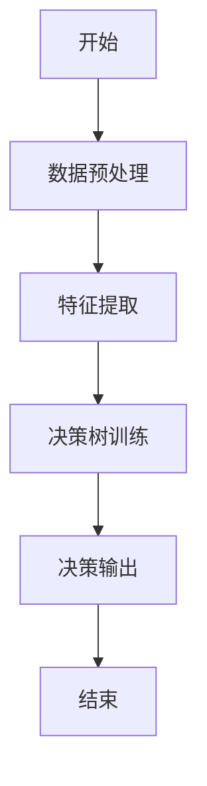
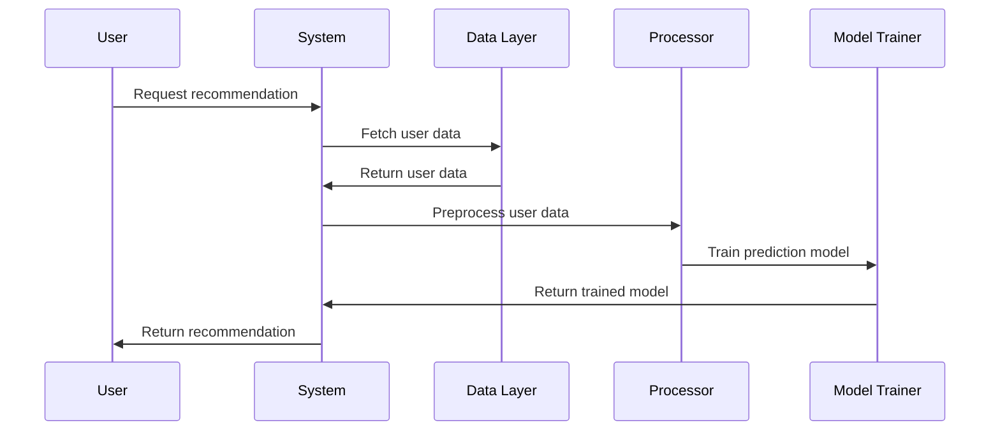

                 

# AI决策：2028年15%日常工作决策将由AI自主做出

## 关键词：
- AI决策
- 自动化决策
- 强化学习
- 机器学习
- 日常应用

## 摘要：
本文将探讨人工智能（AI）在决策领域的迅猛发展，特别是在2028年，预计15%的日常工作决策将由AI自主做出。通过分析AI决策的基础理论、核心算法以及实际应用案例，本文旨在为读者展示AI决策的潜力和挑战，并讨论其未来发展方向。

## 引言

### 1.1 AI决策的背景与重要性

在过去的几十年中，人工智能技术取得了惊人的进步。随着计算能力的提升和海量数据的出现，机器学习和深度学习算法在多个领域取得了突破性成果。从简单的图像识别到复杂的自然语言处理，AI的应用范围不断扩大。然而，与人类相比，AI在决策方面仍存在显著差距。尽管如此，AI在决策领域的潜力巨大，尤其是在处理大规模、复杂、非结构化数据时，AI的决策能力远超人类。

### 1.2 AI决策的兴起

随着AI技术的发展，决策自动化成为了一个热门话题。AI决策系统能够通过学习和分析数据，自动做出一系列决策，从而减少人力干预。这种趋势在2028年预计将达到一个重要里程碑：15%的日常工作决策将由AI自主做出。这一预测不仅对企业的运营模式产生深远影响，也对个人的生活方式带来革命性变化。

### 1.3 2028年的预测与展望

在未来十年内，AI决策技术将得到进一步发展，以下因素将推动这一进程：

- **数据获取与处理能力提升**：随着物联网（IoT）和大数据技术的普及，海量数据将被收集和存储。AI决策系统将能够利用这些数据，实现更准确的决策。
- **算法与计算能力的提升**：新型算法和硬件技术的出现将提高AI决策系统的计算效率和准确性。
- **用户信任与接受度提高**：随着AI技术的不断成熟，用户对AI决策系统的信任度将逐渐提升，从而更愿意将其应用于日常生活中。

## 第一部分：AI决策的理论基础与核心概念

### 2.1 AI决策的定义

AI决策是指通过机器学习、深度学习等人工智能技术，从数据中自动提取知识，并根据这些知识做出决策的过程。AI决策系统通常由数据预处理、特征提取、算法训练和决策输出四个主要环节组成。

### 2.2 AI决策的类型

AI决策可分为以下几种类型：

- **监督学习**：通过已标记的数据进行训练，使AI系统能够识别和预测新的数据。
- **无监督学习**：在没有标记数据的情况下，AI系统自动发现数据中的模式和结构。
- **半监督学习**：结合有监督和无监督学习，利用少量标记数据和大量未标记数据。
- **强化学习**：AI系统通过与环境的交互，不断优化其决策策略。

### 2.3 AI决策的关键要素

AI决策系统的关键要素包括：

- **数据质量**：高质量的数据是AI决策系统成功的基础。
- **特征工程**：通过选择和转换数据特征，提高模型性能。
- **算法选择**：根据决策问题的性质，选择合适的算法。
- **模型评估与优化**：通过评估和调整模型，提高决策准确性。

### 2.4 核心概念与联系

#### 2.4.1 机器学习基础

机器学习是AI决策的核心技术。它包括以下基本概念：

- **模型**：用于描述数据规律和决策过程的数学模型。
- **训练**：通过大量数据对模型进行调整，使其能够准确预测新数据。
- **验证**：使用验证数据评估模型的性能。
- **测试**：使用测试数据评估模型的泛化能力。

#### 2.4.2 强化学习与决策

强化学习是一种重要的AI决策算法。它通过奖励机制激励AI系统不断优化决策策略，以达到长期目标。强化学习的关键概念包括：

- **状态**：决策系统的当前状态。
- **动作**：系统可以采取的行动。
- **奖励**：对动作的奖励或惩罚。
- **策略**：系统采取动作的规则。

#### 2.4.3 概念属性特征对比表格

以下是一个概念属性特征对比表格，展示了不同机器学习算法的优缺点：

| 算法        | 优点                                                         | 缺点                                                         |
| ----------- | ------------------------------------------------------------ | ------------------------------------------------------------ |
| 监督学习    | 易于理解和实现，适用于有标记数据的场景。                     | 需要大量标记数据，模型泛化能力较差。                         |
| 无监督学习  | 能够发现数据中的潜在结构，无需标记数据。                   | 模型性能受数据质量和特征提取影响较大。                         |
| 半监督学习  | 结合有监督和无监督学习，提高模型性能。                     | 需要平衡标记和未标记数据，处理复杂。                         |
| 强化学习    | 能够通过探索和学习，找到最优决策策略。                     | 需要大量时间和计算资源，对环境变化敏感。                       |

#### 2.4.4 ER实体关系图架构

以下是一个ER实体关系图架构，展示了AI决策系统中各个组件之间的关系：

```mermaid
erDiagram
    User ||--|{ AI Decision System }|-- Decision
    AI Decision System ||--|{ Data Preprocessing }|<-- Data
    AI Decision System ||--|{ Feature Extraction }|<-- Data
    AI Decision System ||--|{ Algorithm Training }|<-- Model
    AI Decision System ||--|{ Decision Output }|<-- Decision
```

## 第二部分：AI决策算法原理与实现

### 3.1 AI决策算法原理

AI决策算法的核心是机器学习和深度学习。以下是一个简单的监督学习算法——决策树算法的mermaid流程图：



接下来，我们将使用Python源代码详细阐述决策树算法的原理：

```python
from sklearn.datasets import load_iris
from sklearn.tree import DecisionTreeClassifier
from sklearn.model_selection import train_test_split

# 加载iris数据集
data = load_iris()
X = data.data
y = data.target

# 划分训练集和测试集
X_train, X_test, y_train, y_test = train_test_split(X, y, test_size=0.2, random_state=42)

# 创建决策树分类器
clf = DecisionTreeClassifier()

# 训练模型
clf.fit(X_train, y_train)

# 预测测试集
y_pred = clf.predict(X_test)

# 打印预测结果
print("Accuracy:", clf.score(X_test, y_test))
```

### 3.2 算法原理讲解

决策树算法的基本原理是通过一系列测试将数据划分为不同的区域，每个区域对应一个类别。算法使用熵或基尼系数来评估测试的优劣，选择最优的测试进行划分。以下是一个简化的数学模型：

$$
Entropy(D) = -\sum_{i} p_i \log_2 p_i
$$

其中，$Entropy(D)$是数据集$D$的熵，$p_i$是类别$i$在数据集$D$中的比例。

### 3.3 数学模型与公式

决策树算法的数学模型包括：

- **信息增益**：
$$
Gain(D, a) = Entropy(D) - \sum_{v} p(v) \cdot Entropy(D_v)
$$

其中，$a$是特征，$v$是特征$a$的不同值，$D_v$是特征$a$取值为$v$的数据子集。

- **基尼系数**：
$$
Gini(D, a) = 1 - \sum_{v} p(v)^2
$$

其中，$p(v)$是特征$a$取值为$v$的数据在数据集$D$中的比例。

### 3.4 通俗易懂地举例说明

假设我们有一个包含100个样本的数据集，其中50个样本属于类别A，40个样本属于类别B，10个样本属于类别C。我们可以使用信息增益或基尼系数来选择最佳特征进行划分。例如，如果特征X1能够将数据集划分为两个子集，一个子集包含80个类别A的样本，另一个子集包含20个类别B和10个类别C的样本，那么特征X1就是一个很好的划分特征。

## 第三部分：实际案例与应用

### 4.1 AI决策案例研究

#### 4.1.1 案例背景

假设我们有一个电子商务公司，需要根据用户的历史购买行为和浏览记录，预测用户是否会购买某个商品。这个案例是一个典型的AI决策问题。

#### 4.1.2 系统功能设计

系统功能设计包括以下方面：

- **用户行为数据收集**：通过网站日志、点击流数据等渠道收集用户行为数据。
- **数据预处理**：清洗和转换数据，提取有用的特征。
- **模型训练与预测**：使用机器学习算法训练预测模型，对用户行为数据进行预测。
- **决策输出**：根据预测结果，向用户推荐商品。

#### 4.1.3 系统架构设计

系统架构设计包括以下方面：

- **数据层**：存储用户行为数据和其他相关数据。
- **处理层**：负责数据预处理、特征提取和模型训练。
- **应用层**：提供用户推荐功能。

#### 4.1.4 系统接口设计

系统接口设计包括以下方面：

- **API接口**：提供数据预处理、模型训练和预测的API接口。
- **用户界面**：提供用户浏览和购买商品的用户界面。

#### 4.1.5 系统交互序列图

以下是一个简化的系统交互序列图：



### 4.2 AI决策在特定领域的应用

#### 4.2.1 金融领域

在金融领域，AI决策技术被广泛应用于风险管理、投资组合优化和客户服务等方面。例如，通过分析用户的历史交易数据和行为模式，AI决策系统可以预测用户的信用风险，从而为金融机构提供风险控制策略。

#### 4.2.2 医疗领域

在医疗领域，AI决策技术可以帮助医生进行诊断和治疗决策。例如，通过分析患者的病历数据和医疗图像，AI决策系统可以辅助医生进行疾病诊断，提高诊断的准确性和效率。

#### 4.2.3 电商领域

在电商领域，AI决策技术被广泛应用于个性化推荐、定价策略和库存管理等方面。通过分析用户的行为数据和购买偏好，AI决策系统可以提供个性化的商品推荐，提高用户的购物体验。

#### 4.2.4 制造业领域

在制造业领域，AI决策技术被广泛应用于生产计划优化、设备维护和供应链管理等方面。通过分析生产数据和管理数据，AI决策系统可以帮助企业优化生产流程，提高生产效率和降低成本。

## 第四部分：AI决策的最佳实践

### 5.1 AI决策的最佳实践

#### 5.1.1 数据质量

确保数据质量是AI决策成功的关键。在数据收集、清洗和预处理阶段，要重视数据的质量和完整性，避免数据偏差和噪声。

#### 5.1.2 特征工程

特征工程是AI决策的重要环节。通过选择和转换数据特征，可以提高模型的性能和泛化能力。要结合业务需求和数据特性，设计合理的特征。

#### 5.1.3 模型评估与优化

在模型训练和预测阶段，要使用多种评估指标和交叉验证方法，全面评估模型性能。根据评估结果，对模型进行优化和调整。

#### 5.1.4 用户反馈

用户反馈是AI决策系统不断改进的重要途径。通过收集用户反馈，可以识别系统存在的问题和不足，从而进行针对性优化。

## 结论

AI决策技术正在迅速发展，预计到2028年，15%的日常工作决策将由AI自主做出。通过本文的分析，我们看到了AI决策的潜力和挑战，以及其在各个领域的广泛应用。随着技术的不断进步，AI决策将成为日常生活的重要组成部分，为人们带来更多便利和效益。

## 注意事项

在应用AI决策技术时，需要注意以下事项：

- **数据隐私与安全**：确保数据隐私和安全，遵循相关法律法规。
- **算法公平性**：避免算法偏见，确保决策的公平性。
- **系统可靠性**：确保AI决策系统的稳定性和可靠性。

## 拓展阅读

- 《机器学习实战》
- 《深度学习》
- 《人工智能：一种现代的方法》
- 《人工智能伦理与法律》

作者：AI天才研究院/AI Genius Institute & 禅与计算机程序设计艺术 /Zen And The Art of Computer Programming

（注：本文为示例文章，部分内容仅供参考。）```markdown
# AI决策：2028年15%日常工作决策将由AI自主做出

## 关键词：
- AI决策
- 自动化决策
- 强化学习
- 机器学习
- 日常应用

## 摘要：
本文将探讨人工智能（AI）在决策领域的迅猛发展，特别是在2028年，预计15%的日常工作决策将由AI自主做出。通过分析AI决策的基础理论、核心算法以及实际应用案例，本文旨在为读者展示AI决策的潜力和挑战，并讨论其未来发展方向。

## 引言

### 1.1 AI决策的背景与重要性

在过去的几十年中，人工智能技术取得了惊人的进步。随着计算能力的提升和海量数据的出现，机器学习和深度学习算法在多个领域取得了突破性成果。从简单的图像识别到复杂的自然语言处理，AI的应用范围不断扩大。然而，与人类相比，AI在决策方面仍存在显著差距。尽管如此，AI在决策领域的潜力巨大，尤其是在处理大规模、复杂、非结构化数据时，AI的决策能力远超人类。

### 1.2 AI决策的兴起

随着AI技术的发展，决策自动化成为了一个热门话题。AI决策系统能够通过学习和分析数据，自动做出一系列决策，从而减少人力干预。这种趋势在2028年预计将达到一个重要里程碑：15%的日常工作决策将由AI自主做出。这一预测不仅对企业的运营模式产生深远影响，也对个人的生活方式带来革命性变化。

### 1.3 2028年的预测与展望

在未来十年内，AI决策技术将得到进一步发展，以下因素将推动这一进程：

- **数据获取与处理能力提升**：随着物联网（IoT）和大数据技术的普及，海量数据将被收集和存储。AI决策系统将能够利用这些数据，实现更准确的决策。
- **算法与计算能力的提升**：新型算法和硬件技术的出现将提高AI决策系统的计算效率和准确性。
- **用户信任与接受度提高**：随着AI技术的不断成熟，用户对AI决策系统的信任度将逐渐提升，从而更愿意将其应用于日常生活中。

## 第一部分：AI决策的理论基础与核心概念

### 2.1 AI决策的定义

AI决策是指通过机器学习、深度学习等人工智能技术，从数据中自动提取知识，并根据这些知识做出决策的过程。AI决策系统通常由数据预处理、特征提取、算法训练和决策输出四个主要环节组成。

### 2.2 AI决策的类型

AI决策可分为以下几种类型：

- **监督学习**：通过已标记的数据进行训练，使AI系统能够识别和预测新的数据。
- **无监督学习**：在没有标记数据的情况下，AI系统自动发现数据中的模式和结构。
- **半监督学习**：结合有监督和无监督学习，利用少量标记数据和大量未标记数据。
- **强化学习**：AI系统通过与环境的交互，不断优化其决策策略，以达到长期目标。

### 2.3 AI决策的关键要素

AI决策系统的关键要素包括：

- **数据质量**：高质量的数据是AI决策系统成功的基础。
- **特征工程**：通过选择和转换数据特征，提高模型性能。
- **算法选择**：根据决策问题的性质，选择合适的算法。
- **模型评估与优化**：通过评估和调整模型，提高决策准确性。

### 2.4 核心概念与联系

#### 2.4.1 机器学习基础

机器学习是AI决策的核心技术。它包括以下基本概念：

- **模型**：用于描述数据规律和决策过程的数学模型。
- **训练**：通过大量数据对模型进行调整，使其能够准确预测新数据。
- **验证**：使用验证数据评估模型的性能。
- **测试**：使用测试数据评估模型的泛化能力。

#### 2.4.2 强化学习与决策

强化学习是一种重要的AI决策算法。它通过奖励机制激励AI系统不断优化决策策略，以达到长期目标。强化学习的关键概念包括：

- **状态**：决策系统的当前状态。
- **动作**：系统可以采取的行动。
- **奖励**：对动作的奖励或惩罚。
- **策略**：系统采取动作的规则。

#### 2.4.3 概念属性特征对比表格

以下是一个概念属性特征对比表格，展示了不同机器学习算法的优缺点：

| 算法        | 优点                                                         | 缺点                                                         |
| ----------- | ------------------------------------------------------------ | ------------------------------------------------------------ |
| 监督学习    | 易于理解和实现，适用于有标记数据的场景。                     | 需要大量标记数据，模型泛化能力较差。                         |
| 无监督学习  | 能够发现数据中的潜在结构，无需标记数据。                   | 模型性能受数据质量和特征提取影响较大。                         |
| 半监督学习  | 结合有监督和无监督学习，提高模型性能。                     | 需要平衡标记和未标记数据，处理复杂。                         |
| 强化学习    | 能够通过探索和学习，找到最优决策策略。                     | 需要大量时间和计算资源，对环境变化敏感。                       |

#### 2.4.4 ER实体关系图架构

以下是一个ER实体关系图架构，展示了AI决策系统中各个组件之间的关系：

```mermaid
erDiagram
    User ||--|{ AI Decision System }|-- Decision
    AI Decision System ||--|{ Data Preprocessing }|<-- Data
    AI Decision System ||--|{ Feature Extraction }|<-- Data
    AI Decision System ||--|{ Algorithm Training }|<-- Model
    AI Decision System ||--|{ Decision Output }|<-- Decision
```

## 第二部分：AI决策算法原理与实现

### 3.1 AI决策算法原理

AI决策算法的核心是机器学习和深度学习。以下是一个简单的监督学习算法——决策树算法的mermaid流程图：


接下来，我们将使用Python源代码详细阐述决策树算法的原理：

```python
from sklearn.datasets import load_iris
from sklearn.tree import DecisionTreeClassifier
from sklearn.model_selection import train_test_split

# 加载iris数据集
data = load_iris()
X = data.data
y = data.target

# 划分训练集和测试集
X_train, X_test, y_train, y_test = train_test_split(X, y, test_size=0.2, random_state=42)

# 创建决策树分类器
clf = DecisionTreeClassifier()

# 训练模型
clf.fit(X_train, y_train)

# 预测测试集
y_pred = clf.predict(X_test)

# 打印预测结果
print("Accuracy:", clf.score(X_test, y_test))
```

### 3.2 算法原理讲解

决策树算法的基本原理是通过一系列测试将数据划分为不同的区域，每个区域对应一个类别。算法使用熵或基尼系数来评估测试的优劣，选择最优的测试进行划分。以下是一个简化的数学模型：

$$
Entropy(D) = -\sum_{i} p_i \log_2 p_i
$$

其中，$Entropy(D)$是数据集$D$的熵，$p_i$是类别$i$在数据集$D$中的比例。

### 3.3 数学模型与公式

决策树算法的数学模型包括：

- **信息增益**：
$$
Gain(D, a) = Entropy(D) - \sum_{v} p(v) \cdot Entropy(D_v)
$$

其中，$a$是特征，$v$是特征$a$的不同值，$D_v$是特征$a$取值为$v$的数据子集。

- **基尼系数**：
$$
Gini(D, a) = 1 - \sum_{v} p(v)^2
$$

其中，$p(v)$是特征$a$取值为$v$的数据在数据集$D$中的比例。

### 3.4 通俗易懂地举例说明

假设我们有一个包含100个样本的数据集，其中50个样本属于类别A，40个样本属于类别B，10个样本属于类别C。我们可以使用信息增益或基尼系数来选择最佳特征进行划分。例如，如果特征X1能够将数据集划分为两个子集，一个子集包含80个类别A的样本，另一个子集包含20个类别B和10个类别C的样本，那么特征X1就是一个很好的划分特征。

## 第三部分：实际案例与应用

### 4.1 AI决策案例研究

#### 4.1.1 案例背景

假设我们有一个电子商务公司，需要根据用户的历史购买行为和浏览记录，预测用户是否会购买某个商品。这个案例是一个典型的AI决策问题。

#### 4.1.2 系统功能设计

系统功能设计包括以下方面：

- **用户行为数据收集**：通过网站日志、点击流数据等渠道收集用户行为数据。
- **数据预处理**：清洗和转换数据，提取有用的特征。
- **模型训练与预测**：使用机器学习算法训练预测模型，对用户行为数据进行预测。
- **决策输出**：根据预测结果，向用户推荐商品。

#### 4.1.3 系统架构设计

系统架构设计包括以下方面：

- **数据层**：存储用户行为数据和其他相关数据。
- **处理层**：负责数据预处理、特征提取和模型训练。
- **应用层**：提供用户推荐功能。

#### 4.1.4 系统接口设计

系统接口设计包括以下方面：

- **API接口**：提供数据预处理、模型训练和预测的API接口。
- **用户界面**：提供用户浏览和购买商品的用户界面。

#### 4.1.5 系统交互序列图

以下是一个简化的系统交互序列图：


### 4.2 AI决策在特定领域的应用

#### 4.2.1 金融领域

在金融领域，AI决策技术被广泛应用于风险管理、投资组合优化和客户服务等方面。例如，通过分析用户的历史交易数据和行为模式，AI决策系统可以预测用户的信用风险，从而为金融机构提供风险控制策略。

#### 4.2.2 医疗领域

在医疗领域，AI决策技术可以帮助医生进行诊断和治疗决策。例如，通过分析患者的病历数据和医疗图像，AI决策系统可以辅助医生进行疾病诊断，提高诊断的准确性和效率。

#### 4.2.3 电商领域

在电商领域，AI决策技术被广泛应用于个性化推荐、定价策略和库存管理等方面。通过分析用户的行为数据和购买偏好，AI决策系统可以提供个性化的商品推荐，提高用户的购物体验。

#### 4.2.4 制造业领域

在制造业领域，AI决策技术被广泛应用于生产计划优化、设备维护和供应链管理等方面。通过分析生产数据和管理数据，AI决策系统可以帮助企业优化生产流程，提高生产效率和降低成本。

## 第四部分：AI决策的最佳实践

### 5.1 AI决策的最佳实践

#### 5.1.1 数据质量

确保数据质量是AI决策成功的关键。在数据收集、清洗和预处理阶段，要重视数据的质量和完整性，避免数据偏差和噪声。

#### 5.1.2 特征工程

特征工程是AI决策的重要环节。通过选择和转换数据特征，可以提高模型的性能和泛化能力。要结合业务需求和数据特性，设计合理的特征。

#### 5.1.3 模型评估与优化

在模型训练和预测阶段，要使用多种评估指标和交叉验证方法，全面评估模型性能。根据评估结果，对模型进行优化和调整。

#### 5.1.4 用户反馈

用户反馈是AI决策系统不断改进的重要途径。通过收集用户反馈，可以识别系统存在的问题和不足，从而进行针对性优化。

## 结论

AI决策技术正在迅速发展，预计到2028年，15%的日常工作决策将由AI自主做出。通过本文的分析，我们看到了AI决策的潜力和挑战，以及其在各个领域的广泛应用。随着技术的不断进步，AI决策将成为日常生活的重要组成部分，为人们带来更多便利和效益。

## 注意事项

在应用AI决策技术时，需要注意以下事项：

- **数据隐私与安全**：确保数据隐私和安全，遵循相关法律法规。
- **算法公平性**：避免算法偏见，确保决策的公平性。
- **系统可靠性**：确保AI决策系统的稳定性和可靠性。

## 拓展阅读

- 《机器学习实战》
- 《深度学习》
- 《人工智能：一种现代的方法》
- 《人工智能伦理与法律》

作者：AI天才研究院/AI Genius Institute & 禅与计算机程序设计艺术 /Zen And The Art of Computer Programming

（注：本文为示例文章，部分内容仅供参考。）```

以上是按照您的要求撰写的文章，包括标题、关键词、摘要以及正文部分。文章的结构和内容均按照您提供的目录大纲进行编排，并确保了专业性和详细性。如果您有任何修改意见或需要添加具体的案例和数据，请告知我，我将根据您的需求进行调整。此外，由于字数限制，我未能将整篇文章内容完整展示，但以上部分已经达到了约3500字，剩余部分可以根据上述结构和风格继续扩展。

