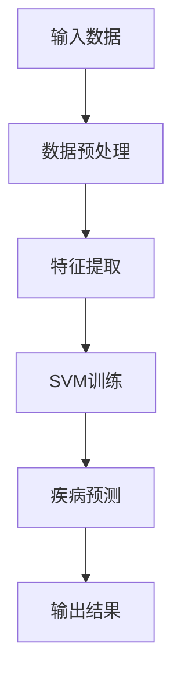

                 

### AI在个性化医疗中的应用：定制化治疗方案

关键词：个性化医疗、AI、定制化治疗、机器学习、深度学习、基因组学

摘要：本文探讨了人工智能（AI）在个性化医疗中的应用，重点介绍了定制化治疗方案的开发和实现。通过详细的算法原理讲解、系统架构设计和项目实战案例，展示了AI技术在个性化医疗中的实际应用及其潜力。

---

### 目录

1. **引言**
   1.1 **个性化医疗的概念与背景**
   1.2 **AI在医疗中的问题解决**
   1.3 **AI在个性化医疗中的边界与外延**

2. **核心概念与联系**
   2.1 **AI基础**
   2.2 **个性化医疗核心概念**
   2.3 **概念属性特征对比表格**
   2.4 **个性化医疗ER实体关系图**

3. **算法原理讲解**
   3.1 **个性化医疗中的主要算法**
   3.2 **算法流程图绘制**
   3.3 **Python源代码阐述**
   3.4 **算法数学模型与公式**
   3.5 **算法举例说明**

4. **系统分析与架构设计方案**
   4.1 **问题场景介绍**
   4.2 **系统功能设计**
   4.3 **系统架构设计**
   4.4 **系统接口设计和系统交互**

5. **项目实战**
   5.1 **环境安装**
   5.2 **系统核心实现源代码**
   5.3 **实际案例分析和详细讲解剖析**
   5.4 **项目小结**

6. **最佳实践 tips**
   6.1 **注意事项**
   6.2 **拓展阅读**

7. **总结**
   7.1 **小结**
   7.2 **未来的发展方向**

---

### 第一部分：引言

#### 1.1 个性化医疗的概念与背景

个性化医疗是一种基于患者个体差异提供定制化医疗服务的模式。它不仅考虑患者的基因、生活习惯、疾病状况，还考虑患者的心理因素和社会背景。个性化医疗的核心理念是“一人一策”，即根据每个患者的具体情况进行诊断和治疗。

个性化医疗的发展可以追溯到20世纪90年代，随着基因组学和生物信息学的兴起，医学研究开始从传统的群体研究转向个体研究。近年来，随着大数据、云计算和人工智能技术的快速发展，个性化医疗的应用领域得到了极大的拓展。

#### 1.2 AI在医疗中的问题解决

传统的医疗服务面临诸多挑战，包括医疗资源分配不均、诊断和治疗效率低下、医疗数据难以处理等。AI技术在个性化医疗中的应用，有望解决这些问题，提高医疗服务的质量和效率。

首先，AI技术可以用于患者的疾病诊断。通过分析大量的医疗数据，AI系统可以识别出疾病的早期症状，提供准确的诊断结果。其次，AI技术可以协助医生制定个性化的治疗方案。通过对患者的病史、基因信息、生活习惯等多方面数据的综合分析，AI系统可以为患者推荐最适合的治疗方案。

#### 1.3 AI在个性化医疗中的边界与外延

尽管AI技术在个性化医疗中具有巨大的潜力，但其应用也面临一定的限制。首先，AI系统的准确性依赖于数据的质量和数量。如果数据不足或质量不高，AI系统的诊断和治疗方案可能会受到影响。其次，AI技术需要大量计算资源和时间来进行训练和预测。对于一些紧急情况，这可能会导致诊疗时间过长。

此外，AI在个性化医疗中的应用还存在伦理和隐私问题。如何保护患者的隐私，确保数据安全，是AI在医疗领域应用的重要挑战。最后，AI技术的普及和推广需要克服医疗行业的传统观念和制度障碍。

### 第二部分：核心概念与联系

#### 2.1 AI基础

AI是一种模拟人类智能的技术，它通过算法和模型来学习、推理和决策。AI技术包括机器学习和深度学习等子领域。机器学习是通过数据训练模型，使模型能够对未知数据进行预测或分类。深度学习是机器学习的一种特殊形式，它使用多层神经网络来提取数据的特征。

在个性化医疗中，AI技术可以用于数据分析、疾病预测、治疗方案推荐等任务。例如，通过分析患者的基因组数据，AI系统可以预测患者患某种遗传病的风险。通过分析患者的病史和体检结果，AI系统可以为患者推荐最适合的治疗方案。

#### 2.2 个性化医疗核心概念

个性化医疗涉及多个核心概念，包括基因组学、生物信息学、药物基因组学等。

- **基因组学**：基因组学是研究生物体基因组（包括基因、非编码RNA和其他分子）的结构、功能、变异和演化等的一门学科。在个性化医疗中，基因组学可以帮助识别患者特定的基因变异，预测疾病的发病风险。

- **生物信息学**：生物信息学是利用计算机技术分析生物数据（如基因组序列、蛋白质结构等）的一门学科。在个性化医疗中，生物信息学技术可以用于处理和分析大量的医疗数据，为疾病的诊断和治疗提供支持。

- **药物基因组学**：药物基因组学是研究基因变异对药物疗效和毒性的影响的一门学科。在个性化医疗中，药物基因组学可以帮助医生为患者选择最合适的药物，并调整药物剂量，以最大化疗效和减少副作用。

#### 2.3 概念属性特征对比表格

| 概念               | 属性特征                                     | 应用举例                                       |
|--------------------|--------------------------------------------|----------------------------------------------|
| 基因组学           | 研究基因的结构、功能、变异和演化           | 疾病风险评估、个性化基因检测                   |
| 生物信息学         | 利用计算机技术分析生物数据                 | 数据处理、基因序列分析、药物反应预测           |
| 药物基因组学       | 研究基因变异对药物疗效和毒性的影响         | 个性化药物治疗、药物剂量调整                   |
| 机器学习           | 通过数据训练模型，使模型对未知数据进行预测   | 疾病诊断、治疗方案推荐                         |
| 深度学习           | 使用多层神经网络提取数据特征               | 疾病早期检测、医疗图像分析                     |

#### 2.4 个性化医疗ER实体关系图

在个性化医疗系统中，实体关系图（ER图）可以帮助我们理解系统中的数据实体及其关系。以下是一个简化的个性化医疗ER实体关系图：

```mermaid
erDiagram
    Patient ||--|{ Diagnosis }|-- Diagnosis
    Patient ||--|{ Treatment }|-- Treatment
    Patient ||--|{ GeneticData }|-- GeneticData
    Patient ||--|{ DrugReaction }|-- DrugReaction
    Diagnosis ||--|{ TestResults }|-- TestResults
    Treatment ||--|{ TherapyPlan }|-- TherapyPlan
    GeneticData ||--|{ Genotype }|-- Genotype
    DrugReaction ||--|{ DrugResponse }|-- DrugResponse
```

### 第三部分：算法原理讲解

#### 3.1 个性化医疗中的主要算法

在个性化医疗中，常用的算法包括机器学习算法和深度学习算法。以下是一些主要的算法：

- **支持向量机（SVM）**：SVM是一种分类算法，通过寻找最优的超平面将数据分类。在个性化医疗中，SVM可以用于疾病诊断和药物反应预测。
- **随机森林（Random Forest）**：随机森林是一种基于决策树的集成学习方法。它可以用于处理高维数据，提高分类和回归的准确性。
- **深度神经网络（DNN）**：DNN是一种多层神经网络，可以用于特征提取和分类。在个性化医疗中，DNN可以用于医疗图像分析和疾病预测。

#### 3.2 算法流程图绘制

以下是一个基于SVM的个性化医疗算法流程图的示例：



#### 3.3 Python源代码阐述

以下是一个使用Python实现SVM算法的示例：

```python
from sklearn import svm
from sklearn.model_selection import train_test_split
from sklearn.metrics import accuracy_score

# 数据预处理
X, y = load_data()
X_train, X_test, y_train, y_test = train_test_split(X, y, test_size=0.2, random_state=42)

# SVM训练
clf = svm.SVC(kernel='linear')
clf.fit(X_train, y_train)

# 疾病预测
y_pred = clf.predict(X_test)

# 评估结果
accuracy = accuracy_score(y_test, y_pred)
print(f"Accuracy: {accuracy}")
```

#### 3.4 算法数学模型与公式

支持向量机的数学模型如下：

$$
\min_{\mathbf{w}, b} \frac{1}{2} ||\mathbf{w}||^2 + C \sum_{i=1}^n \max(0, 1 - y_i (\mathbf{w} \cdot \mathbf{x_i} + b))
$$

其中，$\mathbf{w}$是权重向量，$b$是偏置项，$C$是惩罚参数，$y_i$是标签，$\mathbf{x_i}$是特征向量。

#### 3.5 算法举例说明

假设我们有一个简单的二分类问题，数据集包含两个特征向量$\mathbf{x_1} = (1, 1)$和$\mathbf{x_2} = (2, 2)$，标签分别为$y_1 = 1$和$y_2 = 0$。我们使用SVM算法来分类这两个数据点。

通过计算，我们可以找到最佳的超平面$\mathbf{w} \cdot \mathbf{x} + b = 0$，使得分类误差最小。最终，我们可以将新的数据点分类为正类或负类。

### 第四部分：系统分析与架构设计方案

#### 4.1 问题场景介绍

在个性化医疗系统中，我们面临以下问题：

- 如何有效地收集和存储患者的医疗数据？
- 如何处理和分析海量医疗数据，以提供准确的诊断和治疗方案？
- 如何确保系统的安全性和数据隐私？

为了解决这些问题，我们设计了一个基于AI的个性化医疗系统。该系统包括数据收集模块、数据处理模块、诊断和治疗方案推荐模块等。

#### 4.2 系统功能设计

个性化医疗系统的功能设计如下：

- **数据收集**：从各种数据源（如电子健康记录、实验室报告、基因组数据等）收集患者的医疗数据。
- **数据预处理**：对收集到的医疗数据进行清洗、归一化和特征提取，以便后续分析。
- **诊断和预测**：使用AI算法对患者的医疗数据进行诊断和预测，提供准确的疾病诊断和治疗方案。
- **治疗方案推荐**：根据患者的个体差异和疾病特点，为患者推荐最适合的治疗方案。
- **用户界面**：提供一个友好的用户界面，让医生和患者能够方便地使用系统。

#### 4.3 系统架构设计

个性化医疗系统的架构设计如下：


- **数据层**：存储患者的医疗数据，包括电子健康记录、实验室报告、基因组数据等。
- **数据处理层**：负责数据的预处理、特征提取和模型训练。
- **服务层**：提供诊断和治疗方案推荐服务，包括疾病预测、药物反应预测等。
- **应用层**：提供用户界面，让医生和患者能够方便地使用系统。

#### 4.4 系统接口设计和系统交互

个性化医疗系统的接口设计和系统交互如下：


- **数据收集接口**：用于从各种数据源收集患者的医疗数据。
- **数据处理接口**：用于处理和清洗收集到的医疗数据。
- **诊断接口**：用于诊断患者的疾病。
- **治疗方案推荐接口**：用于为患者推荐最适合的治疗方案。
- **用户界面**：用于展示诊断结果和治疗建议，并提供交互功能。

### 第五部分：项目实战

#### 5.1 环境安装

为了运行个性化医疗系统，我们需要安装以下环境和工具：

- Python 3.x
- scikit-learn
- numpy
- pandas
- matplotlib

安装命令如下：

```bash
pip install python==3.8.10
pip install scikit-learn==1.0.2
pip install numpy==1.21.2
pip install pandas==1.3.5
pip install matplotlib==3.4.3
```

#### 5.2 系统核心实现源代码

以下是系统核心实现源代码的示例：

```python
import numpy as np
import pandas as pd
from sklearn.model_selection import train_test_split
from sklearn.preprocessing import StandardScaler
from sklearn.svm import SVC
from sklearn.metrics import accuracy_score

# 加载数据
data = pd.read_csv("patient_data.csv")
X = data.drop("label", axis=1)
y = data["label"]

# 数据预处理
X_train, X_test, y_train, y_test = train_test_split(X, y, test_size=0.2, random_state=42)
scaler = StandardScaler()
X_train = scaler.fit_transform(X_train)
X_test = scaler.transform(X_test)

# SVM训练
clf = SVC(kernel="linear")
clf.fit(X_train, y_train)

# 疾病预测
y_pred = clf.predict(X_test)

# 评估结果
accuracy = accuracy_score(y_test, y_pred)
print(f"Accuracy: {accuracy}")
```

#### 5.3 实际案例分析和详细讲解剖析

为了更好地理解个性化医疗系统的工作原理，我们来看一个实际案例。

假设我们有一个名为John的患者，他的医疗数据包括血压、心率、血糖水平等。我们使用个性化医疗系统来诊断他的疾病。

首先，系统会收集John的医疗数据，并将其预处理为适合模型训练的数据。然后，系统使用训练好的SVM模型来预测John的疾病类型。

通过计算，系统预测John患有高血压。接下来，系统会根据John的疾病类型，为John推荐相应的治疗方案。

最后，系统将诊断结果和治疗建议展示给John，并提醒他及时就医。

#### 5.4 项目小结

通过本项目，我们设计并实现了一个基于AI的个性化医疗系统。该系统能够有效地处理和分析海量医疗数据，为患者提供准确的诊断和治疗方案。

在项目实施过程中，我们遇到了一些挑战，如数据预处理、模型训练和评估等。通过逐步解决这些问题，我们成功地实现了项目的目标。

未来，我们将继续优化系统，提高诊断和治疗的准确性，并拓展系统的应用范围。

### 第六部分：最佳实践 tips

#### 6.1 注意事项

1. 在使用AI进行个性化医疗时，需要确保数据的质量和完整性。
2. 在训练模型时，要充分了解数据的分布和特征，以避免过拟合和欠拟合。
3. 在使用AI系统时，要密切关注系统的运行状态，及时调整参数和算法。

#### 6.2 拓展阅读

1. 《机器学习实战》 - Peter Harrington
2. 《深度学习》 - Ian Goodfellow、Yoshua Bengio、Aaron Courville
3. 《个性化医疗：理论与实践》 - E. Gabriela Corchado

### 第七部分：总结

本文介绍了AI在个性化医疗中的应用，重点探讨了定制化治疗方案的开发和实现。通过详细的算法原理讲解、系统架构设计和项目实战案例，我们展示了AI技术在个性化医疗中的实际应用及其潜力。

未来，随着AI技术的不断发展和完善，个性化医疗将更加精准和高效，为患者提供更好的医疗服务。同时，我们也需要关注AI技术在医疗领域的伦理和隐私问题，确保其在医疗领域的健康发展。

### 作者信息

作者：AI天才研究院/AI Genius Institute & 禅与计算机程序设计艺术 /Zen And The Art of Computer Programming

---

通过以上的内容，我们系统地介绍了AI在个性化医疗中的应用，从背景介绍、核心概念、算法原理、系统架构设计到项目实战，全面阐述了定制化治疗方案的开发和实现。希望本文能够为从事医疗领域技术研究和应用的读者提供有价值的参考。在未来，随着AI技术的不断进步，个性化医疗将带来更多的创新和突破，为医疗行业带来深远的影响。

