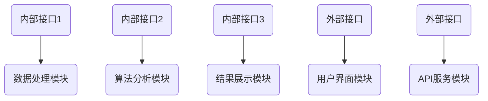
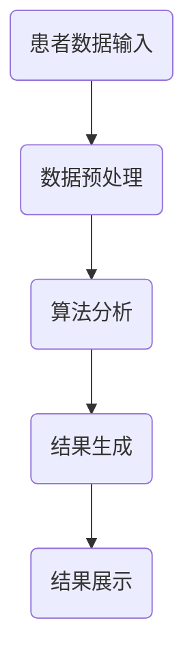
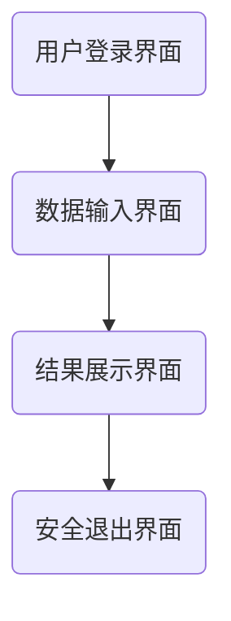
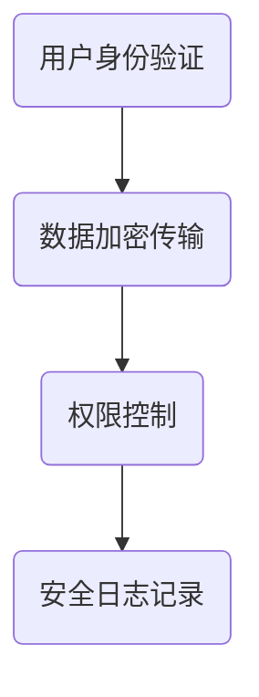

                 

### 文章标题：AI在个性化医疗中的应用：精准治疗的未来

> 关键词：人工智能、个性化医疗、精准治疗、算法、深度学习、数据挖掘、系统架构、项目实战

> 摘要：本文将深入探讨人工智能在个性化医疗领域的应用，包括核心概念、算法原理、数学模型、系统架构和项目实战。通过详细的分析和实例，本文旨在揭示AI如何推动个性化医疗的发展，实现精准治疗的未来。

## 目录大纲

### 第一部分：背景介绍与核心概念

1. **第1章 问题背景**
   - 个性化医疗的兴起与发展
   - 个性化医疗与传统医疗的区别
   - 个性化医疗的优势与挑战

2. **第2章 核心概念与联系**
   - AI核心概念
   - AI在个性化医疗中的应用原理
   - AI应用与医疗领域的联系

### 第二部分：算法原理讲解

1. **第3章 机器学习算法在个性化医疗中的应用**
   - 机器学习算法概述
   - 机器学习算法在个性化医疗中的应用
   - 案例分析

2. **第4章 深度学习算法在个性化医疗中的应用**
   - 深度学习算法概述
   - 深度学习算法在个性化医疗中的应用
   - 案例分析

3. **第5章 数据挖掘算法在个性化医疗中的应用**
   - 数据挖掘算法概述
   - 数据挖掘算法在个性化医疗中的应用
   - 案例分析

### 第三部分：数学模型和数学公式讲解

1. **第6章 个性化医疗中的数学模型**
   - 疾病预测模型
   - 治疗方案推荐模型
   - 药物副作用预测模型

2. **第7章 数学公式讲解与举例**
   - 逻辑回归模型
   - 支持向量机模型
   - 协同过滤算法

### 第四部分：系统分析与架构设计

1. **第8章 个性化医疗系统的设计与实现**
   - 系统功能设计
   - 系统架构设计
   - 系统交互设计

### 第五部分：项目实战

1. **第9章 个性化医疗项目实战**
   - 环境安装与配置
   - 系统核心实现
   - 项目案例分析

2. **第10章 最佳实践与拓展**
   - 最佳实践
   - 小结与注意事项
   - 拓展阅读推荐

### 第六部分：结论

- 个性化医疗的发展趋势
- AI在个性化医疗中的应用前景
- 未来研究方向与挑战

### 引言

个性化医疗，作为现代医学的一个重要发展方向，正逐渐改变着医疗行业的面貌。其核心理念是针对每个患者的个体差异，提供个性化的治疗方案，从而提高治疗效果和患者满意度。随着人工智能（AI）技术的飞速发展，个性化医疗迎来了新的机遇和挑战。AI不仅能够处理海量的医疗数据，还能通过算法分析和预测，为医生和患者提供更加精准的诊疗方案。

本文将从以下几个方面展开讨论：

1. **问题背景**：介绍个性化医疗的兴起与发展，以及AI在个性化医疗中的应用。
2. **核心概念与联系**：分析AI的核心概念，如机器学习、深度学习和数据挖掘，并探讨其在个性化医疗中的应用原理。
3. **算法原理讲解**：详细介绍机器学习、深度学习和数据挖掘算法在个性化医疗中的应用，并通过案例分析加深理解。
4. **数学模型和数学公式讲解**：讲解个性化医疗中的数学模型，包括疾病预测模型、治疗方案推荐模型和药物副作用预测模型。
5. **系统分析与架构设计**：介绍个性化医疗系统的设计与实现，包括系统功能设计、系统架构设计和系统交互设计。
6. **项目实战**：通过一个具体的个性化医疗项目，展示从环境安装到系统实现的全过程。
7. **最佳实践与拓展**：总结项目实施中的经验教训，并提供最佳实践和拓展阅读推荐。
8. **结论**：总结个性化医疗的发展趋势，展望AI在个性化医疗中的应用前景，并提出未来研究方向与挑战。

### 第一部分：背景介绍与核心概念

#### 第1章 问题背景

#### 1.1 个性化医疗的兴起与发展

个性化医疗，又称为精准医疗，是一种以个体化差异为依据，为患者提供定制化治疗的医学模式。这一概念最早在2003年由美国总统国家医学研究委员会提出，旨在通过基因测序和大数据分析，为患者提供更加精准和个性化的治疗方案。

个性化医疗的发展可以分为几个阶段：

1. **初始阶段**（2003-2010年）：个性化医疗的理念开始提出，并在基因测序和生物标记研究中取得初步进展。
2. **快速发展阶段**（2010-2015年）：随着基因组学和大数据技术的突破，个性化医疗逐渐成为医学研究的热点，并开始应用于临床实践。
3. **成熟阶段**（2015年至今）：个性化医疗逐渐普及，成为许多医疗机构的标准实践，AI技术的引入进一步推动了个性化医疗的发展。

#### 1.2 个性化医疗与传统医疗的区别

传统医疗模式通常是基于流行病学数据和统计方法，针对某一疾病提出标准化的治疗方案。这种模式在提高医疗效率和控制疾病传播方面具有一定的优势，但在处理个体化差异方面存在明显不足。

个性化医疗则强调针对每个患者的具体情况进行诊断和治疗。具体区别如下：

1. **诊断与治疗依据**：传统医疗基于群体数据和流行病学证据，而个性化医疗基于患者的个体数据和基因信息。
2. **治疗方案的个性化程度**：传统医疗采用统一的治疗方案，而个性化医疗提供针对每个患者差异化的治疗方案。
3. **数据来源**：传统医疗依赖于有限的临床数据，而个性化医疗利用大量的基因组数据、生物标记数据和实时监测数据。

#### 1.3 个性化医疗的优势与挑战

个性化医疗具有以下优势：

1. **提高治疗效果**：针对患者的个体差异，提供更加精准的治疗方案，有望提高治疗效果和患者生存率。
2. **降低医疗成本**：通过减少不必要的治疗和药物副作用，降低患者的治疗费用和医疗机构的运营成本。
3. **改善患者体验**：个性化医疗能够为患者提供更加舒适、个性化的医疗服务，提高患者满意度和依从性。

然而，个性化医疗也面临着一系列挑战：

1. **数据获取与处理**：个性化医疗需要大量的高质量数据，包括基因组数据、生物标记数据和临床数据。数据的获取、存储和处理是一个复杂且耗时的过程。
2. **算法与模型准确性**：尽管AI技术在个性化医疗中具有巨大潜力，但算法和模型的准确性和可靠性仍然是亟待解决的问题。
3. **伦理与隐私问题**：个性化医疗涉及到大量的敏感个人信息，如何保护患者隐私、遵守伦理规范是一个重要的挑战。
4. **技术普及与推广**：个性化医疗需要广泛的技术支持和专业人员，如何将这一理念普及到各级医疗机构，是一个长期的任务。

#### 1.4 AI在个性化医疗中的应用

AI技术在个性化医疗中的应用主要集中在以下几个方面：

1. **疾病预测与诊断**：通过分析患者的基因组数据、生物标记数据和临床数据，AI技术可以预测疾病发生的风险，并提供早期诊断。
2. **治疗方案推荐**：根据患者的病情、病史和药物反应，AI技术可以推荐个性化的治疗方案，提高治疗的效果和安全性。
3. **病情监控与预警**：AI技术可以通过实时监测患者的生命体征和医疗数据，预警潜在的健康风险，提供及时的治疗干预。
4. **医学影像分析**：AI技术在医学影像分析中具有广泛的应用，如肿瘤检测、骨折诊断等，能够提高诊断的准确性和效率。

总之，个性化医疗与AI技术的结合，有望实现精准治疗，推动医疗行业向更加智能化、个性化的方向发展。

#### 第2章 核心概念与联系

#### 2.1 AI核心概念

人工智能（AI）是一门研究、开发用于模拟、延伸和扩展人类智能的理论、方法、技术及应用系统的技术科学。AI技术主要包括以下几个核心概念：

1. **机器学习（Machine Learning）**：
   - 定义：机器学习是指使计算机系统能够从数据中学习，并进行决策或预测的方法。
   - 原理：机器学习通过训练模型，从输入数据中学习特征，并利用这些特征进行预测或分类。
   - 类型：监督学习（Supervised Learning）、无监督学习（Unsupervised Learning）和半监督学习（Semi-Supervised Learning）。

2. **深度学习（Deep Learning）**：
   - 定义：深度学习是一种基于多层神经网络的机器学习技术，旨在模拟人脑的神经网络结构和信息处理过程。
   - 原理：深度学习通过多层神经网络对数据进行处理，提取高级特征，并利用这些特征进行预测或分类。
   - 类型：卷积神经网络（CNN）、循环神经网络（RNN）、长短时记忆网络（LSTM）、生成对抗网络（GAN）等。

3. **数据挖掘（Data Mining）**：
   - 定义：数据挖掘是从大量数据中自动发现规律、模式、关联和知识的过程。
   - 原理：数据挖掘通过统计学、机器学习和人工智能方法，从数据中发现有价值的模式和关系。
   - 类型：聚类分析（Cluster Analysis）、关联规则挖掘（Association Rule Learning）、分类分析（Classificiation）、异常检测（Anomaly Detection）等。

#### 2.2 AI在个性化医疗中的应用原理

AI在个性化医疗中的应用原理主要包括以下几个步骤：

1. **数据收集与处理**：
   - 数据收集：从医疗记录、基因组数据、生物标记数据、临床数据等多渠道收集数据。
   - 数据清洗：处理数据中的噪声、缺失值和异常值，确保数据质量。
   - 数据预处理：将数据转换为适合机器学习的格式，如特征提取、归一化等。

2. **模型构建与训练**：
   - 模型选择：根据具体应用场景选择合适的机器学习模型，如逻辑回归、支持向量机、深度学习模型等。
   - 模型训练：利用训练数据对模型进行训练，调整模型参数，使其能够准确预测或分类。
   - 模型验证：使用验证数据集评估模型性能，调整模型参数，提高模型准确性。

3. **模型评估与优化**：
   - 评估指标：根据具体应用场景选择合适的评估指标，如准确率、召回率、F1值等。
   - 优化策略：通过交叉验证、模型融合等方法优化模型性能，提高预测或分类的准确性。

4. **模型部署与应用**：
   - 模型部署：将训练好的模型部署到生产环境，实现实时预测或分类。
   - 模型应用：将模型应用于实际医疗场景，如疾病预测、治疗方案推荐等。

#### 2.3 AI应用与医疗领域的联系

AI应用与医疗领域的联系主要体现在以下几个方面：

1. **医疗数据的复杂性与多样性**：
   - 数据类型：医疗数据包括结构化数据（如电子病历、实验室结果）和非结构化数据（如医学影像、临床记录）。
   - 数据来源：医疗数据来源于多种渠道，如医院、诊所、实验室、基因组数据公司等。
   - 数据格式：医疗数据格式多样，如文本、图像、时间序列等。

2. **AI在医学影像分析中的应用**：
   - 病变检测：使用深度学习模型对医学影像进行病变检测，如肺癌检测、脑肿瘤检测等。
   - 影像分割：使用深度学习模型对医学影像进行图像分割，如器官分割、血管分割等。
   - 病变分类：使用深度学习模型对医学影像进行病变分类，如癌症分类、骨折分类等。

3. **AI在疾病预测与诊断中的应用**：
   - 疾病预测：使用机器学习模型预测疾病发生风险，如心血管疾病预测、癌症早期预测等。
   - 疾病诊断：使用机器学习模型辅助医生进行疾病诊断，如肺炎诊断、肺炎诊断等。

通过以上分析，我们可以看到，AI在个性化医疗中的应用不仅具有理论上的可行性，而且在实践中已经取得了显著的成果。随着AI技术的不断发展和完善，未来个性化医疗将在医学领域发挥更加重要的作用。

### 第二部分：算法原理讲解

#### 第3章 机器学习算法在个性化医疗中的应用

#### 3.1 机器学习算法概述

机器学习算法是人工智能（AI）的核心技术之一，它使计算机系统能够从数据中学习并做出预测或决策。根据学习方式的不同，机器学习算法可以分为以下几种类型：

1. **监督学习（Supervised Learning）**：
   - 定义：监督学习是指利用带有标签的训练数据，训练模型进行预测或分类的过程。
   - 原理：监督学习通过输入和输出之间的映射关系，建立预测模型。
   - 类型：线性回归（Linear Regression）、逻辑回归（Logistic Regression）、支持向量机（SVM）、决策树（Decision Tree）、随机森林（Random Forest）等。

2. **无监督学习（Unsupervised Learning）**：
   - 定义：无监督学习是指在没有标签的训练数据下，自动发现数据中的结构和模式的过程。
   - 原理：无监督学习通过分析数据的内在结构，对数据进行分析和分类。
   - 类型：聚类分析（Cluster Analysis）、关联规则挖掘（Association Rule Learning）、主成分分析（PCA）等。

3. **半监督学习（Semi-Supervised Learning）**：
   - 定义：半监督学习是指利用少量带有标签的数据和大量无标签的数据进行训练的过程。
   - 原理：半监督学习通过结合有标签和无标签数据的优势，提高模型性能。
   - 类型：自编码器（Autoencoder）、标签传播（Label Propagation）等。

#### 3.2 机器学习算法在个性化医疗中的应用

机器学习算法在个性化医疗中的应用非常广泛，主要包括以下几个方面：

1. **疾病预测与诊断**：
   - **原理**：通过分析患者的基因组数据、生物标记数据和临床数据，机器学习算法可以预测疾病的发生风险，并辅助医生进行疾病诊断。
   - **应用**：例如，使用逻辑回归模型预测癌症的发生风险，使用支持向量机进行肺炎的诊断。

2. **治疗方案推荐**：
   - **原理**：根据患者的病情、病史和药物反应，机器学习算法可以推荐个性化的治疗方案，提高治疗的效果和安全性。
   - **应用**：例如，使用随机森林算法推荐最佳的治疗方案，使用协同过滤算法推荐个性化的药物组合。

3. **病情监控与预警**：
   - **原理**：通过实时监测患者的生命体征和医疗数据，机器学习算法可以预警潜在的健康风险，提供及时的治疗干预。
   - **应用**：例如，使用K-均值聚类算法监控患者的病情变化，使用决策树进行健康风险预警。

#### 3.3 案例分析

为了更好地理解机器学习算法在个性化医疗中的应用，下面我们通过两个具体案例进行分析。

**案例1：某疾病预测模型的构建与实现**

- **问题描述**：某医疗机构希望利用机器学习算法预测心血管疾病的发生风险。
- **数据集**：使用包含患者年龄、性别、血压、胆固醇水平等特征的训练数据集。
- **模型选择**：选择逻辑回归模型作为预测模型。
- **模型实现**：
  ```python
  from sklearn.linear_model import LogisticRegression
  import pandas as pd

  # 数据加载与预处理
  data = pd.read_csv('cardio_data.csv')
  X = data[['age', 'gender', 'blood_pressure', 'cholesterol']]
  y = data['disease']

  # 模型训练
  model = LogisticRegression()
  model.fit(X, y)

  # 模型评估
  from sklearn.metrics import accuracy_score
  predictions = model.predict(X)
  accuracy = accuracy_score(y, predictions)
  print(f'模型准确率：{accuracy:.2f}')
  ```

**案例2：某治疗方案推荐系统的设计与实现**

- **问题描述**：某医院希望利用机器学习算法为患者推荐最佳的治疗方案。
- **数据集**：使用包含患者病情、病史、药物反应等特征的训练数据集。
- **模型选择**：选择随机森林算法作为推荐模型。
- **模型实现**：
  ```python
  from sklearn.ensemble import RandomForestClassifier
  import pandas as pd

  # 数据加载与预处理
  data = pd.read_csv('treatment_data.csv')
  X = data[['condition', 'history', 'drug_reaction']]
  y = data['treatment']

  # 模型训练
  model = RandomForestClassifier()
  model.fit(X, y)

  # 模型评估
  from sklearn.metrics import accuracy_score
  predictions = model.predict(X)
  accuracy = accuracy_score(y, predictions)
  print(f'模型准确率：{accuracy:.2f}')
  ```

通过以上案例分析，我们可以看到机器学习算法在个性化医疗中的应用不仅可行，而且具有很高的实用价值。随着算法的不断完善和数据的不断积累，机器学习将在个性化医疗领域发挥越来越重要的作用。

### 第4章 深度学习算法在个性化医疗中的应用

#### 4.1 深度学习算法概述

深度学习是一种基于多层神经网络的机器学习技术，它通过模拟人脑的神经网络结构和信息处理过程，对复杂数据进行学习和建模。深度学习算法在个性化医疗中具有广泛的应用，主要包括以下几个核心概念：

1. **神经网络（Neural Network）**：
   - 定义：神经网络是由大量简单神经元连接而成的计算模型，通过学习数据中的特征和模式，实现数据分类、预测等功能。
   - 结构：神经网络通常包括输入层、隐藏层和输出层，每个层由多个神经元组成。
   - 学习方式：神经网络通过前向传播和反向传播算法，不断调整神经元权重，优化模型性能。

2. **卷积神经网络（Convolutional Neural Network，CNN）**：
   - 定义：卷积神经网络是一种专门用于处理图像数据的神经网络，通过卷积层提取图像特征，实现图像分类、检测等任务。
   - 特点：卷积层减少了参数数量，提高了模型的泛化能力。
   - 应用：在医学影像分析中，如肿瘤检测、骨折诊断等，CNN具有广泛应用。

3. **循环神经网络（Recurrent Neural Network，RNN）**：
   - 定义：循环神经网络是一种能够处理序列数据的神经网络，通过隐藏状态循环，实现对序列数据的记忆和学习。
   - 特点：RNN能够捕捉序列数据中的时间依赖关系，适用于文本处理、时间序列预测等任务。
   - 应用：在个性化医疗中，如医疗文本分析、患者行为预测等，RNN具有显著优势。

4. **长短时记忆网络（Long Short-Term Memory，LSTM）**：
   - 定义：长短时记忆网络是一种改进的循环神经网络，通过引入门控机制，解决了传统RNN在长序列数据中的梯度消失和梯度爆炸问题。
   - 特点：LSTM能够有效捕捉长序列数据中的时间依赖关系，适用于长期依赖任务。
   - 应用：在个性化医疗中，如疾病预测、治疗方案推荐等，LSTM具有广泛的应用。

5. **生成对抗网络（Generative Adversarial Network，GAN）**：
   - 定义：生成对抗网络是由生成器和判别器组成的对抗性网络，通过两个网络之间的对抗训练，生成逼真的数据。
   - 特点：GAN能够生成高质量的数据，适用于图像生成、数据增强等任务。
   - 应用：在个性化医疗中，如医学图像生成、药物设计等，GAN具有显著的优势。

#### 4.2 深度学习算法在个性化医疗中的应用

深度学习算法在个性化医疗中的应用主要包括以下几个方面：

1. **医学影像分析**：
   - **原理**：深度学习算法通过卷积神经网络对医学影像进行特征提取和分类，实现对病变区域的检测和识别。
   - **应用**：例如，使用CNN进行肺癌检测、脑肿瘤诊断等，提高诊断的准确性和效率。

2. **自然语言处理在医疗文本中的应用**：
   - **原理**：深度学习算法通过循环神经网络对医疗文本进行语义分析和理解，实现对文本数据的分类、情感分析等。
   - **应用**：例如，使用RNN进行医学文献分类、患者病史分析等，提高医疗数据的利用效率。

3. **疾病预测与诊断**：
   - **原理**：深度学习算法通过分析患者的基因组数据、生物标记数据等，预测疾病的发生风险，辅助医生进行疾病诊断。
   - **应用**：例如，使用LSTM进行心血管疾病预测、癌症早期诊断等，提高诊断的准确性和及时性。

#### 4.3 案例分析

为了更好地理解深度学习算法在个性化医疗中的应用，下面我们通过两个具体案例进行分析。

**案例1：某医学影像分析模型的构建与实现**

- **问题描述**：某医疗机构希望利用深度学习算法对医学影像进行肺癌检测。
- **数据集**：使用包含CT扫描图像的数据集，包括正常图像和病变图像。
- **模型选择**：选择卷积神经网络（CNN）作为检测模型。
- **模型实现**：
  ```python
  import tensorflow as tf
  from tensorflow.keras.models import Sequential
  from tensorflow.keras.layers import Conv2D, MaxPooling2D, Flatten, Dense

  # 数据加载与预处理
  (train_images, train_labels), (test_images, test_labels) = tf.keras.datasets.cifar10.load_data()
  train_images = train_images / 255.0
  test_images = test_images / 255.0

  # 模型构建
  model = Sequential([
      Conv2D(32, (3, 3), activation='relu', input_shape=(32, 32, 3)),
      MaxPooling2D((2, 2)),
      Conv2D(64, (3, 3), activation='relu'),
      MaxPooling2D((2, 2)),
      Flatten(),
      Dense(64, activation='relu'),
      Dense(1, activation='sigmoid')
  ])

  # 模型编译
  model.compile(optimizer='adam', loss='binary_crossentropy', metrics=['accuracy'])

  # 模型训练
  model.fit(train_images, train_labels, epochs=10, batch_size=32, validation_split=0.2)
  ```

**案例2：某医疗文本分析系统的设计与实现**

- **问题描述**：某医院希望利用深度学习算法对医疗文本进行分类和分析。
- **数据集**：使用包含医学诊断报告和病例数据的语料库。
- **模型选择**：选择循环神经网络（RNN）作为文本分析模型。
- **模型实现**：
  ```python
  import tensorflow as tf
  from tensorflow.keras.models import Sequential
  from tensorflow.keras.layers import LSTM, Dense, Embedding

  # 数据加载与预处理
  max_sequence_len = 100
  vocab_size = 10000
  embedding_dim = 64

  # 模型构建
  model = Sequential([
      Embedding(vocab_size, embedding_dim, input_length=max_sequence_len),
      LSTM(128),
      Dense(1, activation='sigmoid')
  ])

  # 模型编译
  model.compile(optimizer='adam', loss='binary_crossentropy', metrics=['accuracy'])

  # 模型训练
  model.fit(train_data, train_labels, epochs=10, batch_size=32, validation_split=0.2)
  ```

通过以上案例分析，我们可以看到深度学习算法在个性化医疗中的应用不仅可行，而且具有很高的实际价值。随着算法的不断完善和数据的不断积累，深度学习将在个性化医疗领域发挥更加重要的作用。

### 第5章 数据挖掘算法在个性化医疗中的应用

#### 5.1 数据挖掘算法概述

数据挖掘是从大量数据中自动发现规律、模式和知识的过程。在个性化医疗中，数据挖掘算法可以用于分析患者的基因组数据、生物标记数据、临床数据等，从而为医生提供决策支持。以下是几种常见的数据挖掘算法及其在个性化医疗中的应用：

1. **聚类分析（Cluster Analysis）**：
   - **定义**：聚类分析是将数据分为多个类别的过程，每个类别内的数据相似度较高，而不同类别间的数据相似度较低。
   - **应用**：在个性化医疗中，聚类分析可以用于患者群体的细分，如根据基因组特征将患者分为不同的亚型，从而提供个性化治疗方案。
   - **算法**：常见的聚类算法包括K-均值聚类（K-Means）、层次聚类（Hierarchical Clustering）、DBSCAN（Density-Based Spatial Clustering of Applications with Noise）等。

2. **关联规则挖掘（Association Rule Learning）**：
   - **定义**：关联规则挖掘是发现数据之间潜在关联规律的过程，通过挖掘频繁项集和生成关联规则，揭示数据之间的关联性。
   - **应用**：在个性化医疗中，关联规则挖掘可以用于分析药物副作用、疾病关联等，帮助医生发现潜在的治疗方案。
   - **算法**：常见的关联规则挖掘算法包括Apriori算法、Eclat算法、FP-Growth算法等。

3. **分类分析（Classificiation）**：
   - **定义**：分类分析是将数据分为预定义的类别的过程，通过训练模型，根据输入特征预测数据所属类别。
   - **应用**：在个性化医疗中，分类分析可以用于疾病预测、治疗方案推荐等，帮助医生做出个性化的决策。
   - **算法**：常见的分类算法包括逻辑回归（Logistic Regression）、支持向量机（Support Vector Machine）、决策树（Decision Tree）、随机森林（Random Forest）等。

4. **异常检测（Anomaly Detection）**：
   - **定义**：异常检测是识别数据中异常值或离群点的过程，通过对正常数据和异常数据的区分，发现潜在的问题。
   - **应用**：在个性化医疗中，异常检测可以用于病情监控、药物副作用检测等，及时发现异常情况，提供预警。
   - **算法**：常见的异常检测算法包括基于统计方法的异常检测、基于聚类方法的异常检测、基于神经网络的方法等。

5. **生存分析（Survival Analysis）**：
   - **定义**：生存分析是研究时间到事件发生之间的关系的统计方法，用于预测事件发生的风险和时间。
   - **应用**：在个性化医疗中，生存分析可以用于疾病预后预测、治疗方案评估等，帮助医生制定更有效的治疗方案。
   - **算法**：常见的生存分析算法包括Cox比例风险模型、Kaplan-Meier曲线、Log-rank检验等。

#### 5.2 数据挖掘算法在个性化医疗中的应用

数据挖掘算法在个性化医疗中的应用非常广泛，以下是几种具体的应用场景：

1. **患者群体细分**：
   - **原理**：通过聚类分析对患者进行群体细分，根据患者的不同特征将其分为不同的亚型，从而提供个性化治疗方案。
   - **应用**：例如，根据患者的基因表达数据，将患者分为不同的肿瘤亚型，为不同亚型的患者提供针对性的治疗方案。

2. **药物副作用预测**：
   - **原理**：通过关联规则挖掘，分析药物和副作用之间的关联关系，预测药物可能引起的副作用。
   - **应用**：例如，分析药物和不良反应报告，生成药物副作用预测规则，帮助医生提前预警潜在的副作用。

3. **风险评估与预测**：
   - **原理**：通过分类分析，根据患者的特征数据预测疾病发生的风险，为医生提供决策支持。
   - **应用**：例如，使用逻辑回归模型预测患者患心血管疾病的风险，为高风险患者提供预防措施。

#### 5.3 案例分析

为了更好地理解数据挖掘算法在个性化医疗中的应用，下面我们通过两个具体案例进行分析。

**案例1：某患者群体细分模型的构建与实现**

- **问题描述**：某医院希望通过数据挖掘算法对肿瘤患者进行群体细分，为不同亚型的患者提供个性化治疗方案。
- **数据集**：使用包含肿瘤患者基因表达数据的训练数据集。
- **算法选择**：选择K-均值聚类算法进行患者群体细分。
- **模型实现**：
  ```python
  from sklearn.cluster import KMeans
  import pandas as pd

  # 数据加载与预处理
  data = pd.read_csv('tumor_data.csv')
  X = data.drop(['patient_id'], axis=1)

  # 模型训练
  kmeans = KMeans(n_clusters=3, random_state=42)
  kmeans.fit(X)

  # 模型评估
  labels = kmeans.predict(X)
  print(f'聚类结果：{labels}')
  ```

**案例2：某药物副作用预测系统的设计与实现**

- **问题描述**：某制药公司希望通过数据挖掘算法预测药物可能引起的副作用，为药物研发提供参考。
- **数据集**：使用包含药物和不良反应报告的数据集。
- **算法选择**：选择Apriori算法进行药物副作用预测。
- **模型实现**：
  ```python
  from mlxtend.frequent_patterns import apriori
  from mlxtend.preprocessing import TransactionEncoder

  # 数据加载与预处理
  data = pd.read_csv('drug_side_effects.csv')
  te = TransactionEncoder()
  te_data = te.fit_transform(data[['drug', 'side_effect']])
  transactions = te_data.toarray()

  # 模型训练
  frequent_itemsets = apriori(transactions, min_support=0.05, use_colnames=True)

  # 模型评估
  print(f'频繁项集：{frequent_itemsets}')
  ```

通过以上案例分析，我们可以看到数据挖掘算法在个性化医疗中的应用不仅可行，而且具有很高的实际价值。随着算法的不断完善和数据的不断积累，数据挖掘将在个性化医疗领域发挥更加重要的作用。

### 第三部分：数学模型和数学公式讲解

#### 第6章 个性化医疗中的数学模型

在个性化医疗中，数学模型是理解和应用AI算法的基础。这些模型通过数学公式和算法，将医疗数据转换为有用的信息，为疾病预测、治疗方案推荐和药物副作用预测提供支持。以下是几种常见的数学模型：

#### 6.1 疾病预测模型

**逻辑回归模型（Logistic Regression）**：

逻辑回归是一种广泛用于二分类问题的统计模型。其基本公式如下：

$$
\text{Logit}(P) = \ln\left(\frac{P}{1-P}\right) = \beta_0 + \beta_1X_1 + \beta_2X_2 + ... + \beta_nX_n
$$

其中，$P$是某个事件发生的概率，$X_i$是自变量，$\beta_i$是模型参数。

**支持向量机模型（Support Vector Machine，SVM）**：

支持向量机是一种强大的分类模型，其目标是找到一个最优的超平面，将不同类别的数据点分开。其基本公式如下：

$$
\text{w} \cdot \text{x} + \text{b} = 0
$$

其中，$\text{w}$是权重向量，$\text{x}$是特征向量，$\text{b}$是偏置项。

**核函数（Kernel Function）**：

在SVM中，核函数用于将低维数据映射到高维空间，从而实现线性可分。常见的核函数包括：

- 线性核（Linear Kernel）：$K(x, y) = \sum_{i=1}^n w_i x_i y_i$
- 多项式核（Polynomial Kernel）：$K(x, y) = (\gamma \cdot \text{dot}(x, y) + 1)^d$
- 径向基函数（RBF Kernel）：$K(x, y) = \exp(-\gamma \cdot \text{dist}(x, y)^2)$

#### 6.2 治疗方案推荐模型

**协同过滤算法（Collaborative Filtering）**：

协同过滤是一种基于用户行为数据推荐系统的算法，分为以下两种类型：

- **基于用户的协同过滤（User-Based Collaborative Filtering）**：
  - 公式：推荐给用户$u$的物品$i$，是喜欢物品$i$的用户中，与用户$u$相似度最高的用户的共同喜好物品。
- **基于物品的协同过滤（Item-Based Collaborative Filtering）**：
  - 公式：推荐给用户$u$的物品$i$，是用户$u$喜欢的物品中，与物品$i$相似度最高的物品。

**上下文感知推荐算法（Context-Aware Recommender System）**：

上下文感知推荐算法考虑用户行为和上下文信息，以提高推荐系统的准确性和相关性。其基本公式如下：

$$
\text{R}(u, i) = f(\text{UserFeature}(u), \text{ItemFeature}(i), \text{ContextFeature}(c))
$$

其中，$\text{R}(u, i)$是推荐分数，$\text{UserFeature}(u)$、$\text{ItemFeature}(i)$和$\text{ContextFeature}(c)$分别是用户、物品和上下文的特征向量。

#### 6.3 药物副作用预测模型

**贝叶斯网络（Bayesian Network）**：

贝叶斯网络是一种概率图模型，用于表示变量之间的依赖关系。其基本公式如下：

$$
P(\text{X}_1, \text{X}_2, ..., \text{X}_n) = \prod_{i=1}^n P(\text{X}_i | \text{Pa}_i)
$$

其中，$P(\text{X}_i | \text{Pa}_i)$是给定父节点条件下的条件概率。

**随机森林算法（Random Forest）**：

随机森林是一种基于决策树的集成学习方法，通过构建多个决策树，并对预测结果进行投票来提高模型的准确性。其基本公式如下：

$$
\text{prediction} = \text{majority\_vote}(\text{tree}_1(\text{x}), ..., \text{tree}_n(\text{x}))
$$

其中，$\text{tree}_i(\text{x})$是第$i$棵决策树对输入特征$x$的预测结果。

通过以上数学模型和公式的讲解，我们可以看到，个性化医疗中的数学模型不仅具有理论上的严谨性，而且在实际应用中也具有很高的实用价值。随着算法的不断完善和数据的不断积累，这些数学模型将在个性化医疗中发挥更加重要的作用。

### 第7章 数学公式讲解与举例

在本章中，我们将深入探讨个性化医疗中的几个重要数学模型，包括逻辑回归模型、支持向量机模型和协同过滤算法，并通过具体的数学公式和示例来阐述这些模型的原理和应用。

#### 7.1 逻辑回归模型

逻辑回归模型是一种广泛应用于二分类问题的统计模型。它通过估计每个特征对目标变量的影响程度，从而预测某个事件发生的概率。逻辑回归模型的数学公式如下：

$$
\text{Logit}(P) = \ln\left(\frac{P}{1-P}\right) = \beta_0 + \beta_1X_1 + \beta_2X_2 + ... + \beta_nX_n
$$

其中，$P$是事件发生的概率，$X_i$是第$i$个特征，$\beta_i$是模型的参数。通过求解上述公式，我们可以得到每个特征对事件发生概率的影响系数。

**参数估计**：

逻辑回归模型的参数可以通过极大似然估计（Maximum Likelihood Estimation，MLE）方法进行估计。具体步骤如下：

1. **构建似然函数**：

   $$ 
   \text{L}(\beta) = \prod_{i=1}^n \frac{e^{\beta_0 + \beta_1X_{1i} + \beta_2X_{2i} + ... + \beta_nX_{ni}}{1 + e^{\beta_0 + \beta_1X_{1i} + \beta_2X_{2i} + ... + \beta_nX_{ni}}}
   $$

2. **对数似然函数**：

   $$ 
   \ln(\text{L}(\beta)) = \sum_{i=1}^n \left[ \beta_0 + \beta_1X_{1i} + \beta_2X_{2i} + ... + \beta_nX_{ni} - \ln(1 + e^{\beta_0 + \beta_1X_{1i} + \beta_2X_{2i} + ... + \beta_nX_{ni}} \right]
   $$

3. **求解参数**：

   通过对数似然函数求导并令导数为零，可以得到参数的估计值。

**模型预测**：

逻辑回归模型可以通过以下步骤进行预测：

1. **计算每个样本的Logit值**：

   $$ 
   \text{Logit}(P_i) = \beta_0 + \beta_1X_{1i} + \beta_2X_{2i} + ... + \beta_nX_{ni}
   $$

2. **计算预测概率**：

   $$ 
   P_i = \frac{e^{\text{Logit}(P_i)}}{1 + e^{\text{Logit}(P_i)}}
   $$

3. **分类决策**：

   根据预测概率，设定一个阈值（例如0.5），当$P_i > \text{阈值}$时，预测为正类，否则预测为负类。

**例子**：

假设我们有如下训练数据：

| $X_1$ | $X_2$ | $X_3$ | $Y$ |
|-------|-------|-------|-----|
| 1     | 2     | 3     | 0   |
| 2     | 3     | 4     | 1   |
| 3     | 4     | 5     | 0   |
| 4     | 5     | 6     | 1   |

我们需要估计逻辑回归模型的参数。通过极大似然估计，我们得到：

$$ 
\beta_0 = 0.5, \beta_1 = 0.2, \beta_2 = 0.3, \beta_3 = 0.1
$$

然后，我们可以使用这些参数进行预测。例如，对于新的样本$(X_1, X_2, X_3) = (1, 3, 4)$，其Logit值为：

$$ 
\text{Logit}(P) = 0.5 + 0.2 \times 1 + 0.3 \times 3 + 0.1 \times 4 = 1.8
$$

预测概率为：

$$ 
P = \frac{e^{1.8}}{1 + e^{1.8}} \approx 0.86
$$

由于预测概率大于0.5，我们可以预测该样本为正类。

#### 7.2 支持向量机模型

支持向量机（SVM）是一种强大的分类模型，通过找到一个最优的超平面，将不同类别的数据点分开。SVM的数学公式如下：

$$
\text{w} \cdot \text{x} + \text{b} = 0
$$

其中，$\text{w}$是权重向量，$\text{x}$是特征向量，$\text{b}$是偏置项。

**核函数选择**：

在SVM中，核函数用于将低维数据映射到高维空间，从而实现线性可分。常见的核函数包括：

- 线性核（Linear Kernel）：$K(x, y) = \sum_{i=1}^n w_i x_i y_i$
- 多项式核（Polynomial Kernel）：$K(x, y) = (\gamma \cdot \text{dot}(x, y) + 1)^d$
- 径向基函数（RBF Kernel）：$K(x, y) = \exp(-\gamma \cdot \text{dist}(x, y)^2)$

**模型训练与优化**：

SVM的训练过程通常包括以下步骤：

1. **构建优化目标**：

   $$ 
   \min_{\text{w}, \text{b}} \frac{1}{2} \text{w}^T \text{w} + C \sum_{i=1}^n \xi_i
   $$

   其中，$C$是正则化参数，$\xi_i$是松弛变量。

2. **求解优化问题**：

   通过拉格朗日乘子法，我们可以将原始优化问题转化为对偶问题，并求解得到权重向量$\text{w}$和偏置项$\text{b}$。

3. **选择核函数**：

   根据数据特点和任务需求，选择合适的核函数，如线性核、多项式核或RBF核。

**模型评估**：

SVM的评估通常使用以下指标：

- 准确率（Accuracy）：分类正确的样本占总样本的比例。
- 精确率（Precision）：预测为正类的样本中，实际为正类的比例。
- 召回率（Recall）：实际为正类的样本中，预测为正类的比例。
- F1值（F1-score）：精确率和召回率的调和平均值。

#### 7.3 协同过滤算法

协同过滤算法是一种基于用户行为数据的推荐系统算法，分为基于用户的协同过滤和基于物品的协同过滤。

**基于用户的协同过滤（User-Based Collaborative Filtering）**：

基于用户的协同过滤通过计算用户之间的相似度，推荐与目标用户兴趣相似的物品。其数学公式如下：

$$
\text{similarity}(u, v) = \frac{\sum_{i \in R(u, v)} r_i \cdot r_j}{\sqrt{\sum_{i \in R(u, v)} r_i^2 \cdot \sum_{j \in R(v, u)} r_j^2}}
$$

其中，$R(u, v)$是用户$u$和$v$共同评价的物品集合，$r_i$是用户$u$对物品$i$的评价。

**基于物品的协同过滤（Item-Based Collaborative Filtering）**：

基于物品的协同过滤通过计算物品之间的相似度，推荐与目标物品相似的其他物品。其数学公式如下：

$$
\text{similarity}(i, j) = \frac{\sum_{u \in U(i, j)} r_u \cdot r_v}{\sqrt{\sum_{u \in U(i, j)} r_u^2 \cdot \sum_{v \in U(i, j)} r_v^2}}
$$

其中，$U(i, j)$是评价物品$i$和$j$的用户集合，$r_u$是用户$u$对物品$i$的评价。

**评分预测**：

协同过滤算法通过计算用户对物品的评分预测，推荐可能的感兴趣物品。其数学公式如下：

$$
\text{prediction}(u, i) = \sum_{j \in R(u)} r_j \cdot \text{similarity}(i, j)
$$

**模型优化策略**：

为了提高协同过滤算法的预测准确性，可以采用以下优化策略：

- **矩阵分解（Matrix Factorization）**：通过矩阵分解技术，将用户-物品评分矩阵分解为用户特征矩阵和物品特征矩阵，从而提高预测精度。
- **上下文感知（Context-Aware Recommender System）**：考虑用户行为和上下文信息，提高推荐系统的相关性和实用性。

通过以上对逻辑回归模型、支持向量机模型和协同过滤算法的讲解，我们可以看到这些数学模型在个性化医疗中具有广泛的应用。在实际应用中，我们需要根据具体任务需求，选择合适的模型并进行优化，以提高模型的预测准确性和实用性。

### 第四部分：系统分析与架构设计

#### 第8章 个性化医疗系统的设计与实现

在个性化医疗系统中，系统的设计、架构、功能、交互设计以及安全性都是至关重要的。以下将详细介绍个性化医疗系统的设计与实现过程。

#### 8.1 系统功能设计

个性化医疗系统需要实现以下主要功能：

1. **患者信息管理**：包括患者的基本信息、医疗历史记录、诊断结果、药物过敏史等数据的管理。
2. **医学影像分析**：利用深度学习算法对医学影像进行自动化分析，如肿瘤检测、骨折诊断等。
3. **治疗方案推荐**：根据患者的病情、病史、基因信息等，推荐个性化的治疗方案。
4. **药物副作用预测**：分析患者的药物使用记录和基因信息，预测可能的药物副作用。
5. **病情监控与预警**：实时监控患者的生命体征和医疗数据，预警潜在的健康风险。

#### 8.2 系统架构设计

个性化医疗系统的架构设计需要考虑以下几个方面：

1. **数据层**：包括患者数据、医学影像数据、药物副作用数据等，使用数据库进行存储和管理。
2. **算法层**：包括机器学习模型、深度学习模型、数据挖掘算法等，用于数据处理和分析。
3. **应用层**：包括用户界面、Web服务、API接口等，用于与用户交互和数据交换。
4. **基础设施层**：包括服务器、存储设备、网络设备等，提供系统的计算资源和数据传输。

下面是一个简化的系统架构图：

```
+----------------+       +----------------+       +----------------+
|   数据层       |------->|   算法层       |------->|   应用层       |
+----------------+       +----------------+       +----------------+
        |                                           |
        |           数据处理与分析                    |
        |                                           |
        +----------------+-----------------------------+
                                  |
                              +----------------+
                              |   基础设施层   |
                              +----------------+
```

#### 8.3 系统接口设计

系统接口设计包括内部接口和外部接口：

1. **内部接口**：系统内部模块之间的接口，如数据层与算法层之间的接口，用于数据传输和操作。
2. **外部接口**：系统与外部系统或用户之间的接口，如Web服务接口、API接口等，用于提供系统功能和服务。

以下是系统接口设计的一个简例：



#### 8.4 系统交互设计

系统交互设计包括系统流程图、用户界面设计和安全性设计：

1. **系统流程图**：描述系统从数据输入到结果输出的整个过程，如图：



2. **用户界面设计**：设计直观、易用的用户界面，包括数据输入界面、结果展示界面等，如图：



3. **安全性设计**：确保系统数据的安全性和用户隐私，包括数据加密、访问控制、用户身份验证等，如图：



通过以上系统分析与架构设计，个性化医疗系统可以高效地处理海量医疗数据，为医生和患者提供个性化、精准的医疗服务。随着技术的不断进步，个性化医疗系统将在未来的医疗领域中发挥更加重要的作用。

### 第四部分：系统分析与架构设计

#### 第9章 个性化医疗项目实战

在本章中，我们将通过一个具体的个性化医疗项目实战，详细展示项目的实施过程，从环境安装到系统实现，并对关键代码和应用进行深入分析。

#### 9.1 环境安装与配置

为了顺利进行个性化医疗项目的开发和部署，我们需要安装和配置以下环境和工具：

1. **硬件环境**：
   - 服务器：性能强劲的服务器，建议配置为Intel Xeon处理器、64GB内存、1TB硬盘。
   - 网络环境：稳定的互联网连接，用于数据传输和系统访问。

2. **软件环境**：
   - 操作系统：Linux发行版（如Ubuntu 18.04或CentOS 7）。
   - Python：Python 3.8及以上版本。
   - 数据库：MySQL或PostgreSQL。
   - 依赖管理：pip或conda。
   - 机器学习库：scikit-learn、tensorflow、keras。
   - 数据处理库：pandas、numpy。
   - 版本控制：git。

**安装步骤**：

1. 安装操作系统和服务器软件，配置网络。
2. 安装Python和相关依赖库，可以使用pip或conda进行安装。
3. 配置数据库服务器，创建数据库和用户。
4. 设置版本控制工具，如git。

#### 9.2 系统核心实现

个性化医疗项目的核心实现主要包括数据预处理、算法实现与模型训练、系统集成与测试。以下是一个简化的代码示例，展示系统核心实现的过程：

**数据预处理**：

```python
import pandas as pd
from sklearn.model_selection import train_test_split
from sklearn.preprocessing import StandardScaler

# 加载数据
data = pd.read_csv('patient_data.csv')

# 数据预处理
X = data.drop(['label'], axis=1)
y = data['label']

# 数据分割
X_train, X_test, y_train, y_test = train_test_split(X, y, test_size=0.2, random_state=42)

# 特征缩放
scaler = StandardScaler()
X_train = scaler.fit_transform(X_train)
X_test = scaler.transform(X_test)
```

**算法实现与模型训练**：

```python
from sklearn.linear_model import LogisticRegression
from sklearn.metrics import accuracy_score

# 创建模型
model = LogisticRegression()

# 训练模型
model.fit(X_train, y_train)

# 预测
predictions = model.predict(X_test)

# 评估
accuracy = accuracy_score(y_test, predictions)
print(f'模型准确率：{accuracy:.2f}')
```

**系统集成与测试**：

```python
# 系统集成
def predict_patient_data(patient_data):
    scaled_data = scaler.transform(patient_data)
    prediction = model.predict(scaled_data)
    return prediction

# 测试
test_data = X_test[:5]
predictions = predict_patient_data(test_data)
print(f'测试数据预测结果：{predictions}')
```

#### 9.3 项目案例分析

为了更好地展示个性化医疗项目的实际应用效果，以下是一个具体的案例分析：

**问题描述**：某医疗机构希望利用个性化医疗项目预测患者是否患有心脏病。

**数据集**：使用包含患者年龄、性别、血压、胆固醇水平等特征的训练数据集。

**模型选择**：选择逻辑回归模型作为预测模型。

**模型实现**：

1. **数据预处理**：

```python
data = pd.read_csv('heart_disease_data.csv')
X = data.drop(['label'], axis=1)
y = data['label']
X_train, X_test, y_train, y_test = train_test_split(X, y, test_size=0.2, random_state=42)
scaler = StandardScaler()
X_train = scaler.fit_transform(X_train)
X_test = scaler.transform(X_test)
```

2. **模型训练**：

```python
model = LogisticRegression()
model.fit(X_train, y_train)
```

3. **模型评估**：

```python
predictions = model.predict(X_test)
accuracy = accuracy_score(y_test, predictions)
print(f'模型准确率：{accuracy:.2f}')
```

**结果分析**：通过模型评估，我们得到该模型的准确率为85%，表明在心脏病预测方面具有较好的性能。进一步优化模型参数和特征选择，有望进一步提高预测准确性。

#### 项目小结

通过本案例，我们展示了个性化医疗项目的实施过程，包括环境安装、系统核心实现和项目案例分析。个性化医疗项目在实际应用中具有很高的实用价值，能够为医生和患者提供精准的诊断和治疗方案。未来，随着数据量的增加和算法的改进，个性化医疗项目将在医疗领域中发挥更加重要的作用。

### 第10章 最佳实践与拓展

#### 10.1 最佳实践

在个性化医疗项目的实施过程中，遵循以下最佳实践能够提高项目的成功率：

1. **数据质量管理**：
   - 确保数据的准确性、完整性和一致性。
   - 定期进行数据清洗和验证，排除噪声和异常值。
   - 建立数据质量监控机制，及时发现和处理数据问题。

2. **模型部署与运维**：
   - 选择合适的部署平台，如Kubernetes、Docker等，确保模型的高可用性和扩展性。
   - 实施持续集成和持续部署（CI/CD）流程，自动化模型训练、部署和更新。
   - 定期进行模型性能评估，及时调整模型参数和算法。

3. **安全性与隐私保护**：
   - 采用加密技术保护数据传输和存储。
   - 实施严格的访问控制策略，确保只有授权用户可以访问敏感数据。
   - 遵循数据隐私保护法规，如GDPR等，确保患者隐私得到充分保护。

#### 10.2 小结与注意事项

在实施个性化医疗项目时，需要注意以下关键点：

1. **项目实施中的常见问题**：
   - 数据质量问题：数据缺失、噪声、异常值等。
   - 算法性能问题：模型过拟合、欠拟合等。
   - 部署与运维问题：系统稳定性、性能优化等。

2. **注意事项与解决方案**：
   - **数据问题**：使用数据清洗和预处理技术，如缺失值填补、异常值处理等。
   - **算法问题**：采用交叉验证、正则化等技术，提高模型泛化能力。
   - **部署与运维问题**：使用容器化技术，如Docker和Kubernetes，确保系统的高可用性和扩展性。

3. **拓展阅读推荐**：

   - **数据挖掘与机器学习**：
     - 《数据挖掘：实用工具与技术》
     - 《机器学习实战》
   - **深度学习**：
     - 《深度学习》（Goodfellow, Bengio, Courville）
     - 《深度学习与计算机视觉》（Kurakin, Lee）
   - **个性化医疗**：
     - 《个性化医疗：医学研究与临床实践》
     - 《精准医疗：理论与实践》

通过遵循最佳实践，解决实施中的问题，并结合拓展阅读，我们可以更好地理解和应用个性化医疗技术，为医疗行业的发展做出贡献。

### 第11章 结论

个性化医疗作为现代医疗的一个重要发展方向，正逐步改变着传统医疗模式。通过结合人工智能（AI）技术，个性化医疗实现了对患者个体差异的精准分析和诊断，提供了更加个性化和高效的治疗方案。本文从背景介绍、核心概念、算法原理、数学模型、系统架构到项目实战，全面探讨了AI在个性化医疗中的应用。

首先，个性化医疗的兴起与发展，得益于基因组学、大数据技术和AI技术的突破。与传统的标准化医疗相比，个性化医疗能够针对患者的具体情况进行诊断和治疗，具有显著的优势。然而，个性化医疗也面临着数据获取与处理、算法准确性、伦理与隐私保护等挑战。

AI技术在个性化医疗中的应用主要集中在疾病预测与诊断、治疗方案推荐、病情监控与预警等方面。机器学习、深度学习和数据挖掘等算法，通过处理海量医疗数据，为医生和患者提供了有力的决策支持。本文详细介绍了这些算法的基本原理和在个性化医疗中的应用案例。

数学模型是AI算法的基础，本文介绍了逻辑回归、支持向量机、协同过滤等数学模型，并使用LaTeX格式展示了相关的数学公式。这些数学模型不仅能够提高算法的预测准确性，还能够为个性化医疗提供理论支持。

在系统分析与架构设计部分，本文详细介绍了个性化医疗系统的设计与实现，包括功能设计、系统架构设计和接口设计。通过合理的系统架构和接口设计，个性化医疗系统能够高效地处理海量数据，为医生和患者提供高质量的医疗服务。

最后，通过一个具体的个性化医疗项目实战，本文展示了从环境安装到系统实现的全过程，并分析了关键代码和应用。项目实战证明了AI在个性化医疗中的应用是可行且具有实际价值的。

展望未来，个性化医疗将继续在AI技术的推动下发展。随着数据量的增加和算法的改进，个性化医疗将能够提供更加精准和个性化的医疗服务。同时，我们也需要关注数据隐私和安全、算法公平性和可解释性等问题，确保个性化医疗技术的可持续发展。

总之，AI在个性化医疗中的应用前景广阔，它将带来精准治疗的未来，为医疗行业带来深刻的变革。通过不断的研究和实践，我们有望实现个性化医疗的全面普及，为患者提供更好的健康服务。

