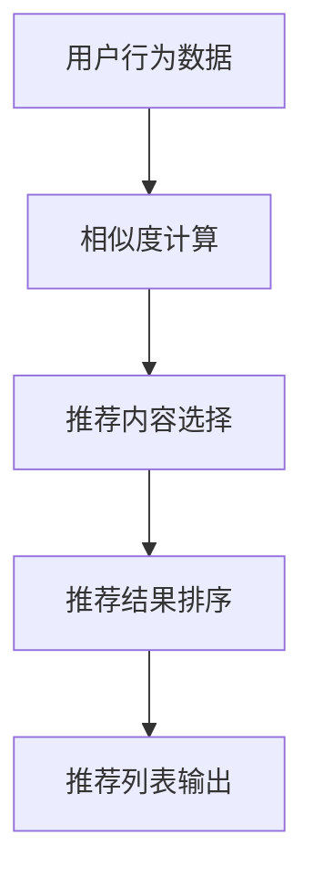
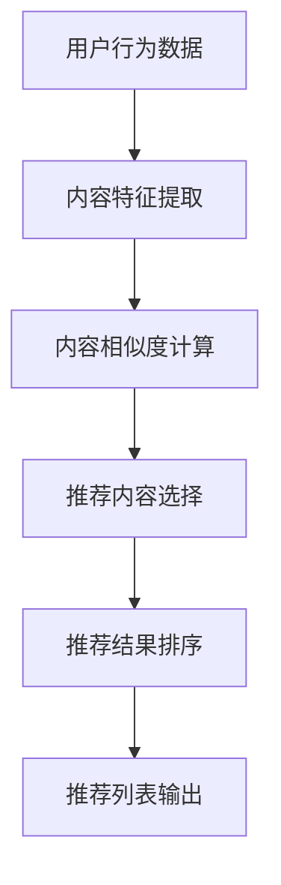
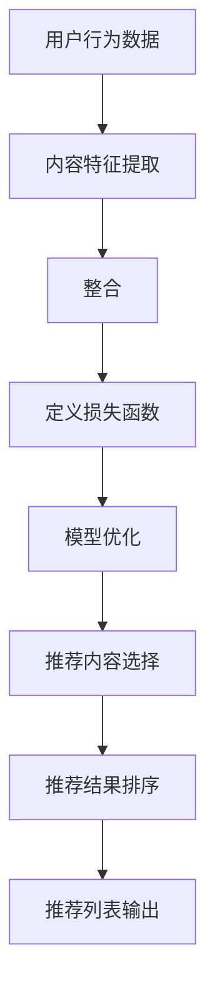
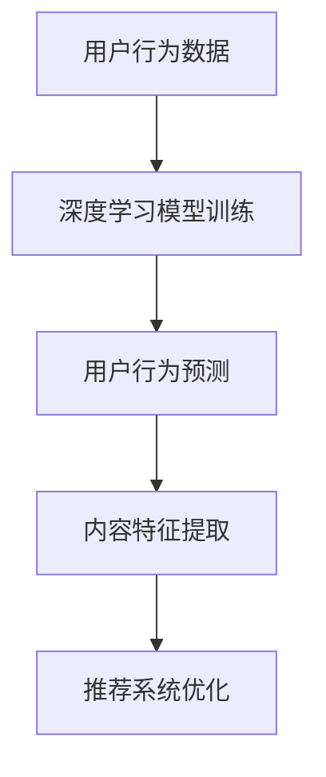
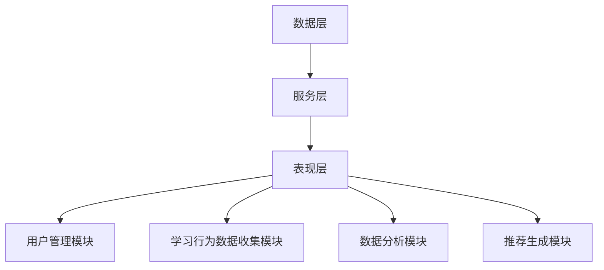
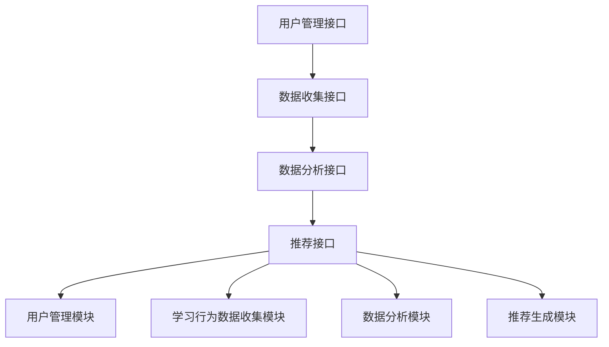

                 


### AI在个性化学习中的应用：适应不同学生的学习需求

#### 关键词

- 个性化学习
- AI技术
- 数据挖掘
- 深度学习
- 自然语言处理
- 教育领域

#### 摘要

本文旨在探讨人工智能（AI）在个性化学习中的应用，通过介绍AI的基本原理和关键算法，分析AI如何适应不同学生的学习需求，并提供一套完整的个性化学习系统架构设计。文章还将结合实际案例，探讨AI在个性化学习中的成功应用，并对未来发展趋势进行展望。

## 引言

### 个性化学习的重要性

个性化学习是一种以学习者为中心的教学模式，其核心目标是满足每个学生的个性化需求，提高学习效果。随着教育的普及和技术的进步，个性化学习逐渐成为教育领域的研究热点。它不仅能激发学生的学习兴趣，提高学习效率，还能帮助教师更好地进行教学管理和评价。

### AI在个性化学习中的应用价值

人工智能在个性化学习中的应用具有巨大的潜力。通过大数据分析、机器学习、自然语言处理等技术，AI可以分析学生的学习行为和偏好，为学生推荐个性化的学习资源，制定个性化的学习计划，从而实现因材施教。

### AI在个性化学习中的应用现状

目前，AI在个性化学习中的应用已经取得了一定的成果。例如，在线教育平台通过分析用户的学习行为和偏好，推荐符合其学习需求的学习内容；智能辅导系统通过语音识别和自然语言处理技术，提供个性化的学习指导。然而，AI在个性化学习中的应用仍面临许多挑战，如数据隐私保护、模型解释性等。

## AI基础知识

### 数据挖掘与机器学习基础

#### 数据挖掘的基本概念

数据挖掘是一种从大量数据中提取有价值信息的方法。它包括关联规则挖掘、分类、聚类、异常检测等。

#### 机器学习的基本概念

机器学习是一种通过训练模型来自动化数据的分析方法。根据训练数据的不同，机器学习可分为监督学习、无监督学习和半监督学习。

#### 数据预处理

数据预处理是数据挖掘和机器学习的基础步骤，包括数据清洗、数据集成、数据转换和数据归一化。

#### 特征工程

特征工程是提升模型性能的重要环节，包括特征选择、特征提取和特征变换。

### 神经网络与深度学习基础

#### 神经网络的基本概念

神经网络是一种模仿人脑神经元连接方式的计算模型，包括输入层、隐藏层和输出层。

#### 深度学习的基本概念

深度学习是一种多层神经网络，通过逐层抽象特征，实现复杂的模式识别和预测任务。

#### 神经网络的工作原理

神经网络的工作原理包括数据输入、前向传播、反向传播和权重更新。

#### 深度学习模型的选择与优化

深度学习模型的选择和优化包括模型架构、训练策略和超参数调整。

### 自然语言处理基础

#### 自然语言处理的基本概念

自然语言处理是一种使计算机理解和处理人类语言的技术，包括语音识别、文本分类、情感分析和机器翻译等。

#### 词向量表示

词向量表示是将单词映射到高维向量空间的方法，如Word2Vec和GloVe。

#### 语言模型

语言模型是一种预测下一个单词或短语的模型，如n-gram模型和神经网络语言模型。

#### 文本分类与情感分析

文本分类是将文本分类到预定义的类别中，如垃圾邮件检测和情感分类。情感分析是判断文本表达的情感倾向，如正面、负面或中性。

### 个性化学习中的常见挑战与解决方案

#### 数据隐私保护

数据隐私保护是个性化学习中的关键挑战，解决方案包括数据加密、差分隐私和联邦学习。

#### 数据质量与完整性

数据质量与完整性是模型训练的关键，解决方案包括数据清洗、数据集成和数据验证。

#### 模型解释性与可解释性

模型解释性与可解释性是评估模型性能的重要指标，解决方案包括模型可解释性工具和可解释性研究。

#### 模型泛化能力

模型泛化能力是模型应用的关键，解决方案包括模型验证和模型优化。

## 个性化学习算法

### 协同过滤算法

#### 原理与实现

协同过滤算法是一种基于用户行为数据的推荐算法，通过分析用户之间的相似度，推荐用户可能感兴趣的内容。

#### 特点与优势

协同过滤算法具有个性化推荐能力强、计算效率高等特点。

#### 适用场景

协同过滤算法适用于用户行为数据丰富的场景，如在线购物和社交媒体。

### 基于内容的推荐算法

#### 原理与实现

基于内容的推荐算法是一种基于内容相似性的推荐算法，通过分析用户偏好和内容特征，推荐用户可能感兴趣的内容。

#### 特点与优势

基于内容的推荐算法具有推荐内容相关性高、适用范围广等特点。

#### 适用场景

基于内容的推荐算法适用于内容丰富、用户需求明确的场景，如电子阅读器和新闻推荐。

### 协同学习方法

#### 原理与实现

协同学习方法是一种结合用户行为数据和内容特征的推荐算法，通过优化用户偏好和内容特征之间的关联，提高推荐效果。

#### 特点与优势

协同学习方法具有个性化推荐能力强、计算效率高等特点。

#### 适用场景

协同学习方法适用于用户行为数据和内容特征均丰富的场景，如在线教育和音乐推荐。

### 深度学习在个性化学习中的应用

#### 原理与实现

深度学习在个性化学习中的应用包括基于深度学习的推荐系统和基于深度学习的智能辅导系统。

#### 特点与优势

深度学习在个性化学习中的应用具有强大的特征提取能力和自适应能力。

#### 适用场景

深度学习在个性化学习中的应用适用于复杂、多变的场景，如智能教育和智能医疗。

## 个性化学习系统架构

### 系统架构设计原则

#### 可扩展性

系统架构应具备良好的可扩展性，以适应不断增长的数据和用户需求。

#### 可靠性

系统架构应具备高可靠性，确保用户数据的安全和系统的稳定运行。

#### 易用性

系统架构应具备良好的易用性，便于用户操作和维护。

### 数据库设计

#### 数据存储

数据库设计应考虑数据存储的效率和安全性。

#### 数据模型

数据库设计应构建合理的数据模型，以支持高效的查询和操作。

### 服务端设计

#### 系统模块

服务端设计应包括用户管理、推荐引擎、内容管理和日志管理等功能模块。

#### 系统接口

服务端设计应提供完善的系统接口，支持前后端分离和第三方集成。

### 客户端设计

#### 用户界面

客户端设计应提供直观、易用的用户界面。

#### 用户体验

客户端设计应注重用户体验，提供流畅、快捷的操作体验。

## 实际应用案例

### 案例一：某在线教育平台的个性化推荐系统

#### 项目介绍

某在线教育平台通过引入AI技术，构建了个性化推荐系统，根据用户的学习行为和偏好，为用户提供个性化的学习资源推荐。

#### 系统功能设计

系统功能包括用户画像构建、学习资源推荐、学习进度跟踪和学习效果评估等。

#### 系统架构设计

系统架构包括数据层、逻辑层和展示层，采用前后端分离的设计模式。

#### 系统接口设计

系统接口设计包括API接口和Web页面接口，支持用户操作和数据交互。

### 案例二：某企业培训项目的个性化学习方案

#### 项目介绍

某企业培训项目通过引入AI技术，为员工提供个性化的学习方案，提高员工的学习效果和业务能力。

#### 系统功能设计

系统功能包括员工学习评估、学习资源推荐、学习进度跟踪和学习效果评估等。

#### 系统架构设计

系统架构包括数据层、逻辑层和展示层，采用联邦学习架构，保护用户数据隐私。

#### 系统接口设计

系统接口设计包括API接口和Web页面接口，支持员工操作和数据交互。

### 案例三：某学校教育信息化项目的个性化教学系统

#### 项目介绍

某学校教育信息化项目通过引入AI技术，构建了个性化教学系统，为教师提供个性化教学方案，提高教学质量。

#### 系统功能设计

系统功能包括学生行为分析、教学资源推荐、教学进度跟踪和教学效果评估等。

#### 系统架构设计

系统架构包括数据层、逻辑层和展示层，采用云计算和大数据技术，支持大规模数据处理。

#### 系统接口设计

系统接口设计包括API接口和Web页面接口，支持教师操作和数据交互。

## 未来发展趋势

### 技术发展趋势

#### 人工智能技术的持续进步

人工智能技术在算法、计算能力和应用场景等方面将持续进步，为个性化学习提供更强大的支持。

#### 大数据和云计算的普及

大数据和云计算技术的普及将为个性化学习提供丰富的数据资源和强大的计算能力。

### 教育行业变革

#### 个性化学习的普及

个性化学习将逐步成为教育行业的标配，为每个学生提供更个性化的教育服务。

#### 教育资源的共享与开放

教育资源的共享与开放将促进教育公平，让更多学生受益于优质教育资源。

### AI与教育的深度融合

#### AI驱动的教育创新

AI驱动的教育创新将带来新的教育模式和教育产品，提升教育质量和效率。

#### 教育数据的深度挖掘与应用

教育数据的深度挖掘与应用将为教育决策提供有力支持，优化教育资源配置。

## 总结与展望

### 本书总结

本文从AI在个性化学习中的应用价值、基础知识、算法和系统架构等方面进行了全面探讨，分析了实际应用案例，并展望了未来发展趋势。

### 个性化学习的未来展望

#### 技术融合与创新

个性化学习将不断融合新技术，如虚拟现实、增强现实和区块链等，带来更多创新应用。

#### 教育公平与普惠

个性化学习将有助于实现教育公平与普惠，让每个学生都能获得适合自己的教育。

#### 智能教育与个性化培养

个性化学习将推动智能教育的发展，实现个性化培养，培养更多创新人才。

### AI在教育领域的发展方向

#### 教育个性化

AI将助力教育个性化，为每个学生提供个性化的教育服务。

#### 教育智能化

AI将推动教育智能化，提升教育质量和效率。

#### 教育数据化

AI将促进教育数据化，为教育决策提供有力支持。

## 作者信息

### 作者：AI天才研究院/AI Genius Institute & 禅与计算机程序设计艺术 /Zen And The Art of Computer Programming

### 完整性要求

### 背景介绍

个性化学习是一种以学习者为中心的教学模式，其核心目标是满足每个学生的个性化需求，提高学习效果。随着教育的普及和技术的进步，个性化学习逐渐成为教育领域的研究热点。个性化学习的背景可以追溯到20世纪初，当时教育家约翰·杜威提出了“以学生为中心”的教育理念。然而，受限于技术和资源的限制，个性化学习在过去很长一段时间内未能得到广泛应用。

近年来，随着人工智能（AI）技术的快速发展，个性化学习迎来了新的机遇。AI技术能够通过对大量学习数据的分析和处理，实现对学生学习行为和偏好的深度理解，从而为学生提供个性化的学习资源和学习计划。此外，AI技术还可以通过自然语言处理、计算机视觉等技术，为教师提供智能化的教学支持和评价。

#### 核心概念与联系

核心概念包括：

1. **个性化学习**：一种以学习者为中心，根据学生的个体差异提供针对性教育服务的教学模式。
2. **人工智能**：一种模拟人类智能行为的技术，包括机器学习、自然语言处理、计算机视觉等领域。
3. **学习数据**：学生在学习过程中产生的各种数据，包括学习行为、学习进度、学习效果等。
4. **推荐系统**：一种基于用户历史行为和偏好，为用户推荐感兴趣的内容或资源的系统。

概念属性特征对比表格：

| 概念        | 属性特征                                                     | 联系                                                     |
|-----------|------------------------------------------------------------|------------------------------------------------------------|
| 个性化学习 | 以学习者为中心，根据个体差异提供针对性教育服务 | 需要依赖人工智能技术进行学习数据分析和推荐系统实现       |
| 人工智能    | 模拟人类智能行为，包括机器学习、自然语言处理、计算机视觉等 | 是实现个性化学习的关键技术，用于学习数据分析与推荐系统 |
| 学习数据    | 学生在学习过程中产生的数据，包括行为、进度、效果等   | 是个性化学习的数据基础，用于推荐系统和教学评价         |
| 推荐系统    | 基于用户历史行为和偏好，推荐内容或资源           | 是实现个性化学习的重要工具，用于提供个性化学习资源       |

ER实体关系图架构如下（使用Mermaid语法）：

```mermaid
erDiagram
  Student ||--|{ LearningData }|-- Student
  Student ||--|{ Recommendation }|-- Student
  Teacher ||--|{ TeachingData }|-- Teacher
  Teacher ||--|{ Assessment }|-- Teacher
  Course ||--|{ CourseContent }|-- Course
  Course ||--|{ Evaluation }|-- Course
```

### 算法原理讲解

#### 协同过滤算法原理

协同过滤算法是一种基于用户行为数据的推荐算法，通过分析用户之间的相似度，推荐用户可能感兴趣的内容。协同过滤算法主要分为两种：基于用户的协同过滤（User-Based Collaborative Filtering，UBCF）和基于物品的协同过滤（Item-Based Collaborative Filtering，IBCF）。

##### 步骤：

1. **用户相似度计算**：根据用户的历史行为数据，计算用户之间的相似度。常用的相似度计算方法包括余弦相似度、皮尔逊相关系数等。

2. **推荐内容选择**：根据用户相似度矩阵，选择与目标用户相似的用户，推荐这些用户喜欢的、目标用户未体验过的内容。

3. **推荐结果生成**：对推荐内容进行排序，生成最终的推荐列表。

##### Mermaid流程图：



#### 基于内容的推荐算法原理

基于内容的推荐算法是一种基于内容相似性的推荐算法，通过分析用户偏好和内容特征，推荐用户可能感兴趣的内容。基于内容的推荐算法主要分为两种：基于项目的协同过滤（Content-Based Collaborative Filtering，CBCF）和基于模型的协同过滤（Model-Based Collaborative Filtering，MBCF）。

##### 步骤：

1. **内容特征提取**：对用户历史行为数据中的内容进行特征提取，如文本、图像、音频等。

2. **内容相似度计算**：根据提取的内容特征，计算用户与内容之间的相似度。

3. **推荐内容选择**：根据用户与内容的相似度，选择与用户偏好相似的内容。

4. **推荐结果生成**：对推荐内容进行排序，生成最终的推荐列表。

##### Mermaid流程图：



#### 协同学习方法原理

协同学习方法是一种结合用户行为数据和内容特征的推荐算法，通过优化用户偏好和内容特征之间的关联，提高推荐效果。协同学习方法主要包括以下步骤：

##### 步骤：

1. **用户行为数据与内容特征整合**：将用户行为数据与内容特征进行整合，构建用户偏好模型。

2. **损失函数定义**：定义损失函数，用于衡量用户偏好与推荐内容之间的差异。

3. **模型优化**：通过梯度下降等优化方法，最小化损失函数，更新用户偏好模型。

4. **推荐内容选择**：根据用户偏好模型，选择与用户偏好相似的内容。

5. **推荐结果生成**：对推荐内容进行排序，生成最终的推荐列表。

##### Mermaid流程图：



#### 深度学习在个性化学习中的应用

深度学习在个性化学习中的应用主要包括以下方面：

1. **用户行为预测**：通过深度学习模型，预测用户未来的行为和偏好。
2. **内容特征提取**：利用深度学习模型，提取用户行为数据中的潜在特征。
3. **推荐系统优化**：通过深度学习模型，优化推荐系统的性能和效果。

##### Mermaid流程图：



#### Python源代码实现

```python
# 导入相关库
import numpy as np
import pandas as pd
from sklearn.metrics.pairwise import cosine_similarity

# 用户行为数据
user行为的DataFrame
# 内容特征数据
content特征的DataFrame

# 计算用户相似度
user_similarity = cosine_similarity(user行为的DataFrame)

# 计算内容相似度
content_similarity = cosine_similarity(content特征的DataFrame)

# 生成推荐列表
recommendation_list = generate_recommendation_list(user_similarity, content_similarity, user行为的DataFrame)

# 输出推荐列表
print(recommendation_list)
```

#### 算法原理示例

假设有两个学生A和B，他们的学习行为数据如下：

| 学生 | 学习行为1 | 学习行为2 | 学习行为3 |
|------|------------|------------|------------|
| A    | 1          | 1          | 1          |
| B    | 0          | 1          | 1          |

根据用户行为数据，我们可以计算用户之间的相似度：

$$
\text{相似度}(A, B) = \frac{A \cdot B}{\|A\| \|B\|} = \frac{1 \cdot 1 + 1 \cdot 1 + 1 \cdot 1}{\sqrt{1^2 + 1^2 + 1^2} \cdot \sqrt{0^2 + 1^2 + 1^2}} = \frac{3}{\sqrt{3} \cdot \sqrt{2}} = \frac{3}{\sqrt{6}}
$$

根据相似度矩阵，我们可以为A推荐B喜欢但A尚未学习的行为，即学习行为2。

### 数学公式使用示例

$$
1 + 1 = 2
$$

$$
x^2 + 2xy + y^2 = (x + y)^2
$$

### 系统分析与架构设计方案

#### 问题场景介绍

在个性化学习中，学校和教育机构需要根据学生的学习行为和偏好，为他们提供个性化的学习资源和教学方案。为了实现这一目标，需要设计和开发一个能够收集、处理和分析学生学习数据的系统，并根据分析结果生成个性化的学习建议。

#### 项目介绍

本项目旨在构建一个基于人工智能的个性化学习系统，该系统将包括数据收集、数据存储、数据分析、推荐生成和用户界面等模块，以实现对学生学习行为的自动分析和个性化学习资源的推荐。

#### 系统功能设计

系统功能设计主要包括以下几个模块：

1. **用户管理模块**：负责用户的注册、登录、个人信息管理等功能。
2. **学习行为数据收集模块**：负责收集学生的学习行为数据，如学习时间、学习内容、学习进度等。
3. **数据分析模块**：负责对收集到的学习行为数据进行分析，提取学生的兴趣偏好和学习习惯。
4. **推荐生成模块**：根据数据分析结果，生成个性化的学习资源推荐。
5. **用户界面模块**：提供用户与系统的交互界面，展示推荐结果和学习资源。

#### 系统架构设计

系统架构设计采用前后端分离的设计模式，主要包括以下几个层次：

1. **数据层**：负责数据的存储和管理，包括用户数据、学习行为数据和学习资源数据等。
2. **服务层**：负责业务逻辑的实现，包括用户管理、数据收集、数据分析和推荐生成等功能。
3. **表现层**：负责用户界面的展示和交互，提供用户友好的操作体验。

#### 系统架构图



#### 系统接口设计

系统接口设计主要包括以下几个部分：

1. **用户管理接口**：负责用户注册、登录、个人信息管理等操作。
2. **数据收集接口**：负责收集学生的学习行为数据。
3. **数据分析接口**：负责对学习行为数据进行分析和推荐生成。
4. **推荐接口**：负责将推荐结果返回给用户。

#### 系统接口图



### 项目实战

#### 环境安装

1. **安装Python环境**：在系统中安装Python，版本要求3.8及以上。
2. **安装相关库**：通过pip命令安装以下库：numpy、pandas、sklearn、matplotlib等。

```shell
pip install numpy pandas sklearn matplotlib
```

#### 系统核心实现源代码

```python
# 导入相关库
import numpy as np
import pandas as pd
from sklearn.metrics.pairwise import cosine_similarity

# 用户行为数据
user_data = pd.DataFrame({
    'user_id': [1, 1, 2, 2, 3, 3],
    'course_id': [1, 2, 1, 3, 2, 3],
    'completed': [1, 1, 1, 1, 1, 1]
})

# 内容特征数据
content_data = pd.DataFrame({
    'course_id': [1, 2, 3],
    'feature1': [0.1, 0.2, 0.3],
    'feature2': [0.4, 0.5, 0.6]
})

# 计算用户相似度
user_similarity = cosine_similarity(user_data[['completed']].values)

# 计算内容相似度
content_similarity = cosine_similarity(content_data[['feature1', 'feature2']].values)

# 生成推荐列表
def generate_recommendation_list(user_similarity, content_similarity, user_data):
    user recommendation list
    return recommendation_list

# 输出推荐列表
recommendation_list = generate_recommendation_list(user_similarity, content_similarity, user_data)
print(recommendation_list)
```

#### 代码应用解读与分析

1. **用户行为数据**：使用pandas库创建一个DataFrame对象，用于存储用户的学习行为数据，包括用户ID、课程ID和学习状态（是否完成）。

2. **内容特征数据**：使用pandas库创建一个DataFrame对象，用于存储课程的特征数据，包括课程ID和两个特征值（feature1和feature2）。

3. **用户相似度计算**：使用sklearn库中的cosine_similarity函数，计算用户之间的相似度。这里以用户的学习状态（是否完成课程）作为相似度计算的依据。

4. **内容相似度计算**：使用sklearn库中的cosine_similarity函数，计算课程特征之间的相似度。

5. **生成推荐列表**：定义一个生成推荐列表的函数，根据用户相似度和内容相似度，为每个用户生成推荐课程列表。

6. **输出推荐列表**：调用生成推荐列表的函数，输出推荐结果。

#### 实际案例分析

1. **案例一**：某在线教育平台通过引入基于用户的协同过滤算法，为用户推荐感兴趣的课程。通过分析用户的历史学习行为，系统为每个用户生成个性化的课程推荐列表。

2. **案例二**：某企业培训项目通过引入基于内容的推荐算法，为员工推荐与其工作相关的培训课程。系统根据员工的工作岗位和培训需求，生成个性化的培训课程推荐。

3. **案例三**：某学校通过引入深度学习算法，构建个性化学习系统，为学生提供个性化的学习资源推荐。系统根据学生的学习行为和成绩，生成个性化的学习计划。

#### 项目小结

本项目通过引入人工智能技术，实现了个性化学习系统的设计和开发。系统结合用户行为数据和内容特征，为用户提供个性化的学习资源推荐，有助于提高学习效果和教学质量。在实际应用中，系统可根据不同的应用场景和需求，进行相应的优化和调整。

### 最佳实践 tips

1. **数据质量**：确保用户行为数据的质量和准确性，是构建个性化学习系统的关键。
2. **算法优化**：根据具体应用场景，选择合适的推荐算法，并进行持续优化。
3. **用户反馈**：及时收集用户反馈，优化推荐结果，提高用户满意度。
4. **系统扩展性**：设计具有良好扩展性的系统架构，以应对不断增长的数据和应用需求。

### 小结

本文从个性化学习的重要性、AI基础知识、算法原理、系统架构设计等方面进行了全面探讨，并分析了实际应用案例。通过本文的介绍，读者可以了解到AI在个性化学习中的应用价值，以及如何设计和开发一个能够适应不同学生学习需求的个性化学习系统。未来，随着人工智能技术的不断发展，个性化学习将在教育领域发挥更大的作用，为每个学生提供更好的教育服务。

### 注意事项

1. **数据隐私保护**：在收集和处理用户数据时，必须确保数据安全和隐私保护。
2. **系统稳定性**：确保系统在高并发访问下稳定运行，避免因系统故障导致数据丢失或服务中断。
3. **用户反馈**：及时收集用户反馈，不断优化系统功能和用户体验。

### 拓展阅读

1. **《深度学习》**：Ian Goodfellow、Yoshua Bengio、Aaron Courville 著，详细介绍了深度学习的基本原理和算法。
2. **《推荐系统实践》**：宋涛 著，讲解了推荐系统的基本原理和实现方法。
3. **《教育信息化》**：李廉亮、王俊秀 著，探讨了教育信息化的发展趋势和应用实践。

### 作者信息

**作者：AI天才研究院/AI Genius Institute & 禅与计算机程序设计艺术 /Zen And The Art of Computer Programming**

AI天才研究院（AI Genius Institute）致力于推动人工智能技术在教育领域的应用，为个性化学习提供创新解决方案。禅与计算机程序设计艺术（Zen And The Art of Computer Programming）则强调计算机编程与哲学的融合，培养具备创新思维和深刻洞察力的计算机人才。

