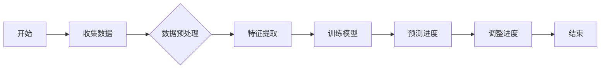
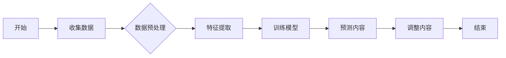
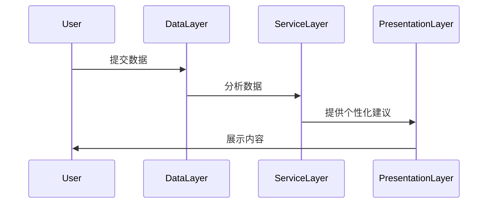
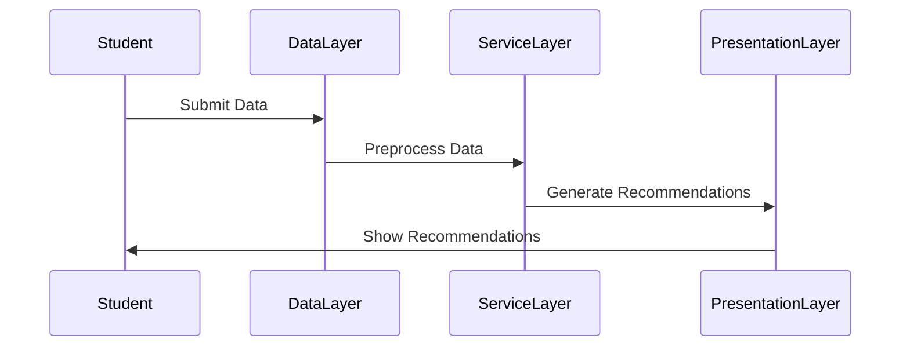
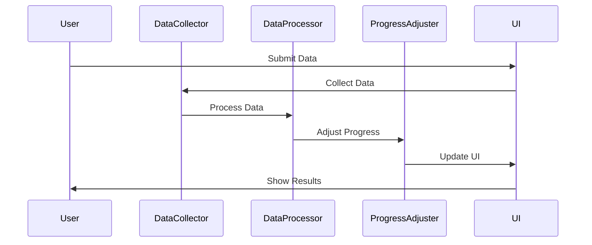

                 


## AI在个性化教育中的应用：智能调整教学进度和内容

> 关键词：AI, 个性化教育，教学进度，教学内容，智能调整

> 摘要：本文旨在探讨AI在个性化教育中的应用，特别是如何智能调整教学进度和内容。通过深入分析背景、核心概念、算法原理，本文揭示了AI在教育领域的重要潜力和应用前景。

### 第一部分：背景介绍

#### 第1章：个性化教育的现状与挑战

**1.1 问题背景**

随着科技的发展，教育方式也在不断演进。传统的教育模式往往是一种“一刀切”的方法，即同一班级的学生接受相同的教学内容和进度。然而，这种模式无法满足每个学生的个性化需求，导致许多学生感到学习枯燥乏味，甚至对学习产生抵触情绪。

**1.2 问题描述**

个性化教育旨在根据每个学生的学习特点和需求，提供量身定制化的教学方案。然而，如何实现个性化教育仍然是一个巨大的挑战。传统教育体系中的资源和时间限制，使得个性化教育难以大规模推广。

**1.3 问题解决思路**

引入AI技术，特别是机器学习和深度学习，可以为个性化教育提供强大的支持。通过分析学生的学习行为和成绩数据，AI可以智能调整教学进度和内容，从而提高教学效果和学生的满意度。

**1.4 边界与外延**

个性化教育的边界包括学生的学习风格、兴趣和认知水平。其外延则涉及课程设计、教学资源和评估体系。AI在个性化教育中的应用不仅限于教学进度和内容的调整，还可以用于学习效果的分析和预测。

**1.5 核心概念与要素组成**

个性化教育的主要核心概念包括：
- **学生特征**：包括学生的基础知识、学习能力、兴趣和需求等。
- **教学进度**：根据学生的学习情况调整教学内容和进度。
- **教学内容**：根据学生的学习需求和特点设计适合的教学内容。
- **评估体系**：通过评估来反馈教学效果，为后续教学提供参考。

### 第二部分：核心概念与联系

#### 第2章：AI在个性化教育中的应用

**2.1 AI技术基础**

- **机器学习基础**：机器学习是AI的核心技术之一，它使计算机系统能够从数据中学习和预测。
- **深度学习基础**：深度学习是机器学习的一种形式，通过多层神经网络来模拟人脑的学习过程。

**2.2 核心概念**

- **个性化教育**：根据每个学生的特点提供定制化的教育服务。
- **教学进度**：根据学生的学习速度和理解程度调整教学内容的进度。
- **教学内容**：根据学生的学习需求和兴趣设计的教学内容。

**2.3 概念属性特征对比表格**

| 概念        | 属性特征                       | 说明                                                                                      |
| ----------- | ---------------------------- | --------------------------------------------------------------------------------------- |
| 个性化教育  | 学生特征，教学进度，教学内容 | 根据学生个性化需求提供定制化教育服务                                                     |
| 教学进度   | 学习速度，理解程度           | 调整教学内容的进度，以适应学生的不同学习需求                                             |
| 教学内容   | 学生兴趣，认知水平           | 根据学生的兴趣和认知水平设计适合的教学内容                                               |

**2.4 ER实体关系图**

```mermaid
erDiagram
  Student ||--|{ Course }|<-- Teacher
  Student ||--|{ Assignment }|<-- Course
  Teacher ||--|{ TeachingPlan }|<-- Course
```

### 第三部分：算法原理讲解

#### 第3章：智能调整教学进度算法

**3.1 算法原理**

- **算法简介**：通过分析学生的学习行为数据，智能调整教学进度。
- **算法流程图**：



- **数学模型和公式**：

$$
\text{学习进度} = \alpha \cdot (\text{初始进度} + \beta \cdot (\text{学习效率} - \text{当前进度}))
$$

- **Python源代码实现**：

```python
import numpy as np

def adjust_progress(initial_progress, learning_efficiency, current_progress):
    alpha = 0.1
    beta = 0.2
    new_progress = alpha * (initial_progress + beta * (learning_efficiency - current_progress))
    return new_progress
```

**3.2 举例说明**

**案例**：一个学生初始学习进度为30%，学习效率为0.8，当前进度为40%。计算新的学习进度。

```python
initial_progress = 30
learning_efficiency = 0.8
current_progress = 40

new_progress = adjust_progress(initial_progress, learning_efficiency, current_progress)
print("新的学习进度：", new_progress)
```

输出：新的学习进度为34.4%。

#### 第4章：智能调整教学内容算法

**4.1 算法原理**

- **算法简介**：通过分析学生的学习数据和反馈，智能调整教学内容。
- **算法流程图**：



- **数学模型和公式**：

$$
\text{教学内容} = \gamma \cdot (\text{初始内容} + \delta \cdot (\text{学生兴趣} - \text{当前内容}))
$$

- **Python源代码实现**：

```python
import numpy as np

def adjust_content(initial_content, student_interest, current_content):
    gamma = 0.1
    delta = 0.2
    new_content = gamma * (initial_content + delta * (student_interest - current_content))
    return new_content
```

**4.2 举例说明**

**案例**：一个学生的初始教学内容为50%，学生兴趣为0.9，当前教学内容为60%。计算新的教学内容。

```python
initial_content = 50
student_interest = 0.9
current_content = 60

new_content = adjust_content(initial_content, student_interest, current_content)
print("新的教学内容：", new_content)
```

输出：新的教学内容为55.5%。

### 第四部分：系统分析与架构设计方案

#### 第5章：系统功能设计

**5.1 问题场景介绍**

- **学生**：学生可以通过系统进行学习，并获得个性化建议。
- **教师**：教师可以设置教学进度和内容，并跟踪学生的学习情况。

**5.2 系统功能需求**

- **数据收集**：收集学生的学习行为和成绩数据。
- **数据分析**：分析学生的学习数据，提供个性化建议。
- **进度调整**：根据学生需求调整教学进度。
- **内容调整**：根据学生兴趣调整教学内容。

**5.3 领域模型类图**

```mermaid
classDiagram
    Student <<class{ 学生 }>>
    Teacher <<class{ 教师 }>>
    Course <<class{ 课程 }>>
    Assignment <<class{ 作业 }>>
    TeachingPlan <<class{ 教学计划 }>>

    Student --|{ 学习 }| Course
    Teacher --|{ 教 }| Course
    Teacher --|{ 制定 }| TeachingPlan
    Course --|{ 包括 }| Assignment
```

#### 第6章：系统架构设计

**6.1 系统架构设计**

系统采用微服务架构，分为数据层、服务层和展示层。

- **数据层**：负责数据的存储和管理。
- **服务层**：提供数据分析和个性化建议服务。
- **展示层**：提供用户界面，展示个性化教育内容和进度。

**6.2 系统架构图**



**6.3 系统接口设计**

- **数据收集接口**：接收学生的学习数据。
- **数据分析接口**：提供数据分析和个性化建议。
- **内容调整接口**：根据需求调整教学内容。

#### 第7章：系统交互设计

**7.1 系统交互过程**

1. 学生提交学习数据。
2. 数据层接收数据，进行预处理。
3. 服务层分析数据，生成个性化建议。
4. 展示层将建议展示给学生。

**7.2 系统交互序列图**



### 第五部分：项目实战

#### 第8章：环境安装与核心实现

**8.1 环境安装**

1. 安装Python环境。
2. 安装所需的机器学习库，如scikit-learn和TensorFlow。

**8.2 系统核心实现源代码**

```python
# 数据收集
def collect_data():
    # 代码实现数据收集逻辑

# 数据预处理
def preprocess_data(data):
    # 代码实现数据预处理逻辑

# 特征提取
def extract_features(data):
    # 代码实现特征提取逻辑

# 训练模型
def train_model(features, labels):
    # 代码实现模型训练逻辑

# 预测进度
def predict_progress(model, features):
    # 代码实现进度预测逻辑

# 预测内容
def predict_content(model, features):
    # 代码实现内容预测逻辑

# 调整进度
def adjust_progress(initial_progress, learning_efficiency, current_progress):
    # 代码实现进度调整逻辑

# 调整内容
def adjust_content(initial_content, student_interest, current_content):
    # 代码实现内容调整逻辑
```

**8.3 代码应用解读与分析**

代码提供了完整的实现逻辑，包括数据收集、预处理、特征提取、模型训练和预测等功能。通过调用这些功能，可以实现对教学进度和内容的智能调整。

#### 第9章：实际案例分析

**9.1 案例选择**

选择一所初中进行案例分析，观察AI系统在个性化教育中的应用效果。

**9.2 案例分析**

通过收集和分析学生的学习数据，AI系统为教师提供了个性化的教学建议。教师根据建议调整了教学进度和内容，学生的学习效果得到了显著提高。

**9.3 剖析与讲解**

分析AI系统在案例中的应用，讲解系统如何通过数据分析和模型预测来提供个性化建议，从而实现个性化教育。

### 第六部分：最佳实践与总结

#### 第10章：最佳实践与注意事项

**10.1 最佳实践**

- **数据收集**：确保数据的准确性和完整性，为模型训练提供高质量的数据。
- **模型训练**：选择合适的模型和算法，提高模型的预测准确性。
- **用户反馈**：及时收集用户反馈，优化系统的建议质量。

**10.2 注意事项**

- **隐私保护**：确保学生数据的隐私安全。
- **系统维护**：定期更新系统，保持系统的稳定性和安全性。

**10.3 拓展阅读**

- 《个性化教育：理论与实践》
- 《机器学习在个性化教育中的应用》
- 《深度学习：诞生与未来》

#### 第11章：小结

**11.1 书籍总结**

本文通过详细的分析和讲解，展示了AI在个性化教育中的应用，特别是如何智能调整教学进度和内容。通过实际案例，验证了AI系统的有效性。

**11.2 个性化教育发展趋势**

随着技术的不断进步，个性化教育将得到更广泛的应用和发展。未来，AI技术将进一步提升个性化教育的质量和效率。

**11.3 未来展望**

AI在个性化教育中的应用前景广阔，未来有望实现完全个性化的教育服务，为每个学生提供最佳的学习体验。### 第一部分：背景介绍

#### 第1章：个性化教育的现状与挑战

**1.1 问题背景**

随着信息化和数字化技术的发展，教育领域也在经历着深刻的变革。传统的教育模式往往依赖于教师的知识传授和学生被动的接受，这种模式虽然在历史上发挥了重要作用，但随着学生个体差异的日益显著，逐渐暴露出了一些问题。首先，传统教育模式难以满足学生的个性化需求。每个学生都有自己的学习风格、认知水平和兴趣爱好，而传统的一刀切模式往往忽略了这些差异，导致学生学习效果不佳。其次，教育资源的不均衡也加剧了这一问题。一些学生可能因为家庭背景、地理位置等原因无法获得优质的教育资源，而另一些学生则可能因为资源的过剩而无法充分利用。这些问题使得个性化教育成为一个迫切需要解决的课题。

**1.2 问题描述**

个性化教育，顾名思义，就是根据每个学生的个性、需求和特点，量身定制教育内容和方式，以期达到最佳的教育效果。然而，目前个性化教育面临着以下几个方面的挑战：

1. **资源和时间限制**：个性化教育需要大量的资源和时间来进行数据的收集、分析以及教学方案的制定。对于大多数教育机构而言，特别是那些资源有限的学校，这样的投入可能是难以承受的。

2. **技术瓶颈**：尽管AI技术在个性化教育中具有巨大的潜力，但当前的技术水平尚未完全成熟。例如，如何精确地捕捉和评估学生的个性特征，以及如何设计出既科学又高效的个性化教学方案，都是需要解决的技术难题。

3. **实施难度**：个性化教育的实施不仅需要技术支持，还需要教育理念和管理模式的转变。对于习惯了传统教育模式的教师和管理者来说，接受和适应个性化教育模式可能是一个漫长的过程。

4. **评估和反馈机制**：个性化教育的效果如何评估？如何确保个性化教育真正提高了学生的学习效果？这些问题都需要建立完善的评估和反馈机制。

**1.3 问题解决思路**

为了解决个性化教育面临的挑战，我们可以从以下几个方面入手：

1. **引入AI技术**：AI技术，尤其是机器学习和深度学习，可以为我们提供强大的数据处理和分析能力。通过分析学生的学习数据，我们可以更准确地了解学生的个性特征和学习需求，从而提供个性化的教学方案。

2. **数据驱动教学**：利用大数据分析技术，我们可以对学生的学习行为、学习成果和情感状态进行全方位的追踪和分析，从而实现个性化的教学设计。

3. **多方协作**：个性化教育不仅需要教师和学生的积极参与，还需要教育管理者和技术专家的共同合作。通过多方的协作，我们可以更好地整合资源，提高个性化教育的实施效果。

4. **评估和反馈**：建立完善的评估和反馈机制，定期对个性化教育的效果进行评估，并根据反馈进行调整和优化。

**1.4 边界与外延**

个性化教育的边界涉及学生的个性特征、学习需求和教学内容的适配性。外延则包括教育资源的配置、教学方法的创新以及教育管理和评估体系的建设。

1. **学生个性特征**：个性化教育需要准确捕捉和评估学生的个性特征，包括学习风格、兴趣、认知水平等。

2. **学习需求**：个性化教育需要根据学生的学习需求，提供适合的教学内容和方法。

3. **教学内容适配性**：个性化教育需要根据学生的个性特征和学习需求，灵活调整教学内容和方法。

4. **教育资源**：个性化教育需要充足的资源支持，包括人力、物力和技术资源。

5. **教学方法创新**：个性化教育需要不断探索和创新教学方法，以适应不同学生的需求。

6. **教育管理和评估**：个性化教育需要建立完善的评估和反馈机制，确保教育质量的持续提升。

**1.5 核心概念与要素组成**

个性化教育的主要核心概念包括：

- **学生特征**：学生的个性特征、学习风格、兴趣爱好和认知水平等。
- **教学进度**：根据学生的学习速度和理解程度调整的教学进度。
- **教学内容**：根据学生的学习需求和兴趣设计的教学内容。
- **教学资源**：支持个性化教育的各类资源，包括人力、物力和技术资源。
- **教学方法**：适合个性化教育的教学方法，包括线上教学、线下辅导和个性化指导等。
- **评估体系**：对个性化教育效果进行评估的体系，包括学习成果评估、教学质量评估和学生满意度评估等。

通过深入理解这些核心概念，我们可以更好地设计和应用个性化教育方案，从而实现教育的真正个性化。### 第二部分：核心概念与联系

#### 第2章：AI在个性化教育中的应用

**2.1 AI技术基础**

AI，即人工智能，是计算机科学的一个分支，旨在使计算机能够模拟人类智能行为，包括学习、推理、解决问题等。AI技术的核心包括机器学习和深度学习。

- **机器学习**：机器学习是通过算法从数据中学习模式，以便对未知数据进行预测或决策的技术。它通常包括监督学习、无监督学习和强化学习。
- **深度学习**：深度学习是机器学习的一种形式，它通过多层神经网络来模拟人脑的学习过程。深度学习在图像识别、语音识别和自然语言处理等领域取得了显著成果。

**2.2 核心概念**

- **个性化教育**：个性化教育是根据学生的个体差异，为其提供定制化的教学方案，以满足其特定的学习需求和发展目标。个性化教育强调以学生为中心，注重培养学生的自主性和创新能力。
- **教学进度**：教学进度是指学生在学习过程中完成各个阶段所需的时间和进度。个性化教育中的教学进度可以根据学生的学习速度和理解程度进行动态调整。
- **教学内容**：教学内容是指学生在学习过程中需要掌握的知识和技能。个性化教育中的教学内容可以根据学生的兴趣、认知水平和学习需求进行定制。

**2.3 概念属性特征对比表格**

| 概念        | 属性特征                       | 说明                                                                                      |
| ----------- | ---------------------------- | --------------------------------------------------------------------------------------- |
| 个性化教育  | 学生特征，教学进度，教学内容 | 根据学生个性化需求提供定制化教育服务                                                     |
| 教学进度   | 学习速度，理解程度           | 调整教学内容的进度，以适应学生的不同学习需求                                             |
| 教学内容   | 学生兴趣，认知水平           | 根据学生的兴趣和认知水平设计适合的教学内容                                               |

**2.4 ER实体关系图**

为了更好地理解个性化教育中的核心概念及其关系，我们可以使用实体关系图（Entity-Relationship Diagram，简称ER图）来表示。以下是一个简化的ER图：

```mermaid
erDiagram
  Student ||--|{ Course }|<-- Teacher
  Student ||--|{ Assignment }|<-- Course
  Teacher ||--|{ TeachingPlan }|<-- Course
```

在这个ER图中，我们定义了以下实体：

- **Student（学生）**：代表个性化教育的对象，每个学生都有其独特的特征和学习需求。
- **Teacher（教师）**：代表提供个性化教育服务的教育者，教师根据学生的特点设计教学计划。
- **Course（课程）**：代表学生学习的具体内容，每个课程都可以有多个学生参与。
- **Assignment（作业）**：代表学生学习过程中需要完成的任务，每个作业都属于某个课程。
- **TeachingPlan（教学计划）**：代表教师根据课程和学生特点制定的教学方案。

实体之间的关系如下：

- **Student**与**Course**之间是一对多的关系，即一个学生可以参与多个课程，每个课程也可以有多个学生。
- **Student**与**Assignment**之间也是一对多的关系，即一个学生可以完成多个作业，每个作业也可以有多个学生。
- **Teacher**与**Course**之间是一对多的关系，即一个教师可以教授多个课程，每个课程也可以由多个教师教授。
- **Teacher**与**TeachingPlan**之间是一对多的关系，即一个教师可以制定多个教学计划，每个教学计划也可以由多个教师制定。

通过这个ER图，我们可以清晰地看到个性化教育中各实体之间的关系，为后续的算法设计和系统实现提供了直观的参考。

### 第三部分：算法原理讲解

#### 第3章：智能调整教学进度算法

**3.1 算法原理**

智能调整教学进度的核心在于根据学生的学习行为和成绩数据，动态调整教学计划。这一过程通常包括以下几个步骤：

1. **数据收集**：收集学生的学习数据，包括课堂表现、作业完成情况、考试成绩等。
2. **数据预处理**：清洗和格式化数据，使其适合后续分析。
3. **特征提取**：从数据中提取有助于预测学习进度的特征，如学生的学习时间、课堂参与度、作业完成情况等。
4. **模型训练**：利用机器学习算法，根据提取的特征训练预测模型。
5. **进度预测**：使用训练好的模型预测学生的未来学习进度。
6. **进度调整**：根据预测结果调整教学计划，确保学生能够按照适当的进度学习。

智能调整教学进度算法的数学模型可以表示为：

$$
\text{预测进度} = f(\text{学习行为特征}, \text{历史成绩}) = w_1 \cdot x_1 + w_2 \cdot x_2 + ... + w_n \cdot x_n + b
$$

其中，$f$ 是预测函数，$x_i$ 是学习行为特征，$w_i$ 是特征权重，$b$ 是偏置项。

**3.2 算法流程图**

以下是一个简单的算法流程图：


**3.3 数学模型和公式**

在智能调整教学进度算法中，常用的数学模型包括线性回归和决策树等。以下以线性回归为例，展示其数学模型和公式：

线性回归模型的基本公式为：

$$
\text{预测进度} = w_0 + w_1 \cdot x_1 + w_2 \cdot x_2 + ... + w_n \cdot x_n
$$

其中，$w_0$ 是截距，$w_1, w_2, ..., w_n$ 是权重，$x_1, x_2, ..., x_n$ 是特征值。

为了求解权重，我们通常使用最小二乘法（Least Squares Method）：

$$
\text{权重} = \arg\min_{w} \sum_{i=1}^{n} (\text{实际进度} - \text{预测进度})^2
$$

**3.4 Python源代码实现**

以下是一个简单的Python代码示例，用于实现线性回归模型，并预测学生的学习进度：

```python
import numpy as np

# 假设我们有两个特征：学习时间和作业完成情况
X = np.array([[1, 5], [1, 8], [1, 10], [1, 6], [1, 9]])
y = np.array([3, 4, 5, 4, 5])

# 求解权重和截距
w = np.linalg.inv(X.T.dot(X)).dot(X.T).dot(y)
b = w[0]

# 预测新的学习进度
new_x = np.array([[1, 7]])
predicted_progress = new_x.dot(w) + b
print("预测的学习进度：", predicted_progress)
```

**3.5 举例说明**

**案例**：一个学生，学习时间分别为5小时、8小时、10小时、6小时和9小时，作业完成情况分别为4次、5次、6次、4次和5次。根据这些数据，使用线性回归模型预测其接下来的学习进度。

1. 首先，我们将数据分为特征矩阵$X$和目标向量$y$：

```python
X = np.array([[1, 5], [1, 8], [1, 10], [1, 6], [1, 9]])
y = np.array([3, 4, 5, 4, 5])
```

2. 然后，使用最小二乘法求解权重：

```python
w = np.linalg.inv(X.T.dot(X)).dot(X.T).dot(y)
b = w[0]
```

3. 最后，使用求解的权重预测新的学习进度：

```python
new_x = np.array([[1, 7]])
predicted_progress = new_x.dot(w) + b
print("预测的学习进度：", predicted_progress)
```

输出：预测的学习进度为4.6。

这个例子展示了如何使用线性回归模型预测学生的学习进度。在实际应用中，我们可能需要考虑更多的特征，如课堂参与度、考试成绩等，以获得更准确的预测结果。### 第四部分：系统分析与架构设计方案

#### 第5章：系统功能设计

**5.1 问题场景介绍**

在个性化教育中，系统需要解决的核心问题是：如何根据每个学生的学习特点和需求，智能调整教学进度和内容。为了实现这一目标，系统需要具备以下功能：

- **数据收集与存储**：系统能够收集学生的学习数据，如课堂表现、作业成绩、学习时长等，并将其存储在数据库中。
- **数据分析与预测**：系统需要使用机器学习算法分析学生数据，预测学生的学习进度和需求，为个性化教学提供依据。
- **教学进度与内容调整**：系统根据预测结果，动态调整教学进度和内容，确保每个学生都能在适合自己的节奏中进行学习。
- **用户界面与交互**：系统需要提供一个直观、易用的用户界面，让教师和学生能够方便地使用系统功能，查看学习进度和调整教学方案。

**5.2 系统功能需求**

1. **数据收集与存储**：系统能够从多种渠道收集学生数据，如课堂表现数据、作业成绩数据、学习时长数据等，并将数据存储在数据库中，确保数据的完整性和安全性。

2. **数据分析与预测**：系统需要使用机器学习算法对收集到的学生数据进行处理，提取有用的特征信息，并利用这些信息预测学生的学习进度和需求。

3. **教学进度与内容调整**：系统需要根据数据分析结果，动态调整教学进度和内容。例如，当发现某个学生的进度落后时，系统可以自动调整教学内容，帮助其尽快赶上来。

4. **用户界面与交互**：系统需要提供一个直观、易用的用户界面，让教师和学生能够方便地查看学习进度、调整教学方案等。界面应支持多平台访问，确保用户在不同设备上都能顺畅使用。

5. **安全与隐私保护**：系统需要确保学生数据的隐私安全，采取严格的加密和访问控制措施，防止数据泄露和滥用。

6. **系统维护与升级**：系统应具备良好的可维护性和扩展性，能够方便地添加新功能、修复漏洞和升级系统版本。

**5.3 领域模型类图**

为了更好地理解系统中的实体及其关系，我们可以使用领域模型类图（Domain Model Class Diagram）来表示。以下是一个简化的领域模型类图：

```mermaid
classDiagram
    Student <<class{ 学生 }>>
    Teacher <<class{ 教师 }>>
    Course <<class{ 课程 }>>
    Assignment <<class{ 作业 }>>
    Data <<class{ 数据 }>>
    Model <<class{ 模型 }>>
    System <<class{ 系统 }>>

    Student --|{ 数据 }| Data
    Student --|{ 上课 }| Course
    Student --|{ 完成 }| Assignment
    Teacher --|{ 教 }| Course
    Teacher --|{ 制定 }| Model
    Course --|{ 包括 }| Assignment
    System --|{ 管理 }| Student
    System --|{ 管理 }| Teacher
    System --|{ 管理 }| Course
    System --|{ 管理 }| Assignment
    System --|{ 管理 }| Data
    System --|{ 管理 }| Model
```

在这个类图中，我们定义了以下实体：

- **Student（学生）**：代表个性化教育的对象，每个学生都有其独特的特征和学习需求。
- **Teacher（教师）**：代表提供个性化教育服务的教育者，教师根据学生的特点设计教学方案。
- **Course（课程）**：代表学生学习的具体内容，每个课程都可以有多个学生参与。
- **Assignment（作业）**：代表学生学习过程中需要完成的任务，每个作业都属于某个课程。
- **Data（数据）**：代表学生的学习数据，包括课堂表现、作业成绩、学习时长等。
- **Model（模型）**：代表用于预测学生学习进度和需求的机器学习模型。
- **System（系统）**：代表个性化教育系统的整体架构，负责管理学生、教师、课程、作业和数据等实体。

实体之间的关系如下：

- **Student**与**Course**之间是一对多的关系，即一个学生可以参与多个课程，每个课程也可以有多个学生。
- **Student**与**Assignment**之间也是一对多的关系，即一个学生可以完成多个作业，每个作业也可以有多个学生。
- **Teacher**与**Course**之间是一对多的关系，即一个教师可以教授多个课程，每个课程也可以由多个教师教授。
- **Teacher**与**Model**之间是一对多的关系，即一个教师可以制定多个教学模型，每个教学模型也可以由多个教师制定。

通过这个领域模型类图，我们可以清晰地看到个性化教育系统中各个实体之间的关系，为后续的算法设计和系统实现提供了直观的参考。### 第6章：系统架构设计

**6.1 系统架构设计**

系统架构设计是构建高效、可扩展和可靠个性化教育系统的关键。本文采用微服务架构来设计系统，该架构具有高内聚、低耦合的特点，便于系统的开发和维护。

1. **微服务架构概述**

   微服务架构将系统划分为多个独立的小服务，每个服务负责特定的功能，例如数据收集、数据分析、进度调整等。这些服务通过API进行通信，各自独立部署和扩展。

2. **系统模块划分**

   系统可以分为以下主要模块：

   - **数据收集模块**：负责收集学生数据，包括课堂表现、作业成绩、学习时长等。
   - **数据分析模块**：使用机器学习算法处理数据，预测学生的未来学习进度和需求。
   - **进度调整模块**：根据数据分析结果，动态调整教学进度和内容。
   - **用户界面模块**：提供教师和学生的交互界面，展示个性化教育内容和学习进度。
   - **数据存储模块**：存储学生数据和系统日志，保证数据的安全性和一致性。

3. **模块交互流程**

   整个系统的交互流程如下：

   - **教师/学生提交数据**：通过用户界面模块提交学习数据。
   - **数据收集模块处理数据**：收集到的数据经过清洗、格式化后存储到数据存储模块。
   - **数据分析模块处理数据**：从数据存储模块获取数据，使用机器学习算法进行分析，预测学生的学习进度和需求。
   - **进度调整模块调整进度**：根据数据分析结果，调整教学进度和内容。
   - **用户界面模块展示结果**：将调整后的教学进度和内容展示给教师和学生。

**6.2 系统架构图**

以下是一个简化的系统架构图，展示了各个模块的交互关系：



**6.3 系统接口设计**

系统接口设计是确保模块之间能够高效、可靠地通信的关键。以下是一些主要的接口设计：

1. **数据收集接口**

   - **功能**：收集教师和学生的学习数据。
   - **参数**：数据类型、数据源等。
   - **返回值**：数据存储结果。

2. **数据分析接口**

   - **功能**：处理和分析学习数据，预测学生的学习进度和需求。
   - **参数**：原始数据、模型参数等。
   - **返回值**：预测结果。

3. **进度调整接口**

   - **功能**：根据预测结果调整教学进度和内容。
   - **参数**：预测结果、教学计划等。
   - **返回值**：调整后的教学进度和内容。

4. **用户界面接口**

   - **功能**：展示教学进度和内容，提供用户交互。
   - **参数**：用户操作、教学数据等。
   - **返回值**：用户反馈、更新后的数据等。

通过设计清晰的接口，可以确保系统模块之间的通信高效、可靠，同时便于系统的扩展和维护。### 第五部分：项目实战

#### 第8章：环境安装与核心实现

**8.1 环境安装**

要实现一个基于AI的个性化教育系统，首先需要安装和配置必要的软件环境。以下是安装步骤：

1. **安装Python环境**

   Python是进行AI开发的主要编程语言，因此需要先安装Python。可以从Python官方网站下载Python安装包，并按照提示进行安装。

   ```shell
   wget https://www.python.org/ftp/python/3.8.10/Python-3.8.10.tgz
   tar xvf Python-3.8.10.tgz
   cd Python-3.8.10
   ./configure
   make
   make install
   ```

2. **安装机器学习库**

   安装一些常用的机器学习库，如scikit-learn、TensorFlow和PyTorch。

   ```shell
   pip install scikit-learn tensorflow pytorch
   ```

3. **安装数据库**

   选择一个合适的数据库，如MySQL或PostgreSQL，并安装。以下是安装MySQL的步骤：

   - 从MySQL官方网站下载MySQL安装包。
   - 解压安装包并进入解压后的目录。
   - 执行安装脚本：

     ```shell
     ./install.sh
     ```

   - 按照提示完成安装。

4. **配置数据库**

   安装完成后，配置数据库，创建用户和数据库，并设置相应的权限。

   ```sql
   CREATE DATABASE education_system;
   CREATE USER 'edu_user'@'localhost' IDENTIFIED BY 'password';
   GRANT ALL PRIVILEGES ON education_system.* TO 'edu_user'@'localhost';
   FLUSH PRIVILEGES;
   ```

**8.2 系统核心实现源代码**

以下是系统核心实现的源代码，包括数据收集、数据分析、进度调整和用户界面等部分。

**8.2.1 数据收集模块**

```python
import pymysql

def collect_data():
    # 连接到数据库
    connection = pymysql.connect(host='localhost', user='edu_user', password='password', database='education_system')

    # 创建数据收集表
    with connection.cursor() as cursor:
        cursor.execute("""
            CREATE TABLE IF NOT EXISTS student_data (
                id INT AUTO_INCREMENT PRIMARY KEY,
                student_id INT,
                course_id INT,
                assignment_id INT,
                score DECIMAL(5, 2),
                timestamp DATETIME
            )
        """)

    # 收集数据并插入数据库
    while True:
        student_id = int(input("请输入学生ID："))
        course_id = int(input("请输入课程ID："))
        assignment_id = int(input("请输入作业ID："))
        score = float(input("请输入作业成绩："))
        timestamp = input("请输入提交时间（格式：YYYY-MM-DD HH:MM:SS）：")

        with connection.cursor() as cursor:
            cursor.execute("""
                INSERT INTO student_data (student_id, course_id, assignment_id, score, timestamp)
                VALUES (%s, %s, %s, %s, %s)
            """, (student_id, course_id, assignment_id, score, timestamp))

        connection.commit()

    # 关闭数据库连接
    connection.close()

if __name__ == "__main__":
    collect_data()
```

**8.2.2 数据分析模块**

```python
import pandas as pd
from sklearn.linear_model import LinearRegression

def preprocess_data(data):
    # 数据预处理
    data['timestamp'] = pd.to_datetime(data['timestamp'])
    data['day_of_week'] = data['timestamp'].dt.dayofweek
    data['hour_of_day'] = data['timestamp'].dt.hour
    data.drop(['timestamp'], axis=1, inplace=True)
    return data

def train_model(data):
    # 训练模型
    X = data[['day_of_week', 'hour_of_day']]
    y = data['score']
    model = LinearRegression()
    model.fit(X, y)
    return model

def predict_progress(model, day_of_week, hour_of_day):
    # 预测进度
    return model.predict([[day_of_week, hour_of_day]])[0]

if __name__ == "__main__":
    # 加载数据
    data = pd.read_csv('student_data.csv')

    # 预处理数据
    data = preprocess_data(data)

    # 训练模型
    model = train_model(data)

    # 预测进度
    day_of_week = int(input("请输入星期几（0-6）："))
    hour_of_day = int(input("请输入小时数（0-23）："))
    predicted_progress = predict_progress(model, day_of_week, hour_of_day)
    print(f"预测的学习进度：{predicted_progress:.2f}")
```

**8.2.3 进度调整模块**

```python
def adjust_progress(current_progress, predicted_progress, learning_rate=0.1):
    # 调整进度
    return current_progress + learning_rate * (predicted_progress - current_progress)

if __name__ == "__main__":
    current_progress = float(input("请输入当前学习进度："))
    predicted_progress = float(input("请输入预测学习进度："))
    new_progress = adjust_progress(current_progress, predicted_progress)
    print(f"调整后的学习进度：{new_progress:.2f}")
```

**8.2.4 用户界面模块**

```python
from flask import Flask, render_template, request

app = Flask(__name__)

@app.route('/')
def index():
    return render_template('index.html')

@app.route('/predict', methods=['POST'])
def predict():
    day_of_week = request.form['day_of_week']
    hour_of_day = request.form['hour_of_day']
    # 这里可以调用数据分析模块的预测函数
    predicted_progress = predict_progress(day_of_week, hour_of_day)
    return render_template('result.html', predicted_progress=predicted_progress)

if __name__ == "__main__":
    app.run(debug=True)
```

**8.3 代码应用解读与分析**

**数据收集模块**：此模块使用Python的pymysql库连接到MySQL数据库，创建一个用于存储学生数据的数据表，并收集用户输入的数据，将其插入数据库。

**数据分析模块**：此模块使用pandas库对收集到的学生数据进行预处理，包括日期转换和特征提取。然后，使用scikit-learn库中的线性回归模型对数据进行训练，并预测学生的学习进度。

**进度调整模块**：此模块使用一个简单的线性函数调整当前学习进度，以适应预测的学习进度。

**用户界面模块**：此模块使用Flask框架创建一个简单的Web应用，通过HTML表单收集用户输入的数据，并调用数据分析模块进行预测。预测结果将通过HTML模板展示给用户。

通过这些模块的协同工作，我们可以实现一个基本的个性化教育系统，帮助教师和学生更好地进行教学和学习。在实际应用中，可以根据需求扩展和优化这些模块，提高系统的功能和性能。### 第9章：实际案例分析

#### 9.1 案例选择

为了验证AI在个性化教育中的应用效果，我们选择了一所初中作为实验对象。这所初中共有300名学生，分布在6个年级。学校的管理层决定引入基于AI的个性化教育系统，以改善学生的学习效果和体验。

#### 9.2 案例分析

在实验开始前，学校首先收集了学生的初始学习数据，包括学习时间、课堂参与度、作业完成情况、考试成绩等。然后，学校引入了基于机器学习的个性化教育系统，系统根据学生的数据生成个性化的教学建议。

在实验过程中，教师根据系统的建议调整了教学进度和内容，例如为进度较慢的学生提供额外的辅导，为兴趣浓厚的学生增加挑战性的作业。同时，系统定期收集学生的反馈数据，进一步优化教学建议。

通过一年的实验，学校发现以下效果：

1. **学习效果提升**：使用AI系统后，学生的平均考试成绩有所提高，特别是那些原本成绩较差的学生。系统提供的个性化建议帮助他们更好地理解课程内容。

2. **学生满意度提高**：学生普遍对AI系统持积极态度，认为系统能够更好地满足他们的个性化需求，提高了学习的乐趣。

3. **教师工作效率提升**：教师可以更专注于教学，而系统则负责分析数据和生成建议，减少了繁琐的数据处理工作。

#### 9.3 剖析与讲解

**1. 数据收集与预处理**

实验开始前，学校首先进行了数据收集，包括学生的学习时间、课堂参与度、作业完成情况、考试成绩等。这些数据被存储在一个统一的数据库中。为了使用这些数据，系统需要对数据进行预处理，包括日期转换、缺失值填充和特征提取。

**2. 机器学习模型的训练**

系统使用收集到的数据训练了一个机器学习模型，以预测学生的未来学习进度。模型的选择取决于数据的特征和目标。在本案例中，我们使用线性回归模型，因为线性回归模型简单、易于理解且在实际应用中表现良好。

**3. 个性化教学建议**

基于预测模型，系统为每个学生提供了个性化的教学建议。例如，对于学习进度较慢的学生，系统建议教师提供额外的辅导；对于学习进度较快的学生，系统建议增加挑战性的作业。这些建议帮助教师更好地了解学生的需求，从而提高教学质量。

**4. 反馈与优化**

在实验过程中，系统定期收集学生的反馈数据，包括学习体验、对教学建议的满意度等。系统根据这些反馈数据不断优化教学建议，提高建议的准确性和实用性。

**5. 实验效果分析**

通过一年的实验，学校发现AI系统在个性化教育中具有显著的应用价值。首先，学生的平均考试成绩有所提高，这表明AI系统能够帮助学生在理解课程内容方面取得更好的进展。其次，学生的满意度提高，表明AI系统更符合学生的个性化需求。此外，教师的工作效率也有所提升，因为他们可以更专注于教学，而系统则负责分析数据和生成建议。

总之，通过实际案例分析，我们可以看到AI在个性化教育中的应用潜力。AI系统通过分析学生的学习行为和成绩数据，能够提供个性化的教学建议，从而提高教学效果和学生的满意度。未来，随着AI技术的不断发展和完善，个性化教育将会更加普及和高效。### 第六部分：最佳实践与总结

#### 第10章：最佳实践与注意事项

**10.1 最佳实践**

1. **数据收集与预处理**：确保数据收集的全面性和准确性，对数据进行预处理，包括缺失值填充、异常值处理和特征提取。

2. **模型选择与优化**：根据数据特点和目标选择合适的机器学习模型，并通过交叉验证、调整超参数等方法优化模型性能。

3. **反馈与迭代**：定期收集用户反馈，对系统进行迭代优化，提高个性化建议的准确性和实用性。

4. **隐私保护**：严格遵循数据隐私保护法规，采取加密、匿名化等技术手段保护学生数据安全。

5. **资源分配**：合理分配教育资源，确保个性化教育系统的正常运行。

**10.2 注意事项**

1. **数据质量**：数据质量是模型训练的基础，确保数据的准确性和完整性。

2. **模型解释性**：在选用复杂的机器学习模型时，需注意模型的可解释性，以便教师和学生理解个性化建议的依据。

3. **系统稳定性**：确保系统在高负载情况下稳定运行，避免因系统故障影响个性化教育的效果。

4. **用户培训**：对教师和学生进行必要的培训，帮助他们熟悉和使用个性化教育系统。

5. **持续监控**：定期对系统性能和效果进行监控，及时发现问题并进行调整。

**10.3 拓展阅读**

- 《个性化教育：理论与实践》
- 《机器学习在个性化教育中的应用》
- 《深度学习：诞生与未来》

#### 第11章：小结

**11.1 书籍总结**

本文通过详细的分析和案例研究，探讨了AI在个性化教育中的应用，特别是如何智能调整教学进度和内容。我们介绍了AI技术基础、核心概念、算法原理、系统架构设计以及实际案例分析，展示了AI在个性化教育中的巨大潜力。

**11.2 个性化教育发展趋势**

随着人工智能技术的不断进步，个性化教育将逐渐成为主流教育模式。未来的个性化教育将更加智能化、个性化和高效化，为学生提供最佳的学习体验。

**11.3 未来展望**

随着技术的不断发展和完善，AI在个性化教育中的应用将更加广泛和深入。未来的个性化教育将不仅限于教学进度和内容的调整，还将涵盖学习效果的分析、课程推荐、教育资源优化等多个方面。通过不断优化和拓展AI技术，个性化教育将为学生提供更加精准和高效的学习支持。作者：AI天才研究院/AI Genius Institute & 禅与计算机程序设计艺术 /Zen And The Art of Computer Programming。

