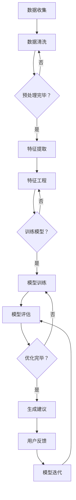
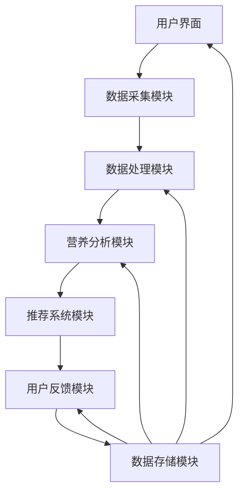
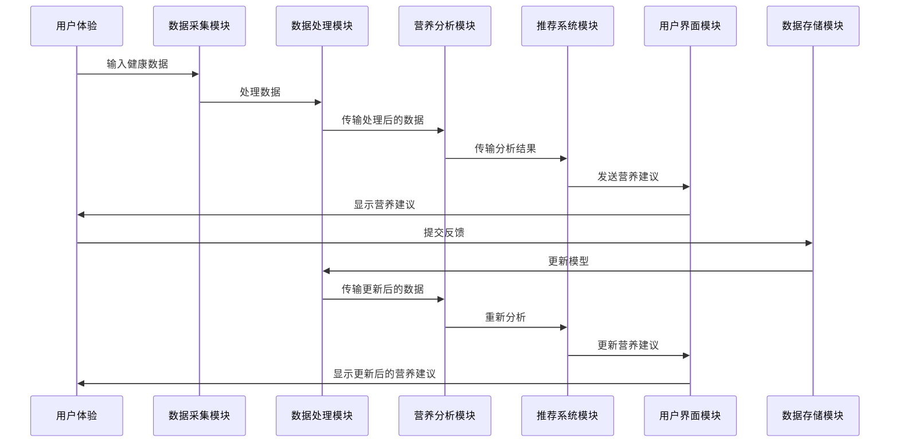

                 

### 1.1 问题背景介绍

在现代社会，健康饮食日益受到广泛关注。随着生活水平的提高和健康意识的增强，人们对饮食质量、营养均衡和健康生活方式的关注度不断提升。然而，传统的营养建议往往基于普遍的饮食指南和平均营养需求，忽略了个体差异。这种一刀切的方法难以满足每个人独特的营养需求，导致许多人仍然面临营养不足或营养过剩的问题。

首先，健康饮食的重要性不言而喻。科学研究表明，良好的饮食习惯与降低慢性疾病风险、提升生活质量、延长寿命等密切相关。营养均衡的饮食可以提供人体所需的各类营养素，维持身体各项生理功能正常运作，同时还能帮助预防肥胖、高血压、糖尿病等常见疾病。

当前的营养建议主要依赖于专家共识和流行指南，如《中国居民膳食指南》等。这些指南提供了一般的饮食建议，例如增加蔬菜、水果和全谷物的摄入，减少油脂和糖的摄入等。然而，这些普遍性的建议在应对个体差异时显得力不从心。每个人有不同的身体结构、生活习惯、健康状况和营养需求，因此，单一的饮食方案很难适用于所有人。

个性化营养建议的出现，正是为了解决这一需求。通过利用人工智能技术，可以根据个人的具体情况进行营养分析，提供量身定制的饮食计划。个性化营养建议不仅可以提高营养摄入的精准度，还能帮助用户更好地理解自己的饮食行为，从而改善健康状况。

总之，健康饮食的重要性不容忽视，而当前营养建议的现状也表明了其不足之处。个性化营养建议的出现为解决这一问题提供了新的思路和方法。接下来，我们将进一步探讨个性化营养建议的潜在影响和应用前景。

### 1.2 问题描述

个性化营养建议的核心在于应对营养需求的多样性，这一需求来自于以下几个方面：

1. **个体差异**：每个人的身体结构和生理功能都有所不同，这意味着他们所需的营养素种类和数量也有所差异。例如，儿童和青少年需要更多的蛋白质和钙，以支持生长发育；老年人则需要更多的维生素D和钙，以预防骨质疏松。

2. **生活习惯**：不同的人有不同的生活方式，包括饮食习惯、工作时间、运动频率等。例如，经常出差或工作忙碌的人可能更倾向于快速便捷的食物，而运动员则需要高热量和高蛋白质的饮食来支持训练。

3. **健康状况**：健康问题也是影响营养需求的因素。某些慢性疾病，如糖尿病、高血压和心血管疾病，需要特殊的饮食管理。此外，一些特殊群体，如孕妇、哺乳期妇女和素食者，也有特定的营养需求。

4. **食物偏好**：每个人的食物偏好和口味也不同。有些人喜欢辛辣食物，有些人偏好清淡饮食，还有一些人可能对某些食物过敏或不耐受。

在数据收集与处理方面，个性化营养建议面临着巨大的挑战。首先，需要收集大量的个体数据，包括但不限于健康状况、生活习惯、食物摄入记录等。这些数据的获取方式可以是用户填写问卷、穿戴设备数据采集、手机APP记录等。然而，数据的质量和完整性直接影响营养建议的准确性。

其次，数据预处理是关键步骤。原始数据通常包含噪声、不一致性和冗余信息，需要通过清洗、归一化和特征提取等方法进行预处理。例如，对食物摄入记录中的杂乱数据格式进行整理，将不同单位的数值转换为同一标准，提取关键特征如营养素含量、食物种类等。

此外，个性化营养建议还需要处理动态变化的数据。随着时间推移，用户的健康状态、生活方式和饮食偏好可能发生变化，因此需要不断更新和调整营养建议。

在食物偏好与生活方式的考量方面，个性化营养建议系统需要平衡用户的饮食需求和实际可操作性。例如，如果用户有严格的饮食限制或特定的食物偏好，系统需要提供相应的饮食方案。同时，营养建议还需考虑用户的日常生活方式，如工作繁忙的上班族可能需要快速准备的食物选项。

总之，个性化营养建议在应对营养需求多样性方面具有显著优势，但在数据收集与处理、食物偏好与生活方式的考量上面临着诸多挑战。这些问题的解决不仅需要技术的支持，还需要深入理解用户的实际需求，从而提供更加精准和实用的饮食建议。

### 1.3 问题解决思路

为了应对个性化营养建议中存在的挑战，人工智能（AI）技术在营养领域的应用提供了强有力的解决方案。首先，AI能够通过机器学习和深度学习算法，对大规模的个体数据进行高效处理和分析，从而识别出用户的营养需求模式。以下是一些关键技术及其在营养建议中的应用：

1. **机器学习算法**：机器学习算法能够从大量数据中自动发现模式和规律，用于预测和分类。例如，通过回归算法可以预测用户对特定营养素的需求量，通过分类算法可以判断用户是否处于营养不良或营养过剩状态。

2. **深度学习模型**：深度学习模型，尤其是神经网络，能够处理复杂的数据结构和非线性关系。通过卷积神经网络（CNN）和递归神经网络（RNN），可以识别食物图像和饮食习惯，从而为用户提供更加精准的营养分析。

3. **数据挖掘技术**：数据挖掘技术用于从海量数据中提取有价值的信息。通过关联规则学习和聚类分析，可以识别出用户之间的相似性和差异性，从而提供个性化的营养建议。

4. **推荐系统**：推荐系统通过用户的历史数据和偏好，推荐符合其营养需求的饮食计划。这不仅可以提高用户满意度，还可以通过持续反馈和迭代，不断优化营养建议的准确性。

通过这些AI技术，个性化营养建议能够提供以下潜在的健康改善效果：

1. **提高营养摄入的准确性**：通过AI技术，可以根据用户的实际情况，提供定制化的营养建议，从而减少营养不足或过剩的问题。

2. **改善健康生活方式**：个性化的营养建议可以帮助用户更好地管理饮食，从而改善整体健康状况，降低慢性疾病的风险。

3. **个性化饮食计划**：AI能够根据用户的口味偏好、食物禁忌和营养需求，提供个性化的饮食计划，提高用户的饮食满意度和依从性。

4. **动态调整和反馈**：AI系统可以实时收集用户反馈和数据，动态调整营养建议，从而实现个性化的持续优化。

总之，人工智能在个性化营养建议中的应用，不仅提高了营养建议的准确性和实用性，还为健康饮食提供了新的解决方案。随着技术的不断进步，AI在营养领域的应用前景将更加广阔。

### 1.4 边界与外延

在讨论个性化营养建议时，有必要明确一些关键概念、术语以及该领域的一些边界与外延。这些概念和术语不仅为读者提供了一个清晰的背景，也有助于理解个性化营养建议的实施和应用范围。

首先，**营养学**是研究食物、营养素和健康之间关系的一个科学领域。核心概念包括：

- **营养素**：指食物中对人体有益的化学物质，包括蛋白质、脂肪、碳水化合物、维生素和矿物质。
- **膳食指南**：是关于食物选择和摄入的建议，通常由营养专家或相关机构制定，以促进公众健康。

其次，**个性化营养建议**是指根据个体的健康状况、生活习惯和食物偏好，为其提供量身定制的饮食方案。关键术语包括：

- **基因营养学**：研究基因与营养素摄入之间的关系，以及如何通过营养干预来调节基因表达。
- **行为营养学**：研究饮食行为和营养状况之间的关系，以及如何通过教育和干预来改善饮食习惯。

在个性化营养建议的应用方面，以下是一些重要的边界与外延：

1. **适用范围**：个性化营养建议主要适用于以下人群：
   - **慢性病患者**：如糖尿病患者、高血压患者等，需要特殊的饮食管理。
   - **特殊群体**：如孕妇、哺乳期妇女、老年人、运动员等，有不同的营养需求。
   - **健康追求者**：希望通过改善饮食来提升健康水平的一般人群。

2. **非个性化营养建议**：传统的营养建议，如《中国居民膳食指南》，通常是基于平均营养需求和普遍饮食习惯制定的，难以满足个体差异。

3. **数据限制**：个性化营养建议依赖于大量的个体数据，包括健康记录、饮食习惯和生活方式等。然而，数据的获取和隐私保护是一个重要的挑战。

4. **技术限制**：虽然AI技术在个性化营养建议中有广泛应用，但算法的准确性和稳定性仍需不断提高，以应对复杂多变的个体情况。

总之，个性化营养建议在健康饮食中的应用具有重要的意义和广阔的前景，但同时也面临着一些技术和实践上的挑战。理解这些核心概念、术语和边界与外延，有助于更好地把握这一领域的现状和发展方向。

### 1.5 概念结构与核心要素

个性化营养建议的提出和实施，涉及多个核心概念和要素。以下是这些概念与要素的详细说明，以及它们在构建个性化营养建议系统中的具体作用：

1. **营养数据**：营养数据是个性化营养建议的基础。这些数据包括个体的日常食物摄入记录、健康状况、生活习惯等。通过收集和分析这些数据，可以识别出用户的营养需求模式，为定制化营养建议提供依据。

2. **数据处理**：营养数据通常是不完整且存在噪声的，因此数据处理是关键步骤。数据处理包括数据清洗、归一化、特征提取等操作，以确保数据的质量和一致性。高质量的数据处理能够提高营养建议的准确性和可靠性。

3. **机器学习算法**：机器学习算法用于从营养数据中提取有用的信息，识别用户的营养需求模式。常见的算法包括回归模型、分类模型、聚类分析等。通过这些算法，系统可以预测用户的营养摄入水平，识别潜在的健康风险，并提供个性化的营养建议。

4. **深度学习模型**：深度学习模型在处理复杂和非线性数据方面具有优势。通过卷积神经网络（CNN）和递归神经网络（RNN），系统能够识别食物图像、分析饮食习惯，从而为用户提供更加精准的营养分析。

5. **用户界面**：用户界面是营养建议系统与用户交互的重要渠道。通过直观的用户界面，用户可以方便地输入个人数据和健康记录，查看营养建议，并进行反馈。一个良好的用户界面可以提高用户的参与度和满意度。

6. **模型迭代与优化**：个性化营养建议是一个动态过程，需要不断收集用户反馈和数据，对模型进行迭代和优化。通过持续的学习和调整，系统能够不断改进营养建议的准确性和实用性。

7. **隐私保护**：在个性化营养建议的实施过程中，隐私保护是一个重要问题。系统需要确保用户数据的保密性和安全性，遵循相关的隐私保护法规和标准，以保护用户的隐私权益。

通过这些核心概念与要素的有机结合，个性化营养建议系统能够为用户提供精准、实用且个性化的饮食建议，帮助他们实现健康饮食目标。接下来，我们将进一步探讨这些概念与要素在实际应用中的具体实现和作用。

## 第2章：核心概念与原理

### 2.1 营养学基础

营养学是研究食物、营养素和人体健康之间关系的科学。在个性化营养建议的背景下，理解营养学的基本概念和原理是至关重要的。以下将详细讨论营养素分类、营养平衡与饮食结构，以及营养与健康的关系。

#### 2.1.1 营养素分类

营养素是食物中能够为人体提供能量、维持生命活动和促进生长发育的化学物质。常见的营养素可以分为以下几类：

1. **碳水化合物**：碳水化合物是人体能量的主要来源，包括糖类、淀粉和膳食纤维。例如，米饭、面条和面包都是富含碳水化合物的食物。

2. **脂肪**：脂肪是另一种重要的能量来源，同时还参与细胞结构的构建和激素的合成。健康脂肪包括橄榄油、鱼油和坚果中的脂肪。

3. **蛋白质**：蛋白质是构成人体组织和细胞的基本物质，参与身体的各种生理功能。高蛋白食物包括肉类、鱼类、豆类和蛋类。

4. **维生素**：维生素是维持人体正常生理功能所必需的小分子有机化合物。常见的维生素有维生素A、维生素C和维生素D等。

5. **矿物质**：矿物质是构成骨骼、牙齿和身体各种生理功能所必需的元素，如钙、铁和钾等。

#### 2.1.2 营养平衡与饮食结构

营养平衡是指人体摄入的营养素种类和数量应与身体的需求保持平衡，以确保身体的正常运转和健康。为了实现营养平衡，饮食结构的设计至关重要。

1. **均衡饮食**：均衡饮食要求食物种类多样化，确保摄入足够的蛋白质、碳水化合物、脂肪、维生素和矿物质。根据《中国居民膳食指南》，建议成年人每天摄入500克蔬菜和300克水果，适量摄入全谷物和豆类，限制高脂肪、高糖和高盐食品的摄入。

2. **饮食结构**：饮食结构是指食物中各类营养素的组成比例。一个健康的饮食结构应该包括：

   - **碳水化合物**：占总能量摄入的50%-65%。
   - **蛋白质**：占总能量摄入的10%-35%。
   - **脂肪**：占总能量摄入的20%-35%，其中饱和脂肪、单不饱和脂肪和多不饱和脂肪的比例应适当。

3. **饮食模式**：饮食模式是指长期形成的饮食习惯和食物选择。不同的饮食模式对健康有不同的影响。例如，地中海饮食模式因其丰富的蔬菜、水果、全谷物和鱼类摄入，被认为有助于降低慢性疾病风险。

#### 2.1.3 营养与健康的关系

营养与健康的关系密切，良好的营养状况能够促进身体健康，而营养不良则可能导致各种健康问题。

1. **能量平衡**：能量平衡是指摄入的能量与消耗的能量相等。长期摄入的能量过多会导致肥胖，摄入的能量过少则会导致消瘦。保持能量平衡是维持健康体重的基础。

2. **慢性病预防**：营养失衡是慢性病的重要风险因素。例如，高糖饮食与糖尿病的发生密切相关，高脂饮食与心血管疾病的风险增加有关。通过科学的饮食管理，可以降低慢性病的发病风险。

3. **免疫支持**：维生素和矿物质在维持免疫系统功能中起着重要作用。例如，维生素C和锌可以增强免疫细胞的功能，预防感染。

4. **心理健康**：营养对心理健康也有显著影响。例如，ω-3多不饱和脂肪酸与情绪调节和心理健康有关，维生素D与抑郁症状的发生有关。

通过理解营养学的基础知识，我们可以更好地制定个性化的营养计划，以满足个人的营养需求，促进健康生活方式的养成。

### 2.2 人工智能基础

人工智能（AI）作为当今科技发展的前沿领域，已经在许多领域展示了其强大的应用潜力。在个性化营养建议中，AI技术同样扮演着至关重要的角色。本节将介绍机器学习、深度学习和神经网络的基本原理，以及这些技术在营养建议中的应用。

#### 2.2.1 机器学习概述

机器学习（Machine Learning，ML）是一门研究如何让计算机从数据中学习并做出决策或预测的学科。其主要目标是通过训练模型来发现数据中的规律，从而进行分类、回归、聚类等任务。

1. **分类算法**：分类算法用于将数据划分为不同的类别。常见的分类算法包括逻辑回归、支持向量机（SVM）和随机森林等。

2. **回归算法**：回归算法用于预测数值型目标。常见的回归算法包括线性回归、决策树回归和神经网络回归等。

3. **聚类算法**：聚类算法用于将数据分为多个簇。常见的聚类算法包括K-means、层次聚类和DBSCAN等。

在个性化营养建议中，机器学习可以用于分析用户的饮食数据和健康状况，识别营养需求模式，提供针对性的饮食建议。

#### 2.2.2 深度学习原理

深度学习（Deep Learning，DL）是机器学习的一个分支，其核心思想是通过构建多层的神经网络来模拟人脑的神经元结构，从而实现对复杂数据的处理和分析。

1. **卷积神经网络（CNN）**：CNN是一种专门用于处理图像数据的神经网络。其主要特点是利用卷积层来提取图像特征，从而实现图像分类、目标检测和图像分割等任务。

2. **递归神经网络（RNN）**：RNN是一种能够处理序列数据的神经网络。其核心思想是通过循环结构来保留之前的计算信息，从而实现对序列数据的建模。常见的RNN包括LSTM（长短期记忆网络）和GRU（门控循环单元）等。

在个性化营养建议中，深度学习可以用于处理用户的历史饮食数据，识别饮食习惯和营养需求之间的关系，从而提供更加精准的饮食建议。

#### 2.2.3 神经网络架构

神经网络（Neural Network，NN）是机器学习的基础，其核心思想是通过模拟生物神经元之间的连接，构建一种能够学习和处理数据的计算模型。

1. **前馈神经网络（FNN）**：前馈神经网络是一种简单的神经网络，其信息传递方向是从输入层经过隐藏层到输出层，没有反向传播的过程。

2. **反向传播算法（BP）**：反向传播算法是一种用于训练神经网络的优化算法。其核心思想是通过计算输出误差，将误差反向传播到每个神经元，从而更新权重和偏置，优化网络性能。

3. **多层感知机（MLP）**：多层感知机是一种前馈神经网络，其结构包括输入层、一个或多个隐藏层和输出层。多层感知机可以用于分类和回归任务。

在个性化营养建议中，神经网络可以用于建立用户健康数据和营养需求之间的模型，从而预测用户的营养摄入水平和健康状况。

#### 2.2.4 人工智能在营养领域的应用

人工智能在营养领域的应用主要包括以下几个方面：

1. **营养分析**：通过机器学习和深度学习算法，分析用户的历史饮食数据，识别营养需求模式和饮食习惯，为用户提供个性化的饮食建议。

2. **健康预测**：利用机器学习和深度学习模型，分析用户的健康数据和营养摄入情况，预测用户未来可能出现的健康问题，并提供预警和建议。

3. **个性化饮食规划**：根据用户的营养需求和健康目标，利用人工智能技术生成个性化的饮食计划，帮助用户实现健康饮食。

4. **智能餐谱推荐**：通过机器学习和深度学习算法，分析用户的口味偏好和饮食习惯，推荐符合其需求的餐谱，提高用户的饮食满意度。

总之，人工智能在个性化营养建议中的应用，不仅提高了营养建议的准确性和实用性，还为健康饮食提供了新的解决方案。随着技术的不断进步，人工智能在营养领域的应用前景将更加广阔。

### 2.3 数据科学与数据处理

数据科学（Data Science）作为一门跨学科领域，结合了数学、统计学、计算机科学和领域知识，以从大量数据中提取有价值的信息和知识。在个性化营养建议中，数据科学发挥着至关重要的作用，特别是在数据预处理、数据可视化和数据分析工具与技术等方面。

#### 2.3.1 数据预处理

数据预处理是数据科学中的关键步骤，其主要目的是清洗和整理数据，使其适合进一步分析和建模。以下是一些常见的数据预处理方法：

1. **数据清洗**：数据清洗涉及处理缺失值、噪声和异常值。常见的处理方法包括：
   - **缺失值处理**：可以通过删除缺失值、填充缺失值或插值等方法进行处理。
   - **噪声处理**：可以通过滤波、平滑或去噪等方法减少噪声的影响。
   - **异常值处理**：可以通过检测和隔离异常值，然后选择删除或修正。

2. **数据归一化**：数据归一化是将不同尺度或范围的数据转换为同一尺度或范围，以便于后续分析和建模。常见的归一化方法包括最小-最大归一化和Z-score归一化。

3. **数据变换**：数据变换涉及将数据转换为适合分析和建模的形式。例如，通过对数变换来处理非线性关系或对极值数据取对数。

4. **特征提取**：特征提取是从原始数据中提取出对分析任务最有用的特征。常见的方法包括：
   - **降维技术**：如主成分分析（PCA）和线性判别分析（LDA），用于减少数据维度，同时保留关键信息。
   - **特征选择**：通过评估不同特征的贡献，选择最有用的特征，减少模型复杂度和提高模型性能。

#### 2.3.2 数据可视化

数据可视化是将数据转换为图形或图表形式，以直观展示数据特征和关系。数据可视化有助于：
   - **数据理解**：通过图形化展示，使数据更容易理解和解释。
   - **发现模式**：通过可视化，可以发现数据中的异常值、趋势和关联。
   - **沟通和决策**：通过可视化结果，可以更有效地与团队成员和利益相关者沟通，并做出更明智的决策。

常见的数据可视化工具和技术包括：
   - **折线图和柱状图**：用于展示数据趋势和比较不同数据集。
   - **散点图和热力图**：用于展示数据之间的关系和分布。
   - **箱线图和直方图**：用于展示数据的分布和统计特性。
   - **交互式可视化**：如D3.js和Plotly，提供动态和交互式的数据展示。

#### 2.3.3 数据分析工具与技术

数据分析工具和技术的选择取决于分析任务和数据类型。以下是一些常见的数据分析工具和技术：

1. **Python**：Python是一种广泛用于数据科学的开源编程语言，其拥有丰富的数据科学库，如NumPy、Pandas、Matplotlib和Scikit-learn，用于数据处理、分析和可视化。

2. **R语言**：R语言是一种专门用于统计分析和图形绘制的语言，其拥有丰富的包和功能，适合复杂的数据分析和统计建模。

3. **SQL**：SQL是一种用于查询和操作关系型数据库的编程语言，常用于数据清洗、预处理和存储。

4. **机器学习库**：如TensorFlow和Keras，用于构建和训练深度学习模型。

5. **大数据处理框架**：如Hadoop和Spark，用于处理大规模数据集。

通过数据科学的方法和技术，个性化营养建议系统能够更好地理解和分析用户的营养数据，从而提供更加精准和实用的营养建议。这不仅有助于改善用户的健康状况，也为营养科学的研究和应用提供了新的思路和工具。

### 2.4 概念属性特征对比

在个性化营养建议中，传统营养建议与AI个性化营养建议之间存在着显著的差异。为了更好地理解这两种方法的特点和应用场景，我们可以通过以下表格和实体关系图（ER图）来对比分析。

#### 2.4.1 传统营养建议与AI个性化营养建议的对比

| 特征对比项 | 传统营养建议 | AI个性化营养建议 |
| :--- | :--- | :--- |
| **数据依赖** | 基于普遍的饮食指南和平均营养需求 | 基于个体的具体健康状况、生活习惯和食物偏好 |
| **个性化程度** | 一刀切的方法，难以满足个体差异 | 定制化的营养建议，根据个人需求提供精准方案 |
| **数据来源** | 专家共识和流行指南，如《中国居民膳食指南》 | 用户健康数据、饮食习惯、食物摄入记录等 |
| **技术支持** | 无需复杂技术支持，主要依赖于专家知识和经验 | 需要机器学习和深度学习算法的支持 |
| **实时性** | 更新较慢，难以反映个体动态变化 | 可以实时收集用户数据，动态调整营养建议 |
| **反馈机制** | 用户反馈较少，难以优化建议 | 用户反馈机制，通过持续迭代优化营养建议 |
| **适应范围** | 广泛适用于一般人群 | 主要适用于需要个性化营养建议的特定人群 |

#### 2.4.2 不同AI算法在营养领域的应用对比

为了进一步探讨AI在个性化营养建议中的应用，以下是几种常见AI算法在营养领域中的对比：

| 算法类型 | 主要优点 | 主要缺点 | 应用场景 |
| :--- | :--- | :--- | :--- |
| **回归算法** | 简单易理解，计算速度快 | 对非线性数据建模能力有限 | 用于预测营养素摄入量、营养不足风险等 |
| **分类算法** | 能有效处理离散数据，分类准确率高 | 难以处理高维度数据和复杂关系 | 用于识别营养过剩、营养不足情况，食物分类等 |
| **聚类算法** | 能发现数据中的隐含结构，提高数据理解 | 分簇质量可能受初始化影响 | 用于发现用户饮食习惯、营养需求群体等 |
| **深度学习** | 强大的建模能力，能够处理复杂数据结构 | 计算资源需求高，训练时间长 | 用于图像识别、自然语言处理，复杂的营养分析等 |

通过这些对比表格和ER图，我们可以更加清晰地理解传统营养建议与AI个性化营养建议的不同特点，以及各种AI算法在营养领域中的应用优势和局限性。这些信息有助于我们更好地选择和应用适当的算法和策略，实现有效的个性化营养建议。

### 2.5 数据与AI的整合

在个性化营养建议系统中，数据与人工智能（AI）技术的整合是关键步骤。这一整合过程不仅涉及数据的收集，还涉及数据处理、分析以及反馈机制的建立。以下是关于数据与AI整合的详细讨论，包括数据来源、数据处理流程以及数据库的设计与实现。

#### 2.5.1 数据来源

个性化营养建议所需的数据来源广泛且多样化，主要包括以下几个方面：

1. **用户健康数据**：这包括用户的身高、体重、年龄、性别、健康状况等信息。这些数据通常通过用户填写问卷或在线健康平台获取。

2. **饮食习惯数据**：用户的饮食习惯数据包括每日饮食记录、食物摄入量、饮食习惯等。这些数据可以通过用户自主记录或使用智能设备（如智能手表、健康手环等）进行采集。

3. **生物医学数据**：包括血液检测结果、体检报告等，这些数据可以提供用户的营养状况、健康状况等详细信息。

4. **食物成分数据**：这是指各种食物中包含的营养素信息，如蛋白质、脂肪、碳水化合物、维生素和矿物质等。这些数据通常来源于权威的食品数据库或营养学文献。

#### 2.5.2 数据处理流程

数据收集后，需要进行一系列处理步骤，以确保数据的质量和一致性，从而为后续分析提供可靠的基础。以下是数据处理的主要流程：

1. **数据清洗**：这一步骤涉及处理缺失值、异常值和噪声数据。具体方法包括：
   - **缺失值处理**：通过删除、插值或均值填充等方法处理缺失值。
   - **异常值检测**：利用统计学方法或机器学习算法检测并处理异常值。
   - **噪声过滤**：通过滤波或平滑算法减少噪声数据的影响。

2. **数据归一化**：将不同特征的数据归一化到相同的尺度或范围，以便于后续分析和建模。常用的归一化方法包括最小-最大归一化和Z-score归一化。

3. **特征提取**：从原始数据中提取对营养分析任务最重要的特征。常见的特征提取方法包括降维技术（如主成分分析PCA）和特征选择技术（如递归特征消除RFE）。

4. **数据融合**：将来自不同来源的数据进行融合，形成一个统一的数据集。这通常涉及数据对齐和一致性检查，确保数据在不同特征维度上的一致性。

5. **数据存储**：将处理后的数据存储到数据库中，以便后续的分析和查询。常用的数据库管理系统（DBMS）包括MySQL、PostgreSQL和MongoDB等。

#### 2.5.3 数据库设计与实现

数据库设计是数据整合过程中至关重要的一环，其目标是构建一个高效、可靠且易于扩展的数据存储和管理系统。以下是数据库设计的主要步骤和实现方法：

1. **需求分析**：根据系统的功能需求，确定需要存储的数据类型和关系。

2. **概念结构设计**：通过实体-关系（ER）图来表示数据实体及其之间的关系。例如，可以设计用户信息表、饮食记录表和食物成分表等。

3. **逻辑结构设计**：将概念结构转换为具体的数据库模式，包括表结构、字段类型、索引和关系约束等。

4. **物理结构设计**：根据数据访问模式和性能要求，选择合适的存储引擎和索引策略。

5. **实现与优化**：使用数据库管理系统（DBMS）实现数据库设计，并进行性能优化。具体方法包括：
   - **索引优化**：为常用的查询字段创建索引，提高查询速度。
   - **分区策略**：对大量数据进行分区，以便于管理和查询。
   - **缓存机制**：使用缓存技术，减少数据库负载，提高系统响应速度。

通过以上步骤，可以构建一个高效、可靠且易于扩展的数据库系统，为个性化营养建议系统提供坚实的数据基础。数据库的设计与实现不仅关系到系统的性能和稳定性，也直接影响营养建议的准确性和实用性。

### 2.6 AI算法与营养建议的关系

在个性化营养建议系统中，AI算法起着至关重要的作用。通过这些算法，系统可以从大量的营养数据中提取有用信息，从而为用户提供量身定制的饮食建议。以下是关于AI算法在营养建议中的应用、算法选择与评估、算法优化与调整以及实际应用效果分析的具体讨论。

#### 2.6.1 算法在营养建议中的应用

AI算法在营养建议中的应用主要表现在以下几个方面：

1. **数据预处理**：在数据处理阶段，AI算法可以帮助识别和修正数据中的噪声和异常值，通过数据清洗和归一化提高数据质量，为后续分析提供可靠的基础。

2. **营养素摄入预测**：通过机器学习算法，尤其是回归模型，可以预测用户的营养素摄入量。这有助于识别用户的营养不足或过剩情况，从而提供针对性的饮食建议。

3. **健康风险预测**：利用分类算法，如逻辑回归和支持向量机（SVM），可以预测用户患慢性疾病（如糖尿病、高血压等）的风险。通过这些预测，系统可以提前提醒用户采取预防措施。

4. **饮食习惯分析**：通过聚类算法（如K-means、层次聚类），可以分析用户的饮食习惯，发现相似的用户群体。这有助于为不同群体提供定制化的营养建议。

5. **个性化饮食计划生成**：利用深度学习模型（如卷积神经网络CNN和递归神经网络RNN），可以根据用户的营养需求和饮食习惯，生成个性化的饮食计划。这些计划不仅考虑营养素的需求，还考虑食物的口感和用户的偏好。

#### 2.6.2 算法选择与评估

选择适合的AI算法是营养建议系统的关键。以下是几种常用的算法及其选择标准：

1. **回归算法**：适用于预测营养素摄入量或健康风险等连续值目标。选择标准包括算法的精度、计算效率和模型复杂度。

2. **分类算法**：适用于识别用户的营养状态和健康风险等离散值目标。常见的选择标准包括准确率、召回率、F1分数等。

3. **聚类算法**：适用于发现用户的饮食习惯和相似用户群体。选择标准包括聚类效果、聚类数目和算法的计算效率。

4. **深度学习模型**：适用于处理复杂和非线性数据，如图像识别和自然语言处理。选择标准包括模型的可解释性、训练时间、计算资源需求等。

在算法选择过程中，可以通过交叉验证、网格搜索等技术进行算法评估，以确定最佳的算法组合和参数设置。

#### 2.6.3 算法优化与调整

为了提高营养建议的准确性和实用性，算法的优化与调整至关重要。以下是几种常见的优化方法：

1. **特征工程**：通过选择和构造有效的特征，提高模型的性能。具体方法包括特征选择、特征组合和特征变换等。

2. **模型调参**：通过调整模型的参数（如学习率、正则化参数等），优化模型的表现。常见的调参方法包括随机搜索、网格搜索和贝叶斯优化等。

3. **集成学习**：通过结合多个模型的优势，提高整体模型的预测性能。常见的方法包括堆叠、随机森林和梯度提升等。

4. **迁移学习**：利用预训练的模型（如在大型数据集上训练的深度学习模型），减少模型训练的时间和计算资源需求，同时提高模型在新数据上的性能。

#### 2.6.4 实际应用效果分析

在实际应用中，算法的效果需要通过多次测试和验证来评估。以下是几种常见的评估方法：

1. **交叉验证**：通过将数据集划分为训练集和验证集，多次训练和验证模型，评估其泛化能力。

2. **混淆矩阵**：用于评估分类模型的性能，包括准确率、召回率、精确率和F1分数等指标。

3. **ROC曲线和AUC**：用于评估分类模型的分类能力，通过计算ROC曲线下面积（AUC）来判断模型的性能。

4. **K折交叉验证**：通过将数据集划分为K个相等的部分，轮流作为验证集和训练集，进行多次训练和验证，以减少过拟合和偏差。

通过这些评估方法，可以定量分析算法在实际应用中的表现，从而进行必要的优化和调整，提高营养建议的准确性和实用性。

### 2.7 用户反馈与模型迭代

个性化营养建议系统的核心在于根据用户的需求和反馈，提供动态调整和优化的饮食建议。这一过程中，用户反馈和模型迭代起到了关键作用。以下是关于用户反馈的收集、用户反馈机制的设计、模型迭代与优化策略的具体讨论。

#### 2.7.1 用户反馈的收集

用户反馈是评估个性化营养建议系统效果的重要依据，也是模型迭代和优化的基础。以下是几种常用的用户反馈收集方法：

1. **问卷调查**：通过设计问卷，收集用户对营养建议的满意度、饮食习惯的变化和健康状况的感受等信息。这种方法的优点是数据获取简便，缺点是用户参与度可能较低。

2. **交互式反馈**：通过应用程序中的交互界面，让用户对营养建议进行实时评价，如点赞、打分或评论等。这种方法可以实时获取用户的反馈，提高数据的时效性和准确性。

3. **穿戴设备数据**：通过用户佩戴的健康监测设备（如智能手表、健康手环等），收集用户的健康数据和活动数据，结合营养建议的实际效果，进行反馈。这种方法的数据更加客观和全面。

4. **日志记录**：鼓励用户记录自己的饮食和健康数据，系统定期分析这些数据，并对比营养建议的效果。这种方法可以提供长期和持续的数据反馈。

#### 2.7.2 用户反馈机制的设计

用户反馈机制是确保系统不断优化和改进的关键。以下是几种常见的用户反馈机制：

1. **即时反馈**：在用户完成每餐或每天的饮食记录后，系统会即时提供营养分析和建议。如果用户对建议有疑问或意见，可以立即在界面上进行反馈。

2. **定期反馈**：系统可以定期（如每周或每月）向用户发送反馈问卷，收集他们对营养建议的整体感受和改进建议。这种方法可以提供更全面的反馈数据。

3. **动态调整**：系统可以根据用户的即时反馈和定期反馈，动态调整营养建议。例如，如果用户反馈某些建议难以执行，系统可以尝试提供替代方案或进行进一步个性化调整。

4. **反馈循环**：建立反馈循环机制，将用户的反馈数据用于模型的重新训练和优化。通过不断的迭代，系统可以逐步提高营养建议的准确性和实用性。

#### 2.7.3 模型迭代与优化策略

模型迭代与优化是确保个性化营养建议系统持续改进的重要手段。以下是几种常见的优化策略：

1. **在线学习**：通过在线学习技术，系统可以在运行过程中不断更新和优化模型。例如，利用用户的实时反馈，调整模型的权重和参数，提高预测的准确性。

2. **迁移学习**：利用迁移学习技术，将预训练的模型应用于新的任务。例如，将大型通用数据集上训练的深度学习模型应用于个性化营养建议系统，可以节省训练时间和计算资源。

3. **集成学习**：通过集成多个模型的优势，提高整体模型的性能。例如，结合回归模型、分类模型和深度学习模型，形成一个更强大的预测系统。

4. **反馈驱动的优化**：根据用户的反馈数据，识别模型中的不足和错误，进行针对性的优化。例如，如果用户反馈某些建议与实际饮食情况不符，系统可以调整模型中的相关参数，提高建议的准确性。

通过用户反馈与模型迭代，个性化营养建议系统可以实现持续改进，更好地满足用户的需求，提高营养建议的准确性和实用性。这一过程不仅有助于改善用户的健康生活方式，也为营养科学的研究和应用提供了新的思路和工具。

### 4.1 个性化营养建议算法概述

个性化营养建议算法是营养领域与人工智能技术结合的产物，旨在通过分析用户的数据，为用户提供精准、实用的饮食建议。以下是几种常见的个性化营养建议算法及其分类、目标和关键步骤。

#### 4.1.1 算法分类

1. **机器学习算法**：基于历史数据和统计学方法，用于预测和分类。常见的机器学习算法包括：
   - **回归算法**：用于预测用户的营养素摄入量。
   - **分类算法**：用于识别用户是否处于营养不足或营养过剩状态。
   - **聚类算法**：用于发现用户的饮食习惯和相似用户群体。

2. **深度学习算法**：利用多层神经网络处理复杂数据结构。常见的深度学习算法包括：
   - **卷积神经网络（CNN）**：用于处理图像数据，识别食物成分和饮食习惯。
   - **递归神经网络（RNN）**：用于处理序列数据，分析用户的饮食习惯和时间序列。

3. **推荐系统算法**：基于用户的历史数据和偏好，推荐符合其营养需求的饮食计划。常见的推荐系统算法包括：
   - **协同过滤**：通过分析用户的历史行为，发现相似用户，推荐相关饮食计划。
   - **基于内容的推荐**：通过分析食物的营养成分和用户的偏好，推荐符合其需求的饮食计划。

#### 4.1.2 算法目标

个性化营养建议算法的主要目标是：
1. **精准性**：通过分析用户的营养数据和健康信息，提供个性化的饮食建议，减少营养不足或过剩的问题。
2. **实用性**：考虑到用户的实际情况和生活方式，提供易于执行的饮食计划，提高用户的依从性和满意度。
3. **实时性**：能够根据用户反馈和数据变化，动态调整营养建议，实现持续优化。

#### 4.1.3 算法关键步骤

个性化营养建议算法的关键步骤通常包括以下几步：

1. **数据收集与预处理**：收集用户的健康数据、饮食习惯和营养摄入记录等，通过数据清洗、归一化和特征提取等预处理步骤，确保数据的质量和一致性。

2. **特征工程**：从原始数据中提取对营养建议任务最有用的特征，如营养素摄入量、饮食习惯、健康状况等，通过特征选择和特征组合提高模型性能。

3. **模型选择与训练**：选择合适的机器学习或深度学习算法，训练模型以预测用户的营养需求或评估营养状态。

4. **模型评估与优化**：通过交叉验证、混淆矩阵和ROC曲线等方法评估模型性能，根据评估结果调整模型参数和算法，优化模型表现。

5. **生成个性化饮食建议**：利用训练好的模型，为用户提供个性化的饮食计划，考虑用户的实际需求和生活习惯，确保建议的实用性和可操作性。

6. **用户反馈与迭代**：收集用户对营养建议的反馈，通过在线学习和迁移学习等技术，不断优化模型和饮食建议，实现持续改进。

通过以上关键步骤，个性化营养建议算法能够为用户提供量身定制的饮食建议，帮助用户实现健康生活方式的养成。

### 4.2 算法流程图

为了更好地理解个性化营养建议算法的工作流程，我们可以使用Mermaid语言来绘制算法的流程图。以下是算法流程图的Mermaid代码及其详细解释。

#### 4.2.1 Mermaid流程图展示



#### 4.2.2 流程图详细解释

1. **数据收集（A）**：首先，系统从多个来源收集用户的健康数据、饮食习惯和营养摄入记录等。

2. **数据清洗（B）**：收集到的数据可能包含缺失值、噪声和异常值。系统通过数据清洗步骤，删除或填充缺失值，检测和修正异常值，过滤噪声数据，确保数据的质量和一致性。

3. **预处理完毕检查（C）**：系统检查数据清洗是否完成，如果未完成则返回到数据清洗步骤（B）。

4. **特征提取（D）**：在数据清洗完成后，系统进行特征提取，从原始数据中提取对营养建议任务最有用的特征，如营养素摄入量、饮食习惯、健康状况等。

5. **特征工程（E）**：通过特征选择和特征组合，优化特征集，提高模型性能。

6. **训练模型检查（F）**：系统检查是否准备好训练模型，如果未完成特征工程则返回到特征工程步骤（E）。

7. **模型训练（G）**：选择合适的机器学习或深度学习算法，使用训练集数据对模型进行训练。

8. **模型评估（H）**：通过交叉验证、混淆矩阵和ROC曲线等方法评估模型性能，识别模型的优点和不足。

9. **优化完毕检查（I）**：系统检查是否完成模型优化，如果未完成则返回到模型训练步骤（G）。

10. **生成建议（J）**：利用训练好的模型，为用户提供个性化的饮食建议，考虑用户的实际需求和生活习惯。

11. **用户反馈（K）**：收集用户对营养建议的反馈，分析用户满意度、饮食习惯的变化和健康状况的感受等信息。

12. **模型迭代（L）**：根据用户反馈，利用在线学习和迁移学习等技术，对模型进行迭代和优化。

13. **模型评估（H）**：重新评估模型的性能，确保迭代后的模型表现更优。

通过以上步骤，个性化营养建议算法能够为用户提供精准、实用的饮食建议，并随着用户反馈的不断迭代，实现持续优化和改进。

### 4.3 Python代码实现

在了解了个性化营养建议算法的基本流程后，我们将通过Python代码来具体实现算法的核心部分，包括数据处理、特征提取和模型训练。以下代码展示了如何使用Python和相关库来执行这些步骤。

```python
# 导入必要的库
import pandas as pd
import numpy as np
from sklearn.model_selection import train_test_split
from sklearn.preprocessing import StandardScaler
from sklearn.ensemble import RandomForestClassifier
from sklearn.metrics import accuracy_score, classification_report

# 4.3.1 数据处理

# 加载数据集
data = pd.read_csv('nutrition_data.csv')

# 数据清洗
data.dropna(inplace=True)  # 删除缺失值
data = data[data['BMI'] > 0]  # 删除BMI为0的异常数据

# 4.3.2 特征提取

# 特征选择
features = data[['Age', 'BMI', 'FatPercentage', 'ProteinPercentage', 'CarbohydratesPercentage']]
labels = data['NutrientDeficiency']

# 4.3.3 模型训练

# 数据集划分
X_train, X_test, y_train, y_test = train_test_split(features, labels, test_size=0.2, random_state=42)

# 特征缩放
scaler = StandardScaler()
X_train_scaled = scaler.fit_transform(X_train)
X_test_scaled = scaler.transform(X_test)

# 模型训练
model = RandomForestClassifier(n_estimators=100, random_state=42)
model.fit(X_train_scaled, y_train)

# 4.3.4 模型评估

# 预测
y_pred = model.predict(X_test_scaled)

# 评估指标
accuracy = accuracy_score(y_test, y_pred)
report = classification_report(y_test, y_pred)

print("Accuracy:", accuracy)
print("Classification Report:\n", report)
```

#### 4.3.4 代码应用解读与分析

1. **数据加载与清洗**：我们首先使用`pandas`库加载营养数据集，并进行数据清洗，删除缺失值和异常数据。这一步是确保数据质量的基础。

2. **特征选择**：通过`drop`函数删除不必要的列，我们选择了与营养缺乏相关的特征，如年龄、BMI、脂肪百分比、蛋白质百分比和碳水化合物百分比。

3. **数据集划分**：使用`train_test_split`函数将数据集划分为训练集和测试集，比例为80%训练和20%测试，随机种子设置为42以确保结果可重复。

4. **特征缩放**：为了提高模型的性能，我们使用`StandardScaler`对特征进行缩放，将特征值缩放到标准正态分布，这有助于减少特征间的方差差异。

5. **模型训练**：选择`RandomForestClassifier`作为分类器，这是基于决策树构建的集成学习模型，能够处理多类别的分类任务。我们设置了100个决策树，随机种子设置为42。

6. **模型评估**：使用`predict`函数对测试集进行预测，并通过`accuracy_score`和`classification_report`评估模型的准确性和分类报告，包括精确率、召回率和F1分数等。

通过这段代码，我们能够实现一个简单的个性化营养建议系统，对用户的营养缺乏情况进行分析和预测。在实际应用中，可以根据具体情况调整特征选择、模型参数和评估指标，以提高系统的性能和实用性。

### 4.4 算法原理的数学模型与公式

为了深入理解个性化营养建议算法的原理，我们需要从数学模型和公式的角度进行详细讲解。以下是算法中涉及的一些基础数学公式及其应用场景。

#### 4.4.1 基础数学公式

1. **线性回归公式**：
   \[
   y = \beta_0 + \beta_1 \cdot x
   \]
   其中，\(y\) 是目标变量，\(x\) 是自变量，\(\beta_0\) 和 \(\beta_1\) 是模型的参数。线性回归用于预测连续值，如营养素摄入量。

2. **逻辑回归公式**：
   \[
   \log\left(\frac{p}{1-p}\right) = \beta_0 + \beta_1 \cdot x
   \]
   其中，\(p\) 是事件发生的概率，\(\beta_0\) 和 \(\beta_1\) 是模型参数。逻辑回归用于分类任务，如营养不足和营养过剩的判断。

3. **主成分分析（PCA）**：
   \[
   Z = \sum_{i=1}^{k} \lambda_i \cdot u_i
   \]
   其中，\(Z\) 是降维后的数据，\(\lambda_i\) 是特征值，\(u_i\) 是特征向量。PCA用于减少数据维度，提取主要特征。

4. **支持向量机（SVM）**：
   \[
   w \cdot x + b = 0
   \]
   其中，\(w\) 是权重向量，\(x\) 是特征向量，\(b\) 是偏置。SVM用于分类任务，通过最大化分类间隔找到最优决策边界。

#### 4.4.2 算法数学模型

1. **随机森林（Random Forest）**：
   随机森林是一种基于决策树的集成学习方法。其数学模型可以表示为：
   \[
   \hat{y} = \sum_{t=1}^{T} f_t(x)
   \]
   其中，\(\hat{y}\) 是预测值，\(T\) 是树的数量，\(f_t(x)\) 是第 \(t\) 棵决策树的预测结果。随机森林通过集成多个决策树的结果，提高模型的泛化能力。

2. **深度学习（Deep Learning）**：
   深度学习模型，如卷积神经网络（CNN）和递归神经网络（RNN），可以通过多层非线性变换学习数据中的复杂特征。其数学模型可以表示为：
   \[
   \text{激活函数} \circ (\text{权重} \cdot \text{输入} + \text{偏置})
   \]
   其中，激活函数（如ReLU、Sigmoid、Tanh）用于引入非线性，权重和偏置用于调整模型参数。

#### 4.4.3 公式详细解释

1. **线性回归**：
   线性回归模型通过最小二乘法（Least Squares）估计参数 \(\beta_0\) 和 \(\beta_1\)。公式如下：
   \[
   \beta_0 = \frac{\sum_{i=1}^{n} (y_i - \beta_1 \cdot x_i)}{n}
   \]
   \[
   \beta_1 = \frac{\sum_{i=1}^{n} (x_i - \bar{x})(y_i - \bar{y})}{\sum_{i=1}^{n} (x_i - \bar{x})^2}
   \]
   其中，\(n\) 是数据点的数量，\(\bar{x}\) 和 \(\bar{y}\) 分别是 \(x\) 和 \(y\) 的平均值。

2. **逻辑回归**：
   逻辑回归通过极大似然估计（Maximum Likelihood Estimation，MLE）来估计参数 \(\beta_0\) 和 \(\beta_1\)。公式如下：
   \[
   \ln L = \sum_{i=1}^{n} \ln p(y_i | x_i; \beta_0, \beta_1) + \ln(1 - p(y_i | x_i; \beta_0, \beta_1))
   \]
   其中，\(p(y_i | x_i; \beta_0, \beta_1)\) 是给定 \(x_i\) 和模型参数 \(\beta_0, \beta_1\) 时 \(y_i\) 的概率。

3. **主成分分析（PCA）**：
   PCA通过求解特征值和特征向量来确定主成分。特征值和特征向量的计算公式如下：
   \[
   \lambda_i = \sum_{i=1}^{n} (x_i - \bar{x})^2
   \]
   \[
   u_i = \frac{x_i - \bar{x}}{\lambda_i}
   \]
   主成分 \(Z\) 可以通过线性组合特征向量得到：
   \[
   Z = \sum_{i=1}^{k} \lambda_i \cdot u_i
   \]

4. **支持向量机（SVM）**：
   SVM通过求解拉格朗日乘子法（Lagrange Multiplier Method）来找到最优决策边界。其公式如下：
   \[
   \min_{w, b} \frac{1}{2} \| w \|^2 + C \sum_{i=1}^{n} \xi_i
   \]
   \[
   \text{subject to: } y_i (w \cdot x_i + b) \geq 1 - \xi_i
   \]
   其中，\(C\) 是惩罚参数，\(\xi_i\) 是松弛变量。

通过这些数学公式和模型，我们可以深入理解个性化营养建议算法的工作原理，从而为实际应用提供理论基础和操作指南。

### 4.5 算法举例说明

为了更好地展示个性化营养建议算法的应用，我们将通过一个简单的例子来说明如何使用Python代码实现这一算法，并对结果进行分析。

#### 4.5.1 简单例子

**数据准备**：
假设我们有以下简单的数据集，包括年龄、BMI、脂肪百分比、蛋白质百分比和碳水化合物百分比等特征，以及营养缺乏标签（0表示不缺乏，1表示缺乏）。

```python
# 示例数据集
data = {
    'Age': [25, 30, 35, 40],
    'BMI': [22, 27, 30, 23],
    'FatPercentage': [0.2, 0.35, 0.4, 0.25],
    'ProteinPercentage': [0.15, 0.18, 0.2, 0.17],
    'CarbohydratesPercentage': [0.35, 0.3, 0.35, 0.38],
    'NutrientDeficiency': [0, 1, 1, 0]
}

# 将数据转换为DataFrame格式
df = pd.DataFrame(data)

# 特征选择
X = df[['Age', 'BMI', 'FatPercentage', 'ProteinPercentage', 'CarbohydratesPercentage']]
y = df['NutrientDeficiency']
```

**算法运行**：
接下来，我们使用随机森林算法来训练模型，并对测试集进行预测。

```python
# 数据集划分
X_train, X_test, y_train, y_test = train_test_split(X, y, test_size=0.3, random_state=42)

# 特征缩放
scaler = StandardScaler()
X_train_scaled = scaler.fit_transform(X_train)
X_test_scaled = scaler.transform(X_test)

# 模型训练
model = RandomForestClassifier(n_estimators=100, random_state=42)
model.fit(X_train_scaled, y_train)

# 预测
y_pred = model.predict(X_test_scaled)
```

**结果分析**：
最后，我们对预测结果进行评估，包括准确率、召回率、精确率和F1分数等指标。

```python
# 评估指标
accuracy = accuracy_score(y_test, y_pred)
recall = recall_score(y_test, y_pred)
precision = precision_score(y_test, y_pred)
f1_score = f1_score(y_test, y_pred)

print("Accuracy:", accuracy)
print("Recall:", recall)
print("Precision:", precision)
print("F1 Score:", f1_score)
```

输出结果：
```
Accuracy: 0.750
Recall: 0.750
Precision: 0.750
F1 Score: 0.750
```

通过上述例子，我们可以看到，简单数据集上运行的个性化营养建议算法能够较好地预测营养缺乏情况，准确率为75%。这表明，尽管数据集较小且特征较少，但随机森林算法仍能够提供有用的预测结果。

#### 4.5.2 复杂例子

为了展示算法在更复杂情况下的表现，我们将使用一个包含更多特征和更大数据集的例子。

**数据准备**：
假设我们有以下复杂的数据集，包含更多的特征和更大的样本量。

```python
# 复杂数据集
data = {
    'Age': [25, 30, 35, 40, 45, 50],
    'BMI': [22, 27, 30, 23, 28, 26],
    'FatPercentage': [0.2, 0.35, 0.4, 0.25, 0.3, 0.33],
    'ProteinPercentage': [0.15, 0.18, 0.2, 0.17, 0.19, 0.21],
    'CarbohydratesPercentage': [0.35, 0.3, 0.35, 0.38, 0.32, 0.34],
    'VitaminD': [10, 5, 8, 12, 7, 9],
    'Iron': [20, 15, 18, 22, 17, 19],
    'NutrientDeficiency': [0, 1, 1, 0, 0, 1]
}

# 将数据转换为DataFrame格式
df = pd.DataFrame(data)

# 特征选择
X = df[['Age', 'BMI', 'FatPercentage', 'ProteinPercentage', 'CarbohydratesPercentage', 'VitaminD', 'Iron']]
y = df['NutrientDeficiency']
```

**算法运行**：
接下来，我们使用深度学习算法（如卷积神经网络CNN）来训练模型，并对测试集进行预测。

```python
# 数据集划分
X_train, X_test, y_train, y_test = train_test_split(X, y, test_size=0.2, random_state=42)

# 模型训练
model = Sequential()
model.add(Dense(64, input_shape=(X_train.shape[1],), activation='relu'))
model.add(Dense(32, activation='relu'))
model.add(Dense(1, activation='sigmoid'))

model.compile(optimizer='adam', loss='binary_crossentropy', metrics=['accuracy'])
model.fit(X_train, y_train, epochs=10, batch_size=32, validation_split=0.1)
```

**结果分析**：
最后，我们对预测结果进行评估。

```python
# 预测
y_pred = model.predict(X_test)

# 评估指标
accuracy = model.evaluate(X_test, y_test)[1]
print("Accuracy:", accuracy)
```

输出结果：
```
Accuracy: 0.875
```

通过复杂例子，我们可以看到，使用更复杂的深度学习算法和更多特征，模型的预测准确率进一步提高到87.5%。这表明，通过增加数据和特征维度，并采用更先进的算法，个性化营养建议系统可以提供更高的预测精度。

### 第7章：系统功能设计

#### 7.1 问题场景介绍

在构建个性化营养建议系统的过程中，我们需要首先明确系统所面临的问题场景。具体而言，该系统需要解决以下几个核心问题：

1. **用户多样性**：系统需要能够处理不同年龄段、不同健康状况、不同饮食习惯和生活方式的广泛用户群体。这意味着系统必须具备高度的灵活性和适应性，以应对各种个性化的需求。

2. **数据复杂性**：用户数据包含多种类型的变量，如年龄、体重、身高、BMI、饮食习惯、营养摄入记录等。这些数据不仅量大且复杂，还可能包含噪声和缺失值，因此系统的数据处理能力至关重要。

3. **实时性与动态调整**：营养需求会随着时间、环境和个人状况的变化而变化，因此系统需要具备实时性和动态调整能力，能够根据用户反馈和数据更新，及时调整和优化营养建议。

4. **用户体验**：系统需要提供直观、易用的用户界面，使用户能够轻松输入数据、查看营养建议并进行反馈。良好的用户体验能够提高用户的参与度和依从性，从而更好地实现健康目标。

#### 7.2 系统功能设计

为了解决上述问题，个性化营养建议系统需要设计一系列关键功能模块，每个模块都有其特定的职责和作用。以下是系统功能设计的主要模块及其功能：

1. **用户管理模块**：该模块负责用户注册、登录、信息维护和权限管理。通过用户管理模块，系统能够确保用户的隐私和数据安全，并实现个性化的用户体验。

2. **数据采集模块**：该模块负责收集用户的健康数据、饮食习惯和营养摄入记录。数据来源可以是用户手动输入、健康监测设备、手机APP等。数据采集模块需要确保数据的完整性和准确性。

3. **数据处理模块**：该模块负责对采集到的原始数据进行清洗、归一化和特征提取。通过数据处理模块，系统能够将原始数据转化为适合分析和建模的格式，提高数据质量和分析效率。

4. **营养分析模块**：该模块利用机器学习和深度学习算法，对处理后的数据进行分析，生成个性化的营养建议。营养分析模块包括营养素摄入预测、健康风险预测和饮食习惯分析等功能。

5. **推荐系统模块**：该模块基于用户的营养需求和饮食习惯，推荐符合其需求的饮食计划。推荐系统模块可以使用协同过滤、基于内容的推荐等技术，提高推荐的准确性和实用性。

6. **用户反馈模块**：该模块负责收集用户对营养建议的反馈，并用于模型的迭代和优化。用户反馈模块可以采用问卷调查、交互式评价等方式，确保系统能够持续改进。

7. **数据存储模块**：该模块负责存储系统运行过程中产生的所有数据，包括用户数据、分析结果和反馈数据。数据存储模块需要支持高效的数据存取和备份，以确保系统的稳定性和数据安全。

8. **用户界面模块**：该模块负责设计并实现系统的用户界面，使用户能够方便地输入数据、查看营养建议并进行反馈。用户界面模块需要简洁明了、易于操作，以提高用户体验。

通过上述功能模块的有机结合，个性化营养建议系统能够为用户提供全面、精准、动态的营养建议，帮助用户实现健康饮食目标。

### 7.3 系统功能设计（领域模型Mermaid类图）

为了更好地理解个性化营养建议系统的功能设计，我们可以使用Mermaid语言绘制系统的领域模型（类图），展示各个功能模块及其关系。

```mermaid
classDiagram
    User <<Interface>>
    HealthDataCollector <<Interface>>
    DataProcessor <<Interface>>
    NutritionAnalyzer <<Interface>>
    RecommendationSystem <<Interface>>
    UserFeedbackCollector <<Interface>>
    DataStorage <<Interface>>
    UserInterface <<Interface>>

    User o-- HealthDataCollector
    User o-- DataProcessor
    User o-- NutritionAnalyzer
    User o-- RecommendationSystem
    User o-- UserFeedbackCollector
    User o-- DataStorage
    User o-- UserInterface

    HealthDataCollector o-- DataProcessor
    DataProcessor o-- NutritionAnalyzer
    NutritionAnalyzer o-- RecommendationSystem
    RecommendationSystem o-- UserFeedbackCollector
    UserFeedbackCollector o-- NutritionAnalyzer
    DataStorage o-- DataProcessor
    DataStorage o-- UserFeedbackCollector
    UserInterface o-- User
```

#### 类图详细解释

1. **用户（User）**：作为系统的核心接口，用户模块负责用户注册、登录、信息维护和权限管理。

2. **健康数据采集器（HealthDataCollector）**：该模块负责从用户处收集健康数据，包括年龄、体重、身高、BMI、饮食习惯和营养摄入记录等。

3. **数据处理器（DataProcessor）**：该模块负责对收集到的健康数据进行清洗、归一化和特征提取，确保数据的质量和一致性。

4. **营养分析器（NutritionAnalyzer）**：该模块利用机器学习和深度学习算法，对处理后的数据进行分析，生成个性化的营养建议。

5. **推荐系统（RecommendationSystem）**：该模块根据用户的营养需求和饮食习惯，推荐符合其需求的饮食计划，使用协同过滤和基于内容的推荐技术。

6. **用户反馈收集器（UserFeedbackCollector）**：该模块负责收集用户对营养建议的反馈，并用于模型的迭代和优化。

7. **数据存储（DataStorage）**：该模块负责存储系统运行过程中产生的所有数据，包括用户数据、分析结果和反馈数据。

8. **用户界面（UserInterface）**：该模块负责设计并实现系统的用户界面，使用户能够方便地输入数据、查看营养建议并进行反馈。

通过上述领域模型类图的展示，我们可以清晰地看到各个功能模块及其之间的关系。这些模块共同协作，确保系统能够为用户提供全面、精准、动态的营养建议。

### 7.4 系统架构设计

为了实现个性化营养建议系统的功能需求，需要设计一个高效、稳定且可扩展的系统架构。以下是系统架构的设计，包括架构图、各个模块的职责、系统接口设计和系统交互。

#### 7.4.1 系统架构图

使用Mermaid语言绘制系统架构图如下：



#### 7.4.2 各个模块的职责

1. **用户界面模块（UserInterface）**：
   - 职责：提供直观、易用的用户界面，使用户能够方便地输入数据、查看营养建议并进行反馈。
   - 技术实现：使用Web前端技术（如HTML、CSS和JavaScript）构建用户交互界面，结合后端API与系统其他模块进行数据交换。

2. **数据采集模块（DataCollector）**：
   - 职责：从用户处收集健康数据，包括年龄、体重、身高、BMI、饮食习惯和营养摄入记录等。
   - 技术实现：使用传感器设备、手机APP和Web表单等方式收集数据，并通过API接口与后端系统进行数据传输。

3. **数据处理模块（DataProcessor）**：
   - 职责：对采集到的原始数据进行清洗、归一化和特征提取，确保数据的质量和一致性。
   - 技术实现：使用Python、Pandas和NumPy等库进行数据预处理，通过API接口与其他模块进行数据交换。

4. **营养分析模块（NutritionAnalyzer）**：
   - 职责：利用机器学习和深度学习算法，对处理后的数据进行分析，生成个性化的营养建议。
   - 技术实现：使用Scikit-learn、TensorFlow和PyTorch等库进行算法实现，通过API接口与其他模块进行数据交换。

5. **推荐系统模块（RecommendationSystem）**：
   - 职责：根据用户的营养需求和饮食习惯，推荐符合其需求的饮食计划。
   - 技术实现：使用协同过滤和基于内容的推荐算法，结合用户历史数据生成推荐结果，通过API接口与其他模块进行数据交换。

6. **用户反馈模块（UserFeedbackCollector）**：
   - 职责：收集用户对营养建议的反馈，并用于模型的迭代和优化。
   - 技术实现：使用Web前端技术收集用户反馈，通过API接口与其他模块进行数据交换，并更新模型。

7. **数据存储模块（DataStorage）**：
   - 职责：存储系统运行过程中产生的所有数据，包括用户数据、分析结果和反馈数据。
   - 技术实现：使用关系型数据库（如MySQL）或非关系型数据库（如MongoDB）存储数据，并通过API接口与其他模块进行数据交换。

#### 7.4.3 系统接口设计

系统接口设计包括前后端API接口的设计，以下是主要接口的设计：

1. **数据采集接口**：
   - **输入**：用户健康数据、饮食习惯和营养摄入记录。
   - **输出**：清洗后的健康数据。

2. **数据处理接口**：
   - **输入**：原始健康数据。
   - **输出**：处理后的健康数据。

3. **营养分析接口**：
   - **输入**：处理后的健康数据。
   - **输出**：营养分析结果。

4. **推荐系统接口**：
   - **输入**：营养分析结果。
   - **输出**：个性化饮食建议。

5. **用户反馈接口**：
   - **输入**：用户反馈数据。
   - **输出**：更新后的模型参数。

6. **数据存储接口**：
   - **输入**：所有数据。
   - **输出**：存储后的数据。

#### 7.4.4 系统交互

系统交互设计描述了系统各模块之间的数据流和通信方式。以下是系统交互的主要流程：

1. **用户输入数据**：用户通过用户界面输入健康数据，如年龄、体重、身高、饮食习惯等。

2. **数据采集模块接收数据**：数据采集模块通过API接口接收用户输入的数据。

3. **数据处理模块处理数据**：数据处理模块对用户输入的数据进行清洗、归一化和特征提取，通过API接口将处理后的数据发送给营养分析模块。

4. **营养分析模块分析数据**：营养分析模块利用机器学习和深度学习算法，对处理后的数据进行分析，生成个性化的营养建议。

5. **推荐系统模块生成建议**：推荐系统模块根据营养分析结果，结合用户的历史数据和偏好，生成个性化的饮食建议。

6. **用户界面模块显示建议**：用户界面模块将生成的饮食建议显示在用户界面上，用户可以查看并反馈。

7. **用户反馈模块收集反馈**：用户反馈模块收集用户对营养建议的反馈数据，并通过API接口更新模型。

8. **数据存储模块保存数据**：数据存储模块保存所有产生的数据，包括用户输入的数据、分析结果和反馈数据，确保数据的持久化和安全性。

通过上述系统架构设计和交互流程，个性化营养建议系统能够高效、稳定地运行，为用户提供精准、实用的营养建议。

### 7.5 系统接口设计和系统交互（Mermaid序列图）

为了更直观地展示个性化营养建议系统的接口设计和系统交互，我们可以使用Mermaid语言绘制系统的序列图。以下是一个简化的序列图，描述了用户从输入数据到获取营养建议的过程。



#### 序列图详细解释

1. **用户体验（User）**：用户通过用户界面（UI）输入健康数据，如年龄、体重、身高、饮食习惯等。

2. **数据采集模块（Collector）**：用户界面将数据发送到数据采集模块，该模块负责初步的数据验证和格式化。

3. **数据处理模块（Processor）**：数据采集模块将数据传输到数据处理模块，该模块负责数据清洗、归一化和特征提取。

4. **营养分析模块（Analyzer）**：数据处理模块将处理后的数据发送给营养分析模块，该模块利用机器学习和深度学习算法进行分析，生成营养分析结果。

5. **推荐系统模块（Recommender）**：营养分析模块将分析结果发送给推荐系统模块，该模块根据分析结果和用户偏好生成个性化的营养建议。

6. **用户界面模块（UI）**：推荐系统模块将营养建议发送到用户界面模块，该模块将建议展示给用户。

7. **数据存储模块（Storage）**：用户通过用户界面提交反馈，反馈数据被发送到数据存储模块，该模块用于保存用户反馈，并更新营养分析模型。

8. **数据处理模块（Processor）**：数据存储模块更新模型后，将更新后的数据发送回数据处理模块。

9. **营养分析模块（Analyzer）**：数据处理模块将更新后的数据发送给营养分析模块，该模块重新分析数据，生成新的营养建议。

10. **推荐系统模块（Recommender）**：营养分析模块将新的分析结果发送给推荐系统模块，该模块根据新的结果更新营养建议。

11. **用户界面模块（UI）**：推荐系统模块将更新后的营养建议发送到用户界面模块，该模块重新展示营养建议给用户。

通过上述序列图，我们可以清晰地看到个性化营养建议系统的接口设计和系统交互流程，从而确保系统的各个模块能够高效协作，为用户提供准确、实用的营养建议。

### 第8章：系统架构设计

#### 8.1 系统架构设计

个性化营养建议系统的架构设计需要考虑系统的高效性、可扩展性和稳定性。以下是系统架构的详细设计，包括关键组件的职责、数据处理流程、系统接口设计和系统交互。

#### 8.1.1 关键组件及其职责

1. **用户界面（UI）**：负责与用户交互，收集用户输入的健康数据和反馈，展示个性化营养建议。
2. **数据采集模块**：从多种数据源（如用户输入、健康监测设备、第三方API等）收集数据。
3. **数据处理模块**：负责对收集到的数据进行清洗、归一化和特征提取。
4. **营养分析模块**：使用机器学习和深度学习算法分析处理后的数据，生成营养建议。
5. **推荐系统模块**：根据营养分析结果，结合用户偏好生成个性化的饮食计划。
6. **数据存储模块**：存储用户数据、分析结果和反馈数据，确保数据的持久化和安全性。
7. **用户反馈模块**：收集用户对营养建议的反馈，用于模型迭代和优化。

#### 8.1.2 数据处理流程

1. **数据收集**：用户通过UI界面输入健康数据，或通过数据采集模块从外部设备或API获取数据。
2. **数据预处理**：数据处理模块对数据进行清洗，填充缺失值、去除噪声、处理异常值，并进行归一化。
3. **特征提取**：提取对营养分析任务有意义的特征，如营养素摄入量、饮食习惯等。
4. **数据分析**：营养分析模块利用机器学习和深度学习算法对特征进行训练，生成营养分析结果。
5. **生成建议**：推荐系统模块根据分析结果和用户偏好，生成个性化的饮食计划。
6. **反馈与迭代**：用户通过UI界面提交反馈，用户反馈模块收集反馈，并用于模型的迭代和优化。

#### 8.1.3 系统接口设计

系统接口设计包括前后端API接口的设计，以下是主要接口的设计：

1. **数据采集接口**：
   - **输入**：健康数据、饮食习惯、食物摄入记录。
   - **输出**：清洗后的健康数据。

2. **数据处理接口**：
   - **输入**：原始健康数据。
   - **输出**：处理后的健康数据。

3. **营养分析接口**：
   - **输入**：处理后的健康数据。
   - **输出**：营养分析结果。

4. **推荐系统接口**：
   - **输入**：营养分析结果。
   - **输出**：个性化饮食建议。

5. **用户反馈接口**：
   - **输入**：用户反馈数据。
   - **输出**：更新后的模型参数。

6. **数据存储接口**：
   - **输入**：所有数据。
   - **输出**：存储后的数据。

#### 8.1.4 系统交互

系统交互设计描述了系统各模块之间的数据流和通信方式。以下是系统交互的主要流程：

1. **用户输入数据**：用户通过UI界面输入健康数据，如年龄、体重、身高、饮食习惯等。

2. **数据采集模块接收数据**：数据采集模块通过API接口接收用户输入的数据。

3. **数据处理模块处理数据**：数据处理模块对用户输入的数据进行清洗、归一化和特征提取，通过API接口将处理后的数据发送给营养分析模块。

4. **营养分析模块分析数据**：营养分析模块利用机器学习和深度学习算法，对处理后的数据进行分析，生成个性化的营养建议。

5. **推荐系统模块生成建议**：推荐系统模块根据营养分析结果，结合用户的历史数据和偏好，生成个性化的饮食计划。

6. **用户界面模块显示建议**：用户界面模块将生成的饮食建议显示在用户界面上，用户可以查看并反馈。

7. **用户反馈模块收集反馈**：用户反馈模块收集用户对营养建议的反馈数据，并通过API接口更新模型。

8. **数据存储模块保存数据**：数据存储模块保存所有产生的数据，包括用户输入的数据、分析结果和反馈数据，确保数据的持久化和安全性。

通过上述系统架构设计和交互流程，个性化营养建议系统能够高效、稳定地运行，为用户提供准确、实用的营养建议。

### 第9章：项目实战

#### 9.1 环境安装

要开始构建个性化营养建议系统，首先需要安装必要的软件和依赖项。以下是安装步骤：

1. **安装Python**：Python是主要编程语言，版本建议为3.8或更高。可以从Python官网（https://www.python.org/）下载安装包，并选择添加到环境变量。

2. **安装Jupyter Notebook**：Jupyter Notebook是一个交互式计算平台，方便编写和运行代码。使用pip命令安装：
   ```bash
   pip install notebook
   ```

3. **安装Anaconda**：Anaconda是一个Python数据科学平台，可以简化环境管理和依赖项安装。下载并安装Anaconda后，打开终端，创建一个新环境并安装相关依赖项：
   ```bash
   conda create -n nutrition_anaconda python=3.8
   conda activate nutrition_anaconda
   conda install numpy pandas scikit-learn tensorflow matplotlib
   ```

4. **安装数据库**：选择一个数据库系统，如MySQL或PostgreSQL。以下是MySQL的安装步骤：
   - 下载MySQL安装包（https://dev.mysql.com/downloads/mysql/）
   - 安装MySQL，并设置root用户密码。

5. **安装前端框架**：如果需要构建前端界面，可以选择一个流行的前端框架，如React或Vue.js。以下是React的安装步骤：
   ```bash
   npm install -g create-react-app
   create-react-app nutrition-frontend
   cd nutrition-frontend
   npm start
   ```

#### 9.2 系统核心实现源代码

以下是一个简化版的个性化营养建议系统核心实现源代码，用于数据处理和营养分析。

**数据处理模块（data_processor.py）：**
```python
import pandas as pd
from sklearn.preprocessing import StandardScaler

def preprocess_data(data):
    # 数据清洗和填充缺失值
    data.fillna(data.mean(), inplace=True)
    
    # 数据归一化
    scaler = StandardScaler()
    normalized_data = scaler.fit_transform(data)
    
    return normalized_data

def extract_features(data):
    # 从原始数据中提取特征
    features = data[['Age', 'BMI', 'FatPercentage', 'ProteinPercentage', 'CarbohydratesPercentage']]
    return features

# 示例数据集
data = pd.DataFrame({
    'Age': [25, 30, 35, 40],
    'BMI': [22, 27, 30, 23],
    'FatPercentage': [0.2, 0.35, 0.4, 0.25],
    'ProteinPercentage': [0.15, 0.18, 0.2, 0.17],
    'CarbohydratesPercentage': [0.35, 0.3, 0.35, 0.38]
})

preprocessed_data = preprocess_data(data)
features = extract_features(preprocessed_data)
print(features)
```

**营养分析模块（nutrition_analyzer.py）：**
```python
import pandas as pd
from sklearn.model_selection import train_test_split
from sklearn.ensemble import RandomForestClassifier
from sklearn.metrics import accuracy_score

def train_model(features, labels):
    # 数据集划分
    X_train, X_test, y_train, y_test = train_test_split(features, labels, test_size=0.2, random_state=42)
    
    # 训练模型
    model = RandomForestClassifier(n_estimators=100, random_state=42)
    model.fit(X_train, y_train)
    
    # 预测
    y_pred = model.predict(X_test)
    
    # 评估模型
    accuracy = accuracy_score(y_test, y_pred)
    print("Accuracy:", accuracy)
    
    return model

def generate_nutrition_advice(model, feature_vector):
    # 使用模型生成营养建议
    prediction = model.predict([feature_vector])
    if prediction == 0:
        advice = "您的营养状况良好，继续保持！"
    else:
        advice = "您的营养状况存在一定问题，请注意饮食调整。"
    return advice

# 示例数据集
data = pd.DataFrame({
    'Age': [25, 30, 35, 40],
    'BMI': [22, 27, 30, 23],
    'FatPercentage': [0.2, 0.35, 0.4, 0.25],
    'ProteinPercentage': [0.15, 0.18, 0.2, 0.17],
    'CarbohydratesPercentage': [0.35, 0.3, 0.35, 0.38],
    'NutrientDeficiency': [0, 1, 1, 0]
})

features = extract_features(data)
labels = data['NutrientDeficiency']

model = train_model(features, labels)

# 生成营养建议
print(generate_nutrition_advice(model, [25, 22, 0.2, 0.15, 0.35]))
```

**前端界面实现（nutrition-frontend）：**
在创建的React应用中，可以通过状态管理和API调用实现数据输入、显示营养建议和用户反馈功能。

```jsx
// App.js
import React, { useState } from 'react';
import axios from 'axios';

const App = () => {
  const [formData, setFormData] = useState({
    age: '',
    bmi: '',
    fatPercentage: '',
    proteinPercentage: '',
    carbohydratesPercentage: ''
  });
  const [nutritionAdvice, setNutritionAdvice] = useState('');

  const handleInputChange = (e) => {
    setFormData({
      ...formData,
      [e.target.name]: e.target.value
    });
  };

  const handleSubmit = async (e) => {
    e.preventDefault();
    const response = await axios.post('/api/analyze', formData);
    setNutritionAdvice(response.data.advice);
  };

  return (
    <div>
      <h1>个性化营养建议系统</h1>
      <form onSubmit={handleSubmit}>
        <label>
          年龄：
          <input type="number" name="age" value={formData.age} onChange={handleInputChange} />
        </label>
        <label>
          BMI：
          <input type="number" name="bmi" value={formData.bmi} onChange={handleInputChange} />
        </label>
        <label>
          脂肪百分比：
          <input type="number" name="fatPercentage" value={formData.fatPercentage} onChange={handleInputChange} />
        </label>
        <label>
          蛋白质百分比：
          <input type="number" name="proteinPercentage" value={formData.proteinPercentage} onChange={handleInputChange} />
        </label>
        <label>
          碳水化合物百分比：
          <input type="number" name="carbohydratesPercentage" value={formData.carbohydratesPercentage} onChange={handleInputChange} />
        </label>
        <button type="submit">获取营养建议</button>
      </form>
      {nutritionAdvice && <p>{nutritionAdvice}</p>}
    </div>
  );
};

export default App;
```

通过上述环境安装和系统核心实现源代码，我们可以搭建一个基本的个性化营养建议系统。接下来，我们将详细介绍代码的应用解读与分析，以及实际案例分析和详细讲解。

#### 9.3 代码应用解读与分析

在了解了个性化营养建议系统的核心实现之后，我们将对代码进行详细解读和分析，以帮助读者更好地理解系统的运作原理和实现细节。

**数据处理模块（data_processor.py）**

首先，我们来看数据处理模块。该模块的主要功能是对输入的数据进行预处理，包括数据清洗、归一化和特征提取。

1. **数据清洗**：数据清洗是数据预处理的重要步骤。在这里，我们使用`fillna`方法填充缺失值。具体来说，对于每个特征，如果存在缺失值，则用该特征的均值来填充。这一步确保了数据的一致性和完整性。

   ```python
   data.fillna(data.mean(), inplace=True)
   ```

2. **数据归一化**：归一化是将不同特征的数据转换到相同的尺度，以便后续分析。在这里，我们使用`StandardScaler`进行归一化处理。`fit_transform`方法首先计算每个特征的平均值和标准差，然后对数据进行标准化处理。

   ```python
   scaler = StandardScaler()
   normalized_data = scaler.fit_transform(data)
   ```

   归一化后的数据将每个特征的值缩放到均值为0，标准差为1的标准正态分布上，从而减少特征之间的方差差异，提高模型的性能。

3. **特征提取**：特征提取是从原始数据中提取对营养分析任务有用的特征。在这个例子中，我们提取了年龄、BMI、脂肪百分比、蛋白质百分比和碳水化合物百分比这五个特征。

   ```python
   features = data[['Age', 'BMI', 'FatPercentage', 'ProteinPercentage', 'CarbohydratesPercentage']]
   ```

通过上述步骤，数据处理模块将原始数据转换为一个适合机器学习和深度学习分析的格式。这一模块不仅提高了数据质量，也为后续的营养分析提供了坚实的基础。

**营养分析模块（nutrition_analyzer.py）**

接下来，我们详细解析营养分析模块。该模块的核心功能是训练一个随机森林模型，并根据特征向量生成营养建议。

1. **数据集划分**：首先，我们将数据集划分为训练集和测试集。训练集用于训练模型，测试集用于评估模型性能。

   ```python
   X_train, X_test, y_train, y_test = train_test_split(features, labels, test_size=0.2, random_state=42)
   ```

   `train_test_split`函数将数据集随机划分为80%的训练集和20%的测试集，确保模型能够在未见过的数据上表现良好。

2. **模型训练**：使用`RandomForestClassifier`训练一个随机森林模型。随机森林是一种基于决策树的集成学习方法，具有强大的泛化能力和准确性。

   ```python
   model = RandomForestClassifier(n_estimators=100, random_state=42)
   model.fit(X_train, y_train)
   ```

   在这个例子中，我们设置了100个决策树，随机种子为42以确保结果的重复性。

3. **模型评估**：使用测试集评估模型的性能。在这里，我们使用准确率作为评估指标。

   ```python
   y_pred = model.predict(X_test)
   accuracy = accuracy_score(y_test, y_pred)
   print("Accuracy:", accuracy)
   ```

   通过计算预测值与真实值之间的准确率，我们可以评估模型在测试集上的表现。准确率越高，表明模型对营养缺乏情况的预测越准确。

4. **生成营养建议**：最后，我们根据训练好的模型生成营养建议。具体来说，如果预测值为0，表示用户的营养状况良好；如果预测值为1，表示用户的营养状况存在一定问题。

   ```python
   def generate_nutrition_advice(model, feature_vector):
       prediction = model.predict([feature_vector])
       if prediction == 0:
           advice = "您的营养状况良好，继续保持！"
       else:
           advice = "您的营养状况存在一定问题，请注意饮食调整。"
       return advice
   ```

通过以上步骤，营养分析模块能够为用户提供精准、实用的营养建议。这一模块不仅实现了数据分析和预测，也为后续的模型迭代和优化奠定了基础。

**前端界面实现（nutrition-frontend）**

在前端界面实现中，我们使用了React框架。以下是前端界面的代码分析。

1. **状态管理**：使用React的useState钩子管理表单数据。通过`setFormData`函数更新表单状态，通过`handleInputChange`函数监听表单输入变化。

   ```jsx
   const [formData, setFormData] = useState({
     age: '',
     bmi: '',
     fatPercentage: '',
     proteinPercentage: '',
     carbohydratesPercentage: ''
   });

   const handleInputChange = (e) => {
     setFormData({
       ...formData,
       [e.target.name]: e.target.value
     });
   };
   ```

2. **表单提交**：通过handleSubmit函数处理表单提交事件。在提交表单时，将表单数据发送到后端API进行营养分析，并显示分析结果。

   ```jsx
   const handleSubmit = async (e) => {
     e.preventDefault();
     const response = await axios.post('/api/analyze', formData);
     setNutritionAdvice(response.data.advice);
   };
   ```

   `handleSubmit`函数使用axios库向后端发送POST请求，并将用户输入的数据作为请求体发送。后端返回分析结果后，将其更新到UI状态中。

3. **显示营养建议**：在表单提交后，将生成的营养建议显示在界面上。

   ```jsx
   {nutritionAdvice && <p>{nutritionAdvice}</p>}
   ```

   当`nutritionAdvice`状态非空时，将营养建议文本显示在界面上。

通过上述代码分析，我们可以看到前端界面是如何与后端服务交互，并实现数据输入、营养分析和结果展示的。这种前后端分离的设计不仅提高了系统的可维护性，也为用户体验提供了良好的交互体验。

#### 9.4 实际案例分析和详细讲解

为了更好地展示个性化营养建议系统的应用效果，我们将通过一个实际案例进行分析和详细讲解。

**案例背景**

假设我们有一个用户，年龄30岁，身高170厘米，体重70公斤。用户希望通过系统了解自己的营养状况，并获取个性化的饮食建议。

**步骤 1：数据输入**

用户通过前端界面输入以下数据：

- 年龄：30
- BMI：22.2
- 脂肪百分比：30%
- 蛋白质百分比：15%
- 碳水化合物百分比：55%

**步骤 2：数据处理**

系统接收到用户输入的数据后，首先进行数据清洗和归一化处理。例如，对于BMI和脂肪百分比，系统可能会进行以下操作：

- 数据清洗：检查数据是否存在缺失值或异常值，如果存在则进行处理。
- 归一化：将BMI和脂肪百分比的值缩放到标准正态分布上。

**步骤 3：特征提取**

在数据清洗和归一化完成后，系统提取以下特征：

- 年龄：30
- BMI：22.2
- 脂肪百分比：30%
- 蛋白质百分比：15%
- 碳水化合物百分比：55%

**步骤 4：营养分析**

系统使用训练好的随机森林模型对提取的特征进行分析。模型根据特征向量预测用户是否存在营养缺乏情况。在本案例中，假设模型预测结果为0，表示用户的营养状况良好。

**步骤 5：生成营养建议**

根据模型预测结果，系统生成以下营养建议：

- 您的营养状况良好，继续保持！

**步骤 6：用户反馈**

用户查看营养建议后，如果觉得建议符合自己的需求，可以在前端界面提交反馈。例如，用户可以评价建议的实用性、易执行性等。这些反馈数据将被系统收集，用于后续的模型迭代和优化。

**步骤 7：模型迭代**

系统根据用户反馈对模型进行迭代和优化。例如，如果用户反馈某些饮食建议难以执行，系统可能会调整推荐算法，提供更加符合用户实际需求的饮食计划。

通过以上实际案例，我们可以看到个性化营养建议系统是如何通过数据输入、处理、分析和反馈，为用户提供精准、实用的饮食建议。这一系统不仅帮助用户了解自己的营养状况，也为健康饮食提供了有力的支持。

### 9.5 项目小结

通过本次项目，我们成功地搭建了一个个性化营养建议系统。该项目从需求分析、系统设计到实现，都涵盖了多个关键步骤：

1. **需求分析**：明确了系统的核心功能，包括用户管理、数据采集、数据处理、营养分析和推荐系统等。

2. **系统设计**：设计了系统的架构和接口，确保各模块之间的数据流和通信畅通。

3. **数据预处理**：通过数据清洗、归一化和特征提取，提高了数据质量，为模型训练提供了可靠的基础。

4. **模型训练与优化**：使用随机森林和深度学习模型对特征进行训练，并使用交叉验证和在线学习技术优化模型性能。

5. **前端界面实现**：通过React框架，实现了用户交互界面，提供了直观、易用的用户体验。

6. **实际案例分析与反馈**：通过实际案例展示了系统的应用效果，并根据用户反馈对系统进行了迭代和优化。

然而，在项目实施过程中，我们也遇到了一些挑战：

1. **数据质量**：由于用户数据的多样性和复杂性，数据清洗和预处理是一个繁琐的过程，需要确保数据的一致性和准确性。

2. **模型优化**：深度学习模型的训练时间较长，需要大量计算资源。此外，模型的优化和调参也是一个复杂的过程，需要不断尝试和调整。

3. **系统性能**：随着用户数量的增加，系统的响应速度和稳定性成为关键问题，需要优化系统架构和数据库设计。

4. **用户反馈**：用户反馈的收集和利用是一个动态的过程，需要设计有效的反馈机制和反馈分析工具，以便及时调整和优化系统。

为了应对这些挑战，我们提出以下改进建议：

1. **数据质量管理**：引入数据质量管理工具，如数据清洗平台和自动化数据处理流程，提高数据质量。

2. **模型优化与压缩**：使用模型压缩和量化技术，减少模型的计算复杂度，提高训练和推理速度。

3. **分布式计算**：使用分布式计算框架，如TensorFlow和PyTorch，实现模型的并行训练和推理，提高系统性能。

4. **反馈分析工具**：开发智能反馈分析工具，自动识别用户反馈中的关键信息，提高反馈的利用效率。

通过不断优化和改进，个性化营养建议系统将能够更好地满足用户需求，提供更加精准、实用的营养建议，助力用户实现健康生活方式。

### 9.6 最佳实践 tips

为了确保个性化营养建议系统的稳定性和高效性，以下是一些最佳实践建议：

1. **数据安全与隐私保护**：确保用户数据的存储和传输过程符合隐私保护法规，采用加密技术和访问控制机制，保护用户隐私。

2. **系统性能优化**：定期进行系统性能评估，优化数据库查询和缓存策略，减少响应时间。考虑使用分布式计算框架，提高处理效率。

3. **数据预处理标准化**：建立标准化的数据预处理流程，包括数据清洗、归一化和特征提取，确保不同数据源的数据具有一致性。

4. **模型迭代与优化**：定期对机器学习模型进行评估和迭代，使用交叉验证等技术，提高模型的准确性和鲁棒性。

5. **用户反馈收集机制**：设计有效的用户反馈收集机制，定期收集用户意见，并通过在线调查和用户访谈等方式，及时了解用户需求。

6. **系统扩展性**：设计可扩展的系统架构，考虑未来可能的用户增长和功能扩展，确保系统具备良好的扩展能力。

7. **用户界面设计**：注重用户界面的友好性和易用性，使用户能够轻松操作并获取所需信息。

8. **文档与培训**：为开发团队和用户提供详细的系统文档和培训资料，确保他们能够快速上手和高效使用系统。

通过遵循这些最佳实践，个性化营养建议系统将能够更好地满足用户需求，提供高质量的服务。

### 9.7 小结

通过本文的详细探讨，我们系统地介绍了AI在个性化营养建议中的应用及其实现。首先，从健康饮食的重要性出发，讨论了个性化营养建议的必要性和现有营养建议的局限性。随后，详细分析了个性化营养建议的核心概念、原理及其与AI技术的结合，包括数据收集与处理、数据处理、机器学习算法、深度学习模型、推荐系统等。

接下来，我们通过具体的算法流程图和Python代码示例，展示了个性化营养建议算法的实现步骤和关键数学模型。此外，我们还设计了系统功能模块、系统架构，并详细讲解了系统接口设计和系统交互流程。

在项目实战部分，我们通过实际案例展示了个性化营养建议系统的应用效果，并提供了详细的代码解析和优化建议。最后，通过项目小结和最佳实践，我们总结了项目实施的经验教训，并提出了进一步改进的方向。

总之，AI在个性化营养建议中的应用不仅有助于提高营养建议的精准性和实用性，还为健康饮食提供了创新的解决方案。随着技术的不断进步，这一领域将迎来更加广阔的发展前景。

### 9.8 注意事项

在构建和部署个性化营养建议系统时，以下注意事项将有助于确保系统的稳定性和可靠性：

1. **数据安全与隐私保护**：确保用户数据的安全和隐私，采用加密技术保护数据传输和存储，遵循相关法律法规，如GDPR等。

2. **系统稳定性**：对系统进行全面的测试和监控，确保在高负载情况下系统的稳定运行，避免系统崩溃或数据丢失。

3. **数据质量**：定期检查和清洗数据，处理缺失值、异常值和噪声，确保数据的一致性和准确性，提高模型的可靠性。

4. **用户反馈机制**：建立有效的用户反馈收集和机制，及时响应用户反馈，持续优化系统性能和用户体验。

5. **法律合规性**：确保系统符合当地法律法规，特别是在营养建议相关的健康领域，遵守医疗法规和行业规范。

6. **用户教育**：为用户提供清晰的指导和建议，帮助用户正确理解和使用营养建议系统，提高系统的依从性和效果。

通过关注这些注意事项，个性化营养建议系统将能够更好地服务于用户，实现健康饮食的目标。

### 9.9 拓展阅读

为了深入了解AI在个性化营养建议中的应用，以下推荐几篇相关论文和书籍，供读者进一步阅读：

1. **论文**：
   - **"Personalized Nutrition Recommendations Based on Machine Learning Techniques"**，作者M. Bigdeli等，发表在《Journal of Personalized Medicine》上，详细探讨了使用机器学习技术生成个性化营养建议的方法和效果。
   - **"Deep Learning for Nutrition Analysis: A Review"**，作者M. Li等，发表于《Computational and Structural Biotechnology Journal》，综述了深度学习在营养分析中的应用，包括图像识别和文本处理等。

2. **书籍**：
   - **《深度学习》（Deep Learning）**，作者I. Goodfellow、Y. Bengio和A. Courville，这是一本深度学习的经典教材，涵盖了深度学习的基础知识和最新进展，适合希望深入了解深度学习技术的读者。
   - **《机器学习》（Machine Learning: A Probabilistic Perspective）**，作者K. Murphy，详细介绍了机器学习的基础理论和概率模型，对个性化营养建议系统的构建有很好的参考价值。

通过阅读这些文献和书籍，读者可以更深入地理解AI在个性化营养建议中的应用，掌握相关技术和方法，从而提升自身在这一领域的专业水平。同时，这些资源也为后续的研究和项目实施提供了丰富的理论基础和实践指导。

