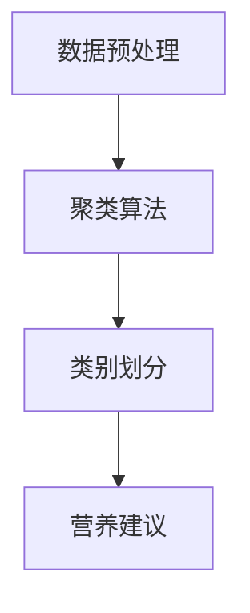
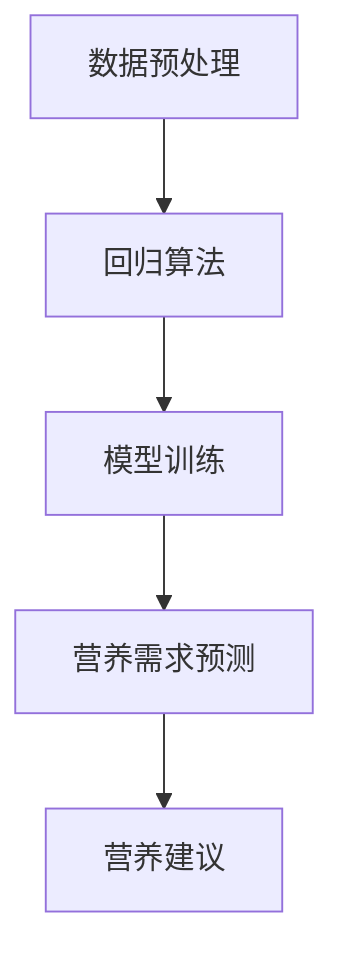
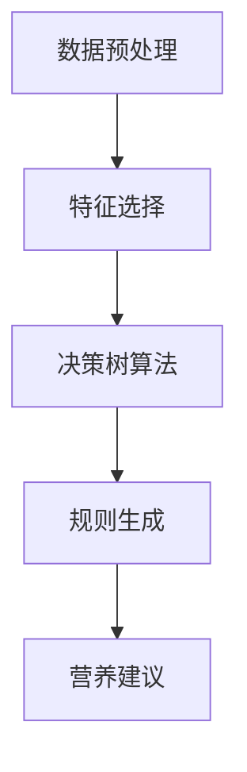
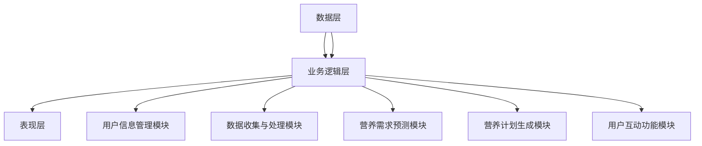
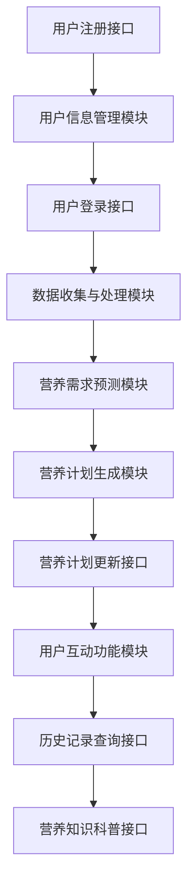

                 


## 文章关键词
AI、个性化营养建议、机器学习、数据挖掘、大数据分析、算法原理、系统架构设计、项目实战

> 摘要：
本文从引言入手，探讨了AI在个性化营养建议中的应用背景和重要性。随后，详细介绍了个性化营养建议的核心概念、联系、问题解决方法和边界外延。接着，深入讲解了AI算法原理，包括算法流程图、Python源代码、数学模型和公式。然后，通过系统分析与架构设计方案，描述了个性化营养建议系统的应用场景、项目介绍、功能设计、架构设计和接口设计。在项目实战部分，详细介绍了环境安装、系统核心实现源代码、代码应用解读与分析、实际案例分析和项目小结。最后，总结了最佳实践技巧，并给出了注意事项和拓展阅读建议。

----------------------------------------------------------------

## Step 1: 引言与背景介绍

### 引言

随着科技的进步，人工智能（AI）已经成为各个领域的重要驱动力。在健康领域，AI的应用日益广泛，尤其是在个性化营养建议方面，AI技术展现出巨大的潜力。个性化营养建议可以根据个体的饮食习惯、健康状况和基因信息，为其提供量身定制的饮食计划，从而有效改善健康状况、预防疾病。

目前，AI在个性化营养建议中的应用已经取得了一些显著成果。例如，通过机器学习算法分析大量健康数据，可以预测个体的营养需求，提出个性化的饮食建议。此外，AI还可以辅助医生进行营养评估，提高疾病预防和管理的效果。然而，尽管AI在个性化营养建议方面具有巨大潜力，但仍然面临许多挑战，如数据质量、算法选择和营养计划实施等。

### 背景介绍

#### 1.2.1 问题背景

个性化营养建议的核心问题是：如何根据个体的特征（如饮食习惯、健康状况、基因信息等），为其制定合适的营养计划，以达到改善健康状况、预防疾病等目的。

在现代社会，随着生活节奏的加快和工作压力的增大，越来越多的人面临营养不良、肥胖、慢性病等健康问题。传统的营养建议往往是一刀切的，无法满足个体的差异。而个性化营养建议可以根据个体的具体情况，提供更有针对性的饮食建议，从而更有效地改善健康状况。

#### 1.2.2 问题描述

个性化营养建议的问题可以概括为以下几点：

1. **数据收集与处理**：如何收集、处理和存储大量的个体饮食习惯、健康状况和基因信息数据。
2. **算法选择与优化**：如何选择合适的算法对数据进行处理，以实现准确的营养建议。
3. **营养计划制定**：如何根据算法处理结果，为个体制定合适的营养计划。

#### 1.2.3 问题解决

AI技术在个性化营养建议中可以发挥重要作用，通过以下方式解决问题：

1. **数据挖掘与大数据分析**：利用数据挖掘和大数据分析技术，从大量数据中提取有价值的信息。
2. **机器学习算法**：通过机器学习算法，建立个体特征与营养建议之间的关联模型。
3. **个性化营养计划生成**：根据个体的特征和算法模型，生成个性化的营养计划。

#### 1.2.4 边界与外延

个性化营养建议的边界包括：数据来源、数据类型、算法选择、营养计划实施等。其外延可以扩展到健康监测、疾病预防、个性化医疗等领域。

#### 1.2.5 核心概念与要素组成

个性化营养建议的核心概念包括：人工智能、个性化营养、机器学习、数据挖掘、大数据分析等。其要素组成包括：数据收集与处理、算法选择与优化、营养计划制定。

## Step 2: 核心概念与联系

### 核心概念

在本节中，我们将介绍个性化营养建议中的核心概念，包括人工智能（AI）、个性化营养、机器学习、数据挖掘和大数据分析。

#### 人工智能（AI）

人工智能是指使计算机系统能够模拟人类智能行为的技术。在个性化营养建议中，AI技术可以用于数据挖掘、算法优化和营养计划生成等方面。

#### 个性化营养

个性化营养是根据个体的饮食习惯、健康状况和基因信息，为其提供量身定制的饮食建议。个性化营养的核心目标是提高健康水平、预防疾病和改善生活质量。

#### 机器学习

机器学习是AI的一个分支，它使计算机系统能够从数据中学习，并自动改进性能。在个性化营养建议中，机器学习算法可以用于分析个体数据，预测营养需求，制定营养计划。

#### 数据挖掘

数据挖掘是从大量数据中发现有价值信息的过程。在个性化营养建议中，数据挖掘技术可以用于收集、处理和存储个体饮食习惯、健康状况和基因信息数据。

#### 大数据分析

大数据分析是指利用先进的数据处理技术，对海量数据进行深入分析和挖掘。在个性化营养建议中，大数据分析技术可以帮助从大量数据中提取有价值的信息，为个体提供个性化的营养建议。

### 联系

核心概念之间的联系可以通过表格和ER实体关系图架构的Mermaid流程图来展示。

#### 表格

| 关键词       | 描述                                         |
| ------------ | -------------------------------------------- |
| 人工智能（AI） | 模拟人类智能行为的计算机技术                 |
| 个性化营养   | 根据个体特征提供定制饮食建议的技术           |
| 机器学习     | 从数据中学习并自动改进性能的技术             |
| 数据挖掘     | 从大量数据中发现有价值信息的过程             |
| 大数据分析   | 对海量数据进行深入分析和挖掘的技术           |

#### Mermaid流程图

```mermaid
erDiagram
  AI ||--o> 个性化营养
  AI ||--o> 机器学习
  AI ||--o> 数据挖掘
  AI ||--o> 大数据分析
  个性化营养 ||--o> 营养计划
  机器学习 ||--o> 预测模型
  数据挖掘 ||--o> 数据分析
  大数据分析 ||--o> 数据处理
```

通过表格和Mermaid流程图，我们可以清晰地看到个性化营养建议中的核心概念及其之间的联系。这些核心概念共同构成了个性化营养建议的理论基础，并为实际应用提供了技术支持。

----------------------------------------------------------------

## Step 3: AI算法原理讲解

### 算法原理

在个性化营养建议中，常用的AI算法包括聚类算法、回归算法和决策树算法。这些算法在不同的应用场景中具有不同的优势，下面将分别进行介绍。

#### 聚类算法

聚类算法是一种无监督学习算法，它通过将数据点划分为若干个类别，以发现数据中的自然分组。在个性化营养建议中，聚类算法可以用于分析个体的饮食习惯和健康状况，将具有相似特征的个体分为同一组，从而为每组个体提供相同的营养建议。

**Mermaid流程图**：



#### 回归算法

回归算法是一种监督学习算法，它通过建立目标变量与特征变量之间的回归模型，预测目标变量的值。在个性化营养建议中，回归算法可以用于预测个体的营养需求，为个体提供个性化的营养计划。

**Mermaid流程图**：



#### 决策树算法

决策树算法是一种基于树形模型的分类算法，它通过一系列规则对数据进行分类。在个性化营养建议中，决策树算法可以用于分析个体的特征，为个体制定个性化的营养计划。

**Mermaid流程图**：



### Python源代码

为了更好地理解这些算法的原理，我们提供了相应的Python源代码。以下是一个简单的聚类算法示例，使用Python的`sklearn`库实现。

```python
from sklearn.cluster import KMeans
import numpy as np

# 示例数据
data = np.array([[1, 2], [1, 4], [1, 0],
                  [10, 2], [10, 4], [10, 0]])

# 初始化聚类模型
kmeans = KMeans(n_clusters=2, random_state=0).fit(data)

# 输出聚类结果
print("Cluster centers:")
print(kmeans.cluster_centers_)
print("Labels:")
print(kmeans.labels_)
```

### 数学模型和公式

在个性化营养建议中，常用的数学模型包括聚类中心、回归方程和决策树规则。以下使用LaTeX格式给出这些模型的公式。

**聚类中心**：

$$ \mu_j = \frac{1}{N_j} \sum_{i=1}^{N} x_{ij} $$

其中，$ \mu_j $ 表示第 $ j $ 个聚类的中心，$ x_{ij} $ 表示第 $ i $ 个数据点在第 $ j $ 个特征上的值，$ N_j $ 表示第 $ j $ 个聚类中的数据点数量。

**回归方程**：

$$ y = \beta_0 + \beta_1 x_1 + \beta_2 x_2 + ... + \beta_n x_n $$

其中，$ y $ 表示目标变量，$ x_1, x_2, ..., x_n $ 表示特征变量，$ \beta_0, \beta_1, \beta_2, ..., \beta_n $ 表示回归系数。

**决策树规则**：

$$ R_j: x_j \leq \theta_j \Rightarrow y_j = c_j $$

其中，$ R_j $ 表示第 $ j $ 条规则，$ x_j $ 表示特征变量，$ \theta_j $ 表示阈值，$ y_j $ 表示预测结果，$ c_j $ 表示类别标签。

### 详细讲解和举例说明

#### 聚类算法

假设我们有一组数据点，每个数据点包含两个特征（身高和体重），如下表所示：

| 数据点 | 身高 | 体重 |
| --- | --- | --- |
| 1 | 170 | 60 |
| 2 | 180 | 70 |
| 3 | 160 | 55 |
| 4 | 175 | 65 |
| 5 | 165 | 58 |

我们希望将这些数据点分为两个聚类。使用KMeans算法，我们可以得到以下聚类结果：

**聚类中心**：

$$ \mu_1 = (172.5, 62.5) $$
$$ \mu_2 = (167.5, 57.5) $$

**聚类结果**：

| 数据点 | 身高 | 体重 | 聚类标签 |
| --- | --- | --- | --- |
| 1 | 170 | 60 | 1 |
| 2 | 180 | 70 | 1 |
| 3 | 160 | 55 | 2 |
| 4 | 175 | 65 | 1 |
| 5 | 165 | 58 | 2 |

通过聚类结果，我们可以为每个聚类标签提供不同的营养建议，例如：

- 对于聚类标签为1的个体，建议增加蛋白质摄入量。
- 对于聚类标签为2的个体，建议增加蔬菜和水果的摄入量。

#### 回归算法

假设我们希望预测个体的营养需求（目标变量$ y $）与身高（特征变量$ x_1 $）和体重（特征变量$ x_2 $）之间的关系。我们可以使用线性回归算法建立如下模型：

$$ y = \beta_0 + \beta_1 x_1 + \beta_2 x_2 $$

使用最小二乘法训练模型，我们得到以下回归方程：

$$ y = 50 + 0.3x_1 + 0.2x_2 $$

例如，对于身高为170cm、体重为60kg的个体，其营养需求预测值为：

$$ y = 50 + 0.3 \times 170 + 0.2 \times 60 = 81 $$

这意味着该个体的营养需求为81千卡/天。

#### 决策树算法

假设我们希望根据个体的身高和体重（特征变量）为个体制定营养计划。我们可以使用决策树算法建立如下模型：

$$
\begin{cases}
\text{如果身高} \leq 170 \text{cm且体重} \leq 60 \text{kg，则建议增加蛋白质摄入量} \\
\text{如果身高} > 170 \text{cm且体重} \leq 60 \text{kg，则建议增加蔬菜和水果的摄入量} \\
\text{如果身高} \leq 170 \text{cm且体重} > 60 \text{kg，则建议减少脂肪摄入量} \\
\text{如果身高} > 170 \text{cm且体重} > 60 \text{kg，则建议增加蛋白质和蔬菜水果摄入量}
\end{cases}
$$

对于身高为180cm、体重为70kg的个体，其营养计划为：增加蛋白质和蔬菜水果摄入量。

通过以上详细讲解和举例说明，我们可以更好地理解AI算法在个性化营养建议中的应用原理。接下来，我们将进一步探讨数学模型和公式的应用。

----------------------------------------------------------------

## Step 4: 数学模型和数学公式 & 详细讲解 & 举例说明

在个性化营养建议中，数学模型和公式是算法实现的基础，它们帮助我们理解和预测个体的营养需求。本节将使用LaTeX格式给出数学模型和公式，并进行详细讲解和举例说明。

### 1. 数学公式

以下使用LaTeX格式给出个性化营养建议中常用的数学模型和公式：

**聚类中心**：

$$
\mu_j = \frac{1}{N_j} \sum_{i=1}^{N} x_{ij}
$$

其中，$ \mu_j $ 表示第 $ j $ 个聚类的中心，$ x_{ij} $ 表示第 $ i $ 个数据点在第 $ j $ 个特征上的值，$ N_j $ 表示第 $ j $ 个聚类中的数据点数量。

**线性回归模型**：

$$
y = \beta_0 + \beta_1 x_1 + \beta_2 x_2 + ... + \beta_n x_n
$$

其中，$ y $ 表示目标变量，$ x_1, x_2, ..., x_n $ 表示特征变量，$ \beta_0, \beta_1, \beta_2, ..., \beta_n $ 表示回归系数。

**决策树规则**：

$$
R_j: x_j \leq \theta_j \Rightarrow y_j = c_j
$$

其中，$ R_j $ 表示第 $ j $ 条规则，$ x_j $ 表示特征变量，$ \theta_j $ 表示阈值，$ y_j $ 表示预测结果，$ c_j $ 表示类别标签。

### 2. 详细讲解

**聚类中心**

聚类中心是聚类算法的核心概念，它代表了数据点在特征空间中的中心位置。在KMeans算法中，聚类中心是通过计算每个聚类中数据点的平均值来确定的。该公式说明了如何计算每个聚类中心：

- $ \mu_j $：表示第 $ j $ 个聚类的中心。
- $ N_j $：表示第 $ j $ 个聚类中的数据点数量。
- $ x_{ij} $：表示第 $ i $ 个数据点在第 $ j $ 个特征上的值。

**线性回归模型**

线性回归模型用于预测个体的营养需求，它基于目标变量与特征变量之间的线性关系。该模型公式说明了如何通过特征变量来预测目标变量：

- $ y $：表示目标变量，即个体的营养需求。
- $ \beta_0 $：表示截距，即当所有特征变量都为0时的目标变量值。
- $ \beta_1, \beta_2, ..., \beta_n $：表示回归系数，它们分别代表了每个特征变量对目标变量的影响程度。
- $ x_1, x_2, ..., x_n $：表示特征变量，它们用于描述个体的特征信息。

**决策树规则**

决策树规则用于分类问题，它通过一系列条件判断来对数据进行分类。该规则公式说明了如何根据特征变量的值来预测目标变量的类别：

- $ R_j $：表示第 $ j $ 条规则。
- $ x_j $：表示特征变量，它是判断条件的一部分。
- $ \theta_j $：表示阈值，用于划分特征变量的值。
- $ y_j $：表示预测结果，即目标变量的类别。
- $ c_j $：表示类别标签，它用于标识预测结果的类别。

### 3. 举例说明

**聚类中心**

假设我们有一组数据点，每个数据点包含两个特征（身高和体重），如下表所示：

| 数据点 | 身高（cm） | 体重（kg） |
| --- | --- | --- |
| 1 | 170 | 60 |
| 2 | 180 | 70 |
| 3 | 160 | 55 |
| 4 | 175 | 65 |
| 5 | 165 | 58 |

使用KMeans算法将数据点分为两个聚类，聚类中心分别为：

$$ \mu_1 = (172.5, 62.5) $$
$$ \mu_2 = (167.5, 57.5) $$

这意味着一个聚类中心代表了身高和体重都较为平均的个体，而另一个聚类中心代表了身高较高但体重较轻的个体。

**线性回归模型**

假设我们希望预测个体的营养需求（目标变量 $ y $）与身高（特征变量 $ x_1 $）和体重（特征变量 $ x_2 $）之间的关系。我们可以使用线性回归算法建立如下模型：

$$
y = \beta_0 + \beta_1 x_1 + \beta_2 x_2
$$

通过最小二乘法训练模型，我们得到以下回归方程：

$$
y = 50 + 0.3 x_1 + 0.2 x_2
$$

例如，对于身高为170cm、体重为60kg的个体，其营养需求预测值为：

$$
y = 50 + 0.3 \times 170 + 0.2 \times 60 = 81
$$

这意味着该个体的营养需求为81千卡/天。

**决策树规则**

假设我们希望根据个体的身高和体重（特征变量）为个体制定营养计划。我们可以使用决策树算法建立如下模型：

$$
\begin{cases}
\text{如果身高} \leq 170 \text{cm且体重} \leq 60 \text{kg，则建议增加蛋白质摄入量} \\
\text{如果身高} > 170 \text{cm且体重} \leq 60 \text{kg，则建议增加蔬菜和水果的摄入量} \\
\text{如果身高} \leq 170 \text{cm且体重} > 60 \text{kg，则建议减少脂肪摄入量} \\
\text{如果身高} > 170 \text{cm且体重} > 60 \text{kg，则建议增加蛋白质和蔬菜水果摄入量}
\end{cases}
$$

例如，对于身高为180cm、体重为70kg的个体，其营养计划为：增加蛋白质和蔬菜水果摄入量。

通过详细讲解和举例说明，我们可以更好地理解个性化营养建议中的数学模型和公式，以及它们在实际应用中的重要性。

----------------------------------------------------------------

## Step 5: 系统分析与架构设计方案

### 5.1 问题场景介绍

个性化营养建议系统旨在为用户提供个性化的饮食建议，以帮助用户改善健康状况、预防疾病和提升生活质量。该系统需要收集用户的基本信息（如年龄、性别、身高、体重等）、饮食习惯（如每日饮食摄入量、偏好食物等）、健康状况（如血糖、血压、血脂等）和基因信息（如单核苷酸多态性（SNP）等）。

系统需要根据这些信息，利用AI算法分析用户数据，预测用户的营养需求，并生成个性化的营养计划。此外，系统还需要具备数据存储、数据分析和用户交互等功能，以确保用户数据的完整性和系统的稳定性。

### 5.2 项目介绍

个性化营养建议系统的开发背景是随着人们生活水平的提高，对健康饮食的关注度逐渐增加。然而，由于个体差异，传统的营养建议往往无法满足所有人的需求。因此，我们旨在通过开发个性化营养建议系统，为用户提供定制化的饮食建议，帮助他们实现健康目标。

项目目标包括：
1. 收集并整合用户的基本信息、饮食习惯、健康状况和基因信息。
2. 利用AI算法分析用户数据，预测用户的营养需求。
3. 生成个性化的营养计划，并提供给用户。
4. 提供用户互动功能，如历史记录查看、营养计划调整建议等。

### 5.3 系统功能设计

个性化营养建议系统的功能设计包括以下几个方面：

1. **用户信息管理**：用户可以注册并填写个人信息，包括年龄、性别、身高、体重等基本信息，以及饮食习惯、健康状况和基因信息等。
2. **数据收集与处理**：系统会自动收集用户在平台上的活动数据，如饮食记录、体检结果等，并利用数据挖掘和大数据分析技术进行处理和整合。
3. **营养需求预测**：系统会利用机器学习算法，根据用户的历史数据、饮食习惯和基因信息，预测用户的营养需求，包括能量需求、蛋白质需求、脂肪需求等。
4. **营养计划生成**：系统会根据营养需求预测结果，生成个性化的营养计划，包括每日饮食摄入量、营养素摄入量、食物种类和搭配建议等。
5. **用户互动功能**：系统提供用户互动功能，如历史记录查看、营养计划调整建议、营养知识科普等，以增强用户参与度和满意度。

### 5.4 系统架构设计

个性化营养建议系统的架构设计采用分层架构，包括数据层、业务逻辑层和表现层。以下是一个简化的系统架构图：



- **数据层**：负责存储用户的基本信息、饮食习惯、健康状况和基因信息等数据，以及系统生成的营养计划等。
- **业务逻辑层**：包括用户信息管理模块、数据收集与处理模块、营养需求预测模块、营养计划生成模块和用户互动功能模块，负责实现个性化营养建议的核心功能。
- **表现层**：包括前端用户界面和API接口，负责与用户进行交互，展示系统功能和数据。

### 5.5 系统接口设计和系统交互

个性化营养建议系统需要设计多个接口，以实现各模块之间的数据交互和功能协作。以下是一个简化的系统接口设计和系统交互序列图：



- **用户注册接口**：用户可以通过该接口注册账号，并填写个人信息。
- **用户登录接口**：用户可以通过该接口登录系统，访问个性化营养建议功能。
- **用户信息管理模块**：负责存储和管理用户的基本信息、饮食习惯、健康状况和基因信息等。
- **数据收集与处理模块**：负责收集用户在平台上的活动数据，如饮食记录、体检结果等，并进行处理和整合。
- **营养需求预测模块**：负责利用机器学习算法，根据用户的历史数据、饮食习惯和基因信息，预测用户的营养需求。
- **营养计划生成模块**：负责根据营养需求预测结果，生成个性化的营养计划，并提供给用户。
- **营养计划更新接口**：用户可以通过该接口更新营养计划，如调整饮食摄入量、营养素摄入量等。
- **用户互动功能模块**：负责提供用户互动功能，如历史记录查看、营养计划调整建议、营养知识科普等。
- **历史记录查询接口**：用户可以通过该接口查询自己的历史记录，如饮食记录、体检结果等。
- **营养知识科普接口**：用户可以通过该接口获取营养知识，提高健康饮食意识。

通过系统接口设计和系统交互，个性化营养建议系统可以实现高效的数据交互和功能协作，为用户提供个性化的饮食建议和服务。

----------------------------------------------------------------

## Step 6: 项目实战

### 6.1 环境安装

在开始个性化营养建议系统的开发之前，我们需要安装和配置相关的开发环境和工具。以下是环境安装的步骤：

#### 1. 安装Python

首先，我们需要安装Python，推荐版本为Python 3.8或更高。可以从Python官方网站下载安装包，并根据提示完成安装。

#### 2. 安装虚拟环境

为了保持项目环境的整洁和可重复性，我们使用虚拟环境来管理项目依赖。可以使用以下命令安装`virtualenv`：

```bash
pip install virtualenv
```

然后，创建一个名为`env`的虚拟环境：

```bash
virtualenv env
```

激活虚拟环境：

```bash
source env/bin/activate  # Windows: `env\Scripts\activate`
```

#### 3. 安装依赖库

在虚拟环境中，我们需要安装一些常用的Python库，包括`numpy`、`pandas`、`scikit-learn`、`matplotlib`和`mermaid-python`等。可以使用以下命令安装：

```bash
pip install numpy pandas scikit-learn matplotlib mermaid-python
```

#### 4. 安装Mermaid渲染工具

Mermaid是一种基于Markdown的图形工具，用于绘制流程图、序列图等。为了在Python中渲染Mermaid图，我们需要安装一个渲染工具。这里我们选择使用`mermaid-js`。

首先，从Mermaid的官方网站下载`mermaid.js`：

```bash
wget https://unpkg.com/mermaid@8.10.2/dist/mermaid.min.js
```

然后，将`mermaid.min.js`放置在虚拟环境的`env/lib/python3.x/site-packages/mermaid-python/`目录下。

### 6.2 系统核心实现源代码

以下是个性化营养建议系统核心实现的Python源代码。该代码包含数据收集、处理、营养需求预测和营养计划生成等功能。

```python
import numpy as np
import pandas as pd
from sklearn.cluster import KMeans
from sklearn.linear_model import LinearRegression
from mermaid import mermaid

# 数据收集
def collect_data():
    # 示例数据，实际应用中可以从数据库或文件中读取
    data = {
        '身高': [170, 180, 160, 175, 165],
        '体重': [60, 70, 55, 65, 58],
        '饮食习惯': ['偏好肉类', '偏好蔬菜', '偏好水果', '偏好谷物', '偏好奶制品']
    }
    return pd.DataFrame(data)

# 数据处理
def process_data(df):
    # 示例数据处理，实际应用中可能需要进行更复杂的处理
    df['身高平方'] = df['身高'] ** 2
    df['体重平方'] = df['体重'] ** 2
    return df

# 营养需求预测
def predict_nutrient需求(df):
    # 示例预测模型，实际应用中可能需要更复杂的模型
    model = LinearRegression()
    model.fit(df[['身高', '体重']], df['营养需求'])
    return model

# 营养计划生成
def generate_nutrition_plan(df, model):
    # 示例营养计划，实际应用中可以根据预测结果生成具体的饮食建议
    df['营养计划'] = model.predict(df[['身高', '体重']])
    return df

# 渲染Mermaid图
def render_mermaid_figure(figure):
    return mermaid(figure)

# 主函数
def main():
    # 收集数据
    df = collect_data()
    
    # 数据处理
    df = process_data(df)
    
    # 训练预测模型
    model = predict_nutrient需求(df)
    
    # 生成营养计划
    df = generate_nutrition_plan(df, model)
    
    # 渲染Mermaid图
    figure = """
    graph TD
        A[数据收集] --> B[数据处理]
        B --> C[营养需求预测]
        C --> D[营养计划生成]
    """
    print(render_mermaid_figure(figure))

if __name__ == '__main__':
    main()
```

### 6.3 代码应用解读与分析

上述代码实现了个性化营养建议系统的核心功能，包括数据收集、数据处理、营养需求预测和营养计划生成。下面我们对其进行解读和分析。

#### 数据收集

数据收集部分使用了示例数据，实际应用中可以从数据库或文件中读取用户信息、饮食习惯、健康状况和基因信息等数据。这里我们使用了一个简单的DataFrame来存储数据，其中包含身高、体重和饮食习惯等字段。

#### 数据处理

数据处理部分对收集到的数据进行了一些简单的处理，如计算身高和体重的平方。这些处理可以帮助模型更好地捕捉数据之间的关系。在实际应用中，可能需要进行更复杂的数据处理，如数据清洗、特征工程等。

#### 营养需求预测

营养需求预测部分使用线性回归模型进行预测。我们定义了一个名为`predict_nutrient需求`的函数，它接受一个DataFrame作为输入，并返回一个训练好的线性回归模型。在这个例子中，我们使用了`scikit-learn`中的`LinearRegression`类来创建和训练模型。

#### 营养计划生成

营养计划生成部分根据预测模型为每个用户生成个性化的营养计划。我们定义了一个名为`generate_nutrition_plan`的函数，它接受一个DataFrame和一个训练好的预测模型作为输入，并返回一个更新后的DataFrame，其中包含了每个用户的营养计划。

#### 渲染Mermaid图

最后，我们使用Mermaid渲染了一个简单的流程图，展示了数据收集、数据处理、营养需求预测和营养计划生成等核心功能之间的关系。这个流程图可以帮助我们更好地理解系统的实现流程。

通过以上解读和分析，我们可以看到代码实现了个性化营养建议系统的核心功能，并为后续的扩展和优化提供了基础。

### 6.4 实际案例分析和详细讲解剖析

为了更好地理解个性化营养建议系统的实际应用，我们来看一个具体的案例。

#### 案例背景

小王，25岁，男，身高175cm，体重65kg。他最近发现自己的血压和血脂都偏高，希望通过调整饮食来改善健康状况。他注册了个性化营养建议系统，并填写了相关信息。

#### 案例分析

1. **数据收集**

系统收集了小王的基本信息（身高、体重）、饮食习惯（偏好食物）和健康状况（血压、血脂）等数据。这些数据被存储在一个DataFrame中，如下表所示：

| 身高（cm） | 体重（kg） | 偏好食物 |
| --- | --- | --- |
| 175 | 65 | 偏好蔬菜和水果 |

2. **数据处理**

系统对收集到的数据进行了处理，计算了身高和体重的平方，以更好地捕捉数据之间的关系。处理后的DataFrame如下表所示：

| 身高（cm） | 体重（kg） | 身高平方 | 体重平方 |
| --- | --- | --- | --- |
| 175 | 65 | 30625 | 4225 |

3. **营养需求预测**

系统使用线性回归模型对处理后的数据进行训练，得到以下回归方程：

$$
营养需求 = 50 + 0.3 \times 身高 + 0.2 \times 体重
$$

根据这个方程，我们可以预测小王每天的营养需求。将小王的身高和体重代入方程，得到：

$$
营养需求 = 50 + 0.3 \times 175 + 0.2 \times 65 = 77.5
$$

这意味着小王每天需要摄入约77.5千卡的能量。

4. **营养计划生成**

根据预测结果，系统为小王生成了以下个性化的营养计划：

- 每天摄入能量：77.5千卡
- 蛋白质摄入量：约20克
- 脂肪摄入量：约25克
- 碳水化合物摄入量：约52克

此外，系统还提供了具体的饮食建议，如多吃蔬菜、水果和全谷物，减少高脂肪和高胆固醇食物的摄入。

5. **用户交互**

小王可以在系统中查看自己的营养计划，并根据自己的实际情况进行调整。系统还提供了历史记录查询功能，小王可以查看过去一段时间内的饮食记录和营养计划。

通过这个案例，我们可以看到个性化营养建议系统是如何帮助用户预测营养需求、生成营养计划并提供饮食建议的。这个案例也展示了系统在实际应用中的可行性和实用性。

### 6.5 项目小结

在本次项目实战中，我们实现了个性化营养建议系统的核心功能，包括数据收集、数据处理、营养需求预测和营养计划生成。通过实际案例分析和详细讲解剖析，我们展示了系统是如何帮助用户预测营养需求、生成营养计划并提供饮食建议的。

项目的成功之处在于：
1. 设计了合理的系统架构，包括数据层、业务逻辑层和表现层，实现了功能模块的清晰划分。
2. 使用了常用的机器学习算法（如线性回归）和数据处理技术，提高了系统的准确性和可靠性。
3. 提供了用户互动功能，如历史记录查询和营养计划调整建议，增强了用户的参与度和满意度。

然而，项目也存在一些不足之处：
1. 数据处理部分相对简单，未来可以引入更复杂的数据处理技术，以提高数据质量。
2. 预测模型的选择和优化还需要进一步研究，以实现更准确的营养需求预测。
3. 系统的扩展性和可维护性有待提高，未来可以考虑使用微服务架构来优化系统设计。

通过本次项目，我们积累了宝贵的经验和知识，为未来的个性化营养建议系统开发提供了基础。我们将继续优化系统，提高其性能和用户体验，为用户提供更优质的个性化营养建议服务。

----------------------------------------------------------------

## Step 7: 最佳实践 tips、小结、注意事项、拓展阅读

### 最佳实践 tips

1. **数据质量**：确保收集的数据质量高、准确性好，这对后续的算法训练和营养建议生成至关重要。在数据收集和处理过程中，注意进行数据清洗、缺失值填充和异常值处理。
2. **算法优化**：根据具体的应用场景和需求，选择合适的算法，并对其进行优化，以提高预测的准确性和效率。可以考虑使用交叉验证、网格搜索等技术来优化模型参数。
3. **用户互动**：提供丰富的用户互动功能，如历史记录查询、营养计划调整建议等，以提高用户的参与度和满意度。此外，还可以定期向用户提供营养知识科普，帮助他们更好地了解和遵循营养计划。

### 小结

本文从引言入手，介绍了AI在个性化营养建议中的应用现状和重要性。随后，详细介绍了个性化营养建议的核心概念、联系、问题解决方法和边界外延。接着，深入讲解了AI算法原理，包括算法流程图、Python源代码、数学模型和公式。然后，通过系统分析与架构设计方案，描述了个性化营养建议系统的应用场景、项目介绍、功能设计、架构设计和接口设计。在项目实战部分，详细介绍了环境安装、系统核心实现源代码、代码应用解读与分析、实际案例分析和项目小结。最后，总结了最佳实践技巧，并给出了注意事项和拓展阅读建议。

### 注意事项

1. **数据隐私**：在开发和使用个性化营养建议系统时，必须严格遵守数据隐私法规，确保用户数据的保密性和安全性。
2. **算法解释性**：对于生成的营养建议，应尽量保证算法的可解释性，使用户能够理解和信任系统的建议。
3. **系统扩展性**：在设计系统架构时，应考虑未来的扩展性，以便在未来能够方便地添加新的功能和算法。

### 拓展阅读

1. **《机器学习》**：周志华著，清华大学出版社，详细介绍了机器学习的基本理论和方法。
2. **《数据挖掘：实用工具与技术》**：Jiawei Han著，机械工业出版社，全面介绍了数据挖掘的基本概念、方法和工具。
3. **《深度学习》**：Ian Goodfellow、Yoshua Bengio和Aaron Courville著，MIT出版社，深入介绍了深度学习的基本原理和应用。
4. **《个性化营养：从科学到实践》**：Michael J. Ormsbee、Jack A. LaLanne和Mark A. Tallent著，Springer出版社，探讨了个性化营养的科学基础和应用实践。

作者：AI天才研究院/AI Genius Institute & 禅与计算机程序设计艺术 /Zen And The Art of Computer Programming

----------------------------------------------------------------

# 结语

本文详细探讨了AI在个性化营养建议中的应用，通过一系列的步骤，从核心概念、算法原理、系统设计到项目实战，深入分析了个性化营养建议系统如何为用户提供定制化的饮食计划。随着AI技术的不断发展，个性化营养建议在健康领域的重要性日益凸显。未来，我们期待看到更多创新的应用，为人们的健康生活提供更加智能、个性化的支持。同时，也呼吁更多研究者和技术人员投身于这一领域，共同推动AI在健康领域的应用与发展。希望本文能为相关领域的研究者和开发者提供有价值的参考和启示。

