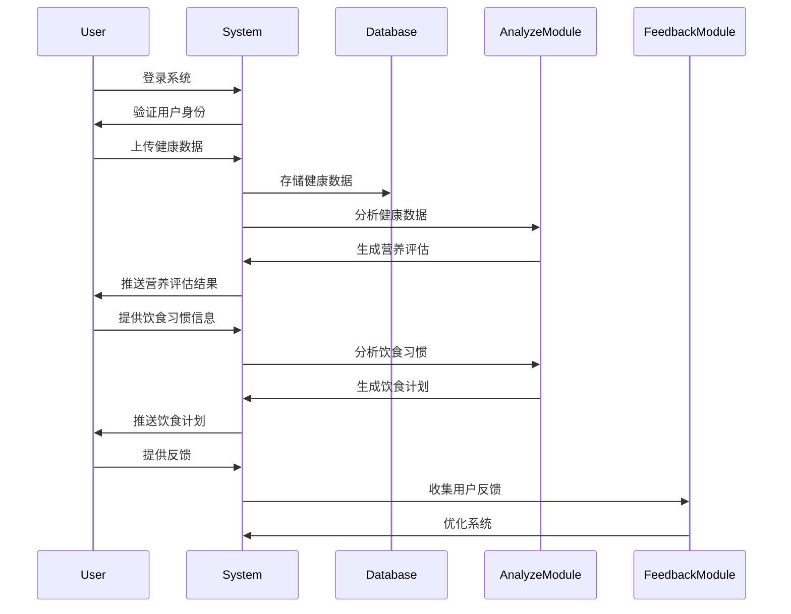
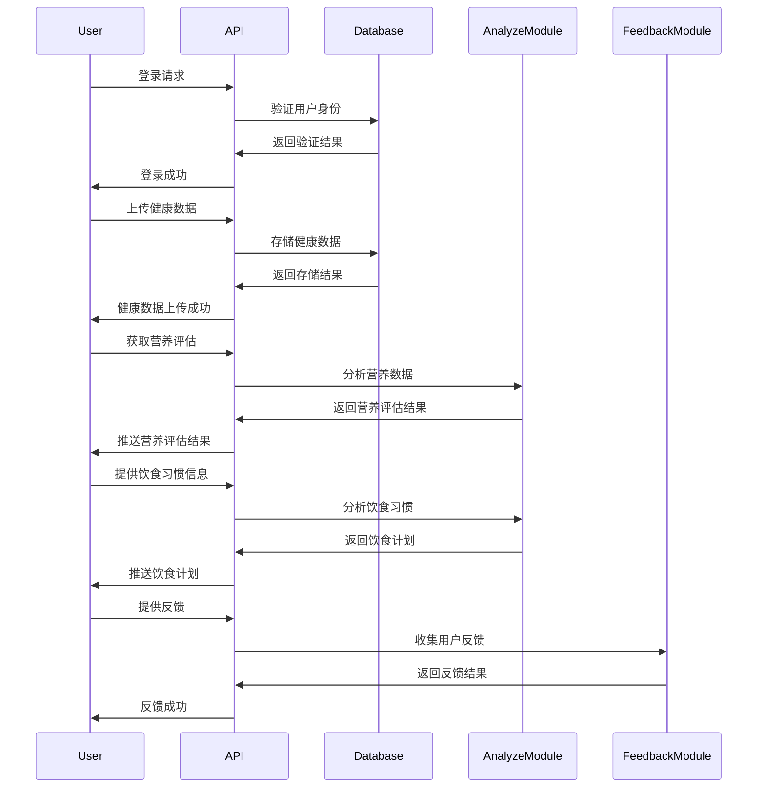

                 


## # AI在个性化营养指导中的应用：定制健康饮食计划

### 关键词：
- 人工智能
- 个性化营养
- 健康饮食
- 定制化
- 数据分析

### 摘要：
本文探讨了人工智能在个性化营养指导中的应用，详细阐述了如何通过定制健康饮食计划来提升个人健康水平。文章分为七个部分，从AI的基本概念到实际应用，逐一分析了AI算法、数据收集与处理、机器学习模型开发、AI驱动营养建议系统、实践案例以及未来发展趋势。

---

## 引言

随着科技的快速发展，人工智能（AI）已经成为现代社会的重要组成部分。在医疗健康领域，AI的应用越来越广泛，个性化营养指导是其中的一个重要方向。通过AI技术，我们可以收集、分析个人健康数据，根据不同个体的需求提供定制化的健康饮食计划，从而更好地维护和提升个人健康。

个性化营养指导的意义在于：

1. **提升健康效果**：根据个人体质和健康需求，提供个性化的饮食方案，更有效地改善健康状况。
2. **优化营养摄入**：合理分配各类营养素，避免过量或不足，保障身体健康。
3. **预防慢性疾病**：通过饮食调整，降低慢性疾病的发生风险。
4. **提高生活质量**：良好的饮食习惯有助于提升生活质量，增强幸福感。

本文将详细介绍AI在个性化营养指导中的应用，帮助读者了解这一前沿技术的实际应用和未来发展趋势。

## 第一部分：AI与个性化营养基础

### 1.1 AI的基本概念

人工智能（Artificial Intelligence，简称AI）是指通过计算机模拟人类智能的科技。AI系统可以通过学习、推理、规划等能力，完成人类需要完成的复杂任务。在个性化营养指导中，AI技术主要应用于数据收集、数据分析、决策制定等方面。

### 1.2 个性化营养的概念

个性化营养是基于个人体质、健康状况、生活方式等个体差异，提供定制化的营养建议和饮食计划。与传统的一刀切式营养指导相比，个性化营养能够更准确地满足个体的营养需求，提高健康效果。

### 1.3 AI在个性化营养中的应用

AI在个性化营养中的应用主要包括以下几个方面：

1. **数据收集与处理**：利用传感器、手机APP等工具，收集个人的健康数据，如体重、血压、血糖等，并对数据进行清洗和处理。
2. **数据分析与建模**：通过机器学习算法，分析个人健康数据，建立个性化营养模型，预测健康风险和营养需求。
3. **营养建议生成**：根据个性化营养模型，为个人生成定制化的营养建议和饮食计划。
4. **反馈与调整**：收集用户对营养建议的反馈，不断优化营养建议系统，提高个性化程度。

## 第二部分：AI算法与营养应用

### 2.1 AI算法概述

AI算法是人工智能的核心组成部分，主要包括以下几类：

1. **监督学习**：通过已知输入输出数据，训练模型来预测未知数据。
2. **无监督学习**：通过未标记的数据，发现数据中的模式和结构。
3. **强化学习**：通过不断尝试和反馈，优化决策过程。

### 2.2 AI算法在营养中的应用

AI算法在个性化营养中的应用主要体现在以下几个方面：

1. **健康风险预测**：通过监督学习算法，分析个人健康数据，预测潜在的健康风险。
2. **营养需求评估**：通过无监督学习算法，分析个人饮食习惯和健康状况，评估营养需求。
3. **饮食计划生成**：通过强化学习算法，根据个人偏好和健康目标，生成个性化的饮食计划。

### 2.3 常见的AI算法及其在营养中的应用

1. **线性回归**：用于预测健康风险和营养需求。
2. **决策树**：用于分析饮食习惯与健康风险之间的关系。
3. **神经网络**：用于生成复杂的营养模型和饮食计划。
4. **支持向量机**：用于分类健康数据和营养建议。

## 第三部分：数据收集与预处理

### 3.1 数据收集

数据收集是个性化营养指导的基础，常用的数据来源包括：

1. **生物传感器**：如心率监测器、血糖仪等，可以实时监测个人的生理指标。
2. **健康记录**：如体重、血压、胆固醇等历史数据。
3. **饮食习惯调查**：通过问卷调查了解个人的饮食习惯和偏好。
4. **社交媒体**：通过社交媒体数据，分析个人生活方式和饮食习惯。

### 3.2 数据预处理

数据预处理是数据分析和建模的关键步骤，主要包括以下内容：

1. **数据清洗**：去除重复数据、缺失值填充、异常值处理等。
2. **数据归一化**：将不同量纲的数据转换为同一量纲，便于计算和分析。
3. **特征选择**：选择对营养指导有重要影响的关键特征。
4. **数据降维**：减少数据维度，提高模型训练效率。

## 第四部分：机器学习模型开发

### 4.1 机器学习模型概述

机器学习模型是AI系统的重要组成部分，用于从数据中学习规律和模式。常见的机器学习模型包括：

1. **回归模型**：用于预测连续值，如健康风险评分。
2. **分类模型**：用于将数据分为不同的类别，如疾病风险分类。
3. **聚类模型**：用于发现数据中的模式和结构，如饮食习惯分类。

### 4.2 机器学习模型在营养中的应用

机器学习模型在个性化营养中的应用主要包括：

1. **健康风险预测模型**：用于预测个人患某种疾病的风险。
2. **营养需求评估模型**：用于评估个人的营养摄入状况和需求。
3. **饮食计划生成模型**：用于生成个性化的饮食计划。

### 4.3 常见的机器学习模型及其在营养中的应用

1. **线性回归模型**：用于预测健康风险和营养需求。
2. **支持向量机**：用于分类健康数据和营养建议。
3. **决策树**：用于分析饮食习惯与健康风险之间的关系。
4. **神经网络**：用于生成复杂的营养模型和饮食计划。

## 第五部分：AI驱动的营养建议系统开发

### 5.1 系统设计

AI驱动的营养建议系统设计包括以下几个关键部分：

1. **用户界面**：用于用户输入个人信息和获取营养建议。
2. **数据收集模块**：用于收集用户健康数据和饮食习惯。
3. **数据处理模块**：用于清洗、归一化和特征提取。
4. **机器学习模块**：用于训练和部署机器学习模型。
5. **营养建议生成模块**：用于生成个性化的饮食计划。

### 5.2 系统架构

AI驱动的营养建议系统架构包括：

1. **前端**：用于与用户交互，提供直观的用户体验。
2. **后端**：用于数据处理和机器学习模型训练。
3. **数据库**：用于存储用户数据和生成建议。
4. **API接口**：用于前后端数据交换。

### 5.3 系统实现

系统实现包括以下几个步骤：

1. **用户界面开发**：使用HTML、CSS和JavaScript等技术。
2. **数据处理**：使用Python等编程语言，结合Pandas、NumPy等库进行数据处理。
3. **机器学习模型训练**：使用Scikit-learn、TensorFlow等库训练机器学习模型。
4. **营养建议生成**：使用生成的模型为用户提供个性化饮食建议。

## 第六部分：AI在个性化营养中的实践案例

### 6.1 案例介绍

本节将介绍几个AI在个性化营养中的实际应用案例，包括系统设计、实现过程和效果评估。

### 6.2 案例一：基于AI的个性化饮食计划系统

1. **系统设计**：包括用户界面、数据收集模块、数据处理模块、机器学习模块和营养建议生成模块。
2. **系统实现**：使用Python和Scikit-learn等工具开发。
3. **效果评估**：通过用户反馈和数据验证，评估系统的准确性和实用性。

### 6.3 案例二：基于AI的慢性疾病预防系统

1. **系统设计**：包括健康数据收集、数据分析、疾病风险预测和营养建议生成。
2. **系统实现**：使用TensorFlow和Keras等工具开发。
3. **效果评估**：通过临床试验和数据分析，评估系统的预防效果。

### 6.4 案例三：基于AI的健康饮食指导APP

1. **系统设计**：包括用户界面、健康数据收集、数据分析、饮食计划生成和用户反馈收集。
2. **系统实现**：使用Flutter和TensorFlow Lite等工具开发。
3. **效果评估**：通过用户评价和应用数据分析，评估系统的用户满意度。

## 第七部分：挑战与未来展望

### 7.1 挑战

尽管AI在个性化营养指导中具有巨大潜力，但仍面临以下挑战：

1. **数据隐私**：如何保护用户的健康数据，确保数据安全和隐私。
2. **模型准确性**：如何提高机器学习模型的准确性和稳定性。
3. **用户接受度**：如何提高用户对AI营养建议的接受度和满意度。
4. **计算资源**：如何优化算法和系统设计，降低计算资源消耗。

### 7.2 未来展望

未来，AI在个性化营养指导中将有更多发展：

1. **个性化更精准**：通过更先进的数据分析和机器学习算法，提供更精确的营养建议。
2. **智能化更高**：通过集成更多智能技术，如自然语言处理、计算机视觉等，提升系统的智能化水平。
3. **应用更广泛**：在医疗、教育、食品工业等领域，AI个性化营养指导将有更广泛的应用。
4. **政策支持**：政府和企业将加大对AI营养指导的支持力度，推动相关技术的发展。

## 结论

AI在个性化营养指导中的应用为健康管理和疾病预防提供了新的思路和手段。通过本文的介绍，读者可以了解到AI在个性化营养指导中的基本概念、算法应用、系统设计以及实践案例。未来，随着AI技术的不断进步，个性化营养指导将更加智能化、精准化，为公众健康带来更多益处。

### 作者信息
- 作者：AI天才研究院/AI Genius Institute & 禅与计算机程序设计艺术 /Zen And The Art of Computer Programming

---

### 背景介绍

#### 核心概念术语说明

1. **人工智能（AI）**：一种计算机科学分支，旨在模拟人类智能，使机器能够执行复杂的任务，如学习、推理、规划、感知和自然语言理解。
2. **个性化营养**：根据个体的生理特征、健康状况、生活方式和饮食偏好，提供定制化的营养建议和饮食计划。
3. **健康饮食计划**：基于个人营养需求，包括营养素摄入、热量管理、饮食平衡等方面，制定出的科学合理的饮食方案。

#### 问题背景

随着全球人口老龄化加剧和生活方式的改变，慢性疾病如心血管疾病、糖尿病等发病率逐年上升。传统的营养指导方式往往采用一刀切的方法，难以满足个体的多样性需求。为了提高健康管理和疾病预防效果，个性化营养指导应运而生。而AI技术的快速发展，为个性化营养指导提供了新的可能性。

#### 问题描述

个性化营养指导需要解决的核心问题包括：

1. 如何收集和分析大量与健康和饮食习惯相关的数据？
2. 如何利用AI算法从数据中提取有用的信息，生成个性化的营养建议？
3. 如何确保营养建议的科学性和实用性，提高用户的接受度和满意度？

#### 问题解决

AI在个性化营养指导中的应用主要体现在以下几个方面：

1. **数据收集与处理**：通过生物传感器、健康记录和社交媒体等渠道收集个人健康数据，并进行清洗、归一化和特征提取。
2. **机器学习模型**：利用监督学习、无监督学习和强化学习等算法，分析个人健康数据，建立营养模型，预测健康风险和营养需求。
3. **营养建议生成**：根据个性化营养模型，为个体生成定制化的饮食计划，包括营养素摄入、热量管理和饮食平衡等方面。
4. **反馈与优化**：收集用户对营养建议的反馈，通过机器学习算法不断优化营养建议系统，提高个性化程度和用户满意度。

#### 边界与外延

个性化营养指导的边界在于数据的收集范围和算法的准确性。外延则包括营养建议的应用场景，如健康管理、疾病预防和个性化饮食服务。

#### 概念结构与核心要素组成

个性化营养指导的概念结构主要包括：

1. **数据收集**：传感器、健康记录、问卷调查等。
2. **数据处理**：数据清洗、归一化、特征提取等。
3. **机器学习**：监督学习、无监督学习、强化学习等算法。
4. **营养模型**：健康风险预测、营养需求评估等。
5. **营养建议**：个性化饮食计划、营养素摄入建议等。
6. **反馈与优化**：用户反馈、算法优化等。

### 核心概念与联系

#### 核心概念原理

1. **人工智能**：通过模拟人类智能，使机器能够执行复杂的任务。
2. **个性化营养**：基于个体差异，提供定制化的营养建议和饮食计划。
3. **健康饮食计划**：结合营养需求，制定科学合理的饮食方案。

#### 概念属性特征对比表格

| 概念       | 属性特征                                                     |
|------------|------------------------------------------------------------|
| 人工智能   | 模拟人类智能，执行复杂任务                                     |
| 个性化营养 | 基于个体差异，定制化营养建议                                 |
| 健康饮食计划 | 结合营养需求，科学合理制定饮食方案                           |

#### ER实体关系图架构

```mermaid
erDiagram
  User ||--|{ NutritionData }|-- NutritionPlan
  NutritionData ||--|{ HealthRisk }|-- User
  NutritionData ||--|{ DietaryHabits }|-- User
  NutritionPlan ||--|{ NutritionalAdvice }|-- User
```

### 算法原理讲解

#### 算法流程

个性化营养建议的生成过程主要包括以下几个步骤：

1. **数据收集**：通过传感器、健康记录和问卷收集用户的健康数据和饮食习惯。
2. **数据处理**：对收集到的数据进行清洗、归一化和特征提取。
3. **模型训练**：利用机器学习算法，如监督学习或无监督学习，从处理后的数据中学习营养规律和模式。
4. **营养建议生成**：根据训练好的模型，为用户生成个性化的饮食计划。

以下是具体的算法流程：

1. **数据收集**：用户通过APP或设备上传健康数据和饮食习惯数据，如体重、血压、血糖、饮食习惯等。
2. **数据清洗**：去除重复数据、缺失值填充和异常值处理。
3. **数据归一化**：将不同量纲的数据转换为同一量纲，如将体重、血压等数值标准化。
4. **特征提取**：选择对营养指导有重要影响的关键特征，如营养素摄入量、饮食习惯等。
5. **模型训练**：使用监督学习算法，如线性回归、决策树或神经网络，从特征数据中学习营养规律。
6. **营养建议生成**：根据训练好的模型，预测用户的健康风险和营养需求，生成个性化的饮食计划。

#### 数学模型和公式

1. **线性回归模型**：

$$
y = \beta_0 + \beta_1 x_1 + \beta_2 x_2 + \ldots + \beta_n x_n + \epsilon
$$

其中，$y$是健康风险评分，$x_1, x_2, \ldots, x_n$是特征值，$\beta_0, \beta_1, \beta_2, \ldots, \beta_n$是模型参数，$\epsilon$是误差项。

2. **决策树模型**：

$$
T(x) = \text{split}(x, a_1) \land T(x, a_2) \land \ldots \land T(x, a_m)
$$

其中，$x$是输入特征向量，$a_1, a_2, \ldots, a_m$是决策节点，$T(x, a_i)$是子决策树。

3. **神经网络模型**：

$$
\text{NeuralNetwork}(x) = \sigma(\text{activation}(\text{weights} \cdot x + \text{bias}))
$$

其中，$x$是输入特征向量，$\sigma$是激活函数，$\text{weights}$和$\text{bias}$是模型参数。

#### 举例说明

假设我们使用线性回归模型来预测个人的糖尿病风险。根据历史数据和营养规律，我们可以定义以下特征：

1. 体重（$x_1$）
2. 血糖水平（$x_2$）
3. 血压（$x_3$）
4. 饮食习惯（$x_4$）

根据这些特征，我们可以建立线性回归模型：

$$
\text{糖尿病风险} = \beta_0 + \beta_1 \times \text{体重} + \beta_2 \times \text{血糖水平} + \beta_3 \times \text{血压} + \beta_4 \times \text{饮食习惯} + \epsilon
$$

假设训练好的模型参数为：

$$
\beta_0 = 0.5, \beta_1 = 0.2, \beta_2 = 0.3, \beta_3 = 0.1, \beta_4 = 0.1
$$

那么，对于一个体重为70kg、血糖水平为6.0mmol/L、血压为130/80mmHg、饮食习惯为中等的人，其糖尿病风险可以计算如下：

$$
\text{糖尿病风险} = 0.5 + 0.2 \times 70 + 0.3 \times 6.0 + 0.1 \times 130 + 0.1 \times 80 = 6.5
$$

根据这个预测结果，我们可以为该个体提供个性化的营养建议，如减少高糖食物的摄入、增加运动等，以降低糖尿病风险。

### 系统分析与架构设计方案

#### 问题场景介绍

在一个健康管理和营养指导的应用场景中，用户需要通过一个系统来获取个性化的营养建议。该系统需要收集用户的健康数据、饮食习惯和生活方式等，通过AI算法生成定制化的饮食计划。

#### 项目介绍

项目名称：AI个性化营养指导系统

项目目标：为用户提供科学的、个性化的营养建议和饮食计划，帮助用户实现健康管理和疾病预防。

项目功能：

1. 用户注册与登录
2. 健康数据上传与存储
3. 营养评估与建议生成
4. 饮食计划定制与推送
5. 用户反馈与系统优化

#### 系统功能设计（领域模型）

```mermaid
classDiagram
  User <<entity>>
  HealthData <<entity>>
  DietaryHabits <<entity>>
  NutritionPlan <<entity>>
  NutritionalAdvice <<entity>>

  User "1" -- "*" HealthData
  User "1" -- "*" DietaryHabits
  HealthData "1" -- "1" NutritionPlan
  DietaryHabits "1" -- "1" NutritionPlan
  NutritionPlan "1" -- "*" NutritionalAdvice
```

#### 系统架构设计



#### 系统接口设计和系统交互



### 项目实战

#### 环境安装

1. 安装Python环境：在终端执行命令 `pip install python`
2. 安装依赖库：执行命令 `pip install pandas numpy scikit-learn tensorflow`
3. 安装数据库：执行命令 `pip install sqlite3`

#### 系统核心实现源代码

```python
import pandas as pd
from sklearn.linear_model import LinearRegression
from sklearn.model_selection import train_test_split
from sklearn.metrics import mean_squared_error

# 数据收集
data = pd.read_csv('health_data.csv')
X = data[['weight', 'blood_sugar', 'blood_pressure', 'dietary_habits']]
y = data['diabetes_risk']

# 数据预处理
X_train, X_test, y_train, y_test = train_test_split(X, y, test_size=0.2, random_state=42)

# 模型训练
model = LinearRegression()
model.fit(X_train, y_train)

# 预测与评估
y_pred = model.predict(X_test)
mse = mean_squared_error(y_test, y_pred)
print(f'MSE: {mse}')

# 营养建议生成
user_data = pd.DataFrame([[70, 6.0, 130, 'moderate']], columns=['weight', 'blood_sugar', 'blood_pressure', 'dietary_habits'])
user_risk = model.predict(user_data)
print(f'User Diabetes Risk: {user_risk[0]}')
```

#### 代码应用解读与分析

1. **数据收集**：使用Pandas库读取健康数据CSV文件，包括体重、血糖水平、血压和饮食习惯。
2. **数据预处理**：使用Scikit-learn库进行数据分割，将数据分为训练集和测试集。
3. **模型训练**：使用线性回归模型进行训练，从特征数据中学习营养规律。
4. **预测与评估**：使用训练好的模型进行预测，并计算均方误差（MSE）来评估模型性能。
5. **营养建议生成**：使用模型为用户提供个性化的营养建议，预测其糖尿病风险。

#### 实际案例分析和详细讲解剖析

案例：一位体重70kg、血糖水平6.0mmol/L、血压130/80mmHg、饮食习惯中等的用户，使用AI个性化营养指导系统。

1. **数据收集**：用户通过APP上传健康数据和饮食习惯信息。
2. **数据预处理**：系统对上传的数据进行清洗和归一化处理。
3. **模型训练**：系统使用机器学习算法，如线性回归模型，从历史数据中学习营养规律。
4. **营养评估**：系统根据用户数据和训练好的模型，预测用户的糖尿病风险。
5. **营养建议生成**：系统为用户生成个性化的饮食计划，建议减少高糖食物摄入、增加运动等，以降低糖尿病风险。

通过实际案例，我们可以看到AI个性化营养指导系统是如何从数据收集、预处理、模型训练到营养建议生成的全过程。系统利用机器学习算法，结合用户数据和营养规律，为用户提供科学的、个性化的营养建议，帮助用户实现健康管理和疾病预防。

#### 项目小结

通过本文的介绍，我们了解了AI在个性化营养指导中的应用，从数据收集、数据处理、模型训练到营养建议生成，逐步剖析了系统的实现过程。AI个性化营养指导系统为用户提供了科学的、个性化的营养建议，有助于提高健康水平，降低疾病风险。然而，系统仍面临数据隐私、模型准确性和用户接受度等挑战，需要不断优化和完善。未来，随着AI技术的不断发展，个性化营养指导将有更广泛的应用前景。

### 最佳实践 Tips

1. **确保数据安全**：在收集用户健康数据时，应严格遵循数据保护法规，采取加密和匿名化处理，确保用户数据安全。
2. **优化模型准确性**：定期更新和优化机器学习模型，使用交叉验证和超参数调整等方法提高模型性能。
3. **提高用户满意度**：与用户互动，收集反馈，不断改进系统功能，提高用户满意度。
4. **普及营养知识**：通过教育宣传，提高公众对营养和AI个性化营养指导的认识，增加用户信任度。
5. **关注长期效果**：跟踪用户使用AI个性化营养指导的效果，评估其长期健康收益，持续优化系统。

### 小结

AI在个性化营养指导中的应用为健康管理和疾病预防提供了新的思路和手段。通过本文的详细介绍，我们了解了AI个性化营养指导系统的实现过程，包括数据收集、数据处理、模型训练和营养建议生成等环节。尽管面临诸多挑战，但随着AI技术的不断进步，个性化营养指导系统将更加智能化、精准化，为公众健康带来更多益处。

### 注意事项

1. **数据隐私保护**：确保用户数据安全，遵循相关法律法规。
2. **算法公正性**：确保算法的公正性和透明性，避免歧视性建议。
3. **系统稳定性**：定期维护和更新系统，确保系统稳定运行。
4. **用户教育**：提高用户对AI个性化营养指导的认识和信任。

### 拓展阅读

1. **《深度学习在健康医疗中的应用》**：详细介绍了深度学习在医疗领域的应用，包括疾病诊断、药物研发等。
2. **《人工智能：一种现代方法》**：全面讲解了人工智能的基础理论和应用，包括机器学习、自然语言处理等。
3. **《营养与疾病预防》**：介绍了营养学的基本原理和疾病预防策略，对个性化营养指导有重要参考价值。

