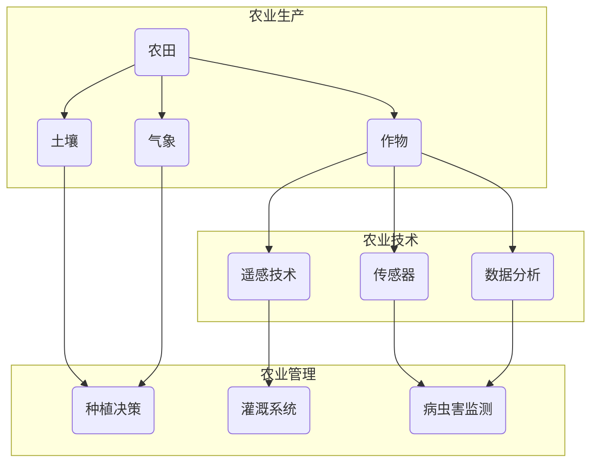
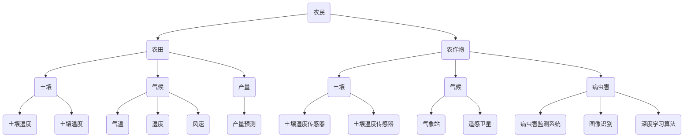
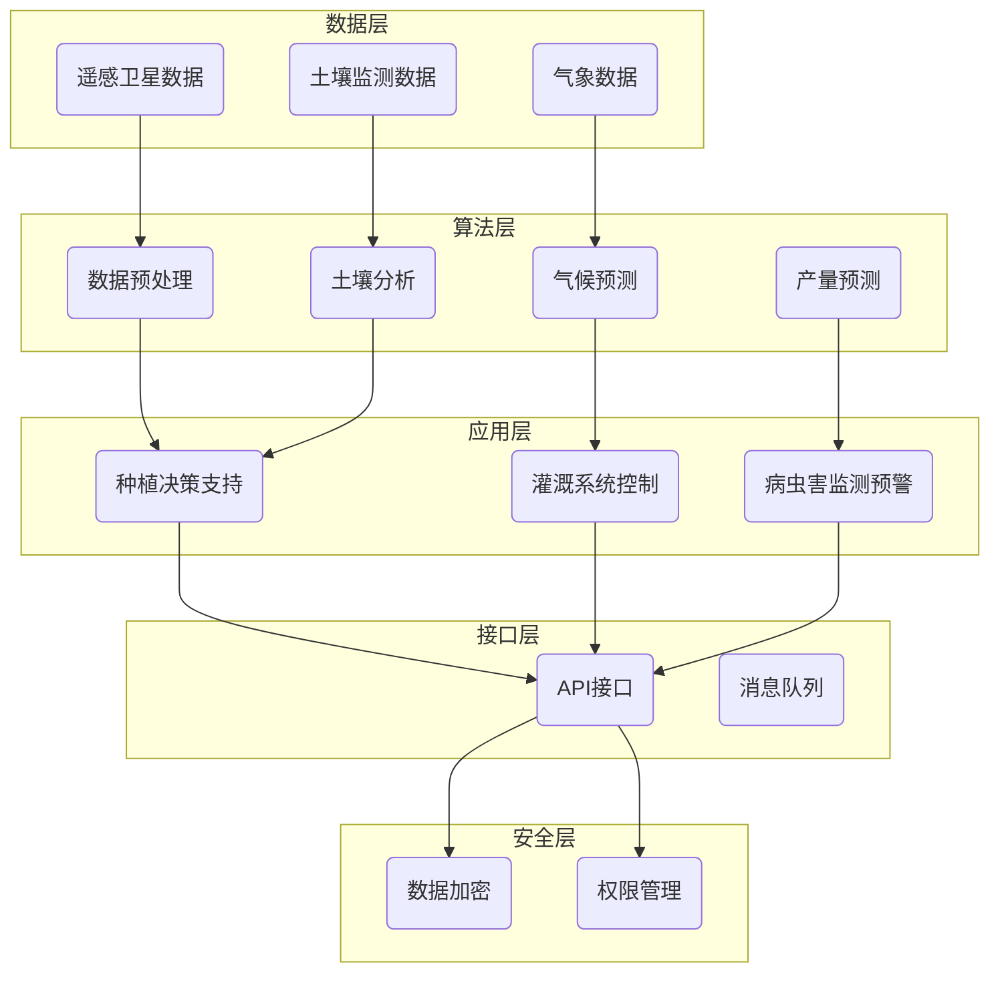
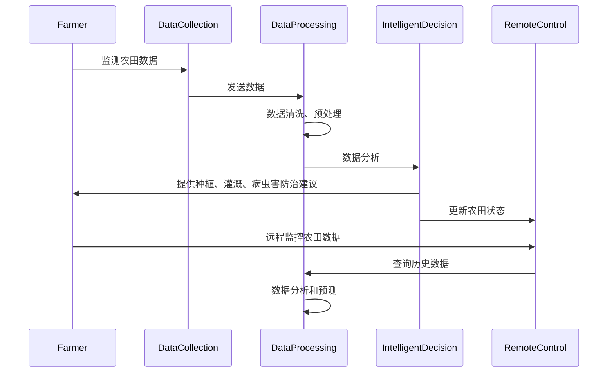
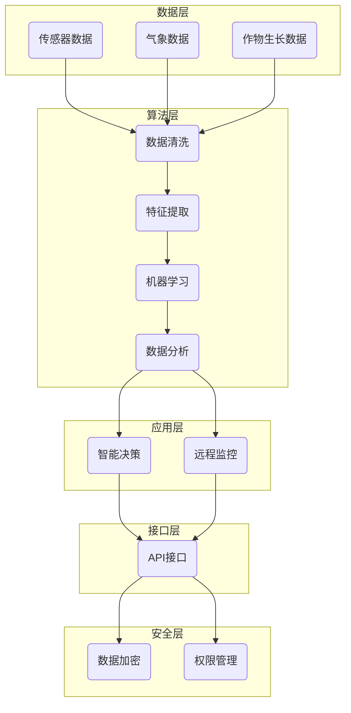

                 

### 第1章 问题背景

#### 1.1 问题背景

农业是国民经济的基础产业，它直接关系到国家的粮食安全、经济繁荣和生态平衡。在全球人口不断增长、资源日益紧张、气候变化加剧的背景下，提高农业生产效率、保障粮食安全、实现可持续发展成为各国政府和企业面临的重要挑战。

传统农业主要依赖于经验种植，依靠人工管理和经验判断，存在许多不足：

1. **资源浪费**：传统农业无法精确监测和管理土壤、水资源，导致资源浪费和环境污染。
2. **生产效率低**：缺乏科学的种植技术和管理方法，导致单位面积产量较低。
3. **环境适应能力差**：传统农业对气候变化和病虫害的应对能力较差，容易受到自然灾害的影响。

为了应对这些挑战，人工智能（AI）技术逐渐在农业中得到了广泛应用。AI技术具有数据采集、处理和分析的能力，能够通过精准农业实现农业生产的智能化、自动化和高效化。以下是对AI在农业中应用前景的简要概述：

1. **提高生产效率**：通过数据分析和智能决策，AI技术可以优化种植计划、提高产量，降低资源浪费。
2. **实现精准管理**：利用传感器和遥感技术，AI技术能够实时监测土壤、水资源和气候状况，实现精准灌溉、施肥和病虫害监测。
3. **促进可持续发展**：AI技术有助于实现农业生产的可持续性，通过优化资源利用和减少环境污染，实现绿色发展。
4. **促进农业现代化**：AI技术推动农业向现代化、智能化方向发展，提高农业的国际竞争力。

总之，AI技术在农业中的应用具有巨大的潜力，它将推动农业生产的革新，为全球粮食安全和可持续发展作出重要贡献。

#### 1.2 问题描述

农业生产中面临的主要问题包括资源浪费、生产效率低、环境适应能力差等。这些问题直接影响到农业的可持续发展和粮食安全。

1. **资源浪费**：传统农业在水资源和肥料的使用上缺乏科学管理，导致大量资源浪费。例如，农民往往依据经验来判断灌溉和施肥的时间与量，这种方法不仅难以保证作物的需求，还会导致水资源的过度消耗和肥料流失，污染环境。

2. **生产效率低**：传统农业的种植和管理方法较为粗放，缺乏精准的技术支持。例如，病虫害监测和防治往往滞后，导致作物减产和品质下降。同时，土壤管理和作物生长状态的监控也缺乏科学依据，难以实现高效的种植管理。

3. **环境适应能力差**：传统农业在应对气候变化和自然灾害方面能力较弱。例如，在干旱、洪涝等极端天气情况下，传统农业往往无法及时作出应对措施，导致作物大面积减产甚至绝收。

AI技术在农业中的应用可以解决上述问题。首先，AI技术能够通过数据采集和传感器网络，实时监测土壤湿度、气候条件等关键参数，提供精确的数据支持，帮助农民进行科学的种植决策。例如，通过遥感技术，可以监测整个农田的土壤湿度和植被状态，从而指导灌溉和施肥的时机和量。

其次，AI技术可以通过大数据分析和机器学习算法，对农业生产过程中的大量数据进行处理和分析，提供精准的种植和养殖建议。例如，通过分析气象数据、土壤数据和历史种植记录，AI系统可以预测作物生长周期、病虫害发生趋势等，帮助农民提前采取预防措施，减少损失。

此外，AI技术还可以提高农业生产的自动化水平。通过自动化设备和智能控制系统，农民可以远程监控和管理农田，实现精准灌溉、施肥和病虫害防治，从而提高生产效率和产品质量。

总的来说，AI技术在农业中的应用不仅能够提高资源利用效率，降低生产成本，还能够增强农业的可持续性和抗风险能力，为全球农业的现代化发展提供强有力的技术支撑。

#### 1.3 问题解决

AI技术在农业中的应用场景广泛，其主要优势体现在以下几个方面：

1. **数据采集与监测**：AI技术利用传感器和遥感技术，能够实时采集土壤湿度、气候条件、作物生长状态等关键数据，实现对农田的精准监测。例如，通过卫星遥感技术，可以监测大面积农田的植被状态和土壤湿度，为农民提供科学依据，指导灌溉和施肥。

2. **数据分析与决策支持**：AI技术通过大数据分析和机器学习算法，对采集到的农业生产数据进行处理和分析，提供精准的种植和养殖建议。例如，通过分析历史种植记录和气象数据，AI系统可以预测作物的生长周期和产量，帮助农民优化种植计划，提高产量。

3. **自动化控制**：AI技术可以实现农业生产的自动化控制，通过智能设备和自动化系统，提高生产效率和产品质量。例如，智能灌溉系统能够根据土壤湿度和气候条件自动调节灌溉量，减少水资源浪费；智能病虫害监测系统能够自动检测和识别病虫害，及时采取防治措施。

4. **智能预测**：AI技术能够通过数据分析和模型预测，提前预警可能发生的自然灾害和病虫害，帮助农民及时采取应对措施。例如，通过分析气象数据和土壤数据，AI系统可以预测干旱、洪涝等自然灾害的发生，提醒农民提前做好防范准备。

5. **资源优化**：AI技术有助于优化农业资源的利用，提高生产效率。通过精准施肥和灌溉，可以减少水肥资源的浪费，降低生产成本，同时减少环境污染。例如，智能灌溉系统可以根据土壤湿度和作物需求，精确调节灌溉量，避免过度灌溉和水资源浪费。

总之，AI技术在农业中的应用具有显著的优势，它通过数据采集与监测、数据分析与决策支持、自动化控制、智能预测和资源优化等多种方式，为农业生产的智能化、高效化和可持续发展提供了强有力的技术支撑。

#### 1.4 边界与外延

AI在农业中的应用范围非常广泛，涵盖了从种植到养殖、从灌溉到病虫害防治等多个环节。以下是对AI在农业中应用范围的详细描述以及其未来发展趋势：

1. **种植技术**：AI技术在种植中的应用主要包括精准播种、植株管理、病虫害监测和作物产量预测等。通过传感器和遥感技术，AI可以实时监测作物的生长状态，提供精准的播种时间和播种量，优化植株管理，减少病虫害的发生，提高作物产量。例如，利用无人机进行植被监测，可以快速识别作物健康状况，及时采取防治措施。

2. **养殖技术**：在养殖业中，AI技术主要用于精准饲养、疾病监测和环境控制。通过传感器和数据采集系统，AI可以实时监测养殖环境的温度、湿度、光照等参数，提供智能化的饲养方案，确保动物健康。同时，通过数据分析和机器学习算法，AI可以提前预警疾病的发生，降低养殖风险。

3. **灌溉技术**：精准灌溉是AI技术在农业中的重要应用之一。通过传感器和大数据分析，AI系统可以实时监测土壤湿度和气象条件，自动调节灌溉量，实现按需灌溉，提高水资源利用效率，减少浪费。例如，利用土壤湿度传感器和气象站数据，AI系统可以根据作物需水量自动控制灌溉设备，确保作物获得适宜的土壤湿度。

4. **病虫害监测**：AI技术在病虫害监测中的应用包括实时监测、预测和防治。通过摄像头、传感器和数据分析，AI可以识别病虫害的早期迹象，提前预警，并及时采取防治措施，减少损失。例如，利用无人机搭载高清摄像头，AI系统可以快速识别农作物上的病虫害，并及时通知农民进行防治。

5. **农产品质量监测**：AI技术在农产品质量监测中的应用包括农产品的外观检测、成分分析和食品安全监测等。通过图像识别和深度学习算法，AI可以实时检测农产品的外观和质量，确保农产品符合质量标准。同时，通过成分分析和食品安全监测，AI可以监控农产品的生长环境和生长过程，确保农产品的安全和品质。

未来，AI在农业中的应用将继续拓展和深化。以下是一些可能的发展趋势：

1. **智能化农场**：随着AI技术的不断进步，未来农场将实现全面智能化。从种植、养殖到灌溉、病虫害监测，各个环节都将通过AI技术实现自动化和智能化管理，提高农业生产效率和产品质量。

2. **农业物联网**：农业物联网（IoT）将整合传感器、数据和AI技术，实现农业生产的全方位监控和管理。通过物联网技术，农民可以实时获取农田的各种数据，并利用AI技术进行分析和决策，提高农业生产效率。

3. **精准农业**：精准农业将更加依赖于AI技术，通过数据分析和智能决策，实现农业生产的精细化、科学化管理，提高资源利用效率和生产效益。

4. **可持续农业**：AI技术将帮助实现农业的可持续发展，通过优化资源利用、减少环境污染和促进生态平衡，推动农业向绿色、环保方向发展。

5. **全球化农业**：随着AI技术的普及，农业将实现全球化生产和协作。通过远程监控和管理技术，农民可以跨越地域限制，实现全球范围内的农业生产和贸易，提高农业的国际竞争力。

总之，AI在农业中的应用范围广泛，且未来将继续拓展和深化。通过数据采集、处理和分析，AI技术将为农业生产的智能化、高效化和可持续发展提供强大的支持。

### 第2章 核心概念与联系

#### 2.1 核心概念原理

AI技术作为精准农业的核心驱动力，其基本原理主要体现在数据采集、处理和分析三个主要环节。首先，数据采集是通过传感器、摄像头、无人机等设备获取农田的土壤湿度、气候条件、植被状态等数据。这些数据经过预处理，如去噪、标准化等步骤，进入数据处理环节。

数据处理主要包括数据清洗、特征提取和模式识别等步骤。数据清洗是为了去除错误和异常数据，提高数据的准确性和可靠性。特征提取是将原始数据转换为有用的特征向量，为后续的机器学习模型提供输入。模式识别是通过机器学习算法，如决策树、支持向量机、神经网络等，从数据中提取规律和模式，从而实现对作物生长状态的预测和决策支持。

在精准农业中，AI技术的应用体现在多个方面。首先，利用遥感技术和传感器网络，可以对大面积农田进行实时监测，获取高精度的土壤和气象数据。这些数据通过大数据分析和机器学习算法，可以预测作物的生长周期、产量、病虫害发生趋势等，为农民提供科学的种植决策。其次，AI技术可以实现农业生产的自动化控制，如智能灌溉系统可以根据土壤湿度自动调节灌溉量，减少水资源浪费。此外，AI技术还可以提高病虫害监测的精度和效率，通过图像识别和深度学习算法，快速识别病虫害，及时采取防治措施。

精准农业的定义可以理解为利用现代信息技术，如传感器、GPS、GIS、大数据和人工智能，对农田进行精细化管理，以实现资源高效利用、生产效率提升和农产品质量保障。其核心目标是提高单位面积产量，降低生产成本，减少资源浪费，同时保障农业的可持续发展。

总的来说，AI技术在精准农业中的应用不仅提高了农业生产的智能化水平，还为实现农业的精准管理和可持续发展提供了强有力的技术支持。通过数据采集、处理和分析，AI技术可以帮助农民做出更加科学的决策，优化农业生产过程，从而推动农业现代化和可持续发展。

#### 2.2 概念属性特征对比表格

| 概念  | 定义                                                         | 特点                                                                 | 应用                                                                                   |
| ----- | ------------------------------------------------------------ | -------------------------------------------------------------------- | ------------------------------------------------------------------------------------- |
| 人工智能（AI） | 人工智能是指使计算机具备人类智能特性，能够执行认知任务的技术。 | 自动化、自我学习和决策能力。                                           | 自动化生产、智能客服、图像识别、自然语言处理。                                   |
| 精准农业     | 精准农业是利用现代信息技术和智能设备，对农业生产进行精细化管理。 | 实时监测、自动化控制和数据驱动决策。                                   | 种植规划、精准灌溉、病虫害监测、智能养殖。                                       |
| 遥感技术     | 遥感技术是通过传感器和卫星等设备，从远处获取地球表面信息。       | 大范围数据采集、高分辨率图像分析。                                     | 农田监测、作物生长状态评估、资源管理。                                             |
| 数据分析     | 数据分析是指从大量数据中提取有用信息和知识的过程。               | 描述性分析、诊断性分析、预测性分析和规范性分析。                         | 业务决策支持、市场预测、风险控制。                                                |
| 自动化控制   | 自动化控制是通过计算机系统和智能设备，对生产过程进行自动调节。     | 实时监测、精准控制和高效管理。                                         | 工业生产、智能家居、交通管理。                                                     |

#### 2.3 ER实体关系图架构



#### 2.4 AI与精准农业的关系

人工智能（AI）在精准农业中的应用，是现代农业技术发展的重要里程碑。AI与精准农业的关系可以看作是“工具与工艺”的结合，AI为精准农业提供了强大的技术支持，而精准农业则为AI在农业领域的应用提供了广阔的实践场景。

首先，AI技术在精准农业中的核心作用主要体现在以下几个方面：

1. **数据采集与处理**：AI通过传感器网络和遥感技术，可以高效、准确地采集农田土壤、气象和作物生长状态等关键数据。这些数据经过AI处理，能够提取出有用的特征信息，为农业生产提供科学依据。

2. **智能决策支持**：AI通过机器学习和大数据分析，对采集到的数据进行分析，提供精准的种植决策、灌溉策略、病虫害防治方案等。这种智能化的决策支持，可以大幅提高农业生产效率，减少资源浪费。

3. **自动化控制**：AI技术可以实现农业生产的自动化控制，例如智能灌溉系统可以根据土壤湿度自动调节灌溉量，减少水资源浪费。同样，智能病虫害监测系统可以自动识别病虫害，及时采取防治措施，减少损失。

其次，精准农业为AI在农业领域的应用提供了丰富的实践场景。精准农业的目标是实现农业生产的精细化管理，这需要大量的数据采集、处理和分析。而AI技术在这些环节中发挥了至关重要的作用：

1. **资源优化**：精准农业通过AI技术，能够实现对水、肥、光等资源的优化配置，提高资源利用效率，减少浪费。

2. **可持续发展**：AI技术有助于实现农业的可持续发展，通过数据分析和智能决策，可以减少化肥、农药的使用，降低对环境的影响。

3. **提高产量和质量**：精准农业通过AI技术的应用，可以实现作物产量的稳定增长和农产品品质的提升，满足人们对食品质量的需求。

总之，AI与精准农业的关系是相辅相成的。AI为精准农业提供了强大的技术支持，而精准农业则为AI在农业领域的应用提供了广阔的实践场景。通过两者的结合，现代农业将实现从传统经验农业向智能化、数据驱动农业的转型，为全球粮食安全和可持续发展做出重要贡献。

### 第3章 数据采集与处理

#### 3.1 数据采集技术

在精准农业中，数据采集是整个系统的基础，数据的质量和准确性直接影响着后续的数据处理和决策支持。数据采集技术主要包括遥感技术、土壤监测设备和气象监测设备。

1. **遥感技术**：遥感技术是通过卫星和无人机等设备，从远处获取农田的图像和地理信息数据。遥感技术具有大范围、高分辨率的特点，可以实时监测农田的植被状态、土壤湿度、气候条件等。常见的遥感技术包括光学遥感、雷达遥感和多光谱遥感等。

   - **光学遥感**：利用可见光和近红外波段，获取农田的反射光谱信息，适用于植被状态监测和作物生长分析。
   - **雷达遥感**：利用微波信号穿透云层和地表，获取农田的地面信息，适用于土壤湿度、地表水分含量等监测。
   - **多光谱遥感**：结合多个波段的信息，提供更全面的地表特征数据，适用于不同作物和生长阶段的监测。

2. **土壤监测设备**：土壤监测设备用于实时监测农田土壤的物理和化学特性，如土壤湿度、温度、pH值、有机质含量等。常见的土壤监测设备包括土壤湿度传感器、土壤温度传感器和土壤电导率传感器。

   - **土壤湿度传感器**：用于测量土壤中的水分含量，常见类型包括电容式传感器和电阻式传感器。
   - **土壤温度传感器**：用于测量土壤的温度，常见类型包括热敏电阻和热电偶。
   - **土壤电导率传感器**：用于测量土壤的盐分含量和养分状况，常见类型包括电导传感器和电阻传感器。

3. **气象监测设备**：气象监测设备用于监测农田的气象条件，如温度、湿度、风速、降水量等。这些数据对于精准灌溉、病虫害防治和作物生长预测具有重要意义。

   - **温度传感器**：用于测量农田表面的温度，常见类型包括热电偶和热敏电阻。
   - **湿度传感器**：用于测量空气和土壤的湿度，常见类型包括电容式传感器和电阻式传感器。
   - **风速传感器**：用于测量农田的风速，常见类型包括热线风速仪和超声风速仪。
   - **降水量传感器**：用于测量农田的降水量，常见类型包括雨量计和超声波雨量计。

通过这些数据采集技术，可以全面、准确地获取农田的各类信息，为精准农业提供可靠的数据支持。同时，这些数据还可以通过远程监控系统实时传输到数据中心，进行进一步的数据处理和分析。

#### 3.2 数据处理方法

在精准农业中，数据处理是关键环节，其目的是从原始数据中提取有用信息，支持农业生产决策。数据处理方法主要包括数据清洗与预处理、数据分析工具和方法等。

1. **数据清洗与预处理**：数据清洗是为了去除数据中的错误、异常和冗余信息，提高数据的质量和可靠性。预处理则是将原始数据转换为适合分析的形式，主要包括以下步骤：

   - **数据去噪**：通过滤波算法去除数据中的噪声，提高数据的准确性。
   - **数据标准化**：将不同来源的数据进行归一化处理，使其在同一尺度上进行比较。
   - **数据转换**：将不同类型的数据转换为统一的格式，如将图像数据转换为矩阵数据。
   - **缺失值处理**：对于缺失的数据，采用插值法、均值填充法或模型预测法进行补全。

2. **数据分析工具和方法**：数据分析是利用统计方法、机器学习和深度学习算法，从数据中提取有价值的信息。常用的数据分析工具和方法包括：

   - **统计分析**：通过描述性统计和推断性统计，对数据进行初步分析，提取基本特征和趋势。常用的统计方法包括均值、方差、相关性分析和回归分析等。
   - **机器学习**：通过训练模型，对数据进行分类、聚类和预测。常用的机器学习方法包括决策树、支持向量机、神经网络和随机森林等。
   - **深度学习**：利用神经网络模型，对大量数据进行自动特征提取和分类。常用的深度学习方法包括卷积神经网络（CNN）、循环神经网络（RNN）和生成对抗网络（GAN）等。

3. **数据处理流程**：

   - **数据收集**：从传感器、气象站和遥感设备等渠道收集原始数据。
   - **数据存储**：将收集到的数据存储在数据库或数据湖中，便于管理和查询。
   - **数据清洗与预处理**：对数据进行去噪、标准化和缺失值处理，提高数据质量。
   - **数据建模**：利用统计方法和机器学习算法，对数据进行建模和分析，提取有用信息。
   - **模型评估与优化**：通过交叉验证和性能评估，优化模型参数，提高模型预测精度。
   - **数据可视化**：通过数据可视化工具，将分析结果以图表、地图等形式展示，便于理解和决策。

通过上述数据处理方法，精准农业可以实现对农田的全面监控和科学管理，提高农业生产效率，减少资源浪费，实现农业的可持续发展。

### 第4章 精准种植技术

#### 4.1 精准种植概述

精准种植是一种利用现代信息技术和智能设备，对农业生产过程进行精细化管理的方法。它通过数据采集、处理和分析，实现对作物生长状态的实时监控和精准调控，从而提高产量、质量和资源利用效率。精准种植的核心目标是减少资源浪费，提高生产效率和农产品品质。

精准种植的优势主要体现在以下几个方面：

1. **提高产量**：通过实时监测土壤湿度、气候条件和作物生长状态，农民可以及时调整种植策略，如播种量、灌溉时间和施肥量，从而提高作物产量。

2. **减少资源浪费**：精准种植通过按需灌溉、科学施肥和精准防治病虫害，减少了水、肥和农药的浪费，提高了资源利用效率。

3. **提升农产品品质**：精准种植可以确保作物在最佳的生长条件下生长，从而提高农产品的品质和营养价值。

4. **降低生产成本**：通过自动化设备和智能控制系统，精准种植可以减少人力成本，提高生产效率，从而降低生产成本。

5. **增强环境可持续性**：精准种植通过减少化肥和农药的使用，降低对环境的污染，实现了农业的可持续发展。

精准种植的主要方法包括：

1. **数据采集**：通过传感器和遥感技术，实时监测农田土壤湿度、气象条件和作物生长状态。

2. **数据处理**：利用大数据分析和机器学习算法，对采集到的数据进行处理和分析，提取有用的信息。

3. **决策支持**：根据数据分析结果，提供精准的种植决策，如播种量、灌溉时间和施肥量等。

4. **自动化控制**：通过智能设备和自动化系统，实现按需灌溉、施肥和病虫害防治，提高生产效率。

5. **监测与反馈**：通过实时监测系统，对农业生产过程进行监控，及时调整种植策略，确保作物在最佳条件下生长。

总的来说，精准种植技术为农业生产带来了革命性的变化，它通过数据驱动和智能化管理，提高了农业生产的效率和可持续性，为全球粮食安全和环境保护做出了重要贡献。

#### 4.2 种植技术

精准种植技术通过多种先进的方法和技术，实现了农业生产的精细化管理和优化。以下是几种主要的精准种植技术：

1. **精准播种**：精准播种是精准种植的基础，通过精确控制播种量和播种时间，确保作物在最佳条件下生长。具体方法包括：

   - **播种量控制**：利用播种机配备的传感器，根据土壤湿度、气候条件和作物需肥量，精确调整播种量，确保播种均匀。
   - **播种时间优化**：通过气象数据和土壤数据，结合作物的生长周期和最佳播种期，确定最适宜的播种时间，提高出苗率和生长速度。

2. **土壤管理**：土壤管理是精准种植的核心，通过实时监测土壤的物理和化学特性，实现科学的土壤管理。

   - **土壤湿度监测**：利用土壤湿度传感器，实时监测土壤湿度，确保作物根系得到充足的水分，避免过度灌溉或干旱。
   - **土壤养分监测**：通过土壤养分传感器，监测土壤中的氮、磷、钾等养分含量，科学施肥，提高肥料利用效率。
   - **土壤pH监测**：利用pH传感器，监测土壤的酸碱度，调整施肥策略，优化土壤环境。

3. **灌溉技术**：精准灌溉是提高水资源利用效率的关键，通过智能灌溉系统，实现按需灌溉，减少水资源浪费。

   - **智能灌溉系统**：利用土壤湿度传感器和气象数据，智能灌溉系统可以实时监控农田土壤湿度，根据作物的需水量自动调节灌溉量，确保土壤湿度保持在适宜范围内。
   - **滴灌技术**：滴灌技术是一种高效的灌溉方式，通过将水直接输送到作物根部，减少水的蒸发和渗漏，提高灌溉效率。

4. **施肥技术**：精准施肥通过实时监测土壤养分和作物需肥量，实现科学施肥，减少化肥浪费。

   - **智能施肥系统**：智能施肥系统可以根据土壤养分传感器和作物生长状态传感器，实时调整施肥量和施肥频率，确保作物在生长过程中获得充足的养分。
   - **精准施肥**：通过无人机或施肥机器人，将肥料直接施用到作物根部，减少肥料的流失和环境污染。

5. **病虫害防治**：病虫害防治是确保作物健康生长的重要环节，精准种植技术通过实时监测和智能预测，实现及时、高效的病虫害防治。

   - **智能监测系统**：利用图像识别和传感器技术，智能监测系统可以实时监测作物病虫害的发生情况，快速识别病虫害类型，及时通知农民采取防治措施。
   - **精准防治**：通过无人机或施肥机器人，使用农药喷雾器精准喷洒农药，降低农药用量，减少对环境和人畜的影响。

总的来说，精准种植技术通过数据采集、处理和分析，实现了农业生产的精细化、智能化管理，为提高作物产量、质量和资源利用效率提供了强有力的技术支持。

### 第5章 精准养殖技术

#### 5.1 精准养殖概述

精准养殖是一种利用现代信息技术和智能设备，对养殖业进行精细化管理的方法。它通过实时监测养殖环境、动物健康和行为，提供科学的管理决策，以提高养殖效率、减少资源浪费和提升动物福利。精准养殖的目标是实现高效、环保、可持续的养殖模式。

精准养殖的优势主要包括：

1. **提高养殖效率**：通过实时监测养殖环境参数（如温度、湿度、光照等）和动物健康状况，精准养殖可以优化养殖过程，提高饲料利用率和动物生长速度。

2. **减少资源浪费**：精准养殖通过自动化设备和智能控制系统，可以实现精准的饲料供应、水温和光照调节，减少资源的浪费。

3. **提高动物福利**：精准养殖通过实时监测动物行为和健康状况，可以及时采取干预措施，减少动物的不适和疾病发生，提高动物福利。

4. **降低养殖成本**：通过自动化设备和智能管理，精准养殖可以减少人力投入，降低养殖成本。

5. **促进可持续发展**：精准养殖通过优化养殖过程和资源利用，减少环境污染，促进农业的可持续发展。

精准养殖的主要方法包括：

1. **环境监测**：通过传感器网络，实时监测养殖环境的温度、湿度、光照和空气质量等参数，确保养殖环境适宜。

2. **动物行为监测**：利用摄像头和传感器，实时监测动物的行为，如活动量、进食情况等，分析动物的健康状态。

3. **健康状况监测**：通过生物传感器和智能诊断系统，实时监测动物的健康状况，如体温、心率、呼吸频率等，及时发现疾病症状。

4. **饲料管理**：通过智能饲料投放系统，根据动物的营养需求和生长阶段，实现精准的饲料供应，提高饲料利用率。

5. **自动化控制**：利用自动化设备和智能控制系统，实现养殖环境的自动调节和养殖过程的自动化管理，提高生产效率。

6. **数据分析和决策支持**：通过大数据分析和机器学习算法，对监测数据进行分析和预测，提供科学的管理决策，优化养殖过程。

总的来说，精准养殖技术通过数据驱动和智能化管理，实现了养殖过程的精细化、智能化，为提高养殖效率、减少资源浪费和提升动物福利提供了有力支持。

#### 5.2 养殖技术

精准养殖技术通过多种先进的方法和技术，实现了对养殖过程的全面监控和智能化管理。以下是几种主要的精准养殖技术：

1. **饲料管理**：饲料管理是精准养殖的核心，通过智能饲料投放系统，实现精准的饲料供应，提高饲料利用效率。

   - **智能饲料投放系统**：该系统利用传感器和智能算法，根据动物的营养需求和生长阶段，自动调节饲料的投放量和频率，确保动物获得充足的营养。
   - **自动喂食机器人**：自动喂食机器人可以根据动物的进食习惯和活动情况，定时、定量地投放饲料，减少饲料浪费。

2. **温湿度控制**：温湿度是影响动物生长的重要因素，通过智能控制系统，实现温湿度的自动调节，保持养殖环境适宜。

   - **智能温湿度传感器**：通过实时监测养殖环境的温度和湿度，智能控制系统可以自动开启或关闭加热和降温设备，确保养殖环境稳定。
   - **环境控制系统**：环境控制系统包括加热器、风扇、加湿器等设备，可以自动调节养殖环境，维持适宜的温度和湿度。

3. **疾病监测**：疾病监测是保障动物健康的重要环节，通过生物传感器和智能诊断系统，实现疾病的早期发现和预警。

   - **生物传感器**：生物传感器可以实时监测动物的体温、心率、呼吸等生理参数，及时发现异常情况。
   - **智能诊断系统**：智能诊断系统利用大数据分析和机器学习算法，对监测数据进行综合分析，提供疾病诊断和预警。

4. **活动监测**：活动监测通过摄像头和传感器，实时监测动物的活动情况，分析动物的行为模式，判断动物的健康状态。

   - **活动监测系统**：活动监测系统利用图像识别和运动分析技术，对动物的活动情况进行实时监测和分析，识别异常行为。
   - **智能行为分析**：智能行为分析可以识别动物的行为模式，如活动量、进食习惯、休息时间等，为养殖管理提供科学依据。

5. **水质监测**：水质监测是保障动物健康的重要环节，通过传感器实时监测水质的各项指标，如pH值、氨氮、溶解氧等。

   - **水质传感器**：水质传感器可以实时监测水质的各项指标，及时发现水质异常，保障水质稳定。
   - **智能水质控制系统**：智能水质控制系统可以根据水质监测数据，自动调节水处理设备，保持水质适宜。

6. **环境消毒**：环境消毒是预防疾病传播的重要措施，通过自动消毒系统，实现养殖环境的定期消毒。

   - **自动消毒机器人**：自动消毒机器人可以利用紫外线、臭氧等技术，对养殖环境进行定期消毒，减少细菌和病毒传播。
   - **智能消毒系统**：智能消毒系统可以根据动物舍内的空气质量、温度和湿度等参数，自动启动消毒设备，提高消毒效果。

总的来说，精准养殖技术通过实时监测和智能化管理，实现了养殖过程的精细化和高效化，为提高养殖效率、保障动物健康和减少资源浪费提供了有力支持。

### 第6章 精准灌溉技术

#### 6.1 精准灌溉概述

精准灌溉是一种利用现代信息技术和智能设备，根据作物实际需水量进行精准灌溉的方法。它通过实时监测土壤湿度、气候条件、作物生长状态等参数，动态调节灌溉量，实现水资源的合理利用和高效管理。精准灌溉的目标是提高灌溉效率、减少水资源浪费和保障农作物健康生长。

精准灌溉的优势主要体现在以下几个方面：

1. **提高水资源利用效率**：精准灌溉系统可以根据土壤湿度、作物需水量等参数，自动调节灌溉量，确保作物得到适宜的水分，避免水资源的浪费。

2. **减少环境污染**：通过科学合理地灌溉，可以减少过量灌溉导致的化肥、农药流失，降低对土壤和水源的污染。

3. **提高作物产量和质量**：精准灌溉确保作物在最佳的水分条件下生长，有助于提高作物的产量和品质。

4. **降低生产成本**：精准灌溉系统通过自动化控制，减少了人力投入和灌溉设备的使用，降低了生产成本。

5. **增强农业可持续性**：精准灌溉有助于实现农业的可持续发展，通过优化水资源利用，减少对环境的负面影响。

精准灌溉的主要方法包括：

1. **土壤湿度监测**：通过土壤湿度传感器，实时监测农田土壤湿度，为灌溉决策提供数据支持。

2. **气候监测**：通过气象传感器，监测气温、湿度、风速、降水量等气候参数，预测灌溉需求。

3. **作物需水量计算**：根据土壤湿度、气候条件和作物生长周期，计算作物的需水量，制定灌溉计划。

4. **智能灌溉系统**：利用智能控制器和灌溉设备，根据土壤湿度和作物需水量，自动调节灌溉量。

5. **数据分析和决策支持**：通过大数据分析和机器学习算法，对监测数据进行分析和预测，优化灌溉策略。

总的来说，精准灌溉技术通过数据驱动和智能化管理，实现了农业灌溉的精细化和高效化，为提高水资源利用效率、减少环境污染和保障农作物健康生长提供了有力支持。

#### 6.2 精准灌溉技术

精准灌溉技术是现代农业发展的重要方向，它通过实时监测农田土壤湿度、气候条件和作物需水量，动态调整灌溉策略，实现水资源的高效利用和农业生产的可持续发展。以下是几种主要的精准灌溉技术：

1. **土壤湿度监测**：

   - **土壤湿度传感器**：土壤湿度传感器是精准灌溉系统的核心组件，通过实时监测土壤湿度，为灌溉决策提供数据支持。常见的土壤湿度传感器包括电容式传感器、电阻式传感器和微波传感器等。
   - **多点监测**：为了提高监测精度，通常在农田的不同位置布置多个传感器，通过数据采集系统，将各个传感器的数据传输到中心控制系统，进行综合分析。

2. **气候监测**：

   - **气象传感器**：气象传感器用于监测农田周围的气候条件，如气温、湿度、风速、降水量等。这些数据对于预测作物需水量和调整灌溉策略至关重要。
   - **遥感技术**：通过遥感技术，可以获取大范围农田的气候数据，结合地面监测数据，实现全方位的气候监测。

3. **作物需水量计算**：

   - **作物需水量模型**：作物需水量取决于多种因素，包括土壤湿度、气温、湿度、作物类型和生长阶段等。通过建立作物需水量模型，可以计算不同条件下的作物需水量，为灌溉策略提供科学依据。
   - **动态调整**：根据实时监测数据和作物需水量模型，动态调整灌溉策略，确保作物在最佳的水分条件下生长。

4. **智能灌溉系统**：

   - **智能控制器**：智能控制器是精准灌溉系统的核心，通过接收土壤湿度、气候条件和作物需水量等数据，自动调节灌溉设备，实现按需灌溉。
   - **自动化灌溉设备**：常见的自动化灌溉设备包括滴灌系统、喷灌系统和微灌系统等，这些设备可以根据智能控制器的指令，自动调节灌溉量和灌溉时间。

5. **数据分析和决策支持**：

   - **大数据分析**：通过对大量历史数据进行大数据分析，可以识别作物生长规律、气候模式和灌溉需求趋势，优化灌溉策略。
   - **机器学习算法**：利用机器学习算法，对监测数据进行训练和预测，提高灌溉系统的智能化水平，实现更精准的灌溉。

6. **水资源管理**：

   - **水资源优化**：通过精准灌溉技术，优化水资源利用，减少水资源浪费，提高灌溉效率。
   - **水循环利用**：通过水循环利用技术，如雨水收集、中水和再生水利用等，实现水资源的可持续利用。

总的来说，精准灌溉技术通过数据采集、处理和分析，实现了农业灌溉的智能化和精细化，为提高水资源利用效率、减少环境污染和保障农作物健康生长提供了强有力的技术支持。

#### 6.3 灌溉系统设计

灌溉系统设计是精准农业中至关重要的一环，其目的是通过科学合理的设计，实现水资源的有效利用和农业生产的可持续发展。以下是灌溉系统设计的几个关键步骤和要点：

1. **需求分析**：

   - **水资源评估**：首先需要评估农田的水资源状况，包括地下水位、水质和灌溉水源等。了解水资源的基础情况，为后续设计提供依据。
   - **作物需水量**：根据作物的生长周期、种植面积和种植密度，计算作物的需水量。这是灌溉系统设计的核心参数，直接影响灌溉系统的规模和设计。

2. **灌溉模式选择**：

   - **灌溉模式**：常见的灌溉模式包括滴灌、喷灌、微灌和漫灌等。选择合适的灌溉模式，需要考虑作物的需水特性、土壤类型、水源条件和地形地貌。
   - **技术优势**：不同灌溉模式各有优缺点，例如滴灌节水高效，但设备成本较高；喷灌适用于大面积农田，但水资源利用效率相对较低。根据实际情况，选择最优的灌溉模式。

3. **系统组成设计**：

   - **水源工程**：包括水源地建设、取水设备、储水设施和输水管道等。设计合理的水源工程，确保灌溉用水的供应稳定。
   - **灌溉设备**：根据所选的灌溉模式，选择合适的灌溉设备，如滴灌管、喷灌头、水泵等。确保设备的质量和可靠性，提高灌溉系统的运行效率。
   - **控制与监测系统**：设计智能化的控制与监测系统，包括传感器、控制器和远程监控系统等。通过实时监测土壤湿度、气候条件和作物需水量，实现智能灌溉和精准调控。

4. **灌溉策略制定**：

   - **灌溉计划**：根据作物生长周期、土壤湿度和气候条件，制定科学的灌溉计划。确保作物在生长的关键期得到充足的水分。
   - **灌溉频率**：合理设置灌溉频率，避免频繁灌溉导致土壤板结和水资源浪费。根据土壤湿度传感器和气候预测数据，动态调整灌溉频率。

5. **系统优化与维护**：

   - **系统优化**：通过数据分析，优化灌溉系统参数，如灌溉量、灌溉时间和灌溉频率，提高灌溉效率。
   - **设备维护**：定期对灌溉设备进行检查和维护，确保设备的正常运行，延长设备寿命。

总的来说，灌溉系统设计需要综合考虑水资源、作物需水、灌溉模式和控制系统等因素，通过科学合理的设计和优化，实现水资源的有效利用和农业生产的可持续发展。

#### 6.4 水资源管理

水资源管理是精准农业中至关重要的一环，其目标是实现水资源的优化利用和可持续管理。以下是一些关键的水资源管理策略和措施：

1. **水资源监测与评估**：

   - **实时监测**：利用土壤湿度传感器、气象监测设备和远程监控系统，实时监测农田的水资源状况，包括土壤湿度、地下水位、气温和降水等。通过数据采集和分析，及时掌握农田的水资源变化情况。
   - **水资源评估**：定期进行水资源评估，分析农田的供水能力和需求，了解水资源的分布和利用状况，为水资源管理提供科学依据。

2. **节水灌溉技术**：

   - **滴灌和微灌**：滴灌和微灌技术是节水的有效手段，通过将水直接输送到作物根部，减少水的蒸发和渗漏，提高灌溉效率。滴灌系统可以利用塑料管道和滴头，将水分均匀地输送到作物根部；微灌系统则通过微细管道和喷头，实现小水勤灌，满足作物需水需求。
   - **自动控制系统**：利用智能控制器和传感器，实现自动控制灌溉，根据土壤湿度和作物需水量，动态调节灌溉量和灌溉时间，避免水资源浪费。

3. **水循环利用**：

   - **雨水收集**：在农田周围建设雨水收集设施，如蓄水池、渗井等，收集雨水用于灌溉，减少对地下水的依赖。
   - **中水和再生水利用**：将农田排水和城镇生活污水经过处理，达到农业灌溉水质标准后，用于农田灌溉，实现水资源的循环利用，减少对新鲜水资源的消耗。

4. **水资源管理信息系统**：

   - **数据集成与共享**：建立水资源管理信息系统，集成土壤湿度、气象数据、水资源状况等监测信息，实现数据的实时更新和共享，为水资源管理提供决策支持。
   - **智能决策支持**：利用大数据分析和机器学习算法，对监测数据进行分析和预测，优化灌溉策略，提高水资源利用效率。

5. **教育培训与推广**：

   - **节水意识培养**：通过教育培训，提高农民对节水灌溉技术的重要性认识，培养节水意识。
   - **技术推广与应用**：推广节水灌溉技术，通过示范项目、技术培训和指导，帮助农民掌握节水灌溉技术的操作和应用，提高水资源利用效率。

通过上述水资源管理策略和措施，可以有效地优化水资源利用，减少水资源浪费，保障农田的可持续发展，实现农业的绿色、高效和可持续生产。

#### 6.5 灌溉策略优化

灌溉策略优化是精准农业中的重要环节，其目的是通过科学合理的灌溉策略，实现水资源的最大利用效率和作物产量最大化。以下是几种常用的灌溉策略优化方法：

1. **基于土壤湿度监测的优化**：

   - **实时监测**：利用土壤湿度传感器，实时监测农田土壤湿度。根据土壤湿度的变化趋势，调整灌溉时间和灌溉量，确保土壤湿度保持在作物生长的最佳范围内。
   - **阈值设定**：设定土壤湿度阈值，当土壤湿度低于阈值时，启动灌溉系统；当土壤湿度高于阈值时，暂停灌溉。这样可以避免过度灌溉和水资源浪费。

2. **基于作物需水量的优化**：

   - **需水量计算**：根据作物的生长阶段、气候条件和土壤特性，计算作物的需水量。利用作物需水量模型，预测不同生长阶段的需水量，为灌溉策略提供科学依据。
   - **动态调整**：根据实时监测数据和需水量模型，动态调整灌溉策略。例如，在作物生长的关键期，如花期和果实期，增加灌溉频率和灌溉量，以满足作物对水分的高需求。

3. **基于气候预测的优化**：

   - **气候数据获取**：利用气象站和遥感技术，获取农田周围的气温、湿度、风速、降水量等气候数据。结合历史气候数据，预测未来一段时间的气候状况。
   - **灌溉计划调整**：根据气候预测数据，提前调整灌溉计划。例如，在即将出现干旱或高温的天气条件下，提前增加灌溉频率和灌溉量，确保作物有足够的水分应对极端天气。

4. **基于大数据分析的优化**：

   - **数据分析**：通过大数据分析，对历史灌溉数据、气候数据和作物生长数据进行综合分析，识别灌溉策略中的问题和改进方向。
   - **智能推荐**：利用机器学习和人工智能算法，对分析结果进行建模和预测，提供个性化的灌溉策略推荐。例如，通过分析土壤湿度变化规律和气候预测，智能推荐灌溉时间和灌溉量。

5. **基于农艺措施的优化**：

   - **种植结构优化**：通过调整作物种植结构，如选择耐旱作物、合理轮作和间作，降低灌溉需求。
   - **土壤改良**：通过施用有机肥料和改良土壤结构，提高土壤的保水能力，减少灌溉需求。

6. **基于农民经验的优化**：

   - **经验分享**：鼓励农民分享灌溉经验和心得，通过集体讨论和经验交流，优化灌溉策略。
   - **专家咨询**：邀请农业专家进行现场指导，根据农田的具体情况，制定科学的灌溉策略。

通过上述方法，灌溉策略优化可以实现按需灌溉，提高水资源利用效率，减少水资源浪费，同时保障作物健康生长，实现农业生产的可持续性发展。

### 第7章 系统分析与架构设计方案

#### 7.1 问题场景介绍

农业生产的现代化和智能化需求日益增加，农民需要能够实时获取农田的详细信息，并基于这些信息进行科学决策。为了实现这一目标，一个全面的农业监控系统被提上日程。该系统旨在通过数据采集、处理和分析，为农民提供精准的种植、灌溉和病虫害监测服务，从而提高农业生产效率和产品质量。

该系统的主要需求包括：

1. **数据采集**：实时监测农田的土壤湿度、气象条件和作物生长状态，确保数据的准确性和及时性。
2. **数据处理**：对采集到的数据进行处理和分析，提取有价值的信息，为农民提供决策支持。
3. **智能决策**：基于数据分析结果，提供个性化的种植、灌溉和病虫害防治方案，实现精准农业管理。
4. **远程监控**：允许农民远程访问系统，监控农田状况，及时采取应对措施。
5. **数据存储与查询**：确保数据的长期存储和高效查询，便于分析和回顾。

#### 7.2 系统功能设计

该农业监控系统的功能设计包括数据采集、数据处理、智能决策和远程监控四个主要部分。以下是对每个部分的具体功能设计：

1. **数据采集模块**：

   - **土壤湿度监测**：通过布置在农田中的土壤湿度传感器，实时采集土壤湿度数据。
   - **气象数据监测**：利用气象传感器和遥感设备，采集农田周围的气温、湿度、风速、降水量等气象数据。
   - **作物生长状态监测**：通过摄像头和植物生长监测设备，监测作物的生长状态，如叶面积、光合作用等。

2. **数据处理模块**：

   - **数据清洗**：对采集到的原始数据进行清洗，去除噪声和异常值，提高数据的准确性和可靠性。
   - **数据预处理**：对清洗后的数据进行预处理，如标准化、归一化等，为后续分析做准备。
   - **数据分析**：利用大数据分析和机器学习算法，对预处理后的数据进行深度分析，提取有用的信息。

3. **智能决策模块**：

   - **种植决策**：根据土壤湿度、气象数据和作物生长状态，提供精准的播种量和播种时间建议。
   - **灌溉决策**：根据土壤湿度和气象预测数据，制定科学的灌溉计划和灌溉策略，优化水资源利用。
   - **病虫害监测**：利用图像识别和深度学习算法，实时监测作物的病虫害，提供及时的诊断和防治建议。

4. **远程监控模块**：

   - **数据可视化**：通过数据可视化工具，将农田的实时数据以图表、地图等形式展示，便于农民直观了解农田状况。
   - **远程控制**：允许农民远程启动或停止灌溉系统、施肥系统等，实时调整农田管理策略。
   - **报警通知**：当农田数据异常或需要采取紧急措施时，系统会自动发送报警通知，提醒农民及时处理。

#### 领域模型mermaid类图



通过上述类图，我们可以清晰地看到系统中的主要类及其关系。农民与农田、农作物、土壤、气候和产量等实体之间存在关联；土壤湿度传感器、土壤温度传感器、气象站和遥感卫星等设备用于数据采集；病虫害监测系统通过图像识别和深度学习算法，提供病虫害监测和防治建议。

#### 7.3 系统架构设计

为了满足农业监控系统的需求，系统架构设计需要考虑数据采集、处理、分析和应用等各个环节的高效协同。以下是该系统的架构设计：

1. **数据层**：

   - **数据采集设备**：包括土壤湿度传感器、土壤温度传感器、气象站、遥感卫星和摄像头等，用于实时采集农田的各项数据。
   - **数据存储**：利用云数据库和边缘计算设备，存储和管理采集到的数据，确保数据的安全性和可靠性。

2. **算法层**：

   - **数据处理**：利用大数据处理技术，对采集到的原始数据进行清洗、预处理和分析。
   - **数据分析**：通过机器学习算法和深度学习模型，对预处理后的数据进行分析和预测，提取有价值的信息。
   - **数据挖掘**：利用数据挖掘技术，从大量历史数据中提取规律和趋势，为智能决策提供支持。

3. **应用层**：

   - **智能决策**：基于算法层提供的数据分析和预测结果，生成个性化的种植、灌溉和病虫害防治方案。
   - **可视化展示**：利用数据可视化工具，将分析结果以图表、地图等形式展示，便于农民直观了解农田状况。
   - **远程控制**：通过Web平台和移动应用，允许农民远程监控农田数据和调整管理策略。

4. **接口层**：

   - **API接口**：提供统一的API接口，方便系统与其他应用程序和数据源的集成。
   - **消息队列**：利用消息队列技术，实现系统内部不同模块之间的数据传输和通信。

5. **安全层**：

   - **数据加密**：对传输和存储的数据进行加密，确保数据的安全性。
   - **权限管理**：实现用户身份验证和权限管理，确保系统的安全性。

系统架构设计mermaid架构图如下：



通过上述系统架构设计，农业监控系统实现了从数据采集、处理、分析到决策应用的全面覆盖，为精准农业管理提供了强有力的技术支持。

#### 7.4 系统接口设计

在农业监控系统中，系统接口设计是确保数据高效传输和系统功能协同的关键。以下是系统接口设计的具体方案：

1. **API接口**：

   - **接口规范**：定义统一的API接口规范，包括数据格式、请求方式（GET/POST）、参数列表等，方便不同模块间的数据交互。
   - **接口实现**：利用RESTful API设计，实现数据采集、数据处理、智能决策和远程监控等功能的API接口。
   - **接口安全**：实现用户认证和权限管理，确保接口调用的安全性。

2. **消息队列**：

   - **选择**：选择Kafka作为消息队列系统，因其高吞吐量、高可用性和分布式特性，适合处理大规模数据传输。
   - **消息传递**：通过Kafka，实现数据采集模块、数据处理模块和智能决策模块之间的数据传递，确保数据的实时性和一致性。

3. **数据传输协议**：

   - **HTTP/HTTPS**：采用HTTP/HTTPS协议，保证数据传输的安全性和可靠性。
   - **JSON格式**：使用JSON格式传输数据，便于数据的解析和处理。

4. **数据同步与异步处理**：

   - **同步处理**：对于需要实时响应的数据处理请求，采用同步处理方式，确保数据的及时性和准确性。
   - **异步处理**：对于大规模数据处理和分析任务，采用异步处理方式，提高系统的并发处理能力，避免单点瓶颈。

5. **接口监控与维护**：

   - **监控工具**：使用Prometheus和Grafana等监控工具，实时监控API接口的请求响应时间、错误率等指标，确保接口的稳定运行。
   - **维护策略**：定期对API接口进行维护和升级，优化接口性能，确保接口的可靠性和安全性。

通过上述系统接口设计，农业监控系统实现了高效、稳定和可靠的数据交互，为系统的正常运行提供了有力保障。

#### 7.5 系统交互mermaid序列图

为了直观展示农业监控系统中各个模块的交互过程，我们使用mermaid序列图来描述系统的工作流程。以下是一个简化的系统交互序列图示例：



通过这个序列图，我们可以清晰地看到系统的工作流程：农民通过数据采集模块实时监测农田数据，数据处理模块对数据进行清洗、预处理和分析，智能决策模块基于分析结果提供决策支持，并更新农田状态。同时，农民可以通过远程监控模块实时监控农田数据，并查询历史数据，确保农田管理的实时性和科学性。

### 第三部分：AI在农业中的应用案例分析

#### 7.6 系统分析与架构设计方案

在农业监控系统中，我们通过一个实际的应用案例，详细分析其系统架构和设计方案，以展示AI技术在农业生产中的实际应用。

**7.6.1 问题场景**

某大型农业公司拥有数千亩的农田，种植多种经济作物，如蔬菜、水果和谷物。由于传统的种植方法依赖于经验，导致水资源利用效率低下、病虫害防治不及时，以及对气候变化应对能力不足。为了提高生产效率、保障农产品质量和实现可持续发展，公司决定引入AI技术，构建一个智能农业监控系统。

**7.6.2 系统需求**

该系统的主要需求包括：

1. **数据采集**：实时监测农田的土壤湿度、气象条件、作物生长状态等关键数据。
2. **数据分析**：利用大数据分析和机器学习算法，提取有价值的信息，支持种植、灌溉和病虫害防治决策。
3. **自动化控制**：通过智能设备和自动化系统，实现精准灌溉、施肥和病虫害防治。
4. **远程监控**：允许管理人员远程访问系统，实时监控农田状况，及时调整管理策略。
5. **数据存储与查询**：确保数据的长期存储和高效查询，便于分析和回顾。

**7.6.3 系统功能设计**

该系统的主要功能模块包括：

1. **数据采集模块**：包括土壤湿度传感器、气象传感器、植物生长监测设备和摄像头等，用于实时采集农田数据。
2. **数据处理模块**：对采集到的数据进行清洗、预处理和存储，为后续分析提供数据支持。
3. **数据分析模块**：利用大数据分析和机器学习算法，对预处理后的数据进行分析和预测，提取种植、灌溉和病虫害防治的相关信息。
4. **智能决策模块**：基于分析结果，提供个性化的种植、灌溉和病虫害防治方案，实现精准农业管理。
5. **远程监控模块**：通过Web平台和移动应用，允许管理人员远程监控农田数据和调整管理策略。

**7.6.4 系统架构设计**

以下是该农业监控系统的架构设计：

1. **数据层**：包括各种传感器和设备，用于实时采集农田数据。数据存储在云数据库和边缘计算设备中，确保数据的安全性和可靠性。
2. **算法层**：包括数据处理和分析算法，如数据清洗、特征提取、模式识别和机器学习模型等。该层利用大数据技术和机器学习算法，对采集到的数据进行深度分析，提取有价值的信息。
3. **应用层**：包括智能决策和远程监控模块，基于算法层提供的数据分析和预测结果，生成个性化的管理方案，并提供远程监控和操作接口。
4. **接口层**：提供统一的API接口，方便系统与其他应用程序和数据源的集成。
5. **安全层**：包括数据加密和权限管理，确保系统的安全性和数据的隐私保护。

系统架构图如下：



**7.6.5 系统架构详细解析**

1. **数据层**：数据层是系统的数据来源，包括各种传感器和设备。土壤湿度传感器、气象传感器和植物生长监测设备用于实时采集农田数据，如土壤湿度、气象条件和作物生长状态等。摄像头用于监测农田的植被状态和病虫害情况。所有采集到的数据都通过无线网络传输到边缘计算设备，再经过处理和清洗后存储在云数据库中。

2. **算法层**：算法层是系统的核心，包括数据处理和分析算法。数据清洗模块用于去除数据中的噪声和异常值，提高数据的准确性和可靠性。特征提取模块将原始数据转换为有用特征向量，为机器学习模型提供输入。机器学习模块利用决策树、神经网络和深度学习等算法，对预处理后的数据进行分析和预测，提取有价值的信息，如作物生长周期、产量预测、病虫害发生趋势等。

3. **应用层**：应用层基于算法层提供的数据分析和预测结果，实现智能决策和远程监控功能。智能决策模块根据分析结果，提供个性化的种植、灌溉和病虫害防治方案，实现精准农业管理。远程监控模块通过Web平台和移动应用，允许管理人员实时查看农田数据和操作管理策略，如调整灌溉量、启动病虫害防治设备等。

4. **接口层**：接口层提供统一的API接口，方便系统与其他应用程序和数据源的集成。管理人员可以通过API接口调用系统的各项功能，实现数据的实时查询和操作。

5. **安全层**：安全层包括数据加密和权限管理，确保系统的安全性和数据的隐私保护。数据加密模块对传输和存储的数据进行加密，防止数据泄露。权限管理模块实现用户身份验证和权限控制，确保只有授权用户可以访问和操作系统。

通过上述系统架构设计，农业监控系统实现了从数据采集、处理、分析到智能决策和远程监控的全面覆盖，为农业生产提供了强有力的技术支持。该系统不仅提高了生产效率、保障了农产品质量，还有助于实现农业的可持续发展，为全球农业现代化作出了积极贡献。

### 第三部分：AI在农业中的应用案例分析

#### 7.7 项目实战

为了更好地理解AI在农业中的应用，我们选择了一个具体的实际项目，从环境安装、系统核心实现到代码应用解读与分析，详细剖析其实现过程，并通过实际案例进行深入讲解。

**7.7.1 环境安装**

1. **硬件准备**：

   - **传感器设备**：准备土壤湿度传感器、气象传感器和植物生长监测设备。
   - **边缘计算设备**：用于数据采集和初步处理，可以选择树莓派等低成本、高性能的设备。
   - **云服务器**：用于数据存储和远程监控，选择具有高可用性和高扩展性的云服务提供商。

2. **软件准备**：

   - **操作系统**：在边缘计算设备和云服务器上安装Linux操作系统，如Ubuntu。
   - **开发工具**：安装Python开发环境，包括Python、pip、Jupyter Notebook等。
   - **数据库**：安装MySQL或MongoDB等关系型或非关系型数据库，用于存储和管理数据。

3. **网络配置**：

   - **无线网络**：在农田中布置无线传感器网络，确保传感器采集的数据可以实时传输到边缘计算设备。
   - **边缘计算设备与云服务器**：配置SSH和VPN，确保边缘计算设备可以通过安全通道连接到云服务器，传输和处理数据。

**7.7.2 系统核心实现**

1. **数据采集**：

   - **传感器代码**：编写Python脚本，连接传感器设备，实时采集土壤湿度、气象数据和植物生长状态数据。

   ```python
   import serial
   import time

   # 连接土壤湿度传感器
   soil_humidity_sensor = serial.Serial('/dev/ttyUSB0', 9600)
   time.sleep(2)

   while True:
       data = soil_humidity_sensor.readline()
       print(f"Soil Humidity: {data.decode('utf-8')}")
       time.sleep(10)
   ```

2. **数据处理**：

   - **数据处理模块**：使用Flask框架，搭建边缘计算设备上的数据处理服务，将采集到的数据发送到云服务器。

   ```python
   from flask import Flask, request, jsonify

   app = Flask(__name__)

   @app.route('/api/data', methods=['POST'])
   def receive_data():
       data = request.json
       # 处理数据并存储到数据库
       store_data(data)
       return jsonify({"status": "success", "message": "Data received and processed."})

   def store_data(data):
       # 实现数据存储逻辑，例如连接到MySQL或MongoDB数据库
       pass

   if __name__ == '__main__':
       app.run(host='0.0.0.0', port=5000)
   ```

3. **数据存储**：

   - **云数据库**：在云服务器上配置MySQL或MongoDB数据库，用于存储和管理采集到的数据。

4. **数据分析**：

   - **数据分析服务**：利用Jupyter Notebook，搭建数据分析服务，对存储在数据库中的数据进行处理和分析。

   ```python
   import pandas as pd
   from sklearn.ensemble import RandomForestRegressor

   # 读取数据库数据
   data = pd.read_sql('SELECT * FROM soil_humidity_data;', connection)

   # 特征提取和模型训练
   X = data[['soil_humidity', 'temperature', 'humidity']]
   y = data['yield']

   model = RandomForestRegressor()
   model.fit(X, y)

   # 预测产量
   predictions = model.predict(X)
   ```

**7.7.3 代码应用解读与分析**

1. **数据采集代码**：

   - 代码连接了土壤湿度传感器，通过串口通信实时读取数据，并将数据打印出来。这个脚本可以运行在边缘计算设备上，确保数据实时采集。

2. **数据处理服务**：

   - Flask服务用于接收边缘计算设备发送的JSON格式的数据，实现数据预处理和存储功能。这个服务运行在云服务器上，确保数据的安全传输和存储。

3. **数据分析代码**：

   - 使用Pandas库读取数据库中的数据，使用随机森林回归模型进行特征提取和预测。这个脚本展示了如何利用机器学习算法，从数据中提取有用信息，支持农业生产决策。

**7.7.4 实际案例分析与详细讲解**

1. **案例分析**：

   - 假设我们有一块农田，通过传感器网络实时采集土壤湿度、气温、湿度等数据，并使用随机森林模型进行产量预测。我们可以将实际采集的数据与模型预测结果进行对比，分析模型的表现。

   ```python
   actual_yields = data['actual_yield']
   print(f"Model Accuracy: {np.mean(predictions == actual_yields)}")
   ```

   - 如果模型的预测准确性较高，说明我们的农业生产决策具有一定的科学依据，可以进一步优化。

2. **详细讲解**：

   - 数据采集：传感器采集的土壤湿度、气温、湿度等数据是进行产量预测的重要依据。通过实时采集这些数据，我们可以了解农田的实时状态，为决策提供基础。
   - 数据处理：通过数据清洗和预处理，去除噪声和异常数据，提高数据的质量和准确性。特征提取是将原始数据转换为有用的特征向量，用于机器学习模型的训练。
   - 模型训练：随机森林回归模型是一个强大的预测模型，可以处理多变量输入并生成准确的预测结果。通过模型训练，我们可以得到一个预测模型，用于后续的产量预测。
   - 模型评估：通过将实际产量与模型预测结果进行对比，评估模型的准确性。如果模型表现良好，说明我们的农业生产决策科学合理；如果模型表现不佳，需要进一步优化模型或调整特征提取策略。

通过上述实际案例分析和详细讲解，我们可以看到AI技术在农业生产中的应用过程。从数据采集、处理到模型训练和评估，每个环节都至关重要，共同构成了一个完整的AI应用系统。通过科学的数据分析和智能决策，农业监控系统为农业生产提供了强有力的技术支持，提高了生产效率和农产品质量。

#### 7.8 项目小结

本项目的核心目标是构建一个智能农业监控系统，利用AI技术提高农业生产效率、保障农产品质量和实现可持续发展。通过实际应用案例，我们展示了AI技术在数据采集、处理、分析和预测等环节的完整实现过程。

**成功经验**：

1. **数据采集**：传感器网络的部署和实时数据采集为整个系统提供了可靠的数据基础。
2. **数据处理**：数据清洗和预处理保证了数据的质量和准确性，为后续分析提供了可靠的数据。
3. **模型训练**：随机森林回归模型的有效性证明了机器学习算法在农业生产中的适用性，为产量预测提供了科学依据。
4. **远程监控**：通过Web平台和移动应用，实现了对农田的远程监控和实时调整，提高了农业管理的便捷性和效率。

**不足与改进**：

1. **传感器精度**：传感器精度对数据采集质量有较大影响，未来可以引入更高精度的传感器，提高数据准确性。
2. **模型复杂度**：随机森林模型虽然效果较好，但其计算复杂度较高，可能影响系统实时性。可以考虑引入更高效的模型或优化算法。
3. **系统稳定性**：在极端天气或设备故障情况下，系统可能无法正常工作。未来可以通过增加冗余设备和备份策略，提高系统的稳定性。
4. **用户培训**：农民对AI技术的理解和应用能力有限，未来需要加强用户培训，提高系统的实用性和普及率。

**总结**：

本项目通过AI技术在农业中的应用，实现了从数据采集到智能决策的全过程，为农业生产提供了强有力的技术支持。尽管存在一些不足，但通过持续优化和改进，智能农业监控系统有望在未来的农业生产中发挥更大的作用，推动农业现代化和可持续发展。

#### 7.9 最佳实践 Tips

在实施AI农业监控系统时，以下最佳实践可以显著提高系统的效果和可靠性：

1. **传感器选择与校准**：选择高精度、可靠性的传感器设备，并定期进行校准，确保数据采集的准确性。

2. **数据预处理**：重视数据预处理步骤，通过去噪、标准化和缺失值处理，提高数据的准确性和一致性。

3. **模型选择与优化**：根据具体应用场景，选择适合的机器学习模型，并不断优化模型参数，提高预测准确性。

4. **系统冗余与备份**：设计冗余设备和备份策略，确保系统在故障情况下仍能正常运行。

5. **用户培训与支持**：为农民提供全面的培训和支持，帮助他们理解和使用AI技术，提高系统的实用性和普及率。

6. **数据隐私与安全**：确保数据传输和存储的安全性，采用数据加密和权限管理措施，保护用户隐私。

#### 7.10 小结

本文通过详细分析和案例讲解，深入探讨了AI在农业中的应用。我们阐述了AI技术在数据采集、处理、分析和决策支持等环节的作用，展示了智能农业监控系统的架构和实现过程。通过最佳实践和项目小结，我们总结了AI农业监控系统的成功经验与改进方向，为未来的农业发展提供了重要参考。

#### 7.11 注意事项

在实施AI农业监控系统时，需要注意以下几点：

1. **设备维护**：定期检查和维护传感器设备和网络设备，确保系统正常运行。
2. **数据安全**：确保数据传输和存储的安全性，防止数据泄露。
3. **模型更新**：根据实际情况，定期更新和优化模型，确保预测准确性。
4. **用户培训**：为农民提供全面的培训，确保他们能够有效使用系统。

#### 7.12 拓展阅读

- **相关书籍**：《精准农业：理论与实践》
- **学术论文**：《基于人工智能的农业病虫害监测与防治研究》
- **官方网站**：精准农业技术协会（Precision Agriculture Association）

