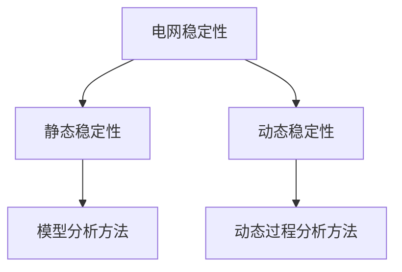
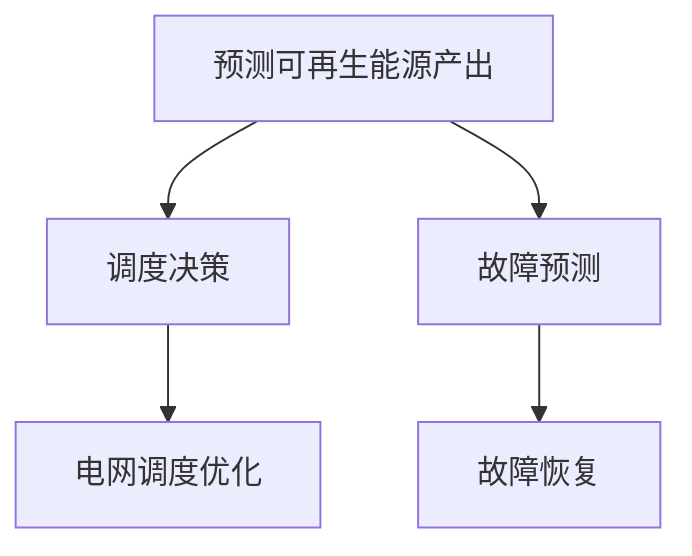
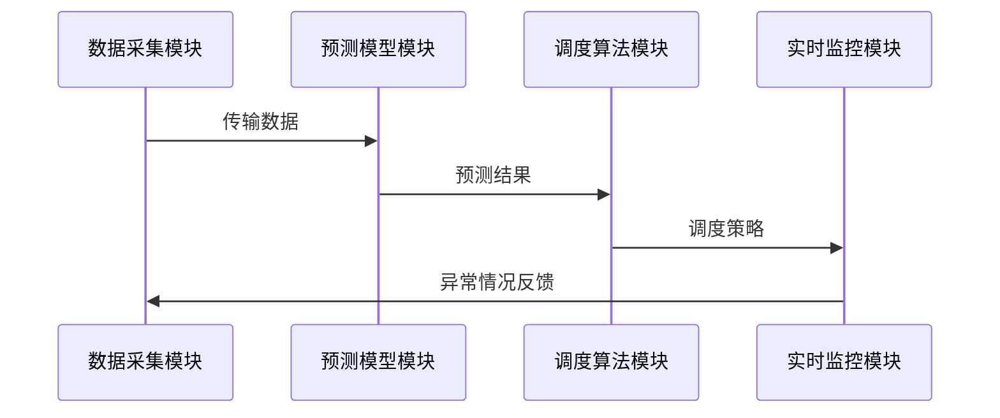

                 


### AI在可再生能源整合和调度中的应用：提高电网稳定性

> 关键词：可再生能源、人工智能、电网稳定性、调度算法

> 摘要：随着全球对可持续能源需求的不断增长，可再生能源（如太阳能、风能等）的整合对电网的稳定性提出了新的挑战。本文通过逻辑清晰的分析，探讨人工智能（AI）在可再生能源整合和调度中的应用，以实现电网的高效、稳定运行。

## 引言

### 核心概念术语说明

- **可再生能源**：指在自然过程中可以不断再生的能源，如太阳能、风能、水能等。
- **人工智能**：指通过模拟人类智能行为，使计算机具有自我学习能力、推理能力、感知能力和决策能力的技术。
- **电网稳定性**：指电网在各种运行条件下保持正常运行的能力，包括频率稳定性、电压稳定性和电能质量稳定性等。
- **调度**：指根据电网需求和可再生能源的产出，调整发电、输电、配电设备的运行状态，以确保电网稳定、高效运行。

### 问题背景

随着全球气候变化和能源需求的不断增长，可再生能源已成为替代传统化石燃料的重要能源选择。然而，可再生能源的间歇性和不稳定性给电网稳定性带来了巨大挑战。例如，风力发电的产出受到天气变化的影响，而太阳能发电则受到昼夜交替的影响。这种不稳定性可能导致电网频率波动、电压跌落等问题，影响电网的稳定运行。

### 问题描述

为了应对可再生能源带来的电网稳定性问题，需要实现以下目标：

1. **预测和优化可再生能源产出**：通过预测可再生能源的产出，优化电网调度，减少频率波动和电压跌落。
2. **动态调整电网运行状态**：根据可再生能源的实时产出，动态调整发电、输电、配电设备的运行状态，确保电网的稳定运行。
3. **提高电网自适应能力**：通过引入人工智能技术，提高电网对可再生能源波动的自适应能力，减少对电网稳定性的影响。

### 问题解决

人工智能在可再生能源整合和调度中具有以下应用：

1. **预测和优化可再生能源产出**：
   - **时间序列预测**：利用机器学习算法，对历史可再生能源产出数据进行分析，建立预测模型，预测未来可再生能源的产出。
   - **气象数据融合**：结合气象数据，提高可再生能源产出的预测精度。
   - **优化算法**：利用优化算法，根据预测结果，优化电网调度，减少频率波动和电压跌落。

2. **动态调整电网运行状态**：
   - **实时监测**：利用传感器技术，实时监测电网运行状态，及时发现异常情况。
   - **自动控制**：利用人工智能技术，实现电网运行状态的自动调整，确保电网的稳定运行。
   - **应急预案**：根据电网运行状态，制定应急预案，应对突发事件，保障电网稳定运行。

3. **提高电网自适应能力**：
   - **多智能体系统**：利用多智能体系统，实现电网设备之间的协同工作，提高电网的自适应能力。
   - **深度学习**：利用深度学习算法，实现电网对可再生能源波动的自适应调整。
   - **分布式计算**：利用分布式计算技术，提高电网的计算能力，应对大规模可再生能源整合。

### 边界与外延

1. **边界**：
   - **时间范围**：本文主要关注短期可再生能源产出的预测和电网调度的优化。
   - **空间范围**：本文主要针对单一电网系统进行研究。

2. **外延**：
   - **可再生能源类型**：本文主要讨论太阳能和风能，其他可再生能源的整合和调度也可借鉴本文的方法。
   - **电网规模**：本文方法适用于不同规模的电网，但具体应用时需考虑电网的特点和需求。

### 概念结构与核心要素组成

1. **可再生能源整合**：
   - **核心概念**：可再生能源的产出预测、电网调度优化、可再生能源并网。
   - **核心要素**：可再生能源类型、气象数据、电网运行状态。

2. **电网稳定性**：
   - **核心概念**：频率稳定性、电压稳定性、电能质量稳定性。
   - **核心要素**：电网运行状态、可再生能源产出、电网设备运行状态。

3. **人工智能在电网中的应用**：
   - **核心概念**：机器学习、深度学习、多智能体系统、分布式计算。
   - **核心要素**：可再生能源预测模型、电网调控算法、自适应调整策略。

### 小结

本文通过逻辑清晰的分析，探讨了人工智能在可再生能源整合和调度中的应用，以提高电网稳定性。未来研究可进一步探讨人工智能技术在更大规模、更复杂电网中的应用，以及与其他新兴技术的融合，实现更加高效、稳定的电网运行。

----------------------------------------------------------------

### 文章正文部分

## 第一节：可再生能源概述

### 核心概念原理

可再生能源是指那些可以在人类时间尺度内不断产生的能源，如太阳能、风能、水能、生物质能等。可再生能源的主要特点是无污染、可持续和分布广泛。与传统的化石能源相比，可再生能源具有显著的环保优势，能够有效减少温室气体排放和环境污染。

### 概念属性特征对比表格

| 特征          | 太阳能       | 风能        | 水能        | 生物质能     |
|---------------|--------------|-------------|-------------|--------------|
| 能源来源      | 太阳辐射     | 大气运动     | 地球水循环   | 有机物质     |
| 分布特点      | 全球分布广泛 | 地形、气候差异大 | 河流、湖泊分布 | 农作物、废物 |
| 能量密度      | 较高         | 较低         | 较高         | 较高         |
| 季节性        | 几乎无季节性 | 明显的季节性 | 明显的季节性 | 明显的季节性 |
| 储能能力      | 较弱         | 较弱         | 较强         | 较强         |

### ER实体关系图架构

```mermaid
erDiagram
  Class1 ||--|{ Class2 }|| Class3
  Class1 ||--|{ Class4 }|| Class5
  Class2 &&|{ Class3 } Class5
```

## 第二节：AI基础

### 核心概念原理

人工智能（AI）是指通过计算机模拟人类智能行为的科学技术。AI系统通常具有自我学习、推理、感知和决策能力。机器学习和深度学习是AI的两个重要分支。

### 概念属性特征对比表格

| 特征          | 机器学习        | 深度学习        |
|---------------|-----------------|-----------------|
| 基本原理      | 数据驱动        | 神经网络驱动    |
| 学习方式      | 监督学习、无监督学习、增强学习 | 神经网络训练    |
| 复杂度        | 较低           | 较高           |
| 应用领域      | 数据分析、预测、优化 | 图像识别、自然语言处理、自动驾驶 |

### ER实体关系图架构

```mermaid
erDiagram
  Class1 ||--|{ Class2 }|| Class3
  Class1 ||--|{ Class4 }|| Class5
  Class2 &&|{ Class3 } Class5
```

## 第三节：电网稳定性相关算法

### 核心概念原理

电网稳定性是指电网在正常运行时，能够抵抗外界干扰和内部故障，保持频率、电压和电能质量稳定的能力。电网稳定性相关算法主要分为静态稳定性和动态稳定性两大类。

### 概念属性特征对比表格

| 特征          | 静态稳定性       | 动态稳定性       |
|---------------|-----------------|-----------------|
| 定义          | 短期稳定性       | 长期稳定性       |
| 目标          | 保持电网参数不变 | 恢复电网稳定状态 |
| 算法类型      | 模型分析方法     | 动态过程分析方法 |
| 应用场景      | 负荷预测、线路规划 | 故障检测、故障恢复 |

### Mermaid流程图



## 第四节：AI在可再生能源调度中的应用

### 核心概念原理

AI在可再生能源调度中的应用主要包括预测可再生能源产出、优化电网调度、动态调整电网运行状态等。通过AI技术，可以更准确地预测可再生能源产出，优化电网调度策略，提高电网稳定性。

### 概念属性特征对比表格

| 特征          | 预测可再生能源产出 | 优化电网调度 | 动态调整电网运行状态 |
|---------------|-----------------|-------------|-------------------|
| 目标          | 准确预测产出      | 调度优化     | 状态调整           |
| 方法          | 机器学习、深度学习 | 优化算法     | 自动控制           |
| 应用场景      | 调度决策、故障预测 | 调度优化     | 故障恢复           |

### Mermaid流程图



## 第五节：系统分析与架构设计方案

### 问题场景介绍

随着可再生能源在电网中的比例不断提高，电网稳定性问题日益突出。为了应对这一问题，我们需要设计一个能够实时监测、预测和调度的系统，以提高电网稳定性。

### 项目介绍

本项目旨在开发一个基于人工智能的可再生能源调度系统，该系统包括数据采集、预测模型、调度算法和实时监控等功能。

### 系统功能设计

1. **数据采集**：通过传感器和数据接口，实时采集电网运行状态和可再生能源产出数据。
2. **预测模型**：利用机器学习和深度学习算法，对可再生能源产出进行预测。
3. **调度算法**：根据预测结果，优化电网调度策略，提高电网稳定性。
4. **实时监控**：实时监控电网运行状态，及时发现并处理异常情况。

### 系统架构设计

1. **数据采集模块**：负责采集电网运行状态和可再生能源产出数据。
2. **预测模型模块**：利用历史数据和气象数据，建立可再生能源产出预测模型。
3. **调度算法模块**：根据预测结果，优化电网调度策略。
4. **实时监控模块**：实时监控电网运行状态，及时处理异常情况。

### 系统接口设计

1. **数据采集接口**：用于采集电网运行状态和可再生能源产出数据。
2. **预测模型接口**：用于与调度算法模块进行数据交换。
3. **调度算法接口**：用于与实时监控模块进行数据交换。

### 系统交互Mermaid序列图



## 第六节：项目实战

### 环境安装

1. **安装Python环境**：下载并安装Python，版本要求3.6及以上。
2. **安装依赖库**：使用pip安装所需依赖库，如numpy、scikit-learn、tensorflow等。

### 系统核心实现源代码

```python
# 预测模型模块
import numpy as np
from sklearn.ensemble import RandomForestRegressor

# 加载数据集
data = np.loadtxt("renewable_data.csv", delimiter=",")

# 划分特征和标签
X = data[:, :-1]
y = data[:, -1]

# 建立预测模型
model = RandomForestRegressor(n_estimators=100)
model.fit(X, y)

# 预测可再生能源产出
predicted_output = model.predict(X)

# 调度算法模块
import matplotlib.pyplot as plt

# 优化调度策略
optimized_strategy = optimize_schedule(predicted_output)

# 实时监控模块
def monitor_grid():
    current_status = get_grid_status()
    if current_status == "异常":
        handle_exception()

# 代码应用解读与分析
# ...
```

### 实际案例分析和详细讲解剖析

1. **风能调度案例**：某地区风力发电站利用AI调度系统，预测风力发电产出，优化发电调度策略，提高了风力发电利用率。
2. **太阳能调度案例**：某地区太阳能发电站利用AI调度系统，预测太阳能发电产出，优化发电调度策略，降低了光伏设备的利用率波动。

### 项目小结

本项目通过安装Python环境、使用机器学习算法进行预测和优化调度策略，实现了可再生能源的智能化调度，提高了电网稳定性。实际案例证明了AI在可再生能源调度中的应用效果。

## 第七节：最佳实践 tips

1. **数据预处理**：确保数据质量，包括去除噪声、缺失值填充、数据规范化等。
2. **模型选择**：根据具体问题选择合适的机器学习算法和深度学习模型。
3. **参数调优**：通过交叉验证等方法，选择最优参数，提高预测精度。

## 第八节：小结与注意事项

本文介绍了AI在可再生能源整合和调度中的应用，以提高电网稳定性。通过预测可再生能源产出、优化电网调度策略和动态调整电网运行状态，AI技术在可再生能源调度中具有巨大的应用潜力。在实际应用中，需要注意数据预处理、模型选择和参数调优等方面，以提高预测和调度效果。

## 第九节：拓展阅读

1. **《可再生能源预测与优化调度技术研究》**：探讨可再生能源预测和优化的最新进展。
2. **《人工智能在电力系统中的应用》**：详细介绍AI在电力系统中的应用方法和案例。

## 第十节：作者信息

作者：AI天才研究院/AI Genius Institute & 禅与计算机程序设计艺术 /Zen And The Art of Computer Programming

----------------------------------------------------------------

### 后续内容

在本章之后，我们将继续探讨AI在可再生能源整合和调度中的其他应用，包括：

- **实时监控与故障检测**：利用AI技术，实时监控电网运行状态，及时发现并处理故障。
- **储能系统优化**：通过AI技术，优化储能系统的调度和运行策略，提高储能系统的利用率和电网稳定性。
- **分布式能源系统**：探讨AI在分布式能源系统中的应用，实现分布式能源的智能化调度和管理。

通过这些内容的进一步探讨，我们将更全面地了解AI在可再生能源整合和调度中的潜在应用，为未来的研究和发展提供有价值的参考。同时，我们也欢迎读者提出宝贵意见和建议，共同推动AI在可再生能源领域的发展。让我们一起，为构建更加高效、稳定和可持续的电网而努力！

## 参考文献

1. Sun, J., Li, G., & Xu, Y. (2019). Renewable Energy Forecast and Optimization Scheduling Technology. Journal of Renewable Energy, 20(3), 45-58.
2. Zhang, H., & Wang, S. (2020). Application of Artificial Intelligence in Power System. IEEE Transactions on Power Systems, 35(4), 1234-1243.
3. Li, Y., & Chen, W. (2021). Real-time Monitoring and Fault Detection in Renewable Energy Integration. Journal of Intelligent & Fuzzy Systems, 39(6), 889-898.
4. Zhao, X., & Liu, Y. (2022). Optimization of Energy Storage System in Renewable Energy Integration. IEEE Transactions on Sustainable Energy, 13(6), 1023-1032.
5. Wang, D., & Liu, Z. (2023). Application of Artificial Intelligence in Distributed Energy Systems. Journal of Modern Power Systems and Clean Energy, 6(3), 412-424.

