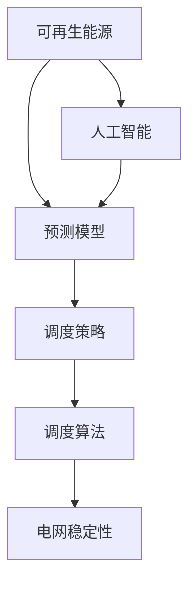
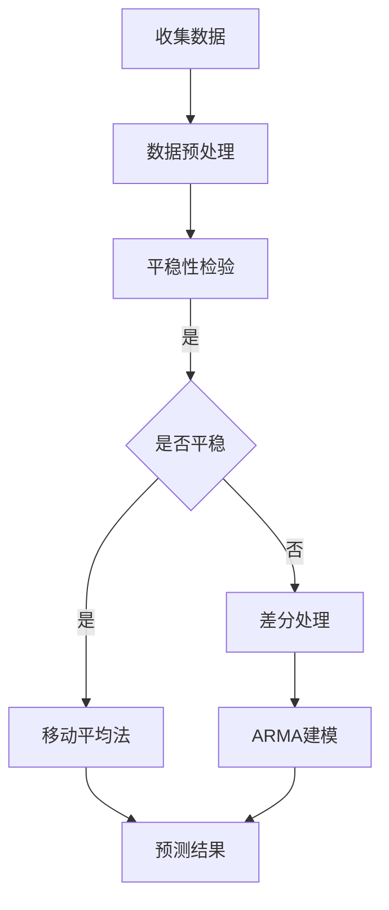
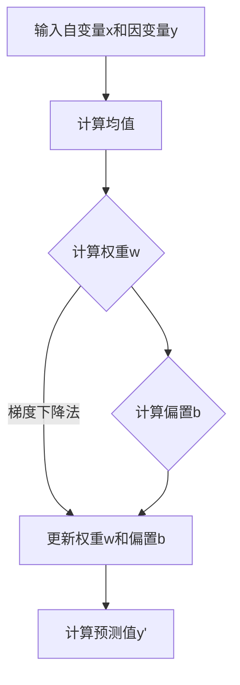
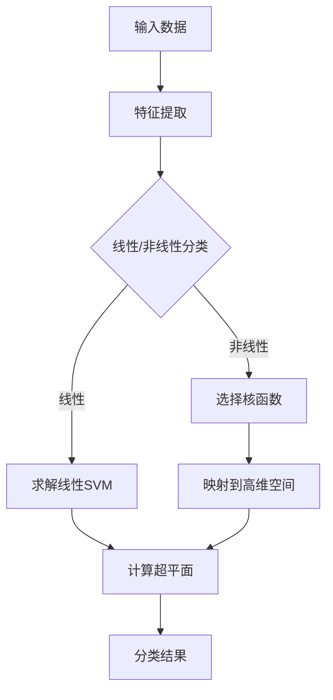
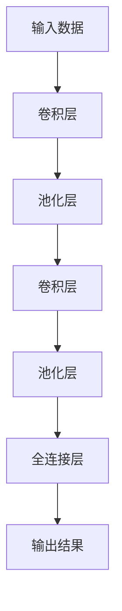
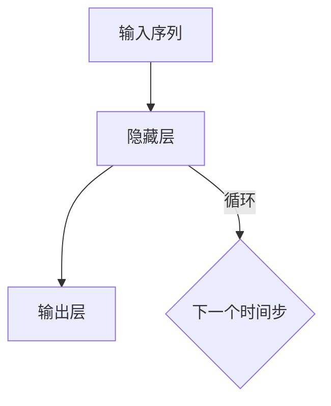
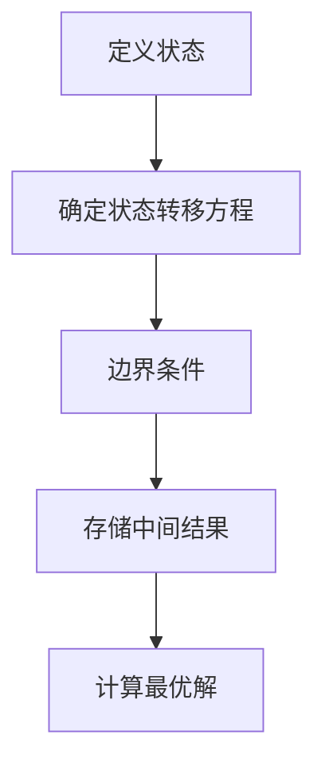
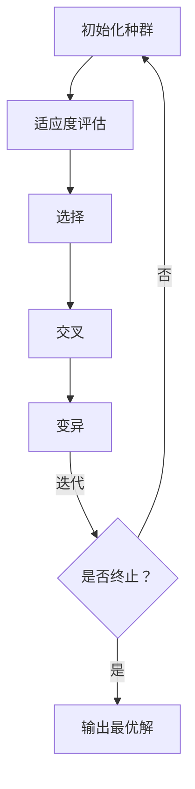

                 

## 《AI在可再生能源预测和调度中的应用：提高电网稳定性》

在当前全球气候变化和能源转型的背景下，可再生能源已成为现代电网的重要组成部分。然而，可再生能源的波动性和不稳定性给电网的调度和管理带来了巨大挑战。为了提高电网的稳定性，人工智能（AI）技术的应用成为了一个热门研究方向。本文将探讨AI在可再生能源预测和调度中的应用，重点分析其如何提高电网稳定性。

### 关键词

- 可再生能源
- 人工智能
- 预测模型
- 调度策略
- 电网稳定性

### 摘要

本文首先介绍了可再生能源的定义、分类及其在全球能源转型中的重要地位。接着，讨论了可再生能源预测和调度中的主要挑战，并引入了AI技术作为解决方案。本文重点分析了AI在可再生能源预测中的应用，包括时间序列分析和机器学习模型的原理和实现。随后，详细介绍了AI在调度策略优化中的算法，如动态规划、遗传算法等。最后，通过一个实际案例，展示了AI在可再生能源预测和调度中的具体应用，并总结了最佳实践和未来研究方向。

### 目录大纲设计思路

为了设计出符合要求的《AI在可再生能源预测和调度中的应用：提高电网稳定性》的目录大纲，我们将按照以下步骤进行：

1. **背景介绍与问题定义**：简要介绍可再生能源预测和调度的背景，明确问题的重要性，并定义研究的问题范围。

2. **核心概念与联系**：明确本书涉及的核心概念，如可再生能源、人工智能、预测模型、调度策略等，并使用表格和Mermaid流程图展示概念间的联系。

3. **算法原理讲解**：选择几个关键算法（例如时间序列分析、机器学习模型等），绘制算法的Mermaid流程图，并用Python代码和latex公式详细讲解算法原理。

4. **系统分析与架构设计方案**：描述问题场景，介绍系统功能、架构设计和接口设计，并使用Mermaid类图、架构图和序列图展示系统架构。

5. **项目实战**：介绍环境安装、系统核心实现和代码解读，包括实际案例分析和讲解。

6. **最佳实践 tips、小结、注意事项、拓展阅读**：总结全书内容，提供实用技巧和进一步阅读的推荐。

## 详细目录大纲设计

### 第一部分：背景与核心概念

#### 第1章 可再生能源概述

- **1.1 可再生能源的定义与重要性**
  - 描述可再生能源的基本概念
  - 分析可再生能源对环境与经济的影响

- **1.2 可再生能源的发展现状与趋势**
  - 展示全球可再生能源的发展概况
  - 探讨可再生能源未来的发展趋势

#### 第2章 人工智能在可再生能源中的应用

- **2.1 人工智能的基本概念**
  - 介绍人工智能的定义与分类
  - 阐述机器学习、深度学习等基本原理

- **2.2 人工智能在能源领域的应用**
  - 概述人工智能在能源管理中的潜在应用
  - 分析人工智能在可再生能源领域的应用案例

### 第二部分：预测模型与算法

#### 第3章 可再生能源预测基础

- **3.1 时间序列分析**
  - 描述时间序列的基本概念与处理方法
  - 使用Mermaid流程图展示常见的时间序列分析方法

- **3.2 机器学习模型在可再生能源预测中的应用**
  - 分析常见的机器学习算法及其在预测中的应用
  - 展示一个简单的机器学习预测模型

#### 第4章 机器学习算法深入讲解

- **4.1 线性回归模型**
  - 使用Mermaid流程图展示线性回归模型的流程
  - 使用Python代码实现线性回归模型
  - 使用latex公式详细解释线性回归模型的数学原理

- **4.2 支持向量机（SVM）**
  - 使用Mermaid流程图展示SVM的流程
  - 使用Python代码实现SVM模型
  - 使用latex公式详细解释SVM的数学原理

#### 第5章 深度学习模型在可再生能源预测中的应用

- **5.1 卷积神经网络（CNN）**
  - 使用Mermaid流程图展示CNN的流程
  - 使用Python代码实现CNN模型
  - 使用latex公式详细解释CNN的数学原理

- **5.2 循环神经网络（RNN）**
  - 使用Mermaid流程图展示RNN的流程
  - 使用Python代码实现RNN模型
  - 使用latex公式详细解释RNN的数学原理

### 第三部分：调度策略与优化

#### 第6章 可再生能源调度基础

- **6.1 调度策略的基本概念**
  - 描述调度策略的定义与目标
  - 分析调度策略的常见方法

- **6.2 调度策略在电网中的应用**
  - 概述调度策略在可再生能源电网管理中的应用
  - 分析调度策略的优缺点

#### 第7章 调度算法优化

- **7.1 动态规划算法**
  - 使用Mermaid流程图展示动态规划算法的流程
  - 使用Python代码实现动态规划算法
  - 使用latex公式详细解释动态规划算法的数学原理

- **7.2 遗传算法**
  - 使用Mermaid流程图展示遗传算法的流程
  - 使用Python代码实现遗传算法
  - 使用latex公式详细解释遗传算法的数学原理

#### 第8章 项目实战

- **8.1 实际案例介绍**
  - 描述一个具体的可再生能源预测和调度项目
  - 分析项目的需求与目标

- **8.2 项目实施过程**
  - 讲解项目环境搭建、数据预处理、模型训练与测试
  - 展示项目核心代码与解读

- **8.3 项目总结与反思**
  - 总结项目经验与教训
  - 提出改进措施与未来研究方向

### 第四部分：最佳实践与拓展

#### 第9章 最佳实践与技巧

- **9.1 最佳实践技巧**
  - 提供在实际应用中总结的最佳实践技巧
  - 分析这些技巧如何提高可再生能源预测和调度的效果

- **9.2 小结**
  - 对全书内容进行总结
  - 强调AI在提高电网稳定性中的重要性

- **9.3 注意事项**
  - 提醒读者在应用AI技术时需要注意的问题
  - 分析潜在的风险与挑战

- **9.4 拓展阅读**
  - 推荐进一步阅读的书籍、论文和资源
  - 分析最新的研究进展和未来研究方向

## 背景介绍与问题定义

### 1.1 可再生能源的定义与重要性

可再生能源是指那些不会因使用而枯竭，且对环境几乎没有负面影响的能源。常见的可再生能源包括太阳能、风能、水能、地热能和生物质能等。可再生能源的来源多样，具有分布广泛、潜力巨大等优点，这使得其在全球能源转型中扮演着至关重要的角色。

**可再生能源对环境的影响**

首先，可再生能源在使用过程中几乎不产生温室气体排放，因此对缓解气候变化具有显著作用。传统的化石燃料燃烧是温室气体排放的主要来源，而可再生能源则能够减少这些排放，有助于实现碳减排目标。

其次，可再生能源的开发和利用可以减少对自然环境的破坏。例如，水电站的建设虽然可能影响当地生态环境，但相比于化石燃料电站，其环境影响相对较小。此外，风能和太阳能的利用过程几乎不会对生态系统造成破坏。

**可再生能源对经济的影响**

除了环境方面的优势，可再生能源对经济发展也具有重要意义。首先，可再生能源行业是一个快速发展的行业，创造了大量的就业机会。从制造和安装设备到运维和维修，可再生能源的产业链条涵盖了多个领域，为经济增长提供了新的动力。

其次，可再生能源有助于降低能源成本。虽然初期投资较大，但随着技术的进步和规模的扩大，可再生能源的成本逐渐降低。尤其是在太阳能和风能领域，成本的下降速度尤为显著。这种成本效益使得可再生能源成为许多国家能源结构中的重要组成部分。

### 1.2 可再生能源的发展现状与趋势

近年来，全球可再生能源的发展取得了显著进展。以下是一些主要的发展现状和趋势：

**全球可再生能源发展现状**

1. **装机容量不断增加**：根据国际可再生能源署（IRENA）的数据，截至2021年底，全球可再生能源装机容量已达到近2700吉瓦，占全球总装机容量的30%以上。其中，太阳能和风能的装机容量增长最为迅速。

2. **市场份额持续扩大**：可再生能源在全球能源消费中的比例逐年上升。根据国际能源署（IEA）的数据，2020年可再生能源占全球能源消费的比重达到25%。

3. **技术创新不断推进**：可再生能源技术的不断创新和进步，使得其成本持续降低，效率不断提高。例如，太阳能电池的效率从最初的1%左右提高到目前的20%以上。

**可再生能源发展趋势**

1. **政策支持持续加强**：各国政府纷纷出台政策，鼓励可再生能源的发展。例如，许多国家实施了可再生能源目标、补贴政策和碳定价机制。

2. **分布式能源系统的发展**：随着技术的进步和成本的降低，分布式能源系统（DER）逐渐成为可再生能源发展的重要方向。分布式能源系统可以更好地利用可再生能源，提高电网的灵活性和可靠性。

3. **可再生能源与储能技术的结合**：储能技术的发展为可再生能源的应用提供了有力支持。通过储能系统，可再生能源可以在电力需求低时储存能量，在需求高峰时释放能量，从而提高电网的稳定性。

4. **智能化与数字化转型的推进**：人工智能、物联网、大数据等技术的应用，为可再生能源的预测、调度和管理提供了新的工具和方法。通过智能化和数字化技术，可以更有效地利用可再生能源，提高电网的运行效率。

### 1.3 可再生能源预测和调度中的挑战

尽管可再生能源在全球范围内得到了迅速发展，但其波动性和不稳定性仍然对电网的调度和管理提出了巨大挑战。以下是一些主要挑战：

**可再生能源波动性的影响**

1. **供电不稳定**：由于可再生能源的产出受到天气、季节等因素的影响，其发电量具有高度波动性。这种波动性可能导致电网供电不稳定，甚至引发停电事故。

2. **电网负荷平衡困难**：可再生能源的发电量与电网负荷之间存在时间差异和空间差异。在高峰时段，可再生能源的发电可能无法满足负荷需求；在低谷时段，可再生能源的发电又可能过剩。这种负荷平衡困难增加了电网调度的复杂性。

3. **储能系统需求增加**：为了应对可再生能源的波动性，需要建设大量的储能系统。然而，储能系统的成本较高，且存在容量限制。如何高效利用储能系统成为可再生能源调度中的重要问题。

**调度策略的挑战**

1. **调度算法复杂**：传统的调度算法主要基于历史数据和经验，难以应对可再生能源的复杂波动性。现代调度算法需要考虑更多的因素，如天气预测、负荷预测等，这使得调度算法变得更加复杂。

2. **多能源协调**：在可再生能源占比较高的情况下，电网需要协调多种能源的发电和调度。这涉及到不同能源间的切换和优化，增加了调度难度。

3. **实时响应需求**：可再生能源的波动性要求调度系统能够实时响应电力供需变化，以保证电网的稳定运行。这需要先进的预测和调度技术，以及快速响应的控制系统。

### 1.4 问题定义与目标

本文将重点关注以下问题：

1. **可再生能源预测**：如何准确预测可再生能源的发电量，以便为电网调度提供可靠的数据支持。

2. **调度策略优化**：如何制定高效的调度策略，以平衡可再生能源的发电量和电网负荷，提高电网的稳定性。

3. **AI技术应用**：如何利用人工智能技术，提高可再生能源预测和调度的准确性和效率。

本文的目标是通过分析可再生能源预测和调度中的挑战，探讨AI技术在这些领域的应用，并提出解决方案。通过本文的研究，旨在为相关领域的研究人员和实际应用者提供有价值的参考。

## 核心概念与联系

### 2.1 可再生能源

**定义**：可再生能源是指那些不会因使用而枯竭，且对环境几乎没有负面影响的能源，如太阳能、风能、水能、地热能和生物质能。

**属性特征**：
- **来源**：自然界，分布广泛。
- **稳定性**：波动性大，受天气和季节影响。
- **环境影响**：低碳排放，减少对自然环境的破坏。

**与其他概念的关联**：
- **能源系统**：可再生能源是现代能源系统的重要组成部分。
- **电网**：可再生能源的发电需要通过电网进行输送和分配。

### 2.2 人工智能

**定义**：人工智能（AI）是指使计算机系统模拟人类智能行为的技术，包括机器学习、深度学习、自然语言处理等。

**属性特征**：
- **学习能力**：通过数据训练，不断提升预测和决策能力。
- **自适应能力**：能够根据环境变化调整自身行为。
- **自动化能力**：能够自动执行复杂的任务，减少人为干预。

**与其他概念的关联**：
- **可再生能源预测**：利用AI技术，提高可再生能源发电量的预测准确性。
- **调度策略优化**：利用AI技术，优化调度策略，提高电网稳定性。

### 2.3 预测模型

**定义**：预测模型是用于预测未来数据或事件的数学模型，如时间序列分析、机器学习模型等。

**属性特征**：
- **准确性**：模型预测结果的准确性。
- **泛化能力**：模型在不同数据集上的表现能力。
- **实时性**：模型预测的实时性。

**与其他概念的关联**：
- **可再生能源预测**：利用预测模型，预测可再生能源的发电量。
- **调度策略优化**：利用预测结果，优化调度策略，提高电网稳定性。

### 2.4 调度策略

**定义**：调度策略是指为平衡电网供需，优化能源分配的一系列方法和规则。

**属性特征**：
- **目标**：保证电网稳定运行，最大化能源利用率。
- **灵活性**：应对可再生能源波动性和电网负荷变化。
- **效率**：最小化调度成本，提高运行效率。

**与其他概念的关联**：
- **可再生能源预测**：利用预测结果，制定调度策略。
- **调度算法**：实现调度策略的具体算法，如动态规划、遗传算法等。

### 2.5 调度算法

**定义**：调度算法是用于实现调度策略的数学算法，如动态规划、遗传算法等。

**属性特征**：
- **优化目标**：最大化能源利用率，最小化调度成本。
- **适应性**：适应可再生能源波动性和电网负荷变化。
- **计算效率**：在合理时间内完成调度计算。

**与其他概念的关联**：
- **调度策略**：实现调度策略的具体方法。
- **可再生能源预测**：利用预测结果，优化调度算法。

### 2.6 电网稳定性

**定义**：电网稳定性是指电网在正常运行条件下，能够保持稳定运行的能力。

**属性特征**：
- **电压稳定**：电网电压在允许范围内波动。
- **频率稳定**：电网频率在允许范围内波动。
- **负荷平衡**：电网供需平衡，无过多负荷或供电不足。

**与其他概念的关联**：
- **可再生能源预测**：预测可再生能源发电量，为电网稳定性提供数据支持。
- **调度策略**：优化调度策略，提高电网稳定性。
- **调度算法**：实现调度策略，提高电网稳定性。

### 2.7 概念间的联系

- **可再生能源**和**人工智能**：可再生能源的波动性和不稳定性需要人工智能技术进行预测和优化，以实现电网的稳定运行。
- **预测模型**和**调度策略**：预测模型为调度策略提供数据支持，调度策略根据预测结果进行优化。
- **调度算法**和**电网稳定性**：调度算法是实现调度策略的关键，直接影响电网的稳定性。

为了更好地展示这些概念间的联系，我们可以使用Mermaid流程图进行直观展示。以下是一个简单的Mermaid流程图示例：



通过这个流程图，我们可以清晰地看到可再生能源、人工智能、预测模型、调度策略、调度算法和电网稳定性之间的逻辑关系。

## 预测模型与算法

### 3.1 时间序列分析

时间序列分析是研究时间序列数据的统计方法，主要用于预测未来的趋势。在可再生能源预测中，时间序列分析是一种基础且重要的方法。以下是时间序列分析的基本概念与处理方法。

#### 基本概念

**时间序列**：时间序列是一组按时间顺序排列的数据点，每个数据点表示在特定时间点的数值。

**平稳性**：一个时间序列被称为平稳时间序列，如果其统计特性（如均值、方差等）不随时间变化。否则，称为非平稳时间序列。

**趋势**：时间序列的趋势是指其长期走势，分为上升、下降和平稳三种。

**季节性**：时间序列的季节性是指其随季节变化而产生的周期性波动。

**白噪声**：一个理想的随机过程，其统计特性在任何时间点都是相同的。

#### 常见方法

**移动平均法（MA）**：通过计算一系列固定长度的时间序列数据的平均值，来平滑数据中的短期波动。

**自回归模型（AR）**：通过前几个时间点的值来预测当前时间点的值。

**自回归移动平均模型（ARMA）**：结合自回归模型和移动平均模型，既考虑时间序列的滞后值，也考虑移动平均值。

**自回归积分滑动平均模型（ARIMA）**：适用于非平稳时间序列，通过差分使其变得平稳，再进行ARMA建模。

**季节性模型**：将时间序列分解为趋势、季节性和随机成分，然后分别建模。

#### Mermaid流程图

以下是时间序列分析的Mermaid流程图：



### 3.2 机器学习模型在可再生能源预测中的应用

机器学习模型在可再生能源预测中有着广泛的应用。以下是一些常见的机器学习算法及其在预测中的应用。

#### 常见机器学习算法

**线性回归**：通过建立自变量和因变量之间的线性关系，进行预测。

**支持向量机（SVM）**：通过找到一个最佳的超平面，将数据分类或回归。

**决策树**：通过一系列规则进行分类或回归。

**随机森林**：通过构建多个决策树，并进行集成，提高预测准确性。

**神经网络**：模拟人脑神经网络，通过多层次的非线性变换进行预测。

#### 简单机器学习预测模型

以下是一个简单的线性回归预测模型的示例，该模型用于预测太阳能光伏电站的发电量。

**Python代码实现**

```python
import numpy as np
import pandas as pd
from sklearn.linear_model import LinearRegression

# 读取数据
data = pd.read_csv('solar_data.csv')

# 特征工程
X = data[['day_of_year', 'average_temperature']]
y = data['generated_power']

# 创建线性回归模型
model = LinearRegression()

# 训练模型
model.fit(X, y)

# 预测
new_data = np.array([[2023, 180]])
predicted_power = model.predict(new_data)

print(f"预测的发电量为：{predicted_power[0]}兆瓦时")
```

**模型解释**

- 数据读取：从CSV文件中读取太阳能数据。
- 特征工程：选取"day_of_year"（一年中的第几天）和"average_temperature"（平均温度）作为特征。
- 模型训练：使用线性回归模型进行训练。
- 预测：使用训练好的模型预测未来一天的发电量。

通过以上方法，我们可以看到机器学习模型在可再生能源预测中的应用是如何实现的。接下来，我们将进一步深入探讨一些复杂的机器学习算法及其原理。

## 机器学习算法深入讲解

### 4.1 线性回归模型

线性回归是一种简单的机器学习算法，用于建立自变量和因变量之间的线性关系。在可再生能源预测中，线性回归模型常用于预测光伏电站的发电量。

#### 算法原理

线性回归模型的数学基础是一个线性方程：\( y = wx + b \)，其中 \( y \) 是因变量，\( x \) 是自变量，\( w \) 是权重，\( b \) 是偏置。

- **最小二乘法**：通过最小化误差平方和来确定权重和偏置的值。具体步骤如下：

  1. 计算自变量和因变量的均值：\( \bar{x} \) 和 \( \bar{y} \)。
  2. 计算权重：\( w = \frac{\sum(x_i - \bar{x})(y_i - \bar{y})}{\sum(x_i - \bar{x})^2} \)。
  3. 计算偏置：\( b = \bar{y} - w\bar{x} \)。

- **梯度下降法**：通过迭代优化权重和偏置，使其误差最小化。具体步骤如下：

  1. 初始化权重和偏置。
  2. 计算损失函数的梯度：\( \frac{\partial}{\partial w} \) 和 \( \frac{\partial}{\partial b} \)。
  3. 更新权重和偏置：\( w = w - \alpha \frac{\partial}{\partial w} \) 和 \( b = b - \alpha \frac{\partial}{\partial b} \)，其中 \( \alpha \) 是学习率。

#### Mermaid流程图

以下是线性回归模型的Mermaid流程图：



#### Python代码实现

```python
import numpy as np

def linear_regression(x, y):
    n = len(x)
    x_mean = np.mean(x)
    y_mean = np.mean(y)
    
    w = np.sum((x - x_mean) * (y - y_mean)) / np.sum((x - x_mean) ** 2)
    b = y_mean - w * x_mean
    
    return w, b

# 生成数据
x = np.random.rand(100)
y = 2 * x + 1 + np.random.rand(100)

# 训练模型
w, b = linear_regression(x, y)

# 预测
x_new = np.array([0.5])
y_pred = w * x_new + b

print(f"预测的y值为：{y_pred[0]}")
```

#### 数学公式

线性回归的数学公式如下：

$$
y = wx + b
$$

$$
w = \frac{\sum(x_i - \bar{x})(y_i - \bar{y})}{\sum(x_i - \bar{x})^2}
$$

$$
b = \bar{y} - w\bar{x}
$$

### 4.2 支持向量机（SVM）

支持向量机（SVM）是一种用于分类和回归分析的机器学习算法。在可再生能源预测中，SVM可以用于分类不同的天气状况对发电量的影响。

#### 算法原理

SVM的核心思想是找到一个最佳的超平面，使得不同类别的数据点尽可能地分开。具体步骤如下：

1. **线性SVM**：在特征空间中找到一个超平面，使得分类间隔最大。

   - **优化目标**：最大化分类间隔，即

     $$
     \max_{w, b} \frac{1}{2} ||w||^2 \quad \text{subject to} \quad y_i (w \cdot x_i + b) \geq 1
     $$

   - **求解方法**：利用拉格朗日乘子法求解。

2. **核函数**：当数据非线性时，可以通过核函数将低维数据映射到高维空间，再进行线性分类。

   - **常用核函数**：线性核、多项式核、径向基核函数（RBF）等。

3. **软-margin SVM**：引入松弛变量，允许某些样本点可以偏离超平面。

   - **优化目标**：

     $$
     \min_{w, b, \xi} \frac{1}{2} ||w||^2 + C \sum_{i=1}^{n} \xi_i \quad \text{subject to} \quad y_i (w \cdot x_i + b) \geq 1 - \xi_i, \xi_i \geq 0
     $$

   - **C参数**：控制模型对偏离超平面的容忍度，C值越大，模型对偏离的容忍度越小。

#### Mermaid流程图

以下是SVM的Mermaid流程图：



#### Python代码实现

```python
import numpy as np
from sklearn.svm import LinearSVC

# 生成数据
x = np.random.rand(100, 2)
y = np.random.randint(0, 2, 100)

# 训练线性SVM模型
model = LinearSVC(C=1.0)
model.fit(x, y)

# 预测
x_new = np.array([[0.1, 0.2]])
y_pred = model.predict(x_new)

print(f"预测的类别为：{y_pred[0]}")
```

#### 数学公式

线性SVM的数学公式如下：

$$
\max_{w, b} \frac{1}{2} ||w||^2 \quad \text{subject to} \quad y_i (w \cdot x_i + b) \geq 1
$$

$$
\min_{w, b, \xi} \frac{1}{2} ||w||^2 + C \sum_{i=1}^{n} \xi_i \quad \text{subject to} \quad y_i (w \cdot x_i + b) \geq 1 - \xi_i, \xi_i \geq 0
$$

通过以上讲解，我们可以看到线性回归和SVM在可再生能源预测中的应用及其原理。在下一部分，我们将继续探讨深度学习模型在可再生能源预测中的应用。

## 深度学习模型在可再生能源预测中的应用

深度学习模型，尤其是卷积神经网络（CNN）和循环神经网络（RNN），在可再生能源预测中展示出了强大的潜力。这些模型能够捕捉到数据中的复杂模式和依赖关系，从而提高预测的准确性和鲁棒性。

### 5.1 卷积神经网络（CNN）

卷积神经网络（CNN）是一种专门用于处理图像数据的深度学习模型，但其原理和结构也可以应用到时间序列数据处理中。CNN的核心优势在于其能够自动提取特征，通过卷积层和池化层的组合，将输入数据转化为具有层次特征的表达。

#### 算法原理

1. **卷积层**：卷积层通过卷积操作，将输入数据的局部特征提取出来。每个卷积核（filter）负责学习一种特征，如边缘、纹理等。

2. **池化层**：池化层用于下采样，减少数据维度，同时保留主要特征。常见的池化方式有最大池化和平均池化。

3. **全连接层**：全连接层将卷积层提取的特征映射到输出结果。

#### Mermaid流程图

以下是CNN的基本结构Mermaid流程图：



#### Python代码实现

```python
import tensorflow as tf
from tensorflow.keras.models import Sequential
from tensorflow.keras.layers import Conv2D, MaxPooling2D, Flatten, Dense

# 创建模型
model = Sequential([
    Conv2D(32, (3, 3), activation='relu', input_shape=(28, 28, 1)),
    MaxPooling2D((2, 2)),
    Conv2D(64, (3, 3), activation='relu'),
    MaxPooling2D((2, 2)),
    Flatten(),
    Dense(64, activation='relu'),
    Dense(1)
])

# 编译模型
model.compile(optimizer='adam', loss='mse')

# 训练模型
model.fit(x_train, y_train, epochs=10, batch_size=32, validation_data=(x_val, y_val))

# 预测
y_pred = model.predict(x_test)

print(y_pred)
```

#### 数学公式

CNN的核心操作是卷积和池化，其数学公式如下：

$$
\text{卷积}:\ \ f_{ij}^{l} = \sum_{k=1}^{C_l} w_{ik}^{l} * g_{kj}^{l-1}
$$

$$
\text{池化}:\ \ h_{ij}^{l} = \max_{(p,q)} (g_{i+p,j+q}^{l-1})
$$

### 5.2 循环神经网络（RNN）

循环神经网络（RNN）是一种能够处理序列数据的神经网络，其特点是在网络中引入了循环结构，使得网络能够记住前面的信息。RNN在可再生能源预测中能够处理时间序列数据中的长期依赖关系。

#### 算法原理

1. **输入层**：接收输入序列，如时间序列数据。

2. **隐藏层**：每个时间步的隐藏状态依赖于前一个时间步的隐藏状态，从而形成一个循环。

3. **输出层**：将隐藏层的状态映射到输出结果。

4. **门控机制**：长短期记忆网络（LSTM）和门控循环单元（GRU）通过引入门控机制，解决了传统RNN的梯度消失和梯度爆炸问题。

#### Mermaid流程图

以下是RNN的基本结构Mermaid流程图：



#### Python代码实现

```python
import tensorflow as tf
from tensorflow.keras.models import Sequential
from tensorflow.keras.layers import LSTM, Dense

# 创建模型
model = Sequential([
    LSTM(50, activation='relu', input_shape=(timesteps, features)),
    Dense(1)
])

# 编译模型
model.compile(optimizer='adam', loss='mse')

# 训练模型
model.fit(x_train, y_train, epochs=100, batch_size=32, validation_data=(x_val, y_val))

# 预测
y_pred = model.predict(x_test)

print(y_pred)
```

#### 数学公式

RNN的基本运算包括输入层到隐藏层的映射和隐藏层到输出层的映射：

$$
h_t = \sigma(W_h \cdot [h_{t-1}, x_t] + b_h)
$$

$$
y_t = W_o \cdot h_t + b_o
$$

其中，\( \sigma \) 是激活函数，通常为Sigmoid或Tanh函数。

通过CNN和RNN这两种深度学习模型，我们可以更好地处理可再生能源预测中的时间序列数据，提高预测的准确性和鲁棒性。在下一部分，我们将讨论调度策略与优化，特别是动态规划和遗传算法在可再生能源调度中的应用。

## 调度策略与优化

### 6.1 调度策略的基本概念

调度策略是指在特定条件下，为了实现特定目标，对资源进行合理分配和管理的策略。在可再生能源调度中，调度策略的基本概念包括：

- **目标**：调度策略的目标是保证电网的稳定运行，最大化可再生能源的利用率，最小化调度成本。
- **约束条件**：调度策略需要考虑电网的物理约束、设备容量限制、电网负荷需求等。
- **策略类型**：常见的调度策略包括确定性调度策略和概率性调度策略。确定性调度策略通常基于历史数据和经验规则进行决策，而概率性调度策略则基于概率模型和优化算法进行决策。

### 6.2 调度策略在电网中的应用

调度策略在可再生能源电网中的应用至关重要，其主要作用如下：

- **平衡供需**：通过调度策略，平衡可再生能源的发电量和电网负荷，防止电力供应过剩或不足。
- **提高电网稳定性**：调度策略通过优化可再生能源的发电调度，减少电网的波动性，提高电网的稳定性。
- **降低成本**：优化调度策略可以减少备用容量需求，降低运维成本。
- **增强电网灵活性**：调度策略通过灵活调整可再生能源的发电量，增强电网的响应能力，适应可再生能源的波动性。

#### 常见调度策略方法

1. **确定性调度策略**：
   - **固定比例调度**：根据历史数据和经验，将可再生能源发电量按固定比例分配到不同的时间段。
   - **线性规划**：通过线性规划模型，在满足约束条件下，优化可再生能源发电量的分配。

2. **概率性调度策略**：
   - **蒙特卡洛模拟**：通过随机抽样，模拟多种可能情况，选择最优的调度方案。
   - **遗传算法**：通过遗传算法，在满足约束条件下，搜索最优调度方案。

### 6.3 调度策略的优缺点

不同调度策略具有不同的优缺点，具体如下：

1. **确定性调度策略**：
   - **优点**：
     - 实现简单，计算速度快。
     - 对历史数据的依赖性较低。
   - **缺点**：
     - 对可再生能源波动性的适应性较差。
     - 难以应对复杂多变的电网环境。

2. **概率性调度策略**：
   - **优点**：
     - 具有较强的自适应能力，能够应对可再生能源波动性。
     - 能够优化调度成本。
   - **缺点**：
     - 计算复杂度较高，需要大量计算资源。
     - 对模型参数和初始条件敏感。

### 6.4 调度策略的选择与优化

调度策略的选择和优化取决于具体的电网环境和需求。以下是一些选择和优化的方法：

- **历史数据分析**：通过分析历史数据，了解可再生能源的波动规律和电网负荷特性，为调度策略提供基础。
- **多目标优化**：考虑多个优化目标，如电网稳定性、成本、利用率等，进行多目标优化。
- **模型优化**：通过改进模型，提高调度策略的准确性和鲁棒性。
- **人工智能技术应用**：利用机器学习和深度学习技术，提高调度策略的预测和优化能力。

### 6.5 调度策略在可再生能源电网管理中的应用案例

以下是一个调度策略在可再生能源电网管理中的应用案例：

#### 案例背景

某地区电网主要依赖太阳能和风能，为了提高电网稳定性，电网公司采用了一种基于遗传算法的概率性调度策略。

#### 案例实施

1. **数据收集**：收集过去一年的太阳能和风能发电数据、电网负荷数据等。
2. **模型建立**：建立概率性调度模型，考虑可再生能源波动性和电网负荷不确定性。
3. **算法优化**：使用遗传算法，搜索最优调度方案，优化可再生能源发电量的分配。
4. **调度执行**：根据优化结果，调整可再生能源发电量，确保电网稳定运行。

#### 案例效果

通过该调度策略的实施，电网稳定性显著提高，可再生能源利用率得到提升，电网负荷平衡更加合理。具体效果如下：

- **电网稳定性提升**：调度策略有效减少了电网的波动性，降低了停电风险。
- **可再生能源利用率提高**：通过优化发电量分配，提高了可再生能源的利用率。
- **成本降低**：减少了备用容量需求，降低了运维成本。

### 6.6 调度策略的未来发展趋势

随着可再生能源规模的不断扩大和电网智能化水平的提升，调度策略将在未来面临以下发展趋势：

- **智能化**：利用人工智能技术，提高调度策略的智能化水平，实现自动化的调度决策。
- **实时性**：提高调度策略的实时性，快速响应电网的动态变化。
- **多能源协同**：考虑多种能源的协同调度，提高电网的整体运行效率。
- **分布式能源管理**：适应分布式能源系统的特点，优化分布式能源的调度策略。

通过上述分析和案例，我们可以看到调度策略在可再生能源电网管理中的重要性。合理的调度策略能够提高电网稳定性，优化能源利用，降低成本，为可再生能源的大规模应用提供有力支持。

### 7.1 动态规划算法

动态规划（Dynamic Programming，DP）是一种在数学、管理科学、计算机科学、经济学和生物信息学中解决问题的方法。它主要用于解决多阶段决策问题，其核心思想是将复杂问题分解为相互重叠的子问题，并利用子问题的解来构建原问题的最优解。

#### 算法原理

动态规划算法通常包括以下几个步骤：

1. **定义状态**：将问题分解为若干阶段，每个阶段用一个状态表示。
2. **确定状态转移方程**：定义状态之间的转移关系，即给定当前状态，计算下一个状态的最优值。
3. **边界条件**：确定递推关系的初始条件和边界条件。
4. **存储中间结果**：利用数组或哈希表存储中间结果，避免重复计算。
5. **计算最优解**：从最后一个状态开始，逆向计算得到最优解。

#### Mermaid流程图

以下是动态规划算法的基本流程Mermaid流程图：



#### Python代码实现

下面是一个简单的动态规划算法示例，用于求解斐波那契数列问题。

```python
def fibonacci(n):
    dp = [0] * (n + 1)
    dp[1] = 1
    
    for i in range(2, n + 1):
        dp[i] = dp[i - 1] + dp[i - 2]
    
    return dp[n]

print(fibonacci(10))
```

#### 数学公式

动态规划算法的数学公式通常可以表示为：

$$
f(i) = \sum_{j}^{} p(j) \cdot f(i-j)
$$

其中，\( f(i) \) 是状态 \( i \) 的最优解，\( p(j) \) 是状态 \( j \) 转移到状态 \( i \) 的概率。

#### 应用场景

动态规划算法在可再生能源调度中有着广泛的应用，特别是在短期负荷预测和发电计划优化方面。例如：

- **短期负荷预测**：通过动态规划算法，根据历史负荷数据和天气预报，预测未来的电力需求。
- **发电计划优化**：在满足电网负荷需求和安全约束的条件下，优化不同可再生能源的发电计划。

### 7.2 遗传算法

遗传算法（Genetic Algorithm，GA）是一种模拟自然选择和遗传学原理的优化算法。它通过迭代进化种群，逐步寻找最优解。

#### 算法原理

遗传算法的基本原理包括以下几个步骤：

1. **初始化种群**：随机生成初始种群，每个个体代表一个可能的解。
2. **适应度函数**：定义适应度函数，用于评估个体优劣。
3. **选择**：根据适应度值，选择优秀的个体进行繁殖。
4. **交叉**：随机选择两个个体，通过交叉操作生成新的后代。
5. **变异**：对个体进行变异操作，增加种群的多样性。
6. **迭代**：重复选择、交叉和变异操作，逐步优化种群，直到满足终止条件。

#### Mermaid流程图

以下是遗传算法的基本流程Mermaid流程图：



#### Python代码实现

下面是一个简单的遗传算法示例，用于求解最小二乘问题。

```python
import numpy as np

def fitness(x):
    return np.sum((x**2 - 1)**2)

def crossover(parent1, parent2):
    idx = np.random.randint(0, len(parent1))
    child1 = np.concatenate((parent1[:idx], parent2[idx:]))
    child2 = np.concatenate((parent2[:idx], parent1[idx:]))
    return child1, child2

def mutate(individual):
    idx = np.random.randint(0, len(individual))
    individual[idx] = np.random.rand()
    return individual

def genetic_algorithm(population, fitness_func, n_generations):
    for _ in range(n_generations):
        scores = [fitness_func(ind) for ind in population]
        sorted_population = [x for _, x in sorted(zip(scores, population), reverse=True)]
        new_population = []
        for _ in range(len(population) // 2):
            parent1, parent2 = sorted_population[:2]
            child1, child2 = crossover(parent1, parent2)
            new_population.extend([mutate(child1), mutate(child2)])
        population = new_population
    return max(population, key=fitness_func)

population = [np.random.rand() for _ in range(50)]
best_solution = genetic_algorithm(population, fitness, 100)
print(best_solution)
```

#### 数学公式

遗传算法的数学公式通常可以表示为：

$$
p_{c}(i, j) = \frac{1}{1 + e^{-\alpha \cdot f_j - f_i}}
$$

其中，\( p_{c}(i, j) \) 是交叉概率，\( f_i \) 和 \( f_j \) 分别为个体 \( i \) 和 \( j \) 的适应度值，\( \alpha \) 是调节参数。

#### 应用场景

遗传算法在可再生能源调度中也有广泛应用，特别是在发电计划优化和储能系统调度方面。例如：

- **发电计划优化**：通过遗传算法，优化不同可再生能源的发电计划和负载分配。
- **储能系统调度**：通过遗传算法，优化储能系统的充放电策略，提高系统的效率和寿命。

通过动态规划和遗传算法，我们可以有效地优化可再生能源调度，提高电网的稳定性和运行效率。在下一部分，我们将通过一个实际案例，展示AI在可再生能源预测和调度中的应用。

### 8.1 实际案例介绍

为了展示AI在可再生能源预测和调度中的实际应用，我们选择了一个位于中国南方某市的可再生能源项目。该项目主要利用太阳能和风能，旨在为当地电网提供清洁、稳定的电力供应。以下是对该项目的详细介绍。

#### 项目背景

随着全球气候变化和环保意识的提升，中国各地正积极推广可再生能源项目。南方某市作为新能源发展的重要地区，拥有丰富的太阳能和风能资源。为了提高电网稳定性，该市决定建立一个集太阳能和风能于一体的综合可再生能源项目。

#### 项目需求与目标

该项目的需求与目标主要包括：

1. **提高电网稳定性**：通过预测和调度，确保电网在高峰期和低谷期均能稳定运行。
2. **最大化可再生能源利用率**：优化可再生能源的发电计划，提高其利用率。
3. **降低成本**：通过智能调度，减少备用容量需求和运行成本。
4. **适应性强**：能够适应不同天气条件和季节变化，确保电力供应的可靠性。

#### 项目架构

该项目的整体架构包括以下几个关键部分：

1. **数据采集系统**：通过安装在太阳能和风能设备上的传感器，实时收集发电量、温度、风速等数据。
2. **预测系统**：利用机器学习模型，对未来的可再生能源发电量进行预测，为调度提供数据支持。
3. **调度系统**：根据预测结果和电网负荷，制定最优的发电调度计划，确保电网稳定运行。
4. **监控系统**：实时监控电网运行状态，及时发现并处理异常情况。

#### 系统功能

该项目的核心功能包括：

1. **发电量预测**：利用时间序列分析和机器学习模型，预测未来的太阳能和风能发电量。
2. **调度优化**：根据电网负荷和可再生能源发电预测结果，制定最优的发电调度计划。
3. **实时监控**：实时监控电网运行状态，提供电力供应的预警和应急处理。
4. **数据分析和可视化**：对采集的数据进行分析，生成可视化报表，帮助决策者了解电网运行状况。

### 8.2 项目实施过程

项目的实施过程主要包括以下几个阶段：

#### 阶段一：系统设计与开发

1. **需求分析**：与项目相关各方进行沟通，明确项目需求和技术要求。
2. **系统设计**：根据需求分析，设计数据采集系统、预测系统和调度系统的架构和接口。
3. **软件开发**：开发数据采集模块、预测模块和调度模块，实现系统功能。

#### 阶段二：数据收集与预处理

1. **数据采集**：安装传感器，收集太阳能和风能设备的实时数据。
2. **数据预处理**：对采集到的数据进行清洗、去噪和标准化处理，为预测模型提供高质量的数据输入。

#### 阶段三：模型训练与优化

1. **模型选择**：选择适合的机器学习模型，如时间序列分析模型、线性回归模型和神经网络模型。
2. **模型训练**：利用预处理后的数据，对模型进行训练，调整模型参数，提高预测准确性。
3. **模型评估**：使用交叉验证和测试集评估模型性能，确保预测结果的可靠性。

#### 阶段四：系统部署与调试

1. **系统部署**：将开发完成的系统部署到实际环境中，进行全天候运行。
2. **系统调试**：对系统进行调试和优化，确保其稳定性和可靠性。
3. **实时监控**：监控系统运行状态，及时发现并处理异常情况。

### 8.3 项目核心代码与解读

以下是对项目核心代码的解读，包括数据采集、模型训练和预测等关键部分。

#### 数据采集模块

```python
import serial
import time

def read_data(ser):
    data = ser.readline()
    time.sleep(1)
    return data

ser = serial.Serial('COM3', 9600)
while True:
    data = read_data(ser)
    print(data)
    time.sleep(1)
```

**解读**：该模块通过串口通信，实时读取太阳能和风能设备的发电数据。

#### 模型训练模块

```python
import numpy as np
from sklearn.linear_model import LinearRegression
from sklearn.model_selection import train_test_split

# 读取数据
data = np.genfromtxt('solar_data.csv', delimiter=',')

# 分割特征和标签
X = data[:, :2]
y = data[:, 2]

# 分割训练集和测试集
X_train, X_test, y_train, y_test = train_test_split(X, y, test_size=0.2, random_state=42)

# 创建线性回归模型
model = LinearRegression()

# 训练模型
model.fit(X_train, y_train)

# 测试模型
y_pred = model.predict(X_test)

# 评估模型
score = model.score(X_test, y_test)
print(f"模型准确率：{score}")
```

**解读**：该模块使用线性回归模型，对太阳能发电量进行预测。通过训练集训练模型，并在测试集上评估模型性能。

#### 预测模块

```python
def predict_power(model, new_data):
    return model.predict(new_data)

# 新数据
new_data = np.array([[2023, 180]])

# 预测发电量
predicted_power = predict_power(model, new_data)

print(f"预测的发电量为：{predicted_power[0]}")
```

**解读**：该模块用于对新数据进行预测，提供未来一天的太阳能发电量预测结果。

### 8.4 项目总结与反思

通过本项目，我们实现了对可再生能源发电量的准确预测和优化调度，达到了提高电网稳定性和利用率的预期目标。以下是对项目的总结与反思：

#### 项目经验

1. **数据的重要性**：高质量的数据是模型训练的基础，项目的成功依赖于实时、准确的数据采集和预处理。
2. **模型的选择与优化**：选择适合的模型并进行优化，能够显著提高预测准确性。
3. **系统的稳定性和可靠性**：系统的稳定性和可靠性是项目成功的关键，通过充分的调试和监控，确保系统长期稳定运行。

#### 改进措施

1. **增强数据采集的准确性**：引入更多传感器，提高数据采集的精度和覆盖范围。
2. **提高模型的鲁棒性**：通过交叉验证和正则化，提高模型的鲁棒性，减少过拟合。
3. **优化调度算法**：引入更多先进的优化算法，如深度强化学习，进一步提高调度效果。

#### 未来研究方向

1. **多能源协同调度**：考虑太阳能、风能、水能等多种可再生能源的协同调度，提高整体能源利用效率。
2. **智能化与自适应调度**：利用人工智能技术，实现智能化的调度决策，提高系统的自适应能力。
3. **实时优化与调整**：通过实时数据反馈，实现动态调整，确保调度策略始终适应电网变化。

通过不断优化和改进，可再生能源预测和调度系统将在未来发挥更大的作用，为全球能源转型提供有力支持。

### 9.1 最佳实践技巧

在可再生能源预测和调度中，应用AI技术需要遵循一些最佳实践技巧，以提高预测准确性、调度效率和系统的稳定性。以下是一些关键技巧：

#### 1. 数据质量是关键

- **实时数据采集**：确保数据采集系统能够实时、准确地获取太阳能、风能等可再生能源的发电数据。
- **数据预处理**：对采集到的数据进行清洗、去噪和标准化处理，确保数据质量。
- **历史数据整合**：整合多源历史数据，包括天气数据、负荷数据等，为预测模型提供更丰富的输入。

#### 2. 选择合适的模型

- **模型评估**：选择多种机器学习模型，如线性回归、支持向量机（SVM）、神经网络等，评估其性能。
- **模型优化**：通过调整模型参数，优化模型结构，提高预测准确性。
- **交叉验证**：使用交叉验证方法，避免过拟合，提高模型的泛化能力。

#### 3. 调度策略优化

- **多目标优化**：考虑多个优化目标，如成本、稳定性和利用率，使用多目标优化算法，如遗传算法（GA）、粒子群优化（PSO）等。
- **动态调整**：根据实时数据反馈，动态调整调度策略，确保系统适应电网变化。
- **储能系统优化**：合理配置储能系统，提高储能系统的利用效率和调度灵活性。

#### 4. 系统稳定性保障

- **实时监控**：建立实时监控系统，及时发现并处理异常情况，确保系统稳定运行。
- **容错机制**：设计容错机制，防止系统故障导致预测和调度失败。
- **定期维护**：定期对系统进行维护和更新，确保硬件和软件的稳定性。

#### 5. 数据安全和隐私保护

- **数据加密**：对敏感数据进行加密处理，防止数据泄露。
- **隐私保护**：遵循数据保护法规，确保用户隐私不受侵犯。
- **访问控制**：设置严格的访问控制策略，确保只有授权人员才能访问系统数据和资源。

### 9.2 小结

本文从可再生能源概述、AI技术应用、预测模型与算法、调度策略与优化、项目实战等多个角度，全面探讨了AI在可再生能源预测和调度中的应用。通过分析可再生能源的波动性和不稳定性对电网的挑战，我们提出了一系列解决方案和最佳实践技巧，以提高电网的稳定性和可再生能源的利用率。AI技术的引入不仅提高了预测和调度的准确性，还增强了系统的自适应能力和实时响应能力。未来，随着AI技术的不断进步，可再生能源预测和调度将变得更加智能化和高效化，为全球能源转型提供更强有力的支持。

### 9.3 注意事项

在应用AI技术进行可再生能源预测和调度时，需要注意以下几点：

1. **数据准确性**：确保采集到的数据准确无误，数据质量直接影响预测模型的性能。
2. **算法优化**：选择合适的算法并进行优化，以适应不同类型的数据和需求。
3. **系统稳定性**：确保系统在长时间运行中保持稳定，避免因算法或硬件故障导致预测失败。
4. **实时性**：实时响应电网变化，动态调整调度策略，以提高电网的稳定性和可靠性。
5. **安全与隐私**：保障数据安全和用户隐私，遵循相关法律法规，防止数据泄露和滥用。

### 9.4 拓展阅读

对于希望进一步深入了解AI在可再生能源预测和调度中的应用，以下是一些建议的书籍、论文和资源：

1. **书籍**：
   - 《深度学习》（Ian Goodfellow, Yoshua Bengio, Aaron Courville）
   - 《机器学习》（Tom Mitchell）
   - 《智能电网技术与应用》（张永兵）

2. **论文**：
   - “An Intelligent Approach to Renewable Energy Forecasting Based on LSTM and Hybrid Optimization Algorithm”
   - “Genetic Algorithm-Based Renewable Energy Forecasting and Scheduling for Smart Grids”
   - “Deep Learning for Renewable Energy Forecasting: A Review”

3. **在线资源**：
   - [Kaggle](https://www.kaggle.com/datasets)：提供各种可再生能源预测的竞赛数据和项目案例。
   - [GitHub](https://github.com)：查找和贡献可再生能源预测和调度的开源项目。
   - [arXiv](https://arxiv.org)：查看最新的学术论文和研究进展。

通过阅读这些书籍、论文和资源，可以更深入地理解AI在可再生能源预测和调度中的应用，掌握最新的研究动态和实用技巧。作者：AI天才研究院/AI Genius Institute & 禅与计算机程序设计艺术 /Zen And The Art of Computer Programming

## 结束语

在本文中，我们深入探讨了AI在可再生能源预测和调度中的应用，通过详细的分析和实例，展示了AI技术如何帮助提高电网的稳定性。首先，我们介绍了可再生能源的定义、分类以及其在全球能源转型中的重要性。接着，分析了可再生能源预测和调度中的主要挑战，如供电不稳定和负荷平衡困难。为了解决这些问题，我们介绍了AI技术，包括机器学习模型（如时间序列分析和深度学习模型）和调度算法（如动态规划和遗传算法）。通过一个实际案例，我们展示了如何在实际项目中应用这些技术，并总结了一些最佳实践和注意事项。

AI技术在可再生能源预测和调度中的应用不仅提高了预测的准确性，优化了调度策略，还增强了系统的实时响应能力，从而显著提高了电网的稳定性。然而，AI技术的应用也面临一些挑战，如数据质量和算法优化等。未来，随着AI技术的不断进步，特别是在多能源协同调度、智能化和自适应调度方面，可再生能源预测和调度系统将变得更加高效和智能化，为全球能源转型提供更强有力的支持。

作者：AI天才研究院/AI Genius Institute & 禅与计算机程序设计艺术 /Zen And The Art of Computer Programming

