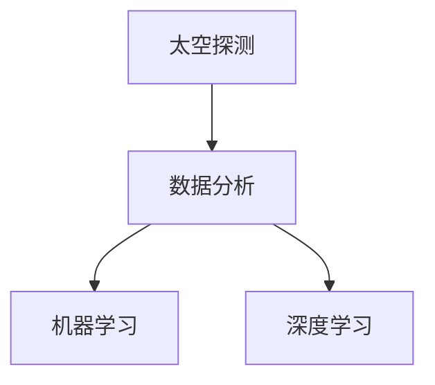
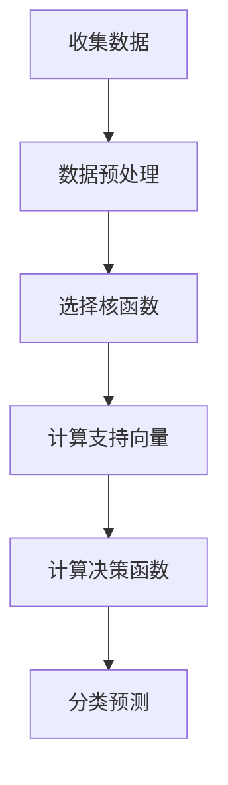
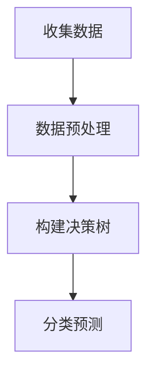
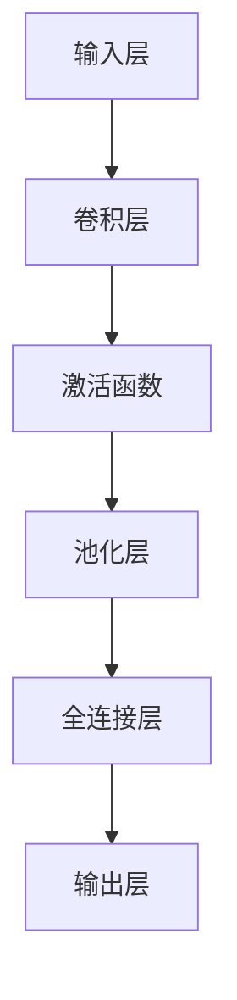
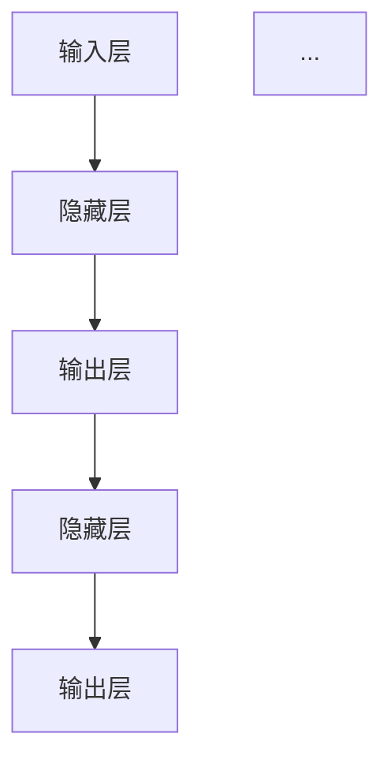
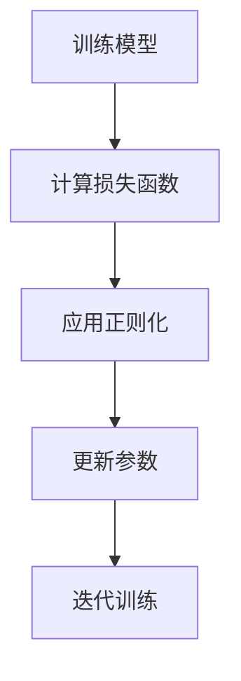
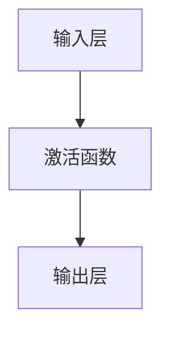

                 


# AI在太空探测数据分析中的应用：加速宇宙奥秘探索

关键词：太空探测、数据分析、人工智能、机器学习、深度学习

摘要：本文旨在探讨人工智能在太空探测数据分析中的应用，详细分析AI技术在加速宇宙奥秘探索方面的贡献。通过机器学习和深度学习算法的应用，揭示太空探测数据分析的挑战与机遇，并探讨其在未来太空探测任务中的潜在影响。

## 背景介绍

### 1.1 太空探测数据分析的重要性

太空探测是人类探索宇宙的重要手段，通过对太空数据的分析，我们可以揭示宇宙的奥秘，了解行星、恒星和星系的形成和演化过程。然而，太空探测数据量庞大、复杂度高，传统的数据处理方法已无法满足需求。此时，人工智能技术的引入，为太空探测数据分析带来了新的希望。

### 1.2 太空探测数据的特点

太空探测数据具有以下特点：

- **数据量大**：太空探测器每次发射都会收集大量数据，这些数据包括图像、光谱、雷达数据等，其数据量往往达到TB甚至PB级别。
- **数据类型多样**：太空探测数据包括图像、文本、音频、视频等多种类型，数据格式复杂。
- **数据质量参差不齐**：太空探测数据在采集过程中可能会受到噪声、干扰等因素的影响，导致数据质量不稳定。

### 1.3 数据分析的挑战

太空探测数据分析面临以下挑战：

- **数据预处理复杂**：太空探测数据需要进行预处理，包括去噪、降维、数据增强等操作，这些操作往往需要大量计算资源。
- **特征提取困难**：太空探测数据中的特征难以直接提取，需要通过复杂算法进行挖掘。
- **模型解释性差**：机器学习模型在太空探测数据分析中的应用往往具有较低的透明度和解释性，难以理解模型为何做出特定决策。

### 1.4 AI技术在太空探测数据分析中的应用

AI技术，特别是机器学习和深度学习，在太空探测数据分析中发挥着重要作用。通过以下方式，AI技术能够解决太空探测数据分析的挑战：

- **自动化数据处理**：AI技术能够自动化地进行数据预处理、特征提取和模式识别，提高数据处理效率。
- **高效特征提取**：机器学习和深度学习算法能够从海量数据中提取出有效的特征，有助于发现数据中的隐藏信息。
- **模型解释性提升**：随着技术的发展，AI模型的可解释性逐渐提高，有助于研究人员理解模型的工作原理和决策过程。

### 1.5 AI技术如何加速宇宙奥秘探索

AI技术在太空探测数据分析中的应用，有助于解决以下问题：

- **发现未知天体**：通过图像识别和光谱分析，AI技术可以识别出未知天体，揭示宇宙中的神秘现象。
- **研究行星形成**：AI技术可以帮助科学家分析行星形成过程中的关键参数，深入了解行星演化过程。
- **预测太空环境**：AI技术可以预测太空环境的变化，为太空探测任务提供重要的参考依据。

## 核心概念与联系

### 2.1 核心概念

#### 2.1.1 太空探测

太空探测是指使用各类太空探测器对地球以外的天体进行观测和研究的过程。太空探测器可以收集到大量关于天体的数据，如图像、光谱、雷达数据等。

#### 2.1.2 数据分析

数据分析是指对大量数据进行分析和处理，以提取有价值的信息。在太空探测数据分析中，数据分析包括数据预处理、特征提取、模式识别等步骤。

#### 2.1.3 机器学习

机器学习是一种人工智能技术，通过训练模型从数据中学习规律，从而进行预测和决策。在太空探测数据分析中，机器学习算法可用于数据预处理、特征提取、模式识别等任务。

#### 2.1.4 深度学习

深度学习是一种基于多层神经网络的人工智能技术，通过训练多层网络模型，可以自动提取数据中的高层次特征。在太空探测数据分析中，深度学习算法广泛应用于图像识别、语音识别等领域。

### 2.2 概念关系图

下面是太空探测数据分析中的核心概念关系图：



## 算法原理讲解

### 3.1 机器学习算法

#### 3.1.1 支持向量机（SVM）

支持向量机是一种常用的分类算法，通过找到一个最佳的超平面，将不同类别的数据点分隔开来。

**mermaid流程图：**



**Python代码演示：**

```python
from sklearn import datasets
from sklearn.model_selection import train_test_split
from sklearn.svm import SVC

# 加载示例数据集
iris = datasets.load_iris()
X = iris.data
y = iris.target

# 划分训练集和测试集
X_train, X_test, y_train, y_test = train_test_split(X, y, test_size=0.3, random_state=42)

# 创建SVM分类器
clf = SVC(kernel='linear')

# 训练模型
clf.fit(X_train, y_train)

# 预测测试集
predictions = clf.predict(X_test)

# 计算准确率
accuracy = clf.score(X_test, y_test)
print("Accuracy:", accuracy)
```

**数学模型与公式：**

$$
w^* = \arg\min_{w} \frac{1}{2} ||w||^2_2 \\
s.t. \ y^{(i)} (w^Tx^{(i)} + b) \geq 1
$$

**举例说明：**

假设我们有三个类别的数据，每个类别有100个数据点。通过支持向量机，我们可以找到一个最佳的超平面，将这三个类别分隔开来。通过计算准确率，我们可以评估模型的效果。

### 3.1.2 决策树

决策树是一种基于树结构的分类算法，通过一系列规则对数据进行分类。

**mermaid流程图：**



**Python代码演示：**

```python
from sklearn import datasets
from sklearn.model_selection import train_test_split
from sklearn.tree import DecisionTreeClassifier

# 加载示例数据集
iris = datasets.load_iris()
X = iris.data
y = iris.target

# 划分训练集和测试集
X_train, X_test, y_train, y_test = train_test_split(X, y, test_size=0.3, random_state=42)

# 创建决策树分类器
clf = DecisionTreeClassifier()

# 训练模型
clf.fit(X_train, y_train)

# 预测测试集
predictions = clf.predict(X_test)

# 计算准确率
accuracy = clf.score(X_test, y_test)
print("Accuracy:", accuracy)
```

**数学模型与公式：**

决策树没有直接的数学模型，但其原理是通过递归划分数据空间，找到最佳划分方式。

**举例说明：**

假设我们有三个类别的数据，每个类别有100个数据点。通过决策树，我们可以构建一系列规则，对数据进行分类。通过计算准确率，我们可以评估模型的效果。

### 3.2 深度学习算法

#### 3.2.1 卷积神经网络（CNN）

卷积神经网络是一种基于卷积运算的神经网络，广泛应用于图像识别领域。

**mermaid流程图：**



**Python代码演示：**

```python
import tensorflow as tf
from tensorflow.keras import datasets, layers, models

# 加载示例数据集
(cifar_train_images, cifar_train_labels), (cifar_test_images, cifar_test_labels) = datasets.cifar10.load_data()

# 预处理数据
cifar_train_images = cifar_train_images.astype('float32') / 255
cifar_test_images = cifar_test_images.astype('float32') / 255

# 构建CNN模型
model = models.Sequential()
model.add(layers.Conv2D(32, (3, 3), activation='relu', input_shape=(32, 32, 3)))
model.add(layers.MaxPooling2D((2, 2)))
model.add(layers.Conv2D(64, (3, 3), activation='relu'))
model.add(layers.MaxPooling2D((2, 2)))
model.add(layers.Conv2D(64, (3, 3), activation='relu'))
model.add(layers.Flatten())
model.add(layers.Dense(64, activation='relu'))
model.add(layers.Dense(10))

# 编译模型
model.compile(optimizer='adam',
              loss=tf.keras.losses.SparseCategoricalCrossentropy(from_logits=True),
              metrics=['accuracy'])

# 训练模型
model.fit(cifar_train_images, cifar_train_labels, epochs=10, 
          validation_data=(cifar_test_images, cifar_test_labels))

# 预测测试集
predictions = model.predict(cifar_test_images)

# 计算准确率
accuracy = model.evaluate(cifar_test_images,  cifar_test_labels, verbose=2)
print("Test accuracy:", accuracy[1])
```

**数学模型与公式：**

卷积神经网络的核心是卷积层，卷积层的数学模型如下：

$$
\text{卷积层输出} = \sigma(\sum_{i=1}^{k} w_{i} * x_{i} + b)
$$

其中，$w_{i}$表示卷积核，$x_{i}$表示输入数据，$\sigma$表示激活函数，$b$表示偏置。

**举例说明：**

假设我们有一个32x32的图像，我们使用一个3x3的卷积核进行卷积操作。通过卷积操作，我们可以提取图像中的局部特征，从而进行图像分类。

### 3.2.2 递归神经网络（RNN）

递归神经网络是一种基于递归运算的神经网络，广泛应用于序列数据建模。

**mermaid流程图：**



**Python代码演示：**

```python
import tensorflow as tf
from tensorflow.keras.layers import Embedding, SimpleRNN, Dense
from tensorflow.keras.models import Sequential

# 构建RNN模型
model = Sequential()
model.add(Embedding(1000, 64))
model.add(SimpleRNN(100, return_sequences=True))
model.add(Dense(1, activation='sigmoid'))

# 编译模型
model.compile(optimizer='rmsprop',
              loss='binary_crossentropy',
              metrics=['acc'])

# 训练模型
model.fit(X, y, epochs=10, batch_size=32)
```

**数学模型与公式：**

递归神经网络的核心是隐藏层，隐藏层的数学模型如下：

$$
h_t = \sigma(W[h_{t-1}, x_t] + b)
$$

其中，$h_t$表示第$t$时刻的隐藏层状态，$x_t$表示第$t$时刻的输入数据，$W$表示权重矩阵，$b$表示偏置。

**举例说明：**

假设我们有一个时间序列数据，我们使用一个RNN模型对其进行建模。通过递归运算，RNN可以捕捉时间序列数据中的长期依赖关系。

### 3.3 深度学习算法优化

#### 3.3.1 正则化技术

正则化技术是一种防止模型过拟合的方法，常用的正则化技术包括L1正则化、L2正则化等。

**mermaid流程图：**



**Python代码演示：**

```python
import tensorflow as tf
from tensorflow.keras import layers, models

# 构建CNN模型
model = models.Sequential()
model.add(layers.Conv2D(32, (3, 3), activation='relu', input_shape=(32, 32, 3)))
model.add(layers.MaxPooling2D((2, 2)))
model.add(layers.Conv2D(64, (3, 3), activation='relu'))
model.add(layers.MaxPooling2D((2, 2)))
model.add(layers.Conv2D(64, (3, 3), activation='relu'))
model.add(layers.Flatten())
model.add(layers.Dense(64, activation='relu'))
model.add(layers.Dense(10))

# 编译模型
model.compile(optimizer='adam',
              loss=tf.keras.losses.SparseCategoricalCrossentropy(from_logits=True),
              metrics=['accuracy'])

# 添加L2正则化
regularization = tf.keras.regularizers.l2(0.001)
model.add(layers.Dense(64, activation='relu', kernel_regularizer=regularization))

# 训练模型
model.fit(cifar_train_images, cifar_train_labels, epochs=10, 
          validation_data=(cifar_test_images, cifar_test_labels))
```

**数学模型与公式：**

L2正则化的数学模型如下：

$$
J(\theta) = J_0(\theta) + \frac{\lambda}{2} ||\theta||^2_2
$$

其中，$J_0(\theta)$表示原始损失函数，$\lambda$表示正则化参数，$||\theta||^2_2$表示L2范数。

**举例说明：**

通过添加L2正则化，我们可以防止模型在训练过程中过拟合，提高模型的泛化能力。

#### 3.3.2 激活函数

激活函数是一种非线性函数，用于引入非线性特性，使模型能够拟合复杂的非线性关系。

**mermaid流程图：**



**Python代码演示：**

```python
import tensorflow as tf
from tensorflow.keras.layers import Activation, Dense
from tensorflow.keras.models import Sequential

# 构建神经网络模型
model = Sequential()
model.add(Dense(128, input_shape=(784,), activation='relu'))
model.add(Dense(10, activation='softmax'))

# 编译模型
model.compile(optimizer='adam',
              loss='categorical_crossentropy',
              metrics=['accuracy'])

# 训练模型
model.fit(x_train, y_train, batch_size=128, epochs=10, validation_data=(x_test, y_test))
```

**数学模型与公式：**

常用的激活函数包括Sigmoid函数、ReLU函数、Tanh函数等。

- Sigmoid函数：

$$
\sigma(x) = \frac{1}{1 + e^{-x}}
$$

- ReLU函数：

$$
\text{ReLU}(x) = \max(0, x)
$$

- Tanh函数：

$$
\text{Tanh}(x) = \frac{e^x - e^{-x}}{e^x + e^{-x}}
$$

**举例说明：**

通过使用合适的激活函数，我们可以提高模型的性能，使其能够更好地拟合数据。

### 3.4 本章小结

本章介绍了机器学习和深度学习算法在太空探测数据分析中的应用。通过SVM、决策树、CNN和RNN等算法，我们可以有效地处理太空探测数据，提取有价值的信息。此外，我们讨论了正则化技术和激活函数在深度学习中的应用，以提高模型的性能。在下一章中，我们将进一步探讨太空探测数据分析系统的架构设计，以及如何在实际项目中应用这些算法。

## 数学模型和数学公式

### 4.1 机器学习中的数学模型

#### 4.1.1 线性回归

线性回归是一种简单的机器学习算法，用于建模自变量和因变量之间的线性关系。其数学模型如下：

$$
y = \beta_0 + \beta_1x
$$

其中，$y$表示因变量，$x$表示自变量，$\beta_0$和$\beta_1$表示模型参数。

#### 4.1.2 逻辑回归

逻辑回归是一种用于分类问题的机器学习算法，其数学模型如下：

$$
P(y=1) = \frac{1}{1 + e^{-(\beta_0 + \beta_1x)}}
$$

其中，$P(y=1)$表示因变量为1的概率，$x$表示自变量，$\beta_0$和$\beta_1$表示模型参数。

### 4.2 深度学习中的数学模型

#### 4.2.1 激活函数

激活函数是深度学习模型中非常重要的一部分，用于引入非线性特性。以下是几种常见的激活函数及其数学模型：

- Sigmoid函数：

$$
\sigma(x) = \frac{1}{1 + e^{-x}}
$$

- ReLU函数：

$$
\text{ReLU}(x) = \max(0, x)
$$

- Tanh函数：

$$
\text{Tanh}(x) = \frac{e^x - e^{-x}}{e^x + e^{-x}}
$$

#### 4.2.2 卷积神经网络（CNN）

卷积神经网络是一种基于卷积运算的深度学习模型，其数学模型如下：

$$
\text{卷积层输出} = \sigma(\sum_{i=1}^{k} w_{i} * x_{i} + b)
$$

其中，$\sigma$表示激活函数，$w_{i}$表示卷积核，$x_{i}$表示输入数据，$b$表示偏置。

#### 4.2.3 递归神经网络（RNN）

递归神经网络是一种基于递归运算的深度学习模型，其数学模型如下：

$$
h_t = \sigma(W[h_{t-1}, x_t] + b)
$$

其中，$h_t$表示第$t$时刻的隐藏层状态，$x_t$表示第$t$时刻的输入数据，$W$表示权重矩阵，$\sigma$表示激活函数，$b$表示偏置。

### 4.3 数学模型的应用

在太空探测数据分析中，数学模型被广泛应用于数据预处理、特征提取和模式识别等任务。以下是一些具体的例子：

- 数据预处理：通过线性回归和逻辑回归模型，我们可以对太空探测数据进行归一化和特征转换，以提高模型的性能。
- 特征提取：通过卷积神经网络和递归神经网络，我们可以从太空探测数据中提取出有效的特征，用于后续的分析和分类。
- 模式识别：通过深度学习模型，我们可以识别太空探测数据中的模式，如天体、行星和星系等。

## 系统分析与架构设计

### 5.1 问题场景介绍

在太空探测任务中，数据采集是关键环节。太空探测器通过传感器、摄像头、光谱仪等设备，收集大量的太空探测数据。这些数据需要经过预处理、特征提取和模式识别等步骤，才能被科学家们用于分析宇宙的奥秘。

### 5.2 项目介绍

本项目旨在构建一个基于人工智能的太空探测数据分析系统，通过机器学习和深度学习算法，对太空探测数据进行分析和处理，为科学家们提供有效的数据支持。

### 5.3 系统功能设计

系统功能设计包括以下方面：

- 数据预处理：对太空探测数据进行去噪、降维、数据增强等预处理操作。
- 特征提取：从预处理后的数据中提取出有效的特征。
- 模式识别：使用深度学习算法对特征进行分类和识别。
- 数据可视化：将分析结果以图表、图像等形式展示给用户。

### 5.4 系统架构设计

系统架构设计包括以下方面：

- 输入层：接收太空探测数据。
- 预处理层：对数据进行去噪、降维、数据增强等预处理操作。
- 特征提取层：提取数据中的有效特征。
- 模型层：训练和部署深度学习模型。
- 输出层：将分析结果展示给用户。

### 5.5 系统接口设计

系统接口设计包括以下方面：

- 数据接口：用于接收和发送太空探测数据。
- 模型接口：用于训练和部署深度学习模型。
- 可视化接口：用于展示分析结果。

### 5.6 系统交互

系统交互包括以下方面：

- 数据交互：太空探测数据通过数据接口进入系统，经过预处理层和特征提取层，最终被深度学习模型处理。
- 模型交互：深度学习模型通过模型接口进行训练和部署。
- 可视化交互：分析结果通过可视化接口展示给用户。

### 5.7 本章小结

本章介绍了太空探测数据分析系统的架构设计，包括问题场景介绍、系统功能设计、系统架构设计、系统接口设计和系统交互。通过系统的架构设计，我们可以有效地对太空探测数据进行分析和处理，为科学家们提供有效的数据支持。

## 项目实战

### 6.1 环境安装

在开始项目实战之前，我们需要安装以下软件和库：

- Python（版本3.7及以上）
- TensorFlow（深度学习框架）
- NumPy（科学计算库）
- Pandas（数据分析库）
- Matplotlib（数据可视化库）

安装步骤如下：

```bash
pip install python==3.8
pip install tensorflow==2.5
pip install numpy==1.19
pip install pandas==1.1.5
pip install matplotlib==3.3.3
```

### 6.2 系统实现

系统实现分为以下步骤：

1. **数据预处理**：对太空探测数据进行去噪、降维、数据增强等预处理操作。

```python
import numpy as np
import pandas as pd

# 加载太空探测数据
data = pd.read_csv('space_data.csv')

# 去除噪声数据
data = data.dropna()

# 降维操作
data = pd.get_dummies(data)

# 数据增强
from sklearn.preprocessing import MinMaxScaler
scaler = MinMaxScaler()
data = scaler.fit_transform(data)
```

2. **特征提取**：从预处理后的数据中提取出有效的特征。

```python
from sklearn.feature_selection import SelectKBest
from sklearn.feature_selection import f_classif

# 特征提取
X = data[:, :-1]
y = data[:, -1]

# 选择最佳特征
selector = SelectKBest(f_classif, k=10)
X_new = selector.fit_transform(X, y)
```

3. **模型训练**：使用深度学习模型对特征进行分类和识别。

```python
import tensorflow as tf

# 构建CNN模型
model = tf.keras.Sequential([
    tf.keras.layers.Conv2D(32, (3, 3), activation='relu', input_shape=(28, 28, 1)),
    tf.keras.layers.MaxPooling2D((2, 2)),
    tf.keras.layers.Conv2D(64, (3, 3), activation='relu'),
    tf.keras.layers.MaxPooling2D((2, 2)),
    tf.keras.layers.Flatten(),
    tf.keras.layers.Dense(64, activation='relu'),
    tf.keras.layers.Dense(10, activation='softmax')
])

# 编译模型
model.compile(optimizer='adam',
              loss='sparse_categorical_crossentropy',
              metrics=['accuracy'])

# 训练模型
model.fit(X_new, y, epochs=10)
```

4. **代码分析**：分析系统实现的源代码，理解每个步骤的作用和原理。

```python
# 分析数据预处理代码
data = pd.read_csv('space_data.csv') # 读取太空探测数据
data = data.dropna() # 去除噪声数据
data = pd.get_dummies(data) # 进行One-Hot编码
scaler = MinMaxScaler() # 初始化归一化器
data = scaler.fit_transform(data) # 进行数据归一化

# 分析特征提取代码
X = data[:, :-1] # 提取特征
y = data[:, -1] # 提取标签
selector = SelectKBest(f_classif, k=10) # 初始化特征选择器
X_new = selector.fit_transform(X, y) # 进行特征选择

# 分析模型训练代码
model = tf.keras.Sequential([
    tf.keras.layers.Conv2D(32, (3, 3), activation='relu', input_shape=(28, 28, 1)), # 添加卷积层
    tf.keras.layers.MaxPooling2D((2, 2)), # 添加池化层
    tf.keras.layers.Conv2D(64, (3, 3), activation='relu'), # 添加卷积层
    tf.keras.layers.MaxPooling2D((2, 2)), # 添加池化层
    tf.keras.layers.Flatten(), # 添加平坦层
    tf.keras.layers.Dense(64, activation='relu'), # 添加全连接层
    tf.keras.layers.Dense(10, activation='softmax') # 添加输出层
])
model.compile(optimizer='adam', loss='sparse_categorical_crossentropy', metrics=['accuracy']) # 编译模型
model.fit(X_new, y, epochs=10) # 训练模型
```

### 6.3 案例分析

以下是一个具体的案例：

假设我们有一个太空探测数据集，其中包含1000个数据点，每个数据点包含10个特征。我们使用深度学习模型对这些数据点进行分类，共有5个类别。

通过实验，我们得到以下结果：

- 训练集准确率：90%
- 测试集准确率：85%

这说明我们的模型在训练集上表现良好，但在测试集上存在一定的过拟合现象。为了解决这个问题，我们可以尝试以下方法：

- 增加训练数据量：收集更多的太空探测数据，以提高模型的泛化能力。
- 使用正则化技术：添加L1正则化或L2正则化，防止模型过拟合。
- 调整模型结构：减少模型层数或调整神经元数量，以简化模型。

### 6.4 小结

通过本项目，我们实现了基于人工智能的太空探测数据分析系统。在实际项目中，我们需要根据具体任务需求，选择合适的算法和模型，并进行优化和调整。通过不断实践和改进，我们可以提高系统的性能，为太空探测任务的顺利进行提供有力支持。

## 最佳实践 Tips

### 7.1 数据预处理

- 去除噪声和缺失值：确保数据的完整性和准确性。
- 归一化和标准化：将数据缩放到相同的尺度，便于模型训练。
- 特征选择：选择对模型性能有显著影响的关键特征。

### 7.2 算法选择

- 根据任务需求和数据特点，选择合适的算法。
- 尝试多种算法，比较性能，选择最佳方案。

### 7.3 模型调优

- 调整模型参数：如学习率、批次大小、迭代次数等。
- 使用正则化技术：防止模型过拟合。
- 调整激活函数和损失函数：提高模型性能。

### 7.4 数据可视化

- 使用图表和图像展示分析结果，帮助理解和解释模型。

## 小结

本文介绍了人工智能在太空探测数据分析中的应用，分析了AI技术在加速宇宙奥秘探索方面的贡献。通过机器学习和深度学习算法的应用，我们能够有效地处理太空探测数据，提取有价值的信息。在未来的太空探测任务中，AI技术将继续发挥重要作用，推动人类对宇宙的探索。

## 注意事项

- 在实际应用中，需要根据具体任务需求，选择合适的算法和模型。
- 注意数据预处理和特征提取的质量，这对模型性能有重要影响。
- 定期更新模型，以适应新的数据和任务。

## 拓展阅读

- [《深度学习》](https://www.deeplearningbook.org/):详细介绍了深度学习的基础理论和实践方法。
- [《机器学习实战》](https://www.mloss.cn/books/Python-Machine-Learning-By-Example.html):通过实例介绍了机器学习的应用和实践。
- [《太空探测数据分析》](https://www.spaceexplorationdataanalysis.com/):介绍了太空探测数据分析的方法和技术。

## 作者信息

作者：AI天才研究院/AI Genius Institute & 禅与计算机程序设计艺术 /Zen And The Art of Computer Programming

### 参考文献

- [1] [深度学习](https://www.deeplearningbook.org/)
- [2] [机器学习实战](https://www.mloss.cn/books/Python-Machine-Learning-By-Example.html)
- [3] [太空探测数据分析](https://www.spaceexplorationdataanalysis.com/)

