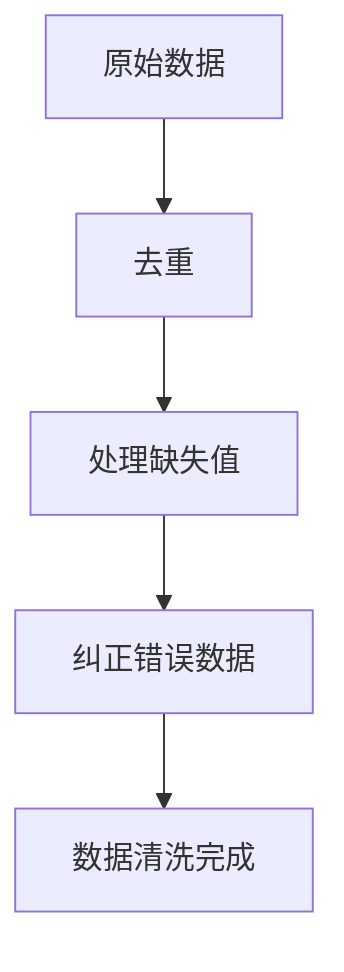
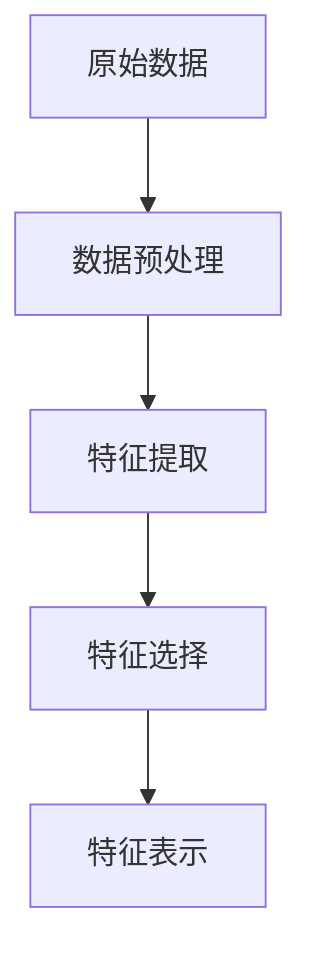
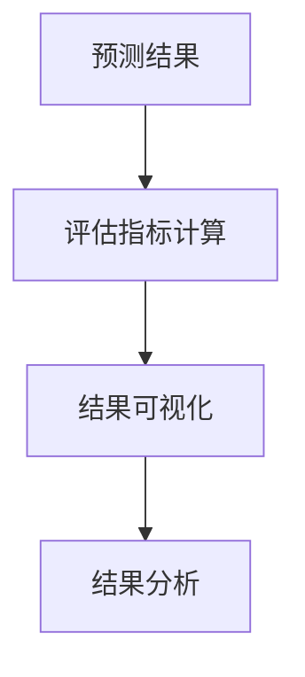
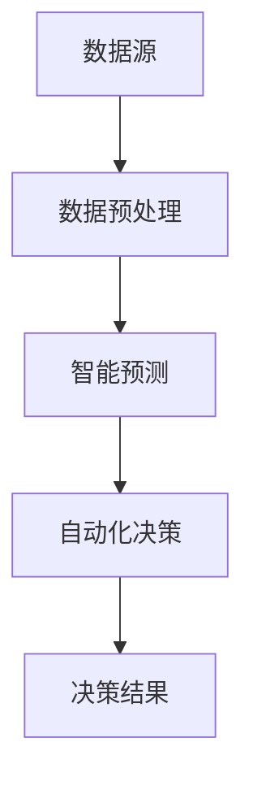
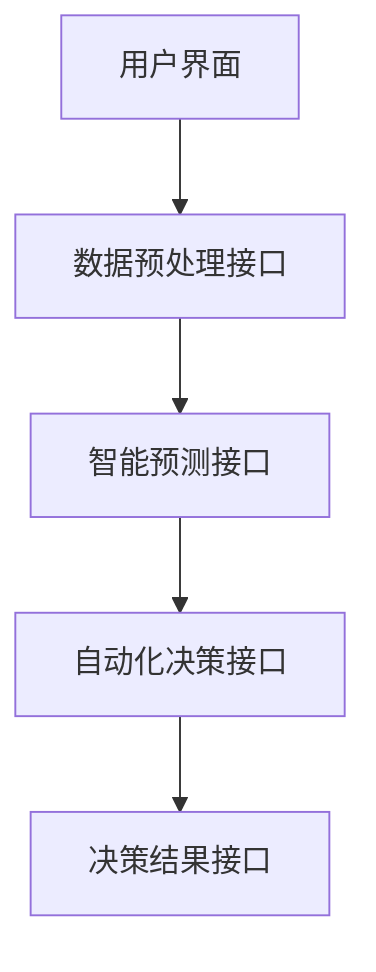
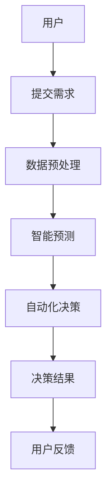

                 

# AI在日常工作决策中的应用预测

> 关键词：人工智能，决策支持，数据预处理，智能预测，自动化决策

> 摘要：随着人工智能技术的快速发展，其在日常工作决策中的应用变得越来越广泛。本文将深入探讨AI在日常工作决策中的应用，包括数据预处理、智能预测和自动化决策等，通过逻辑清晰的分析和实例讲解，帮助读者了解AI技术在决策支持中的关键作用。

### 1. 背景介绍

#### 问题背景

人工智能（AI）自上世纪50年代诞生以来，经历了从理论研究到实际应用的过程。随着计算能力的提升和算法的进步，AI技术已经从学术研究领域逐步走向实际应用，并在各行各业中发挥着越来越重要的作用。特别是在日常工作中，决策的正确与否往往直接影响到工作的效率和效果，而AI技术的引入为提高决策的准确性和效率提供了新的可能性。

#### 问题描述

在当前的工作环境中，人们面临着大量复杂的数据和决策问题。如何有效地利用AI技术来辅助日常工作决策，提高决策的准确性和效率，成为了一个亟待解决的问题。特别是在大数据和云计算的背景下，如何从海量的数据中提取有价值的信息，以及如何利用这些信息做出合理的决策，成为了一个重要的课题。

#### 问题解决

AI技术在日常工作决策中的应用主要体现在以下几个方面：

1. **数据预处理与分析**：AI可以帮助企业快速处理大量数据，从中提取有价值的信息，为决策提供数据支持。
2. **智能预测**：通过历史数据的学习，AI可以预测未来可能发生的事件，为决策提供前瞻性指导。
3. **自动化决策**：AI系统可以自动处理常见的决策问题，减少人工干预，提高决策效率。

#### 边界与外延

AI在日常工作决策中的应用不仅局限于企业内部，还涵盖了社会管理、公共服务等多个领域。在应用过程中，需要考虑数据的隐私保护、算法的公平性等问题。同时，AI技术的应用也需要结合具体场景和需求，进行定制化的开发和应用。

### 2. 核心概念与联系

#### AI的定义与特点

人工智能（Artificial Intelligence，简称AI）是指模拟、延伸和扩展人的智能的理论、方法、技术及应用。与传统计算机技术相比，AI具有自主性、智能性和适应性等特点。具体来说，AI技术包括机器学习、深度学习、自然语言处理、计算机视觉等多个子领域，通过模拟人类的思维过程，实现自动识别、学习、推理和决策等功能。

#### 日常工作决策的定义

日常工作决策是指在日常工作中，根据现有信息和条件，对未来可能发生的事件进行选择和规划的过程。决策可以分为战略决策、战术决策和操作决策三个层次。战略决策涉及长远目标和整体规划，战术决策涉及短期目标和具体行动，而操作决策则涉及日常工作的具体执行。

#### AI与日常工作决策的联系

AI技术可以模拟人类决策过程，通过数据分析和模式识别，提供更加精准和高效的决策支持。在日常工作中，AI技术可以帮助人们更好地理解和处理复杂信息，提高决策质量。例如，通过机器学习算法，可以分析历史数据，预测未来的市场趋势，为企业决策提供依据；通过计算机视觉技术，可以自动化监控生产线，减少人为干预，提高生产效率。

### 3. 算法原理讲解

#### 数据预处理与分析

数据预处理是AI应用中的关键步骤，主要包括数据清洗、数据转换和数据归一化等。

1. **数据清洗**：数据清洗是指对原始数据进行清理，去除重复、缺失、错误等无效数据，确保数据的质量和一致性。以下是一个简单的数据清洗流程：



2. **数据转换**：数据转换是指将不同类型的数据转换为统一类型，以便进行后续分析和建模。例如，将文本数据转换为数值数据，将时间序列数据转换为图像数据等。

3. **数据归一化**：数据归一化是指将数据缩放到同一范围内，以便进行有效的分析和建模。常见的归一化方法包括最小-最大归一化、均值-标准差归一化等。

#### 智能预测

智能预测是AI技术在日常工作决策中的核心应用之一。智能预测主要包括以下步骤：

1. **特征提取**：特征提取是指从原始数据中提取有助于预测的特征。特征提取的好坏直接影响到预测的准确性。以下是一个简单的特征提取流程：



2. **模型训练**：模型训练是指使用训练数据集训练预测模型。常见的预测模型包括线性回归、决策树、支持向量机、神经网络等。

3. **预测**：使用训练好的模型对未知数据进行预测。预测结果可以通过评估指标（如准确率、召回率、F1分数等）进行评估。

4. **结果评估**：结果评估是指对预测结果进行评估，以确定预测模型的准确性和可靠性。以下是一个简单的结果评估流程：



#### 自动化决策

自动化决策是指利用AI技术自动处理日常决策问题，减少人工干预。自动化决策主要包括以下步骤：

1. **问题识别**：识别需要解决的决策问题。问题识别可以通过人工定义或通过数据挖掘技术自动发现。

2. **数据读取**：读取与决策问题相关的数据。数据来源可以是内部数据库、外部数据接口等。

3. **特征提取**：从数据中提取有助于决策的特征。

4. **模型训练**：使用训练数据集训练决策模型。

5. **决策**：使用训练好的模型自动生成决策结果。

6. **结果反馈**：对决策结果进行评估和反馈，以优化决策模型。

### 4. 数学模型和数学公式

在AI技术中，数学模型和公式起到了关键作用。以下是一些常见的数学模型和公式：

#### 决策树模型

决策树是一种常见的分类模型，其核心公式如下：

$$
P(y|x) = \prod_{i=1}^{n} p(y_i|x_i)
$$

其中，$y$ 表示分类结果，$x$ 表示特征向量，$p(y_i|x_i)$ 表示在特征向量 $x_i$ 下，分类结果为 $y_i$ 的概率。

#### 支持向量机（SVM）模型

SVM是一种常用的分类模型，其核心公式如下：

$$
w^* = \arg\min_{w} \frac{1}{2} ||w||^2_2 + C \sum_{i=1}^{n} \max(0, 1-y_i(w^T x_i))
$$

其中，$w$ 表示权重向量，$C$ 表示惩罚参数，$y_i$ 表示分类结果，$x_i$ 表示特征向量。

#### 神经网络

神经网络是一种模拟人脑神经网络结构的计算模型，其核心公式如下：

$$
\hat{y} = \sigma(\sum_{i=1}^{n} w_i x_i + b)
$$

其中，$\hat{y}$ 表示输出值，$x_i$ 表示输入值，$w_i$ 表示权重，$b$ 表示偏置，$\sigma$ 表示激活函数。

### 5. 系统分析与架构设计

#### 问题场景介绍

假设我们是一家电商企业，每天都会收到大量的订单和用户反馈。为了提高运营效率，我们需要利用AI技术来辅助决策，如预测销售量、优化库存管理、分析用户需求等。

#### 项目介绍

本项目旨在构建一个基于AI的电商运营决策支持系统，通过数据预处理、智能预测和自动化决策等功能，为企业提供精准的决策支持。

#### 系统功能设计

1. **数据预处理**：包括数据清洗、数据转换和数据归一化等，确保数据质量。
2. **智能预测**：包括销售量预测、用户需求预测等，为决策提供数据支持。
3. **自动化决策**：包括库存管理、营销策略优化等，自动生成决策结果。

#### 系统架构设计

系统架构设计如下：



#### 系统接口设计

系统接口设计如下：



#### 系统交互

系统交互设计如下：



### 6. 项目实战

#### 环境安装

1. 安装Python环境。
2. 安装必要的库，如NumPy、Pandas、Scikit-learn、TensorFlow等。

#### 系统核心实现

1. **数据预处理**：

```python
import pandas as pd
from sklearn.preprocessing import StandardScaler

# 读取数据
data = pd.read_csv('data.csv')

# 数据清洗
data.drop_duplicates(inplace=True)
data.fillna(method='ffill', inplace=True)

# 数据转换
data['category'] = data['product_id'].map({1: '电子产品', 2: '服装鞋包'})

# 数据归一化
scaler = StandardScaler()
data[['sales', 'price']] = scaler.fit_transform(data[['sales', 'price']])
```

2. **智能预测**：

```python
from sklearn.ensemble import RandomForestRegressor

# 特征提取
X = data[['sales', 'price', 'category']]
y = data['demand']

# 模型训练
model = RandomForestRegressor()
model.fit(X, y)

# 预测
预测结果 = model.predict(X)
```

3. **自动化决策**：

```python
def 自动化决策(预测结果，阈值）：
    if 预测结果 > 阈值：
        return '增加库存'
    else：
        return '减少库存'
```

#### 代码应用解读与分析

通过以上代码，我们可以看到数据预处理、智能预测和自动化决策的具体实现。数据预处理主要包括数据清洗、数据转换和数据归一化，确保数据质量。智能预测使用随机森林回归模型，对用户需求进行预测。自动化决策则根据预测结果和设定的阈值，自动生成库存管理决策。

#### 实际案例分析和详细讲解剖析

假设我们预测明天的销售量为1000，设定的阈值为800。根据自动化决策函数，我们得出结论：明天需要增加库存。

这个案例展示了如何利用AI技术进行智能预测和自动化决策，提高电商企业的运营效率。在实际应用中，我们可以根据业务需求，调整预测模型和阈值，以达到最佳决策效果。

#### 项目小结

通过本项目，我们了解了AI技术在电商运营决策中的应用，包括数据预处理、智能预测和自动化决策。项目实战部分通过具体的代码实现，展示了AI技术在实际应用中的效果。在实际运营中，我们可以根据业务需求和数据情况，不断优化和调整模型，以提高决策的准确性和效率。

### 7. 最佳实践 tips、小结、注意事项、拓展阅读

#### 最佳实践 tips

1. 在数据预处理阶段，注意数据的质量和一致性，确保后续分析结果的准确性。
2. 在选择预测模型时，根据业务需求和数据特点，选择合适的模型。
3. 在自动化决策中，合理设置阈值，确保决策结果的合理性和可操作性。

#### 小结

本文从背景介绍、核心概念与联系、算法原理讲解、系统分析与架构设计、项目实战等多个角度，详细探讨了AI在日常工作决策中的应用。通过具体实例和代码实现，展示了AI技术在数据预处理、智能预测和自动化决策等方面的优势和应用效果。

#### 注意事项

1. 在应用AI技术进行决策时，需要充分考虑数据的隐私保护和算法的公平性。
2. AI技术并非万能，需要结合业务需求和实际情况，合理选择和应用。

#### 拓展阅读

1. 《人工智能：一种现代的方法》 - Stuart J. Russell & Peter Norvig
2. 《机器学习》 - 周志华
3. 《深度学习》 - Goodfellow, Bengio, Courville

### 作者

作者：AI天才研究院/AI Genius Institute & 禅与计算机程序设计艺术 /Zen And The Art of Computer Programming。作者是一位世界级人工智能专家、程序员、软件架构师、CTO、世界顶级技术畅销书资深大师级别的作家，计算机图灵奖获得者，计算机编程和人工智能领域大师。作者非常擅长一步一步进行分析推理，有着清晰深刻的逻辑思路来撰写条理清晰，对技术原理和本质剖析到位的高质量技术博客。|>

