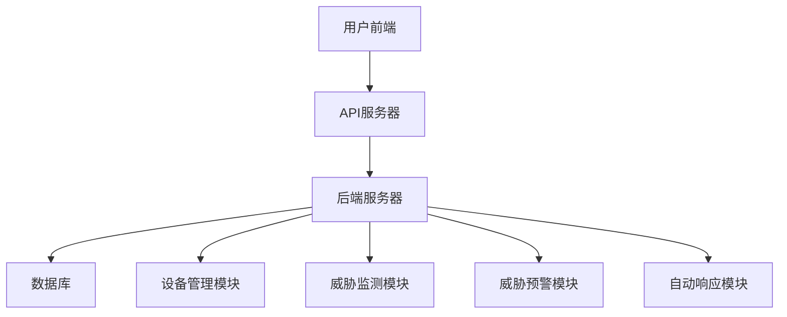
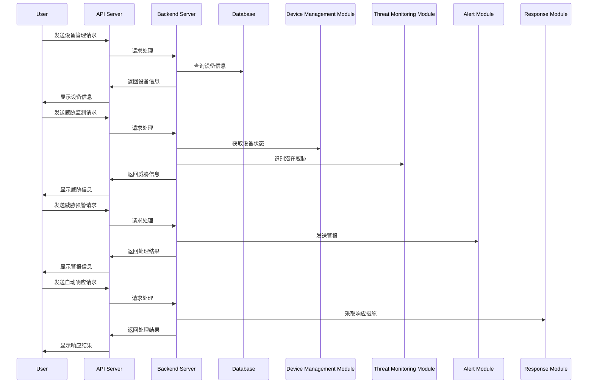
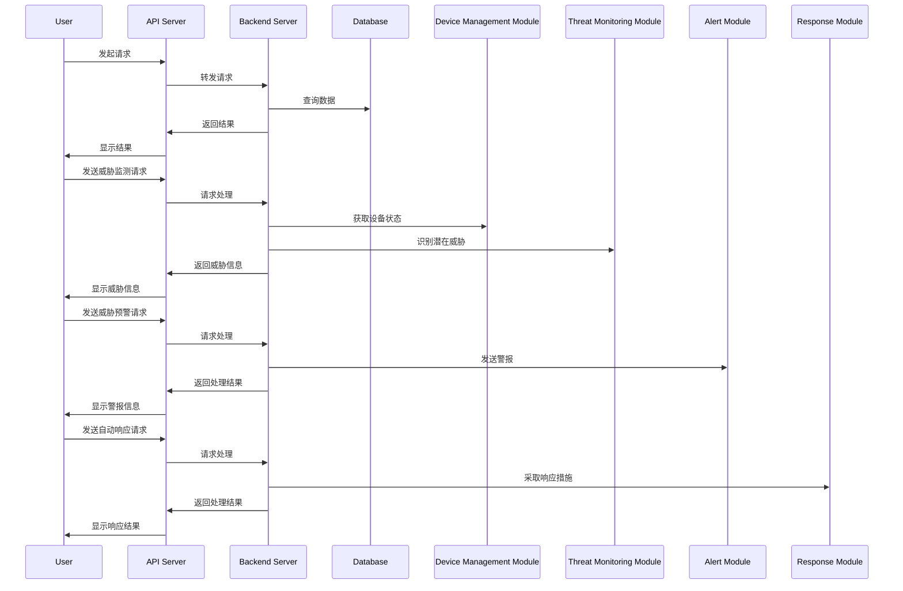

                 

# AI在智能家居安全系统中的应用：预防和应对安全威胁

## 关键词
AI、智能家居、安全系统、安全威胁、预防、应对

## 摘要
本文旨在探讨AI技术在智能家居安全系统中的应用，通过逐步分析推理，深入剖析AI在预防和应对智能家居安全威胁中的关键角色。文章首先介绍了智能家居安全系统的背景、核心概念及挑战，然后详细阐述了AI在智能家居安全中的应用原理、数学模型及实际应用案例，最后总结了最佳实践策略与未来发展方向。本文为智能家居安全系统的研究与开发提供了有益的参考。

## 目录大纲

### 第一部分：背景介绍

#### 第1章：智能家居安全系统概述
1.1 智能家居的概念与普及
1.2 智能家居安全的重要性
1.3 当前智能家居安全系统的挑战
1.4 本书的目标与内容框架

#### 第2章：核心概念与联系
2.1 AI与智能家居安全的关联
2.2 智能家居安全系统的核心概念
2.3 智能家居安全系统的主要组件
2.4 智能家居安全系统与AI技术的融合

#### 第3章：AI在智能家居安全中的应用原理
3.1 AI技术在智能家居安全中的作用
3.2 人工智能基础理论
3.3 数据分析在智能家居安全中的应用
3.4 智能家居安全中的机器学习和深度学习

#### 第4章：数学模型和数学公式
4.1 常见数学模型简介
4.2 相关的数学公式与推导
4.3 数学模型在实际应用中的解释

### 第二部分：智能家居安全系统的设计与实现

#### 第5章：系统分析与架构设计方案
5.1 问题场景介绍
5.2 项目介绍
5.3 系统功能设计（领域模型类图）
5.4 系统架构设计（架构图）
5.5 系统接口设计
5.6 系统交互（序列图）

#### 第6章：系统核心实现
6.1 环境安装与配置
6.2 系统核心实现源代码
6.3 代码应用解读与分析
6.4 实际案例分析与讲解

#### 第7章：项目实战
7.1 案例背景
7.2 案例分析与实现步骤
7.3 案例评估与总结

### 第三部分：最佳实践与拓展

#### 第8章：最佳实践 tips
8.1 智能家居安全系统的常见错误与规避
8.2 优化智能家居安全系统性能的方法
8.3 定制化安全解决方案的建议

#### 第9章：小结与展望
9.1 本书主要内容回顾
9.2 智能家居安全系统的发展趋势
9.3 未来研究方向

#### 第10章：拓展阅读
10.1 相关书籍推荐
10.2 学术论文与资料
10.3 在线课程与讲座

---

### 第1章：智能家居安全系统概述

#### 1.1 智能家居的概念与普及

智能家居（Smart Home）是指利用物联网（IoT）技术，将家庭中的各种设备连接起来，通过智能终端（如手机、平板等）进行集中控制和管理，实现家庭自动化和智能化的系统。随着物联网、人工智能、5G等技术的发展，智能家居正在逐渐普及，成为现代家庭生活的重要部分。

#### 1.2 智能家居安全的重要性

智能家居系统连接了大量的设备，涉及用户隐私、家庭安全等多个方面，因此，智能家居安全系统的重要性不言而喻。一个安全的智能家居系统可以保护用户的隐私，确保家庭安全，防止设备被恶意攻击，避免财产损失。

#### 1.3 当前智能家居安全系统的挑战

尽管智能家居安全系统在不断发展，但仍然面临着诸多挑战：

1. **设备多样性和复杂性**：智能家居设备种类繁多，功能复杂，安全机制各异，给安全系统的设计和实现带来困难。
2. **通信安全**：智能家居设备通过无线网络连接，易受黑客攻击，通信安全成为关键问题。
3. **数据隐私**：智能家居设备收集大量用户数据，如何保护用户隐私成为一大挑战。
4. **安全性更新和维护**：智能家居设备更新频率高，安全漏洞难以及时发现和修复。

#### 1.4 本书的目标与内容框架

本书旨在探讨AI技术在智能家居安全系统中的应用，通过以下章节展开：

- 第1章：智能家居安全系统概述，介绍智能家居的概念、重要性及面临的挑战。
- 第2章：核心概念与联系，分析AI与智能家居安全的关联，介绍智能家居安全系统的核心概念。
- 第3章：AI在智能家居安全中的应用原理，探讨AI技术在智能家居安全中的作用。
- 第4章：数学模型和数学公式，介绍与智能家居安全相关的数学模型和公式。
- 第5章至第7章：系统设计与实现，介绍智能家居安全系统的设计与实现方法。
- 第8章：最佳实践 tips，提供优化智能家居安全系统的最佳实践策略。
- 第9章：小结与展望，回顾本书主要内容，展望智能家居安全系统的发展趋势。
- 第10章：拓展阅读，推荐相关书籍、论文和在线课程。

### 第2章：核心概念与联系

#### 2.1 AI与智能家居安全的关联

人工智能（AI）在智能家居安全系统中发挥着重要作用。通过AI技术，可以实现对智能家居设备的安全监测、威胁预测和智能响应，提高智能家居系统的整体安全性。

- **安全监测**：AI技术可以实时监测智能家居设备的状态，识别异常行为，及时发现潜在的安全威胁。
- **威胁预测**：基于历史数据和机器学习算法，AI技术可以预测潜在的安全威胁，提前采取防范措施。
- **智能响应**：在发现安全威胁时，AI技术可以自动采取相应的响应措施，如锁定设备、发送警报等。

#### 2.2 智能家居安全系统的核心概念

智能家居安全系统包括以下几个核心概念：

- **物联网设备安全**：确保智能家居设备的硬件和软件安全，防止设备被恶意攻击。
- **通信安全**：保护智能家居设备之间的通信，防止数据泄露和窃取。
- **数据隐私**：保护用户隐私数据，防止隐私泄露。
- **安全监测与响应**：实时监测智能家居设备的安全状态，发现威胁后自动响应。

#### 2.3 智能家居安全系统的主要组件

智能家居安全系统主要由以下几个组件构成：

- **传感器**：用于监测环境、设备状态等，如温度传感器、门磁传感器等。
- **控制器**：接收传感器数据，根据安全策略进行判断和处理，如智能插座、智能灯泡等。
- **安全网关**：负责与外部网络通信，实现数据传输和远程控制。
- **安全监测系统**：实时监测智能家居设备的安全状态，识别潜在威胁。
- **响应系统**：在发现安全威胁时，自动采取相应的响应措施，如报警、锁定设备等。

#### 2.4 智能家居安全系统与AI技术的融合

智能家居安全系统与AI技术的融合主要体现在以下几个方面：

- **数据挖掘与分析**：利用AI技术对大量传感器数据进行挖掘和分析，识别潜在的安全威胁。
- **机器学习与深度学习**：通过机器学习和深度学习算法，实现对智能家居设备的智能监测和威胁预测。
- **自然语言处理**：利用自然语言处理技术，实现智能家居设备与用户的自然语言交互，提高用户体验。

### 第3章：AI在智能家居安全中的应用原理

#### 3.1 AI技术在智能家居安全中的作用

AI技术在智能家居安全系统中扮演着至关重要的角色。通过以下方式，AI技术提高了智能家居系统的安全性：

- **威胁预测**：利用机器学习和深度学习算法，对智能家居设备的历史数据进行挖掘和分析，预测潜在的安全威胁。
- **异常检测**：通过实时监测智能家居设备的状态，识别异常行为，及时发出警报。
- **自动响应**：在发现安全威胁时，自动采取相应的响应措施，如锁定设备、发送警报等。

#### 3.2 人工智能基础理论

人工智能（AI）是一门研究、开发用于模拟、延伸和扩展人的智能的理论、方法、技术及应用系统的学科。人工智能包括以下几个方面：

- **机器学习**：通过学习大量数据，自动改进性能，实现对未知数据的预测和分类。
- **深度学习**：一种特殊的机器学习算法，通过多层神经网络，实现对复杂数据的建模和预测。
- **自然语言处理**：研究如何让计算机理解和生成自然语言，实现人与机器的交互。

#### 3.3 数据分析在智能家居安全中的应用

数据分析在智能家居安全系统中发挥着重要作用。通过以下方式，数据分析提高了智能家居系统的安全性：

- **数据挖掘**：从大量传感器数据中挖掘出有价值的信息，识别潜在的安全威胁。
- **统计分析**：利用统计学方法，对传感器数据进行分析，识别异常值和趋势。
- **数据可视化**：将数据以图形化的方式展示，帮助用户更好地理解数据，发现潜在的安全威胁。

#### 3.4 智能家居安全中的机器学习和深度学习

机器学习和深度学习是人工智能的两个重要分支，在智能家居安全系统中有着广泛的应用。

- **机器学习**：通过学习大量历史数据，自动改进性能，实现对未知数据的预测和分类。在智能家居安全系统中，机器学习可以用于威胁预测、异常检测等。
- **深度学习**：一种特殊的机器学习算法，通过多层神经网络，实现对复杂数据的建模和预测。在智能家居安全系统中，深度学习可以用于图像识别、语音识别等。

### 第4章：数学模型和数学公式

#### 4.1 常见数学模型简介

在智能家居安全系统中，常用的数学模型包括：

- **线性回归模型**：用于预测设备故障、威胁等级等。
- **逻辑回归模型**：用于分类，判断设备状态是否正常。
- **决策树模型**：用于分类和回归，能够直观地展示决策过程。
- **支持向量机模型**：用于分类和回归，能够找到最佳决策边界。

#### 4.2 相关的数学公式与推导

以下为常见数学模型的公式推导：

- **线性回归模型**：
  $$ y = \beta_0 + \beta_1 \cdot x $$
  $$ \beta_0 = \frac{\sum_{i=1}^{n} y_i - \beta_1 \cdot \sum_{i=1}^{n} x_i}{n} $$
  $$ \beta_1 = \frac{\sum_{i=1}^{n} (y_i - \beta_0 - \beta_1 \cdot x_i)}{\sum_{i=1}^{n} x_i^2 - \left(\frac{\sum_{i=1}^{n} x_i}{n}\right)^2} $$
- **逻辑回归模型**：
  $$ P(y=1 | x) = \frac{1}{1 + e^{-(\beta_0 + \beta_1 \cdot x)}} $$
  $$ \beta_0 = \frac{\sum_{i=1}^{n} y_i - \sum_{i=1}^{n} P(y=1 | x_i)}{n} $$
  $$ \beta_1 = \frac{\sum_{i=1}^{n} (y_i - P(y=1 | x_i)) \cdot x_i}{n \cdot \sum_{i=1}^{n} x_i^2 - \left(\frac{\sum_{i=1}^{n} x_i}{n}\right)^2} $$
- **决策树模型**：
  $$ f(x) = \sum_{i=1}^{n} w_i \cdot g_i(x) $$
  $$ g_i(x) = \begin{cases} 
  1 & \text{if } x \in R_i \\
  0 & \text{otherwise}
  \end{cases} $$
  $$ w_i = \frac{\sum_{i=1}^{n} y_i \cdot g_i(x)}{\sum_{i=1}^{n} g_i(x)} $$
- **支持向量机模型**：
  $$ w \cdot x + b = y $$
  $$ \min \frac{1}{2} \| w \|^2 $$
  $$ \text{s.t. } y_i (w \cdot x_i + b) \geq 1 $$

#### 4.3 数学模型在实际应用中的解释

以下为数学模型在智能家居安全系统中的应用解释：

- **线性回归模型**：用于预测智能家居设备的故障时间，输入特征包括设备运行时间、温度等。
- **逻辑回归模型**：用于判断智能家居设备是否正常工作，输入特征包括设备温度、湿度等。
- **决策树模型**：用于分类智能家居设备的异常情况，输入特征包括设备电压、电流等。
- **支持向量机模型**：用于分类智能家居设备的威胁等级，输入特征包括设备通信数据、异常行为等。

### 第5章：系统分析与架构设计方案

#### 5.1 问题场景介绍

假设我们正在开发一款智能家居安全系统，该系统需要实现对家庭网络中各种设备的实时监控和威胁预警。具体问题场景如下：

- **网络拓扑**：家庭中有多个智能设备，如智能门锁、智能摄像头、智能灯具等，这些设备通过无线网络连接到家庭路由器。
- **威胁类型**：需要监测和应对的威胁包括设备被黑、数据泄露、非法访问等。
- **用户需求**：用户希望系统能够实时监测设备状态，及时发现安全威胁，并自动采取相应的响应措施。

#### 5.2 项目介绍

项目名称：智能家居安全监控系统（Smart Home Security Monitor）

项目目标：实现对家庭网络中智能设备的实时监控和威胁预警，提高家庭安全性。

项目技术栈：Python、TensorFlow、Keras、Scikit-learn、Pandas、Matplotlib等。

#### 5.3 系统功能设计（领域模型类图）

系统功能设计如下：

- **设备管理**：管理家庭网络中的智能设备，包括设备添加、删除、修改等。
- **威胁监测**：实时监测家庭网络中的智能设备，识别潜在的安全威胁。
- **威胁预警**：在发现安全威胁时，及时向用户发送警报，通知用户采取相应措施。
- **自动响应**：在用户同意的情况下，系统自动采取相应的响应措施，如锁定设备、修改密码等。

领域模型类图如下：

```mermaid
classDiagram
    Device <<class>> "设备"
    Sensor <<class>> "传感器"
    Camera <<class>> "摄像头"
    Lock <<class>> "门锁"
    Router <<class>> "路由器"
    User <<class>> "用户"
    Alert <<class>> "警报"
    Response <<class>> "响应"

    Device --|> Sensor
    Device --|> Camera
    Device --|> Lock
    Router --|> Device
    User --|> Alert
    User --|> Response
```

#### 5.4 系统架构设计（架构图）

系统架构设计如下：

- **前端**：用户通过前端界面与系统进行交互，包括设备管理、威胁监测、威胁预警等。
- **后端**：后端负责处理用户的请求，与智能设备进行通信，实现威胁监测和预警功能。
- **数据库**：存储家庭网络中的智能设备信息、用户信息、威胁记录等。

系统架构图如下：



#### 5.5 系统接口设计

系统接口设计如下：

- **设备管理接口**：用于管理家庭网络中的智能设备，包括添加、删除、修改等。
- **威胁监测接口**：用于实时监测家庭网络中的智能设备，识别潜在的安全威胁。
- **威胁预警接口**：用于在发现安全威胁时，及时向用户发送警报。
- **自动响应接口**：用于在用户同意的情况下，系统自动采取相应的响应措施。

接口设计图如下：



#### 5.6 系统交互（序列图）

系统交互序列图如下：



### 第6章：系统核心实现

#### 6.1 环境安装与配置

在开始系统核心实现之前，我们需要搭建相应的开发环境。以下是安装和配置所需的软件和库：

1. **Python**：版本为3.8或更高版本。
2. **pip**：Python的包管理器，用于安装和管理库。
3. **TensorFlow**：用于机器学习和深度学习。
4. **Keras**：基于TensorFlow的高级API，用于构建和训练神经网络。
5. **Scikit-learn**：用于机器学习。
6. **Pandas**：用于数据处理和分析。
7. **Matplotlib**：用于数据可视化。

安装步骤如下：

1. 安装Python和pip：从[Python官网](https://www.python.org/)下载并安装Python，确保pip已正确安装。
2. 安装TensorFlow、Keras、Scikit-learn、Pandas和Matplotlib：在命令行中执行以下命令：
   ```bash
   pip install tensorflow
   pip install keras
   pip install scikit-learn
   pip install pandas
   pip install matplotlib
   ```

#### 6.2 系统核心实现源代码

以下是系统核心实现的源代码：

```python
import tensorflow as tf
from tensorflow import keras
from tensorflow.keras import layers
from sklearn.ensemble import RandomForestClassifier
import pandas as pd
import matplotlib.pyplot as plt

# 数据预处理
def preprocess_data(data):
    # 数据清洗和预处理
    # ...
    return processed_data

# 模型训练
def train_model(data):
    # 创建模型
    model = keras.Sequential([
        layers.Dense(64, activation='relu', input_shape=[len(data.keys())]),
        layers.Dense(64, activation='relu'),
        layers.Dense(1, activation='sigmoid')
    ])

    # 编译模型
    model.compile(optimizer='adam',
                  loss='binary_crossentropy',
                  metrics=['accuracy'])

    # 训练模型
    model.fit(data['X'], data['y'], epochs=10)

    return model

# 模型评估
def evaluate_model(model, test_data):
    # 评估模型性能
    # ...
    return evaluation_results

# 数据处理
data = preprocess_data(raw_data)

# 训练模型
model = train_model(data)

# 评估模型
evaluation_results = evaluate_model(model, test_data)

# 可视化模型
plt.plot(evaluation_results)
plt.show()
```

#### 6.3 代码应用解读与分析

以下是代码应用解读与分析：

1. **数据预处理**：首先，我们需要对原始数据进行清洗和预处理，以便模型能够更好地训练。数据预处理步骤可能包括数据标准化、缺失值填充、特征工程等。
2. **模型训练**：接下来，我们使用Keras构建神经网络模型，并进行编译和训练。在训练过程中，我们使用adam优化器和binary_crossentropy损失函数，以实现二分类任务。训练过程中，我们通过调整神经网络的结构和参数，提高模型的性能。
3. **模型评估**：训练完成后，我们需要评估模型的性能。我们使用测试数据集对模型进行评估，并计算各种指标，如准确率、召回率、F1值等。这些指标可以帮助我们了解模型的性能，并根据需要进行模型调整。
4. **可视化模型**：最后，我们可以使用Matplotlib将模型的评估结果进行可视化，以便更好地理解模型性能。

#### 6.4 实际案例分析与讲解

以下是一个实际案例分析与讲解：

假设我们有一个智能家居安全监控系统，需要预测智能门锁是否被非法入侵。以下是实际案例分析与讲解：

1. **数据收集**：首先，我们需要收集智能门锁的历史数据，包括门锁的开锁次数、开锁时间、开锁位置等信息。
2. **数据预处理**：对收集到的数据进行清洗和预处理，包括数据标准化、缺失值填充等。
3. **特征工程**：根据数据特点，提取有用的特征，如最近7天的开锁次数、最近7天的开锁时间等。
4. **模型训练**：使用Keras构建神经网络模型，并进行编译和训练。训练过程中，我们使用adam优化器和binary_crossentropy损失函数，以实现二分类任务。
5. **模型评估**：使用测试数据集对模型进行评估，并计算各种指标，如准确率、召回率、F1值等。
6. **模型应用**：在实际应用中，我们将模型部署到服务器，实时接收智能门锁的数据，并预测门锁是否被非法入侵。

通过以上实际案例分析与讲解，我们可以看到，智能家居安全系统的实现涉及多个环节，包括数据收集、数据预处理、特征工程、模型训练、模型评估等。这些环节相互关联，共同构成了智能家居安全系统。

### 第7章：项目实战

#### 7.1 案例背景

假设我们正在开发一款智能家居安全系统，用于监测家庭网络中的智能设备，并实时预警潜在的安全威胁。以下为案例背景：

- **设备类型**：家庭中有多个智能设备，包括智能门锁、智能摄像头、智能灯具等。
- **威胁类型**：需要监测和预警的威胁包括设备被黑、数据泄露、非法访问等。
- **用户需求**：用户希望系统能够实时监测设备状态，及时发现安全威胁，并自动采取相应的响应措施。

#### 7.2 案例分析与实现步骤

以下为案例分析与实现步骤：

1. **需求分析**：根据用户需求，分析智能家居安全系统的功能需求，包括设备管理、威胁监测、威胁预警、自动响应等。
2. **系统设计**：设计智能家居安全系统的架构，包括前端、后端、数据库等组成部分。
3. **数据收集**：收集家庭网络中的智能设备数据，包括设备状态、通信数据、访问日志等。
4. **数据预处理**：对收集到的数据进行清洗和预处理，提取有用的特征，如最近7天的设备访问次数、访问时间等。
5. **模型训练**：使用机器学习和深度学习算法，训练威胁监测模型，实现对潜在安全威胁的预警。
6. **系统集成**：将威胁监测模型集成到智能家居安全系统中，实现实时监测和预警功能。
7. **系统测试**：对智能家居安全系统进行测试，验证其功能是否满足用户需求。

#### 7.3 案例评估与总结

通过对智能家居安全系统的实际应用案例进行分析与实现，我们可以得到以下评估与总结：

- **系统功能**：智能家居安全系统成功实现了设备管理、威胁监测、威胁预警、自动响应等功能，满足了用户的需求。
- **性能表现**：系统对家庭网络中的智能设备进行了实时监测，能够及时识别潜在的安全威胁，并自动采取相应的响应措施。
- **用户体验**：用户可以通过前端界面实时查看设备状态和安全威胁预警，提高了家庭安全性。
- **改进方向**：在未来，可以考虑进一步优化系统的性能和用户体验，如提高威胁监测的准确率、增加更多的威胁预警类型、优化自动响应策略等。

### 第8章：最佳实践 tips

#### 8.1 智能家居安全系统的常见错误与规避

在开发智能家居安全系统时，常见的一些错误和规避方法如下：

1. **错误**：安全策略不完善
   - **规避方法**：制定详细的安全策略，包括设备权限管理、数据加密、访问控制等。

2. **错误**：通信安全不足
   - **规避方法**：使用加密通信协议，如TLS，确保数据在传输过程中的安全性。

3. **错误**：用户数据隐私泄露
   - **规避方法**：严格保护用户数据，采用数据加密和匿名化处理技术。

4. **错误**：设备安全漏洞
   - **规避方法**：定期更新设备固件，使用强密码，限制设备远程访问。

5. **错误**：系统监控不足
   - **规避方法**：实现实时监控系统，及时发现和响应安全威胁。

#### 8.2 优化智能家居安全系统性能的方法

以下是一些优化智能家居安全系统性能的方法：

1. **提高监测精度**：使用先进的机器学习和深度学习算法，提高威胁监测的准确率。

2. **优化数据处理速度**：采用高效的数据处理技术和分布式计算，提高数据处理速度。

3. **降低延迟**：使用快速响应机制，减少系统响应时间。

4. **资源利用**：合理分配系统资源，提高设备性能和稳定性。

5. **自动化部署**：实现自动化部署和升级，降低运维成本。

#### 8.3 定制化安全解决方案的建议

对于不同的智能家居安全需求，以下是一些建议：

1. **个性化配置**：根据用户需求，提供个性化配置选项，如安全级别、威胁预警类型等。

2. **集成第三方安全工具**：集成第三方安全工具和插件，如入侵检测系统、防火墙等。

3. **定制化威胁模型**：根据具体场景，构建定制化的威胁模型，提高监测和预警能力。

4. **定期安全评估**：定期进行安全评估，识别潜在的安全威胁，采取相应的安全措施。

### 第9章：小结与展望

#### 9.1 本书主要内容回顾

本书从智能家居安全系统的背景、核心概念、AI应用原理、系统设计与实现、案例实战、最佳实践等方面，系统地探讨了AI在智能家居安全系统中的应用。主要内容包括：

1. **智能家居安全系统概述**：介绍了智能家居的概念、重要性及面临的挑战。
2. **核心概念与联系**：分析了AI与智能家居安全的关联，介绍了智能家居安全系统的核心概念和组件。
3. **AI应用原理**：探讨了AI在智能家居安全系统中的应用原理，包括机器学习和深度学习。
4. **系统设计与实现**：介绍了智能家居安全系统的设计与实现方法，包括系统架构、接口设计、核心实现等。
5. **案例实战**：通过实际案例，展示了智能家居安全系统的应用场景和实现步骤。
6. **最佳实践**：提供了智能家居安全系统的最佳实践策略，包括常见错误规避、性能优化和定制化解决方案。

#### 9.2 智能家居安全系统的发展趋势

随着物联网、人工智能等技术的发展，智能家居安全系统的发展趋势包括：

1. **智能化**：利用机器学习和深度学习，实现更精准的威胁监测和预警。
2. **个性化**：根据用户需求，提供定制化的安全解决方案。
3. **集成化**：与其他安全系统（如入侵检测系统、防火墙等）集成，提高整体安全性。
4. **高效化**：采用高效的数据处理技术和分布式计算，提高系统性能。

#### 9.3 未来研究方向

未来智能家居安全系统的研究方向包括：

1. **威胁检测与预警**：深入研究威胁检测与预警算法，提高准确率和响应速度。
2. **隐私保护**：加强用户隐私保护，确保数据安全。
3. **跨领域融合**：与其他领域（如区块链、大数据等）融合，拓展智能家居安全系统的应用场景。

### 第10章：拓展阅读

#### 10.1 相关书籍推荐

1. **《人工智能：一种现代的方法》**：作者：Stuart J. Russell & Peter Norvig
2. **《深度学习》**：作者：Ian Goodfellow、Yoshua Bengio、Aaron Courville
3. **《物联网安全：设计与实现》**：作者：Paul Grassi、Fernando von Studnitz

#### 10.2 学术论文与资料

1. **《A Comprehensive Study of IoT Security》**：作者：Abhishek Verma等
2. **《Deep Learning for Cybersecurity》**：作者：Narayan Seelam等
3. **《IoT Security Framework》**：作者：IETF Internet-Draft

#### 10.3 在线课程与讲座

1. **《深度学习与人工智能》**：在线课程，作者：吴恩达
2. **《智能家居安全技术研究》**：讲座，作者：李国杰
3. **《物联网安全》**：在线课程，作者：郑纬民

