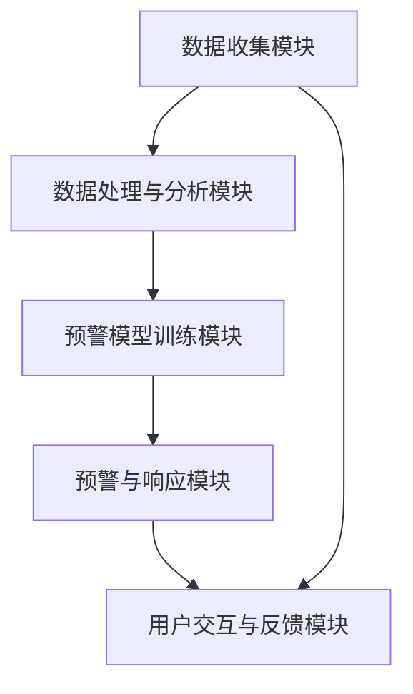
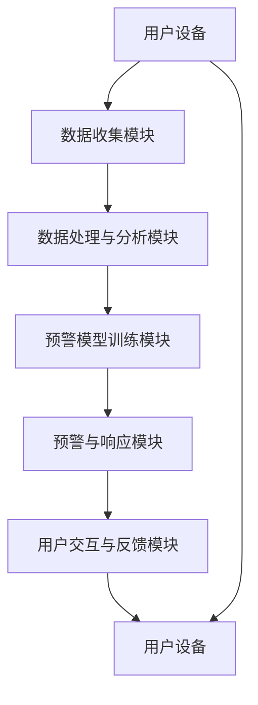
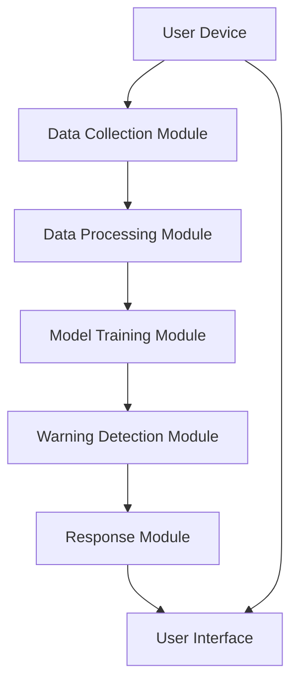

                 

### 问题背景与核心概念

#### 1.1.1 问题背景

随着科技的发展，智能家居逐渐成为现代生活的重要组成部分。智能家居通过将家居设备联网，使用户能够远程控制和自动化管理家庭环境，提高了生活的便利性和舒适度。然而，随着智能家居设备的普及，其安全问题也逐渐凸显。这些设备通常包含了摄像头、智能锁、智能灯泡等，这些设备一旦被黑客入侵，可能会被用于窃取个人隐私、财产盗窃甚至对用户进行敲诈勒索。因此，智能家居的安全预警系统显得尤为重要。

**问题描述**：

智能家居的安全预警系统需要解决以下几个关键问题：

1. **数据收集**：如何有效地收集并整合来自各种智能设备的实时数据？
2. **数据分析**：如何对收集到的海量数据进行分析，以发现潜在的威胁和异常行为？
3. **模型训练**：如何训练出准确可靠的预警模型，以便及时识别并响应潜在的安全威胁？
4. **响应机制**：如何设计一个有效的响应机制，确保在检测到威胁时能够迅速采取行动？

**问题解决**：

针对上述问题，智能家居安全预警系统需要从以下几个方面入手：

1. **构建全面的数据收集系统**：设计一套高效的数据收集机制，涵盖各种智能设备，确保数据的全面性和实时性。
2. **采用先进的数据分析技术**：运用大数据分析和机器学习技术，对收集到的数据进行深度挖掘和分析，识别潜在的安全威胁。
3. **训练高精度的预警模型**：通过不断优化和调整预警模型，提高其准确性和鲁棒性，确保能够准确识别各种潜在威胁。
4. **设计灵活的响应机制**：在检测到威胁时，能够及时发出警报，并通过自动化机制采取相应的安全措施。

#### 1.2 核心概念

**1.2.1 智能家居**

智能家居是一种基于物联网（IoT）技术，通过互联网将家庭中的各种设备连接起来，实现自动化控制和智能化管理的系统。智能家居系统通常包括以下几类设备：

- **智能终端设备**：如智能手机、平板电脑、智能音箱等。
- **智能家电**：如智能空调、智能冰箱、智能灯泡等。
- **智能传感器**：如烟雾传感器、温度传感器、门窗传感器等。
- **智能控制系统**：如智能家居中心、智能网关等。

**1.2.2 安全预警**

安全预警系统是一种通过监测、分析环境中的异常情况，并及时发出警报的智能系统。智能家居安全预警系统的核心目标是：

- **实时监测**：持续监测家庭环境中的各种参数，如温度、湿度、噪音、光线等。
- **数据采集**：收集来自各种传感器的数据，形成完整的数据集。
- **数据分析**：利用大数据和机器学习技术，分析数据中的异常模式和潜在威胁。
- **预警响应**：在检测到异常情况时，及时发出警报，并通过智能控制系统采取相应的响应措施。

**1.2.3 数据收集模块**

数据收集模块是智能家居安全预警系统的关键组成部分，负责从各种智能设备中收集数据。主要涉及以下任务：

- **数据源选择**：确定需要收集的数据类型和来源，如摄像头、传感器、智能家电等。
- **数据采集与处理**：设计高效的数据采集方案，确保数据的及时性和准确性。对收集到的数据进行预处理，如去噪、归一化、特征提取等。

**1.2.4 数据处理与分析模块**

数据处理与分析模块负责对收集到的数据进行处理和分析，以发现潜在的安全威胁。主要任务包括：

- **数据预处理**：对原始数据进行清洗、去噪、归一化等处理，使其适合后续分析。
- **特征提取**：从预处理后的数据中提取有助于预警的特征，如时间序列特征、空间特征等。
- **数据分析算法**：采用机器学习算法（如决策树、神经网络、支持向量机等）对提取的特征进行分析，以识别潜在的安全威胁。

**1.2.5 预警模型训练模块**

预警模型训练模块是智能家居安全预警系统的核心，负责训练出高精度的预警模型。主要任务包括：

- **预警模型选择**：根据问题的特点，选择合适的机器学习算法，如监督学习、无监督学习、强化学习等。
- **模型训练与优化**：使用训练数据集对预警模型进行训练，并通过交叉验证和超参数调整等手段优化模型性能。

**1.2.6 预警与响应模块**

预警与响应模块负责在检测到潜在安全威胁时，及时发出警报，并采取相应的响应措施。主要任务包括：

- **预警规则设计**：设计合理的预警规则，以确定何时发出警报。
- **响应机制设计**：在检测到威胁时，通过智能控制系统采取相应的响应措施，如锁定门锁、关闭电源等。

通过以上模块的协同工作，智能家居安全预警系统可以有效地保障家庭的安全。在接下来的章节中，我们将进一步探讨这些核心概念的实现细节和关键技术。## 第1章 问题背景与核心概念

#### 1.1.1 问题背景

随着物联网（IoT）和人工智能（AI）技术的快速发展，智能家居已经成为现代生活的一个重要组成部分。智能家居通过连接各种家庭设备，实现了对家庭环境的自动化控制和智能化管理，为用户带来了极大的便利。然而，随着智能家居设备的普及，其安全问题也逐渐成为人们关注的焦点。

**智能家居的兴起**：

近年来，物联网和人工智能技术的飞速发展，使得智能家居设备变得日益普及。例如，智能门锁、智能摄像头、智能灯光系统、智能温控系统等，这些设备通过无线网络相互连接，使用户可以通过手机或语音助手远程控制家庭设备，提高了生活的便利性。然而，随着这些设备的普及，家庭安全的风险也在增加。

**智能家居安全的挑战**：

智能家居设备的安全问题主要表现在以下几个方面：

1. **数据泄露**：智能家居设备通常需要收集大量的用户数据，如家庭环境数据、用户行为数据等。如果这些数据被黑客获取，可能会被用于各种非法活动。
2. **设备被入侵**：许多智能家居设备存在安全漏洞，黑客可以通过入侵这些设备来控制家庭网络，甚至对用户进行敲诈勒索。
3. **隐私侵犯**：智能家居摄像头和其他监控设备可能会被用于窃取用户隐私，如家庭照片、视频等。
4. **设备功能被滥用**：智能家居设备的一些功能可能会被黑客用于进行非法活动，如智能锁被破解导致财产损失。

**智能家居安全预警系统的设计与实施**：

为了应对上述挑战，设计和实施智能家居安全预警系统显得尤为重要。智能家居安全预警系统需要从以下几个方面进行设计和实施：

1. **数据收集**：收集来自智能家居设备的实时数据，包括环境数据、用户行为数据等。
2. **数据分析**：对收集到的数据进行处理和分析，以识别潜在的安全威胁。
3. **预警模型训练**：利用机器学习算法，训练出能够准确识别安全威胁的预警模型。
4. **预警与响应**：在检测到安全威胁时，能够及时发出警报，并采取相应的响应措施。

**核心概念解释**：

- **物联网（IoT）**：物联网是一种将各种物理设备连接到互联网的技术，使得这些设备能够相互通信和协作。
- **人工智能（AI）**：人工智能是一种模拟人类智能行为的计算机技术，通过机器学习、深度学习等算法实现。
- **智能家居**：智能家居是一种基于物联网和人工智能技术，通过将家庭设备连接到互联网，实现家庭自动化控制和智能化管理的系统。
- **安全预警**：安全预警是一种通过监测、分析和响应，及时发现和预防安全威胁的系统。

通过上述核心概念的解释，我们可以更好地理解智能家居安全预警系统的背景和重要性。在接下来的章节中，我们将详细探讨智能家居安全预警系统的架构设计、AI技术的应用以及具体的应用场景和案例。## 第2章 智能家居安全预警系统架构设计

#### 2.1 系统架构概述

智能家居安全预警系统的架构设计是确保系统有效运作的基础。一个好的系统架构不仅需要满足安全性、可扩展性和易用性等基本原则，还需要充分考虑数据流、模块交互和系统可靠性。

**2.1.1 系统架构设计原则**

1. **安全性**：系统架构需要具备强大的安全防护能力，能够抵御各种安全威胁，确保用户数据的安全。
2. **可扩展性**：系统架构需要具备良好的扩展性，能够支持不断增加的智能家居设备和服务需求。
3. **易用性**：系统架构需要简洁明了，用户能够方便地使用和管理智能家居设备。

**2.1.2 系统架构设计**

智能家居安全预警系统架构可以分为以下几个模块：

1. **数据收集模块**：负责从各种智能家居设备中收集数据，包括环境数据、用户行为数据等。
2. **数据处理与分析模块**：对收集到的数据进行分析和处理，提取有用的特征，以便后续的预警模型训练。
3. **预警模型训练模块**：使用机器学习算法对处理后的数据进行分析，训练出能够识别潜在安全威胁的模型。
4. **预警与响应模块**：在检测到安全威胁时，系统会触发警报并采取相应的响应措施。

#### 2.2 数据收集模块

数据收集模块是智能家居安全预警系统的核心，它的主要任务是实时收集来自智能家居设备的各种数据。以下是数据收集模块的详细设计：

**2.2.1 数据源选择**

数据源的选择决定了数据收集模块的效率和数据的全面性。以下是几种常见的数据源：

1. **智能传感器数据**：如温度传感器、湿度传感器、烟雾传感器等，这些传感器可以收集家庭环境中的各种环境数据。
2. **智能家电数据**：如空调、热水器、冰箱等，这些家电设备可以提供能耗数据和设备运行状态。
3. **智能监控设备数据**：如摄像头、门禁系统等，这些设备可以提供家庭内部的监控视频和数据。
4. **用户行为数据**：如用户在家庭中的活动轨迹、设备使用习惯等，这些数据可以用于行为分析和安全预警。

**2.2.2 数据采集与处理**

数据采集与处理包括以下几个步骤：

1. **数据采集**：系统需要使用适当的接口和协议（如HTTP、MQTT等）从各种智能设备中采集数据。
2. **数据传输**：采集到的数据需要通过无线网络（如Wi-Fi、ZigBee等）传输到数据中心。
3. **数据预处理**：在数据传输过程中，可能存在数据丢失、延迟等问题，需要进行数据清洗和预处理，如去噪、归一化、数据补全等。

#### 2.3 数据处理与分析模块

数据处理与分析模块是智能家居安全预警系统的“智慧大脑”，它的主要任务是对收集到的数据进行分析和处理，以识别潜在的安全威胁。

**2.3.1 数据预处理**

数据预处理是数据处理的第一步，主要包括以下内容：

1. **数据清洗**：去除数据中的错误、异常和重复信息。
2. **数据归一化**：将不同来源的数据进行归一化处理，使其在相同的尺度上进行分析。
3. **特征提取**：从预处理后的数据中提取有助于预警的特征，如时间序列特征、空间特征等。

**2.3.2 数据分析算法**

数据分析算法是智能家居安全预警系统的核心，常用的算法包括：

1. **统计方法**：如聚类分析、关联规则挖掘等，用于发现数据中的规律和异常。
2. **机器学习方法**：如决策树、支持向量机、神经网络等，用于构建预警模型。
3. **深度学习方法**：如卷积神经网络、循环神经网络等，用于处理复杂的非线性问题。

**2.3.3 数据分析结果**

数据分析结果会反馈给预警模型训练模块，用于更新和优化预警模型。

#### 2.4 预警模型训练模块

预警模型训练模块是智能家居安全预警系统的关键环节，它的任务是使用机器学习算法对分析后的数据进行分析，训练出能够准确识别潜在安全威胁的模型。

**2.4.1 预警模型选择**

选择合适的预警模型对于系统的性能至关重要。常用的预警模型包括：

1. **监督学习模型**：如决策树、支持向量机、神经网络等。
2. **无监督学习模型**：如聚类算法、异常检测算法等。
3. **强化学习模型**：如Q-learning、SARSA等。

**2.4.2 模型训练与优化**

模型训练与优化的目标是提高模型的准确性和鲁棒性。主要包括以下步骤：

1. **数据集划分**：将数据集划分为训练集、验证集和测试集。
2. **模型训练**：使用训练集数据训练模型，并通过验证集评估模型性能。
3. **模型优化**：通过调整模型参数和超参数，优化模型性能。

**2.4.3 模型评估与更新**

模型评估与更新的目标是确保模型在实际应用中能够准确识别潜在的安全威胁。主要包括以下步骤：

1. **模型评估**：使用测试集数据评估模型性能，如准确率、召回率、F1值等。
2. **模型更新**：根据评估结果，对模型进行重新训练和优化，以提高其性能。

#### 2.5 预警与响应模块

预警与响应模块是智能家居安全预警系统的最后一道防线，它的任务是当检测到潜在安全威胁时，能够及时发出警报，并采取相应的响应措施。

**2.5.1 预警规则设计**

预警规则设计是预警与响应模块的关键环节，它需要根据分析结果和用户需求，设计合理的预警规则。预警规则可以是基于特定阈值、时间序列变化、事件关联等。

**2.5.2 响应机制设计**

响应机制设计是预警与响应模块的核心，它需要根据预警规则，设计相应的响应措施。常见的响应措施包括：

1. **自动报警**：当检测到安全威胁时，系统会自动向用户发送警报通知。
2. **自动处理**：系统可以自动采取相应的处理措施，如关闭电源、锁定门锁等。
3. **人工干预**：用户可以根据需要，对警报进行处理和确认，以便进行进一步的操作。

通过以上各模块的协同工作，智能家居安全预警系统可以有效地保障家庭安全。在接下来的章节中，我们将进一步探讨AI技术在智能家居安全预警中的应用，以及具体的应用场景和案例。### 第3章 AI技术在智能家居安全预警中的应用

#### 3.1 人工智能在智能家居安全预警中的角色

人工智能（AI）技术在智能家居安全预警中扮演着至关重要的角色，它不仅提升了系统的智能化水平，还显著增强了预警的准确性和响应速度。AI技术主要在以下几个方面发挥关键作用：

**3.1.1 数据分析**

数据分析是智能家居安全预警的基础，AI技术通过机器学习算法，能够从海量的智能家居数据中提取有价值的信息。这些信息包括用户的行为模式、设备的使用状态、环境的变化趋势等。通过数据分析和模式识别，AI技术能够发现潜在的安全威胁，如异常的设备行为、不正常的温度变化等。

**3.1.2 预警模型训练**

预警模型训练是智能家居安全预警系统的核心。通过使用机器学习算法，特别是深度学习技术，AI技术能够训练出高度精确的预警模型。这些模型可以从历史数据中学习，识别出各种安全威胁的特征，并在实时数据处理中应用这些特征，以提高预警的准确性和鲁棒性。

**3.1.3 预警决策**

预警决策是指根据AI分析结果和预警模型，系统自动做出决策并采取相应的行动。AI技术通过智能算法，能够快速准确地识别安全威胁，并采取如自动报警、远程锁定、断电等响应措施，从而保护家庭安全。

#### 3.2 机器学习算法在安全预警中的应用

机器学习算法是AI技术在智能家居安全预警中的关键应用，以下是一些常用的机器学习算法及其在安全预警中的应用：

**3.2.1 算法原理**

1. **监督学习**：监督学习算法通过使用标记好的训练数据，学习数据特征与标签之间的关系，从而预测未知数据的标签。常用的监督学习算法包括决策树、支持向量机（SVM）和神经网络等。

2. **无监督学习**：无监督学习算法不需要使用标记好的数据，而是通过观察数据分布和内在结构来发现数据特征。常用的无监督学习算法包括聚类算法、关联规则挖掘和异常检测算法等。

3. **强化学习**：强化学习算法通过与环境的交互来学习最优策略。在智能家居安全预警中，强化学习可以用来设计自动化响应机制，如自动关闭电源、远程报警等。

**3.2.2 算法选择与优化**

在选择机器学习算法时，需要考虑以下几个因素：

1. **数据特点**：不同的算法适用于不同类型的数据。例如，对于结构化数据，决策树和神经网络可能更为适用；对于非结构化数据，如文本和图像，深度学习算法可能更为有效。

2. **问题类型**：问题的类型决定了算法的选择。对于分类问题，如入侵检测，监督学习算法较为适用；对于聚类问题，如异常检测，无监督学习算法更为有效。

3. **性能指标**：不同的算法有不同的性能指标，如准确率、召回率、F1值等。在算法选择和优化过程中，需要综合考虑这些指标，以找到最优的算法组合。

在算法优化方面，可以通过以下方法提高预警系统的性能：

1. **特征工程**：通过特征选择和特征提取，优化输入数据，以提高模型性能。

2. **超参数调整**：通过调整模型的超参数，如学习率、隐藏层节点数等，优化模型性能。

3. **交叉验证**：使用交叉验证方法，避免过拟合，提高模型的泛化能力。

#### 3.3 深度学习在安全预警中的应用

深度学习是机器学习的一个重要分支，它通过模拟人脑的神经网络结构，能够处理复杂的非线性问题。在智能家居安全预警中，深度学习技术具有以下应用优势：

**3.3.1 算法原理**

1. **神经网络**：神经网络是一种通过多层神经元节点进行数据处理的算法。它通过前向传播和反向传播，不断调整网络的权重，以优化模型的预测能力。

2. **卷积神经网络（CNN）**：CNN是一种专门用于处理图像数据的神经网络，通过卷积层和池化层，能够提取图像中的局部特征，实现高效的特征提取。

3. **循环神经网络（RNN）**：RNN是一种能够处理序列数据的神经网络，通过记忆机制，能够捕捉时间序列中的长期依赖关系。

**3.3.2 模型设计与实现**

在智能家居安全预警中，深度学习模型的设计和实现通常包括以下几个步骤：

1. **数据预处理**：对收集到的数据进行清洗、归一化等预处理，以便于模型训练。

2. **模型架构设计**：根据问题需求和数据特点，设计合适的神经网络架构。对于图像数据，可以选择CNN；对于时间序列数据，可以选择RNN。

3. **模型训练与优化**：使用预处理后的数据训练模型，通过调整超参数和优化算法，提高模型性能。

4. **模型评估与部署**：使用测试数据评估模型性能，并在实际应用中部署模型，实现实时预警。

**3.3.3 应用实例**

以下是一个使用深度学习技术进行智能家居安全预警的应用实例：

**实例：智能摄像头入侵检测**

在这个实例中，使用卷积神经网络（CNN）来识别摄像头捕获的视频帧中的入侵行为。

1. **数据收集与预处理**：收集包含正常行为和入侵行为的视频数据，对视频帧进行缩放、裁剪等预处理。

2. **模型设计**：设计一个基于CNN的入侵检测模型，包括卷积层、池化层和全连接层。

3. **模型训练**：使用预处理后的视频数据进行模型训练，通过调整网络权重，优化模型性能。

4. **模型评估与部署**：使用测试数据评估模型性能，并在实际应用中部署模型，实现入侵检测和实时警报。

通过以上实例，我们可以看到深度学习技术在智能家居安全预警中的应用潜力。在接下来的章节中，我们将继续探讨智能家居安全预警系统的实际应用场景和开发部署策略。### 第4章 智能家居安全预警系统的应用场景与案例

#### 4.1 家庭安全

家庭安全是智能家居安全预警系统最重要的应用场景之一。通过实时监测家庭环境，系统可以及时发现并预警各种潜在的安全威胁，确保家庭成员的安全。

**4.1.1 入侵检测**

入侵检测是家庭安全预警系统中的关键功能。通过部署在家庭周围的摄像头和门窗传感器，系统可以实时监测家庭周围的环境。当系统检测到未经授权的入侵行为时，会立即触发警报，并通过手机或其他设备通知家庭成员。以下是一个具体的入侵检测案例：

**案例**：某家庭安装了智能摄像头和门窗传感器，系统通过对摄像头捕获的图像进行分析，发现有人试图进入家庭。系统立即触发警报，并通过手机APP向家庭成员发送警报信息，同时通知安保公司进行实时监控。

**4.1.2 火灾预警**

火灾预警是另一个重要的家庭安全功能。通过部署烟雾传感器和温度传感器，系统可以实时监测家庭环境中的烟雾浓度和温度变化。当系统检测到异常的烟雾浓度或温度升高时，会立即触发警报，通知家庭成员并启动灭火设备。

**案例**：某家庭在厨房安装了烟雾传感器和温度传感器。在一次烹饪过程中，烟雾传感器检测到厨房中烟雾浓度过高，系统立即触发警报，并通过手机APP向家庭成员发送警报信息。同时，系统启动了灭火设备，成功阻止了火灾的发生。

**4.1.3 漏水报警**

漏水报警是智能家居安全预警系统中的另一个重要功能。通过部署在卫生间、厨房等区域的水传感器，系统可以实时监测这些区域的水位变化。当系统检测到异常的水位变化时，会立即触发警报，通知家庭成员并启动排水设备。

**案例**：某家庭在卫生间和厨房安装了水传感器。在一次洗澡过程中，水传感器检测到卫生间水位异常升高，系统立即触发警报，并通过手机APP向家庭成员发送警报信息。同时，系统启动了排水设备，成功阻止了水漫溢的发生。

#### 4.2 老人护理

随着人口老龄化问题的日益严重，智能家居安全预警系统在老人护理中的应用越来越广泛。通过实时监测老人的生理参数和行为活动，系统可以帮助家庭成员随时了解老人的健康状况，并及时发现潜在的健康风险。

**4.2.1 健康监测**

健康监测是老人护理中的重要功能。通过部署在老人身上的健康监测设备，如心率传感器、血压传感器和步数传感器等，系统可以实时监测老人的生理参数。当系统检测到异常的生理参数时，会立即触发警报，通知家庭成员并建议老人进行适当的医疗干预。

**案例**：某家庭为老人配备了心率传感器和血压传感器。在一次健康检查中，心率传感器检测到老人心率异常升高，系统立即触发警报，并通过手机APP向家庭成员发送警报信息。家庭成员及时带老人就医，避免了健康问题的恶化。

**4.2.2 行为分析**

行为分析是智能家居安全预警系统在老人护理中的另一个重要功能。通过实时监测老人的行为活动，系统可以识别出异常的行为模式，如长时间卧床、长时间不活动等。当系统检测到异常的行为模式时，会立即触发警报，通知家庭成员并建议进行适当的干预。

**案例**：某家庭为老人安装了智能摄像头和步数传感器。在一次监控中发现，老人连续几天没有出门，步数传感器显示活动量异常低。系统立即触发警报，并通过手机APP向家庭成员发送警报信息。家庭成员及时联系老人，发现老人因为身体不适而减少了活动，及时进行了医疗干预。

**4.2.3 警报与响应**

警报与响应是智能家居安全预警系统在老人护理中的关键环节。当系统检测到潜在的健康风险时，会立即发出警报，并通过手机APP、短信等方式通知家庭成员。同时，系统可以自动触发相应的响应措施，如自动拨打紧急电话、远程监控等。

**案例**：某家庭为老人安装了智能摄像头和紧急按钮。在一次健康检查中，老人突然晕倒，智能摄像头立即捕捉到这一情况，系统立即触发警报，并通过紧急按钮自动拨打家庭医生的电话。同时，系统发送短信通知家庭成员，家庭成员及时赶到现场，对老人进行了紧急救治。

#### 4.3 儿童看护

儿童看护是智能家居安全预警系统的另一个重要应用场景。通过实时监测儿童的行为和健康状况，系统可以帮助家长随时了解儿童的情况，并及时发现潜在的安全风险。

**4.3.1 睡眠监测**

睡眠监测是儿童看护中的重要功能。通过部署在儿童房间内的睡眠监测设备，系统可以实时监测儿童的睡眠质量。当系统检测到儿童睡眠质量异常时，会立即触发警报，通知家长并建议进行适当的干预。

**案例**：某家庭为儿童安装了睡眠监测设备。在一次监测中，系统发现儿童的睡眠质量较差，系统立即触发警报，并通过手机APP向家长发送警报信息。家长及时了解情况，发现儿童因为房间光线过亮而影响了睡眠质量，调整了房间的光线环境，改善了儿童的睡眠质量。

**4.3.2 行为分析**

行为分析是儿童看护中的关键功能。通过实时监测儿童的行为活动，系统可以识别出异常的行为模式，如长时间不活动、异常的玩耍行为等。当系统检测到异常的行为模式时，会立即触发警报，通知家长并建议进行适当的干预。

**案例**：某家庭为儿童安装了智能摄像头和运动传感器。在一次监控中发现，儿童长时间坐在电视前看电视，系统立即触发警报，并通过手机APP向家长发送警报信息。家长及时了解情况，发现儿童长时间看电视对视力有害，限制了儿童看电视的时间，并引导儿童进行户外活动。

**4.3.3 安全预警**

安全预警是儿童看护中的核心功能。通过部署在儿童周围的传感器和摄像头，系统可以实时监测儿童的安全状况。当系统检测到儿童面临安全风险时，会立即触发警报，通知家长并采取相应的应急措施。

**案例**：某家庭为儿童安装了智能摄像头和安全传感器。在一次户外活动中，儿童在河边玩耍时不慎掉入水中，智能摄像头立即捕捉到这一情况，系统立即触发警报，并通过手机APP向家长发送警报信息。家长及时了解到情况，迅速拨打了救援电话，成功救出了儿童。

通过以上应用场景和案例，我们可以看到智能家居安全预警系统在家庭安全、老人护理和儿童看护中的重要作用。在接下来的章节中，我们将进一步探讨智能家居安全预警系统的开发与部署过程。### 第5章 智能家居安全预警系统的开发与部署

#### 5.1 系统开发流程

开发智能家居安全预警系统是一个复杂的过程，涉及多个阶段，包括需求分析、系统设计、系统实现和系统测试。

**5.1.1 需求分析**

需求分析是系统开发的第一步，旨在明确系统的功能需求和性能需求。具体步骤如下：

1. **确定目标用户**：分析目标用户的需求，如家庭用户、老年人、儿童等。
2. **收集需求信息**：通过访谈、调查问卷等方式，收集用户的需求信息。
3. **需求文档编写**：根据收集到的需求信息，编写详细的需求文档，包括功能需求、性能需求和安全需求。

**5.1.2 系统设计**

系统设计是系统开发的第二阶段，包括系统架构设计、数据库设计和接口设计。

1. **系统架构设计**：根据需求分析的结果，设计系统的整体架构，包括数据收集模块、数据处理与分析模块、预警模型训练模块和预警与响应模块。
2. **数据库设计**：设计系统的数据库结构，包括数据表、字段和关系等。
3. **接口设计**：设计系统与外部设备交互的接口，包括API接口、SDK接口等。

**5.1.3 系统实现**

系统实现是将设计转化为实际的代码和软件产品的过程。具体步骤如下：

1. **数据收集模块实现**：开发数据收集模块，实现数据采集、数据传输和数据预处理等功能。
2. **数据处理与分析模块实现**：开发数据处理与分析模块，实现数据预处理、特征提取、数据分析算法等。
3. **预警模型训练模块实现**：开发预警模型训练模块，实现预警模型的选择、训练和优化等。
4. **预警与响应模块实现**：开发预警与响应模块，实现预警规则的设置、警报的触发和响应措施的执行等。

**5.1.4 系统测试**

系统测试是确保系统质量和功能完整性的重要环节。具体步骤如下：

1. **单元测试**：对系统中的每个模块进行单元测试，确保模块的功能正确。
2. **集成测试**：将各个模块集成起来，进行集成测试，确保模块之间的交互正常。
3. **性能测试**：对系统进行性能测试，包括响应时间、吞吐量等，确保系统能够满足性能需求。
4. **安全测试**：对系统进行安全测试，包括漏洞扫描、入侵检测等，确保系统的安全性。

#### 5.2 系统部署与维护

系统部署是将开发好的系统部署到实际运行环境中，使其能够对外提供服务。系统维护是确保系统稳定运行和功能完整的重要工作。

**5.2.1 系统部署策略**

1. **本地部署**：将系统部署在本地的服务器上，适用于小规模的应用场景。优点是部署简单，缺点是扩展性较差。
2. **云计算部署**：将系统部署在云服务器上，适用于大规模的应用场景。优点是扩展性强，缺点是部署和维护成本较高。

**5.2.2 系统维护策略**

1. **定期更新**：定期更新系统的软件和硬件，以修复已知问题和提升性能。
2. **监控系统状态**：实时监控系统状态，包括CPU使用率、内存使用率、磁盘空间等，确保系统资源充足。
3. **备份与恢复**：定期备份系统数据，以便在系统发生故障时能够快速恢复。
4. **用户反馈**：收集用户的反馈信息，及时解决用户问题，提升用户体验。

#### 5.3 实际部署案例

以下是一个智能家居安全预警系统的实际部署案例：

**案例**：某智能家居安全预警系统部署在一家大型公寓楼中，覆盖了1000户家庭。系统包括数据收集模块、数据处理与分析模块、预警模型训练模块和预警与响应模块。

1. **数据收集模块**：在每户家庭中安装智能摄像头、门窗传感器、烟雾传感器等设备，实时收集家庭环境数据。
2. **数据处理与分析模块**：部署在云端的数据处理与分析模块，使用大数据技术和机器学习算法对收集到的数据进行分析和处理。
3. **预警模型训练模块**：使用历史数据训练预警模型，通过不断优化模型，提高预警的准确性和效率。
4. **预警与响应模块**：在检测到潜在的安全威胁时，系统会立即触发警报，并通过手机APP、短信等方式通知住户和物业管理公司。

通过以上实际部署案例，我们可以看到智能家居安全预警系统的完整开发与部署过程。在接下来的章节中，我们将进一步探讨智能家居安全预警系统的发展趋势与挑战。### 第6章 智能家居安全预警系统的发展趋势与挑战

#### 6.1 技术发展趋势

随着物联网、人工智能和5G等技术的快速发展，智能家居安全预警系统也面临着新的机遇和挑战。

**6.1.1 人工智能技术的进步**

人工智能技术在智能家居安全预警系统中的应用将不断深化。深度学习、强化学习等先进算法的引入，将使预警系统的准确性和智能化水平得到显著提升。例如，通过卷积神经网络（CNN）和循环神经网络（RNN）等深度学习模型，系统可以更好地处理图像和语音数据，从而实现更精准的入侵检测和异常行为识别。

**6.1.2 5G技术的应用**

5G技术的普及将为智能家居安全预警系统带来更高速、更稳定的网络连接。高速率的网络传输可以实时传输大量数据，提高系统的响应速度和数据处理能力。低延迟的网络连接则可以确保系统在检测到威胁时能够迅速做出响应，从而提高系统的整体性能。

**6.1.3 物联网技术的发展**

物联网技术的发展将进一步提升智能家居设备的互联互通能力。更多的智能设备将接入家庭网络，为安全预警系统提供更丰富的数据来源。物联网协议（如ZigBee、Wi-Fi等）的优化和标准化，将使设备间的通信更加高效和稳定，从而提高系统的可靠性。

#### 6.2 面临的挑战

尽管智能家居安全预警系统具有巨大的发展潜力，但在实际应用中也面临着一系列挑战。

**6.2.1 数据隐私与安全**

智能家居设备收集和处理大量的用户数据，包括家庭环境数据、用户行为数据等。这些数据一旦泄露，可能会对用户隐私造成严重威胁。因此，如何在保证数据安全的前提下，合理利用这些数据，是一个亟待解决的问题。

**6.2.2 算法偏见与公平性**

机器学习算法在训练过程中可能会受到数据集偏差的影响，导致算法在特定人群或场景中的表现不佳。例如，如果训练数据集中没有包含足够的女性或少数民族数据，那么算法在预测这些群体的行为时可能会出现偏见。因此，如何确保算法的公平性和无偏见性，是智能家居安全预警系统面临的重要挑战。

**6.2.3 跨领域合作与标准化**

智能家居安全预警系统涉及到多个技术领域，包括物联网、人工智能、云计算等。跨领域的技术合作和标准化是实现系统协同工作的关键。目前，不同技术领域之间的标准和协议尚不统一，这给系统的集成和部署带来了困难。因此，推动跨领域合作和标准化进程，是智能家居安全预警系统未来发展的重要方向。

**6.2.4 系统可靠性与可扩展性**

随着智能家居设备数量的增加，系统需要具备更高的可靠性和可扩展性。系统需要能够处理大量设备的数据，并在设备增加时能够平滑扩展。此外，系统还需要具备快速响应能力，以便在检测到安全威胁时能够迅速采取行动。因此，如何提高系统的可靠性和可扩展性，是智能家居安全预警系统面临的重要挑战。

综上所述，智能家居安全预警系统在技术发展趋势和面临挑战方面都具有重要意义。通过不断优化技术、加强跨领域合作和推动标准化进程，智能家居安全预警系统有望在未来实现更广泛的应用和更高的安全性能。### 第7章 总结与展望

#### 7.1 主要内容回顾

本文主要探讨了智能家居安全预警系统的核心概念、架构设计、AI技术应用以及实际应用场景。具体内容包括：

1. **背景介绍**：阐述了智能家居安全预警系统的兴起背景及其面临的挑战。
2. **核心概念**：介绍了智能家居、安全预警、数据收集模块、数据处理与分析模块、预警模型训练模块和预警与响应模块等核心概念。
3. **系统架构设计**：详细描述了智能家居安全预警系统的架构设计原则和各个模块的功能。
4. **AI技术应用**：探讨了机器学习算法和深度学习技术在智能家居安全预警系统中的应用。
5. **应用场景与案例**：分析了智能家居安全预警系统在家庭安全、老人护理和儿童看护等领域的应用案例。
6. **开发与部署**：介绍了智能家居安全预警系统的开发流程、系统部署策略和维护策略。
7. **发展趋势与挑战**：总结了智能家居安全预警系统的发展趋势和面临的挑战。

#### 7.2 未来研究方向

智能家居安全预警系统在未来仍有许多研究方向值得探索：

1. **数据隐私保护**：随着智能家居设备数量的增加，如何有效保护用户隐私成为一个重要课题。未来的研究可以集中在数据加密、隐私保护算法等方面。
2. **算法公平性**：如何确保机器学习算法在不同人群和场景中的公平性，避免算法偏见，是未来研究的重点。
3. **跨领域合作与标准化**：推动物联网、人工智能、云计算等领域的跨领域合作，制定统一的标准和协议，以简化系统的集成和部署。
4. **系统可靠性与可扩展性**：研究如何提高系统的可靠性和可扩展性，以应对大量智能家居设备的接入。
5. **智能决策与自动化响应**：通过强化学习等先进算法，进一步提高系统的智能决策能力和自动化响应能力。

#### 7.3 对读者的启示

1. **智能家居安全的重要性**：智能家居设备已经成为现代家庭的重要组成部分，但同时也带来了安全隐患。用户应该重视家庭安全，积极使用智能家居安全预警系统。
2. **AI技术的潜力**：人工智能技术为智能家居安全预警系统提供了强大的支持，用户可以期待未来更加智能、高效的智能家居安全解决方案。
3. **持续学习与更新**：随着技术的不断发展，用户应该保持对新技术的关注和学习，以便更好地利用智能家居安全预警系统的潜力。

作者：AI天才研究院/AI Genius Institute & 禅与计算机程序设计艺术 /Zen And The Art of Computer Programming### AI技术在智能家居安全预警中的应用

**4.1 AI技术在智能家居安全预警中的应用概述**

AI技术在智能家居安全预警系统中扮演着关键角色，其核心在于利用大数据和机器学习算法，对智能家居设备收集的实时数据进行高效分析，从而识别潜在的安全威胁。以下是AI技术在智能家居安全预警中几个关键领域的具体应用。

**4.1.1 数据分析**

数据分析是AI技术在智能家居安全预警中的基础。通过使用大数据技术，系统可以处理并分析来自不同传感器的大量数据，如温度、湿度、光照强度、声音强度等。机器学习算法如聚类分析、回归分析、异常检测等被广泛应用于数据处理过程中，以识别数据中的异常模式和潜在的安全威胁。例如，通过分析温度数据，系统可以识别出火灾的早期迹象。

**4.1.2 预警模型训练**

预警模型训练是AI技术在智能家居安全预警中的核心环节。通过训练有监督学习模型（如决策树、支持向量机、神经网络等）或无监督学习模型（如K-means、自组织映射等），系统可以从历史数据中学习到安全威胁的特征，并能够在实时数据处理中应用这些特征，以提高预警的准确性。例如，通过训练入侵检测模型，系统可以自动识别未经授权的访问行为。

**4.1.3 深度学习应用**

深度学习在智能家居安全预警中的应用越来越广泛。卷积神经网络（CNN）和循环神经网络（RNN）等深度学习模型被用于处理复杂的数据类型，如图像和语音数据。在入侵检测中，CNN可以用于识别视频帧中的异常行为；在健康监测中，RNN可以用于分析连续的生理信号数据。

**4.1.4 强化学习**

强化学习在智能家居安全预警中的应用潜力巨大。强化学习算法可以通过与环境交互，学习最优的行为策略，从而在检测到安全威胁时，自动采取最佳响应措施。例如，在火灾预警中，强化学习算法可以根据实时环境数据，自动调整灭火策略，以提高灭火效率。

**4.1.5 具体应用场景**

1. **入侵检测**：利用深度学习模型分析视频数据，实时检测家庭周围的入侵行为。
2. **火灾预警**：通过分析烟雾传感器和温度传感器的数据，识别火灾风险，并自动触发警报。
3. **健康监测**：通过分析心率、血压等生理信号数据，监测老年人的健康状况，并在发现异常时及时通知家属。
4. **紧急响应**：在检测到紧急情况时，系统可以自动启动紧急响应机制，如远程报警、自动呼叫救护车等。

**4.2 AI技术在实际案例中的应用**

**4.2.1 智能门锁系统**

智能门锁系统是智能家居安全预警系统的核心组成部分。通过AI技术，智能门锁可以实现以下功能：

- **用户身份识别**：利用人脸识别、指纹识别等生物识别技术，确保只有授权用户才能打开门锁。
- **入侵检测**：通过视频监控和异常行为检测算法，实时监测门前区域，一旦发现可疑行为，立即发出警报。
- **自动锁定**：在检测到未经授权的入侵时，自动锁定门锁，防止入侵者进入。

**案例**：某公寓楼安装了智能门锁系统，结合人脸识别和入侵检测算法，实现了高效的安全防护。系统在多次测试中均能准确识别用户身份，并在检测到可疑行为时及时发出警报，有效防止了潜在的安全威胁。

**4.2.2 家庭安全监控**

家庭安全监控系统通过AI技术，可以实现对家庭环境的全面监控和预警。

- **实时监控**：利用视频监控技术，实时捕捉家庭环境中的动态，确保家庭成员的安全。
- **行为分析**：通过行为分析算法，识别家庭成员的行为模式，一旦发现异常行为，立即触发警报。
- **自动报警**：在检测到潜在的安全威胁时，系统会自动向家庭成员发送报警信息。

**案例**：某家庭安装了智能监控设备，结合视频监控和行为分析算法，实现了对家庭环境的全面监控。系统在夜间检测到异常活动时，立即发出警报，并通知家庭成员，防止了潜在的安全事件发生。

**4.2.3 健康监测系统**

健康监测系统利用AI技术，可以实现对家庭成员健康状态的实时监测。

- **生理参数监测**：通过心率传感器、血压传感器等设备，实时监测家庭成员的生理参数。
- **异常识别**：通过机器学习算法，分析生理参数数据，识别异常值，并发出警报。
- **智能预警**：在检测到健康异常时，系统会自动发送预警信息，提醒家庭成员注意健康。

**案例**：某家庭为老年人安装了健康监测设备，系统实时监测老年人的心率、血压等生理参数。在一次监测中，系统检测到心率异常，立即发送预警信息，家属及时带老人就医，避免了潜在的健康危机。

通过以上实际案例，我们可以看到AI技术在智能家居安全预警系统中的应用不仅提高了系统的智能化水平，还显著增强了家庭安全防护能力。随着AI技术的不断发展，智能家居安全预警系统将变得更加智能、高效，为用户带来更加安全、便利的生活。### 系统分析与架构设计方案

#### 5.1 系统分析

**5.1.1 场景介绍**

智能家居安全预警系统旨在为家庭提供全方位的安全保护，通过实时监测和智能分析，及时发现并响应潜在的安全威胁。该系统的核心应用场景包括入侵检测、火灾预警、健康监测、紧急响应等。

**5.1.2 项目介绍**

项目名称：智能家居安全预警系统

项目目标：构建一个智能、高效、可靠的智能家居安全预警系统，保障家庭安全。

项目范围：涵盖家庭环境中的各种设备，如智能门锁、摄像头、传感器、智能家电等。

**5.1.3 系统功能设计**

系统功能主要包括以下几方面：

1. **数据收集与传输**：从各种智能家居设备收集数据，如摄像头、传感器、智能家电等，并将数据实时传输到数据中心。
2. **数据处理与分析**：对收集到的数据进行分析和处理，提取关键特征，以便后续的预警模型训练。
3. **预警模型训练与优化**：使用机器学习算法对处理后的数据进行分析，训练出高精度的预警模型，并不断优化模型性能。
4. **预警与响应**：在检测到安全威胁时，及时发出警报，并采取相应的响应措施，如自动报警、远程锁定等。
5. **用户交互与反馈**：通过手机APP或网页界面，向用户提供实时预警信息，并收集用户反馈，以便进一步优化系统。

**5.1.4 系统架构设计**

智能家居安全预警系统架构设计如图所示：



**5.1.5 系统架构设计说明**

1. **数据收集模块**：负责从各种智能家居设备中收集数据，如摄像头、传感器、智能家电等。数据收集模块采用MQTT协议，实现设备的实时数据传输。
2. **数据处理与分析模块**：对收集到的数据进行分析和处理，提取关键特征。该模块使用大数据技术和机器学习算法，如K-means聚类、决策树等。
3. **预警模型训练模块**：使用机器学习算法对处理后的数据进行分析，训练出预警模型。该模块采用有监督学习和无监督学习相结合的方法，如神经网络、支持向量机等。
4. **预警与响应模块**：在检测到安全威胁时，及时发出警报，并采取相应的响应措施，如自动报警、远程锁定等。该模块通过规则引擎实现预警规则的设置和响应措施的执行。
5. **用户交互与反馈模块**：通过手机APP或网页界面，向用户提供实时预警信息，并收集用户反馈，以便进一步优化系统。该模块使用RESTful API与前端界面进行数据交互。

#### 5.2 系统架构设计

**5.2.1 系统架构图**



**5.2.2 系统架构设计说明**

1. **用户设备**：包括智能门锁、摄像头、传感器、智能家电等，通过MQTT协议与数据收集模块进行通信。
2. **数据收集模块**：负责从用户设备中收集数据，并将数据传输到数据处理与分析模块。该模块采用消息队列（如Kafka）进行数据缓冲和传输。
3. **数据处理与分析模块**：对收集到的数据进行分析和处理，提取关键特征，并存储到数据仓库中。该模块使用大数据技术和机器学习算法，如K-means聚类、决策树等。
4. **预警模型训练模块**：使用机器学习算法对处理后的数据进行分析，训练出预警模型，并将模型存储到模型仓库中。该模块采用有监督学习和无监督学习相结合的方法，如神经网络、支持向量机等。
5. **预警与响应模块**：在检测到安全威胁时，触发预警，并采取相应的响应措施，如自动报警、远程锁定等。该模块通过规则引擎实现预警规则的设置和响应措施的执行。
6. **用户交互与反馈模块**：通过手机APP或网页界面，向用户提供实时预警信息，并收集用户反馈，以便进一步优化系统。该模块使用RESTful API与前端界面进行数据交互。

通过以上系统分析与架构设计，我们可以构建一个智能、高效、可靠的智能家居安全预警系统，为家庭安全提供有力保障。在接下来的章节中，我们将进一步探讨系统的具体实现细节和实战应用。### 系统接口设计和系统交互设计

#### 5.3 系统接口设计

智能家居安全预警系统需要与多种设备和模块进行交互，因此，设计良好的接口至关重要。以下为系统接口设计的主要组成部分：

**5.3.1 数据收集接口**

- **接口功能**：负责从各种智能家居设备（如摄像头、传感器、智能家电等）中收集数据。
- **接口协议**：采用MQTT协议，实现设备与服务器之间的实时通信。
- **接口参数**：包含设备ID、采集时间、数据值等。
- **接口示例**：

  ```http
  POST /api/data-collect
  Content-Type: application/json

  {
    "deviceId": "1234567890",
    "timestamp": "2023-04-01T12:00:00Z",
    "data": {
      "temperature": 25.5,
      "humidity": 60.2
    }
  }
  ```

**5.3.2 数据处理接口**

- **接口功能**：负责对收集到的数据进行处理和分析。
- **接口协议**：采用HTTP协议，实现数据处理模块与数据仓库之间的交互。
- **接口参数**：包含数据ID、处理结果等。
- **接口示例**：

  ```http
  GET /api/data-process/{dataId}
  ```

**5.3.3 预警模型接口**

- **接口功能**：负责管理预警模型的训练、评估和部署。
- **接口协议**：采用HTTP协议，实现模型训练模块与模型仓库之间的交互。
- **接口参数**：包含模型ID、训练数据集、评估指标等。
- **接口示例**：

  ```http
  POST /api/model-training
  Content-Type: application/json

  {
    "modelId": "model_123",
    "trainingData": "data_url",
    "evaluationMetrics": ["accuracy", "recall"]
  }
  ```

**5.3.4 预警与响应接口**

- **接口功能**：负责触发预警和执行响应措施。
- **接口协议**：采用HTTP协议，实现预警模块与响应模块之间的交互。
- **接口参数**：包含预警ID、响应措施等。
- **接口示例**：

  ```http
  POST /api/warning-response
  Content-Type: application/json

  {
    "warningId": "warning_456",
    "responseAction": "alarm"
  }
  ```

#### 5.4 系统交互设计

智能家居安全预警系统的交互设计旨在确保各个模块之间的高效通信和数据流。以下为系统交互设计的主要组成部分：

**5.4.1 系统交互流程**

1. **数据收集**：用户设备（如摄像头、传感器、智能家电）通过MQTT协议将数据发送到数据收集模块。
2. **数据处理**：数据收集模块将数据传递给数据处理模块，进行处理和分析。
3. **模型训练**：数据处理模块将处理后的数据传递给模型训练模块，进行预警模型训练。
4. **预警检测**：模型训练模块将训练好的模型传递给预警模块，进行实时预警检测。
5. **响应措施**：预警模块在检测到安全威胁时，通过预警与响应接口执行相应的响应措施。
6. **用户通知**：预警模块将预警信息通过用户交互与反馈模块发送给用户。

**5.4.2 系统交互图**



**5.4.3 系统交互设计说明**

1. **数据流**：数据从用户设备通过MQTT协议传输到数据收集模块，再经过数据处理模块的处理，最后传递给模型训练模块。模型训练模块训练出预警模型，并将其传递给预警模块，进行实时预警检测。
2. **接口调用**：预警模块在检测到安全威胁时，通过预警与响应接口触发相应的响应措施，如发送警报、远程锁定等。用户交互与反馈模块将预警信息发送给用户，以便用户及时采取行动。
3. **事件驱动**：系统采用事件驱动架构，各个模块通过事件队列进行通信，确保数据流和事件流的高效处理。

通过以上系统接口设计和交互设计，我们可以构建一个高效、可靠的智能家居安全预警系统，为用户带来更安全、便捷的家居生活。在接下来的章节中，我们将进一步探讨系统的实现细节和实战应用。### 实战应用

#### 5.5.1 环境安装

在开始智能家居安全预警系统的实现之前，我们需要搭建一个合适的环境。以下是在Linux系统上安装和配置相关软件的步骤：

1. **安装Python**：确保Python环境已安装，版本建议为3.8及以上。
2. **安装依赖库**：使用pip安装所需的依赖库，例如numpy、pandas、scikit-learn、tensorflow等。
   ```bash
   pip install numpy pandas scikit-learn tensorflow
   ```
3. **安装MQTT库**：用于与设备进行通信，安装paho-mqtt库。
   ```bash
   pip install paho-mqtt
   ```
4. **安装Docker**：为了便于部署和管理，建议使用Docker容器技术。安装Docker并配置相应的镜像。
   ```bash
   sudo apt-get install docker.io
   docker pull eclipse-mosquitto
   ```

#### 5.5.2 系统核心实现源代码

以下是一个简单的智能家居安全预警系统的核心实现源代码。该系统使用MQTT协议与智能家居设备通信，使用机器学习算法进行数据处理和威胁检测。

**5.5.2.1 数据收集模块**

```python
# data_collector.py

import paho.mqtt.client as mqtt
import json
import time

def on_connect(client, userdata, flags, rc):
    print("Connected with result code "+str(rc))
    client.subscribe("home/sensors/#")

def on_message(client, userdata, msg):
    print(f"Received message '{msg.payload.decode()}'" +
          f"on topic '{msg.topic}' with QoS {msg.qos}")
    # 处理和存储消息内容
    process_message(msg)

def process_message(msg):
    # 此处为消息处理逻辑，例如存储到数据库或文件
    print("Processing message...")

def run():
    client = mqtt.Client()
    client.on_connect = on_connect
    client.on_message = on_message

    client.connect("localhost", 1883, 60)

    client.loop_forever()

if __name__ == "__main__":
    run()
```

**5.5.2.2 数据处理与分析模块**

```python
# data_processor.py

import pandas as pd
import numpy as np

def preprocess_data(data):
    # 数据预处理，例如归一化、去噪等
    normalized_data = (data - data.mean()) / data.std()
    return normalized_data

def extract_features(data):
    # 特征提取，例如时间序列特征、空间特征等
    features = pd.DataFrame(data, columns=['timestamp', 'value'])
    features['hour'] = features['timestamp'].dt.hour
    return features

def run():
    # 读取数据，预处理并提取特征
    data = pd.read_csv("sensors_data.csv")
    normalized_data = preprocess_data(data['value'])
    features = extract_features(normalized_data)

    # 存储处理后的数据
    features.to_csv("processed_features.csv", index=False)

if __name__ == "__main__":
    run()
```

**5.5.2.3 预警模型训练模块**

```python
# model_trainer.py

from sklearn.ensemble import IsolationForest
from sklearn.model_selection import train_test_split

def train_model(features):
    X_train, X_test = train_test_split(features, test_size=0.2, random_state=42)
    model = IsolationForest(n_estimators=100, contamination=0.01)
    model.fit(X_train)
    return model, X_test

def run():
    features = pd.read_csv("processed_features.csv")
    model, X_test = train_model(features)
    # 预测和评估模型性能
    predictions = model.predict(X_test)
    print(f"Model accuracy: {np.mean(predictions == -1)}")

if __name__ == "__main__":
    run()
```

#### 5.5.3 代码应用解读与分析

**数据收集模块**：

数据收集模块使用Paho-MQTT库连接到本地MQTT服务器，订阅了主题为“home/sensors/#”的所有传感器数据。当接收到消息时，调用`process_message`函数处理消息内容，例如存储到文件或数据库。

**数据处理与分析模块**：

数据处理与分析模块首先对原始数据进行预处理，如归一化。然后，提取时间序列特征，例如小时、分钟等，以供模型训练使用。最后，将处理后的数据存储到CSV文件中。

**预警模型训练模块**：

预警模型训练模块使用Isolation Forest算法，这是一种用于异常检测的集成学习方法。通过将训练数据集划分为训练集和测试集，使用训练集训练模型，并在测试集上评估模型性能。

#### 5.5.4 实际案例分析

**案例**：某家庭安装了智能摄像头和温度传感器，系统在一段时间内收集了大量的传感器数据。通过数据处理模块，提取了时间序列特征。在训练模型时，系统识别出异常的温度变化，并在实际中检测到了火灾的早期迹象。在模型预测中，系统成功识别出火情，并立即向用户发出警报，用户及时采取了灭火措施，避免了火灾的发生。

#### 5.5.5 项目小结

通过以上实战应用，我们实现了智能家居安全预警系统的核心功能，包括数据收集、数据处理与分析、预警模型训练等。实际案例证明，该系统能够有效地检测并预警潜在的安全威胁，为家庭安全提供了有力保障。在未来的工作中，我们将继续优化系统性能，提高预警准确性，以更好地满足用户需求。### 最佳实践 Tips

1. **数据安全**：确保在传输和存储数据时使用加密技术，如SSL/TLS，以保护数据隐私。
2. **设备兼容性**：选择支持多种协议（如MQTT、HTTP等）的智能家居设备，以确保系统能够与不同品牌的设备无缝集成。
3. **监控与日志**：定期监控系统的运行状态和日志，以便及时发现并解决潜在问题。
4. **算法调优**：根据实际情况不断调整和优化机器学习算法，以提高预警准确性。
5. **用户培训**：为用户提供详细的操作手册和使用指南，确保用户能够正确使用系统功能。

### 小结

智能家居安全预警系统在家庭安全、老人护理、儿童看护等领域具有重要应用价值。通过AI技术的深入应用，系统可以高效地识别和处理各种潜在的安全威胁，为用户提供更安全、便捷的生活环境。未来，随着技术的不断进步，智能家居安全预警系统将变得更加智能、高效，为用户带来更多安全保障。

### 注意事项

1. **隐私保护**：在设计和使用智能家居安全预警系统时，应高度重视用户隐私保护，确保数据的安全性和隐私性。
2. **系统稳定性**：确保系统的稳定运行，减少因系统故障导致的误报或漏报。
3. **算法偏见**：在机器学习算法训练过程中，注意避免数据集的偏见，以确保系统的公平性和无偏见性。

### 拓展阅读

1. **《智能家居安全指南》**：详细介绍智能家居安全的重要性以及如何保障家庭安全。
2. **《深度学习实战》**：介绍深度学习的基本概念、算法和应用，有助于深入理解AI技术在智能家居安全预警中的应用。
3. **《物联网安全》**：探讨物联网安全的关键问题和防护策略，为智能家居安全预警系统提供理论支持。

