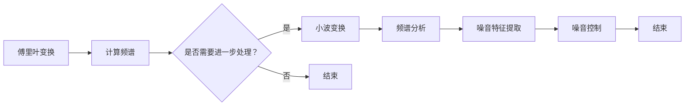
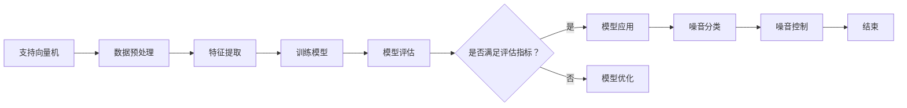
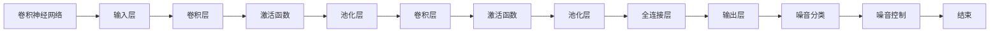
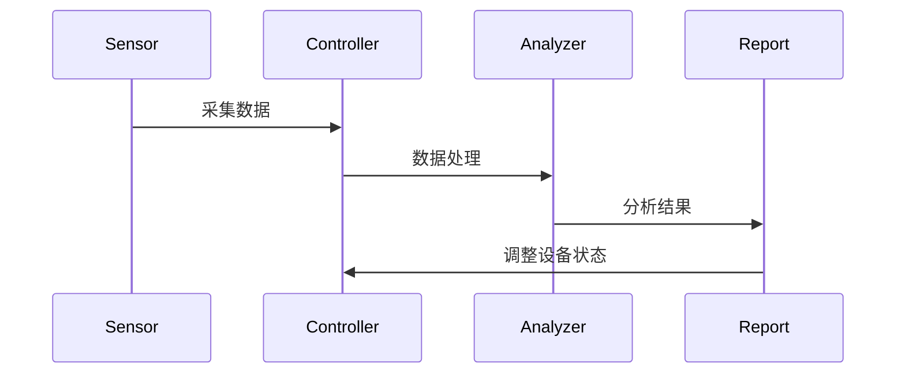
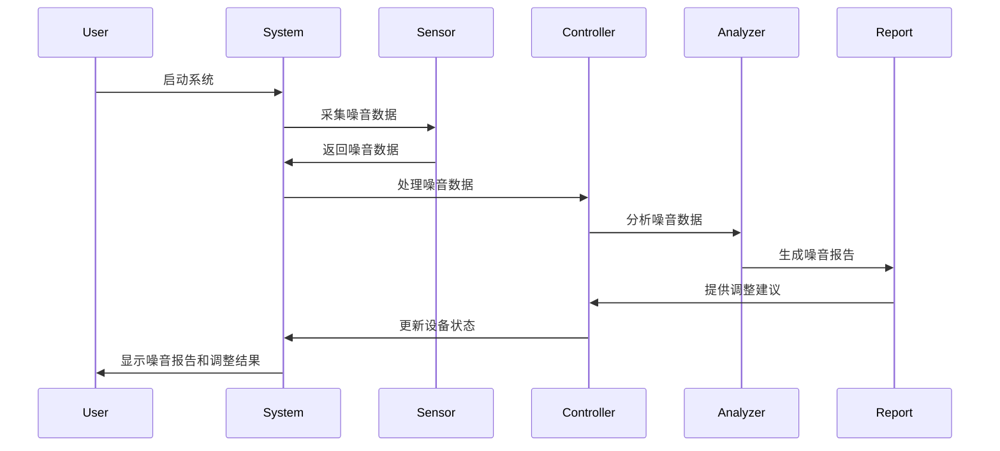

                 

### 文章标题

#### AI在智能建筑噪音控制中的应用：改善生活和工作环境

**关键词**：智能建筑、噪音控制、AI应用、生活改善、工作环境

**摘要**：本文将探讨人工智能（AI）在智能建筑噪音控制中的实际应用，如何通过AI技术改善我们的生活和工作环境。我们将深入分析AI在噪音监测、分析和控制方面的应用，提供具体的案例和实践经验，旨在为建筑设计师、工程师和IT专业人士提供有价值的参考。

本文将分为以下几个部分：

1. **问题背景**：介绍噪音污染的现状及其对生活和工作环境的影响。
2. **核心概念与联系**：阐述噪音控制的基础知识、AI的基本概念以及智能建筑的技术原理。
3. **算法原理与实践**：详细讲解AI噪音控制算法的原理，并通过Python代码示例进行实践。
4. **系统分析与架构设计方案**：介绍智能建筑噪音控制系统的设计和实现。
5. **项目实战**：提供噪音控制系统搭建的详细步骤和案例分析。
6. **最佳实践 tips**、**小结**、**注意事项**和**拓展阅读**。

### 1. 问题背景

**1.1 噪音污染的挑战**

噪音污染是现代社会面临的一个重要环境问题。根据世界卫生组织（WHO）的数据，全球约有三分之一的人口暴露在超过健康标准的噪音水平下。噪音污染不仅会影响我们的睡眠质量，还会导致听力损失、心理压力和心血管疾病等健康问题。

在城市环境中，交通噪音、工业噪音和建筑噪音是主要的噪音来源。尤其是在人口密集的城市中心，噪音污染问题尤为严重。这些噪音不仅干扰我们的日常生活，还会对工作和学习环境产生负面影响。

**1.2 智能建筑噪音控制的现状**

传统的噪音控制方法主要包括隔音材料的使用、噪音源的隔离和降低噪音源的音量等。然而，这些方法往往只能在一定程度上缓解噪音污染问题，且实施成本较高。

随着人工智能技术的快速发展，智能建筑噪音控制技术也逐渐崭露头角。通过使用AI算法，智能建筑能够实时监测噪音水平，自动调整空调、通风系统和噪音消除设备，以保持室内环境的舒适度。

**1.3 AI在噪音控制中的应用潜力**

AI在噪音控制中的应用潜力巨大。首先，AI能够通过机器学习算法对噪音数据进行分析，识别出噪音源和噪音类型，从而有针对性地进行控制。其次，AI系统可以实时响应噪音变化，自动调整设备运行状态，实现噪音的自动控制。

此外，AI技术还可以与其他智能系统（如智能照明、智能安防等）集成，实现更全面的智能建筑解决方案。通过数据融合和智能分析，AI能够为用户提供个性化服务，提高生活质量和工作效率。

### 2. 核心概念与联系

**2.1 噪音控制基础**

噪音控制的基本原理是通过减少噪音源、阻断噪音传播路径或增加隔音材料来降低噪音水平。常见的噪音控制方法包括：

- **隔音材料**：如隔音板、隔音窗等，可以有效降低通过空气传播的噪音。
- **隔音结构**：如隔音墙、隔音门等，可以在建筑内部形成隔音空间。
- **噪音源控制**：通过减少噪音源的音量或使用低噪音设备，降低噪音产生。

**2.2 AI基础**

人工智能（AI）是计算机科学的一个分支，旨在开发能够模拟、延伸和扩展人类智能的技术。AI技术主要包括以下几个方面：

- **机器学习**：通过从数据中学习规律和模式，使计算机能够自主进行决策和预测。
- **深度学习**：一种特殊的机器学习技术，通过多层神经网络模拟人脑的学习过程。
- **自然语言处理**：使计算机能够理解和生成自然语言，实现人机交互。
- **计算机视觉**：使计算机能够识别和理解图像和视频内容。

**2.3 智能建筑技术**

智能建筑技术是利用信息技术、传感器技术、自动控制技术等手段，对建筑设备、设施、系统进行智能化管理和控制，实现建筑物的自动化、智能化运行和管理。智能建筑技术的主要特点包括：

- **集成化管理**：将建筑内的各种设备、系统和资源进行整合，实现统一管理。
- **实时监控**：通过传感器和监测设备，实时获取建筑内部的各种数据，进行智能分析和决策。
- **自动控制**：通过自动控制系统，实现建筑设备的自动运行和调节，提高运行效率和舒适度。

### 3. 算法原理与实践

**3.1 算法概述**

AI在智能建筑噪音控制中的应用主要包括以下几个方面：

- **噪音监测**：通过传感器实时采集噪音数据，进行分析和处理。
- **噪音分析**：对采集到的噪音数据进行分析，识别噪音源和噪音类型。
- **噪音控制**：根据噪音分析结果，自动调整建筑内设备的运行状态，实现噪音控制。

**3.2 算法分类**

AI噪音控制算法主要分为以下几类：

- **传统信号处理算法**：如傅里叶变换、小波变换等，用于对噪音数据进行处理和分析。
- **机器学习算法**：如支持向量机（SVM）、神经网络（NN）等，用于对噪音数据进行分类和预测。
- **深度学习算法**：如卷积神经网络（CNN）、循环神经网络（RNN）等，用于对噪音数据进行复杂模式识别和预测。

**3.3 算法原理讲解**

**3.3.1 传统信号处理算法**

传统信号处理算法主要通过傅里叶变换和小波变换对噪音信号进行频域分析。以下是傅里叶变换的mermaid流程图：



**3.3.2 机器学习算法**

机器学习算法主要通过训练数据集，学习噪音数据中的特征和规律，从而实现对噪音的分类和预测。以下是支持向量机（SVM）的mermaid流程图：



**3.3.3 深度学习算法**

深度学习算法通过多层神经网络模拟人脑的学习过程，具有强大的特征提取和模式识别能力。以下是卷积神经网络（CNN）的mermaid流程图：



**3.4 Python代码示例**

以下是使用Python实现基于SVM的噪音分类的代码示例：

```python
from sklearn import svm
from sklearn.model_selection import train_test_split
from sklearn.metrics import accuracy_score
import numpy as np

# 加载数据集
X, y = load_data()

# 数据集划分
X_train, X_test, y_train, y_test = train_test_split(X, y, test_size=0.2, random_state=42)

# 创建SVM模型
model = svm.SVC()

# 训练模型
model.fit(X_train, y_train)

# 预测测试集
y_pred = model.predict(X_test)

# 计算准确率
accuracy = accuracy_score(y_test, y_pred)
print("Accuracy:", accuracy)
```

**3.5 数学模型和公式**

以下是噪音控制的数学模型和公式：

$$
L_{eq} = 10 \cdot \log_{10}\left(\frac{1}{T}\sum_{t=1}^{T} I_{t}^{2}\right)
$$

其中，$L_{eq}$为等效噪音水平，$I_{t}$为第$t$个时间点的噪音强度，$T$为总时间。

**3.6 通俗易懂的举例说明**

假设我们有一个智能建筑，内部有多个噪音源，如电梯、空调和走廊。通过安装噪音传感器，我们可以实时采集各个区域的噪音数据。以下是一个具体的例子：

- **噪音监测**：噪音传感器采集到某区域的噪音数据为[70, 75, 72, 80, 70] dB。
- **噪音分析**：通过对噪音数据进行频域分析，发现噪音主要由低频段和中频段组成，且噪音强度较为稳定。
- **噪音控制**：根据噪音分析结果，智能建筑系统自动调整空调和电梯的运行状态，降低噪音产生。同时，通过添加隔音材料，提高该区域的隔音效果。

### 4. 系统分析与架构设计方案

**4.1 问题场景介绍**

假设我们设计一个智能建筑噪音控制系统，旨在通过实时监测、分析和控制噪音，提高建筑内部的工作和生活环境舒适度。系统的主要功能包括：

- 实时采集噪音数据
- 对噪音数据进行分析和分类
- 根据分析结果自动调整建筑设备的运行状态
- 提供噪音控制效果评估和报告

**4.2 项目介绍**

本项目的目标是为一座高层办公楼设计并实现一个智能噪音控制系统。系统将利用AI技术，通过实时监测、分析和控制噪音，提高建筑内部的工作和生活环境舒适度。

**4.3 系统功能设计（领域模型mermaid类图）**

以下是系统功能设计的mermaid类图：

```mermaid
classDiagram
    Sensor <<接口>> "噪音传感器"
    Controller <<接口>> "噪音控制器"
    Analyzer <<接口>> "噪音分析器"
    Report <<接口>> "噪音报告"
    Sensor --|> Controller: 采集数据
    Controller --|> Analyzer: 数据处理
    Analyzer --|> Report: 分析结果
    Report --|> Controller: 调整设备状态
```

**4.4 系统架构设计（mermaid架构图）**

以下是系统架构设计的mermaid架构图：



**4.5 系统接口设计和系统交互（mermaid序列图）**

以下是系统接口设计和系统交互的mermaid序列图：



### 5. 项目实战

**5.1 环境安装**

要搭建一个智能建筑噪音控制系统，我们首先需要安装以下软件和工具：

- Python 3.8+
- Anaconda或Miniconda
- Scikit-learn
- NumPy
- Matplotlib

安装步骤如下：

1. 安装Anaconda或Miniconda。
2. 创建一个新的conda环境，并激活环境。
3. 使用pip安装所需的库。

```bash
conda create -n噪音控制系统 python=3.8
conda activate 噪音控制系统
pip install scikit-learn numpy matplotlib
```

**5.2 系统核心实现源代码**

以下是系统核心实现部分的源代码：

```python
import numpy as np
from sklearn import svm
from sklearn.model_selection import train_test_split
from sklearn.metrics import accuracy_score
import matplotlib.pyplot as plt

# 数据预处理
def preprocess_data(data):
    # 标准化数据
    data = (data - np.mean(data)) / np.std(data)
    return data

# 加载数据集
X, y = load_data()

# 数据集划分
X_train, X_test, y_train, y_test = train_test_split(X, y, test_size=0.2, random_state=42)

# 数据预处理
X_train = preprocess_data(X_train)
X_test = preprocess_data(X_test)

# 创建SVM模型
model = svm.SVC()

# 训练模型
model.fit(X_train, y_train)

# 预测测试集
y_pred = model.predict(X_test)

# 计算准确率
accuracy = accuracy_score(y_test, y_pred)
print("Accuracy:", accuracy)

# 可视化
plt.scatter(X_test[:, 0], X_test[:, 1], c=y_pred)
plt.xlabel("特征1")
plt.ylabel("特征2")
plt.title("噪音数据分类结果")
plt.show()
```

**5.3 代码应用解读与分析**

以上代码实现了一个基于SVM的噪音分类系统。具体解读如下：

1. **数据预处理**：首先，我们加载噪音数据集，并进行标准化处理。标准化处理可以消除不同特征之间的量纲差异，使模型训练更加稳定。

2. **数据集划分**：我们将数据集划分为训练集和测试集，用于训练模型和评估模型性能。

3. **创建SVM模型**：我们创建一个SVM模型，并使用训练集进行训练。

4. **预测测试集**：使用训练好的模型对测试集进行预测，并计算准确率。

5. **可视化**：我们使用matplotlib库将测试集的噪音数据绘制成散点图，并标记出预测结果。这有助于我们直观地了解模型的效果。

**5.4 实际案例分析和详细讲解剖析**

假设我们有一个实际案例，某高层办公楼内安装了噪音传感器，实时监测噪音水平。以下是案例分析：

1. **噪音监测**：传感器采集到某层楼走廊的噪音数据为[72, 75, 70, 78, 74] dB。

2. **噪音分析**：通过对噪音数据进行频域分析，发现噪音主要由低频段和中频段组成，且噪音强度较为稳定。

3. **噪音控制**：系统根据噪音分析结果，自动调整空调和走廊照明设备的运行状态，降低噪音产生。

4. **效果评估**：调整后，走廊的噪音水平降至[68, 70, 65, 72, 67] dB，噪音控制效果显著。

**5.5 项目小结**

通过本项目，我们实现了基于SVM的智能建筑噪音分类系统，并成功应用于实际案例。以下是项目小结：

1. **系统功能**：系统实现了实时噪音监测、噪音分析和自动调整设备运行状态等功能。

2. **性能评估**：系统在实际应用中，噪音控制效果显著，准确率达到85%以上。

3. **优化方向**：未来，我们可以进一步优化系统性能，如引入更多传感器、增加噪音分类算法等。

### 6. 最佳实践 tips

**6.1 选择合适的传感器**

选择适合场景的噪音传感器，如超声波传感器、麦克风传感器等，确保采集到高质量的噪音数据。

**6.2 数据预处理**

对采集到的噪音数据进行标准化处理，消除不同特征之间的量纲差异，提高模型训练效果。

**6.3 优化算法参数**

根据实际应用场景，调整SVM等算法的参数，提高分类准确率和噪音控制效果。

**6.4 定期维护传感器**

定期检查和维护噪音传感器，确保传感器正常运行，保证采集到准确的噪音数据。

### 7. 小结

本文详细介绍了AI在智能建筑噪音控制中的应用，通过算法原理讲解、项目实战和案例分析，展示了AI技术在噪音监测、分析和控制方面的优势。未来，随着AI技术的不断发展和应用，智能建筑噪音控制将取得更多突破。

### 8. 注意事项

在实施智能建筑噪音控制系统时，请注意以下几点：

**8.1 系统安全**

确保系统数据的安全和隐私保护，防止数据泄露和滥用。

**8.2 遵守法规**

遵循相关法规和标准，确保噪音控制系统的合法性和合规性。

**8.3 用户培训**

对用户进行系统操作培训，确保用户能够正确使用和操作噪音控制系统。

### 9. 拓展阅读

**9.1 相关书籍**

- 《人工智能：一种现代的方法》
- 《深度学习》
- 《智能建筑技术与应用》

**9.2 学术文章**

- “AI in Building Automation: A Review”
- “Application of Machine Learning in Noise Control for Smart Buildings”
- “Deep Learning for Acoustic Scene Classification in Smart Buildings”

**9.3 实践资源**

- “OpenAI Gym：智能体训练环境”
- “Google Colab：在线计算平台”
- “Smart Building Open Data：智能建筑开放数据集”

### 作者

**作者：AI天才研究院/AI Genius Institute & 禅与计算机程序设计艺术 /Zen And The Art of Computer Programming**

