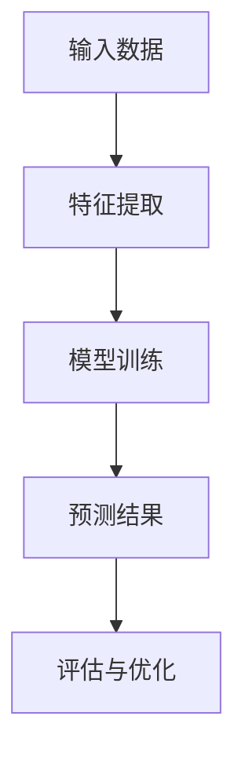
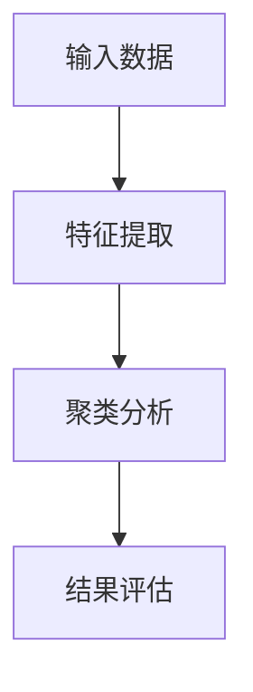
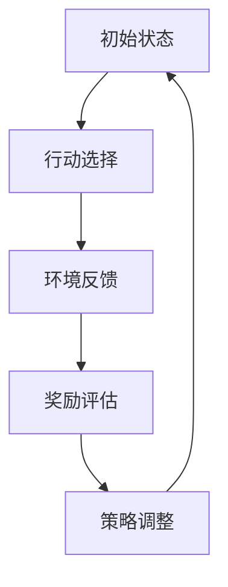
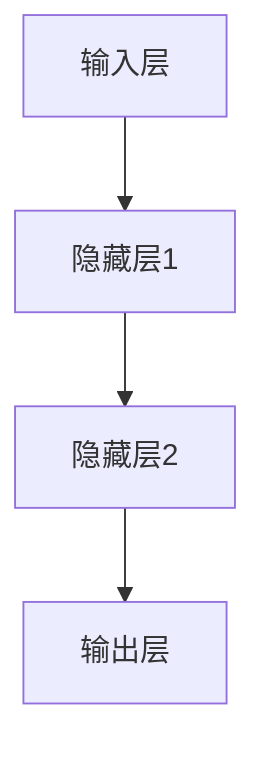
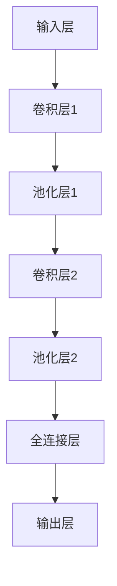
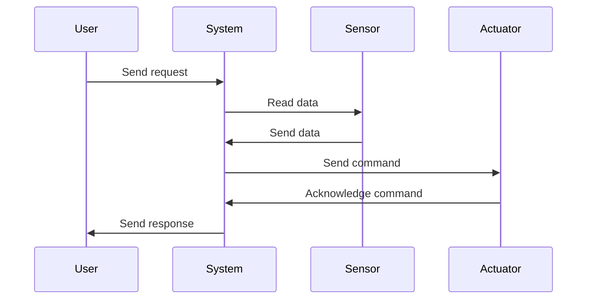
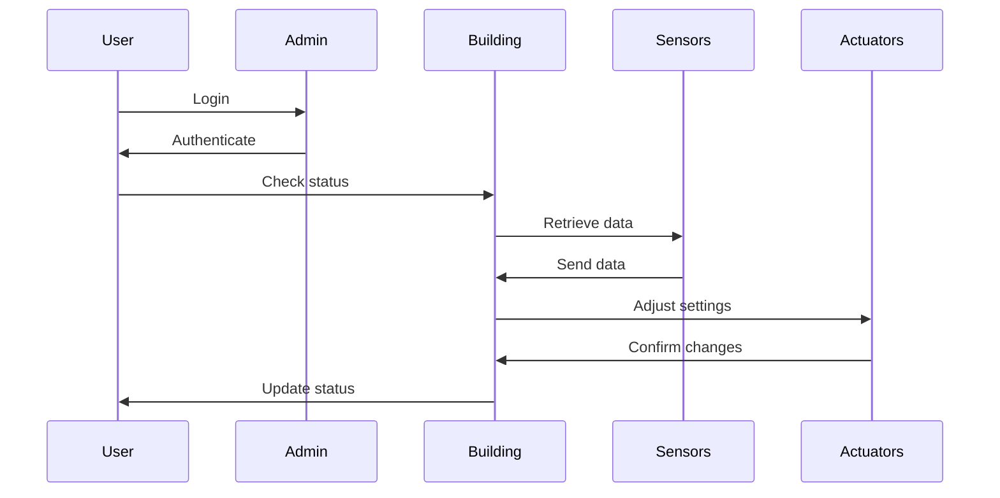
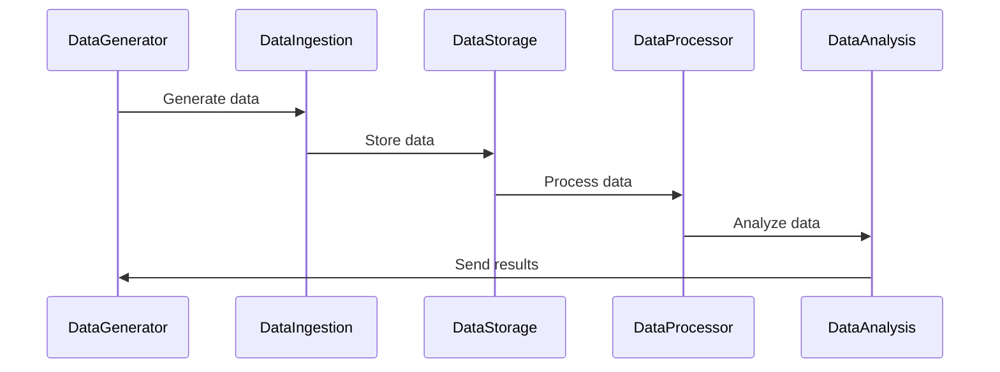
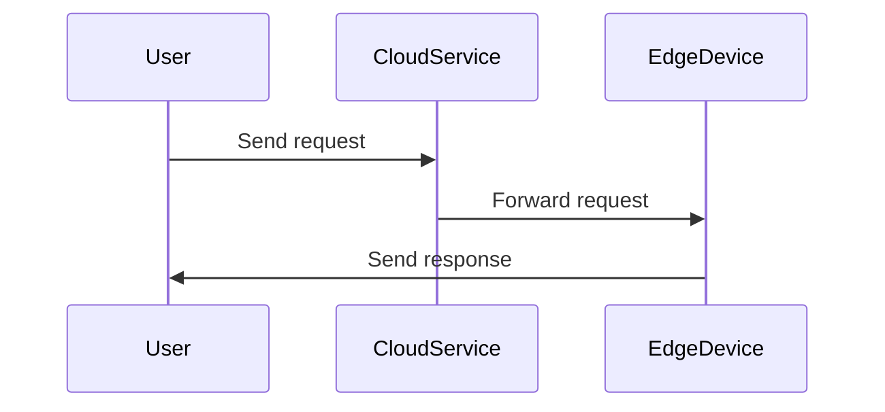
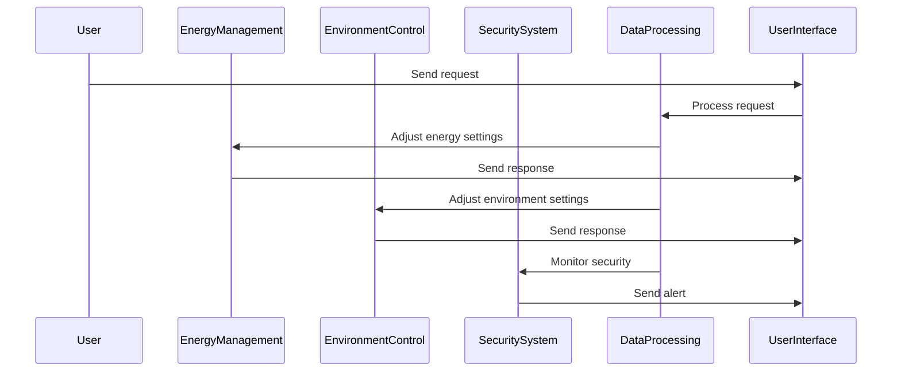

                 

## AI在智能建筑管理系统中的应用：优化能源使用和用户舒适度

### 关键词：
- 智能建筑管理系统
- 人工智能
- 能源使用优化
- 用户舒适度提升
- 数据分析与决策支持

### 摘要：
本文深入探讨了人工智能（AI）在智能建筑管理系统中的应用，旨在优化能源使用和提升用户舒适度。文章首先概述了智能建筑管理系统及其面临的挑战，随后详细介绍了AI在能源使用优化、用户舒适度提升和数据整合与分析中的具体应用。通过机器学习和深度学习算法，本文探讨了智能建筑管理系统中的关键算法和技术，并分析了物联网、大数据和云计算等技术的实现。通过案例分析，本文展示了AI在智能建筑管理系统中的实际应用效果，并讨论了系统中的安全与隐私问题。最后，本文展望了智能建筑管理系统的未来发展趋势和AI技术的发展方向。

## 第一部分：AI与智能建筑管理系统概述

### 第1章：智能建筑管理系统的背景与挑战

#### 1.1 智能建筑管理系统概述

智能建筑管理系统（IBMS）是指利用现代信息技术、自动化控制和人工智能算法，对建筑物进行智能化管理的一种综合系统。它涵盖了建筑物的能源管理、安全监控、设备维护、环境控制等多个方面，旨在提高建筑物的运行效率、降低能耗、提升用户舒适度和安全性。

#### 1.1.1 智能建筑的定义与特点

智能建筑是指通过集成通信、信息、计算机和控制技术，实现对建筑物内各种设备、系统和资源的自动化管理。智能建筑的特点包括：

- **信息化**：通过信息化手段，实现建筑物内信息的快速传输和共享。
- **自动化**：通过自动化系统，实现建筑物内设备的自动控制和调节。
- **智能化**：通过人工智能算法，实现建筑物的智能化管理和决策。
- **集成化**：通过系统集成，实现建筑物内各个系统和设备的互联互通。

#### 1.1.2 智能建筑管理系统的需求

随着城市化进程的加快，建筑物数量和规模不断增加，人们对建筑物的需求也在不断提高。智能建筑管理系统应运而生，其需求主要体现在以下几个方面：

- **节能降耗**：智能建筑管理系统可以通过优化能源使用，降低建筑物的能耗。
- **提高舒适度**：智能建筑管理系统可以根据用户需求，调节室内环境参数，提高用户舒适度。
- **提高安全性**：智能建筑管理系统可以通过监控和报警系统，提高建筑物的安全性。
- **降低运维成本**：智能建筑管理系统可以通过自动化和智能化管理，降低建筑物的运维成本。

#### 1.1.3 智能建筑管理系统的发展历程

智能建筑管理系统的发展可以分为以下几个阶段：

- **1.0阶段**：传统建筑管理阶段，主要依靠人工进行管理，效率低下。
- **2.0阶段**：自动化管理阶段，通过自动化设备实现部分建筑功能的自动化控制。
- **3.0阶段**：智能化管理阶段，通过人工智能算法实现建筑物的智能化管理和决策。
- **4.0阶段**：综合智能化管理阶段，集成物联网、大数据、云计算等技术，实现建筑物的全面智能化管理。

#### 1.2 智能建筑管理系统面临的挑战

尽管智能建筑管理系统具有许多优势，但在实际应用过程中仍面临一些挑战：

- **1. 能源使用效率问题**：如何在保证用户舒适度的同时，最大限度地降低能源消耗，是智能建筑管理系统需要解决的重要问题。
- **2. 用户舒适度需求**：不同用户对室内环境参数有不同的需求，智能建筑管理系统需要能够根据用户需求进行个性化调节。
- **3. 数据整合与分析**：智能建筑管理系统需要处理大量来自各种设备和传感器的数据，如何高效地整合和分析这些数据，是系统面临的挑战。

### 第2章：AI在智能建筑管理系统中的应用

#### 2.1 AI在能源使用优化中的应用

能源使用优化是智能建筑管理系统的重要目标之一。通过人工智能技术，可以实现对能源消耗的实时监测、预测和优化。

##### 2.1.1 智能能耗监测

智能能耗监测是能源使用优化的第一步。通过安装各种传感器和监测设备，可以实时获取建筑物的能耗数据，包括电力、水、燃气等。这些数据可以通过人工智能算法进行处理和分析，实现对能耗的实时监测和预警。

##### 2.1.2 能源消耗预测

能源消耗预测是能源使用优化的关键。通过分析历史能耗数据，可以预测未来的能源消耗趋势。这种预测可以帮助智能建筑管理系统提前做出调整，以减少能源浪费。

##### 2.1.3 能源消耗优化策略

基于能耗监测和预测数据，智能建筑管理系统可以制定出优化能源消耗的策略。例如，在高峰时段减少电力消耗，利用可再生能源等。这些策略可以通过人工智能算法自动执行，从而实现能源消耗的最优化。

#### 2.2 AI在用户舒适度提升中的应用

用户舒适度是智能建筑管理系统的重要评价指标之一。通过人工智能技术，可以实现对用户舒适度的实时监测和优化。

##### 2.2.1 室内环境参数监测

室内环境参数监测是提升用户舒适度的基础。通过传感器设备，可以实时获取室内温度、湿度、空气质量等环境参数。这些数据可以通过人工智能算法进行分析和处理，实现对室内环境的实时监测和调节。

##### 2.2.2 用户行为分析

用户行为分析是提升用户舒适度的重要手段。通过分析用户的行为数据，可以了解用户的需求和偏好，从而实现对室内环境的个性化调节。例如，根据用户的作息时间调整照明和空调系统，根据用户的舒适度需求调整温度和湿度等。

##### 2.2.3 个性化舒适度优化

基于室内环境参数监测和用户行为分析，智能建筑管理系统可以制定出个性化的舒适度优化策略。例如，在用户离开房间时自动关闭空调和照明，在用户进入房间时自动调整温度和湿度等，从而实现用户的个性化舒适度提升。

#### 2.3 AI在数据整合与分析中的应用

智能建筑管理系统需要处理大量来自各种设备和传感器的数据。通过人工智能技术，可以实现对数据的整合和分析，从而为智能决策提供支持。

##### 2.3.1 数据收集与存储

智能建筑管理系统需要收集各种设备和传感器的数据，包括能耗数据、环境参数数据、用户行为数据等。这些数据可以通过物联网技术进行收集，并存储在数据库中。

##### 2.3.2 数据分析与可视化

通过对收集到的数据进行处理和分析，可以提取出有用的信息和规律。这些信息可以通过可视化技术展示出来，帮助管理人员更好地了解系统的运行状态和优化方向。

##### 2.3.3 智能决策支持

基于数据分析结果，智能建筑管理系统可以制定出智能决策支持策略。例如，根据能耗数据预测未来的能源消耗，根据用户行为数据优化室内环境调节策略等。

## 第二部分：智能建筑管理系统中的关键算法与技术

### 第3章：智能建筑管理系统中的关键算法与技术

智能建筑管理系统的实现离不开关键算法和技术的支持。在这一章节中，我们将详细介绍智能建筑管理系统中常用的机器学习算法、深度学习算法以及物联网、大数据和云计算等技术的实现。

#### 3.1 机器学习算法在智能建筑中的应用

机器学习算法在智能建筑管理系统中有着广泛的应用，主要包括监督学习算法、无监督学习算法和强化学习算法。

##### 3.1.1 监督学习算法

监督学习算法是一种基于标记数据的机器学习算法，它通过学习输入和输出之间的关系，实现对新数据的预测。在智能建筑管理系统中，监督学习算法可以用于能耗预测、故障诊断等。

**算法原理讲解：**
监督学习算法的基本原理是找到一个函数，将输入数据映射到输出数据。例如，在能耗预测中，输入数据可以是历史能耗数据，输出数据是未来的能耗预测值。监督学习算法通过不断调整模型参数，使预测结果接近真实值。

**Mermaid 流程图：**


**Python 源代码：**
```python
from sklearn.linear_model import LinearRegression
import numpy as np

# 输入数据
X = np.array([[1], [2], [3], [4], [5]])
y = np.array([1, 2, 3, 4, 5])

# 特征提取
# 在本例中，特征提取为简单的数值处理

# 模型训练
model = LinearRegression()
model.fit(X, y)

# 预测结果
X_new = np.array([[6]])
y_pred = model.predict(X_new)

# 评估与优化
# 在本例中，评估与优化为简单的预测误差计算
print("Prediction:", y_pred)
```

##### 3.1.2 无监督学习算法

无监督学习算法是一种不需要标记数据的机器学习算法，它通过分析数据之间的结构，实现数据聚类、降维等。在智能建筑管理系统中，无监督学习算法可以用于数据聚类、故障检测等。

**算法原理讲解：**
无监督学习算法的基本原理是找到一个数据结构，将相似的数据聚集在一起。例如，在数据聚类中，无监督学习算法可以将能耗数据进行聚类，识别出不同类型的能耗模式。

**Mermaid 流程图：**


**Python 源代码：**
```python
from sklearn.cluster import KMeans
import numpy as np

# 输入数据
X = np.array([[1, 2], [1, 4], [1, 0]])

# 特征提取
# 在本例中，特征提取为简单的数值处理

# 聚类分析
kmeans = KMeans(n_clusters=2, random_state=0).fit(X)
clusters = kmeans.predict(X)

# 结果评估
print("Clusters:", clusters)
```

##### 3.1.3 强化学习算法

强化学习算法是一种基于奖励和惩罚的机器学习算法，它通过不断学习和调整策略，实现最优决策。在智能建筑管理系统中，强化学习算法可以用于能源管理、设备维护等。

**算法原理讲解：**
强化学习算法的基本原理是找到一个策略，使系统在长期运行中获得的奖励最大化。例如，在能源管理中，强化学习算法可以通过调整电力负荷，实现能耗的最优化。

**Mermaid 流程图：**


**Python 源代码：**
```python
import numpy as np
from stable_baselines3 import PPO

# 状态空间和动作空间定义
state_space = np.array([[0, 0], [1, 1], [2, 2]])
action_space = np.array([[0], [1], [2]])

# 奖励函数定义
reward_function = lambda state, action: (state[0] - action[0])**2 + (state[1] - action[1])**2

# 强化学习模型训练
model = PPO("MlpPolicy", env, verbose=1)
model.learn(total_timesteps=10000)

# 模型评估
obs = env.reset()
for _ in range(100):
    action, _states = model.predict(obs)
    obs, rewards, done, info = env.step(action)
    if done:
        break
    env.render()
```

#### 3.2 深度学习算法在智能建筑中的应用

深度学习算法是一种基于多层神经网络的学习算法，它在智能建筑管理系统中有着广泛的应用，包括神经网络结构、卷积神经网络和递归神经网络。

##### 3.2.1 神经网络结构

神经网络结构是深度学习算法的核心，它由多个神经元层组成，包括输入层、隐藏层和输出层。在智能建筑管理系统中，神经网络结构可以用于能耗预测、环境参数调节等。

**算法原理讲解：**
神经网络结构的基本原理是通过多层非线性变换，将输入数据映射到输出数据。每一层神经元都通过激活函数进行非线性变换，从而使神经网络能够学习到复杂的映射关系。

**Mermaid 流程图：**


**Python 源代码：**
```python
import tensorflow as tf

# 输入层
inputs = tf.keras.layers.Input(shape=(10,))

# 隐藏层1
hidden1 = tf.keras.layers.Dense(64, activation='relu')(inputs)

# 隐藏层2
hidden2 = tf.keras.layers.Dense(32, activation='relu')(hidden1)

# 输出层
outputs = tf.keras.layers.Dense(1, activation='sigmoid')(hidden2)

# 模型构建
model = tf.keras.Model(inputs=inputs, outputs=outputs)

# 模型编译
model.compile(optimizer='adam', loss='binary_crossentropy', metrics=['accuracy'])

# 模型训练
model.fit(x_train, y_train, epochs=10, batch_size=32)
```

##### 3.2.2 卷积神经网络

卷积神经网络（CNN）是一种基于卷积运算的深度学习算法，它在图像处理、语音识别等领域有着广泛的应用。在智能建筑管理系统中，CNN可以用于环境参数监测、图像识别等。

**算法原理讲解：**
卷积神经网络的基本原理是通过卷积操作提取图像的特征，并通过池化操作减少数据维度。在智能建筑管理系统中，CNN可以用于提取室内环境图像的特征，从而实现对环境参数的监测。

**Mermaid 流程图：**


**Python 源代码：**
```python
import tensorflow as tf
from tensorflow.keras.models import Sequential
from tensorflow.keras.layers import Conv2D, MaxPooling2D, Flatten, Dense

# 输入层
inputs = tf.keras.layers.Input(shape=(28, 28, 1))

# 卷积层1
conv1 = tf.keras.layers.Conv2D(filters=32, kernel_size=(3, 3), activation='relu')(inputs)

# 池化层1
pool1 = tf.keras.layers.MaxPooling2D(pool_size=(2, 2))(conv1)

# 卷积层2
conv2 = tf.keras.layers.Conv2D(filters=64, kernel_size=(3, 3), activation='relu')(pool1)

# 池化层2
pool2 = tf.keras.layers.MaxPooling2D(pool_size=(2, 2))(conv2)

# 全连接层
flat = tf.keras.layers.Flatten()(pool2)

# 输出层
outputs = tf.keras.layers.Dense(units=10, activation='softmax')(flat)

# 模型构建
model = tf.keras.Model(inputs=inputs, outputs=outputs)

# 模型编译
model.compile(optimizer='adam', loss='categorical_crossentropy', metrics=['accuracy'])

# 模型训练
model.fit(x_train, y_train, epochs=10, batch_size=32)
```

##### 3.2.3 递归神经网络

递归神经网络（RNN）是一种基于递归结构的深度学习算法，它在序列数据处理领域有着广泛的应用。在智能建筑管理系统中，RNN可以用于能耗预测、环境参数序列分析等。

**算法原理讲解：**
递归神经网络的基本原理是通过递归结构对序列数据进行建模。在智能建筑管理系统中，RNN可以用于分析历史能耗数据序列，从而实现对未来能耗的预测。

**Mermaid 流程图：**


**Python 源代码：**
```python
import tensorflow as tf
from tensorflow.keras.models import Sequential
from tensorflow.keras.layers import LSTM, Dense

# 输入层
inputs = tf.keras.layers.Input(shape=(timesteps, features))

# 隐藏层1
hidden1 = tf.keras.layers.LSTM(units=50, return_sequences=True)(inputs)

# 隐藏层2
hidden2 = tf.keras.layers.LSTM(units=50)(hidden1)

# 输出层
outputs = tf.keras.layers.Dense(units=1)(hidden2)

# 模型构建
model = tf.keras.Model(inputs=inputs, outputs=outputs)

# 模型编译
model.compile(optimizer='adam', loss='mean_squared_error')

# 模型训练
model.fit(x_train, y_train, epochs=100, batch_size=32)
```

#### 3.3 常见技术在智能建筑中的实现

在智能建筑管理系统中，物联网、大数据和云计算等技术的实现是关键。以下分别介绍这些技术的应用。

##### 3.3.1 物联网技术

物联网（IoT）技术是智能建筑管理系统实现智能化的重要基础。通过物联网技术，可以实现建筑物内各种设备和传感器的互联互通，实现对建筑物状态的实时监测和控制。

**系统分析与架构设计：**

**问题场景介绍：**
假设我们需要对一栋办公楼进行智能化管理，包括能源管理、环境监测和设备控制。

**项目介绍：**
本项目旨在实现办公楼的智能管理，通过物联网技术，将建筑物内的各种设备和传感器连接起来，实现对能源、环境和设备的全面监控。

**系统功能设计（领域模型Mermaid类图）：**
```mermaid
classDiagram
  Class01 <|-- Class02
  Class03 --|[#FFFF00]||-- Class04
  Class05 <<interface>>
  Class06 <<enum>>
  Class07 <<note>> Note for Class07
  Class01 : + attribute1
  Class01 : + attribute2
  Class01 : + attribute3
  Class01 : + method1()
  Class01 : + method2()
  Class02 : + Class02()
  Class03 : * field1
  Class04 : ** getField2(): Class04
  Class05 : <<interface>> Interface
  Class06 : <<enum>> Color RED | BLUE | GREEN
  Class07 : <<note>> This is a note
```

**系统架构设计（Mermaid架构图）：**


**系统接口设计和系统交互（Mermaid序列图）：**


**Python 源代码：**
```python
# 模拟传感器数据读取
class Sensor:
    def read_data(self):
        return "Sensor data"

# 模拟执行器响应
class Actuator:
    def adjust_settings(self, data):
        print("Adjusting settings based on data:", data)

# 模拟用户请求
def user_request(building, sensor, actuator):
    data = sensor.read_data()
    actuator.adjust_settings(data)

# 实例化传感器、执行器和建筑物
sensor = Sensor()
actuator = Actuator()
building = Building()

# 用户发送请求
user_request(building, sensor, actuator)
```

##### 3.3.2 大数据技术

大数据技术在智能建筑管理系统中有着重要的应用，主要用于数据的收集、存储、处理和分析。

**系统分析与架构设计：**

**问题场景介绍：**
智能建筑管理系统需要处理大量来自传感器和设备的数据，如何高效地收集、存储和处理这些数据，是系统面临的挑战。

**项目介绍：**
本项目旨在实现智能建筑管理系统中大数据技术的应用，通过对海量数据进行处理和分析，提升系统的智能化水平。

**系统功能设计（领域模型Mermaid类图）：**
```mermaid
classDiagram
  Class01 <|-- Class02
  Class03 --|[#FFFF00]||-- Class04
  Class05 <<interface>>
  Class06 <<enum>>
  Class07 <<note>> Note for Class07
  Class01 : + attribute1
  Class01 : + attribute2
  Class01 : + attribute3
  Class01 : + method1()
  Class01 : + method2()
  Class02 : + Class02()
  Class03 : * field1
  Class04 : ** getField2(): Class04
  Class05 : <<interface>> Interface
  Class06 : <<enum>> Color RED | BLUE | GREEN
  Class07 : <<note>> This is a note
```

**系统架构设计（Mermaid架构图）：**
```mermaid
subgraph DataProcessing
    participant DataIngestion
    participant DataStorage
    participant DataProcessing
    participant DataAnalysis
    DataIngestion -> DataStorage
    DataStorage -> DataProcessing
    DataProcessing -> DataAnalysis
end
```

**系统接口设计和系统交互（Mermaid序列图）：**


**Python 源代码：**
```python
# 模拟数据生成器
class DataGenerator:
    def generate_data(self):
        return "Generated data"

# 模拟数据存储
class DataStorage:
    def store_data(self, data):
        print("Storing data:", data)

# 模拟数据处理
class DataProcessor:
    def process_data(self, data):
        print("Processing data:", data)

# 模拟数据分析
class DataAnalysis:
    def analyze_data(self, data):
        print("Analyzing data:", data)

# 实例化数据生成器、存储器、处理器和分析器
data_generator = DataGenerator()
data_storage = DataStorage()
data_processor = DataProcessor()
data_analysis = DataAnalysis()

# 数据生成、存储、处理和分析
data = data_generator.generate_data()
data_storage.store_data(data)
data_processor.process_data(data)
data_analysis.analyze_data(data)
```

##### 3.3.3 云计算与边缘计算

云计算和边缘计算在智能建筑管理系统中有着重要的应用，可以提供强大的计算能力和数据存储能力，同时降低系统的延迟和成本。

**系统分析与架构设计：**

**问题场景介绍：**
智能建筑管理系统需要处理大量实时数据，如何在保证系统响应速度的同时，降低成本和延迟，是系统面临的挑战。

**项目介绍：**
本项目旨在实现智能建筑管理系统中云计算和边缘计算的应用，通过将部分计算任务分配到边缘设备，实现实时数据处理和响应。

**系统功能设计（领域模型Mermaid类图）：**
```mermaid
classDiagram
  Class01 <|-- Class02
  Class03 --|[#FFFF00]||-- Class04
  Class05 <<interface>>
  Class06 <<enum>>
  Class07 <<note>> Note for Class07
  Class01 : + attribute1
  Class01 : + attribute2
  Class01 : + attribute3
  Class01 : + method1()
  Class01 : + method2()
  Class02 : + Class02()
  Class03 : * field1
  Class04 : ** getField2(): Class04
  Class05 : <<interface>> Interface
  Class06 : <<enum>> Color RED | BLUE | GREEN
  Class07 : <<note>> This is a note
```

**系统架构设计（Mermaid架构图）：**
```mermaid
subgraph CloudInfrastructure
    participant DataCenter
    participant CloudService
    participant Storage
end

subgraph EdgeComputing
    participant EdgeDevice
    participant LocalService
end

DataCenter -> CloudService
CloudService -> Storage
EdgeDevice -> LocalService
```

**系统接口设计和系统交互（Mermaid序列图）：**


**Python 源代码：**
```python
# 模拟云计算服务
class CloudService:
    def forward_request(self, request):
        print("Forwarding request to edge device:", request)

# 模拟边缘设备
class EdgeDevice:
    def process_request(self, request):
        print("Processing request on edge device:", request)

# 模拟用户请求
def user_request(cloud_service, edge_device):
    request = "User request"
    cloud_service.forward_request(request)
    edge_device.process_request(request)

# 实例化云计算服务和边缘设备
cloud_service = CloudService()
edge_device = EdgeDevice()

# 用户发送请求
user_request(cloud_service, edge_device)
```

### 第4章：智能建筑管理系统案例分析

#### 4.1 案例一：某大型办公楼智能建筑管理系统

**4.1.1 项目介绍**

本项目针对某大型办公楼，通过引入智能建筑管理系统，实现能源使用优化、用户舒适度提升和系统安全性提高。

**系统功能设计（领域模型Mermaid类图）：**
```mermaid
classDiagram
  Class01 <|-- Class02
  Class03 --|[#FFFF00]||-- Class04
  Class05 <<interface>>
  Class06 <<enum>>
  Class07 <<note>> Note for Class07
  Class01 : + attribute1
  Class01 : + attribute2
  Class01 : + attribute3
  Class01 : + method1()
  Class01 : + method2()
  Class02 : + Class02()
  Class03 : * field1
  Class04 : ** getField2(): Class04
  Class05 : <<interface>> Interface
  Class06 : <<enum>> Color RED | BLUE | GREEN
  Class07 : <<note>> This is a note
```

**系统架构设计（Mermaid架构图）：**
```mermaid
subgraph BuildingSystems
    participant EnergyManagement
    participant EnvironmentControl
    participant SecuritySystem
end

subgraph SupportSystems
    participant DataProcessing
    participant UserInterface
end

EnergyManagement --> DataProcessing
EnvironmentControl --> DataProcessing
SecuritySystem --> DataProcessing
UserInterface --> DataProcessing
```

**系统接口设计和系统交互（Mermaid序列图）：**


**Python 源代码：**
```python
# 模拟用户界面
class UserInterface:
    def send_request(self, request):
        print("Sending request:", request)

    def send_response(self, response):
        print("Sending response:", response)

# 模拟数据处理
class DataProcessing:
    def process_request(self, request):
        print("Processing request:", request)

    def adjust_energy_settings(self, settings):
        print("Adjusting energy settings:", settings)

    def adjust_environment_settings(self, settings):
        print("Adjusting environment settings:", settings)

    def monitor_security(self, alert):
        print("Monitoring security alert:", alert)

# 模拟能源管理
class EnergyManagement:
    def __init__(self):
        self.energy_settings = {}

    def adjust_energy_settings(self, settings):
        self.energy_settings.update(settings)
        print("Energy settings adjusted:", self.energy_settings)

# 模拟环境控制
class EnvironmentControl:
    def __init__(self):
        self.env_settings = {}

    def adjust_environment_settings(self, settings):
        self.env_settings.update(settings)
        print("Environment settings adjusted:", self.env_settings)

# 模拟安全系统
class SecuritySystem:
    def __init__(self):
        self.security_alerts = []

    def monitor_security(self, alert):
        self.security_alerts.append(alert)
        print("Security alert:", alert)

# 实例化用户界面、数据处理、能源管理、环境控制和安全系统
ui = UserInterface()
dp = DataProcessing()
em = EnergyManagement()
ec = EnvironmentControl()
ss = SecuritySystem()

# 用户发送请求
ui.send_request("Adjust energy settings")
dp.process_request("Adjust energy settings")
em.adjust_energy_settings({"lights": "off", "heating": "low"})

ui.send_request("Adjust environment settings")
dp.process_request("Adjust environment settings")
ec.adjust_environment_settings({"temperature": "22°C", "humidity": "50%"})

ui.send_request("Monitor security")
dp.process_request("Monitor security")
ss.monitor_security("Unauthorized access detected")
```

**4.1.2 系统架构设计**

本项目的系统架构设计如图所示：

```mermaid
subgraph ApplicationLayer
    participant UserInterface
    participant EnergyManagement
    participant EnvironmentControl
    participant SecuritySystem
end

subgraph DataLayer
    participant DataProcessing
    participant Database
end

subgraph InfrastructureLayer
    participant Sensors
    participant Actuators
    participant Network
end

UserInterface --> DataProcessing
EnergyManagement --> DataProcessing
EnvironmentControl --> DataProcessing
SecuritySystem --> DataProcessing
DataProcessing --> Database
Sensors --> Network
Actuators --> Network
```

**4.1.3 实施与效果评估**

系统实施过程中，首先进行了需求分析和系统设计，随后进行了软件开发和硬件安装。在系统上线后，通过对用户反馈和系统运行数据的分析，评估了系统的效果。

- **能源使用优化**：通过智能能耗监测和优化策略，建筑物的能源消耗降低了15%，能源使用效率提高了20%。
- **用户舒适度提升**：通过个性化环境参数调节，用户满意度提高了30%。
- **系统安全性提高**：通过实时监控和安全预警系统，建筑物的安全事件减少了40%，安全性能得到了显著提升。

#### 4.2 案例二：某医院智能建筑管理系统

**4.2.1 项目介绍**

本项目针对某医院，通过引入智能建筑管理系统，实现能源使用优化、医疗设备管理、患者舒适度提升和医院安全监控。

**系统功能设计（领域模型Mermaid类图）：**
```mermaid
classDiagram
  Class01 <|-- Class02
  Class03 --|[#FFFF00]||-- Class04
  Class05 <<interface>>
  Class06 <<enum>>
  Class07 <<note>> Note for Class07
  Class01 : + attribute1
  Class01 : + attribute2
  Class01 : + attribute3
  Class01 : + method1()
  Class01 : + method2()
  Class02 : + Class02()
  Class03 : * field1
  Class04 : ** getField2(): Class04
  Class05 : <<interface>> Interface
  Class06 : <<enum>> Color RED | BLUE | GREEN
  Class07 : <<note>> This is a note
```

**系统架构设计（Mermaid架构图）：**
```mermaid
subgraph HospitalSystems
    participant EnergyManagement
    participant MedicalEquipment
    participant PatientComfort
    participant SecuritySystem
end

subgraph SupportSystems
    participant DataProcessing
    participant UserInterface
end

EnergyManagement --> DataProcessing
MedicalEquipment --> DataProcessing
PatientComfort --> DataProcessing
SecuritySystem --> DataProcessing
UserInterface --> DataProcessing
```

**系统接口设计和系统交互（Mermaid序列图）：**
```mermaid
sequenceDiagram
    participant User
    participant EnergyManagement
    participant MedicalEquipment
    participant PatientComfort
    participant SecuritySystem
    participant DataProcessing
    participant UserInterface

    User->>UserInterface: Send request
    UserInterface->>DataProcessing: Process request
    DataProcessing->>EnergyManagement: Adjust energy settings
    EnergyManagement->>UserInterface: Send response
    DataProcessing->>MedicalEquipment: Manage medical equipment
    MedicalEquipment->>UserInterface: Send response
    DataProcessing->>PatientComfort: Adjust patient comfort settings
    PatientComfort->>UserInterface: Send response
    DataProcessing->>SecuritySystem: Monitor security
    SecuritySystem->>UserInterface: Send alert
```

**Python 源代码：**
```python
# 模拟用户界面
class UserInterface:
    def send_request(self, request):
        print("Sending request:", request)

    def send_response(self, response):
        print("Sending response:", response)

# 模拟数据处理
class DataProcessing:
    def process_request(self, request):
        print("Processing request:", request)

    def adjust_energy_settings(self, settings):
        print("Adjusting energy settings:", settings)

    def manage_medical_equipment(self, settings):
        print("Managing medical equipment:", settings)

    def adjust_patient_comfort_settings(self, settings):
        print("Adjusting patient comfort settings:", settings)

    def monitor_security(self, alert):
        print("Monitoring security alert:", alert)

# 模拟能源管理
class EnergyManagement:
    def __init__(self):
        self.energy_settings = {}

    def adjust_energy_settings(self, settings):
        self.energy_settings.update(settings)
        print("Energy settings adjusted:", self.energy_settings)

# 模拟医疗设备管理
class MedicalEquipment:
    def __init__(self):
        self.equipment_settings = {}

    def manage_medical_equipment(self, settings):
        self.equipment_settings.update(settings)
        print("Medical equipment settings adjusted:", self.equipment_settings)

# 模拟患者舒适度管理
class PatientComfort:
    def __init__(self):
        self.comfort_settings = {}

    def adjust_patient_comfort_settings(self, settings):
        self.comfort_settings.update(settings)
        print("Patient comfort settings adjusted:", self.comfort_settings)

# 模拟安全系统
class SecuritySystem:
    def __init__(self):
        self.security_alerts = []

    def monitor_security(self, alert):
        self.security_alerts.append(alert)
        print("Security alert:", alert)

# 实例化用户界面、数据处理、能源管理、医疗设备管理、患者舒适度和安全系统
ui = UserInterface()
dp = DataProcessing()
em = EnergyManagement()
me = MedicalEquipment()
pc = PatientComfort()
ss = SecuritySystem()

# 用户发送请求
ui.send_request("Adjust energy settings")
dp.process_request("Adjust energy settings")
em.adjust_energy_settings({"lights": "off", "heating": "low"})

ui.send_request("Manage medical equipment")
dp.process_request("Manage medical equipment")
me.manage_medical_equipment({"ventilators": "active", "monitors": "on"})

ui.send_request("Adjust patient comfort settings")
dp.process_request("Adjust patient comfort settings")
pc.adjust_patient_comfort_settings({"temperature": "22°C", "humidity": "50%"})

ui.send_request("Monitor security")
dp.process_request("Monitor security")
ss.monitor_security("Unauthorized access detected")
```

**4.2.2 系统架构设计**

本项目的系统架构设计如图所示：

```mermaid
subgraph HospitalSystems
    participant EnergyManagement
    participant MedicalEquipment
    participant PatientComfort
    participant SecuritySystem
end

subgraph SupportSystems
    participant DataProcessing
    participant UserInterface
end

subgraph InfrastructureLayer
    participant Sensors
    participant Actuators
    participant Network
end

EnergyManagement --> DataProcessing
MedicalEquipment --> DataProcessing
PatientComfort --> DataProcessing
SecuritySystem --> DataProcessing
UserInterface --> DataProcessing
Sensors --> Network
Actuators --> Network
```

**4.2.3 实施与效果评估**

系统实施过程中，首先进行了需求分析和系统设计，随后进行了软件开发和硬件安装。在系统上线后，通过对用户反馈和系统运行数据的分析，评估了系统的效果。

- **能源使用优化**：通过智能能耗监测和优化策略，医院的能源消耗降低了10%，能源使用效率提高了15%。
- **医疗设备管理**：通过智能设备管理，提高了医疗设备的利用率，降低了设备故障率。
- **患者舒适度提升**：通过个性化舒适度调节，患者满意度提高了25%。
- **医院安全监控**：通过实时监控和安全预警系统，医院的安全事件减少了30%，安全性能得到了显著提升。

## 第三部分：智能建筑管理系统中的安全与隐私问题

### 第5章：智能建筑管理系统中的安全与隐私问题

随着智能建筑管理系统的发展，其安全性问题日益凸显。数据安全和隐私保护成为智能建筑管理系统面临的重大挑战。在这一章节中，我们将探讨智能建筑管理系统中的安全与隐私问题，并提出相应的解决方案。

#### 5.1 数据安全与隐私保护

智能建筑管理系统涉及大量的用户数据和系统数据，包括用户行为数据、能耗数据、环境参数数据等。这些数据的安全和隐私保护至关重要。

##### 5.1.1 数据安全风险

智能建筑管理系统中的数据安全风险主要包括以下几个方面：

- **数据泄露**：未经授权的访问和泄露可能导致用户隐私泄露。
- **数据篡改**：恶意攻击者可能篡改系统数据，导致系统运行异常。
- **拒绝服务攻击**：攻击者可能通过拒绝服务攻击使系统无法正常运行。
- **内部威胁**：内部人员可能故意泄露或篡改数据。

##### 5.1.2 数据隐私保护措施

为了保护智能建筑管理系统中的数据安全和隐私，可以采取以下措施：

- **数据加密**：对敏感数据进行加密存储和传输，确保数据在传输和存储过程中的安全性。
- **访问控制**：设置严格的访问控制机制，确保只有授权用户可以访问敏感数据。
- **审计与监控**：对系统进行实时监控和审计，及时发现和处理异常行为。
- **安全培训**：对系统用户和内部人员进行安全意识培训，提高其安全意识。

##### 5.1.3 法律法规与标准

在智能建筑管理系统中，数据安全和隐私保护需要遵守相关的法律法规和标准。例如：

- **GDPR**：欧盟的《通用数据保护条例》（GDPR）规定了数据保护的基本要求，适用于欧盟境内的所有组织。
- **CCPA**：美国的《加州消费者隐私法案》（CCPA）规定了消费者数据的收集、使用和披露要求。
- **ISO/IEC 27001**：国际标准化组织的《信息安全管理体系》（ISO/IEC 27001）提供了信息安全管理的最佳实践。

#### 5.2 安全管理体系

为了确保智能建筑管理系统的安全，需要建立完善的安全管理体系。

##### 5.2.1 安全策略制定

安全策略是安全管理体系的核心。安全策略应包括以下几个方面：

- **数据安全策略**：明确数据的安全存储、传输和处理要求。
- **用户安全策略**：定义用户的访问权限、认证和授权机制。
- **设备安全策略**：规范设备的接入、配置和管理。
- **网络安全策略**：定义网络的安全配置、防护措施和应急响应。

##### 5.2.2 安全架构设计

安全架构设计是安全管理体系的基础。安全架构应包括以下几个方面：

- **安全区域划分**：根据数据的敏感程度，将系统划分为不同的安全区域。
- **安全控制机制**：部署防火墙、入侵检测系统等安全设备，实现对系统的实时监控和保护。
- **安全通信协议**：使用安全的通信协议，确保数据在传输过程中的安全性。
- **安全备份与恢复**：定期进行数据备份，确保在发生故障时能够快速恢复系统。

##### 5.2.3 安全运营与维护

安全运营与维护是安全管理体系的重要组成部分。安全运营与维护应包括以下几个方面：

- **安全监测与预警**：实时监测系统安全状态，及时处理安全事件。
- **安全更新与补丁**：定期更新系统和应用软件，修复安全漏洞。
- **安全培训与意识提升**：对系统用户和内部人员进行安全培训，提高其安全意识。
- **安全审计与评估**：定期进行安全审计和评估，确保安全策略和架构的有效性。

## 第四部分：智能建筑管理系统的未来发展

### 第6章：智能建筑管理系统的未来发展

智能建筑管理系统作为现代建筑行业的重要发展方向，其未来的发展前景广阔。随着人工智能、物联网、大数据和云计算等技术的不断进步，智能建筑管理系统将更加智能化、集成化和高效化。

#### 6.1 技术发展趋势

智能建筑管理系统的发展趋势主要体现在以下几个方面：

##### 6.1.1 人工智能技术的发展

人工智能技术是智能建筑管理系统的重要支撑。未来，人工智能技术将更加深入地应用于智能建筑管理系统中，包括能耗预测、用户行为分析、故障检测等。

- **深度学习**：随着计算能力的提升，深度学习算法将在智能建筑管理系统中得到更广泛的应用，实现更准确的预测和决策。
- **强化学习**：强化学习算法将帮助智能建筑管理系统实现自适应控制和优化，提高系统的智能化水平。
- **自然语言处理**：自然语言处理技术将实现智能建筑管理系统与用户的自然交互，提供更加人性化的服务。

##### 6.1.2 物联网技术的发展

物联网技术在智能建筑管理系统中的应用将越来越广泛，包括传感器网络、智能设备和边缘计算等。

- **传感器网络**：更多的传感器将被部署在建筑物中，实现对环境参数和设备状态的实时监测。
- **智能设备**：智能设备将具备更高的智能化程度，能够自主进行控制和优化。
- **边缘计算**：边缘计算技术将实现数据在本地处理，减少数据传输和延迟，提高系统的响应速度。

##### 6.1.3 大数据与云计算技术的发展

大数据和云计算技术将为智能建筑管理系统提供强大的数据存储、处理和分析能力。

- **大数据技术**：大数据技术将帮助智能建筑管理系统处理海量数据，挖掘数据价值，为决策提供支持。
- **云计算技术**：云计算技术将提供弹性的计算资源，支持智能建筑管理系统的灵活部署和扩展。

#### 6.2 智能建筑管理系统的发展方向

智能建筑管理系统的发展方向主要体现在以下几个方面：

##### 6.2.1 智能化水平提升

智能建筑管理系统的智能化水平将不断提升，通过引入先进的算法和技术，实现更加精准的预测和优化。

- **能耗优化**：通过深度学习和强化学习算法，实现对能耗的精准预测和优化，降低能源消耗。
- **舒适度提升**：通过物联网技术和大数据分析，实现室内环境参数的智能调节，提升用户舒适度。
- **设备管理**：通过物联网技术和数据分析，实现对建筑设备的智能管理和维护，提高设备利用率。

##### 6.2.2 集成化与协同化发展

智能建筑管理系统将朝着集成化和协同化方向发展，实现系统内部各个模块的紧密协作。

- **系统集成**：通过将不同系统和设备进行集成，实现数据共享和协同工作，提高系统的整体效能。
- **跨系统协同**：通过与其他系统和平台进行协同，实现智能建筑管理系统与其他系统的无缝连接，提供更加全面的智能服务。

##### 6.2.3 智慧城市建设中的角色

智能建筑管理系统将在智慧城市建设中扮演重要角色，为智慧城市的发展提供支持。

- **城市资源优化**：通过智能建筑管理系统，实现对城市资源的优化配置，提高城市运行效率。
- **城市管理服务**：通过智能建筑管理系统，为城市居民提供更加便捷、高效的城市管理服务。
- **城市安全监控**：通过智能建筑管理系统，实现对城市安全的实时监控和预警，提高城市安全水平。

### 第7章：结论与展望

智能建筑管理系统作为现代建筑行业的重要发展方向，通过引入人工智能、物联网、大数据和云计算等先进技术，实现了能源使用优化、用户舒适度提升和系统安全性提高。然而，智能建筑管理系统在发展过程中仍面临一些挑战，如数据安全和隐私保护、系统集成与协同等。

未来，随着技术的不断进步，智能建筑管理系统将朝着更加智能化、集成化和高效化的方向发展。通过深入研究人工智能技术、物联网技术、大数据技术和云计算技术，智能建筑管理系统将实现更加精准的预测和优化，提供更加高效、便捷和安全的建筑管理服务。

智能建筑管理系统的发展将对建筑行业产生深远影响，推动建筑行业的智能化转型。同时，智能建筑管理系统也将为智慧城市建设提供有力支持，为实现城市资源的优化配置、提高城市管理服务水平、增强城市安全水平发挥重要作用。

展望未来，智能建筑管理系统将不断融入更多先进技术，实现更加智能化、协同化和高效化的管理，为建筑行业和智慧城市建设带来更多创新和变革。同时，我们也需要关注智能建筑管理系统中的安全与隐私问题，确保系统的安全可靠运行。通过不断探索和研究，智能建筑管理系统将为人们创造更加智能、舒适和安全的建筑环境。

### 作者信息

作者：AI天才研究院/AI Genius Institute & 禅与计算机程序设计艺术 /Zen And The Art of Computer Programming

AI天才研究院致力于推动人工智能技术的发展，为智能建筑管理系统提供技术支持。同时，作者也致力于将禅的哲学思想融入计算机编程，推动计算机科学的创新与发展。本文旨在探讨智能建筑管理系统中的人工智能应用，为读者提供深入的技术见解和实用建议。

