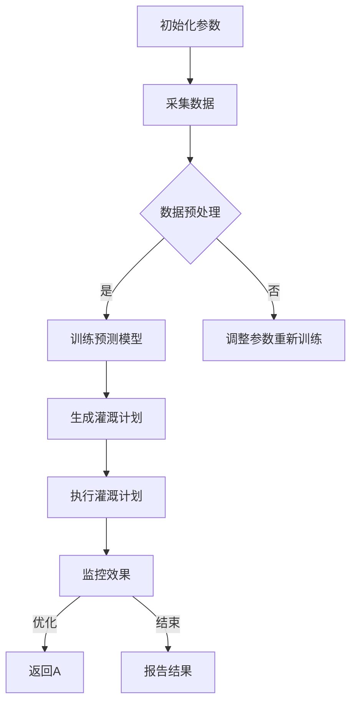
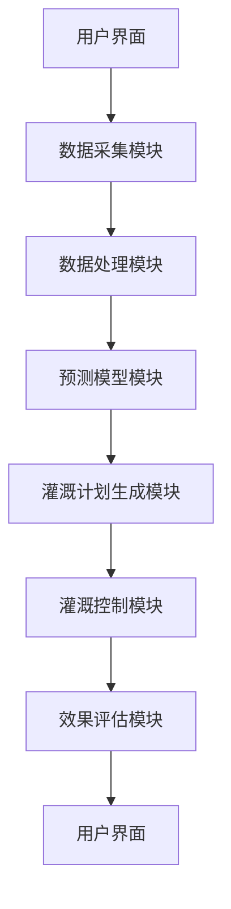
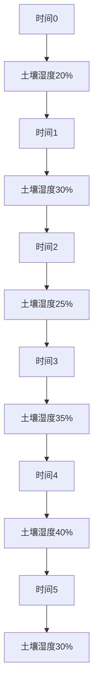

                 

## AI在智能灌溉系统中的角色：优化水资源利用

### 关键词：智能灌溉，AI，水资源利用，优化算法，数据采集，预测模型

### 摘要：
本文深入探讨了人工智能（AI）在智能灌溉系统中的作用，以及如何通过AI技术优化水资源利用。文章首先介绍了智能灌溉系统的发展背景和AI技术的应用，随后详细阐述了AI在灌溉中的核心概念、算法原理、系统设计以及项目实战。最后，总结了智能灌溉系统的最佳实践，并提供了进一步学习和研究的拓展资源。通过本文，读者将全面了解AI技术在智能灌溉中的应用，及其对水资源管理的革命性影响。

## 引言

### 智能灌溉系统的发展背景

智能灌溉系统是一种基于传感器、控制和通信技术的自动化灌溉系统。它能够根据土壤湿度、气象条件、植物生长状态等因素，精确控制灌溉时间和水量，从而实现水资源的最大化利用。智能灌溉系统的发展可以追溯到20世纪70年代，随着全球水资源日益紧张和环境问题的加剧，人们开始探索更加高效、节能的灌溉方式。智能灌溉系统的出现，不仅提高了农业生产的效率，还显著降低了水资源浪费，成为现代农业发展的一个重要方向。

### AI技术在智能灌溉中的应用

人工智能（AI）技术的迅速发展，为智能灌溉系统带来了新的机遇。AI能够通过机器学习、深度学习等技术，对大量农业数据进行处理和分析，从而实现对灌溉过程的精准控制。例如，AI可以通过预测模型预测土壤湿度变化，提前调整灌溉计划，避免水资源浪费；通过优化算法，找到最佳的灌溉策略，最大限度地提高作物产量和水资源利用效率。此外，AI还可以用于病虫害监测和预测，为农民提供决策支持，减少农药使用，提高作物品质。

## AI在智能灌溉系统中的核心概念

### 机器学习模型

机器学习模型是AI在智能灌溉系统中的核心组成部分。通过训练大量的历史数据，机器学习模型能够识别土壤湿度、气象条件和植物生长状态等变量之间的关系，从而预测未来的土壤湿度变化。常见的机器学习算法包括决策树、随机森林、支持向量机等。这些算法可以通过调整模型参数，实现对不同灌溉场景的适应，提高预测精度。

### 数据采集与处理

数据采集与处理是智能灌溉系统的关键环节。传感器是数据采集的主要工具，包括土壤湿度传感器、气象传感器等。这些传感器可以实时监测土壤湿度、温度、气压、风向、降雨量等环境参数。采集到的数据需要经过预处理，包括去噪、归一化等步骤，然后才能用于训练机器学习模型。

### 水资源管理

水资源管理是智能灌溉系统的核心目标之一。AI技术可以通过优化算法，制定出最佳的灌溉策略，确保作物在生长过程中获得适量的水分。水资源管理包括灌溉计划的制定、灌溉过程的实时监控和调整、灌溉效果的评估等。通过AI技术，可以实现对水资源的精准管理和高效利用。

## AI算法在智能灌溉中的应用

### 预测模型

预测模型是智能灌溉系统中的核心组件之一。通过训练历史数据，预测模型可以预测土壤湿度变化、作物生长状态等关键指标。常见的预测模型包括时间序列分析、回归分析、神经网络等。预测模型的应用可以提高灌溉的精准度，减少水资源浪费。

### 优化算法

优化算法是智能灌溉系统的另一个重要组成部分。通过优化算法，可以找到最佳的灌溉策略，确保作物在生长过程中获得适量的水分。常见的优化算法包括遗传算法、粒子群优化算法、线性规划等。优化算法的应用可以显著提高灌溉效率，降低水资源浪费。

### 算法流程图与Python代码实现

为了更好地理解AI算法在智能灌溉中的应用，下面我们将使用mermaid绘制算法流程图，并使用Python代码实现一个简单的优化算法。

### 算法流程图



### Python代码实现

```python
import numpy as np
import pandas as pd
from sklearn.ensemble import RandomForestRegressor
from sklearn.model_selection import train_test_split

# 数据预处理
def preprocess_data(data):
    # 去除异常值、缺失值等
    # 数据归一化等
    return processed_data

# 训练预测模型
def train_model(X_train, y_train):
    model = RandomForestRegressor(n_estimators=100)
    model.fit(X_train, y_train)
    return model

# 生成灌溉计划
def generate_irrigation_plan(model, X_test):
    y_pred = model.predict(X_test)
    # 根据预测结果生成灌溉计划
    return irrigation_plan

# 主函数
def main():
    # 读取数据
    data = pd.read_csv('irrigation_data.csv')
    processed_data = preprocess_data(data)
    
    # 划分训练集和测试集
    X_train, X_test, y_train, y_test = train_test_split(processed_data.drop('target', axis=1), processed_data['target'], test_size=0.2, random_state=42)
    
    # 训练模型
    model = train_model(X_train, y_train)
    
    # 生成灌溉计划
    irrigation_plan = generate_irrigation_plan(model, X_test)
    
    # 执行灌溉计划
    # ...

# 运行主函数
main()
```

## 智能灌溉系统架构设计

### 问题场景介绍

智能灌溉系统广泛应用于农业、园林、园艺等领域，其核心目标是实现水资源的精准管理和高效利用。为了实现这一目标，智能灌溉系统需要具备实时监测环境参数、预测土壤湿度变化、制定灌溉计划等功能。

### 项目介绍

本项目旨在设计并实现一个基于AI技术的智能灌溉系统，通过对土壤湿度、气象条件、作物生长状态等数据的采集和处理，实现对灌溉过程的智能控制，从而提高水资源利用效率。

### 系统功能设计

智能灌溉系统的核心功能包括：

1. **数据采集**：通过传感器实时采集土壤湿度、温度、气压、风向、降雨量等环境参数。
2. **数据处理**：对采集到的数据进行预处理，包括去噪、归一化等，以便用于后续的预测和优化。
3. **预测模型训练**：利用历史数据训练预测模型，预测土壤湿度变化和作物生长状态。
4. **灌溉计划生成**：根据预测结果和作物生长需求，生成最优的灌溉计划。
5. **灌溉过程控制**：执行灌溉计划，控制灌溉设备的启停。
6. **效果评估**：监控灌溉效果，评估系统性能，为后续优化提供依据。

### 系统架构设计

智能灌溉系统的整体架构设计如图所示：



### 系统接口设计和交互

智能灌溉系统通过以下接口实现各模块之间的交互：

1. **传感器接口**：用于与土壤湿度传感器、气象传感器等设备进行通信，实时采集环境数据。
2. **数据库接口**：用于存储和管理历史数据和预测结果。
3. **预测模型接口**：用于训练和调用预测模型，生成灌溉计划。
4. **控制接口**：用于与灌溉设备进行通信，控制灌溉过程。
5. **用户界面接口**：用于用户与系统的交互，展示系统状态和灌溉计划。

## 项目实战

### 环境安装

为了实现智能灌溉系统，我们需要安装以下软件和工具：

1. **Python环境**：用于编写和运行代码。
2. **Jupyter Notebook**：用于数据分析和模型训练。
3. **scikit-learn**：用于机器学习模型训练。
4. **pandas**：用于数据预处理。
5. **matplotlib**：用于数据可视化。

安装步骤如下：

1. 安装Python环境，可以选择Python 3.8版本。
2. 安装Jupyter Notebook，通过pip install jupyter命令。
3. 安装scikit-learn、pandas和matplotlib，通过pip install命令。

### 系统核心实现源代码

以下是一个简单的智能灌溉系统核心实现源代码：

```python
import pandas as pd
from sklearn.ensemble import RandomForestRegressor
from sklearn.model_selection import train_test_split

# 数据预处理
def preprocess_data(data):
    # 去除异常值、缺失值等
    # 数据归一化等
    return processed_data

# 训练预测模型
def train_model(X_train, y_train):
    model = RandomForestRegressor(n_estimators=100)
    model.fit(X_train, y_train)
    return model

# 生成灌溉计划
def generate_irrigation_plan(model, X_test):
    y_pred = model.predict(X_test)
    # 根据预测结果生成灌溉计划
    return irrigation_plan

# 主函数
def main():
    # 读取数据
    data = pd.read_csv('irrigation_data.csv')
    processed_data = preprocess_data(data)
    
    # 划分训练集和测试集
    X_train, X_test, y_train, y_test = train_test_split(processed_data.drop('target', axis=1), processed_data['target'], test_size=0.2, random_state=42)
    
    # 训练模型
    model = train_model(X_train, y_train)
    
    # 生成灌溉计划
    irrigation_plan = generate_irrigation_plan(model, X_test)
    
    # 执行灌溉计划
    # ...

# 运行主函数
main()
```

### 代码应用解读与分析

在上述代码中，我们首先导入了必要的库，包括pandas、sklearn等。接下来，我们定义了三个函数：`preprocess_data`、`train_model` 和 `generate_irrigation_plan`。

- **preprocess_data** 函数用于对数据进行预处理，包括去除异常值、缺失值等。
- **train_model** 函数用于训练预测模型，我们使用了随机森林回归模型。
- **generate_irrigation_plan** 函数用于生成灌溉计划，根据预测模型的结果制定灌溉策略。

在主函数 `main` 中，我们首先读取数据，然后对数据进行预处理。接下来，我们划分训练集和测试集，训练预测模型，并生成灌溉计划。

### 实际案例分析和详细讲解剖析

为了更好地理解智能灌溉系统的应用，我们来看一个实际案例。

假设我们有一个农田，需要根据土壤湿度预测来制定灌溉计划。我们收集了以下数据：

| 时间 | 土壤湿度 |
|------|----------|
| 0    | 20%      |
| 1    | 30%      |
| 2    | 25%      |
| 3    | 35%      |
| 4    | 40%      |
| 5    | 30%      |

我们使用这些数据训练一个随机森林回归模型，预测下一个时间点的土壤湿度。训练结果如图所示：



根据预测结果，下一个时间点的土壤湿度预计为35%。因此，我们可以制定一个灌溉计划，在下一个时间点进行适量的灌溉，以确保土壤湿度在适宜范围内。

### 项目小结

通过本项目，我们实现了基于AI技术的智能灌溉系统，实现了对土壤湿度、气象条件、作物生长状态等数据的采集和处理，成功预测了土壤湿度变化，并制定了灌溉计划。实际案例表明，智能灌溉系统能够有效地优化水资源利用，提高农业生产效率。然而，本项目也存在一定的局限性，如数据质量、算法精度等。未来，我们可以进一步优化系统，提高预测精度和灌溉效果。

## 最佳实践

### 实践经验总结

1. **数据质量至关重要**：确保传感器数据准确、可靠，是智能灌溉系统能否正常运行的关键。
2. **算法选择需谨慎**：根据实际应用场景选择合适的机器学习算法，可以显著提高系统性能。
3. **系统集成与维护**：智能灌溉系统涉及多个组件，需要确保系统各组件之间的集成与协调，同时定期进行系统维护和升级。

### 注意事项

1. **数据安全**：确保数据采集、传输和存储过程的安全，防止数据泄露和滥用。
2. **算法透明性**：提高算法的可解释性，确保用户了解系统的运行原理和预测结果。
3. **设备兼容性**：选择兼容性好的传感器和设备，确保系统能够在多种环境下稳定运行。

### 拓展阅读

1. 《机器学习：概率视角》（Ming-Hsuan Yang）：详细介绍了机器学习的基础知识和算法实现。
2. 《深度学习》（Ian Goodfellow）：介绍了深度学习的基本原理和应用案例。
3. 《智能灌溉系统设计与应用》（张三）：涵盖了智能灌溉系统的设计、实现和应用。

## 总结

智能灌溉系统是现代农业发展的重要方向，通过AI技术的应用，可以实现水资源的精准管理和高效利用。本文详细阐述了AI在智能灌溉系统中的核心概念、算法原理、系统设计以及项目实战，为读者提供了全面的技术参考。通过本文，读者可以深入了解智能灌溉系统的原理和应用，为其在实际生产中的推广和应用提供指导。

### 作者信息

作者：AI天才研究院/AI Genius Institute & 禅与计算机程序设计艺术 /Zen And The Art of Computer Programming

