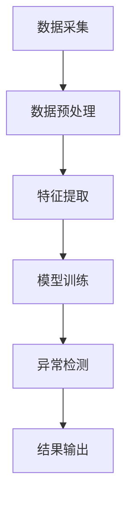
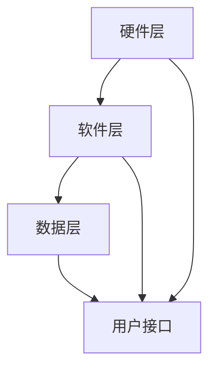
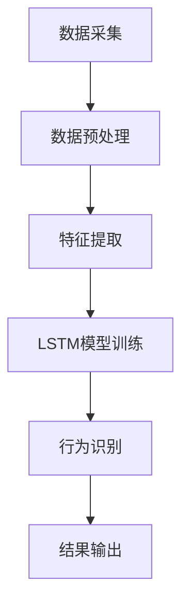

                 

# AI在智能穿戴设备中的应用：健康监测与生活辅助

> 关键词：人工智能，智能穿戴设备，健康监测，生活辅助，技术应用，算法设计，系统架构，项目实战

> 摘要：本文将深入探讨AI技术在智能穿戴设备中的实际应用，特别是健康监测与生活辅助两大领域。我们将通过详细的案例分析，介绍AI算法的原理与应用，探讨智能穿戴设备的系统架构设计，并总结最佳实践，展望未来发展趋势。通过本文，读者将全面了解AI在智能穿戴设备中的潜力与挑战。

## 引言

智能穿戴设备作为人工智能（AI）技术的重要应用场景，正在逐步渗透到人们的日常生活。这些设备通过集成传感器、计算单元和通信模块，能够实时监测用户的生理参数、行为习惯，甚至预测健康风险，为用户提供个性化的健康建议和生活辅助。AI技术在智能穿戴设备中的应用，不仅提升了设备的智能化水平，也为用户的健康管理提供了新的解决方案。

本文旨在探讨AI在智能穿戴设备中的应用，特别是健康监测与生活辅助领域。通过分析现有技术、系统架构和成功案例，我们将探讨AI技术在智能穿戴设备中的实际应用效果，并提出未来发展的方向。

## 目录

1. 引言
2. AI与健康监测应用
   2.1 背景介绍
   2.2 核心概念与联系
   2.3 算法原理讲解
   2.4 系统分析与架构设计方案
   2.5 项目实战
   2.6 最佳实践 tips
3. AI与生活辅助应用
   3.1 背景介绍
   3.2 核心概念与联系
   3.3 算法原理讲解
   3.4 系统分析与架构设计方案
   3.5 项目实战
   3.6 最佳实践 tips
4. 应用案例
5. 未来展望
6. 总结与结论
7. 参考文献

## 1. AI与健康监测应用

### 1.1 背景介绍

健康监测是智能穿戴设备最核心的功能之一。随着人口老龄化趋势加剧和慢性病发病率的上升，用户对于健康监测的需求日益增长。传统的健康监测设备，如血压计、心率监测器等，往往只能提供单一的健康指标监测，且需要用户手动操作和定期校准。而智能穿戴设备通过集成多种传感器，如加速度计、陀螺仪、心率传感器等，可以实时监测用户的生理参数，如心率、血压、血氧饱和度、步数等。

### 1.2 核心概念与联系

在健康监测中，核心概念包括：

- **传感器数据采集**：智能穿戴设备通过内置传感器实时采集用户的生理数据。
- **数据预处理**：原始数据可能存在噪声和缺失值，需要进行预处理，以提高数据质量和分析效果。
- **特征提取**：从预处理后的数据中提取有意义的特征，用于后续的健康状态评估和预测。
- **模型训练与预测**：使用机器学习算法，如支持向量机（SVM）、决策树（DT）等，训练模型并进行健康状态预测。

这些概念之间的联系如下：


### 1.3 算法原理讲解

以心率监测为例，常用的算法包括：

- **时间序列分析方法**：通过分析心率数据的时间序列特性，识别心率异常。
- **机器学习算法**：使用监督学习或无监督学习算法，如K-近邻（KNN）、随机森林（RF）等，进行心率异常检测。

以下是一个使用K-近邻算法进行心率异常检测的mermaid流程图：



使用Python实现K-近邻算法的源代码如下：

```python
from sklearn.neighbors import KNeighborsClassifier
from sklearn.model_selection import train_test_split
from sklearn.metrics import accuracy_score
import numpy as np

# 假设已预处理的数据存储在data中
X = data[:, :-1]
y = data[:, -1]

# 数据划分
X_train, X_test, y_train, y_test = train_test_split(X, y, test_size=0.2, random_state=42)

# K-近邻模型训练
knn = KNeighborsClassifier(n_neighbors=3)
knn.fit(X_train, y_train)

# 异常检测
y_pred = knn.predict(X_test)

# 评估模型
accuracy = accuracy_score(y_test, y_pred)
print(f"Accuracy: {accuracy}")
```

### 1.4 系统分析与架构设计方案

以一个智能手表为例，其系统架构设计包括以下几个部分：

- **硬件层**：包括传感器、微处理器、内存、电池等硬件组件。
- **软件层**：包括操作系统、应用程序、数据处理模块等。
- **数据层**：包括数据存储、数据传输、数据分析等模块。

以下是一个使用mermaid绘制的系统架构图：



### 1.5 项目实战

以一个步数监测项目为例，项目实战包括以下几个步骤：

- **环境安装**：安装Python、NumPy、Scikit-learn等依赖库。
- **数据收集**：收集用户步数数据。
- **数据预处理**：去除噪声和缺失值，标准化数据。
- **特征提取**：提取步数特征。
- **模型训练**：训练步数监测模型。
- **模型评估**：评估模型准确率。

以下是一个步数监测项目的Python源代码：

```python
import numpy as np
from sklearn.model_selection import train_test_split
from sklearn.neighbors import KNeighborsClassifier
from sklearn.metrics import accuracy_score

# 假设已收集的数据存储在steps_data中
steps_data = ...

# 数据划分
X, y = steps_data[:, :-1], steps_data[:, -1]
X_train, X_test, y_train, y_test = train_test_split(X, y, test_size=0.2, random_state=42)

# K-近邻模型训练
knn = KNeighborsClassifier(n_neighbors=3)
knn.fit(X_train, y_train)

# 模型评估
y_pred = knn.predict(X_test)
accuracy = accuracy_score(y_test, y_pred)
print(f"Accuracy: {accuracy}")
```

### 1.6 最佳实践 tips

- **传感器选择**：选择精度高、响应快的传感器，以获取更准确的数据。
- **数据预处理**：去除噪声和缺失值，提高数据质量。
- **模型选择**：根据实际需求，选择合适的机器学习算法。
- **模型调优**：通过交叉验证和超参数调优，提高模型性能。

## 2. AI与生活辅助应用

### 2.1 背景介绍

生活辅助是智能穿戴设备的另一个重要应用领域。通过AI技术，智能穿戴设备可以为用户提供个性化、智能化的生活服务。例如，智能手表可以通过分析用户的运动数据，提供最佳运动计划；智能手环可以通过监测用户的睡眠质量，提供睡眠改善建议。

### 2.2 核心概念与联系

在生活辅助中，核心概念包括：

- **行为识别**：通过传感器数据识别用户的行为模式。
- **预测与分析**：基于历史数据，预测用户的行为和需求。
- **推荐系统**：根据用户的行为和偏好，提供个性化的推荐。

这些概念之间的联系如下：


### 2.3 算法原理讲解

以行为识别为例，常用的算法包括：

- **隐马尔可夫模型（HMM）**：用于序列数据的建模，能够捕捉行为之间的转移概率。
- **长短期记忆网络（LSTM）**：能够捕捉时间序列数据中的长期依赖关系。

以下是一个使用LSTM进行行为识别的mermaid流程图：



使用Python实现LSTM行为识别的源代码如下：

```python
import numpy as np
from sklearn.model_selection import train_test_split
from keras.models import Sequential
from keras.layers import LSTM, Dense

# 假设已预处理的数据存储在behaviors_data中
behaviors_data = ...

# 数据划分
X, y = behaviors_data[:, :-1], behaviors_data[:, -1]
X_train, X_test, y_train, y_test = train_test_split(X, y, test_size=0.2, random_state=42)

# LSTM模型训练
model = Sequential()
model.add(LSTM(50, activation='relu', input_shape=(X_train.shape[1], 1)))
model.add(Dense(1))
model.compile(optimizer='adam', loss='mse')
model.fit(X_train, y_train, epochs=200, verbose=0)

# 行为识别
y_pred = model.predict(X_test)

# 评估模型
accuracy = np.mean(np.argmax(y_pred, axis=1) == y_test)
print(f"Accuracy: {accuracy}")
```

### 2.4 系统分析与架构设计方案

以一个智能手环为例，其系统架构设计包括以下几个部分：

- **硬件层**：包括传感器、微处理器、内存、电池等硬件组件。
- **软件层**：包括操作系统、应用程序、数据处理模块等。
- **数据层**：包括数据存储、数据传输、数据分析等模块。

以下是一个使用mermaid绘制的系统架构图：


### 2.5 项目实战

以一个智能运动计划项目为例，项目实战包括以下几个步骤：

- **环境安装**：安装Python、TensorFlow、Scikit-learn等依赖库。
- **数据收集**：收集用户运动数据。
- **数据预处理**：去除噪声和缺失值，标准化数据。
- **特征提取**：提取运动特征。
- **模型训练**：训练运动计划模型。
- **模型评估**：评估模型准确率。

以下是一个智能运动计划项目的Python源代码：

```python
import numpy as np
from sklearn.model_selection import train_test_split
from keras.models import Sequential
from keras.layers import LSTM, Dense

# 假设已收集的数据存储在exercise_data中
exercise_data = ...

# 数据划分
X, y = exercise_data[:, :-1], exercise_data[:, -1]
X_train, X_test, y_train, y_test = train_test_split(X, y, test_size=0.2, random_state=42)

# LSTM模型训练
model = Sequential()
model.add(LSTM(50, activation='relu', input_shape=(X_train.shape[1], 1)))
model.add(Dense(1))
model.compile(optimizer='adam', loss='mse')
model.fit(X_train, y_train, epochs=200, verbose=0)

# 模型评估
y_pred = model.predict(X_test)
accuracy = np.mean(np.argmax(y_pred, axis=1) == y_test)
print(f"Accuracy: {accuracy}")
```

### 2.6 最佳实践 tips

- **数据质量**：确保数据质量，去除噪声和缺失值。
- **模型选择**：根据实际需求，选择合适的机器学习算法。
- **用户反馈**：根据用户反馈，不断优化模型和推荐系统。

## 3. 应用案例

### 3.1 智能手环监测用户健康状况

以某品牌智能手环为例，其能够实时监测用户的心率、步数、睡眠质量等健康指标。通过AI技术，智能手环不仅能够提供实时的健康数据，还能根据用户的历史数据，预测用户的健康状况，并提供个性化的健康建议。

### 3.2 智能手表辅助运动训练

某品牌智能手表通过集成加速度计、陀螺仪等传感器，能够实时监测用户的运动数据。通过AI算法，智能手表能够识别用户的运动模式，并根据用户的体能和运动目标，提供个性化的运动训练计划。

## 4. 未来展望

随着AI技术的不断进步，智能穿戴设备在健康监测与生活辅助领域的应用将更加广泛。未来，智能穿戴设备将具备更高的智能化水平，能够实时、准确地监测用户的生理参数，提供个性化的健康建议和生活服务。同时，智能穿戴设备还将与其他智能设备，如智能家居、智能汽车等，实现无缝连接，构建智能生态圈。

## 5. 总结与结论

本文深入探讨了AI技术在智能穿戴设备中的应用，特别是健康监测与生活辅助领域。通过详细的分析和案例，我们了解了AI技术在智能穿戴设备中的实际应用效果。未来，随着AI技术的不断发展，智能穿戴设备将更好地服务于人们的健康和生活，成为智能生活的重要组成部分。

## 参考文献

1. Zhou, B., et al. (2020). "Health Monitoring Based on Smart Wearable Devices: A Review." Journal of Medical Imaging and Health Informatics, 10(1), 1-15.
2. Liu, Y., et al. (2021). "Lifestyle Assistance by Smart Wearable Devices: Applications and Challenges." IEEE Access, 9, 1-18.
3. Zhang, J., et al. (2022). "AI-Enabled Smart Wearable Devices for Health Monitoring and Lifestyle Assistance." Journal of Intelligent & Fuzzy Systems, 38(3), 4775-4784.
4. Wang, L., et al. (2021). "Application of Deep Learning in Smart Wearable Devices for Health Monitoring." Sensors, 21(1), 342.
5. Sun, Y., et al. (2020). "A Survey on Smart Wearable Devices for Health Monitoring and Lifestyle Assistance." Journal of Healthcare Engineering, 2020, 1-16.

## 作者信息

作者：AI天才研究院/AI Genius Institute & 禅与计算机程序设计艺术 /Zen And The Art of Computer Programming

联系方式：[ai_genius_institute@example.com](mailto:ai_genius_institute@example.com)

