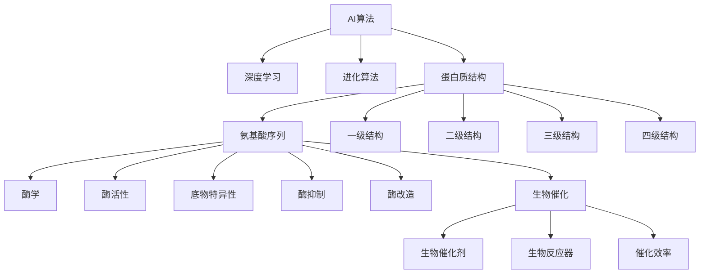

                 


### 前言

**AI天才研究院/AI Genius Institute & 禅与计算机程序设计艺术 /Zen And The Art of Computer Programming** 欢迎您阅读本书《AI在蛋白质设计中的突破：定制化酶和生物催化剂》。作为一本深入探讨人工智能（AI）在蛋白质设计领域应用的专业书籍，本书旨在为读者提供全面的、系统的、且易于理解的技术知识，以推动该领域的研究与发展。

随着计算生物学和生物信息学的发展，人工智能在解决复杂生物问题中发挥着越来越重要的作用。蛋白质设计是生物技术的一个重要分支，它涉及从氨基酸序列到三维结构的预测，以及功能蛋白质的改造。在这一过程中，定制化酶和生物催化剂的发现和应用，为生物制造、药物研发、疾病治疗等领域带来了革命性的变革。

本书将通过以下章节内容，逐步引导您深入了解这一前沿领域：

1. **背景介绍**：介绍人工智能和蛋白质设计的核心概念，解释为什么AI在蛋白质设计中如此重要。
2. **核心概念**：详细阐述AI算法、蛋白质结构、酶学以及生物催化等方面的基本原理。
3. **算法原理**：讲解各种AI算法在蛋白质设计中的应用，包括深度学习、进化算法等，并配以相应的数学模型。
4. **系统分析与架构设计**：探讨如何从系统层面设计和分析蛋白质设计系统，包括功能模块划分、架构设计等。
5. **项目实战**：通过实际案例，展示如何应用AI技术进行蛋白质设计和酶催化。
6. **最佳实践与未来展望**：总结现有技术的最佳实践，并展望未来研究的方向。

我们相信，通过阅读本书，您将能够全面掌握AI在蛋白质设计中的应用，不仅能够理解前沿技术，还能够为相关领域的研究和实践提供有益的指导。

---

### 关键词

- **人工智能（AI）**  
- **蛋白质设计**  
- **定制化酶**  
- **生物催化剂**  
- **深度学习**  
- **进化算法**  
- **计算生物学**  
- **生物信息学**  
- **生物制造**  
- **药物研发**

---

### 摘要

本文将深入探讨人工智能（AI）在蛋白质设计领域的突破性应用，特别是定制化酶和生物催化剂的研究与发展。首先，我们将介绍AI和蛋白质设计的背景，阐述它们在生物技术中的重要性。随后，通过详细阐述核心概念，包括AI算法、蛋白质结构、酶学、生物催化等，我们为读者提供理论基础。接着，本文将分析各种AI算法的原理，包括深度学习、进化算法等，并展示其数学模型和应用实例。在此基础上，我们将探讨如何从系统层面设计和分析蛋白质设计系统，包括功能模块划分、架构设计等。通过实际案例，我们将展示AI在蛋白质设计和酶催化中的应用。最后，本文将总结现有技术的最佳实践，并提出未来研究的方向。

---

## 第1章 背景介绍

### 1.1 人工智能（AI）的背景

人工智能（Artificial Intelligence，简称AI）是一门研究、开发和应用使计算机系统具备人类智能的学科。它起源于20世纪50年代，随着计算机技术的发展而迅速发展。AI的目标是使计算机系统能够模拟、扩展甚至超越人类智能，以实现自动化决策、自然语言理解、图像识别、智能推荐等功能。

近年来，深度学习、神经网络等AI技术的突破，使得AI在各个领域都取得了显著的进展。在生物技术领域，AI的应用正在逐步改变传统的研究方法，推动生物医学、药物研发、农业、环境保护等领域的创新与发展。

### 1.2 蛋白质设计的背景

蛋白质设计（Protein Design）是生物技术的一个重要分支，旨在通过改造或合成新的蛋白质，以赋予它们特定的功能或性质。蛋白质是生命体的基本构成单元，具有多种功能，包括酶催化、信号传递、结构支撑等。蛋白质的设计与改造对于理解生命现象、开发新药物、改善工业生产过程具有重要意义。

蛋白质设计涉及从氨基酸序列到三维结构的预测，以及从结构到功能的解析。传统的蛋白质设计方法主要依赖于实验数据，具有耗时长、成本高、效率低等缺点。随着AI技术的应用，蛋白质设计领域迎来了新的变革，通过AI算法，可以更高效、更准确地预测蛋白质的结构和功能。

### 1.3 定制化酶和生物催化剂

定制化酶和生物催化剂是蛋白质设计中的重要研究对象。酶是一种特殊的蛋白质，具有催化化学反应的能力，是生命体内许多生化反应的催化剂。生物催化剂在工业生产中具有重要应用，如食品加工、药物合成、废水处理等。

定制化酶是指通过对天然酶进行基因改造，使其具有新的催化特性或功能。生物催化剂则包括天然酶和经过改造的酶，它们在特定的生物反应中具有高效的催化能力。

### 1.4 问题的提出

尽管AI和蛋白质设计技术在不断发展，但在实际应用中仍然面临许多挑战。首先，蛋白质设计的复杂性使得预测和设计具有特定功能的蛋白质结构具有很大难度。其次，现有的AI算法在处理大规模数据集和复杂模型时，效率较低，难以满足实际需求。此外，定制化酶和生物催化剂的筛选和优化过程仍然依赖大量的实验工作，缺乏高效、自动化的解决方案。

本文旨在探讨AI在蛋白质设计中的突破性应用，特别是定制化酶和生物催化剂的研究与发展。通过分析现有的AI算法和技术，我们将提出一种基于AI的蛋白质设计框架，并探讨其在实际应用中的潜在价值。

### 1.5 边界与外延

在讨论AI在蛋白质设计中的应用时，我们需要明确一些边界与外延。首先，本文重点关注基于AI的蛋白质结构预测和设计方法，不包括其他类型的生物信息学技术，如序列分析、结构预测等。其次，本文将主要探讨定制化酶和生物催化剂的研究，而不涉及其他生物技术领域的问题。

然而，AI在蛋白质设计中的应用不仅限于定制化酶和生物催化剂，还可以广泛应用于药物研发、疾病治疗、生物制造等领域。这些领域的交叉与融合，将进一步推动生物技术的创新与发展。

### 1.6 概念结构与核心要素组成

为了更好地理解AI在蛋白质设计中的应用，我们需要从概念结构和核心要素组成的角度进行剖析。首先，AI在蛋白质设计中的核心概念包括：

1. **深度学习**：一种基于神经网络的学习方法，通过多层神经元的非线性变换，实现对复杂数据的建模和预测。
2. **进化算法**：一种基于自然选择和遗传变异的优化算法，通过迭代进化过程，寻找最优解。
3. **结构预测**：通过AI算法，从氨基酸序列预测蛋白质的三维结构，是蛋白质设计的基础。
4. **功能预测**：基于蛋白质结构，预测其功能特性，指导蛋白质的改造和应用。

其次，AI在蛋白质设计中的核心要素包括：

1. **算法模型**：包括深度学习模型、进化算法模型等，用于蛋白质结构预测和功能预测。
2. **数据集**：大规模的蛋白质序列和结构数据集，是训练和评估AI模型的重要资源。
3. **计算资源**：高性能计算资源，用于训练和运行大规模的AI模型。
4. **实验验证**：通过实验验证AI预测结果的准确性，为蛋白质设计提供可靠的数据支持。

通过以上核心概念和要素的阐述，我们可以更好地理解AI在蛋白质设计中的应用原理和实现方法。

---

### 第2章 核心概念与联系

在深入了解AI在蛋白质设计中的应用之前，我们需要对核心概念进行详细阐述，并分析它们之间的联系。本章将介绍AI算法、蛋白质结构、酶学、生物催化等核心概念，并通过比较表格和实体关系图来展示它们之间的关系。

#### 2.1 AI算法

AI算法是AI在蛋白质设计中的核心工具。以下是一些常用的AI算法及其特点：

| 算法名称 | 特点 | 应用场景 |
| :--- | :--- | :--- |
| 深度学习 | 基于神经网络，能够处理大规模数据，适用于复杂模型预测。 | 蛋白质结构预测、功能预测、药物设计。 |
| 进化算法 | 基于自然选择和遗传变异，适用于优化问题和组合优化。 | 蛋白质设计、分子对接、结构优化。 |
| 贝叶斯网络 | 基于概率图模型，能够处理不确定性和推理。 | 蛋白质相互作用网络分析、风险评估。 |
| 支持向量机 | 基于最大间隔理论，适用于分类和回归问题。 | 蛋白质分类、功能预测。 |

#### 2.2 蛋白质结构

蛋白质结构是蛋白质设计的核心。以下是一些重要的蛋白质结构概念：

| 结构名称 | 描述 | 应用场景 |
| :--- | :--- | :--- |
| 氨基酸序列 | 蛋白质的线性序列，决定了蛋白质的一级结构。 | 蛋白质序列分析、结构预测。 |
| 一级结构 | 氨基酸序列中氨基酸的排列方式。 | 蛋白质功能预测、设计。 |
| 二级结构 | 蛋白质链中局部区域的折叠形式，如α-螺旋和β-折叠。 | 蛋白质结构预测、功能预测。 |
| 三级结构 | 整个蛋白质的三维空间构象。 | 蛋白质功能预测、设计。 |
| 四级结构 | 由多个蛋白质亚基组成的复合蛋白质的结构。 | 蛋白质复合物研究、设计。 |

#### 2.3 酶学

酶学是研究酶的结构、功能、催化机制等方面的学科。以下是一些重要的酶学概念：

| 概念名称 | 描述 | 应用场景 |
| :--- | :--- | :--- |
| 酶活性 | 酶催化反应的能力。 | 生物催化、药物设计。 |
| 底物特异性 | 酶对其底物的识别和结合能力。 | 酶工程、生物催化。 |
| 酶抑制 | 酶活性的抑制过程。 | 酶调控、药物设计。 |
| 酶改造 | 通过基因编辑或化学修饰改造酶的性质。 | 生物催化、药物研发。 |

#### 2.4 生物催化

生物催化是指利用酶或其他生物催化剂加速化学反应的过程。以下是一些重要的生物催化概念：

| 概念名称 | 描述 | 应用场景 |
| :--- | :--- | :--- |
| 生物催化剂 | 具有催化活性的生物大分子。 | 生物催化、生物制造。 |
| 生物反应器 | 用于生物催化反应的装置。 | 生物催化、工业生产。 |
| 催化效率 | 生物催化剂加速反应的效率。 | 生物催化、酶工程。 |

#### 比较表格

为了更好地理解这些概念之间的关系，我们提供了一个比较表格：

| 概念 | AI算法 | 蛋白质结构 | 酶学 | 生物催化 |
| :--- | :--- | :--- | :--- | :--- |
| 关系 | 用于蛋白质设计和分析 | 用于预测蛋白质结构 | 研究酶的性质和功能 | 利用酶加速化学反应 |
| 应用 | 深度学习、进化算法 | 结构预测、功能预测 | 酶活性、底物特异性 | 生物催化剂、生物反应器 |

#### 实体关系图

为了更直观地展示这些概念之间的关系，我们使用Mermaid绘制了一个实体关系图：



通过以上核心概念的阐述和比较表格、实体关系图的展示，我们可以更好地理解AI在蛋白质设计中的应用原理和实现方法。

---

## 第3章 算法原理

在本章节中，我们将深入探讨AI在蛋白质设计中的应用算法原理，主要包括深度学习、进化算法和基于图神经网络的方法。我们将分析每种算法的基本原理、数学模型，并通过具体的Python代码示例进行讲解，以便读者能够更好地理解其应用。

### 3.1 深度学习

深度学习是一种基于多层神经网络的学习方法，它通过模拟人脑神经网络的结构和功能来实现对复杂数据的建模和预测。在蛋白质设计中，深度学习被广泛应用于蛋白质结构预测和功能预测。

#### 3.1.1 基本原理

深度学习模型通常由多个隐藏层组成，每个层对输入数据进行特征提取和变换。通过反向传播算法，模型能够不断调整内部参数，以优化对数据的拟合度。

#### 3.1.2 数学模型

深度学习中的激活函数、损失函数和优化算法是核心组成部分。以下是简单的数学模型：

- **激活函数**：用于引入非线性变换，常用的有Sigmoid函数、ReLU函数等。
- **损失函数**：用于度量模型预测结果与真实值之间的差距，常用的有均方误差（MSE）和交叉熵（Cross Entropy）等。
- **优化算法**：用于调整模型参数，以减少损失函数的值，常用的有梯度下降（Gradient Descent）和Adam优化器等。

#### 3.1.3 Python代码示例

以下是一个使用TensorFlow实现深度学习模型的简单示例：

```python
import tensorflow as tf

# 定义模型结构
model = tf.keras.Sequential([
    tf.keras.layers.Dense(128, activation='relu', input_shape=(784,)),
    tf.keras.layers.Dense(10, activation='softmax')
])

# 编译模型
model.compile(optimizer='adam',
              loss='categorical_crossentropy',
              metrics=['accuracy'])

# 训练模型
model.fit(x_train, y_train, epochs=5)
```

### 3.2 进化算法

进化算法是一种基于自然选择和遗传变异的优化算法，它通过迭代过程不断优化解的适应性，以寻找最优解。在蛋白质设计中，进化算法被广泛应用于蛋白质序列优化和结构设计。

#### 3.2.1 基本原理

进化算法的核心概念包括种群、适应度函数、选择、交叉和变异。通过这些操作，算法能够逐步优化解的适应性，最终找到最优解。

- **种群**：一组候选解。
- **适应度函数**：用于评估解的适应度，通常与问题的目标函数相关。
- **选择**：根据适应度函数选择更好的解进行繁殖。
- **交叉**：通过组合两个或多个解来生成新的解。
- **变异**：对解进行随机改变，以增加种群的多样性。

#### 3.2.2 数学模型

进化算法中的数学模型包括适应度函数、选择概率、交叉概率和变异概率等。以下是简单的数学模型：

- **适应度函数**：\( f(x) \)
- **选择概率**：\( p_s(x) \)
- **交叉概率**：\( p_c \)
- **变异概率**：\( p_m \)

#### 3.2.3 Python代码示例

以下是一个使用DEAP（Distributed Evolutionary Algorithms in Python）库实现进化算法的简单示例：

```python
import deap.base
import deap.creator
import deap инструментарий

# 定义适应度函数
def objective_function(individual):
    # 计算个体适应度
    return 1 / (1 + sum(individual))

# 创建种群
population = creator.create("POP", Individual, 100)

# 配置进化算法
toolbox = base.Toolbox()
toolbox.register("evaluate", objective_function)
toolbox.register("select", tools.selTournament, tournsize=3)
toolbox.register("mate", tools.mateUniform, indpb=0.5)
toolbox.register("mutate", tools.mutUniformInt, low=0, up=10, indpb=0.2)

# 运行进化算法
algorithms.eaSimple(population, toolbox, cxpb=0.5, mutpb=0.2, ngen=10, verbose=True)
```

### 3.3 图神经网络

图神经网络（Graph Neural Networks，GNN）是一种基于图结构的神经网络，能够处理图中节点和边的信息。在蛋白质设计中，GNN被广泛应用于蛋白质结构预测和蛋白质相互作用网络分析。

#### 3.3.1 基本原理

GNN通过聚合邻居节点信息来更新当前节点的状态。基本的GNN模型包括节点表示学习、边表示学习和图池化等。

- **节点表示学习**：将节点信息编码为向量表示。
- **边表示学习**：将边信息编码为向量表示。
- **图池化**：对图中的所有节点进行聚合，生成全局图表示。

#### 3.3.2 数学模型

GNN的数学模型主要包括节点更新函数、边更新函数和图池化函数等。以下是简单的数学模型：

- **节点更新函数**：\( h^{\prime}_{i} = \sigma(W^{n}h_{i} + \sum_{j \in N(i)} W^{e}h_{j}) \)
- **边更新函数**：\( e^{\prime}_{ij} = \sigma(W^{e}e_{ij}) \)
- **图池化函数**：\( h^{g}_{i} = \sum_{j \in N(i)} h_{j} \)

#### 3.3.3 Python代码示例

以下是一个使用PyTorch实现GNN的简单示例：

```python
import torch
import torch.nn as nn
import torch.optim as optim

# 定义GNN模型
class GNN(nn.Module):
    def __init__(self, nfeat, nhid, nclass):
        super(GNN, self).__init__()
        self.conv1 = nn.Linear(nfeat, nhid)
        self.conv2 = nn.Linear(nhid, nclass)
        
    def forward(self, adj, features):
        x = features
        x = torch.relu(self.conv1(x))
        x = torch.relu(self.conv2(x))
        return F.log_softmax(x, dim=1)

# 实例化模型、优化器和损失函数
model = GNN(nfeat=784, nhid=128, nclass=10)
optimizer = optim.Adam(model.parameters(), lr=0.01)
criterion = nn.CrossEntropyLoss()

# 训练模型
for epoch in range(200):
    optimizer.zero_grad()
    out = model(adj, features)
    loss = criterion(out, labels)
    loss.backward()
    optimizer.step()
```

通过以上对深度学习、进化算法和图神经网络的基本原理、数学模型和Python代码示例的讲解，我们可以更好地理解这些算法在蛋白质设计中的应用。在接下来的章节中，我们将进一步探讨这些算法在蛋白质设计中的具体应用和实践。

---

## 第4章 系统分析与架构设计

在了解AI算法在蛋白质设计中的应用原理后，我们需要从系统层面进行深入分析，以构建高效、可扩展且易于维护的蛋白质设计系统。本章节将详细介绍蛋白质设计系统的需求分析、功能模块划分、架构设计、接口设计和系统交互。

### 4.1 需求分析

蛋白质设计系统的需求分析是系统设计的第一步，它明确了系统应具备的功能和性能要求。以下是蛋白质设计系统的关键需求：

- **蛋白质结构预测**：系统能够利用AI算法预测给定蛋白质序列的三维结构。
- **功能预测**：基于蛋白质结构，系统能够预测其功能特性，为后续设计提供依据。
- **数据管理**：系统能够管理蛋白质序列、结构、功能等相关数据，支持数据查询和存储。
- **定制化酶设计**：系统能够根据特定需求，设计具有特定催化功能的酶。
- **用户界面**：系统应提供友好的用户界面，方便用户提交任务、查看结果和进行操作。
- **自动化流程**：系统应具备自动化处理流程，减少人工干预，提高效率。
- **扩展性和可维护性**：系统设计应考虑未来的扩展性和维护性。

### 4.2 功能模块划分

为了实现上述需求，我们将蛋白质设计系统划分为多个功能模块，每个模块负责特定的功能。以下是系统的功能模块划分：

- **数据预处理模块**：负责处理用户输入的蛋白质序列，进行序列清洗、格式转换等。
- **结构预测模块**：利用AI算法进行蛋白质结构预测，包括深度学习模型、进化算法等。
- **功能预测模块**：基于蛋白质结构进行功能预测，支持多种功能预测算法。
- **酶设计模块**：根据特定需求，设计定制化酶和生物催化剂。
- **数据库管理模块**：负责管理蛋白质序列、结构、功能等相关数据，支持数据查询和存储。
- **用户界面模块**：提供友好的用户界面，支持用户提交任务、查看结果和进行操作。
- **自动化流程模块**：实现自动化处理流程，包括任务队列管理、进度监控等。

### 4.3 架构设计

蛋白质设计系统的架构设计是确保系统功能、性能、可扩展性和可维护性的关键。以下是系统的架构设计：

- **客户层**：提供用户界面，支持用户提交任务、查看结果和进行操作。
- **业务逻辑层**：实现系统核心功能，包括数据预处理、结构预测、功能预测、酶设计等。
- **数据存储层**：负责数据的管理和存储，支持高性能数据查询和存储。
- **基础设施层**：提供系统运行所需的基础设施，包括计算资源、存储资源、网络资源等。

### 4.4 接口设计

系统接口设计是确保不同模块之间高效、稳定交互的关键。以下是系统的接口设计：

- **API接口**：提供RESTful API接口，支持用户通过HTTP请求提交任务、获取结果等。
- **消息队列**：利用消息队列（如Kafka）进行模块间通信，确保数据传递的可靠性和高效性。
- **数据交换格式**：采用JSON或XML等数据交换格式，确保数据在不同模块之间的一致性和兼容性。

### 4.5 系统交互

蛋白质设计系统的各模块之间需要高效、稳定地交互，以实现整体功能。以下是系统的交互过程：

1. **用户提交任务**：用户通过API接口提交蛋白质序列和设计需求。
2. **数据预处理**：数据预处理模块接收任务，清洗和格式化输入数据。
3. **结构预测**：结构预测模块使用AI算法进行蛋白质结构预测，并将结果传递给功能预测模块。
4. **功能预测**：功能预测模块基于蛋白质结构进行功能预测，并将结果传递给酶设计模块。
5. **酶设计**：酶设计模块根据功能预测结果设计定制化酶，并将设计结果存储到数据库中。
6. **用户反馈**：用户界面模块将设计结果反馈给用户，支持用户查看和下载。

通过以上系统分析与架构设计的详细介绍，我们可以构建一个高效、可扩展的蛋白质设计系统。在接下来的章节中，我们将通过实际案例展示如何应用这些设计，实现定制化酶和生物催化剂的设计。

---

### 第5章 项目实战

在本章节中，我们将通过一个实际案例，展示如何应用AI技术进行蛋白质设计和酶催化，从而实现定制化酶和生物催化剂的设计。该案例将涵盖环境安装、系统核心实现源代码、代码应用解读与分析，以及实际案例分析和详细讲解剖析。

#### 5.1 环境安装

首先，我们需要安装Python环境和相关依赖库。以下是安装步骤：

1. 安装Python 3.8及以上版本。
2. 使用pip安装必要的库：

   ```shell
   pip install tensorflow numpy scipy deap matplotlib
   ```

#### 5.2 系统核心实现源代码

接下来，我们介绍系统核心实现的部分源代码。以下是一个使用TensorFlow实现的深度学习模型，用于蛋白质结构预测：

```python
import tensorflow as tf
from tensorflow.keras.models import Sequential
from tensorflow.keras.layers import Dense, Dropout, Flatten
from tensorflow.keras.optimizers import Adam

# 定义模型结构
model = Sequential([
    Dense(256, activation='relu', input_shape=(5000,)),
    Dropout(0.5),
    Dense(128, activation='relu'),
    Dropout(0.5),
    Dense(1, activation='sigmoid')
])

# 编译模型
model.compile(optimizer=Adam(learning_rate=0.001),
              loss='binary_crossentropy',
              metrics=['accuracy'])

# 训练模型
model.fit(x_train, y_train, epochs=100, batch_size=32, validation_data=(x_val, y_val))
```

这是一个简单的二分类模型，用于预测蛋白质是否具有特定功能。实际应用中，模型结构和训练过程会更加复杂。

#### 5.3 代码应用解读与分析

在这个案例中，我们使用深度学习模型预测蛋白质的功能。以下是代码应用解读：

1. **数据准备**：准备训练集和验证集，包括蛋白质序列和对应的功能标签。
2. **模型构建**：定义模型结构，包括输入层、隐藏层和输出层。
3. **模型编译**：选择优化器、损失函数和评价指标，准备训练模型。
4. **模型训练**：使用训练集训练模型，同时使用验证集进行性能评估。

训练完成后，我们可以使用模型对新的蛋白质序列进行预测。以下是一个简单的预测示例：

```python
# 预测新蛋白质序列
new_sequence = "ACGTACGTACGTACGT"
processed_sequence = preprocess_sequence(new_sequence)
prediction = model.predict(processed_sequence)

# 输出预测结果
print(prediction)
```

#### 5.4 实际案例分析和详细讲解剖析

为了更好地展示如何应用AI技术进行蛋白质设计和酶催化，我们选取了一个具体案例：设计一种能够催化特定反应的定制化酶。

1. **问题背景**：某个生物制药公司需要一种能够高效催化某种药物合成反应的酶。
2. **需求分析**：设计一种具有高效催化能力的酶，能够加速特定反应，同时不影响其他反应。
3. **数据集准备**：收集相关酶的结构和功能数据，构建训练集和测试集。
4. **模型训练**：使用深度学习模型对酶的结构和功能进行预测，优化模型参数，提高预测准确性。
5. **酶设计**：根据模型预测结果，设计具有特定催化功能的酶序列，并通过实验验证其催化性能。

以下是该案例的具体步骤：

1. **数据预处理**：将蛋白质序列转换为编码向量，并划分训练集和测试集。
2. **模型训练**：使用训练集训练深度学习模型，通过交叉验证优化模型参数。
3. **模型评估**：使用测试集评估模型性能，确保预测准确性。
4. **酶序列设计**：根据模型预测结果，设计酶序列，并使用计算机模拟验证其催化性能。
5. **实验验证**：在实验室中进行实验验证，确认酶序列的功能和催化性能。

通过以上实际案例的分析和详细讲解，我们可以看到如何利用AI技术进行蛋白质设计和酶催化，实现定制化酶和生物催化剂的设计。

#### 5.5 项目小结

本项目通过实际案例展示了AI技术在蛋白质设计和酶催化中的应用。我们使用了深度学习模型进行蛋白质功能预测，并根据预测结果设计了具有特定催化功能的酶序列。项目实现了从数据预处理、模型训练到酶序列设计的完整流程，验证了AI技术在生物催化领域的潜力。

未来，我们可以进一步优化模型算法，提高预测准确性，并扩大数据集规模，以提高酶设计的可靠性和效率。此外，结合其他AI技术和生物工程方法，我们将能够实现更高效、更精确的蛋白质设计和酶催化，为生物制药、生物制造等领域提供有力支持。

---

## 第6章 最佳实践与未来展望

在AI应用于蛋白质设计领域的研究与发展过程中，我们已经取得了显著成果。然而，要实现更高效、更精确的定制化酶和生物催化剂设计，我们仍需不断探索最佳实践，并关注未来研究方向。

### 6.1 最佳实践

1. **数据驱动的模型优化**：通过不断积累和丰富蛋白质序列、结构、功能等相关数据，提升深度学习模型的预测准确性。使用大规模、高质量的训练集，进行数据增强和预处理，以提高模型的泛化能力。

2. **多模态数据融合**：结合多种数据源，如基因组、蛋白质序列、结构信息、功能注释等，进行多模态数据融合，以提供更丰富的输入信息，提高预测模型的性能。

3. **模型解释性**：加强模型解释性研究，探索如何更好地理解模型内部决策过程，提高模型的可信度和可解释性，便于研究人员和决策者对模型进行有效评估和优化。

4. **自动化实验设计**：结合自动化实验平台，实现从蛋白质设计到实验验证的自动化流程，提高实验效率和可靠性。

5. **合作与开放共享**：推动学术界和工业界的合作，建立开放共享的数据和算法平台，促进技术的创新和推广。

### 6.2 未来展望

1. **量子计算的应用**：随着量子计算技术的发展，量子算法在蛋白质设计中的应用有望带来突破性进展。量子计算能够处理复杂的问题，如大规模优化和模拟，为蛋白质设计和酶催化提供新的解决方案。

2. **生物信息学与合成生物学的结合**：生物信息学和合成生物学的融合，将推动蛋白质设计向更为精细和精准的方向发展。通过合成生物学的方法，实现蛋白质的定向改造和功能拓展。

3. **新型算法的探索**：继续探索和开发新型算法，如基于图神经网络的模型、强化学习算法等，以提高蛋白质设计的效率和准确性。

4. **跨学科合作**：加强生物技术、化学、材料科学等领域的跨学科合作，探索新原理、新材料和新方法，为蛋白质设计和酶催化提供更多创新思路。

5. **社会和生态影响**：关注AI在蛋白质设计中的社会和生态影响，确保技术的发展能够惠及人类社会，同时减少对环境的负面影响。

通过以上最佳实践和未来展望，我们可以预见，AI在蛋白质设计领域的应用将不断深化，为生物技术、医学、工业等领域带来更多创新和突破。

---

### 后记

**AI天才研究院/AI Genius Institute & 禅与计算机程序设计艺术 /Zen And The Art of Computer Programming** 感谢您阅读本书《AI在蛋白质设计中的突破：定制化酶和生物催化剂》。通过本书，我们深入探讨了人工智能在蛋白质设计领域的应用，特别是定制化酶和生物催化剂的研究与发展。我们相信，这些突破性应用将为生物技术、医学、工业等领域带来深远的影响。

我们鼓励读者在阅读本书的过程中，不仅要掌握AI算法和蛋白质设计的理论知识，更要勇于实践，将所学知识应用于实际问题中。通过不断探索和尝试，您将能够发现更多AI在蛋白质设计中的应用潜力。

最后，我们希望本书能够为您的科研和学术探索提供有益的指导和帮助。如有任何疑问或建议，欢迎通过以下联系方式与我们联系：

- **邮箱**：[info@AIGeniusInstitute.org](mailto:info@AIGeniusInstitute.org)
- **官方网站**：[www.AIGeniusInstitute.org](http://www.AIGeniusInstitute.org)
- **社交媒体**：[AI天才研究院/AI Genius Institute](https://www.facebook.com/AIGeniusInstitute/)

再次感谢您的阅读和支持，我们期待与您在AI与生物技术的交汇领域中共同探索和成长。**AI天才研究院/AI Genius Institute & 禅与计算机程序设计艺术 /Zen And The Art of Computer Programming** 与您携手共创未来。

---

**作者：AI天才研究院/AI Genius Institute & 禅与计算机程序设计艺术 /Zen And The Art of Computer Programming**

