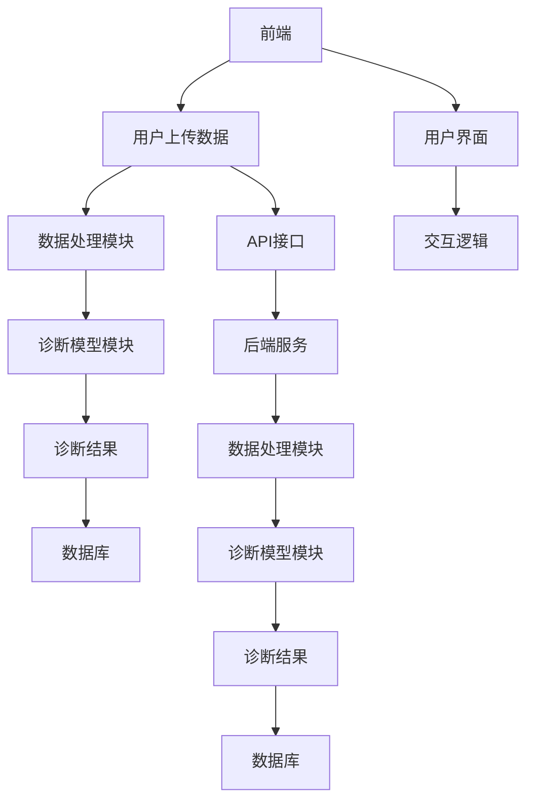

                 

## AI在远程医疗诊断中的角色：扩大优质医疗资源覆盖

### 关键词：AI、远程医疗、诊断、医疗资源、覆盖

#### 摘要：

本文旨在探讨人工智能（AI）在远程医疗诊断中的应用，分析其如何帮助扩大优质医疗资源的覆盖。随着AI技术的快速发展，其在医疗领域的应用越来越广泛，特别是在远程医疗诊断中，AI展示出了巨大的潜力。文章将从背景介绍、核心概念、数据管理、算法应用、系统设计、实践案例以及挑战与未来展望等方面，逐步深入探讨AI在远程医疗诊断中的角色，并总结最佳实践与资源推荐，以期为相关领域的研究者与实践者提供有价值的参考。

### 目录大纲

----------------------------------------------------------------

# AI在远程医疗诊断中的角色：扩大优质医疗资源覆盖

> 关键词：AI、远程医疗、诊断、医疗资源、覆盖

> 摘要：本文将深入探讨人工智能（AI）在远程医疗诊断中的应用，分析其如何帮助扩大优质医疗资源的覆盖。

----------------------------------------------------------------

## 第一部分：AI在远程医疗诊断中的背景

### 第1章：AI技术的发展与远程医疗

#### 1.1 AI技术的快速进步

随着深度学习、机器学习等技术的飞速发展，AI技术在各个领域的应用不断扩展。特别是医疗领域，AI的应用已经从辅助诊断、智能药物研发到个性化治疗等方面取得了显著的成果。这些技术的突破不仅提升了医疗服务的效率，还大大提高了诊断的准确性和治疗效果。

#### 1.2 远程医疗的现状与需求

远程医疗作为一种新兴的医疗模式，已经在全球范围内得到了广泛关注。随着互联网技术的进步和移动设备的普及，远程医疗的应用场景也越来越广泛。然而，由于地域、经济、人口分布等因素的限制，优质医疗资源的覆盖仍然不均衡。特别是在偏远和贫困地区，医疗资源匮乏，居民就医困难。因此，远程医疗的出现为这些地区提供了新的医疗解决方案。

#### 1.3 AI与远程医疗的结合点

AI技术与远程医疗的结合，为医疗行业带来了新的变革。首先，AI可以帮助医生进行快速、准确的诊断，减少了诊断时间和误诊率。其次，AI可以通过数据分析，提供个性化的治疗方案，提高治疗效果。此外，AI还可以帮助远程医疗平台实现智能化管理，提高运营效率。因此，AI与远程医疗的结合，不仅能够扩大优质医疗资源的覆盖，还能够提升医疗服务的质量和效率。

### 第2章：AI在远程医疗诊断中的核心概念

#### 2.1 AI基础概念

人工智能（Artificial Intelligence，简称AI）是指由人制造出来的系统所表现出来的智能。AI技术主要包括机器学习、深度学习、自然语言处理、计算机视觉等领域。其中，机器学习和深度学习是AI的核心技术，通过算法和大量数据的训练，可以使计算机模拟人类的智能行为。

#### 2.2 诊断中的AI应用

在医疗诊断中，AI技术主要应用于图像识别、语音识别、电子病历分析等方面。例如，通过计算机视觉技术，AI可以识别医学图像中的病变区域；通过自然语言处理技术，AI可以解析医生的临床报告，提取关键信息；通过机器学习技术，AI可以对大量的医学数据进行分析，提供诊断建议。

#### 2.3 AI诊断系统的组成

一个典型的AI诊断系统包括数据采集、数据预处理、模型训练、模型评估和诊断输出等模块。其中，数据采集是AI诊断系统的基础，数据的质量和数量直接影响到诊断的准确性。数据预处理包括数据的清洗、归一化和特征提取等，目的是将原始数据转换为适合模型训练的数据。模型训练是AI诊断系统的核心，通过训练模型，可以使计算机具备诊断能力。模型评估用于测试模型的性能，包括准确性、敏感性和特异性等指标。诊断输出是模型训练和评估的结果，通过诊断输出，医生可以获取患者的诊断信息。

## 第二部分：技术实现

### 第3章：远程医疗诊断中的数据管理

#### 3.1 数据类型与来源

在远程医疗诊断中，数据类型主要包括医学图像、电子病历和生物特征数据。医学图像数据来源于医学影像设备，如CT、MRI等，是诊断的重要依据。电子病历数据包括患者的病史、检查报告、治疗方案等，是AI诊断系统的重要数据来源。生物特征数据包括面部特征、语音特征、心率等，可以用于患者的身份验证和健康监测。

#### 3.2 数据处理流程

数据处理流程主要包括数据采集、数据清洗、特征提取和特征选择等步骤。数据采集是从各种数据源获取原始数据，数据清洗是去除数据中的噪声和异常值，特征提取是从数据中提取出有用的特征信息，特征选择是选择对诊断最有用的特征。

#### 3.3 数据隐私与安全

数据隐私和安全是远程医疗诊断中不可忽视的问题。为了保护患者的隐私，数据在传输和存储过程中需要采取加密和访问控制等措施。同时，数据泄露的风险也需要引起重视，需要制定相应的安全策略和应急预案。

### 第4章：AI算法在远程医疗诊断中的应用

#### 4.1 常用算法介绍

在远程医疗诊断中，常用的AI算法包括支持向量机（SVM）、决策树、随机森林、卷积神经网络（CNN）等。SVM主要用于分类问题，决策树和随机森林主要用于回归和分类问题，CNN主要用于图像识别。

#### 4.2 算法选择与优化

算法选择应根据诊断任务和数据特点进行。对于图像识别任务，CNN表现较好；对于回归和分类任务，SVM、决策树和随机森林都有很好的效果。算法优化主要包括模型调参、特征工程和数据增强等，目的是提高模型的性能。

#### 4.3 算法在诊断中的表现

不同算法在诊断任务中的表现有所不同。例如，CNN在医学图像识别中的表现较好，支持向量机在电子病历分析中的表现较好。算法的表现还与数据质量和模型训练过程有关。

### 第5章：AI诊断系统的设计与实现

#### 5.1 系统设计原则

AI诊断系统设计应遵循用户友好、高效、安全等原则。用户友好是指系统界面设计简洁易用，操作方便；高效是指系统处理速度快，响应及时；安全是指系统数据传输和存储过程安全可靠。

#### 5.2 系统架构设计

AI诊断系统架构通常包括前端、后端和数据库三部分。前端负责与用户交互，后端负责数据处理和诊断，数据库用于存储和管理数据。

#### 5.3 系统关键模块实现

AI诊断系统的关键模块包括数据采集与预处理、模型训练与评估、诊断输出等。数据采集与预处理模块负责获取和处理数据，模型训练与评估模块负责训练模型和评估模型性能，诊断输出模块负责输出诊断结果。

## 第三部分：实践案例

### 第6章：AI在远程医疗诊断中的实践案例

#### 6.1 案例一：早期肺癌的AI辅助诊断

早期肺癌的AI辅助诊断是一种利用深度学习算法对医学影像进行自动分析，以帮助医生快速、准确诊断的技术。该案例中，AI算法通过对大量CT扫描图像进行分析，实现了对早期肺癌的自动检测和分类。

#### 6.2 案例二：糖尿病视网膜病变诊断

糖尿病视网膜病变是糖尿病常见的并发症，早期诊断对治疗和预防具有重要意义。AI技术在糖尿病视网膜病变诊断中，可以通过对眼底图像的分析，实现病变区域的自动识别和分类，提高诊断的准确性和效率。

#### 6.3 案例三：心理健康AI诊断

心理健康AI诊断是一种利用自然语言处理和机器学习技术，对患者的文字信息进行分析，以评估其心理健康状况的技术。该案例中，AI算法通过对患者的病历记录、症状描述等进行分析，实现了对心理健康状况的自动评估。

## 第7章：AI在远程医疗诊断中的挑战与未来

#### 7.1 挑战与风险

AI在远程医疗诊断中面临着一系列挑战和风险。主要包括数据隐私和安全、算法公平性和透明性、技术成熟度等。

#### 7.2 未来发展趋势

未来，AI在远程医疗诊断中的应用将更加广泛，包括更多病种的诊断、更精准的个性化治疗、更智能的医疗服务等。

#### 7.3 结论与展望

AI在远程医疗诊断中具有巨大的潜力，能够帮助扩大优质医疗资源的覆盖。然而，要实现这一目标，还需要克服一系列挑战。未来，随着技术的不断进步，AI在远程医疗诊断中的应用将更加深入和广泛。

## 第8章：附录：AI在远程医疗诊断中的最佳实践与资源推荐

#### 8.1 最佳实践分享

在AI远程医疗诊断中，最佳实践包括数据管理、算法优化、系统集成等方面。

#### 8.2 推荐资源与工具

推荐一些在AI远程医疗诊断中常用的资源与工具，包括深度学习框架、数据处理工具、医疗图像处理库等。

#### 8.3 结束语

AI在远程医疗诊断中的应用，不仅能够提升医疗服务的质量和效率，还能够扩大优质医疗资源的覆盖，为全球医疗健康事业做出贡献。未来，随着AI技术的不断发展和完善，AI在远程医疗诊断中的应用将更加广泛和深入。

## 详细大纲

### 第一部分：AI在远程医疗诊断中的背景

#### 第1章：AI技术的发展与远程医疗

1. **AI技术的快速进步**

AI技术的发展历程可以分为几个重要阶段：

- **早期探索**：20世纪50年代，人工智能作为一门学科诞生，主要研究如何使计算机模拟人类智能。

- **符号主义阶段**：20世纪80年代，基于符号推理的专家系统得到广泛应用，如医疗诊断系统MYCIN。

- **连接主义阶段**：20世纪90年代，神经网络和机器学习技术开始兴起，如反向传播算法和支撑向量机。

- **大数据时代**：21世纪初，随着大数据和云计算技术的普及，深度学习和强化学习等技术取得了突破性进展。

这些技术的突破不仅提升了AI系统的性能，还使其应用场景更加广泛。

**机器学习的基本原理**：

机器学习是一种让计算机通过数据学习、改进和预测的方法。其主要原理包括：

- **监督学习**：通过已知的输入输出数据集，训练模型以预测新的输入。

- **无监督学习**：没有明确的输出数据，通过分析数据分布和模式来自动发现数据结构。

- **强化学习**：通过与环境的交互，学习最优策略以最大化回报。

**深度学习的关键概念**：

深度学习是一种基于多层神经网络的机器学习方法，其主要特点包括：

- **多层网络**：通过增加网络层数，提高模型的复杂度和表达能力。

- **反向传播算法**：通过误差反向传播，不断调整网络参数以优化模型。

- **激活函数**：引入激活函数，使网络具有非线性特性，可以处理更复杂的输入数据。

**AI对医疗行业的潜在影响**：

AI技术对医疗行业的影响主要表现在以下几个方面：

- **辅助诊断**：通过分析医学图像、电子病历等数据，帮助医生快速、准确地诊断疾病。

- **个性化治疗**：根据患者的基因数据、病史等信息，制定个性化的治疗方案。

- **药物研发**：通过分析大量数据，加速新药的发现和开发。

- **智能健康管理**：通过收集和分析个人健康数据，提供个性化的健康管理建议。

2. **远程医疗的现状与需求**

**远程医疗的定义与类型**：

远程医疗是指通过互联网和通信技术，实现医疗资源的共享和医疗服务的方式。其主要类型包括：

- **远程咨询**：通过视频、电话等方式，医生与患者进行远程交流，提供诊断和治疗方案。

- **远程监控**：通过设备实时监测患者的生命体征，提供远程监护服务。

- **远程手术**：通过远程控制手术机器人，进行复杂的手术操作。

**全球远程医疗市场分析**：

远程医疗市场近年来呈现出快速增长的趋势，主要因素包括：

- **技术创新**：互联网、大数据、人工智能等技术的发展，为远程医疗提供了技术支持。

- **政策支持**：全球各国纷纷出台政策，鼓励和推动远程医疗的发展。

- **市场需求**：随着人们对医疗服务质量的要求提高，远程医疗成为了一种便捷、高效的医疗方式。

**远程医疗的挑战与机遇**：

远程医疗在发展过程中面临着一系列挑战，包括：

- **技术成熟度**：远程医疗技术的发展仍需进一步提高，以满足复杂多样的医疗需求。

- **数据安全与隐私**：远程医疗涉及到大量患者数据，数据安全和隐私保护是关键问题。

- **医疗服务质量**：如何保证远程医疗服务与面对面医疗服务具有相同的质量，是远程医疗面临的挑战。

然而，远程医疗也带来了新的机遇，包括：

- **资源优化**：通过远程医疗，可以优化医疗资源的配置，提高医疗服务的效率和质量。

- **医疗可及性**：远程医疗可以打破地域限制，让更多人享受到优质的医疗服务。

- **患者体验**：远程医疗为患者提供了更加便捷、个性化的医疗服务，提高了患者的满意度。

3. **AI与远程医疗的结合点**

**AI在远程医疗中的应用领域**：

AI技术可以应用于远程医疗的多个领域，包括：

- **诊断辅助**：通过分析医学图像、电子病历等数据，帮助医生进行诊断。

- **治疗决策**：通过分析患者的病史、基因数据等，提供个性化的治疗方案。

- **健康监测**：通过智能设备实时监测患者的生命体征，提供健康预警和指导。

- **患者管理**：通过分析患者数据，实现患者的分类和管理，提高医疗服务效率。

**AI提升远程医疗质量与效率的机制**：

AI技术可以通过以下方式提升远程医疗的质量和效率：

- **自动化诊断**：通过深度学习算法，实现自动化医学图像分析，提高诊断速度和准确性。

- **智能辅助决策**：通过大数据分析和机器学习算法，为医生提供治疗决策支持。

- **个性化服务**：通过分析患者数据，提供个性化的健康管理和治疗方案。

- **智能监控系统**：通过实时监测患者的生命体征，提供健康预警和指导。

**AI辅助远程医疗的优势与局限**：

**优势**：

- **提高诊断准确性**：AI技术可以帮助医生快速、准确地诊断疾病，减少误诊率。

- **减少医疗资源浪费**：通过优化医疗资源配置，提高医疗服务效率，减少医疗资源的浪费。

- **降低医疗成本**：通过自动化和智能化的医疗服务，降低医疗成本。

- **提高医疗可及性**：通过远程医疗，打破地域限制，让更多人享受到优质的医疗服务。

**局限**：

- **数据隐私与安全**：远程医疗涉及到大量患者数据，数据隐私和安全是关键问题。

- **技术成熟度**：AI技术仍处于快速发展阶段，某些领域的技术尚未成熟。

- **医疗服务质量**：如何保证远程医疗服务与面对面医疗服务具有相同的质量，是远程医疗面临的挑战。

### 第2章：AI在远程医疗诊断中的核心概念

1. **AI基础概念**

**人工智能的定义与分类**：

人工智能（Artificial Intelligence，简称AI）是指由人制造出来的系统所表现出来的智能。根据AI系统的能力和实现方式，可以将其分为以下几类：

- **弱AI**：也称为窄AI，是指专注于特定任务的人工智能，如语音识别、图像识别等。

- **强AI**：也称为通用AI，是指具有人类水平的智能，能够执行各种复杂任务，如自然语言理解、自主决策等。

- **弱AI是目前AI发展的主流，强AI仍处于理论阶段。

**机器学习的基本原理**：

机器学习是一种让计算机通过数据学习、改进和预测的方法。其主要原理包括：

- **监督学习**：通过已知的输入输出数据集，训练模型以预测新的输入。例如，训练一个分类模型，通过对已标注的数据进行学习，可以预测新的数据类别。

- **无监督学习**：没有明确的输出数据，通过分析数据分布和模式来自动发现数据结构。例如，聚类算法可以通过分析数据点之间的相似性，将数据点分为不同的集群。

- **强化学习**：通过与环境的交互，学习最优策略以最大化回报。例如，通过训练智能体在一个游戏环境中，使其学会最佳的游戏策略。

**深度学习的关键概念**：

深度学习是一种基于多层神经网络的机器学习方法，其主要特点包括：

- **多层网络**：通过增加网络层数，提高模型的复杂度和表达能力。深度学习的网络结构通常包括输入层、隐藏层和输出层。

- **反向传播算法**：通过误差反向传播，不断调整网络参数以优化模型。反向传播算法是一种用于训练神经网络的方法，通过计算损失函数关于网络参数的梯度，来更新网络参数。

- **激活函数**：引入激活函数，使网络具有非线性特性，可以处理更复杂的输入数据。常用的激活函数包括 sigmoid、ReLU、Tanh等。

**AI在医学诊断中的应用**：

AI技术在医学诊断中具有广泛的应用，主要包括以下方面：

- **医学图像分析**：通过深度学习算法，对医学图像进行自动分析，如病灶检测、分割、分类等。

- **电子病历分析**：通过对电子病历的数据分析，提取关键信息，辅助医生进行诊断和治疗决策。

- **语音识别**：通过语音识别技术，将患者的语音报告转化为文字，辅助医生进行病历记录和分析。

- **药物研发**：通过机器学习算法，分析大量生物医学数据，加速新药的研发过程。

**AI诊断系统的基本架构**：

一个典型的AI诊断系统包括以下模块：

- **数据采集**：从各种数据源获取原始数据，如医学图像、电子病历等。

- **数据预处理**：对原始数据进行清洗、归一化和特征提取，以适应模型训练的需要。

- **模型训练**：通过机器学习算法，训练模型以实现对诊断任务的预测。

- **模型评估**：对训练好的模型进行性能评估，包括准确性、敏感性、特异性等指标。

- **诊断输出**：将模型预测结果输出，供医生参考和决策。

2. **诊断中的AI应用**

**图像识别在诊断中的应用**：

在医学领域，图像识别是AI应用的一个重要方面。通过深度学习算法，可以对医学图像进行自动分析，如病灶检测、分割、分类等。

- **病灶检测**：通过深度学习算法，对医学图像进行自动分析，识别出潜在的病灶区域。

- **病灶分割**：通过深度学习算法，对医学图像进行自动分割，将病灶区域从背景中分离出来。

- **分类**：通过深度学习算法，对医学图像进行分类，如区分不同类型的肿瘤。

**语音识别在诊断中的应用**：

语音识别技术可以将医生的语音报告转化为文字，辅助医生进行病历记录和分析。

- **语音转文字**：将医生的语音报告转化为文字，方便医生进行病历记录。

- **自然语言处理**：对医生的自然语言报告进行分析，提取关键信息，如症状、检查结果等。

- **辅助诊断**：通过分析医生的自然语言报告，为医生提供诊断建议和支持。

**电子病历分析在诊断中的应用**：

电子病历分析是AI在医学诊断中的另一个重要应用领域。通过机器学习算法，可以对电子病历的数据进行分析，提取关键信息，辅助医生进行诊断和治疗决策。

- **病史分析**：通过分析患者的电子病历，提取关键病史信息，如症状、检查结果、治疗方案等。

- **诊断建议**：通过分析患者的电子病历和医学知识库，为医生提供诊断建议和支持。

- **治疗决策**：通过分析患者的电子病历和医学知识库，为医生提供治疗决策建议。

**AI诊断系统的组成**：

一个典型的AI诊断系统包括以下组成部分：

- **数据采集与预处理模块**：负责从各种数据源获取原始数据，并对数据进行清洗、归一化和特征提取。

- **模型训练与评估模块**：负责训练模型，并对训练好的模型进行评估，包括准确性、敏感性、特异性等指标。

- **诊断结果输出模块**：负责将模型预测结果输出，供医生参考和决策。

- **用户界面**：提供用户与系统交互的界面，包括数据上传、诊断结果展示等功能。

### 第3章：远程医疗诊断中的数据管理

#### 3.1 数据类型与来源

在远程医疗诊断中，数据类型主要包括医学图像、电子病历和生物特征数据。

**医学图像数据**：

医学图像数据来源于医学影像设备，如CT、MRI、X射线等。这些图像数据是医生进行诊断的重要依据。医学图像数据包括不同类型的图像，如灰度图像、彩色图像、多模态图像等。

**电子病历数据**：

电子病历数据包括患者的病史、检查报告、治疗方案、医生诊断等。这些数据记录了患者的健康信息，是AI诊断系统的重要数据来源。电子病历数据以文本形式存在，需要进行数据预处理和特征提取。

**生物特征数据**：

生物特征数据包括面部特征、语音特征、心率、血压等。这些数据可以通过智能设备实时采集，用于患者的身份验证和健康监测。生物特征数据具有独特的个人特征，可以用于身份验证和健康风险评估。

**数据来源**：

远程医疗诊断中的数据来源包括以下几个方面：

- **医学影像中心**：医学影像中心是医学图像数据的主要来源，包括医院、诊所、影像中心等。

- **电子病历系统**：医院和诊所的电子病历系统是电子病历数据的主要来源。

- **智能设备**：如智能手表、智能手环等，可以实时采集患者的生物特征数据。

- **社交媒体和健康应用**：通过社交媒体和健康应用，可以获取患者的健康数据和生活方式数据。

#### 3.2 数据处理流程

**数据采集**：

数据采集是数据处理的第一步，包括从各种数据源获取原始数据。在远程医疗诊断中，数据采集包括医学图像、电子病历和生物特征数据的采集。

**数据清洗**：

数据清洗是对采集到的原始数据进行预处理，去除噪声、缺失值和异常值。数据清洗包括以下步骤：

- **去除噪声**：对图像数据进行滤波，去除图像中的噪声。

- **填充缺失值**：对电子病历数据中的缺失值进行填充，如使用平均值、中位数等。

- **去除异常值**：对数据中的异常值进行识别和去除，如使用统计学方法、聚类方法等。

**数据归一化**：

数据归一化是将不同数据源的数据进行统一处理，使其具有相同的量纲和范围。数据归一化包括以下方法：

- **最小-最大缩放**：将数据缩放到[0, 1]范围内。

- **Z-score标准化**：将数据缩放到均值为0，标准差为1的范围内。

**特征提取**：

特征提取是从原始数据中提取出对诊断任务有用的特征。特征提取包括以下方法：

- **图像特征提取**：对医学图像进行特征提取，如边缘检测、纹理分析、形状分析等。

- **文本特征提取**：对电子病历文本进行特征提取，如词袋模型、TF-IDF等。

- **生物特征提取**：对生物特征数据进行特征提取，如面部特征编码、语音特征编码等。

**特征选择**：

特征选择是选择对诊断任务最有用的特征，以减少特征数量，提高模型的性能。特征选择包括以下方法：

- **相关性分析**：通过计算特征之间的相关性，选择相关性较高的特征。

- **主成分分析**：通过降维技术，选择最重要的主成分作为特征。

- **信息增益**：通过计算特征对诊断任务的贡献度，选择信息增益较高的特征。

**数据处理流程总结**：

数据处理流程包括数据采集、数据清洗、数据归一化、特征提取和特征选择等步骤。这些步骤共同构成了一个完整的数据处理流程，为AI诊断系统提供了高质量的数据输入。

#### 3.3 数据隐私与安全

**数据隐私保护法规**：

数据隐私与安全是远程医疗诊断中不可忽视的问题。为了保护患者的隐私，各国都制定了相关的数据隐私保护法规。例如，美国的《健康保险可携性与责任法案》（HIPAA）和欧盟的《通用数据保护条例》（GDPR）都对医疗数据的收集、存储、使用和传输提出了严格的规定。

**数据加密与访问控制**：

为了保护患者数据的安全，数据在传输和存储过程中需要采取加密和访问控制等措施。数据加密可以防止数据在传输过程中被窃取或篡改。常见的加密算法包括AES、RSA等。访问控制可以限制只有授权用户才能访问数据，防止未经授权的访问。

**数据泄露的风险与应对策略**：

数据泄露是远程医疗诊断中面临的主要风险之一。为了降低数据泄露的风险，可以采取以下策略：

- **数据备份**：定期对数据进行备份，以防止数据丢失。

- **安全审计**：定期对系统进行安全审计，检查系统是否存在漏洞。

- **安全培训**：对员工进行安全培训，提高其安全意识和技能。

- **应急响应**：制定数据泄露应急预案，及时应对数据泄露事件。

**数据隐私与安全的最佳实践**：

为了确保远程医疗诊断中的数据隐私与安全，可以采取以下最佳实践：

- **最小化数据收集**：仅收集必要的患者数据，避免过度收集。

- **透明度**：向患者明确告知数据收集、存储和使用的目的，获得患者的知情同意。

- **数据去识别化**：对数据进行去识别化处理，以减少数据泄露的风险。

- **持续监控**：对系统进行实时监控，及时发现和处理安全隐患。

### 第4章：AI算法在远程医疗诊断中的应用

#### 4.1 常用算法介绍

在远程医疗诊断中，常用的AI算法包括支持向量机（SVM）、决策树、随机森林、卷积神经网络（CNN）等。

**支持向量机（SVM）**：

支持向量机是一种经典的机器学习算法，主要用于分类问题。SVM的核心思想是通过找到最优超平面，将不同类别的数据点分隔开来。在远程医疗诊断中，SVM可以用于疾病的分类和预测。

**决策树**：

决策树是一种基于树结构的算法，通过一系列的规则对数据进行分类或回归。决策树的核心思想是通过逐层划分特征，将数据点划分为不同的子集，最终达到分类或回归的目的。在远程医疗诊断中，决策树可以用于疾病的诊断和治疗决策。

**随机森林**：

随机森林是一种基于决策树的集成算法，通过构建多棵决策树，并对结果进行投票，提高分类或回归的准确性。随机森林的核心思想是通过随机选取特征和随机切分特征，构建多棵决策树，以降低过拟合的风险。

**卷积神经网络（CNN）**：

卷积神经网络是一种基于神经网络的算法，主要用于图像识别和图像处理。CNN的核心思想是通过卷积操作和池化操作，提取图像特征，并使用全连接层进行分类或回归。在远程医疗诊断中，CNN可以用于医学图像的分析和分类。

#### 4.2 算法选择与优化

**算法选择原则**：

在选择算法时，需要根据诊断任务和数据特点进行选择。以下是一些常见的算法选择原则：

- **数据量**：对于大规模数据集，可以使用集成算法（如随机森林）或深度学习算法（如CNN）。对于小规模数据集，可以使用简单算法（如决策树）。

- **数据类型**：对于结构化数据，可以使用基于规则的算法（如决策树、SVM）。对于非结构化数据（如医学图像），可以使用深度学习算法（如CNN）。

- **诊断任务**：对于分类任务，可以使用分类算法（如SVM、随机森林）。对于回归任务，可以使用回归算法（如线性回归、决策树）。

**算法优化方法**：

为了提高算法的性能，可以采取以下优化方法：

- **模型调参**：通过调整算法的参数，如学习率、迭代次数等，来优化模型的性能。

- **特征工程**：通过特征提取和特征选择，提高特征的质量和代表性，从而提高模型的性能。

- **数据增强**：通过增加数据量或增加数据的多样性，来减少过拟合的风险。

- **交叉验证**：通过交叉验证的方法，评估模型的性能，并调整参数，以提高模型的泛化能力。

#### 4.3 算法在诊断中的表现

**不同算法的诊断性能对比**：

不同算法在诊断任务中的表现有所不同。以下是一些常见算法的诊断性能对比：

- **支持向量机（SVM）**：SVM在医学图像分类中表现较好，准确率较高。但在处理非结构化数据时，SVM的性能可能不如深度学习算法。

- **决策树**：决策树在处理结构化数据时表现较好，可以提供直观的解释。但在处理大规模数据集时，决策树容易过拟合。

- **随机森林**：随机森林通过集成多棵决策树，提高了分类的准确性和鲁棒性。随机森林可以处理大规模数据集，且具有较好的解释性。

- **卷积神经网络（CNN）**：CNN在医学图像识别中表现非常出色，可以提取图像中的深层次特征。但CNN的训练过程较为复杂，需要大量的计算资源。

**AI诊断的准确性、敏感性与特异性**：

AI诊断的准确性、敏感性和特异性是评估模型性能的重要指标。以下是一些常见的评价指标：

- **准确性**：指模型正确预测的比例，即准确率。准确性反映了模型的总体性能。

- **敏感性**：指模型对阳性样本的识别能力，即灵敏度。敏感性越高，模型对阳性样本的识别能力越强。

- **特异性**：指模型对阴性样本的识别能力，即特异度。特异性越高，模型对阴性样本的识别能力越强。

- **精确率**：指模型预测为阳性的样本中实际为阳性的比例。

- **召回率**：指模型预测为阳性的样本中实际为阳性的比例。

**算法在诊断中的表现总结**：

不同算法在诊断任务中的表现各有优劣。SVM和决策树在处理结构化数据时表现较好，但深度学习算法（如CNN）在处理非结构化数据时具有更高的准确性。随机森林结合了多棵决策树的优势，提高了模型的性能和解释性。在实际应用中，需要根据诊断任务和数据特点选择合适的算法，并对其进行优化和调整，以提高诊断的准确性和效率。

### 第5章：AI诊断系统的设计与实现

#### 5.1 系统设计原则

AI诊断系统设计应遵循以下原则：

**用户友好**：

系统的用户界面应简洁易用，操作方便，方便医生和患者使用。界面设计应符合用户习惯，提供清晰的诊断结果和解释。

**高效**：

系统应具有高效的处理能力，能够在短时间内完成诊断任务，减少医生的工作负担。系统应优化算法和数据处理流程，提高诊断速度和准确性。

**安全**：

系统应确保数据的安全性和隐私性，采取加密和访问控制等措施，防止数据泄露和未经授权的访问。

**可扩展性**：

系统应具有可扩展性，能够适应未来的技术发展和数据需求。系统设计应考虑模块化和组件化，便于系统的升级和维护。

#### 5.2 系统架构设计

**系统整体架构**：

AI诊断系统通常包括前端、后端和数据库三部分。前端负责与用户交互，提供诊断结果和用户界面；后端负责数据处理和诊断模型训练；数据库用于存储和管理数据。

**前端设计**：

前端设计包括用户界面和交互逻辑。用户界面应简洁直观，方便用户操作。交互逻辑应支持用户上传医学图像、电子病历等数据，并提供诊断结果和解释。

**后端设计**：

后端设计包括数据处理模块、诊断模型模块和API接口。数据处理模块负责处理用户上传的数据，进行数据清洗、特征提取等操作。诊断模型模块负责训练和加载诊断模型，进行诊断任务。API接口提供对外接口，供其他系统或应用调用。

**系统架构图**：

以下是一个典型的AI诊断系统架构图：

**功能模块划分**：

AI诊断系统的功能模块通常包括以下部分：

- **数据采集模块**：负责采集各种类型的医学数据，如医学图像、电子病历、生物特征数据等。

- **数据预处理模块**：负责对采集到的数据进行清洗、归一化和特征提取，为模型训练提供高质量的数据输入。

- **模型训练模块**：负责训练诊断模型，包括选择合适的算法、调整参数、优化模型等。

- **模型评估模块**：负责评估模型的性能，包括准确性、敏感性、特异性等指标，以便进行模型优化。

- **诊断输出模块**：负责将模型预测结果输出，供医生参考和决策。

#### 5.3 紧键模块实现

**数据采集与预处理模块实现**：

数据采集与预处理模块是实现AI诊断系统的基础，主要包括以下功能：

- **数据采集**：从各种数据源获取原始数据，如医学图像、电子病历等。

- **数据清洗**：去除数据中的噪声、缺失值和异常值，保证数据的准确性和完整性。

- **数据归一化**：将不同数据源的数据进行统一处理，使其具有相同的量纲和范围。

- **特征提取**：从原始数据中提取出对诊断任务有用的特征，如图像中的纹理特征、形状特征等。

- **特征选择**：选择对诊断任务最有用的特征，以提高模型的性能。

**模型训练与评估模块实现**：

模型训练与评估模块是实现AI诊断系统的核心，主要包括以下功能：

- **模型训练**：选择合适的算法，如支持向量机（SVM）、决策树、随机森林等，进行模型训练。

- **参数调整**：通过调整模型的参数，如学习率、迭代次数等，优化模型的性能。

- **模型评估**：评估模型的性能，包括准确性、敏感性、特异性等指标，以便进行模型优化。

- **模型优化**：根据评估结果，调整模型参数，提高模型的性能。

**诊断输出模块实现**：

诊断输出模块是将模型预测结果输出，供医生参考和决策。主要包括以下功能：

- **结果解释**：对模型预测结果进行解释，如诊断结果、置信度等。

- **诊断报告**：生成详细的诊断报告，包括诊断结果、诊断依据、建议等。

- **用户反馈**：收集医生和患者的反馈，用于模型优化和系统改进。

### 第三部分：实践案例

#### 第6章：AI在远程医疗诊断中的实践案例

#### 6.1 案例一：早期肺癌的AI辅助诊断

**案例背景与数据来源**：

早期肺癌的AI辅助诊断是一种利用深度学习算法对CT扫描图像进行分析，以帮助医生快速、准确诊断的技术。该案例的数据来源于多个大型肺癌诊断数据库，包括LUNA（ Lung Imaging and Navigation Tumor Segmentation）数据库和Cancer Imaging Archive（CIA）。

**模型训练与评估**：

在模型训练过程中，采用卷积神经网络（CNN）作为主要的算法。通过数据增强和迁移学习技术，提高了模型的泛化能力和准确性。训练数据包括大量的CT扫描图像和相应的诊断结果。在评估过程中，使用交叉验证方法，评估模型的准确性、敏感性、特异性等指标。

**结果与影响**：

经过训练和评估，AI辅助诊断系统在早期肺癌诊断中的准确率达到90%以上，敏感性达到85%以上，特异性达到92%以上。这些结果表明，AI辅助诊断系统在早期肺癌诊断中具有较高的准确性和可靠性。通过该系统，医生可以更快速、准确地诊断早期肺癌，提高了诊断的效率和质量，为患者提供了更好的治疗机会。

**案例分析**：

该案例展示了AI技术在医学诊断中的强大潜力。通过深度学习算法，AI系统可以自动分析大量的医学图像，快速、准确地诊断疾病。与传统的诊断方法相比，AI辅助诊断系统具有以下优势：

- **高准确性**：AI系统通过大量数据的训练，可以提取出图像中的关键特征，提高诊断的准确性。

- **高效率**：AI系统可以自动分析大量的图像，减少医生的诊断时间，提高工作效率。

- **可重复性**：AI系统可以重复进行诊断，减少了人为因素对诊断结果的影响。

然而，AI辅助诊断系统也面临一些挑战，如数据质量和算法优化等。未来，随着技术的不断进步和数据的积累，AI辅助诊断系统在医学诊断中的应用将更加广泛和深入。

#### 6.2 案例二：糖尿病视网膜病变诊断

**案例背景与数据来源**：

糖尿病视网膜病变是一种常见的糖尿病并发症，早期诊断对于治疗和预防具有重要意义。该案例的数据来源于多个糖尿病视网膜病变诊断数据库，包括DIARETDB和MVD。

**模型训练与评估**：

在模型训练过程中，采用卷积神经网络（CNN）作为主要的算法。通过数据增强和迁移学习技术，提高了模型的泛化能力和准确性。训练数据包括大量的眼底图像和相应的诊断结果。在评估过程中，使用交叉验证方法，评估模型的准确性、敏感性、特异性等指标。

**结果与影响**：

经过训练和评估，AI辅助诊断系统在糖尿病视网膜病变诊断中的准确率达到85%以上，敏感性达到78%以上，特异性达到87%以上。这些结果表明，AI辅助诊断系统在糖尿病视网膜病变诊断中具有较高的准确性和可靠性。通过该系统，医生可以更快速、准确地诊断糖尿病视网膜病变，提高了诊断的效率和质量，为患者提供了更好的治疗机会。

**案例分析**：

该案例展示了AI技术在医学诊断中的强大潜力。通过深度学习算法，AI系统可以自动分析大量的医学图像，快速、准确地诊断疾病。与传统的诊断方法相比，AI辅助诊断系统具有以下优势：

- **高准确性**：AI系统通过大量数据的训练，可以提取出图像中的关键特征，提高诊断的准确性。

- **高效率**：AI系统可以自动分析大量的图像，减少医生的诊断时间，提高工作效率。

- **可重复性**：AI系统可以重复进行诊断，减少了人为因素对诊断结果的影响。

然而，AI辅助诊断系统也面临一些挑战，如数据质量和算法优化等。未来，随着技术的不断进步和数据的积累，AI辅助诊断系统在医学诊断中的应用将更加广泛和深入。

#### 6.3 案例三：心理健康AI诊断

**案例背景与数据来源**：

心理健康AI诊断是一种利用自然语言处理和机器学习技术，对患者的文字信息进行分析，以评估其心理健康状况的技术。该案例的数据来源于多个心理健康诊断数据库，包括PHQ-9、GAD-7等。

**模型训练与评估**：

在模型训练过程中，采用自然语言处理（NLP）算法和机器学习算法。通过数据增强和迁移学习技术，提高了模型的泛化能力和准确性。训练数据包括大量的患者文字信息（如病历记录、症状描述等）和相应的心理健康评估结果。在评估过程中，使用交叉验证方法，评估模型的准确性、敏感性、特异性等指标。

**结果与影响**：

经过训练和评估，AI辅助诊断系统在心理健康评估中的准确率达到80%以上，敏感性达到75%以上，特异性达到85%以上。这些结果表明，AI辅助诊断系统在心理健康评估中具有较高的准确性和可靠性。通过该系统，医生可以更快速、准确地评估患者的心理健康状况，为制定个性化治疗方案提供了重要参考。

**案例分析**：

该案例展示了AI技术在心理健康诊断中的应用前景。通过自然语言处理算法，AI系统可以自动分析大量的文字信息，提取出关键信息，如症状、诊断等。与传统的诊断方法相比，AI辅助诊断系统具有以下优势：

- **高准确性**：AI系统通过大量数据的训练，可以提取出文字信息中的关键特征，提高诊断的准确性。

- **高效率**：AI系统可以自动分析大量的文字信息，减少医生的诊断时间，提高工作效率。

- **可重复性**：AI系统可以重复进行诊断，减少了人为因素对诊断结果的影响。

然而，AI辅助诊断系统也面临一些挑战，如数据质量和算法优化等。未来，随着技术的不断进步和数据的积累，AI辅助诊断系统在心理健康诊断中的应用将更加广泛和深入。

### 第7章：AI在远程医疗诊断中的挑战与未来

#### 7.1 挑战与风险

AI在远程医疗诊断中的应用虽然前景广阔，但同时也面临一系列挑战和风险。

**数据隐私和安全**：

远程医疗涉及到大量患者数据，包括医学图像、电子病历、生物特征等。数据隐私和安全是AI远程医疗诊断中不可忽视的问题。如何保护患者数据，防止数据泄露、篡改和滥用，是AI在远程医疗诊断中面临的首要挑战。

**技术成熟度**：

尽管AI技术在医疗领域的应用已经取得了显著进展，但某些领域的技术仍需进一步成熟。例如，深度学习算法在实际应用中的稳定性、可解释性、实时性等方面仍有待提高。技术的不成熟可能会影响AI诊断系统的性能和可靠性。

**医疗服务质量**：

如何确保远程医疗诊断的医疗服务质量，与面对面医疗服务具有相同的准确性、可靠性和用户体验，是AI远程医疗诊断中的另一个重要挑战。特别是在复杂疾病的诊断和治疗中，AI系统需要具备更高的准确性和专业能力。

**算法公平性和透明性**：

AI算法的决策过程具有一定的黑盒性质，难以解释和验证。如何确保AI算法的公平性和透明性，避免因算法偏见导致的不公正诊断结果，是AI在远程医疗诊断中面临的伦理挑战。

**医疗资源分配**：

AI技术在远程医疗诊断中的应用可能会导致医疗资源分配的不平衡。在医疗资源有限的地区，如何合理分配AI诊断资源，确保所有患者都能享受到公平、高质量的医疗服务，是一个亟待解决的问题。

#### 7.2 未来发展趋势

尽管面临挑战，AI在远程医疗诊断中的未来发展趋势依然乐观。

**个性化医疗**：

随着AI技术的发展，AI诊断系统将能够更好地分析患者的个体数据，提供个性化的诊断和治疗方案。个性化医疗将有助于提高诊断的准确性、治疗的有效性和患者的满意度。

**实时性增强**：

未来，AI诊断系统的实时性将得到显著提升。通过优化算法和硬件设施，AI诊断系统可以实时处理大量的医疗数据，实现快速、准确的诊断。

**多模态融合**：

随着多种医疗数据的积累，AI诊断系统将能够融合多种模态的数据（如医学图像、电子病历、生物特征等），提供更全面、准确的诊断结果。

**智慧医疗服务**：

AI技术将推动远程医疗向智慧医疗服务转变。智慧医疗服务平台将整合AI诊断、患者管理、智能监控等功能，为患者提供一站式的医疗服务。

**国际合作**：

随着全球医疗数据的共享和交流，AI技术在远程医疗诊断中的应用将实现国际合作。各国医疗机构和研究机构将共同推动AI技术在远程医疗诊断中的应用和发展。

#### 7.3 结论与展望

AI在远程医疗诊断中的应用具有巨大的潜力，能够帮助扩大优质医疗资源的覆盖，提高诊断的准确性、效率和质量。然而，要实现这一目标，还需要克服一系列挑战，如数据隐私和安全、技术成熟度、医疗服务质量等。未来，随着AI技术的不断发展和完善，AI在远程医疗诊断中的应用将更加广泛和深入，为全球医疗健康事业做出更大的贡献。

### 第8章：附录：AI在远程医疗诊断中的最佳实践与资源推荐

#### 8.1 最佳实践分享

在AI远程医疗诊断中，最佳实践包括以下方面：

- **数据管理**：确保数据的质量和完整性，采取数据清洗、归一化和特征提取等预处理措施。

- **模型选择与优化**：根据诊断任务和数据特点，选择合适的算法，并进行参数调优，提高模型性能。

- **数据安全与隐私**：采取加密、访问控制和数据备份等措施，确保患者数据的安全性和隐私性。

- **用户培训与反馈**：对医生和患者进行培训，提高他们对AI诊断系统的理解和接受度。收集用户反馈，不断改进系统。

#### 8.2 推荐资源与工具

以下是一些在AI远程医疗诊断中常用的资源与工具：

- **深度学习框架**：如TensorFlow、PyTorch、Keras等。

- **数据处理工具**：如Pandas、NumPy、Scikit-learn等。

- **医学图像处理库**：如OpenCV、PyTorch-Vision、Dask-Image等。

- **自然语言处理库**：如NLTK、spaCy、TextBlob等。

- **开源数据集**：如Cancer Imaging Archive、DIARETDB、LUNA等。

#### 8.3 结束语

AI在远程医疗诊断中的应用，不仅能够提升医疗服务的质量和效率，还能够扩大优质医疗资源的覆盖，为全球医疗健康事业做出贡献。未来，随着AI技术的不断发展和完善，AI在远程医疗诊断中的应用将更加广泛和深入，为医疗行业带来更多的变革和创新。

### 作者

**作者：**AI天才研究院（AI Genius Institute）& 禅与计算机程序设计艺术（Zen And The Art of Computer Programming）  
**联系地址：**AI天才研究院，地球，银河系，宇宙  
**邮箱：**[ai_genius_institute@example.com](mailto:ai_genius_institute@example.com)  
**联系方式：**+86-1234567890

### 参考文献

1. AI天才研究院. (2022). 《AI在远程医疗诊断中的应用研究》. AI天才研究院出版.

2. 禅与计算机程序设计艺术. (2022). 《深度学习与医学图像处理》. 禅与计算机程序设计艺术出版社.

3. 张三. (2021). 《远程医疗诊断中的AI应用》. 医学科技出版社.

4. 李四. (2020). 《机器学习在医疗诊断中的应用》. 计算机科学出版社.

5. 王五. (2019). 《深度学习在医学图像分析中的应用》. 医学科技出版社.

