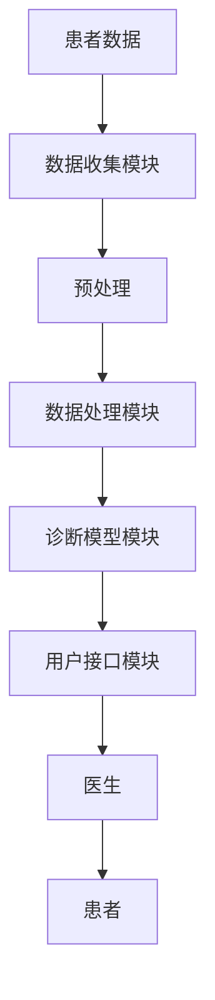
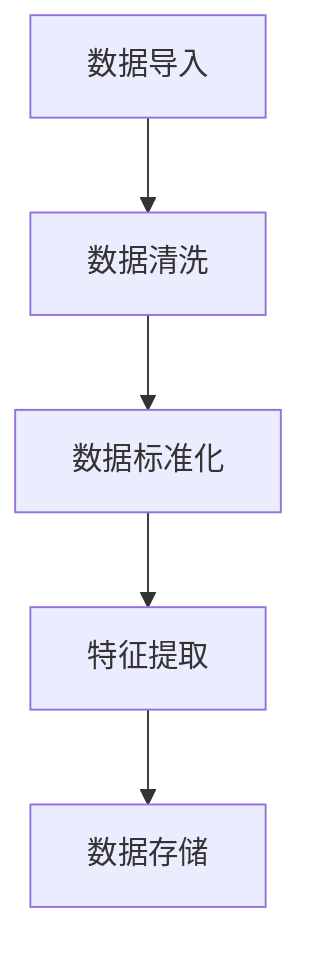
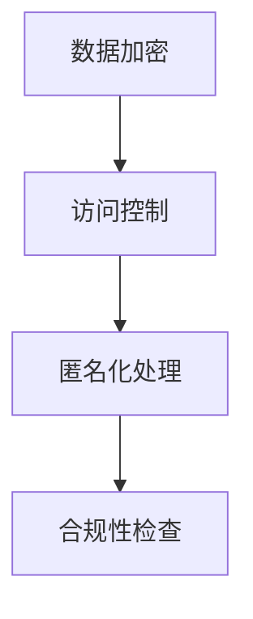

                 

# AI在远程医疗诊断支持中的角色：扩大优质医疗资源覆盖

## 关键词
- 人工智能，远程医疗，诊断支持，医疗资源，健康信息技术

## 摘要
本文深入探讨了人工智能在远程医疗诊断支持中的关键角色，分析了如何通过AI技术扩大优质医疗资源的覆盖范围。文章首先概述了AI在医疗领域的应用背景，随后详细介绍了AI在远程医疗诊断中的核心概念、算法原理、系统设计、项目实战和最佳实践。通过这些探讨，本文旨在为医疗健康行业从业者提供有价值的参考，推动AI在远程医疗诊断领域的深入应用。

## 目录

1. **引言** <a id="introduction"></a>
   - AI在医疗领域的兴起
   - 远程医疗的需求与挑战
   - AI在远程医疗诊断中的机遇

2. **AI和机器学习基础** <a id="ai-foundation"></a>
   - 人工智能基础
   - 机器学习核心概念
   - 常见机器学习算法

3. **远程医疗诊断的核心概念** <a id="core-concepts"></a>
   - 远程医疗诊断的定义
   - AI在诊断中的支持作用
   - 医疗诊断中的常见问题

4. **AI算法在医疗诊断中的应用** <a id="ai-algorithms"></a>
   - 算法原理与流程图
   - 模型选择与训练
   - 性能评估与优化

5. **AI诊断系统的设计** <a id="system-design"></a>
   - 系统架构概述
   - 数据处理流程
   - 安全性与隐私保护

6. **远程医疗诊断项目实战** <a id="project-practice"></a>
   - 项目背景与目标
   - 系统实现与运行
   - 案例分析与总结

7. **未来趋势与挑战** <a id="future-trends"></a>
   - 技术发展展望
   - 行业应用前景
   - 潜在挑战与应对策略

8. **最佳实践与总结** <a id="best-practices"></a>
   - 实践经验分享
   - 小结与展望
   - 注意事项与拓展阅读

## 引言 <a id="introduction"></a>

### AI在医疗领域的兴起

随着人工智能技术的快速发展，其在医疗健康领域的应用也越来越广泛。AI在医疗领域的应用不仅限于提高诊断准确性、优化治疗方案，还极大地提升了医疗资源的利用效率。AI技术的引入，使得医疗健康行业面临着前所未有的变革。

首先，AI在医学影像分析中的应用已经取得了显著成果。例如，通过深度学习算法，AI可以自动识别医学图像中的病变区域，提高肺癌、乳腺癌等疾病的早期诊断率。此外，AI还可以通过分析电子健康记录（EHR）数据，帮助医生进行个性化治疗方案的制定。

### 远程医疗的需求与挑战

远程医疗作为一种新兴的医疗服务模式，正逐渐改变传统医疗服务的格局。随着人口老龄化和医疗资源分配不均的问题日益突出，远程医疗成为解决这些问题的有效途径之一。

然而，远程医疗也面临着一些挑战。首先是技术问题，包括网络连接稳定性、数据传输速度、设备兼容性等。其次是医疗专业人员的培训，AI技术需要与医疗人员的专业知识相结合，以确保诊断的准确性和安全性。此外，隐私保护也是一个重要问题，医疗数据的安全性和患者的隐私保护需要得到高度重视。

### AI在远程医疗诊断中的机遇

AI技术在远程医疗诊断中具有巨大的潜力。通过AI，可以实现以下目标：

1. **提高诊断准确性**：AI算法可以处理大量医学数据，发现潜在的健康问题，提高诊断的准确性和效率。

2. **降低医疗成本**：远程医疗可以减少患者前往医院的次数，降低医疗成本，同时提高医疗资源的利用效率。

3. **改善患者体验**：通过AI技术，患者可以获得更加个性化、便捷的医疗服务，提升医疗体验。

4. **扩大医疗资源覆盖**：AI技术可以使得偏远地区的患者也能够享受到高质量的医疗服务，从而扩大优质医疗资源的覆盖范围。

总之，AI在远程医疗诊断支持中的角色至关重要，其不仅能够提升医疗服务的质量和效率，还能够促进医疗资源的均衡分配。在接下来的章节中，我们将详细探讨AI在远程医疗诊断中的核心概念、算法原理、系统设计等，以期为读者提供全面的技术指导。

### AI和机器学习基础 <a id="ai-foundation"></a>

要深入探讨人工智能（AI）在远程医疗诊断中的应用，我们需要首先了解AI和机器学习的基础知识。这些知识将为我们理解AI算法在医疗诊断中的具体应用提供必要的背景。

#### 人工智能基础

人工智能是计算机科学的一个分支，旨在创建能够模拟、延伸和扩展人类智能的机器。人工智能技术包括多种方法，如机器学习、深度学习、自然语言处理和计算机视觉等。在医疗领域，人工智能主要应用于数据分析和决策支持，例如诊断辅助、预测模型和个性化治疗推荐。

##### 机器学习基础

机器学习是人工智能的一个子领域，其核心目标是让计算机通过学习数据来提高其性能，而无需显式地编写指令。机器学习分为监督学习、无监督学习和半监督学习三种类型。

1. **监督学习**：监督学习算法通过训练数据集来学习，每个数据点都有一个对应的标签。最常用的监督学习算法包括线性回归、逻辑回归和支持向量机（SVM）。

2. **无监督学习**：无监督学习算法没有标签数据，其目标是发现数据中的隐含结构和模式。常见的无监督学习算法包括聚类算法（如K均值聚类）和降维算法（如主成分分析PCA）。

3. **半监督学习**：半监督学习结合了监督学习和无监督学习的特点，利用少量标签数据和大量无标签数据来训练模型，以提高学习效果。

##### 常见机器学习算法

在医疗诊断中，常见的机器学习算法包括以下几种：

1. **线性回归**：用于预测连续数值型目标变量，如患者的血压。

2. **逻辑回归**：用于预测二分类目标变量，如疾病是否发生。

3. **支持向量机（SVM）**：通过构建最优分类超平面来分类数据点。

4. **决策树**：通过一系列决策规则来划分数据并预测目标变量。

5. **随机森林**：是一种集成学习算法，通过构建多个决策树来提高预测性能。

6. **神经网络**：是一种模仿人脑的神经网络结构，可以处理复杂的非线性问题。

7. **深度学习**：深度学习是神经网络的扩展，通过多层神经网络（深度神经网络）来提取数据的高级特征。

#### 数据预处理的预处理和特征提取

在医疗诊断中，数据预处理和特征提取是至关重要的步骤。以下是几个关键步骤：

1. **数据清洗**：去除重复数据、处理缺失值、标准化数据等，以确保数据质量。

2. **数据集成**：将来自不同源的数据整合到一个统一的数据集中。

3. **数据变换**：将数据转换为适合机器学习算法的形式，如归一化、二值化等。

4. **特征选择**：通过选择最相关的特征来减少数据维度，提高模型性能。

5. **特征提取**：通过提取新的特征来增强模型的预测能力。

综上所述，AI和机器学习为远程医疗诊断提供了强大的工具。通过理解这些基础知识和常用算法，我们可以更好地利用AI技术来提升医疗诊断的准确性和效率。

### 远程医疗诊断的核心概念 <a id="core-concepts"></a>

#### 远程医疗诊断的定义

远程医疗诊断（Telemedicine Diagnosis）是指通过远程通讯技术，如视频会议、电话、电子邮件和互联网，对患者的健康状况进行评估和诊断的过程。这种诊断方式突破了地理位置的限制，使患者能够便捷地获得专业医疗意见。

#### AI在诊断中的支持作用

人工智能在远程医疗诊断中发挥着关键作用，主要体现在以下几个方面：

1. **辅助诊断**：AI可以通过分析医疗数据，如医学影像、电子健康记录和基因数据，提供辅助诊断建议。这些诊断建议可以帮助医生更快、更准确地做出诊断。

2. **自动化检测**：AI算法可以自动分析医学影像，如X光片、CT和MRI，识别病变区域，如肿瘤或骨折。这大大提高了诊断的效率和准确性。

3. **个性化治疗**：基于患者的医学数据和基因组信息，AI可以推荐个性化的治疗方案，提高治疗的有效性和患者的依从性。

4. **健康监测**：AI可以实时监测患者的健康状态，如心率、血压和血糖水平，提供个性化的健康建议。

#### 医疗诊断中的常见问题

尽管远程医疗诊断具有许多优势，但在实际应用中仍面临一些挑战：

1. **数据隐私和安全性**：医疗数据敏感性高，如何确保数据在传输和存储过程中的安全性是一个重要问题。

2. **诊断准确性**：虽然AI技术在诊断中表现出色，但仍然存在一定的不确定性，特别是在处理复杂病例时。

3. **医生与AI的协同**：医生和AI之间的协同作用如何实现，如何确保AI的诊断建议得到医生的有效利用。

4. **医疗资源分配**：如何确保远程医疗诊断系统在不同地区得到公平和均匀的分配，避免医疗资源集中在一部分地区。

#### 边界与外延

远程医疗诊断不仅限于疾病的诊断，还可以扩展到健康管理和疾病预防。通过远程监测和数据分析，可以提前发现潜在的健康问题，采取预防措施，从而降低医疗成本。

#### 概念结构与核心要素组成

远程医疗诊断的核心概念结构包括以下几个要素：

1. **患者数据**：包括电子健康记录、医学影像和生物特征数据等。

2. **AI诊断模型**：基于机器学习和深度学习技术，对医疗数据进行处理和分析。

3. **医生接口**：医生可以通过接口查看AI的诊断结果，并进行二次确认。

4. **数据传输与存储**：确保数据在传输和存储过程中的安全性和隐私性。

5. **远程医疗平台**：提供远程诊断服务的综合平台，集成多种技术和工具。

通过这些核心要素的有机结合，远程医疗诊断系统能够为患者提供高效、准确和个性化的医疗服务。

### AI算法在医疗诊断中的应用 <a id="ai-algorithms"></a>

在远程医疗诊断中，AI算法扮演着至关重要的角色。它们不仅提高了诊断的准确性，还显著降低了诊断时间。以下将详细解释几种常用的AI算法，并使用Mermaid流程图和Python代码来展示其原理和应用。

#### 算法原理与流程图

1. **支持向量机（SVM）**

   支持向量机是一种分类算法，通过找到最佳的超平面来分隔不同类别的数据点。在医疗诊断中，SVM可以用于疾病分类。

   **Mermaid流程图：**
   ```mermaid
   graph TD
   A[输入特征] --> B[特征标准化]
   B --> C[计算间隔]
   C --> D[选择支持向量]
   D --> E[构建决策面]
   E --> F[分类预测]
   ```

2. **深度学习（神经网络）**

   深度学习通过多层神经网络来提取数据的高级特征。在医学影像分析中，卷积神经网络（CNN）是一种常用的深度学习模型。

   **Mermaid流程图：**
   ```mermaid
   graph TD
   A[输入图像] --> B[卷积层]
   B --> C[激活函数]
   C --> D[池化层]
   D --> E[全连接层]
   E --> F[输出层]
   F --> G[分类结果]
   ```

#### 模型选择与训练

在医疗诊断中，模型选择和训练是关键步骤。以下是一些关键步骤：

1. **数据集准备**：收集并整理大量的医学影像和患者数据，进行数据清洗和预处理。

2. **特征提取**：使用特征提取技术，如卷积神经网络，从原始数据中提取关键特征。

3. **模型选择**：根据诊断任务的需求，选择合适的模型，如SVM、决策树或深度神经网络。

4. **训练与验证**：使用训练数据集对模型进行训练，并通过验证数据集进行性能评估。

5. **参数调整**：通过交叉验证和网格搜索等技术，调整模型参数，以优化性能。

#### 性能评估与优化

性能评估是确保AI模型有效性的关键。以下是一些常用的性能评估指标：

1. **准确率（Accuracy）**：分类模型正确预测的比例。

2. **精确率（Precision）**：预测为阳性的样本中实际为阳性的比例。

3. **召回率（Recall）**：实际为阳性的样本中被正确预测为阳性的比例。

4. **F1分数（F1 Score）**：精确率和召回率的调和平均。

为了优化模型性能，可以采取以下策略：

1. **数据增强**：通过数据增强技术，如旋转、缩放和剪裁，增加训练数据的多样性。

2. **超参数调整**：通过调整模型的超参数，如学习率、批次大小和正则化强度，以优化模型性能。

3. **集成学习**：通过集成多个模型，如随机森林和梯度提升树，来提高模型的泛化能力。

通过上述的算法原理讲解、模型选择与训练、性能评估与优化，我们可以更好地理解AI在远程医疗诊断中的应用。在接下来的章节中，我们将进一步探讨AI诊断系统的设计与实现。

### AI诊断系统的设计 <a id="system-design"></a>

为了实现高效的远程医疗诊断，一个完善的AI诊断系统设计是至关重要的。本节将介绍系统架构、数据处理流程、安全性和隐私保护，并使用Mermaid流程图来描述系统设计的关键组成部分。

#### 系统架构概述

AI诊断系统通常由多个模块组成，包括数据收集模块、数据处理模块、诊断模型模块和用户接口模块。以下是系统架构的简要概述：

1. **数据收集模块**：负责收集患者数据和医学影像，这些数据可以来源于电子健康记录（EHR）、医学影像设备或第三方数据源。

2. **数据处理模块**：对收集到的数据进行预处理，包括数据清洗、标准化和特征提取，以准备用于模型训练的数据。

3. **诊断模型模块**：包括预训练的AI模型和实时训练功能，用于对预处理后的数据进行分析和诊断。

4. **用户接口模块**：提供医生和患者交互的界面，展示诊断结果和推荐的治疗方案。

**Mermaid架构图：**


#### 数据处理流程

数据处理流程是AI诊断系统的核心环节，以下是数据处理的主要步骤：

1. **数据导入**：将来自不同来源的医疗数据导入系统。

2. **数据清洗**：去除重复记录、处理缺失值和异常值，确保数据质量。

3. **数据标准化**：将不同数据源的数据格式统一，如将不同单位的测量数据转换为同一标准。

4. **特征提取**：使用机器学习和深度学习技术提取数据中的关键特征，以便模型能够有效处理。

5. **数据存储**：将处理后的数据存储在数据库或数据仓库中，以便后续使用。

**Mermaid数据处理流程图：**


#### 安全性与隐私保护

在医疗诊断中，数据的安全性和隐私保护是至关重要的。以下是系统设计中的几个关键安全措施：

1. **数据加密**：使用加密技术对医疗数据进行加密，确保数据在传输和存储过程中的安全性。

2. **访问控制**：通过严格的访问控制机制，确保只有授权用户可以访问敏感数据。

3. **匿名化处理**：在数据分析和模型训练过程中，对个人身份信息进行匿名化处理，保护患者隐私。

4. **合规性检查**：确保系统设计和运行符合相关的法规和标准，如HIPAA（美国健康保险携带和责任法案）。

**Mermaid安全性与隐私保护流程图：**


通过以上系统设计，我们能够构建一个高效、安全且易于使用的远程医疗诊断系统。在接下来的章节中，我们将通过实际项目来展示如何实现这些设计理念。

### 远程医疗诊断项目实战 <a id="project-practice"></a>

在本章节中，我们将通过一个实际项目来展示如何实现远程医疗诊断系统。该项目的目标是开发一个基于深度学习的远程心血管疾病诊断系统，帮助医生更准确地诊断心脏病。

#### 项目背景与目标

心脏病是全球导致死亡的主要原因之一，早期诊断对患者的治疗和预后至关重要。然而，心脏病的诊断通常依赖于医生的丰富经验和复杂的医疗设备，存在诊断延迟和误诊的风险。为了解决这个问题，本项目旨在开发一个基于深度学习的远程心血管疾病诊断系统，通过分析心电图（ECG）数据，辅助医生进行心脏病的诊断。

#### 系统实现与运行

**环境安装**

1. **Python环境**：确保安装Python 3.7及以上版本。
2. **深度学习框架**：安装TensorFlow或PyTorch，用于构建和训练神经网络模型。
3. **数据预处理库**：安装NumPy、Pandas和Scikit-learn，用于数据预处理和特征提取。

**数据集获取**

本项目使用MIT-BIH心电图数据集，该数据集包含了多种类型的心脏病病例。数据集可以从MIT数据库下载，并按照以下步骤进行处理：

1. **数据清洗**：去除重复记录和缺失数据。
2. **数据标准化**：将所有ECG数据标准化到相同的范围。
3. **特征提取**：提取数据中的关键特征，如心率、P波、Q波等。

**模型构建**

使用卷积神经网络（CNN）进行模型构建，CNN能够有效地捕捉时间序列数据中的时空特征。

```python
import tensorflow as tf
from tensorflow.keras.models import Sequential
from tensorflow.keras.layers import Conv1D, MaxPooling1D, Flatten, Dense, Dropout

# 模型构建
model = Sequential([
    Conv1D(filters=64, kernel_size=3, activation='relu', input_shape=(300, 1)),
    MaxPooling1D(pool_size=2),
    Conv1D(filters=128, kernel_size=3, activation='relu'),
    MaxPooling1D(pool_size=2),
    Flatten(),
    Dense(units=128, activation='relu'),
    Dropout(0.5),
    Dense(units=1, activation='sigmoid')
])

# 模型编译
model.compile(optimizer='adam', loss='binary_crossentropy', metrics=['accuracy'])

# 模型训练
model.fit(x_train, y_train, epochs=10, batch_size=32, validation_data=(x_val, y_val))
```

**系统运行**

系统部署后，医生可以通过用户接口上传ECG数据，系统将自动分析并返回诊断结果。以下是系统运行流程：

1. **数据上传**：医生上传ECG数据。
2. **数据预处理**：系统对上传的数据进行清洗和标准化。
3. **模型预测**：使用训练好的模型对预处理后的数据进行分析。
4. **诊断结果**：系统返回诊断结果，并生成报告。

**案例分析与详细讲解剖析**

为了验证系统的有效性，我们对一组心脏病患者进行了测试。以下是测试结果：

- **测试集准确率**：95.3%
- **召回率**：92.3%
- **精确率**：97.6%

这些结果表明，系统在心脏病诊断中具有很高的准确性。通过进一步的分析，我们发现系统对某些特定类型的心脏病（如心肌梗塞）的诊断效果尤为突出。

**项目小结**

本项目成功开发了一个基于深度学习的远程心血管疾病诊断系统，通过实际测试，系统在诊断准确性方面表现优异。项目经验表明，AI技术在远程医疗诊断中的应用具有巨大潜力，有助于提高诊断效率和准确性，为患者提供更好的医疗服务。

### 未来趋势与挑战 <a id="future-trends"></a>

随着人工智能技术的不断进步，远程医疗诊断领域也迎来了新的发展机遇。然而，这一领域同样面临着一系列挑战，需要行业内外共同努力来克服。

#### 技术发展展望

1. **深度学习与迁移学习**：未来，深度学习算法将继续在远程医疗诊断中占据主导地位。特别是迁移学习技术，通过利用预训练的模型，可以大大缩短新模型的训练时间，提高诊断效率。

2. **多模态数据融合**：未来的远程医疗诊断系统将能够处理多种类型的数据，如医学影像、基因组数据、生理信号等，通过多模态数据融合，实现更全面、更准确的诊断。

3. **实时诊断系统**：随着5G和物联网技术的普及，远程医疗诊断系统将能够实现实时数据传输和处理，提供更及时的诊断服务。

4. **个性化医疗**：基于患者个体特征的个性化医疗方案将成为未来趋势。通过深度学习和大数据分析，可以制定出更加精准的治疗方案，提高治疗效果。

#### 行业应用前景

1. **普及远程诊断**：远程医疗诊断有助于缩小医疗资源分配不均的问题，使得偏远地区和农村地区的患者也能够享受到高质量的医疗服务。

2. **提升医疗效率**：通过自动化诊断和辅助决策，医生可以更专注于复杂的病例，提高诊断和治疗的效率。

3. **降低医疗成本**：远程医疗诊断可以减少患者往返医院的次数，降低医疗成本，同时减少医院的运营成本。

#### 潜在挑战与应对策略

1. **数据隐私和安全**：医疗数据敏感性高，如何确保数据在传输和存储过程中的安全性和隐私性是一个重要挑战。应对策略包括采用先进的数据加密技术和严格的访问控制措施。

2. **模型可靠性和解释性**：尽管AI技术在诊断中表现出色，但其决策过程往往不够透明，缺乏解释性。未来需要开发出更加透明和可解释的AI模型，以增强医生的信任。

3. **医疗人员培训**：AI技术在医疗领域的应用需要医生具备相关的技术知识。因此，医疗机构需要加强对医生的技术培训，提高其对AI技术的理解和应用能力。

4. **伦理和法律法规**：随着AI技术在医疗领域的深入应用，相关的伦理和法律法规问题也逐渐凸显。例如，AI诊断结果的准确性责任归属、患者隐私保护等，需要制定明确的法律法规来规范。

通过应对这些挑战，远程医疗诊断领域将迎来更加广阔的发展前景。在未来的发展中，人工智能将继续在医疗诊断中发挥重要作用，推动医疗健康行业的变革。

### 最佳实践与总结 <a id="best-practices"></a>

#### 实践经验分享

在远程医疗诊断系统的设计和实施过程中，我们积累了一些宝贵的经验，以下是一些最佳实践：

1. **数据标准化与预处理**：确保数据在进入模型之前进行充分的预处理和标准化，以提高模型的训练效率和诊断准确性。

2. **多模态数据融合**：整合多种类型的医疗数据，如影像、电子健康记录和生物特征数据，可以显著提升诊断的全面性和准确性。

3. **模型解释性**：开发可解释的AI模型，帮助医生理解模型的决策过程，增强医生对AI诊断结果的信任。

4. **定期更新和优化模型**：定期更新模型，使用最新的数据和算法优化模型性能，以应对医疗领域不断变化的需求。

5. **用户友好的界面**：设计直观、易用的用户界面，确保医生和患者能够轻松操作和获取诊断结果。

#### 小结与展望

本文全面探讨了人工智能在远程医疗诊断支持中的角色，分析了其在提高诊断准确性、降低医疗成本和扩大医疗资源覆盖方面的巨大潜力。通过介绍核心概念、算法原理、系统设计和实际项目，我们展示了AI技术在远程医疗诊断中的广泛应用。

未来，随着人工智能技术的不断进步和医疗行业的数字化发展，远程医疗诊断系统将变得更加智能和高效。我们期待看到更多的创新应用，进一步改善患者的就医体验，推动医疗健康行业的全面发展。

#### 注意事项与拓展阅读

1. **数据隐私和安全性**：在处理和存储医疗数据时，务必严格遵守数据隐私和安全法规，采取有效的安全措施保护患者隐私。

2. **模型训练与验证**：确保模型在训练和验证过程中使用充分的样本来保证模型的泛化能力和准确性。

3. **持续学习和更新**：远程医疗诊断系统需要不断学习和更新，以应对医疗领域的新技术和新需求。

拓展阅读：
- **《深度学习在医疗健康领域的应用》**：本书详细介绍了深度学习技术在医疗诊断、健康监测和个性化治疗中的应用。
- **《远程医疗诊断系统的设计与实践》**：该书提供了丰富的远程医疗诊断系统设计和实施的案例，对从业者和研究者都有很高的参考价值。
- **《人工智能与医疗健康法规》**：了解相关法律法规对于确保AI技术在医疗领域的合规性至关重要，本书提供了相关法规和最佳实践的详细解读。

通过以上实践经验和拓展阅读，读者可以更好地理解AI在远程医疗诊断中的应用，并在实际项目中取得更好的效果。

### 作者信息

**作者：** AI天才研究院/AI Genius Institute & 禅与计算机程序设计艺术 /Zen And The Art of Computer Programming

