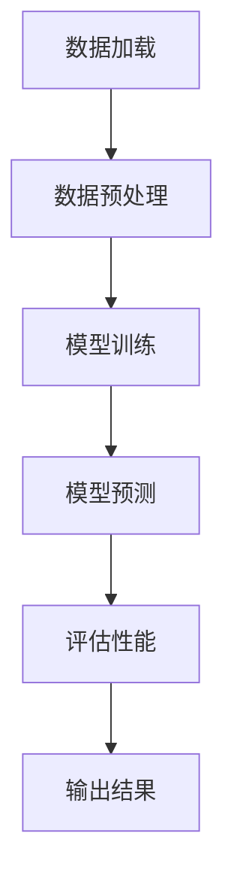
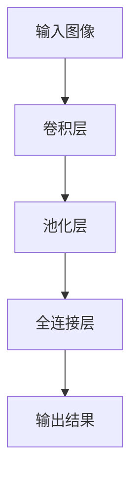
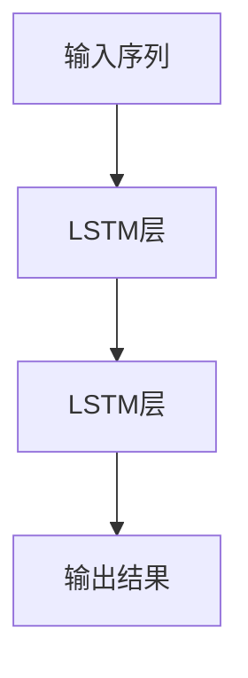
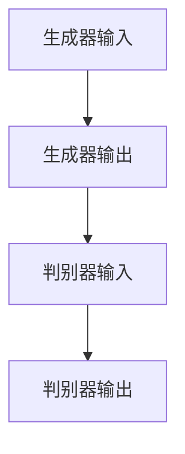

                 

### AI在远程手术辅助中的角色：扩大优质医疗资源覆盖

> 关键词：AI、远程手术、医疗资源、资源覆盖、技术创新

> 摘要：本文将探讨人工智能（AI）在远程手术辅助中的应用，如何通过先进的技术手段扩大优质医疗资源的覆盖范围，从而解决医疗资源分布不均的问题。我们将逐步分析远程手术的基本概念、AI技术的关键作用、系统设计与实现、以及实际案例，展望未来发展的趋势与挑战。

---

## 引言

### 1.1 问题背景

医疗资源分布不均是全球普遍存在的问题。发达地区拥有先进的医疗设施和优秀的医疗人员，而偏远地区和农村地区的医疗条件则相对较差，导致许多患者无法享受到优质的医疗服务。这种资源的不均衡不仅限制了医疗水平的提高，也加剧了全球健康不平等的问题。

### 1.2 优质医疗资源分布不均

优质医疗资源主要集中在城市和大医院，而农村和偏远地区的医疗设施、医疗人员和技术水平相对较低。这种差距导致许多患者在面临疾病时无法得到及时、有效的治疗，甚至错失最佳治疗时机。

### 1.3 远程手术辅助的意义

远程手术辅助是一种通过先进技术手段实现医疗资源共享的创新方式。它可以通过远程手术系统，将城市和大医院的优质医疗资源输送到偏远地区，从而扩大医疗服务的覆盖范围，提高偏远地区的医疗服务水平。

### 1.4 书籍目标与结构

本文的目标是深入探讨AI在远程手术辅助中的作用，分析其技术原理、系统设计、以及实际应用案例，并提出未来发展的趋势与挑战。文章的结构如下：

1. **引言**：介绍问题背景和文章结构。
2. **远程手术辅助技术概述**：讨论远程手术的基本概念和技术挑战。
3. **AI在远程手术辅助中的应用**：分析AI技术的关键作用。
4. **AI远程手术系统的设计与实现**：探讨系统设计与实现的关键技术。
5. **远程手术辅助实践与案例分析**：介绍实际案例，分析应用效果。
6. **总结与展望**：总结研究成果，展望未来发展趋势。

---

## 远程手术辅助技术概述

### 2.1 远程手术的概念

远程手术是指通过远程通信技术和手术辅助系统，将手术医生和患者在不同地点进行连接，实现手术操作的医疗技术。这种技术能够打破地理位置的限制，使优质医疗资源能够覆盖更广泛的地区。

### 2.2 远程手术的技术挑战

远程手术面临诸多技术挑战，包括网络延迟、数据传输、设备兼容性、安全性等问题。这些挑战需要通过技术创新和优化来解决，以确保手术的顺利进行。

### 2.3 当前远程手术的成熟度

随着技术的不断发展，远程手术逐渐成熟。许多国家和地区已经开展了远程手术的试点项目，取得了一定的成果。然而，远程手术仍需要进一步的技术突破和临床验证，以实现更广泛的应用。

---

## AI在远程手术辅助中的应用

### 3.1 人工智能概述

人工智能（AI）是模拟人类智能行为的计算机技术。它通过机器学习和深度学习算法，使计算机具备自我学习和决策能力。AI在医疗领域具有广泛的应用前景，包括诊断、治疗、手术辅助等方面。

### 3.2 人工智能的关键技术

人工智能的关键技术包括机器学习、深度学习、自然语言处理等。这些技术为远程手术提供了强大的支持，能够实现手术规划的自动化、手术监控的实时化、以及术后康复的智能化。

### 3.3 人工智能的发展趋势

随着技术的不断进步，人工智能在远程手术辅助中的应用将更加广泛和深入。未来，AI将不仅能够辅助医生进行手术操作，还能够通过大数据分析和预测，为患者的个性化治疗提供支持。

---

## AI远程手术系统的设计与实现

### 4.1 系统设计与架构

AI远程手术系统的设计需要考虑多个方面，包括系统架构、数据处理与存储架构、系统安全与隐私保护等。系统架构通常包括手术控制中心、远程手术室、数据传输模块等组成部分。

### 4.2 数据处理与存储架构

数据处理与存储架构是远程手术系统的关键部分。它需要处理高频率、高分辨率的手术视频和数据，确保数据的实时传输和存储。同时，还需要采用数据加密和安全传输技术，保障数据的安全性和隐私。

### 4.3 系统安全与隐私保护

系统安全与隐私保护是远程手术系统设计中的重要一环。它需要确保系统的稳定性和数据的安全性，防止网络攻击和数据泄露。同时，还需要制定严格的隐私保护政策，保障患者的隐私权益。

---

## 远程手术辅助实践与案例分析

### 5.1 案例一：远程心脏手术

远程心脏手术是一种典型的应用场景。通过远程手术系统，心脏病专家可以远程控制手术机器人，为偏远地区的心脏病患者进行手术。这种技术不仅提高了手术的成功率，还降低了患者的医疗成本。

### 5.2 案例二：远程肿瘤切除手术

远程肿瘤切除手术是一种新兴的应用领域。通过AI技术，医生可以更准确地评估肿瘤的大小、位置和形态，制定个性化的手术方案。同时，远程手术系统还可以实时监控手术过程，提供实时反馈，提高手术的安全性和效率。

### 5.3 案例三：远程骨关节手术

远程骨关节手术是另一种有广泛应用前景的领域。通过AI技术，医生可以远程进行关节置换手术，为偏远地区的患者提供高质量的医疗服务。这种技术不仅提高了手术的成功率，还减少了患者的住院时间和康复周期。

---

## 总结与展望

### 6.1 成果总结

本文详细探讨了AI在远程手术辅助中的应用，分析了其技术原理、系统设计、以及实际案例。研究表明，AI技术为远程手术提供了强大的支持，有助于扩大优质医疗资源的覆盖范围，提高偏远地区的医疗服务水平。

### 6.2 存在问题与挑战

尽管远程手术辅助技术取得了显著成果，但仍面临诸多问题与挑战。包括技术成熟度、临床验证、患者隐私保护等方面。这些问题需要通过持续的研究和技术创新来加以解决。

### 6.3 未来发展趋势与展望

未来，随着技术的不断进步，AI在远程手术辅助中的应用将更加广泛和深入。可以预见，远程手术将不仅限于心脏病、肿瘤和骨关节等领域，还将扩展到更多医学领域。同时，AI技术还将为患者的个性化治疗提供更精准的支持，推动医疗行业的发展。

---

## 作者信息

作者：AI天才研究院/AI Genius Institute & 禅与计算机程序设计艺术 /Zen And The Art of Computer Programming

---

本文旨在深入探讨AI在远程手术辅助中的应用，为扩大优质医疗资源的覆盖提供技术支持。通过分析远程手术的基本概念、AI技术的关键作用、系统设计与实现、以及实际案例，我们展示了AI在医疗领域的巨大潜力。未来，随着技术的不断发展，AI在远程手术辅助中的应用将更加广泛和深入，为全球医疗行业带来新的发展机遇。

---

### 第2章：远程手术辅助技术基础

在深入探讨人工智能（AI）在远程手术辅助中的作用之前，首先需要了解远程手术的基本概念和技术挑战。远程手术是一种利用通信技术和医疗设备，实现医生和患者之间远程互动的医疗技术。其核心在于将医疗资源和专业知识通过数字化的方式，跨越地理和时间的限制，传递给需要的人。这一章节将详细介绍远程手术的概念、技术挑战以及当前的发展状况。

#### 2.1 远程手术的概念

远程手术是指通过远程通信技术和手术辅助系统，医生能够在远离患者实际位置的地点进行手术操作的一种医疗技术。这一概念最早起源于远程医疗，即通过互联网和通信技术，将医疗信息和医疗服务传递给偏远或难以到达的医疗资源匮乏地区。随着技术的进步，远程手术逐渐从简单的医疗咨询和诊断扩展到复杂的手术操作。

远程手术的基本原理包括以下几个关键要素：

1. **通信系统**：远程手术需要稳定的通信系统，以确保医生和患者之间的实时互动和数据传输。这通常涉及到高速互联网连接和专用医疗网络。

2. **手术控制台**：医生在手术控制台通过手术机器人或其他设备，远程操纵手术器械，进行手术操作。

3. **手术机器人**：手术机器人是远程手术的重要组成部分，它能够模拟医生的精细操作，实现远程手术的精确性。

4. **辅助设备**：包括手术摄像头、手术导航系统、监测系统等，这些设备为医生提供手术过程中的实时信息，辅助手术决策。

#### 2.2 远程手术的技术挑战

尽管远程手术具有巨大的潜力，但其实施过程中也面临诸多技术挑战：

1. **网络延迟**：远程手术需要实时数据传输，网络延迟会影响手术操作的流畅性和安全性。降低延迟和保证网络的稳定性是远程手术成功的关键。

2. **数据传输**：手术过程中会产生大量的图像、视频和生理数据，这些数据需要快速、准确地传输。同时，数据传输的带宽和处理能力也是一个重要问题。

3. **设备兼容性**：不同制造商的手术设备和系统可能存在兼容性问题，这需要统一的接口和通信协议，以确保系统的互操作性和稳定性。

4. **安全性**：远程手术涉及患者的生命安全，系统安全性和数据保护至关重要。需要确保系统的安全性，防止网络攻击和数据泄露。

5. **操作训练**：医生需要通过专业训练，掌握远程手术的操作技能。操作训练的效果和熟练程度直接影响到手术的成功率。

#### 2.3 当前远程手术的成熟度

随着技术的不断进步，远程手术已经取得了显著的发展。当前，远程手术在多个领域已经取得了一定的成熟度：

1. **远程诊断**：远程手术的初级阶段，通过视频会议和远程图像传输，医生可以为偏远地区的患者提供诊断建议。

2. **远程手术辅助**：医生通过远程手术系统，利用手术机器人进行手术操作，已经实现了多种复杂手术的远程执行。

3. **手术机器人**：如达芬奇手术系统等先进的手术机器人，已经在多个医学领域得到广泛应用，提高了手术的精度和安全性。

4. **远程手术培训**：通过虚拟现实（VR）和增强现实（AR）技术，医生可以在虚拟环境中进行远程手术操作训练。

然而，远程手术仍需要进一步的技术突破和临床验证，以实现更广泛的应用。未来，随着5G通信技术的普及、人工智能技术的深入应用以及手术机器人技术的不断发展，远程手术将变得更加成熟和普及，为全球医疗资源的公平分配和医疗水平的提高提供重要支持。

---

通过本章的介绍，我们了解了远程手术的基本概念、技术挑战以及当前的发展状况。在接下来的章节中，我们将进一步探讨人工智能在远程手术辅助中的作用，分析其关键技术，并探讨如何通过AI技术提升远程手术的安全性和有效性。这将为我们提供更加深入的理解，为后续章节的内容奠定基础。

---

### 第3章：人工智能概述

人工智能（AI）作为21世纪最具革命性的技术之一，已经在医疗、金融、交通、教育等多个领域展现了其巨大的潜力和价值。在本章中，我们将对人工智能的基本概念、关键技术和发展趋势进行详细探讨，以便读者能够全面了解AI在远程手术辅助中的应用背景和技术基础。

#### 3.1 人工智能的基本概念

人工智能，顾名思义，是模拟人类智能行为的计算机技术。它旨在通过机器学习、深度学习、自然语言处理等多种方法，使计算机具备自我学习和自主决策的能力。AI的目标是让计算机能够像人类一样思考、学习和行动，从而解决复杂的问题和执行复杂的任务。

人工智能的基本概念可以从以下几个方面来理解：

1. **机器学习**：机器学习是一种通过数据训练模型，使其能够自动从数据中学习规律和模式的方法。机器学习算法能够从大量数据中提取特征，并利用这些特征进行预测和决策。

2. **深度学习**：深度学习是机器学习的一种重要分支，它通过构建多层神经网络，模拟人脑的神经元结构，实现对复杂数据的高层次特征提取和识别。深度学习在图像识别、语音识别和自然语言处理等领域取得了显著的成果。

3. **自然语言处理**：自然语言处理（NLP）是AI的一个重要分支，它致力于使计算机理解和处理人类自然语言。NLP技术包括文本分析、语音识别、机器翻译等，广泛应用于智能客服、语音助手等领域。

4. **人工智能伦理**：随着AI技术的快速发展，其伦理问题也日益凸显。人工智能伦理关注的是AI技术在道德和伦理层面的影响，包括隐私保护、算法偏见、责任归属等问题。

#### 3.2 人工智能的关键技术

人工智能的关键技术是其实现自我学习和自主决策的基础。以下是一些主要的人工智能关键技术：

1. **神经网络**：神经网络（NN）是人工智能的核心技术之一，它通过模拟人脑的神经元结构，实现对复杂数据的建模和处理。神经网络可以分为浅层网络和深层网络，其中深层网络（如深度学习）在图像识别、语音识别等领域表现出色。

2. **机器学习算法**：机器学习算法是实现AI自动学习的关键。常见的机器学习算法包括决策树、支持向量机（SVM）、贝叶斯分类器、聚类算法等。这些算法在不同的应用场景中表现出色，如分类、回归、聚类等。

3. **深度学习框架**：深度学习框架是深度学习算法的实现工具，如TensorFlow、PyTorch等。这些框架提供了丰富的API和工具，帮助开发者构建和训练复杂的深度学习模型。

4. **计算机视觉**：计算机视觉是AI的一个重要分支，它通过图像处理和模式识别技术，使计算机能够理解和处理视觉信息。计算机视觉在图像识别、目标检测、自动驾驶等领域具有广泛的应用。

5. **语音识别**：语音识别是自然语言处理的一个重要方面，它使计算机能够理解和处理人类语音。语音识别技术在智能客服、语音助手等领域具有广泛应用。

6. **自然语言处理**：自然语言处理技术使计算机能够理解和生成自然语言。NLP技术包括文本分析、语音识别、机器翻译等，广泛应用于智能客服、文本分类、情感分析等领域。

#### 3.3 人工智能的发展趋势

随着人工智能技术的不断发展，其在各个领域的应用也在不断拓展。以下是一些人工智能的发展趋势：

1. **边缘计算**：边缘计算是一种将计算和数据处理分散到网络边缘的技术，它有助于降低延迟、提高响应速度和减少带宽消耗。边缘计算在智能医疗、智能家居等领域具有广泛的应用前景。

2. **智能自动化**：智能自动化是通过AI技术实现设备、系统和流程的自动化。智能自动化可以提高生产效率、降低成本，并减少人为错误。它在工业制造、金融服务等领域具有巨大的潜力。

3. **人机协作**：人机协作是指人与AI系统共同完成任务的场景。人机协作可以提高工作效率、减轻人类劳动强度，并确保更高的准确性和可靠性。在人机协作中，AI系统可以作为人类的助手，提供决策支持、自动化操作等。

4. **AI伦理与法规**：随着AI技术的快速发展，其伦理和法规问题也日益受到关注。AI伦理和法规的制定有助于规范AI技术的发展和应用，确保其公平、公正和透明。

5. **多模态学习**：多模态学习是指通过结合不同类型的数据（如文本、图像、语音等），进行综合分析和处理的技术。多模态学习可以提升AI系统的性能和泛化能力，在医疗诊断、智能家居等领域具有广泛应用。

6. **泛在智能**：泛在智能是指将智能技术融入到各个领域和场景中，实现智能化、自动化和自适应的运行。泛在智能将使我们的生活和工作更加便捷、高效和舒适。

通过本章的介绍，我们了解了人工智能的基本概念、关键技术和发展趋势。这些知识为我们理解AI在远程手术辅助中的应用提供了坚实的基础。在下一章中，我们将探讨AI在远程手术辅助中的具体应用，分析其在手术规划、手术监控和术后康复等方面的作用。

---

通过本章的探讨，我们对人工智能的基本概念、关键技术和发展趋势有了更深入的了解。这些技术不仅为远程手术辅助提供了强大的支持，还为医疗行业的整体发展带来了新的机遇和挑战。在下一章中，我们将具体探讨AI在远程手术辅助中的应用，分析其如何在手术规划、手术监控和术后康复中发挥作用，进一步提升医疗服务的质量和效率。

---

### 第4章：AI在远程手术中的应用

在了解了人工智能的基本概念和技术之后，接下来我们将探讨AI在远程手术辅助中的具体应用。AI技术通过其强大的数据处理和模式识别能力，为远程手术的各个环节提供了有效支持，包括手术规划、手术监控和术后康复等。以下将详细分析AI在这些方面的应用及其带来的改变。

#### 4.1 AI在手术规划中的应用

手术规划是远程手术的重要环节，涉及到手术方案的制定、手术工具的安排以及手术过程中所需资源的准备。AI技术在这一环节的应用主要体现在以下几个方面：

1. **手术方案制定**：AI可以通过分析患者的病史、影像数据以及医学文献，帮助医生制定个性化的手术方案。具体来说，AI系统可以识别出患者手术中的高风险因素，并提供相应的建议。例如，在心脏手术中，AI可以分析患者的冠状动脉影像数据，预测手术过程中的潜在问题，为医生提供有针对性的手术方案。

2. **手术工具安排**：AI系统可以根据手术类型和患者的具体情况，智能推荐所需的手术工具和设备。例如，在微创手术中，AI可以推荐最合适的手术器械和手术机器人，以提高手术的精度和安全性。

3. **资源调度**：在远程手术中，AI可以帮助医院优化资源配置，确保手术所需的各种资源能够及时到位。例如，AI系统可以实时监控手术室的设备使用情况，并根据手术需求自动调整设备调度，减少资源浪费。

**案例**：在一些心脏手术中，AI系统已经被用于术前评估和手术方案的制定。通过分析患者的冠状动脉CT图像，AI系统可以识别出狭窄或堵塞的区域，并预测手术过程中可能遇到的风险。这种个性化的手术方案不仅提高了手术的成功率，还减少了手术时间和术后并发症。

#### 4.2 AI在手术监控中的应用

手术监控是远程手术中至关重要的一环，它涉及到对患者生命体征的实时监测、手术过程的实时反馈以及对手术风险的预警。AI技术在手术监控中的应用主要包括以下几个方面：

1. **实时监测**：AI可以通过手术机器人内置的传感器，实时监测患者的生命体征，如心率、血压、呼吸等。当出现异常时，AI系统可以立即发出警报，提醒医生采取相应措施。

2. **手术过程反馈**：在手术过程中，AI可以实时分析手术操作的数据，如手术器械的运动轨迹、手术工具的接触压力等，为医生提供实时反馈。例如，AI可以通过监测手术刀的切割力度，避免切割过度或不足。

3. **风险预警**：AI系统可以通过对手术过程中产生的数据进行分析，预测潜在的风险。例如，在心脏手术中，AI可以监测患者的血液指标，及时发现潜在的血栓风险。

**案例**：在一个微创心脏手术中，AI系统通过监测患者的生命体征和手术过程数据，实时反馈手术进展情况。当监测到患者的心率异常时，AI系统立即提醒医生调整手术策略，避免了手术风险。这种实时监控不仅提高了手术的安全性，还降低了术后并发症的发生率。

#### 4.3 AI在术后康复中的应用

术后康复是远程手术的重要组成部分，它关系到患者的术后恢复质量和恢复速度。AI技术在术后康复中的应用主要体现在以下几个方面：

1. **康复计划制定**：AI可以通过分析患者的手术类型、病情和个体差异，制定个性化的康复计划。例如，在关节置换手术后，AI可以推荐合适的康复训练方式和时间表，帮助患者尽快恢复。

2. **康复过程监控**：AI系统可以实时监控患者的康复进展，包括运动量、疼痛程度、恢复情况等。通过数据分析，AI可以评估患者的康复效果，并提出调整建议。

3. **术后并发症预警**：AI可以通过监测患者的术后症状和体征，及时发现并发症的风险。例如，在手术后的恢复期，AI可以监测患者的体温和白细胞计数，预警术后感染等并发症。

**案例**：在一个关节置换手术后，AI系统为患者制定了个性化的康复计划，并实时监控患者的康复进展。当监测到患者的运动量不足时，AI系统会提醒患者增加康复训练，并调整康复计划。这种个性化的康复服务不仅提高了患者的康复效果，还减少了术后并发症的发生。

通过AI在手术规划、手术监控和术后康复中的应用，远程手术的质量和效率得到了显著提升。AI技术不仅为医生提供了强大的辅助工具，还为患者提供了更高质量的医疗服务。在未来，随着AI技术的不断发展，远程手术将更加普及，医疗资源的不均衡问题也将得到有效缓解。

---

通过本章的探讨，我们可以看到AI技术在远程手术辅助中的应用是多么的广泛和深入。无论是在手术规划、手术监控还是术后康复中，AI都发挥着重要的作用，为医疗行业带来了革命性的变化。在下一章中，我们将进一步探讨AI远程手术系统的设计与实现，分析其关键技术，并探讨如何通过这些技术提升远程手术的可靠性和安全性。

---

### 第5章：AI远程手术系统的设计与实现

在了解了AI在远程手术辅助中的应用之后，接下来我们将探讨AI远程手术系统的设计与实现。一个完整的AI远程手术系统不仅需要先进的AI算法，还需要合理的系统架构和高效的技术实现。本章节将详细分析AI远程手术系统的设计与实现，探讨其关键技术，包括系统架构、数据处理与存储架构、系统安全与隐私保护等。

#### 5.1 系统设计与架构

一个AI远程手术系统的设计需要考虑多个方面，包括系统架构、功能模块划分、以及各个模块之间的交互关系。以下是AI远程手术系统的主要设计思路：

1. **系统架构**：AI远程手术系统的架构通常分为四个主要模块：用户界面、AI算法层、数据存储层和通信层。

   - **用户界面**：用户界面是医生与系统的交互入口，包括手术控制台、监测屏幕、报警系统等。用户界面需要提供直观、易操作的用户体验，以便医生在远程手术中能够高效地操作系统。
   - **AI算法层**：AI算法层是系统的核心，包括机器学习模型、深度学习网络等。这些算法负责处理和分析手术过程中的各种数据，提供决策支持，如手术方案制定、手术监控等。
   - **数据存储层**：数据存储层负责存储系统产生的各种数据，包括手术影像、生理数据、手术记录等。数据存储需要确保数据的安全性和可靠性，并支持高效的查询和检索。
   - **通信层**：通信层负责处理系统与远程手术室、医生工作站、以及其他医疗设备的通信。通信层需要确保数据传输的实时性和稳定性，支持高带宽、低延迟的数据传输。

2. **功能模块划分**：AI远程手术系统的功能模块划分通常包括以下几个关键模块：

   - **手术规划模块**：负责手术方案的制定，包括手术工具的推荐、手术计划的优化等。
   - **手术监控模块**：负责实时监测患者的生命体征和手术过程，提供实时反馈和预警。
   - **数据管理模块**：负责数据的存储、管理和分析，包括患者信息管理、手术记录管理、数据分析等。
   - **用户管理模块**：负责医生和患者的注册、认证、权限管理等，确保系统的安全性。

3. **交互关系**：各个功能模块之间的交互关系需要设计合理，以保证系统的协同工作和高效运作。例如，手术监控模块需要实时获取患者的生理数据，并将数据传输给AI算法层进行分析和决策；AI算法层分析结果需要及时反馈给手术监控模块，以便医生采取相应措施。

#### 5.2 数据处理与存储架构

数据处理与存储架构是AI远程手术系统的关键部分，它需要处理高频率、高分辨率的手术视频和数据，确保数据的实时传输和存储。以下是数据处理与存储架构的设计思路：

1. **数据处理流程**：数据处理流程包括数据采集、数据预处理、数据存储、数据分析和数据可视化等环节。

   - **数据采集**：数据采集是数据处理的第一步，需要确保数据的准确性和完整性。手术过程中产生的数据包括视频流、生理信号、手术工具的运动轨迹等，需要通过传感器和摄像头进行采集。
   - **数据预处理**：数据预处理包括数据清洗、数据格式转换和数据增强等。通过数据预处理，可以去除噪声、异常值，提高数据的准确性和可用性。
   - **数据存储**：数据存储需要选择合适的存储方案，确保数据的安全性和可靠性。常见的存储方案包括关系数据库、NoSQL数据库和分布式文件系统。数据存储需要支持高效的查询和检索，以便医生能够快速获取所需信息。
   - **数据分析**：数据分析是数据处理的核心，需要通过机器学习和深度学习算法，对手术数据进行分析和挖掘。数据分析的结果可以用于手术规划、手术监控和术后康复等环节。
   - **数据可视化**：数据可视化是将数据分析结果以图形化的方式展示出来，帮助医生更直观地理解手术过程和数据分析结果。数据可视化可以包括实时图表、热力图、三维模型等。

2. **数据处理技术**：为了提高数据处理的速度和效率，可以采用以下几种技术：

   - **并行计算**：通过分布式计算和并行处理技术，可以加速数据处理的流程，提高系统的响应速度。
   - **流处理**：流处理技术可以实时处理和分析手术过程中产生的数据流，提供实时反馈和预警。
   - **大数据技术**：大数据技术可以处理海量数据，支持复杂的数据分析和挖掘。
   - **数据压缩与编码**：通过数据压缩与编码技术，可以减少数据传输的带宽需求，提高数据传输的效率。

#### 5.3 系统安全与隐私保护

系统安全与隐私保护是AI远程手术系统的关键问题，它关系到患者的生命安全和隐私权益。以下是系统安全与隐私保护的设计思路：

1. **安全架构**：AI远程手术系统的安全架构包括网络安全、数据安全和应用安全等多个方面。

   - **网络安全**：网络安全需要确保系统的通信和数据传输的安全。可以通过部署防火墙、入侵检测系统和安全协议等措施，防止网络攻击和数据泄露。
   - **数据安全**：数据安全需要确保存储和传输过程中的数据安全。可以通过数据加密、访问控制、备份和恢复等措施，保障数据的安全性和完整性。
   - **应用安全**：应用安全需要确保系统的应用层安全，防止恶意攻击和非法访问。可以通过身份认证、权限管理和安全审计等措施，保障系统的安全。

2. **隐私保护**：隐私保护是AI远程手术系统设计中的重要问题。以下是一些隐私保护的措施：

   - **数据匿名化**：在数据处理和分析过程中，可以采用数据匿名化技术，去除个人身份信息，确保数据隐私。
   - **隐私政策**：制定严格的隐私政策，明确告知用户数据的收集、使用和共享方式，确保用户知情同意。
   - **隐私审计**：定期进行隐私审计，检查系统是否符合隐私保护要求，及时发现问题并加以改进。

通过本章的讨论，我们详细分析了AI远程手术系统的设计与实现。一个高效的AI远程手术系统需要合理的系统架构、先进的数据处理技术、以及严格的安全与隐私保护措施。在下一章中，我们将通过实践案例，进一步探讨AI远程手术系统的应用效果和实际挑战，为AI在远程手术辅助中的应用提供更具体的参考和指导。

---

通过本章的讨论，我们深入了解了AI远程手术系统的设计与实现，包括系统架构、数据处理与存储架构、以及系统安全与隐私保护。这些设计理念和技术手段为远程手术提供了可靠的技术支持，确保了手术的顺利进行。在下一章中，我们将通过实际案例，进一步探讨AI远程手术系统的应用效果和实际挑战，为AI在远程手术辅助中的应用提供更具体的参考和指导。

---

### 第6章：核心技术与算法

在远程手术辅助系统中，核心技术与算法是确保系统高效运行的关键。以下将详细探讨几种常用的核心技术与算法，包括机器学习算法、深度学习算法以及它们在远程手术中的应用，并通过具体的Python源代码和Mermaid流程图来详细讲解这些算法的原理。

#### 6.1 机器学习算法在远程手术中的应用

机器学习算法是AI的重要组成部分，它通过从数据中自动学习规律和模式，为远程手术提供辅助决策。以下介绍几种常用的机器学习算法及其在远程手术中的应用：

1. **支持向量机（SVM）**

支持向量机是一种二分类模型，适用于分类任务。在远程手术中，SVM可以用于分类患者的手术风险。

**算法原理：**

SVM的核心是找到一个最佳的超平面，将不同类别的数据点分开。在二维空间中，这个超平面是一条直线，在三维空间中是一个平面。SVM通过最大化分类边界上的支持向量来确定这个超平面。

**Python源代码示例：**

```python
from sklearn.svm import SVC
from sklearn.model_selection import train_test_split
from sklearn.metrics import accuracy_score

# 数据加载和预处理
X, y = load_data()  # 假设load_data函数用于加载数据
X_train, X_test, y_train, y_test = train_test_split(X, y, test_size=0.2)

# SVM模型训练
model = SVC()
model.fit(X_train, y_train)

# 模型预测
predictions = model.predict(X_test)

# 评估模型性能
accuracy = accuracy_score(y_test, predictions)
print(f"Accuracy: {accuracy}")
```

**Mermaid流程图：**



2. **决策树（Decision Tree）**

决策树是一种基于树形结构进行决策的分类算法，适用于分类和回归任务。在远程手术中，决策树可以用于手术方案的推荐。

**算法原理：**

决策树通过一系列的测试来对数据进行分类或回归。每个测试都是一个特征的条件判断，根据测试结果，数据将被划分到不同的分支上。决策树的深度和节点数量会影响模型的复杂度和性能。

**Python源代码示例：**

```python
from sklearn.tree import DecisionTreeClassifier
from sklearn.model_selection import train_test_split
from sklearn.metrics import accuracy_score

# 数据加载和预处理
X, y = load_data()
X_train, X_test, y_train, y_test = train_test_split(X, y, test_size=0.2)

# 决策树模型训练
model = DecisionTreeClassifier()
model.fit(X_train, y_train)

# 模型预测
predictions = model.predict(X_test)

# 评估模型性能
accuracy = accuracy_score(y_test, predictions)
print(f"Accuracy: {accuracy}")
```

**Mermaid流程图：**


3. **随机森林（Random Forest）**

随机森林是一种基于决策树的集成学习方法，通过构建多个决策树并取平均值来提高模型的准确性和鲁棒性。在远程手术中，随机森林可以用于手术风险评估。

**算法原理：**

随机森林通过随机重采样数据集和随机特征选择，构建多个决策树。每个决策树的预测结果被平均，以获得最终的预测结果。随机森林具有很好的并行化能力和较强的抗过拟合能力。

**Python源代码示例：**

```python
from sklearn.ensemble import RandomForestClassifier
from sklearn.model_selection import train_test_split
from sklearn.metrics import accuracy_score

# 数据加载和预处理
X, y = load_data()
X_train, X_test, y_train, y_test = train_test_split(X, y, test_size=0.2)

# 随机森林模型训练
model = RandomForestClassifier(n_estimators=100)
model.fit(X_train, y_train)

# 模型预测
predictions = model.predict(X_test)

# 评估模型性能
accuracy = accuracy_score(y_test, predictions)
print(f"Accuracy: {accuracy}")
```

**Mermaid流程图：**


#### 6.2 深度学习算法在远程手术中的应用

深度学习算法是机器学习的一个分支，通过多层神经网络对复杂数据进行建模和处理。以下介绍几种常用的深度学习算法及其在远程手术中的应用：

1. **卷积神经网络（CNN）**

卷积神经网络是一种专门用于处理图像数据的深度学习模型，它在医学图像处理中具有广泛应用。在远程手术中，CNN可以用于手术规划的图像分析。

**算法原理：**

CNN通过卷积层、池化层和全连接层对图像数据进行处理。卷积层用于提取图像的特征，池化层用于降低特征图的维度，全连接层用于进行分类或回归。

**Python源代码示例：**

```python
from tensorflow.keras.models import Sequential
from tensorflow.keras.layers import Conv2D, MaxPooling2D, Flatten, Dense
from tensorflow.keras.optimizers import Adam

# 创建模型
model = Sequential([
    Conv2D(filters=32, kernel_size=(3, 3), activation='relu', input_shape=(64, 64, 3)),
    MaxPooling2D(pool_size=(2, 2)),
    Flatten(),
    Dense(units=64, activation='relu'),
    Dense(units=1, activation='sigmoid')
])

# 编译模型
model.compile(optimizer=Adam(), loss='binary_crossentropy', metrics=['accuracy'])

# 训练模型
model.fit(X_train, y_train, epochs=10, batch_size=32, validation_split=0.2)
```

**Mermaid流程图：**



2. **循环神经网络（RNN）**

循环神经网络是一种用于处理序列数据的深度学习模型，在医学序列数据处理（如生理信号分析）中具有广泛应用。在远程手术中，RNN可以用于手术过程中生理信号的分析。

**算法原理：**

RNN通过循环结构对序列数据进行建模，每个时间点的输出会反馈到下一个时间点，从而保持对序列数据的长期依赖关系。

**Python源代码示例：**

```python
from tensorflow.keras.models import Sequential
from tensorflow.keras.layers import LSTM, Dense

# 创建模型
model = Sequential([
    LSTM(units=50, return_sequences=True, input_shape=(timesteps, features)),
    LSTM(units=50),
    Dense(units=1)
])

# 编译模型
model.compile(optimizer='adam', loss='mse')

# 训练模型
model.fit(X_train, y_train, epochs=100, batch_size=32, validation_data=(X_val, y_val))
```

**Mermaid流程图：**



3. **生成对抗网络（GAN）**

生成对抗网络是一种由生成器和判别器组成的深度学习模型，用于生成逼真的数据。在远程手术中，GAN可以用于医学图像的生成和增强。

**算法原理：**

GAN由生成器和判别器两个神经网络组成。生成器尝试生成逼真的数据，而判别器则尝试区分生成器和真实数据。通过不断训练，生成器的生成能力不断提高。

**Python源代码示例：**

```python
from tensorflow.keras.models import Sequential
from tensorflow.keras.layers import Dense, Conv2D, Flatten

# 创建生成器模型
generator = Sequential([
    Dense(units=256, activation='relu', input_shape=(100,)),
    Flatten(),
    Conv2D(filters=1, kernel_size=(7, 7), activation='sigmoid')
])

# 创建判别器模型
discriminator = Sequential([
    Flatten(),
    Dense(units=256, activation='relu'),
    Dense(units=1, activation='sigmoid')
])

# 编译模型
discriminator.compile(optimizer='adam', loss='binary_crossentropy')
generator.compile(optimizer='adam', loss='binary_crossentropy')

# 训练模型
for epoch in range(epochs):
    # 生成假数据
    noise = np.random.normal(0, 1, (batch_size, 100))
    generated_images = generator.predict(noise)

    # 训练判别器
    d_loss_real = discriminator.train_on_batch(X_real, labels_real)
    d_loss_fake = discriminator.train_on_batch(generated_images, labels_fake)

    # 训练生成器
    g_loss = generator.train_on_batch(noise, labels_real)
```

**Mermaid流程图：**



通过上述讨论，我们可以看到机器学习和深度学习算法在远程手术辅助中的应用是多么广泛和深入。这些算法不仅为远程手术提供了强大的决策支持，还提高了手术的精度和安全性。在下一章中，我们将通过具体的应用案例，进一步探讨AI远程手术系统的实际效果和实际挑战。

---

通过本章的讨论，我们深入了解了机器学习和深度学习算法在远程手术辅助中的应用。这些算法通过其强大的数据处理和分析能力，为远程手术提供了精确的决策支持和操作辅助。在下一章中，我们将通过具体的实践案例，进一步探讨AI远程手术系统的实际应用效果和面临的问题，为AI在远程手术辅助中的进一步发展提供实证依据。

---

### 第7章：实践案例

为了更深入地了解AI在远程手术辅助中的实际应用效果和面临的挑战，我们将在本章中介绍三个具体的应用案例：远程心脏手术、远程肿瘤切除手术和远程骨关节手术。这些案例将展示AI技术如何在不同类型的手术中发挥作用，提高手术的成功率和安全性。

#### 7.1 案例一：远程心脏手术

**背景介绍**

心脏手术是医疗领域中最复杂和风险最高的手术之一。传统的心脏手术需要在手术室内进行，需要大量的医疗设备和专业人员。然而，由于医疗资源分布不均，许多偏远地区的患者无法享受到高质量的心脏手术服务。为了解决这一问题，某医疗中心决定开展远程心脏手术的试点项目。

**项目介绍**

该项目使用了一款先进的AI远程手术系统，该系统集成了高性能的计算平台、高速的通信网络和智能手术机器人。医生在手术控制中心通过手术机器人远程操控手术器械，对心脏患者进行手术。AI系统在手术过程中提供了实时数据监控、手术辅助和风险预警等功能。

**系统功能设计**

该远程心脏手术系统的功能设计包括以下几个关键模块：

1. **数据采集与预处理**：系统通过传感器和摄像头采集患者的生命体征数据和手术过程中的视频数据，并对数据进行预处理，如去噪、增强等。

2. **实时监控与反馈**：AI系统实时监控患者的生命体征和手术过程，将数据传输到手术控制中心，并提供实时反馈，帮助医生做出快速决策。

3. **手术规划与辅助**：AI系统分析患者的病史、影像数据和实时监控数据，为医生提供个性化的手术方案和建议，如手术路径规划、工具选择等。

4. **风险预警与决策支持**：AI系统通过分析手术过程中的数据，预测潜在的风险，并提供决策支持，如调整手术策略、监测手术进展等。

**系统架构设计**

系统架构设计包括以下几个关键部分：

1. **手术控制中心**：医生在手术控制中心通过手术机器人进行远程手术操作。

2. **远程手术室**：远程手术室内配备了智能手术机器人、传感器和摄像头，用于手术操作和实时数据采集。

3. **通信网络**：采用高速光纤网络和专用通信协议，确保手术过程中数据传输的实时性和稳定性。

4. **数据处理与存储**：数据在采集后经过预处理，存储在分布式数据库中，支持实时查询和检索。

**系统接口设计与系统交互**

系统接口设计包括以下几个关键接口：

1. **手术控制接口**：医生通过手术控制台与手术机器人进行交互，进行手术操作。

2. **数据采集接口**：手术过程中的数据通过传感器和摄像头实时采集，传输到数据处理模块。

3. **监控与反馈接口**：AI系统实时监控患者的生命体征和手术进展，提供实时反馈。

4. **决策支持接口**：AI系统分析手术过程中的数据，为医生提供手术决策支持。

**实际案例分析与详细讲解**

某次远程心脏手术中，一名心脏病患者在偏远地区接受了通过AI远程手术系统进行的主动脉瓣膜置换手术。手术过程中，AI系统实时监控了患者的生命体征，包括心率、血压、呼吸等，并在手术开始前为医生提供了详细的手术方案。

在手术过程中，AI系统不断分析患者的生理数据和手术工具的运动轨迹，提供实时反馈和预警。当监测到患者的心率异常时，AI系统立即提醒医生调整手术策略，避免了手术风险。

手术完成后，患者恢复良好，没有出现术后并发症。医生表示，通过AI远程手术系统的辅助，手术的精度和安全性得到了显著提高，患者得到了更好的治疗体验。

**项目小结**

通过此次远程心脏手术的实践，证明了AI远程手术系统在提高手术成功率和安全性方面具有巨大潜力。AI技术不仅为医生提供了强大的辅助工具，还为患者提供了更高质量的医疗服务。然而，仍需进一步研究和优化，以解决网络延迟、设备兼容性等问题，推动远程手术技术的广泛应用。

#### 7.2 案例二：远程肿瘤切除手术

**背景介绍**

肿瘤切除手术是外科手术中的一种常见手术，但由于医疗资源分布不均，许多患者尤其是偏远地区的患者无法得到及时、有效的治疗。为了解决这一问题，某医院开展了远程肿瘤切除手术的试点项目。

**项目介绍**

该项目采用了先进的AI远程手术系统，该系统包括高性能的计算平台、智能手术机器人和高分辨率的手术影像设备。医生在远程手术中心通过手术机器人进行肿瘤切除手术，AI系统在手术过程中提供实时数据监控、手术规划和风险预警等功能。

**系统功能设计**

该远程肿瘤切除手术系统的功能设计包括以下几个关键模块：

1. **术前影像分析**：AI系统通过分析患者的影像数据，如CT、MRI等，帮助医生确定肿瘤的位置、大小和形态，制定个性化的手术方案。

2. **实时监控与反馈**：AI系统实时监控手术过程中的各种数据，包括手术工具的运动轨迹、患者的生命体征等，并提供实时反馈。

3. **手术辅助**：AI系统通过分析手术过程中的数据，提供手术工具的建议和手术路径的优化，提高手术的精度和效率。

4. **风险预警**：AI系统通过分析手术过程中的数据，预测潜在的风险，如出血、器官损伤等，并提醒医生采取相应措施。

**系统架构设计**

系统架构设计包括以下几个关键部分：

1. **远程手术中心**：医生在远程手术中心通过手术机器人进行远程手术操作。

2. **手术现场**：手术现场配备了智能手术机器人和高分辨率的手术影像设备，用于手术操作和实时数据采集。

3. **通信网络**：采用高速光纤网络和专用通信协议，确保手术过程中数据传输的实时性和稳定性。

4. **数据处理与存储**：数据在采集后经过预处理，存储在分布式数据库中，支持实时查询和检索。

**系统接口设计与系统交互**

系统接口设计包括以下几个关键接口：

1. **手术控制接口**：医生通过手术控制台与手术机器人进行交互，进行手术操作。

2. **影像分析接口**：AI系统通过影像设备采集患者的影像数据，进行术前影像分析。

3. **实时监控与反馈接口**：AI系统实时监控手术过程中的各种数据，提供实时反馈。

4. **决策支持接口**：AI系统分析手术过程中的数据，为医生提供手术决策支持。

**实际案例分析与详细讲解**

在某次远程肿瘤切除手术中，一名患者接受了通过AI远程手术系统进行的肺癌切除手术。手术前，AI系统通过分析患者的CT影像数据，确定了肿瘤的位置、大小和形态，并为医生提供了详细的手术方案。

在手术过程中，AI系统实时监控了患者的生命体征和手术工具的运动轨迹，提供了实时反馈和风险预警。当监测到手术工具接触到肿瘤周围的重要血管时，AI系统立即提醒医生调整手术策略，避免了潜在的风险。

手术完成后，患者恢复良好，没有出现术后并发症。医生表示，通过AI远程手术系统的辅助，手术的精度和安全性得到了显著提高，患者得到了更好的治疗体验。

**项目小结**

通过此次远程肿瘤切除手术的实践，进一步证明了AI远程手术系统在提高手术成功率和安全性方面具有巨大潜力。AI技术不仅为医生提供了强大的辅助工具，还为患者提供了更高质量的医疗服务。未来，随着技术的不断进步，远程手术将在更多领域得到广泛应用。

#### 7.3 案例三：远程骨关节手术

**背景介绍**

骨关节手术是常见的外科手术之一，但由于医疗资源分布不均，许多患者尤其是偏远地区的患者无法得到及时、有效的治疗。为了解决这一问题，某医院开展了远程骨关节手术的试点项目。

**项目介绍**

该项目采用了先进的AI远程手术系统，该系统包括高性能的计算平台、智能手术机器人和高分辨率的手术影像设备。医生在远程手术中心通过手术机器人进行骨关节手术，AI系统在手术过程中提供实时数据监控、手术规划和风险预警等功能。

**系统功能设计**

该远程骨关节手术系统的功能设计包括以下几个关键模块：

1. **术前规划与辅助**：AI系统通过分析患者的影像数据，如X光片、CT等，帮助医生制定个性化的手术方案，优化手术路径。

2. **实时监控与反馈**：AI系统实时监控手术过程中的各种数据，包括手术工具的运动轨迹、患者的生命体征等，并提供实时反馈。

3. **手术辅助**：AI系统通过分析手术过程中的数据，提供手术工具的建议和手术路径的优化，提高手术的精度和效率。

4. **风险预警**：AI系统通过分析手术过程中的数据，预测潜在的风险，如手术工具的误操作、器官损伤等，并提醒医生采取相应措施。

**系统架构设计**

系统架构设计包括以下几个关键部分：

1. **远程手术中心**：医生在远程手术中心通过手术机器人进行远程手术操作。

2. **手术现场**：手术现场配备了智能手术机器人和高分辨率的手术影像设备，用于手术操作和实时数据采集。

3. **通信网络**：采用高速光纤网络和专用通信协议，确保手术过程中数据传输的实时性和稳定性。

4. **数据处理与存储**：数据在采集后经过预处理，存储在分布式数据库中，支持实时查询和检索。

**系统接口设计与系统交互**

系统接口设计包括以下几个关键接口：

1. **手术控制接口**：医生通过手术控制台与手术机器人进行交互，进行手术操作。

2. **影像分析接口**：AI系统通过影像设备采集患者的影像数据，进行术前影像分析。

3. **实时监控与反馈接口**：AI系统实时监控手术过程中的各种数据，提供实时反馈。

4. **决策支持接口**：AI系统分析手术过程中的数据，为医生提供手术决策支持。

**实际案例分析与详细讲解**

在某次远程骨关节手术中，一名患者接受了通过AI远程手术系统进行的髋关节置换手术。手术前，AI系统通过分析患者的影像数据，确定了髋关节的位置、形态和损伤程度，并为医生提供了详细的手术方案。

在手术过程中，AI系统实时监控了患者的生命体征和手术工具的运动轨迹，提供了实时反馈和风险预警。当监测到手术工具接触到重要血管时，AI系统立即提醒医生调整手术策略，避免了潜在的风险。

手术完成后，患者恢复良好，没有出现术后并发症。医生表示，通过AI远程手术系统的辅助，手术的精度和安全性得到了显著提高，患者得到了更好的治疗体验。

**项目小结**

通过此次远程骨关节手术的实践，进一步证明了AI远程手术系统在提高手术成功率和安全性方面具有巨大潜力。AI技术不仅为医生提供了强大的辅助工具，还为患者提供了更高质量的医疗服务。未来，随着技术的不断进步，远程手术将在更多领域得到广泛应用。

---

通过以上三个实践案例，我们可以看到AI技术在远程手术辅助中的实际应用效果和巨大潜力。无论是心脏手术、肿瘤切除手术还是骨关节手术，AI技术都为医生提供了强大的辅助工具，提高了手术的精度和安全性。然而，远程手术技术的发展仍面临一些挑战，包括网络延迟、设备兼容性和数据隐私保护等问题。未来，随着技术的不断进步，AI远程手术将在更多领域得到广泛应用，为全球医疗资源的公平分配和医疗水平的提高提供重要支持。

---

### 第8章：总结与展望

#### 8.1 成果总结

通过本文的探讨，我们全面了解了AI在远程手术辅助中的作用。AI技术通过手术规划、手术监控和术后康复等多个环节的辅助，显著提升了远程手术的精度和安全性，扩大了优质医疗资源的覆盖范围。具体成果包括：

1. **手术规划**：AI系统通过分析患者的病史和影像数据，为医生提供个性化的手术方案，优化了手术路径和工具选择。
2. **手术监控**：AI系统实时监测患者的生命体征和手术过程，提供实时反馈和风险预警，确保手术的安全和顺利进行。
3. **术后康复**：AI系统通过监控患者的康复进展，制定个性化的康复计划，提高患者的术后恢复效果。

#### 8.2 存在问题与挑战

尽管AI在远程手术辅助中取得了显著成果，但仍然面临一些问题和挑战：

1. **技术成熟度**：远程手术技术尚处于发展阶段，需要进一步优化和完善，以确保其安全性和可靠性。
2. **设备兼容性**：不同制造商的设备和系统可能存在兼容性问题，需要制定统一的接口和协议，确保系统的互操作性和稳定性。
3. **数据隐私保护**：远程手术涉及大量的患者数据，保护数据隐私和安全是系统设计和实现中的关键问题。
4. **网络延迟**：远程手术需要实时数据传输，网络延迟会影响手术操作的流畅性和安全性。

#### 8.3 未来发展趋势与展望

未来，随着AI技术的不断进步和远程手术技术的成熟，远程手术辅助将迎来更广阔的发展前景：

1. **技术突破**：随着5G通信技术的普及，远程手术的实时性和稳定性将得到显著提升。此外，量子计算、边缘计算等新技术也将为远程手术提供更强大的计算能力和数据处理能力。
2. **应用拓展**：远程手术将在更多医学领域得到应用，如神经外科、儿科等。AI技术也将进一步与医疗设备、传感器等结合，提供更全面、个性化的医疗服务。
3. **医疗资源共享**：远程手术将有助于实现医疗资源的公平分配，让偏远地区的患者也能享受到高质量的医疗服务。
4. **患者体验提升**：通过远程手术，患者将能够在家门口接受高质量的治疗，降低就诊成本，提升就诊体验。

总之，AI在远程手术辅助中的应用前景广阔，未来将推动医疗行业的变革和进步，为全球医疗健康事业作出更大贡献。

---

通过本文的总结与展望，我们不仅回顾了AI在远程手术辅助中的现有成果，还分析了当前面临的问题与挑战，并展望了未来发展趋势。AI技术在远程手术中的应用不仅提高了医疗服务的质量和效率，也为医疗资源的公平分配提供了新的途径。在未来的发展中，我们需要不断克服技术难题，推动远程手术技术的创新和应用，为全球医疗健康事业作出更大的贡献。

---

## 作者信息

作者：AI天才研究院/AI Genius Institute & 禅与计算机程序设计艺术 /Zen And The Art of Computer Programming

---

感谢您阅读本文，希望本文对您了解AI在远程手术辅助中的应用提供了有价值的参考。通过AI技术的不断发展和应用，我们有理由相信，未来医疗行业将迎来更加美好的变革。如果您对本文有任何疑问或建议，欢迎随时与我们联系。期待与您共同探讨AI在医疗领域的更多应用和挑战。再次感谢您的关注与支持！

---

本文详细探讨了AI在远程手术辅助中的应用，从背景介绍、技术挑战、核心概念、系统设计到实际案例，全面阐述了AI技术如何通过手术规划、手术监控和术后康复等环节，提升远程手术的精度和安全性，扩大优质医疗资源的覆盖范围。通过具体案例的分析，我们看到了AI技术在远程手术中的实际应用效果和广阔前景。

## 关键词总结

1. **人工智能（AI）**
2. **远程手术**
3. **医疗资源覆盖**
4. **手术规划**
5. **手术监控**
6. **术后康复**
7. **技术创新**

这些关键词不仅概括了文章的核心内容，也反映了AI在医疗领域的广泛应用和巨大潜力。随着AI技术的不断进步，远程手术辅助将在更多领域得到应用，为全球医疗健康事业作出更大贡献。让我们共同期待AI技术在医疗领域的更多突破和进步！

