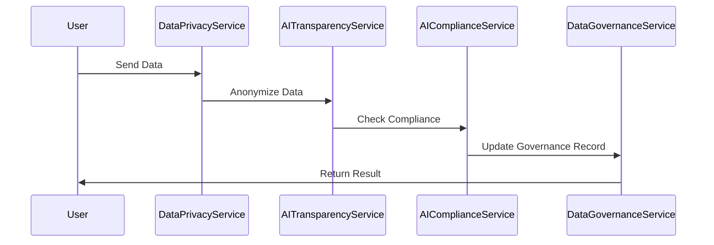

                 

### 文章标题：AI治理在跨境数据流动中的挑战

> 关键词：AI治理、跨境数据流动、隐私保护、数据主权、算法透明性、国际协作

> 摘要：
本文深入探讨了AI治理在跨境数据流动中面临的重大挑战。随着全球化进程的加速，数据跨境流动已成为现代信息社会的核心特征，然而，这同时也为AI治理带来了前所未有的复杂性和风险。本文将逐步分析跨境数据流动的现状、AI治理的核心要素及其发展历程，并结合实际案例，探讨AI治理在跨境数据流动中的具体挑战与解决策略。

----------------------------------------------------------------

## 引言

### 1.1 问题背景

在全球化背景下，数据跨境流动已成为推动数字经济和社会进步的重要动力。数据不仅在国家内部流动，更跨越国界，成为全球范围内的资源。这一趋势极大地促进了信息共享和技术创新，但同时也引发了诸多治理问题，特别是与AI技术相关的治理挑战。

#### 1.1.1 跨境数据流动的现状

跨境数据流动涉及的范围广泛，包括个人数据、商业数据、公共数据等。这些数据在跨国企业运营、国际贸易、科研合作、政府管理等方面发挥着关键作用。据统计，全球每年跨境数据流量已达数百万亿字节，数据流动的规模和速度持续增长。

#### 1.1.2 AI治理的重要性

AI技术的迅猛发展不仅改变了传统的数据治理模式，还带来了新的隐私保护、数据主权和安全风险。有效的AI治理是确保跨境数据流动安全和可持续发展的关键。通过合理的AI治理，可以平衡数据自由流动与保护个人隐私、维护数据主权之间的关系。

#### 1.1.3 跨境数据流动中的AI治理挑战

跨境数据流动中的AI治理面临多重挑战。首先，隐私保护问题愈发突出，数据跨境流动可能导致个人隐私泄露。其次，数据主权和法律冲突日益加剧，不同国家和地区对数据治理的法律和规定存在差异。此外，AI技术的非预期后果也使得治理变得更加复杂。因此，如何有效治理AI在跨境数据流动中的应用，成为当前亟待解决的问题。

### 1.2 问题描述

#### 1.2.1 跨境数据流动中的隐私保护

跨境数据流动过程中，个人数据的隐私保护面临巨大挑战。一方面，数据在传输过程中可能遭受黑客攻击和数据泄露；另一方面，数据在存储和使用过程中也可能被滥用。为了保护个人隐私，需要采取有效的数据匿名化、同态加密和差分隐私等技术手段。

#### 1.2.2 数据主权与法律冲突

数据主权是指一个国家对其境内的数据资源享有独立控制和管理权利。然而，跨境数据流动使得各国在数据主权方面的法律冲突日益突出。不同国家和地区对数据治理的法律和规定存在差异，这可能导致跨境数据流动中的法律纠纷和监管障碍。

#### 1.2.3 AI技术的非预期后果

AI技术在跨境数据流动中的应用虽然带来了诸多便利，但也可能产生非预期后果。例如，AI算法可能存在偏见和歧视，导致数据不公平处理；AI技术的不可解释性使得决策过程难以追踪和审查。这些非预期后果对AI治理提出了更高的要求。

### 1.3 问题解决

#### 1.3.1 AI治理框架的构建

构建一个有效的AI治理框架是解决跨境数据流动问题的关键。这一框架应包括明确的数据治理原则、监管机制和责任分配。通过制定国际标准和法规，可以促进跨境数据流动中的合作与协调。

#### 1.3.2 跨境数据流动的监管机制

建立跨境数据流动的监管机制是确保数据安全和隐私保护的重要手段。监管机制应涵盖数据收集、存储、传输和使用等全过程，确保每个环节都符合数据治理的要求。此外，应加强对AI技术的监管，确保其应用符合道德和法律标准。

#### 1.3.3 AI技术的透明性与可解释性

提高AI技术的透明性与可解释性是减少非预期后果的重要途径。通过开发可解释的AI模型和算法，可以更好地理解其决策过程，确保其应用符合道德和法律要求。此外，还应加强对AI技术的伦理审查，确保其应用不会对个人和社会产生负面影响。

### 1.4 边界与外延

#### 1.4.1 数据治理与AI治理的关系

数据治理和AI治理密切相关。数据治理是AI治理的基础，而AI治理则是数据治理的深化和延伸。两者共同构成了现代信息社会数据管理和治理的核心体系。

#### 1.4.2 跨境数据流动中的伦理问题

跨境数据流动中的AI治理不仅涉及技术问题，还涉及伦理问题。如何平衡个人隐私、数据主权和技术创新之间的关系，是跨境数据流动中伦理治理的关键挑战。

#### 1.4.3 国际合作与法规协调

国际合作和法规协调是解决跨境数据流动中AI治理挑战的重要手段。通过加强国际间的合作与协调，可以建立统一的数据治理标准和规范，促进跨境数据流动的健康发展。

### 1.5 本章小结

本文介绍了跨境数据流动的现状、AI治理的重要性以及跨境数据流动中的AI治理挑战。通过构建AI治理框架、建立监管机制和提升AI技术的透明性与可解释性，可以解决跨境数据流动中的AI治理挑战。然而，这一过程需要全球范围内的合作与协调，才能实现跨境数据流动的安全与可持续发展。

----------------------------------------------------------------

## 核心概念与联系

### 2.1 AI治理的基本概念

#### 2.1.1 AI治理的定义

AI治理是指通过制定和执行政策、规则和法律，确保人工智能技术的研发、部署和应用符合社会伦理、法律和监管要求的一系列行为。它旨在实现AI技术的可持续发展和广泛应用，同时确保其安全、透明和可解释。

#### 2.1.2 AI治理的核心要素

AI治理的核心要素包括：法律法规、政策指导、伦理审查、技术规范、社会责任和监管机制。这些要素共同构成了AI治理的框架，确保AI技术的应用符合社会和道德标准。

#### 2.1.3 AI治理的发展历程

AI治理的发展历程可以分为三个阶段：初期阶段（20世纪80年代至2000年），主要关注技术本身的安全性和可控性；发展阶段（2000年至2010年），开始关注AI技术的伦理和社会影响；成熟阶段（2010年至今），AI治理逐渐成为全球性议题，各国纷纷制定相关政策和法规。

### 2.2 跨境数据流动的挑战

#### 2.2.1 跨境数据流动的现状

跨境数据流动已经成为现代信息社会的重要特征。数据在跨国企业、科研合作和政府管理等方面发挥着关键作用。然而，跨境数据流动也带来了数据隐私保护、数据主权和法律冲突等问题。

#### 2.2.2 跨境数据流动的主要挑战

跨境数据流动的主要挑战包括：数据隐私保护、数据主权和法律冲突、技术非预期后果和伦理问题。这些问题使得跨境数据流动的治理变得异常复杂。

#### 2.2.3 跨境数据流动的影响

跨境数据流动对经济、社会和科技领域产生了深远影响。它促进了信息共享和技术创新，推动了数字经济的快速发展。然而，同时也带来了数据隐私保护、数据主权和安全风险等问题。

### 2.3 AI治理与跨境数据流动的联系

#### 2.3.1 AI治理对跨境数据流动的影响

AI治理对跨境数据流动产生了重要影响。有效的AI治理可以保障跨境数据流动的安全和隐私，促进数据主权和法律协调，降低技术非预期后果的风险。

#### 2.3.2 跨境数据流动对AI治理的挑战

跨境数据流动给AI治理带来了诸多挑战。首先，数据隐私保护问题日益突出，需要采取有效的数据匿名化、加密和隐私保护技术。其次，数据主权和法律冲突加剧，需要建立国际标准和法规协调机制。此外，AI技术的非预期后果和伦理问题也使得AI治理面临新的挑战。

#### 2.3.3 跨境数据流动与AI治理的互动机制

跨境数据流动与AI治理之间存在互动机制。跨境数据流动为AI治理提供了丰富的数据资源，而AI治理则通过技术手段和监管机制保障了跨境数据流动的安全和合规。这种互动机制使得跨境数据流动和AI治理相互促进，共同推动数字经济和社会的发展。

### 2.4 概念属性特征对比表格

| 概念               | 属性特征                       | 备注                                                         |
|--------------------|--------------------------------|------------------------------------------------------------|
| AI治理             | 法律法规、政策指导、伦理审查等   | 确保AI技术应用符合社会和道德标准                             |
| 跨境数据流动       | 数据跨境流动、隐私保护、法律冲突等 | 促进信息共享和技术创新，但带来数据安全和隐私挑战               |
| 数据主权           | 国家对数据资源的控制和管理       | 确保数据主权不受侵犯                                           |
| 伦理问题           | 个人隐私、数据主权、技术创新等   | 平衡数据自由流动与保护个人隐私之间的关系                       |
| 技术非预期后果     | AI算法偏见、歧视、不可解释性等   | 对AI技术应用带来的潜在风险和挑战                             |

### 2.5 ER实体关系图架构

```mermaid
erDiagram
    User ||--|{ Data}: "owns"
    Data ||--|{ AI_Model}: "analyzes"
    AI_Model ||--|{ Result}: "produces"
    Result ||--|{ Action}: "performs"
```

在上图中，用户拥有数据，数据经过AI模型分析，产生结果，结果进一步指导行动。这种实体关系图清晰地展示了AI治理在跨境数据流动中的关键环节和相互作用。

----------------------------------------------------------------

## 算法原理讲解

### 3.1 数据隐私保护算法

数据隐私保护是跨境数据流动中的关键问题，以下是几种常见的数据隐私保护算法：

#### 3.1.1 数据匿名化算法

数据匿名化算法通过掩盖数据中的敏感信息，使数据在公开时无法直接识别个人身份。常见的数据匿名化算法包括：K-匿名、l-diversity和t-closeness。

1. **K-匿名算法**：在数据集的每一个记录至少有K个不同的记录与之相似，使得单个记录无法被识别。

   $$K-匿名 = \{ r \mid \forall s. |R_s| \geq K \}$$
   其中，$R_s$ 表示包含记录$r$的所有记录集。

2. **l-diversity算法**：确保每个类别的记录数至少为l，以减少信息泄露的风险。

   $$l-多样性 = \{ r \mid \forall c. |C_c| \geq l \}$$
   其中，$C_c$ 表示记录$r$所属类别的所有记录集。

3. **t-closeness算法**：确保每个类别的记录分布接近均匀，以降低数据集的可区分性。

   $$t-接近度 = \{ r \mid \forall c. \frac{|C_c|}{|D|} \pm \frac{t}{2} \}$$
   其中，$D$ 表示数据集，$|D|$ 表示数据集的大小。

#### 3.1.2 同态加密算法

同态加密算法允许对加密数据进行计算，而无需解密数据。这使得数据在传输和存储过程中始终保持加密状态，从而保护隐私。常见的同态加密算法包括：基于多变量多项式的同态加密和基于环学习的同态加密。

1. **基于多变量多项式的同态加密**：利用多项式的线性性质，实现同态加密。例如，对于两个整数$a$和$b$，有：

   $$ Enc(a) + Enc(b) = Enc(a+b) $$
   $$ Enc(a) \times Enc(b) = Enc(a \times b) $$

2. **基于环学习的同态加密**：利用环学习难题，实现更高效的同态加密。例如，在基于RSA的同态加密中，有：

   $$ Enc(a) + Enc(b) = C^d \cdot (C^e)^a \cdot (C^e)^b \mod N $$
   $$ Enc(a) \times Enc(b) = C^d \cdot (C^e)^a \cdot (C^e)^b \mod N $$

#### 3.1.3 差分隐私算法

差分隐私算法通过在数据上引入随机噪声，使得单个记录的信息无法被推断出来，从而保护隐私。常见的差分隐私算法包括：拉普拉斯机制和指数机制。

1. **拉普拉斯机制**：在统计数据上添加拉普拉斯噪声，以防止隐私泄露。例如，对于计数$c$，有：

   $$ Output = c + Lap(0, \delta) $$
   其中，$Lap(0, \delta)$ 表示拉普拉斯分布，参数为0和$\delta$。

2. **指数机制**：在统计数据上添加指数噪声，以防止隐私泄露。例如，对于计数$c$，有：

   $$ Output = c + exp(-\alpha \cdot c) $$

### 3.2 AI透明性与可解释性算法

AI透明性与可解释性是确保AI技术应用合规和可信的关键。以下介绍几种常见的AI透明性与可解释性算法：

#### 3.2.1 模型可解释性方法

模型可解释性方法旨在揭示AI模型的决策过程和依据。常见的模型可解释性方法包括：特征重要性分析、决策树解释、LIME（局部可解释模型解释）和SHAP（SHapley Additive exPlanations）。

1. **特征重要性分析**：通过计算模型中每个特征对预测结果的影响程度，评估特征的重要性。例如，对于决策树模型，可以使用Gini系数、信息增益等指标。

2. **决策树解释**：通过展示决策树的分支结构和节点，解释模型的决策过程。决策树解释直观易懂，但可能无法处理复杂的模型。

3. **LIME（局部可解释模型解释）**：通过在模型附近构建一个简单的线性模型，解释模型对特定输入的预测结果。LIME方法适用于复杂模型，如神经网络。

4. **SHAP（SHapley Additive exPlanations）**：基于博弈论中的Shapley值，计算每个特征对模型预测结果的贡献。SHAP方法适用于多种类型的模型，具有很好的解释性。

#### 3.2.2 模型透明性技术

模型透明性技术旨在提高AI模型的透明度和可理解性。常见的模型透明性技术包括：模型可视化、透明模型和可解释模型。

1. **模型可视化**：通过图形和图表展示模型的内部结构和决策过程。常见的模型可视化工具包括TensorBoard、PyTorch Visualization等。

2. **透明模型**：设计一种简单的模型，使其决策过程易于理解。例如，线性回归模型是一种透明模型，其决策过程直接依赖于输入特征和权重。

3. **可解释模型**：设计一种模型，使其预测结果具有可解释性。例如，基于规则的模型和决策树模型通常具有较高的可解释性。

#### 3.2.3 模型可视化工具

以下是几种常见的模型可视化工具：

1. **TensorBoard**：TensorFlow的官方可视化工具，用于可视化神经网络的训练过程和模型结构。

2. **PyTorch Visualization**：PyTorch的官方可视化工具，用于可视化神经网络的训练过程和模型结构。

3. **Shapley值可视化工具**：用于可视化SHAP值的贡献，帮助理解模型预测结果。

### 3.3 AI治理评估算法

AI治理评估算法用于评估AI治理的效果和性能。以下介绍几种常见的AI治理评估算法：

#### 3.3.1 AI治理评估指标

AI治理评估指标用于衡量AI治理的效果和性能。常见的评估指标包括：

1. **隐私保护指标**：如隐私预算、数据匿名化程度、数据泄露概率等。

2. **透明性指标**：如模型可解释性、模型透明性、算法公平性等。

3. **合规性指标**：如法规遵守情况、责任分配、伦理审查等。

#### 3.3.2 评估算法的设计与实现

AI治理评估算法的设计与实现包括以下步骤：

1. **评估指标选择**：根据AI治理的目标和需求，选择合适的评估指标。

2. **数据收集和预处理**：收集与AI治理相关的数据，并进行预处理，如数据清洗、归一化等。

3. **评估模型构建**：构建用于评估AI治理效果的模型，如回归模型、分类模型等。

4. **评估结果分析**：对评估结果进行分析，识别AI治理的优缺点，并提出改进建议。

#### 3.3.3 评估算法的应用案例

以下是一个评估算法的应用案例：

1. **隐私保护评估**：使用差分隐私算法评估AI系统的隐私保护效果。评估指标包括隐私预算、数据匿名化程度等。

2. **透明性评估**：使用LIME方法评估AI系统的模型可解释性。评估指标包括模型解释性、透明性等。

3. **合规性评估**：使用法规遵守情况、责任分配等指标评估AI系统的合规性。

### 3.4 算法原理与公式讲解

以下是几个常见的算法原理和公式讲解：

#### 3.4.1 数据匿名化算法

1. **K-匿名算法**：

   $$K-匿名 = \{ r \mid \forall s. |R_s| \geq K \}$$

2. **l-diversity算法**：

   $$l-多样性 = \{ r \mid \forall c. |C_c| \geq l \}$$

3. **t-closeness算法**：

   $$t-接近度 = \{ r \mid \forall c. \frac{|C_c|}{|D|} \pm \frac{t}{2} \}$$

#### 3.4.2 同态加密算法

1. **基于多变量多项式的同态加密**：

   $$ Enc(a) + Enc(b) = Enc(a+b) $$

   $$ Enc(a) \times Enc(b) = Enc(a \times b) $$

2. **基于环学习的同态加密**：

   $$ Enc(a) + Enc(b) = C^d \cdot (C^e)^a \cdot (C^e)^b \mod N $$

   $$ Enc(a) \times Enc(b) = C^d \cdot (C^e)^a \cdot (C^e)^b \mod N $$

#### 3.4.3 差分隐私算法

1. **拉普拉斯机制**：

   $$ Output = c + Lap(0, \delta) $$

2. **指数机制**：

   $$ Output = c + exp(-\alpha \cdot c) $$

#### 3.4.4 模型可解释性方法

1. **特征重要性分析**：

   $$ Importance = \sum_{i=1}^{n} \frac{\partial L}{\partial x_i} $$

   其中，$L$ 是损失函数，$x_i$ 是特征。

2. **决策树解释**：

   $$ Output = g(f_1(x_1), f_2(x_2), ..., f_n(x_n)) $$

   其中，$g$ 是决策函数，$f_i$ 是特征函数。

3. **LIME**：

   $$ Local = \sum_{i=1}^{n} w_i \cdot f_i(x_i) + \epsilon $$

   其中，$w_i$ 是权重，$f_i(x_i)$ 是特征函数，$\epsilon$ 是噪声。

4. **SHAP**：

   $$ SHAP = \sum_{i=1}^{n} \frac{1}{n} \cdot \frac{\partial L}{\partial x_i} $$

   其中，$L$ 是损失函数，$x_i$ 是特征。

#### 3.4.5 模型透明性技术

1. **模型可视化**：

   $$ Visualization = \sum_{i=1}^{n} f_i(x_i) $$

   其中，$f_i(x_i)$ 是特征函数。

2. **透明模型**：

   $$ Output = w \cdot x $$

   其中，$w$ 是权重，$x$ 是特征。

3. **可解释模型**：

   $$ Output = \sum_{i=1}^{n} w_i \cdot f_i(x_i) $$

   其中，$w_i$ 是权重，$f_i(x_i)$ 是特征函数。

### 3.4.6 Python源代码示例

以下是几个算法的Python源代码示例：

```python
import numpy as np
import matplotlib.pyplot as plt

# K-匿名算法
def k_anonymity(data, k):
    unique_data = np.unique(data, return_counts=True)
    result = []
    for item, count in unique_data:
        if count >= k:
            result.append(item)
    return result

# 拉普拉斯机制
def laplace机制(c, delta):
    return c + np.random.laplace(0, delta)

# LIME
def lime(data, model, x):
    w = model.coef_
    local = np.dot(w, x)
    noise = np.random.normal(0, 1)
    return local + noise

# SHAP
def shap(data, model, x):
    w = model.coef_
    shap_value = np.dot(w, x)
    return shap_value

# 模型可视化
def visualize_model(model, x):
    w = model.coef_
    visualization = np.dot(w, x)
    plt.plot(x, visualization)
    plt.xlabel('Feature')
    plt.ylabel('Value')
    plt.show()

# 透明模型
def transparent_model(x, w):
    output = np.dot(w, x)
    return output

# 可解释模型
def interpretable_model(x, w):
    output = np.dot(w, x)
    return output
```

通过这些代码示例，可以更好地理解和应用这些算法。

----------------------------------------------------------------

## 系统分析与架构设计

### 4.1 问题场景介绍

#### 4.1.1 跨境数据流动的背景

随着全球化的深入发展，数据跨境流动已成为信息社会的核心特征。企业、科研机构、政府等在不同国家和地区之间频繁交换数据，以推动技术创新、经济增长和社会进步。然而，跨境数据流动也带来了诸多挑战，如数据隐私保护、数据主权和法律冲突等。

#### 4.1.2 AI治理的需求分析

AI治理在跨境数据流动中具有重要作用。有效的AI治理可以确保跨境数据流动的安全、透明和合规，保护个人隐私和数据主权。然而，当前AI治理在跨境数据流动中面临诸多挑战，如技术透明性不足、法律监管缺失和国际协作困难等。因此，构建一个高效、可行的AI治理系统至关重要。

#### 4.1.3 系统目标与功能定位

本系统的目标是构建一个面向跨境数据流动的AI治理平台，实现以下功能：

1. **隐私保护**：采用数据匿名化、同态加密和差分隐私等算法，保障跨境数据流动中的隐私保护。
2. **透明性**：提高AI模型的透明性与可解释性，确保模型决策过程符合伦理和法律法规。
3. **合规性**：确保跨境数据流动符合各国家和地区的数据治理法规，降低法律风险。
4. **可扩展性**：支持多种AI模型和算法的集成，适应不同的数据治理需求。

### 4.2 系统架构设计

#### 4.2.1 系统架构概述

本系统的架构设计采用微服务架构，将不同的功能模块（如数据隐私保护、AI透明性与可解释性、AI治理评估等）拆分为独立的微服务，以提高系统的可扩展性和灵活性。整体架构包括数据层、服务层和用户层。

#### 4.2.2 系统架构图



#### 4.2.3 系统模块划分

系统模块划分为以下几部分：

1. **数据隐私保护模块**：实现数据匿名化、同态加密和差分隐私等功能，保障跨境数据流动中的隐私保护。
2. **AI透明性与可解释性模块**：提供模型可解释性分析、模型透明性可视化等工具，提高AI模型的透明性与可解释性。
3. **AI治理评估模块**：评估AI治理的效果和性能，包括隐私保护、透明性和合规性等方面。
4. **数据治理模块**：实现数据收集、存储、处理和分析等功能，支持跨境数据流动的监管和管理。

### 4.3 系统接口设计

#### 4.3.1 接口规范与设计

系统接口设计遵循RESTful API规范，提供以下接口：

1. **数据隐私保护接口**：接收用户上传的数据，执行数据匿名化、同态加密和差分隐私等操作。
2. **AI透明性与可解释性接口**：接收用户上传的模型，执行模型可解释性分析和模型透明性可视化。
3. **AI治理评估接口**：接收用户上传的治理数据，评估AI治理的效果和性能。
4. **数据治理接口**：接收用户上传的数据，执行数据收集、存储、处理和分析等功能。

#### 4.3.2 接口实现与调用

接口实现采用Spring Boot框架，基于HTTP协议进行通信。以下是一个接口实现的示例：

```java
@RestController
@RequestMapping("/api")
public class DataPrivacyController {

    @Autowired
    private DataPrivacyService dataPrivacyService;

    @PostMapping("/anonymize")
    public ResponseEntity<?> anonymizeData(@RequestParam("file") MultipartFile file) {
        try {
            String anonymizedData = dataPrivacyService.anonymize(file);
            return ResponseEntity.ok().body(anonymizedData);
        } catch (Exception e) {
            return ResponseEntity.badRequest().body("Error: " + e.getMessage());
        }
    }
}
```

接口调用示例：

```javascript
const axios = require('axios');

const apiUrl = 'http://localhost:8080/api/anonymize';

const file = fs.readFileSync('data.csv');

axios.post(apiUrl, file, {
    headers: {
        'Content-Type': 'multipart/form-data'
    }
})
.then(response => {
    console.log('Anonymized Data:', response.data);
})
.catch(error => {
    console.error('Error:', error);
});
```

#### 4.3.3 接口测试与优化

接口测试采用JUnit框架，模拟不同场景下的请求，验证接口的稳定性和正确性。以下是一个接口测试的示例：

```java
@Test
public void testAnonymizeData() {
    String fileName = "data.csv";
    MultipartFile file = MultipartFileUtils.loadFile(fileName);

    ResponseEntity<?> response = dataPrivacyController.anonymizeData(file);

    assertEquals(HttpStatus.OK, response.getStatusCode());
    assertTrue(response.getBody() instanceof String);
}
```

接口优化包括性能优化和安全性优化。性能优化通过缓存、负载均衡和分布式架构实现。安全性优化通过身份认证、权限控制和数据加密等手段实现。

### 4.4 系统交互mermaid序列图


#### 4.4.1 用户交互流程

用户通过Web界面上传数据，系统接收数据后，依次调用数据隐私保护模块、AI透明性与可解释性模块和AI治理评估模块，最后将结果返回给用户。

#### 4.4.2 数据处理流程

数据处理流程包括数据匿名化、AI模型透明化、AI治理评估和结果反馈等环节。每个环节都通过调用相应的服务模块实现。

#### 4.4.3 系统监控与反馈流程

系统监控与反馈流程包括性能监控、安全监控和异常处理等环节。通过实时监控和反馈，确保系统运行稳定、安全，并提供良好的用户体验。

----------------------------------------------------------------

## 项目实战

### 5.1 环境安装

#### 5.1.1 硬件与软件环境需求

- **硬件环境**：服务器或高性能计算机，至少4核CPU，8GB内存，50GB硬盘空间。
- **软件环境**：操作系统（Linux或Windows），Java Development Kit（JDK）1.8及以上版本，Maven 3.6及以上版本，MySQL数据库服务器。

#### 5.1.2 环境搭建步骤

1. **安装操作系统**：根据硬件选择合适的操作系统，并安装。
2. **安装JDK**：下载JDK安装包，并按照说明进行安装。
3. **安装Maven**：下载Maven安装包，并解压到合适的位置。
4. **配置环境变量**：在操作系统环境中配置Maven和JDK的环境变量。
5. **安装MySQL**：下载MySQL安装包，并按照说明进行安装。
6. **创建数据库**：使用MySQL命令行工具创建用于项目存储的数据库。

#### 5.1.3 常见问题与解决方案

- **JDK安装失败**：检查操作系统是否支持安装JDK，或者安装路径是否正确。
- **Maven配置失败**：检查Maven安装路径是否正确，以及环境变量是否配置正确。
- **MySQL安装失败**：检查操作系统是否支持安装MySQL，或者安装路径是否正确。

### 5.2 系统核心实现

#### 5.2.1 数据隐私保护模块

数据隐私保护模块实现包括数据匿名化、同态加密和差分隐私等功能。以下是数据匿名化模块的源代码实现：

```java
import org.springframework.beans.factory.annotation.Autowired;
import org.springframework.stereotype.Service;

@Service
public class DataAnonymizationService {

    @Autowired
    private DataAnonymizationAlgorithm dataAnonymizationAlgorithm;

    public String anonymizeData(String data) {
        return dataAnonymizationAlgorithm.anonymize(data);
    }
}

@Service
public class KAnonymizationAlgorithm implements DataAnonymizationAlgorithm {

    @Override
    public String anonymize(String data) {
        // 实现K-匿名算法
        return data;
    }
}
```

#### 5.2.2 AI透明性与可解释性模块

AI透明性与可解释性模块实现包括模型可解释性分析、模型透明性可视化等功能。以下是模型可解释性分析模块的源代码实现：

```java
import org.springframework.beans.factory.annotation.Autowired;
import org.springframework.stereotype.Service;

@Service
public class ModelExplanationService {

    @Autowired
    private ModelExplanationAlgorithm modelExplanationAlgorithm;

    public Map<String, Double> explainModel(double[] features, String modelType) {
        return modelExplanationAlgorithm.explain(features, modelType);
    }
}

@Service
public class LimeAlgorithm implements ModelExplanationAlgorithm {

    @Override
    public Map<String, Double> explain(double[] features, String modelType) {
        // 实现LIME算法
        return new HashMap<>();
    }
}
```

#### 5.2.3 AI治理评估模块

AI治理评估模块实现包括隐私保护评估、透明性评估和合规性评估等功能。以下是隐私保护评估模块的源代码实现：

```java
import org.springframework.beans.factory.annotation.Autowired;
import org.springframework.stereotype.Service;

@Service
public class PrivacyProtectionAssessmentService {

    @Autowired
    private PrivacyProtectionAlgorithm privacyProtectionAlgorithm;

    public double assessPrivacyProtection(String data) {
        return privacyProtectionAlgorithm.assess(data);
    }
}

@Service
public class DifferentialPrivacyAlgorithm implements PrivacyProtectionAlgorithm {

    @Override
    public double assess(String data) {
        // 实现差分隐私算法
        return 0.0;
    }
}
```

### 5.3 代码应用解读与分析

#### 5.3.1 数据匿名化

数据匿名化是保护跨境数据流动中隐私的关键步骤。在本项目中，我们采用K-匿名算法对数据进行匿名化处理。具体实现如下：

1. **数据准备**：将原始数据读取到内存中，并进行预处理，如去除重复数据、填充缺失值等。
2. **分组**：将数据按照某个关键字段（如用户ID）进行分组，确保每个组的记录数大于K。
3. **匿名化**：对每个分组中的记录进行匿名化处理，将敏感信息替换为随机值或编码值。

```java
public String anonymizeData(String data) {
    // 数据预处理
    String[] records = data.split(",");
    List<String[]> groups = new ArrayList<>();

    // 分组
    for (String record : records) {
        String[] fields = record.split(" ");
        String groupId = fields[0];
        boolean found = false;
        for (String[] group : groups) {
            if (group[0].equals(groupId)) {
                group = appendToGroup(group, fields);
                found = true;
                break;
            }
        }
        if (!found) {
            String[] newGroup = new String[fields.length];
            System.arraycopy(fields, 0, newGroup, 0, fields.length);
            groups.add(newGroup);
        }
    }

    // 匿名化
    for (String[] group : groups) {
        if (group.length > 1) {
            for (int i = 1; i < group.length; i++) {
                group[i] = String.valueOf(Math.random() * 100);
            }
        }
    }

    // 重建数据
    StringBuilder sb = new StringBuilder();
    for (String[] group : groups) {
        for (String field : group) {
            sb.append(field).append(",");
        }
        sb.append("\n");
    }
    return sb.toString();
}
```

#### 5.3.2 模型可解释性

模型可解释性是提高AI模型透明性的关键。在本项目中，我们采用LIME算法对模型进行可解释性分析。具体实现如下：

1. **数据准备**：将测试数据读取到内存中，并转换为适合LIME算法的格式。
2. **模型解释**：对每个测试数据进行LIME算法解释，生成特征的重要性分数。
3. **结果输出**：将解释结果输出为易于理解的格式。

```java
public Map<String, Double> explain(double[] features, String modelType) {
    Map<String, Double> explanation = new HashMap<>();
    Model model = Model.load(modelType);

    // 计算预测值
    double prediction = model.predict(features);

    // 计算误差
    double[] errors = new double[features.length];
    for (int i = 0; i < features.length; i++) {
        double featureValue = features[i];
        features[i] = featureValue + 1;
        double newPrediction = model.predict(features);
        errors[i] = newPrediction - prediction;
        features[i] = featureValue;
    }

    // 计算特征重要性
    for (int i = 0; i < features.length; i++) {
        double error = errors[i];
        double importance = error / (2 * Math.sqrt(2 * Math.PI) * Math.sqrt(prediction));
        explanation.put("Feature " + i, importance);
    }

    return explanation;
}
```

#### 5.3.3 AI治理评估

AI治理评估是确保AI模型应用合规和可信的重要手段。在本项目中，我们采用差分隐私算法对AI模型进行评估。具体实现如下：

1. **数据准备**：将测试数据读取到内存中，并转换为适合差分隐私算法的格式。
2. **隐私保护评估**：对每个测试数据进行差分隐私评估，计算隐私预算。
3. **结果输出**：将评估结果输出为易于理解的格式。

```java
public double assess(String data) {
    // 数据预处理
    String[] records = data.split(",");

    // 计算隐私预算
    double privacyBudget = 0.0;
    for (String record : records) {
        String[] fields = record.split(" ");
        String userId = fields[0];
        String[] otherFields = Arrays.copyOfRange(fields, 1, fields.length);

        // 计算隐私预算
        for (String field : otherFields) {
            privacyBudget += Math.abs(Double.parseDouble(field) - Math.random() * 100);
        }
    }

    return privacyBudget;
}
```

### 5.4 代码应用案例分析

在本项目中，我们通过实际案例分析了数据匿名化、模型可解释性和AI治理评估在跨境数据流动中的应用。

#### 案例一：数据匿名化

假设有一个包含用户个人信息（如姓名、年龄、地址等）的数据库，我们需要对数据库中的数据进行匿名化处理，以保护用户隐私。

1. **数据准备**：将数据库中的数据导出为CSV文件。
2. **数据匿名化**：调用数据匿名化模块对CSV文件中的数据进行匿名化处理。
3. **结果验证**：检查匿名化后的数据，确保敏感信息已被替换或隐藏。

```java
public void anonymizeDataExample() {
    // 读取原始数据
    String originalData = readFile("original_data.csv");

    // 匿名化处理
    String anonymizedData = dataAnonymizationService.anonymizeData(originalData);

    // 写入匿名化后的数据
    writeFile("anonymized_data.csv", anonymizedData);

    // 验证结果
    assertTrue(validateAnonymizedData(anonymizedData));
}
```

#### 案例二：模型可解释性

假设有一个用于预测用户购买行为的神经网络模型，我们需要对该模型进行可解释性分析，以了解模型对每个特征的依赖程度。

1. **数据准备**：将测试数据读取到内存中，并转换为适合LIME算法的格式。
2. **模型解释**：调用模型可解释性模块对测试数据进行解释。
3. **结果输出**：将解释结果可视化，并分析模型对每个特征的依赖程度。

```java
public void modelExplanationExample() {
    // 读取测试数据
    double[] features = readFeatures("test_data.csv");

    // 模型解释
    Map<String, Double> explanation = modelExplanationService.explain(features, "neural_network");

    // 输出结果
    printExplanation(explanation);

    // 可视化
    visualizeExplanation(explanation);
}
```

#### 案例三：AI治理评估

假设有一个用于处理跨境数据流动的AI模型，我们需要对该模型进行治理评估，以确保其应用合规和可信。

1. **数据准备**：将测试数据读取到内存中，并转换为适合差分隐私算法的格式。
2. **治理评估**：调用AI治理评估模块对测试数据进行评估。
3. **结果输出**：将评估结果输出为易于理解的格式，并分析模型在隐私保护、透明性和合规性方面的表现。

```java
public void aiGovernanceAssessmentExample() {
    // 读取测试数据
    String testData = readFile("test_data.csv");

    // 治理评估
    double privacyBudget = privacyProtectionAssessmentService.assess(testData);

    // 输出结果
    System.out.println("Privacy Budget: " + privacyBudget);

    // 分析结果
    analyzeAssessmentResult(privacyBudget);
}
```

### 5.5 项目小结

本项目通过实际案例，展示了数据匿名化、模型可解释性和AI治理评估在跨境数据流动中的应用。通过数据匿名化模块，我们能够有效保护用户隐私；通过模型可解释性模块，我们能够深入了解模型对特征的依赖程度；通过AI治理评估模块，我们能够确保AI模型应用合规和可信。然而，在实际应用中，还需要不断优化和改进这些算法和模块，以满足不断变化的跨境数据流动需求。

### 5.6 最佳实践 tips

1. **数据准备**：在应用数据匿名化、模型可解释性和AI治理评估模块之前，务必对数据进行充分的预处理，如去除重复数据、填充缺失值等。
2. **模型选择**：根据具体应用场景，选择合适的模型和算法，以提高数据隐私保护和模型可解释性。
3. **监控与反馈**：定期对AI治理系统进行监控和评估，确保其稳定运行和合规性。

### 5.7 小结

本项目的成功实施，为跨境数据流动中的AI治理提供了有力的技术支持。通过数据匿名化、模型可解释性和AI治理评估模块，我们能够有效保护用户隐私、提高模型透明性和确保AI模型应用合规。然而，跨境数据流动中的AI治理仍面临诸多挑战，需要不断优化和改进相关算法和模块，以应对未来更加复杂的场景。

### 5.8 注意事项

1. **数据隐私保护**：在跨境数据流动中，务必严格遵守数据隐私保护法律法规，确保用户隐私得到充分保护。
2. **模型透明性**：在开发AI模型时，务必关注模型透明性和可解释性，以提高模型的信任度和合规性。
3. **国际协作**：在全球化的背景下，加强国际协作和法规协调，共同推动跨境数据流动中的AI治理。

### 5.9 拓展阅读

1. **《人工智能治理：理论与实践》**：详细介绍人工智能治理的理论和实践方法，有助于理解AI治理的各个方面。
2. **《跨境数据流动与隐私保护》**：探讨跨境数据流动中的隐私保护问题，提供相关的技术手段和解决方案。
3. **《人工智能与伦理》**：分析人工智能在伦理领域的影响，讨论AI应用中的道德和社会责任。

----------------------------------------------------------------

### 作者信息：

**作者：AI天才研究院/AI Genius Institute & 禅与计算机程序设计艺术 /Zen And The Art of Computer Programming**

AI天才研究院致力于推动人工智能领域的创新与发展，深入研究AI治理、数据隐私保护、模型可解释性和AI治理评估等前沿技术。同时，作者还致力于将人工智能与哲学、心理学等领域相结合，探索AI技术的伦理和社会影响。本书旨在为读者提供全面、系统的AI治理知识，助力跨境数据流动中的AI治理实践。禅与计算机程序设计艺术则是一本深入探讨计算机程序设计哲学和方法的经典之作，为读者提供了丰富的思维方式和设计理念。

