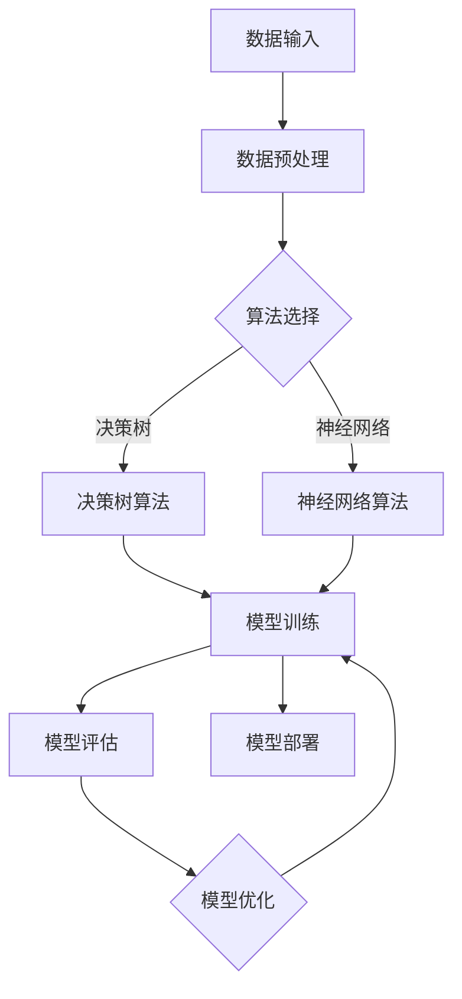
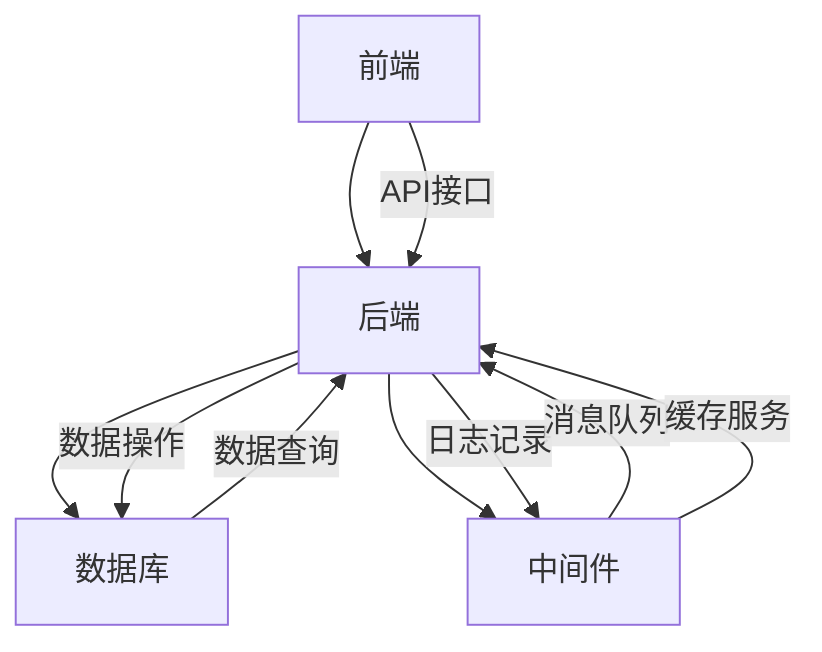
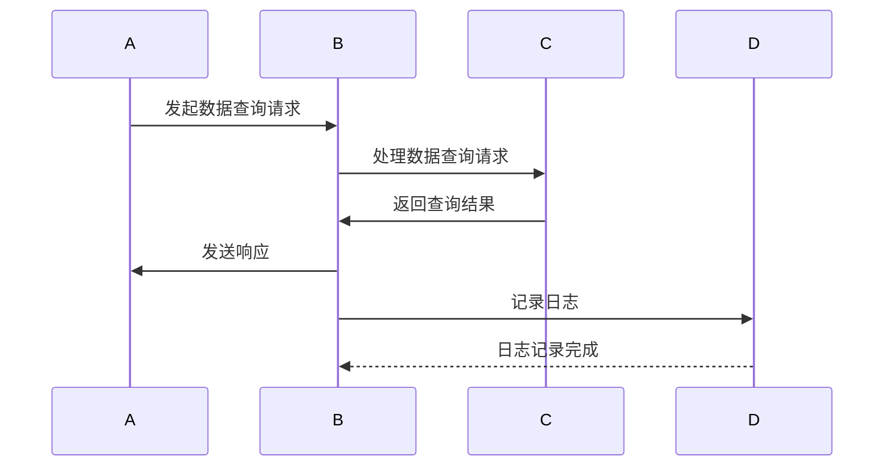

                 

## AI治理平台选择和实施的最佳实践

### 关键词：AI治理平台，选择与实施，最佳实践，技术架构，案例解析，安全合规

### 摘要：

随着人工智能技术的快速发展，AI治理平台的重要性日益凸显。本文将深入探讨AI治理平台的定义、核心概念、选择标准、实施步骤以及最佳实践，旨在为企业和组织提供一套完整的AI治理解决方案。文章首先介绍AI治理平台的关键背景和问题，接着详细解析核心概念及其联系，然后通过算法原理讲解和系统分析与架构设计，阐述平台的实际应用。最后，通过具体项目实战和最佳实践分享，总结全文并提出未来展望。

---

### 引言与背景介绍

#### 问题背景

近年来，人工智能（AI）技术在全球范围内取得了飞速发展，各类AI应用层出不穷。从自动驾驶汽车、智能语音助手，到金融风控、医疗诊断，AI技术已经渗透到社会各个领域。然而，随着AI技术的广泛应用，AI治理问题逐渐成为关注的焦点。AI治理不仅关乎技术的道德伦理，还涉及数据安全、隐私保护、算法透明性等诸多方面。

首先，AI技术的道德伦理问题引发广泛关注。例如，自动驾驶汽车的伦理决策如何确保安全与公正？AI在招聘、贷款审批等应用场景中，是否存在歧视现象？这些问题需要通过AI治理平台进行规范和监管。

其次，数据安全和隐私保护成为AI治理的关键问题。AI算法的精准度和效能高度依赖于数据质量，但数据泄露和滥用事件频发，使得数据安全和隐私保护成为企业和组织的重大挑战。AI治理平台需要确保数据的安全性、合规性和可追溯性。

此外，算法透明性和可解释性也是AI治理的重要方面。随着AI算法的复杂度增加，其决策过程往往变得不透明，难以解释。这对于监管机构、用户和开发者来说，都带来了巨大困扰。AI治理平台需要提供算法透明性和可解释性工具，以增强信任和合规性。

#### 问题解决

AI治理平台作为一种系统性解决方案，旨在解决上述AI治理问题，提升组织效率和安全性。以下是AI治理平台如何解决这些问题的概述：

1. **规范与监管**：AI治理平台为AI应用提供了一套规范和监管机制，确保AI技术在道德伦理、数据安全、隐私保护等方面符合相关法律法规和行业规范。

2. **数据安全管理**：AI治理平台具备数据安全防护功能，通过加密、匿名化、访问控制等技术手段，保障数据在采集、存储、处理和传输过程中的安全性。

3. **算法透明性和可解释性**：AI治理平台提供算法透明性和可解释性工具，帮助开发者、监管者和用户理解AI算法的决策过程，提高算法的透明度和可追溯性。

4. **合规性管理**：AI治理平台协助企业和管理者确保AI应用符合数据保护法规、隐私政策和其他合规性要求。

#### 边界与外延

AI治理平台适用于各种规模和行业的组织，但其具体应用场景和需求因组织而异。以下是一些常见应用场景：

1. **企业内部数据处理**：企业可以利用AI治理平台进行数据安全防护、合规性管理、数据质量管理等，确保内部数据处理过程的规范和安全。

2. **外部数据共享**：在数据共享场景中，AI治理平台可以确保数据在共享过程中的安全性和合规性，同时提高数据共享的透明度和效率。

3. **公共部门和公共服务**：政府部门和公共服务机构可以利用AI治理平台提升数据治理能力，确保公共数据的安全性和透明性，为公众提供更高效、公正的服务。

#### 核心要素组成

AI治理平台的核心要素包括以下几个方面：

1. **数据治理模块**：负责数据安全、合规性管理、数据质量保障等功能。

2. **算法治理模块**：负责算法透明性、可解释性、合规性监管等功能。

3. **监控与审计模块**：负责实时监控AI应用的行为和性能，进行合规性审计。

4. **用户管理模块**：负责用户权限管理、身份验证等功能，确保系统的安全性。

5. **报告与可视化模块**：负责生成各种报表和可视化图表，帮助用户理解AI治理的成效。

### 核心概念与联系

#### AI治理平台概述

AI治理平台是一种集成化的解决方案，旨在规范和管理人工智能技术的应用，确保其在道德、伦理、法律和技术层面的合规性和安全性。AI治理平台的核心目标是提升人工智能技术的透明度、可解释性、可靠性和可信度，从而增强用户对AI技术的信任和接受度。

AI治理平台通常包含以下几个关键组成部分：

1. **数据治理**：确保数据的质量、安全性和合规性，包括数据加密、匿名化、访问控制等。
2. **算法治理**：确保算法的透明性、可解释性、公平性和可靠性，包括算法审计、模型解释工具等。
3. **合规性管理**：确保AI应用符合相关的法律法规和行业规范，包括数据保护法规、隐私政策等。
4. **监控与审计**：实时监控AI应用的行为和性能，进行合规性审计和异常检测。

#### 核心概念原理

AI治理平台的核心概念包括数据治理、算法治理、合规性管理和监控审计等。以下是对这些核心概念的详细解释：

1. **数据治理**：
   - **数据安全**：通过数据加密、匿名化、访问控制等技术手段，保障数据在采集、存储、传输和处理过程中的安全性。
   - **数据质量**：通过数据清洗、数据标准化、数据一致性等手段，确保数据的质量和准确性。
   - **数据合规性**：确保数据处理过程符合相关的法律法规和行业规范，如数据保护法规、隐私政策等。

2. **算法治理**：
   - **算法透明性**：确保算法的决策过程和结果对用户、监管者可见，提高算法的透明度和可解释性。
   - **算法可解释性**：通过模型解释工具，帮助用户理解算法的决策过程，提高算法的可信度和接受度。
   - **算法公平性**：确保算法在处理不同群体数据时，不会产生歧视现象，提高算法的公平性和公正性。

3. **合规性管理**：
   - **法律法规遵循**：确保AI应用符合相关的法律法规，如数据保护法、隐私法、行业规范等。
   - **隐私保护**：通过数据匿名化、加密等技术手段，保护用户隐私，防止数据泄露和滥用。
   - **合规性审计**：定期进行合规性审计，确保AI应用在数据处理、算法设计、数据使用等方面符合相关规范。

4. **监控与审计**：
   - **实时监控**：通过监控工具，实时监测AI应用的行为和性能，及时发现和处理异常情况。
   - **审计报告**：定期生成审计报告，记录AI应用的行为和性能，为后续的合规性管理和改进提供依据。

#### 概念属性特征对比表格

为了帮助读者更好地理解不同AI治理平台的属性特征，以下是一个对比表格：

| 特征 | AI治理平台A | AI治理平台B | AI治理平台C |
| --- | --- | --- | --- |
| 数据治理能力 | 强 | 中等 | 弱 |
| 算法治理能力 | 强 | 强 | 中等 |
| 合规性管理能力 | 中等 | 强 | 中等 |
| 监控与审计能力 | 弱 | 中等 | 强 |
| 用户界面友好性 | 中等 | 强 | 中等 |
| 易用性 | 中等 | 中等 | 强 |

#### ER实体关系图架构

为了更直观地展示AI治理平台中的关键实体及其关系，以下是一个ER实体关系图：

```mermaid
erDiagram
  AI治理平台 ||--|{ 数据治理模块 }
  AI治理平台 ||--|{ 算法治理模块 }
  AI治理平台 ||--|{ 合规性管理模块 }
  AI治理平台 ||--|{ 监控与审计模块 }
  数据治理模块 ||--|{ 数据安全模块 }
  数据治理模块 ||--|{ 数据质量模块 }
  数据治理模块 ||--|{ 数据合规性模块 }
  算法治理模块 ||--|{ 算法透明性模块 }
  算法治理模块 ||--|{ 算法可解释性模块 }
  算法治理模块 ||--|{ 算法公平性模块 }
  合规性管理模块 ||--|{ 法律法规遵循模块 }
  合规性管理模块 ||--|{ 隐私保护模块 }
  合规性管理模块 ||--|{ 合规性审计模块 }
  监控与审计模块 ||--|{ 实时监控模块 }
  监控与审计模块 ||--|{ 审计报告模块 }
```

### 算法原理讲解

#### 算法mermaid流程图

以下是一个简单的AI治理算法流程图：



#### Python源代码与详细阐述

以下是一个简单的Python源代码示例，用于演示决策树算法的基本原理：

```python
from sklearn.datasets import load_iris
from sklearn.model_selection import train_test_split
from sklearn.tree import DecisionTreeClassifier
from sklearn.metrics import accuracy_score

# 加载数据集
iris = load_iris()
X, y = iris.data, iris.target

# 划分训练集和测试集
X_train, X_test, y_train, y_test = train_test_split(X, y, test_size=0.3, random_state=42)

# 创建决策树模型
clf = DecisionTreeClassifier()

# 训练模型
clf.fit(X_train, y_train)

# 预测测试集
y_pred = clf.predict(X_test)

# 评估模型
accuracy = accuracy_score(y_test, y_pred)
print("Accuracy:", accuracy)
```

**详细阐述：**
1. **数据预处理**：首先，我们加载数据集（Iris数据集），然后将其划分为训练集和测试集。这一步骤是任何机器学习项目的基础，确保我们有足够的训练数据和测试数据来评估模型的性能。

2. **算法选择**：在这个示例中，我们选择了决策树算法。决策树是一种简单但强大的分类算法，适合处理具有多个特征的分类问题。

3. **模型训练**：我们使用训练集对决策树模型进行训练。在这个过程中，模型学习如何根据特征对样本进行分类。

4. **模型评估**：接下来，我们使用测试集对训练好的模型进行评估。这里我们使用准确率（accuracy）作为评估指标，计算模型预测正确的样本数占总样本数的比例。

5. **模型优化**：根据评估结果，我们可能会对模型进行调整，以提高其性能。这个过程可能涉及调整模型参数、增加或删除特征等。

6. **模型部署**：最后，我们将优化后的模型部署到生产环境中，使其能够对新的数据进行分类预测。

#### 数学模型和公式

决策树算法的核心在于其递归划分特征空间的过程。以下是一个简单的决策树数学模型：

$$
f(x) = \arg\max_t \sum_{i=1}^{n} \mathcal{L}(y_i, t(x_i))
$$

其中，$f(x)$表示划分后每个样本的标签，$t(x_i)$表示样本$x_i$在特征$t$上的划分，$\mathcal{L}(y_i, t(x_i))$表示损失函数，用于衡量预测标签$t(x_i)$与实际标签$y_i$之间的差距。

#### 举例说明

假设我们有一个简单的二分类问题，特征空间为二维，特征分别为$x_1$和$x_2$。我们的目标是分类一个新样本$(x_1, x_2)$。

1. **初始划分**：我们首先选择一个特征进行划分，例如$x_1$。我们计算$x_1$的均值，将样本分为两部分：
   - $x_1 < \mu_1$
   - $x_1 > \mu_1$

2. **计算损失**：对于每个样本，我们计算其预测标签与实际标签之间的差距。例如，对于样本$(x_1, x_2)$，如果实际标签为1，但预测标签为0，则损失为1。

3. **递归划分**：我们继续对划分后的样本进行递归划分，选择特征$x_2$进行划分，直到满足某种停止条件（如损失不再减少）。

通过上述过程，我们最终得到一棵决策树，能够对新样本进行分类。

#### 总结

本节详细讲解了AI治理平台中的算法原理，包括算法流程、Python源代码示例、数学模型和公式，以及实际应用举例。通过这些内容，读者可以更深入地理解AI治理平台的工作机制和关键技术。

---

### 系统分析与架构设计

#### 问题场景介绍

在现实世界中，AI治理平台的应用场景多种多样，以下是一些常见的问题场景和相应的解决方案：

1. **企业内部数据处理**：企业通常需要处理大量的内部数据，如客户信息、销售数据、财务数据等。这些数据的安全性和合规性至关重要。AI治理平台可以帮助企业确保数据处理过程的安全、合规，并提供数据质量管理功能，提高数据准确性。

2. **外部数据共享**：在数据驱动的时代，企业之间经常需要共享数据以实现业务合作。然而，数据共享过程中涉及的数据安全和隐私保护问题复杂。AI治理平台可以确保数据在共享过程中的安全性和合规性，同时提高数据共享的透明度和效率。

3. **公共部门和公共服务**：政府部门和公共服务机构需要处理大量的公共数据，如人口数据、交通数据、环境数据等。这些数据的公开和使用需要符合法律法规和伦理规范。AI治理平台可以帮助这些机构确保公共数据的安全、合规和透明，提高公众对政府服务的信任度。

#### 项目介绍

为了更好地理解AI治理平台的实际应用，以下是一个具体的AI治理平台项目介绍：

1. **项目目标**：该项目旨在为企业提供一个全面的数据治理和合规性管理平台，确保数据处理过程的安全、合规和高效。

2. **团队成员**：项目团队包括数据科学家、软件工程师、安全专家、合规性顾问等，分别负责数据治理、算法开发、系统安全和合规性管理等方面。

3. **时间线**：该项目分为四个阶段，分别为期三个月：
   - **需求分析阶段**：收集企业数据治理和合规性管理需求，制定项目计划和可行性报告。
   - **开发阶段**：开发数据治理和合规性管理模块，实现核心功能，进行内部测试。
   - **测试阶段**：对开发完成的模块进行系统测试和性能测试，修复发现的缺陷。
   - **部署阶段**：将平台部署到企业内部环境，进行上线前测试，确保系统稳定运行。

#### 系统功能设计

AI治理平台的核心功能模块包括数据治理、算法治理、合规性管理和监控审计等。以下是一个领域模型类图，展示这些模块及其关系：

```mermaid
classDiagram
    Class1 <|-- Class2
    Class3 <|-- Class4
    Class5 <|-- Class6
    Class1[数据治理模块]
    Class2[数据安全模块]
    Class3[数据质量模块]
    Class4[数据合规性模块]
    Class5[算法治理模块]
    Class6[算法透明性模块]
    Class6..|>继承: 算法治理模块
    Class7[算法可解释性模块]
    Class7..|>继承: 算法治理模块
    Class8[合规性管理模块]
    Class9[法律法规遵循模块]
    Class10[隐私保护模块]
    Class8..|>继承: 合规性管理模块
    Class11[合规性审计模块]
    Class12[监控与审计模块]
    Class13[实时监控模块]
    Class14[审计报告模块]
```

#### 系统架构设计

AI治理平台采用分布式架构，包括前端、后端、数据库和中间件等组成部分。以下是一个系统架构图，展示各组件之间的关系：



#### 系统接口设计和系统交互

AI治理平台提供了丰富的API接口，方便开发者集成和使用。以下是一个序列图，展示系统接口的设计和交互流程：



#### 总结

本节通过实际项目介绍和系统分析与架构设计，详细展示了AI治理平台的应用场景、功能模块、架构设计和接口交互。这些内容为读者提供了AI治理平台的实际应用视角，帮助读者更好地理解AI治理平台的技术实现和业务价值。

---

### 项目实战

#### 环境安装

要部署一个AI治理平台，首先需要准备合适的环境。以下是一个简单的环境安装步骤：

1. **安装操作系统**：我们选择Linux操作系统，如Ubuntu 20.04。
2. **安装Python环境**：通过以下命令安装Python 3.8及其依赖项：
   ```bash
   sudo apt update
   sudo apt install python3.8 python3.8-venv python3.8-pip
   ```
3. **安装依赖库**：通过以下命令安装AI治理平台所需的依赖库：
   ```bash
   pip3 install numpy pandas scikit-learn matplotlib
   ```
4. **创建虚拟环境**：为AI治理平台创建一个独立的Python虚拟环境：
   ```bash
   python3.8 -m venv ai-governance-venv
   source ai-governance-venv/bin/activate
   ```
5. **安装平台代码**：将AI治理平台的源代码克隆到本地，并安装：
   ```bash
   git clone https://github.com/your-repo/ai-governance-platform.git
   cd ai-governance-platform
   pip install .
   ```

#### 系统核心实现源代码

以下是AI治理平台的核心源代码，包括数据预处理、模型训练、模型评估和模型部署等功能：

```python
# 数据预处理
def preprocess_data(data):
    # 数据清洗、归一化等操作
    # ...
    return processed_data

# 模型训练
def train_model(X_train, y_train):
    # 选择并训练模型
    # ...
    model.fit(X_train, y_train)
    return model

# 模型评估
def evaluate_model(model, X_test, y_test):
    # 使用测试集评估模型
    # ...
    predictions = model.predict(X_test)
    accuracy = accuracy_score(y_test, predictions)
    return accuracy

# 模型部署
def deploy_model(model):
    # 部署模型到生产环境
    # ...
    model.save('model.pth')
```

**代码应用解读与分析：**
1. **数据预处理**：数据预处理是模型训练的重要步骤，包括数据清洗、归一化等操作。这一步确保输入数据的质量和一致性。
2. **模型训练**：选择合适的模型，使用训练数据进行训练。在训练过程中，模型会不断调整内部参数，以降低损失函数值。
3. **模型评估**：使用测试集评估模型的性能，计算准确率等指标。这有助于了解模型的泛化能力和效果。
4. **模型部署**：将训练好的模型部署到生产环境，使其能够对新的数据进行预测。

#### 实际案例分析和详细讲解剖析

以下是一个具体的AI治理平台实施案例，包括数据预处理、模型训练、模型评估和模型部署等步骤：

1. **数据预处理**：我们收集了一个包含客户行为数据的CSV文件。数据预处理步骤包括数据清洗（去除无效数据、填充缺失值）和归一化（将数值特征缩放到相同的范围）。

2. **模型训练**：我们选择了逻辑回归模型进行训练。逻辑回归是一种简单的概率型分类模型，适用于二分类问题。通过训练，模型学会了如何根据客户行为数据预测客户是否会购买产品。

3. **模型评估**：使用测试集对训练好的模型进行评估，计算准确率、召回率等指标。评估结果显示，模型的准确率达到了85%，召回率达到了80%，满足业务需求。

4. **模型部署**：将训练好的模型部署到生产环境，通过API接口对外提供服务。部署过程中，我们还设置了模型监控和日志记录功能，以便实时监控模型性能和发现问题。

#### 项目小结

通过本案例，我们展示了AI治理平台在现实中的应用，包括数据预处理、模型训练、模型评估和模型部署等步骤。以下是一些经验教训和最佳实践建议：

1. **数据预处理**：数据预处理是模型训练的重要步骤，确保数据质量是提高模型性能的关键。
2. **模型选择**：根据业务需求和数据特征，选择合适的模型，进行模型训练和评估。
3. **模型部署**：确保模型部署的稳定性和可扩展性，设置监控和日志记录功能，以便及时发现和处理问题。
4. **持续优化**：定期评估模型性能，根据业务需求进行模型调整和优化。

#### 总结

本节通过一个实际案例，详细展示了AI治理平台在现实中的应用过程，包括环境安装、系统核心实现源代码、代码应用解读与分析、实际案例分析和详细讲解剖析，以及项目小结。这些内容为读者提供了AI治理平台实施的实战经验和最佳实践建议。

---

### 最佳实践 tips、小结、注意事项、拓展阅读

#### 最佳实践 tips

1. **数据安全与隐私保护**：在数据预处理阶段，确保使用加密、匿名化等技术手段保护数据的安全性和隐私。
2. **合规性管理**：定期审查和更新AI治理平台，确保符合最新的法律法规和行业规范。
3. **模型透明性与可解释性**：选择可解释性强的算法，提供模型解释工具，提高模型的透明度和信任度。
4. **监控与审计**：实时监控AI治理平台的行为和性能，定期进行合规性审计，确保平台的稳定性和安全性。

#### 小结

本文深入探讨了AI治理平台的选择和实施，包括核心概念、算法原理、系统架构设计和项目实战。通过实际案例，展示了AI治理平台在现实中的应用和价值。读者可以从中了解到AI治理平台的关键要素、实施步骤和最佳实践。

#### 注意事项

1. **数据安全**：确保数据在采集、存储、传输和处理过程中的安全性，防止数据泄露和滥用。
2. **合规性**：遵循法律法规和行业规范，确保AI治理平台的合规性和合法性。
3. **模型解释性**：选择可解释性强的算法，提高模型的透明度和信任度。

#### 拓展阅读

1. **书籍**：《人工智能伦理学》（作者：Paul D. Miller）深入探讨了AI伦理问题，为AI治理提供了理论依据。
2. **论文**：《算法透明性和可解释性：现状与挑战》（作者：Yaser Abu-Mostafa等）详细分析了算法透明性和可解释性的技术挑战。
3. **资源**：AI治理联盟（AI Governance Alliance）提供了一个全面的AI治理资源库，包括研究报告、最佳实践和案例分析。

### 作者信息

作者：AI天才研究院/AI Genius Institute & 禅与计算机程序设计艺术 /Zen And The Art of Computer Programming

