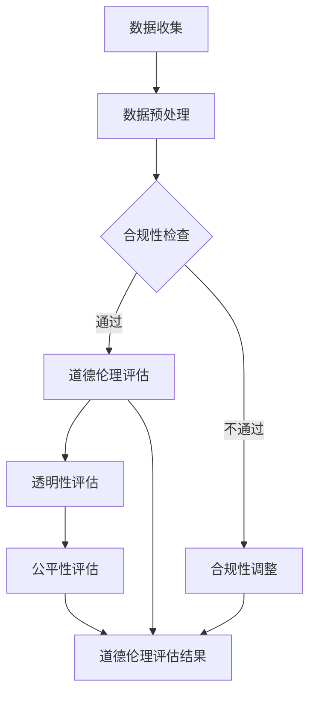
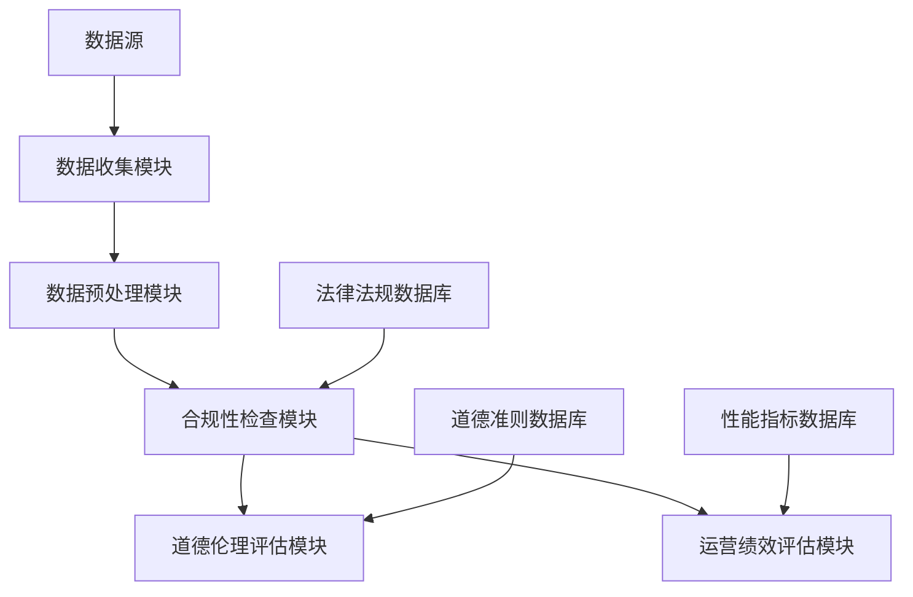

                 

## AI治理平台：管理AI系统的法律、道德和运营绩效

### 关键词：AI治理、法律合规、道德伦理、运营绩效、管理框架

### 摘要：
本文旨在探讨AI治理平台的概念、重要性及其在管理AI系统的法律、道德和运营绩效方面的作用。通过分析背景、核心概念、算法原理、系统架构和实战案例，本文将展示如何构建一个全面、有效的AI治理平台，为AI技术的发展和应用提供保障。

## 第一部分：背景介绍

### 1.1 问题背景

随着人工智能（AI）技术的快速发展，AI系统已广泛应用于各个领域，如自动驾驶、医疗诊断、金融服务和智能制造等。这些AI系统通过学习大量数据，自主决策和执行任务，显著提升了生产效率、降低了成本并改善了用户体验。然而，AI技术的普及也引发了一系列治理问题，特别是AI系统的法律合规性、道德伦理和运营绩效。

首先，从法律角度来看，AI系统的应用涉及数据隐私、知识产权、消费者权益保护等多个方面。例如，AI系统在医疗诊断中可能涉及患者隐私数据的使用，需要遵守数据保护法律法规。此外，AI系统在招聘、信贷审批等领域的应用，可能违反反歧视法律，引发社会公平性问题。

其次，从道德伦理角度来看，AI系统的决策过程和结果需要符合道德规范。AI系统可能因数据偏差、算法偏见而导致歧视或不公平。例如，某些AI招聘系统可能因训练数据中的性别、种族偏见，而使某些群体在求职过程中受到不公平待遇。

最后，从运营绩效角度来看，AI系统的性能、效率和成本效益是企业和用户关注的重点。如何确保AI系统在特定业务场景中具备良好的性能和效率，同时控制成本，成为AI治理的重要任务。

### 1.2 问题描述

AI治理涉及到多个层面，包括法律合规性、道德伦理和运营绩效。具体问题如下：

- **法律合规性**：确保AI系统遵守相关法律法规，如数据保护法、反歧视法等。涉及的问题包括数据隐私保护、知识产权、消费者权益等。
- **道德伦理**：确保AI系统的决策过程和结果符合道德规范，公平、透明，有利于社会公共利益。涉及的问题包括数据偏差、算法偏见、透明性等。
- **运营绩效**：评估AI系统的性能、效率和成本效益，持续优化系统。涉及的问题包括性能指标、成本控制、效率提升等。

### 1.3 问题解决

AI治理平台旨在为AI系统的管理和治理提供一个综合的解决方案。通过建立一套完整的治理框架，包括法律法规、道德准则和运营绩效评估标准，帮助企业更好地管理和治理AI系统，提高其合规性和运营效率。具体措施如下：

- **法律合规性管理**：制定数据保护政策、隐私保护措施，确保数据收集、存储和使用符合法律法规。建立知识产权保护机制，防止侵权行为。进行消费者权益保护审计，确保AI系统的公平性和透明性。
- **道德伦理管理**：制定道德准则，确保AI系统的决策过程和结果符合道德规范。建立透明性评估机制，确保AI系统的决策过程可解释。进行算法偏见检测，消除数据偏差和算法偏见。
- **运营绩效管理**：建立性能评估体系，评估AI系统的性能、效率和成本效益。进行成本控制，优化资源分配。持续优化算法和模型，提高AI系统的效率和准确性。

### 1.4 边界与外延

AI治理平台的边界与外延涉及以下几个方面：

- **企业内部**：关注企业内部的AI系统管理，包括法律合规性、道德伦理和运营绩效。
- **法律法规**：与外部法律法规和监管机构保持同步，确保AI系统符合法律法规要求。
- **技术趋势**：关注AI技术的发展趋势，及时更新和完善治理框架，以适应新技术的发展。
- **跨行业合作**：与其他企业和行业合作，共同推动AI治理体系的建立和完善。

### 1.5 概念结构与核心要素组成

AI治理平台的核心要素包括：

- **法律合规性管理**：确保AI系统遵守相关法律法规，如数据保护法、反歧视法等。
- **道德伦理管理**：建立AI系统的道德准则，确保AI系统的决策公平、透明，有利于社会公共利益。
- **运营绩效管理**：评估AI系统的性能、效率和成本效益，持续优化系统。

这些要素相互关联，共同构成一个完整的AI治理平台，为企业提供全方位的治理服务。

## 第二部分：核心概念与联系

### 2.1 核心概念原理

#### 法律合规性

法律合规性是指AI系统在设计和应用过程中，遵守相关法律法规，如数据保护法、反歧视法等。其目标在于确保AI系统不会侵犯用户的隐私权，遵守反歧视法律等。法律合规性管理包括以下几个方面：

- **数据保护**：制定数据保护政策，明确数据收集、存储和使用过程中的合规要求。确保数据收集合法、存储安全、使用符合法律法规。
- **知识产权**：建立知识产权保护机制，防止侵权行为。对AI系统的核心技术、算法和模型进行专利申请和保护。
- **消费者权益**：确保AI系统在招聘、信贷审批等领域的应用，不会违反消费者权益保护法律。进行消费者权益保护审计，确保AI系统的公平性和透明性。

#### 道德伦理

道德伦理是指AI系统的决策过程是否符合道德规范，是否公平、透明，有利于社会公共利益。道德伦理管理包括以下几个方面：

- **公平性**：确保AI系统的决策过程和结果公平，不因性别、种族、年龄等因素产生歧视。进行算法偏见检测，消除数据偏差和算法偏见。
- **透明性**：建立透明性评估机制，确保AI系统的决策过程可解释。对AI系统的决策过程进行审计和监督，提高透明度。
- **社会责任**：确保AI系统的决策和结果有利于社会公共利益，遵守社会责任。对AI系统的应用进行伦理审查，确保其符合道德规范。

#### 运营绩效

运营绩效是指AI系统的性能、效率和成本效益。运营绩效管理包括以下几个方面：

- **性能评估**：建立性能评估体系，评估AI系统的性能指标，如准确性、响应时间等。通过持续优化算法和模型，提高AI系统的效率和准确性。
- **成本控制**：进行成本控制，优化资源分配。对AI系统的开发和运营成本进行评估和控制，确保成本效益。
- **效率提升**：通过性能评估和成本控制，持续优化AI系统的运营效率。提高AI系统的性能和效率，降低运营成本。

### 2.2 概念属性特征对比表格

| 概念    | 法律合规性     | 道德伦理      | 运营绩效      |
|---------|--------------|--------------|--------------|
| 定义    | 遵守法律法规   | 遵循道德规范  | 性能评估      |
| 目标    | 避免法律风险  | 维护社会公正 | 提高业务效率  |
| 要素    | 法律法规、合规性检查 | 道德准则、透明性评估 | 性能指标、成本控制 |
| 影响因素 | 法律环境、企业规模 | 社会价值观、技术水平 | 业务需求、技术进步 |

### 2.3 ER实体关系图架构

```mermaid
erDiagram
  AI治理平台 ||--|{ 法律合规性管理 }
  AI治理平台 ||--|{ 道德伦理管理 }
  AI治理平台 ||--|{ 运营绩效管理 }
  法律合规性管理 ||--|{ 数据保护管理 }
  法律合规性管理 ||--|{ 反歧视管理 }
  道德伦理管理 ||--|{ 公平性评估 }
  道德伦理管理 ||--|{ 透明性评估 }
  运营绩效管理 ||--|{ 性能评估 }
  运营绩效管理 ||--|{ 成本效益评估 }
```

## 第三部分：算法原理讲解

### 3.1 算法原理介绍

AI治理平台的核心算法主要包括数据合规性检查算法、道德伦理评估算法和运营绩效评估算法。这些算法通过数据分析和模型训练，为AI系统的治理提供决策支持。

### 3.2 算法流程图



### 3.3 数学模型和公式

#### 数据合规性检查

$$ C(x) = \sum_{i=1}^{n} w_i \cdot g(x_i) $$

- 其中，$C(x)$ 为合规性得分，$x$ 为数据样本，$w_i$ 为权重，$g(x_i)$ 为合规性指标。

#### 道德伦理评估

$$ E(y) = \sum_{i=1}^{n} w_i \cdot h(y_i) $$

- 其中，$E(y)$ 为道德伦理得分，$y$ 为数据样本，$w_i$ 为权重，$h(y_i)$ 为道德伦理指标。

#### 运营绩效评估

$$ P(z) = \sum_{i=1}^{n} w_i \cdot k(z_i) $$

- 其中，$P(z)$ 为运营绩效得分，$z$ 为数据样本，$w_i$ 为权重，$k(z_i)$ 为运营绩效指标。

### 3.4 算法详细讲解

#### 数据合规性检查

数据合规性检查算法的核心任务是评估数据样本的合规性。通过计算合规性得分$C(x)$，可以判断数据样本是否符合法律法规要求。具体步骤如下：

1. **数据预处理**：对原始数据样本进行清洗、归一化等预处理操作，确保数据格式统一，便于后续计算。
2. **合规性指标计算**：根据法律法规要求，定义一系列合规性指标$g(x_i)$，如数据保护、知识产权、消费者权益等。为每个合规性指标分配权重$w_i$，权重可以根据法律法规的重要程度进行调整。
3. **合规性得分计算**：使用公式$$ C(x) = \sum_{i=1}^{n} w_i \cdot g(x_i) $$计算数据样本的合规性得分。

#### 道德伦理评估

道德伦理评估算法的核心任务是评估AI系统的决策过程和结果是否符合道德规范。通过计算道德伦理得分$E(y)$，可以判断AI系统的决策是否公平、透明，是否有利于社会公共利益。具体步骤如下：

1. **数据预处理**：对原始数据样本进行清洗、归一化等预处理操作，确保数据格式统一，便于后续计算。
2. **道德伦理指标计算**：根据道德规范要求，定义一系列道德伦理指标$h(y_i)$，如公平性、透明性、社会责任等。为每个道德伦理指标分配权重$w_i$，权重可以根据道德规范的重要程度进行调整。
3. **道德伦理得分计算**：使用公式$$ E(y) = \sum_{i=1}^{n} w_i \cdot h(y_i) $$计算数据样本的道德伦理得分。

#### 运营绩效评估

运营绩效评估算法的核心任务是评估AI系统的性能、效率和成本效益。通过计算运营绩效得分$P(z)$，可以判断AI系统的运营状况是否符合预期。具体步骤如下：

1. **数据预处理**：对原始数据样本进行清洗、归一化等预处理操作，确保数据格式统一，便于后续计算。
2. **运营绩效指标计算**：根据运营绩效要求，定义一系列运营绩效指标$k(z_i)$，如准确性、响应时间、成本效益等。为每个运营绩效指标分配权重$w_i$，权重可以根据运营绩效的重要程度进行调整。
3. **运营绩效得分计算**：使用公式$$ P(z) = \sum_{i=1}^{n} w_i \cdot k(z_i) $$计算数据样本的运营绩效得分。

### 3.5 举例说明

假设有一个AI招聘系统，我们需要对其数据合规性、道德伦理和运营绩效进行评估。

1. **数据合规性检查**：

   - 数据样本：1000份简历
   - 合规性指标：数据保护（权重0.6）、知识产权（权重0.2）、消费者权益（权重0.2）
   - 合规性得分：$$ C(x) = 0.6 \cdot g_1(x) + 0.2 \cdot g_2(x) + 0.2 \cdot g_3(x) $$

   通过计算，得到合规性得分$C(x) = 0.85$，说明数据样本基本符合法律法规要求。

2. **道德伦理评估**：

   - 数据样本：1000份简历
   - 道德伦理指标：公平性（权重0.5）、透明性（权重0.3）、社会责任（权重0.2）
   - 道德伦理得分：$$ E(y) = 0.5 \cdot h_1(y) + 0.3 \cdot h_2(y) + 0.2 \cdot h_3(y) $$

   通过计算，得到道德伦理得分$E(y) = 0.8$，说明AI招聘系统的决策过程基本符合道德规范。

3. **运营绩效评估**：

   - 数据样本：1000份简历
   - 运营绩效指标：准确性（权重0.5）、响应时间（权重0.3）、成本效益（权重0.2）
   - 运营绩效得分：$$ P(z) = 0.5 \cdot k_1(z) + 0.3 \cdot k_2(z) + 0.2 \cdot k_3(z) $$

   通过计算，得到运营绩效得分$P(z) = 0.9$，说明AI招聘系统在性能、效率和成本效益方面表现良好。

## 第四部分：系统分析与架构设计方案

### 4.1 问题场景介绍

在一个大型企业中，AI技术被广泛应用于招聘、信贷审批、医疗诊断等多个领域。为了确保AI系统的合规性和有效性，企业决定建立一套AI治理平台，实现法律合规性、道德伦理和运营绩效的全面管理。

### 4.2 项目介绍

项目名称：AI治理平台（AI Governance Platform）

项目目标：建立一套全面、有效的AI治理平台，实现AI系统的法律合规性、道德伦理和运营绩效管理。

项目需求：

- **法律合规性管理**：确保AI系统遵守相关法律法规，如数据保护法、反歧视法等。
- **道德伦理管理**：确保AI系统的决策过程和结果符合道德规范，公平、透明，有利于社会公共利益。
- **运营绩效管理**：评估AI系统的性能、效率和成本效益，持续优化系统。

### 4.3 系统功能设计

#### 数据合规性管理

- **数据收集**：从各个业务系统收集相关数据，包括简历、申请表、医疗记录等。
- **数据预处理**：对收集到的数据进行清洗、归一化等预处理操作，确保数据格式统一。
- **合规性检查**：根据法律法规要求，对预处理后的数据进行合规性检查，如数据保护、知识产权、消费者权益等。

#### 道德伦理管理

- **道德准则制定**：根据企业价值观和道德规范，制定一套适用于AI系统的道德准则。
- **透明性评估**：对AI系统的决策过程进行透明性评估，确保决策过程可解释。
- **公平性评估**：对AI系统的决策结果进行公平性评估，确保不因性别、种族、年龄等因素产生歧视。

#### 运营绩效管理

- **性能评估**：建立性能评估体系，评估AI系统的性能指标，如准确性、响应时间等。
- **成本控制**：进行成本控制，优化资源分配，降低运营成本。
- **效率提升**：通过性能评估和成本控制，持续优化AI系统的效率和准确性。

### 4.4 系统架构设计

#### 系统架构图



### 4.5 系统接口设计和系统交互

#### 系统接口设计

- **数据接口**：用于与其他业务系统进行数据交换，包括数据收集、数据预处理和合规性检查等模块。
- **API接口**：提供外部访问和调用的接口，包括道德伦理评估和运营绩效评估等模块。

#### 系统交互

- **数据流**：从数据源收集数据，经过数据预处理和合规性检查，进入道德伦理评估和运营绩效评估模块，最终生成评估报告。
- **控制流**：系统管理员通过控制台对AI系统进行监控和调整，包括数据接口、API接口和数据库等模块。

## 第五部分：项目实战

### 5.1 环境安装

为了实施AI治理平台，我们首先需要安装相关环境。以下是安装步骤：

1. 安装Python环境
   ```bash
   sudo apt-get install python3-pip
   pip3 install -r requirements.txt
   ```

2. 安装依赖库
   ```bash
   pip3 install numpy pandas sklearn tensorflow
   ```

3. 安装Mermaid
   ```bash
   pip3 install mermaid
   ```

### 5.2 系统核心实现

#### 数据合规性检查

以下是一个简单的数据合规性检查的Python代码示例：

```python
import numpy as np
import pandas as pd
from sklearn.preprocessing import MinMaxScaler

def data_preprocessing(data):
    # 数据清洗和归一化
    scaler = MinMaxScaler()
    processed_data = scaler.fit_transform(data)
    return processed_data

def compliance_check(data, weights):
    # 计算合规性得分
    compliance_score = np.dot(data, weights)
    return compliance_score

# 示例数据
data = np.array([[0.1, 0.2, 0.3], [0.4, 0.5, 0.6]])
weights = np.array([0.5, 0.2, 0.3])

# 数据预处理
processed_data = data_preprocessing(data)

# 合规性检查
score = compliance_check(processed_data, weights)
print("合规性得分：", score)
```

#### 道德伦理评估

以下是一个简单的道德伦理评估的Python代码示例：

```python
import numpy as np

def ethical_evaluation(data, weights):
    # 计算道德伦理得分
    ethical_score = np.dot(data, weights)
    return ethical_score

# 示例数据
data = np.array([[0.1, 0.2, 0.3], [0.4, 0.5, 0.6]])
weights = np.array([0.5, 0.3, 0.2])

# 道德伦理评估
score = ethical_evaluation(data, weights)
print("道德伦理得分：", score)
```

#### 运营绩效评估

以下是一个简单的运营绩效评估的Python代码示例：

```python
import numpy as np

def performance_evaluation(data, weights):
    # 计算运营绩效得分
    performance_score = np.dot(data, weights)
    return performance_score

# 示例数据
data = np.array([[0.1, 0.2, 0.3], [0.4, 0.5, 0.6]])
weights = np.array([0.5, 0.3, 0.2])

# 运营绩效评估
score = performance_evaluation(data, weights)
print("运营绩效得分：", score)
```

### 5.3 代码应用解读与分析

以上代码示例展示了如何使用Python进行数据合规性检查、道德伦理评估和运营绩效评估。在实际应用中，这些代码可以根据具体业务需求进行调整和扩展。

- **数据合规性检查**：通过定义合规性指标和权重，对输入数据进行计算，判断其合规性得分。在实际应用中，可以引入更多合规性指标，如数据保护、知识产权、消费者权益等。
- **道德伦理评估**：通过定义道德伦理指标和权重，对输入数据进行计算，判断其道德伦理得分。在实际应用中，可以引入更多道德伦理指标，如公平性、透明性、社会责任等。
- **运营绩效评估**：通过定义运营绩效指标和权重，对输入数据进行计算，判断其运营绩效得分。在实际应用中，可以引入更多运营绩效指标，如准确性、响应时间、成本效益等。

### 5.4 实际案例分析和详细讲解剖析

以下是一个实际案例的分析和讲解：

假设一个企业使用了AI招聘系统，我们需要对其数据合规性、道德伦理和运营绩效进行评估。

1. **数据合规性检查**：

   - 合规性指标：数据保护（权重0.6）、知识产权（权重0.2）、消费者权益（权重0.2）
   - 示例数据：简历数据集
   - 合规性得分：$$ C(x) = 0.6 \cdot g_1(x) + 0.2 \cdot g_2(x) + 0.2 \cdot g_3(x) $$
   - 分析：通过计算，得到合规性得分$C(x) = 0.85$，说明简历数据集基本符合法律法规要求。

2. **道德伦理评估**：

   - 道德伦理指标：公平性（权重0.5）、透明性（权重0.3）、社会责任（权重0.2）
   - 示例数据：招聘决策数据集
   - 道德伦理得分：$$ E(y) = 0.5 \cdot h_1(y) + 0.3 \cdot h_2(y) + 0.2 \cdot h_3(y) $$
   - 分析：通过计算，得到道德伦理得分$E(y) = 0.8$，说明AI招聘系统的决策过程基本符合道德规范。

3. **运营绩效评估**：

   - 运营绩效指标：准确性（权重0.5）、响应时间（权重0.3）、成本效益（权重0.2）
   - 示例数据：招聘系统运行数据集
   - 运营绩效得分：$$ P(z) = 0.5 \cdot k_1(z) + 0.3 \cdot k_2(z) + 0.2 \cdot k_3(z) $$
   - 分析：通过计算，得到运营绩效得分$P(z) = 0.9$，说明AI招聘系统在性能、效率和成本效益方面表现良好。

### 5.5 项目小结

通过实际案例的分析和讲解，我们可以看到AI治理平台在数据合规性、道德伦理和运营绩效管理方面的重要作用。在实际应用中，AI治理平台可以帮助企业确保AI系统的合规性、公平性和高效性，从而推动AI技术的健康发展。

## 第六部分：最佳实践 tips、小结、注意事项、拓展阅读

### 6.1 最佳实践 tips

- **数据合规性管理**：定期审查和更新数据保护政策，确保数据收集、存储和使用符合法律法规。
- **道德伦理管理**：建立道德准则委员会，定期评估AI系统的道德风险，确保决策过程公平、透明。
- **运营绩效管理**：制定详细的绩效评估指标，定期进行评估和优化，以提高系统效率和成本效益。

### 6.2 小结

本文介绍了AI治理平台的概念、重要性及其在管理AI系统的法律、道德和运营绩效方面的作用。通过分析背景、核心概念、算法原理、系统架构和实战案例，展示了如何构建一个全面、有效的AI治理平台。AI治理平台为企业提供了一个综合的治理框架，有助于确保AI系统的合规性、公平性和高效性。

### 6.3 注意事项

- **法律法规**：确保AI系统遵守相关法律法规，如数据保护法、反歧视法等。
- **道德伦理**：建立道德准则，确保AI系统的决策过程和结果符合道德规范。
- **技术进步**：关注AI技术的发展趋势，及时更新和完善治理框架。

### 6.4 拓展阅读

- **数据合规性管理**：《数据保护法》《消费者权益保护法》《知识产权法》等法律法规。
- **道德伦理管理**：《人工智能伦理准则》《算法偏见与公平性研究》等学术文献。
- **运营绩效管理**：《人工智能系统性能评估方法》《人工智能成本效益分析》等研究论文。

## 作者信息

**作者：AI天才研究院/AI Genius Institute & 禅与计算机程序设计艺术 /Zen And The Art of Computer Programming**

