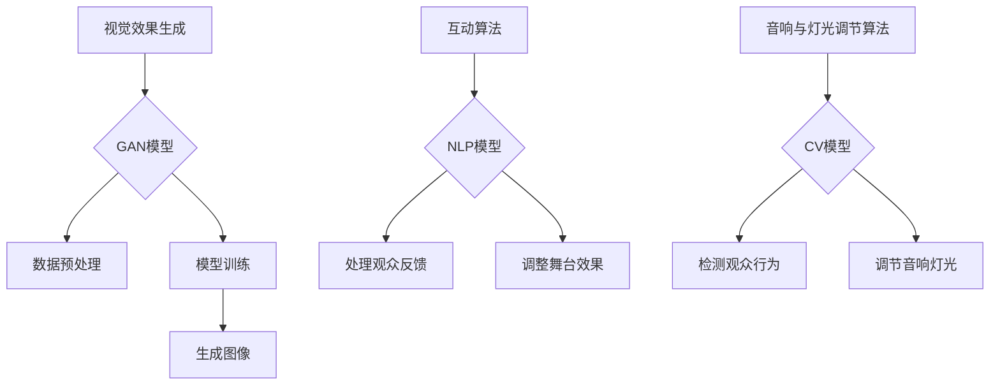

                 

# AI辅助创意舞台设计：沉浸式多媒体整合的提示词技巧

> 关键词：AI、舞台设计、沉浸式体验、多媒体整合、提示词技巧

> 摘要：本文旨在探讨AI技术在创意舞台设计中的应用，特别是沉浸式多媒体整合的提示词技巧。文章首先概述了AI辅助舞台设计的背景和核心概念，然后详细解析了沉浸式多媒体的基础知识、提示词技巧及其应用，接着介绍了AI在舞台设计中的应用工具和方法，并通过实际项目案例进行了详细分析，最后总结了最佳实践和未来展望。

## 目录大纲

----------------------------------------------------------------

## 第一部分: AI辅助创意舞台设计概述

### 第1章: 问题背景与概述

#### 1.1 人工智能在舞台设计中的应用现状

#### 1.2 AI辅助舞台设计的核心概念

#### 1.3 舞台设计中的AI应用领域

#### 1.4 书籍结构安排与目标读者

## 第2章: 沉浸式多媒体基础

### 2.1 沉浸式体验的原理与分类

### 2.2 多媒体整合的要素与技巧

### 2.3 案例分析：沉浸式多媒体在舞台设计中的应用

## 第3章: 提示词技巧详解

### 3.1 提示词的类型与应用

### 3.2 提示词的生成与优化

### 3.3 提示词技巧的实际案例

## 第4章: AI辅助创意舞台设计的工具与方法

### 4.1 AI在舞台设计中的应用工具

### 4.2 创意舞台设计的AI方法

### 4.3 AI辅助舞台设计的案例分析

## 第5章: AI辅助舞台设计的项目实战

### 5.1 实战项目背景与目标

### 5.2 系统设计与实现

### 5.3 核心算法与实现

### 5.4 实战过程与经验总结

## 第6章: AI辅助舞台设计最佳实践

### 6.1 AI辅助舞台设计的最佳实践

### 6.2 注意事项与风险防范

### 6.3 拓展阅读

## 第7章: 未来展望与趋势

### 7.1 AI辅助舞台设计的未来趋势

### 7.2 AI辅助舞台设计的创新案例

----------------------------------------------------------------## 第1章: 问题背景与概述

### 1.1 人工智能在舞台设计中的应用现状

随着人工智能（AI）技术的快速发展，其在各个领域的应用日益广泛。舞台设计作为一个创意性极强的领域，也开始逐渐引入AI技术。目前，AI在舞台设计中的应用主要体现在以下几个方面：

1. **视觉效果与动态场景设计**：利用AI算法生成动态灯光效果、特效图像和动画，增强舞台视觉效果。
2. **音响与灯光控制**：利用AI算法实现灯光和音响的自动调节，以适应不同场景和观众的反馈。
3. **舞台布景与道具设计**：利用AI进行三维建模和渲染，快速生成布景和道具的设计方案。
4. **观众互动**：利用AI分析观众的行为数据，实现舞台表演与观众的互动。

### 1.2 AI辅助舞台设计的核心概念

#### 1.2.1 AI在创意中的角色

在创意舞台设计中，AI不仅是一个工具，更是一个合作伙伴。它可以通过分析大量数据，提供创意灵感和设计方向，帮助设计师打破思维定式，实现更多创新。

#### 1.2.2 沉浸式多媒体与AI的融合

沉浸式多媒体是一种通过视觉、听觉等多感官刺激，使观众完全沉浸在虚拟环境中的技术。AI在沉浸式多媒体中的融合，主要体现在以下几个方面：

- **内容生成**：利用AI生成符合主题的图像、音频和视频内容。
- **动态调节**：根据观众的行为和反馈，动态调整多媒体内容，提高观众的沉浸感。
- **个性化体验**：根据观众的历史行为和偏好，提供个性化的多媒体内容。

#### 1.2.3 提示词技巧的定义与作用

提示词技巧是指通过特定的关键词或短语，引导AI生成创意内容的一种方法。在舞台设计中，提示词技巧可以用于：

- **主题设定**：为舞台设计提供明确的创意方向。
- **内容生成**：指导AI生成符合主题的图像、音频和视频内容。
- **效果优化**：通过调整提示词，优化舞台视觉效果和观众体验。

### 1.3 舞台设计中的AI应用领域

舞台设计中的AI应用非常广泛，以下是一些主要的领域：

#### 1.3.1 舞台视觉效果与动态场景设计

- **动态灯光效果**：利用AI算法生成动态灯光效果，增强舞台视觉效果。
- **特效图像与动画**：通过AI生成独特的特效图像和动画，丰富舞台表演。

#### 1.3.2 舞台音响与灯光控制

- **自动调节**：利用AI算法实现灯光和音响的自动调节，以适应不同场景和观众的反馈。
- **实时反馈**：根据观众的反馈，实时调整音响和灯光效果。

#### 1.3.3 舞台布景与道具设计

- **三维建模与渲染**：利用AI进行三维建模和渲染，快速生成布景和道具的设计方案。
- **自动化生成**：通过AI自动化生成复杂的布景和道具，节省时间和成本。

### 1.4 书籍结构安排与目标读者

本书的结构安排如下：

- **第1章**：介绍AI辅助舞台设计的背景和核心概念。
- **第2章**：讲解沉浸式多媒体的基础知识。
- **第3章**：解析提示词技巧及其应用。
- **第4章**：介绍AI在舞台设计中的应用工具和方法。
- **第5章**：通过实际项目案例进行详细分析。
- **第6章**：总结AI辅助舞台设计的最佳实践。
- **第7章**：展望AI辅助舞台设计的未来趋势。

本书的目标读者包括：

- **舞台设计师**：希望通过AI技术提高设计效率和创新能力的专业人士。
- **多媒体工程师**：希望了解AI技术在多媒体整合中应用的工程师。
- **创意行业从业者**：对AI辅助创意设计感兴趣的相关从业者。
- **学术研究人员**：关注AI在舞台设计中的应用的学术研究人员。

通过本书的阅读，读者可以系统地了解AI辅助舞台设计的基本概念、应用方法和实践技巧，为未来的工作提供指导。接下来，我们将深入探讨沉浸式多媒体的基础知识，为后续章节的内容打下坚实的基础。### 第2章: 沉浸式多媒体基础

### 2.1 沉浸式体验的原理与分类

#### 2.1.1 沉浸式体验的定义

沉浸式体验是一种通过视觉、听觉、触觉等多感官刺激，使参与者完全沉浸在虚拟环境中的体验方式。其核心在于打破现实与虚拟的界限，使参与者能够全身心地投入到体验过程中。

#### 2.1.2 沉浸式体验的技术分类

沉浸式体验技术可以分为以下几类：

1. **虚拟现实（VR）**：通过头戴式显示器和传感器，模拟出一个三维虚拟环境，使参与者能够自由移动和互动。
2. **增强现实（AR）**：将虚拟元素叠加在现实世界中，通过手机或平板电脑等设备展示，增强现实体验。
3. **混合现实（MR）**：结合VR和AR的特点，提供更加丰富的交互体验。
4. **多感官融合**：利用多种感官刺激，如声音、气味、触觉等，增强沉浸感。

#### 2.1.3 沉浸式体验在不同领域的应用

沉浸式体验技术已在多个领域得到广泛应用：

1. **娱乐**：游戏、电影、演唱会等，通过VR/AR技术提供沉浸式的娱乐体验。
2. **教育**：通过VR/AR技术，模拟真实场景，提高教学效果和学生的参与度。
3. **医疗**：利用VR技术进行心理治疗、康复训练等，提高治疗效果。
4. **商业**：通过沉浸式体验吸引顾客，提升品牌形象和销售业绩。

### 2.2 多媒体整合的要素与技巧

#### 2.2.1 多媒体整合的基本概念

多媒体整合是指将不同类型的多媒体内容（如文本、图片、音频、视频等）有机地融合在一起，形成一个统一的整体，以提供更好的用户体验。

#### 2.2.2 多媒体整合的关键要素

多媒体整合的关键要素包括：

1. **内容协调**：确保不同类型的多媒体内容在风格、主题和情感上的一致性。
2. **交互设计**：设计合理的交互方式，使参与者能够方便地切换和操作多媒体内容。
3. **用户体验**：关注参与者的使用感受，优化界面设计和交互流程。
4. **技术实现**：利用AI、VR、AR等先进技术，实现多媒体内容的整合和互动。

#### 2.2.3 多媒体整合的技巧与策略

多媒体整合的技巧和策略包括：

1. **主题统一**：明确整体主题，确保多媒体内容围绕主题展开。
2. **内容融合**：利用音效、动画、特效等手段，将不同类型的多媒体内容有机融合。
3. **用户引导**：通过提示词、导航图等手段，引导用户更好地体验多媒体内容。
4. **个性化推荐**：根据用户行为和偏好，推荐符合其兴趣的多媒体内容。

### 2.3 案例分析：沉浸式多媒体在舞台设计中的应用

#### 2.3.1 案例一：某音乐节的沉浸式舞台设计

某音乐节采用了沉浸式多媒体技术，为观众带来了一场视听盛宴。以下是该案例的分析：

1. **虚拟现实舞台**：音乐节搭建了一个VR舞台，观众可以通过VR眼镜进入一个虚拟的音乐世界，与虚拟歌手互动。
2. **增强现实投影**：在舞台上使用了AR投影技术，将虚拟元素叠加在现实舞台上，增强视觉效果。
3. **多感官体验**：通过音响系统、灯光和特效，创造出一个沉浸式的听觉和视觉体验。
4. **互动环节**：观众可以通过手机或平板电脑，与舞台上的虚拟歌手互动，如发送信息、点赞等。

#### 2.3.2 案例二：某戏剧演出的多媒体融合

某戏剧演出通过多媒体融合技术，提升了观众的沉浸感。以下是该案例的分析：

1. **实时投影**：在舞台上设置了多个投影屏幕，实时播放与演出相关的图像和视频，增强视觉效果。
2. **音频效果**：通过音频处理技术，创造出一个真实的舞台音响效果，提升观众的听觉体验。
3. **互动设计**：观众可以通过手机应用，参与演出中的互动环节，如投票、答题等。
4. **主题统一**：多媒体内容与戏剧主题紧密相关，营造出一种独特的氛围，使观众更好地融入演出。

通过以上案例分析，我们可以看到沉浸式多媒体技术在舞台设计中的应用具有很大的潜力。接下来，我们将深入探讨提示词技巧在舞台设计中的应用，为提升舞台设计的效果和观众体验提供更多思路。### 第3章: 提示词技巧详解

### 3.1 提示词的类型与应用

#### 3.1.1 提示词的定义与作用

提示词（Prompt Word）是一种引导AI生成创意内容的关键词或短语。在舞台设计中，提示词的作用是帮助AI理解设计意图，生成符合主题和风格的内容。

#### 3.1.2 不同类型的提示词

根据用途和形式，提示词可以分为以下几类：

1. **主题提示词**：用于明确舞台设计的主题，如“未来”、“爱情”、“战争”等。
2. **情感提示词**：用于表达舞台设计的情感色彩，如“浪漫”、“紧张”、“欢快”等。
3. **风格提示词**：用于指定舞台设计的风格，如“现代”、“复古”、“抽象”等。
4. **元素提示词**：用于指示舞台设计中的关键元素，如“火焰”、“星空”、“船只”等。
5. **动作提示词**：用于指导舞台动作的设计，如“舞动”、“奔跑”、“旋转”等。

#### 3.1.3 提示词在舞台设计中的具体应用

在舞台设计中，提示词的具体应用如下：

1. **内容生成**：利用提示词，指导AI生成舞台的视觉效果、音频内容和动画。
2. **风格匹配**：通过调整提示词，使AI生成的内容符合舞台设计的整体风格。
3. **情感传达**：使用情感提示词，确保舞台设计传达出所需情感色彩。
4. **主题统一**：使用主题提示词，确保舞台设计围绕核心主题展开。

### 3.2 提示词的生成与优化

#### 3.2.1 提示词的生成方法

提示词的生成方法主要包括以下几种：

1. **手动生成**：设计师根据设计需求，手动编写提示词。
2. **自动生成**：利用自然语言处理（NLP）技术，从文本数据中自动提取提示词。
3. **混合生成**：结合手动生成和自动生成，利用人工审核和优化，提高提示词的质量。

#### 3.2.2 提示词优化的策略

提示词优化的策略包括：

1. **关键词提取**：使用关键词提取技术，从文本数据中提取高质量的关键词作为提示词。
2. **语义分析**：利用语义分析技术，确保提示词的语义一致性和准确性。
3. **用户反馈**：收集用户反馈，根据用户需求调整和优化提示词。

#### 3.2.3 提示词应用中的问题与挑战

在提示词应用中，可能会遇到以下问题与挑战：

1. **语义模糊**：提示词的语义不明确，导致AI生成的内容偏离设计意图。
2. **风格不匹配**：提示词的风格与舞台设计的整体风格不符，影响舞台效果。
3. **情感不对等**：提示词的情感色彩与舞台设计所需情感不一致，影响观众体验。
4. **生成质量**：AI生成的提示词内容质量不稳定，需要人工进行审核和优化。

为了解决这些问题和挑战，设计师需要不断提高自身的技能和知识，掌握有效的提示词生成和优化方法。接下来，我们将通过实际案例，展示提示词技巧在舞台设计中的应用效果。### 3.3 提示词技巧的实际案例

#### 3.3.1 案例一：某舞剧的提示词应用

某舞剧《梦境之旅》通过AI技术进行舞台设计和多媒体整合。以下是该案例的具体应用过程：

1. **主题设定**：舞剧的主题是“梦境之旅”，设计师使用“梦境”、“奇幻”、“探索”等主题提示词，确保整个舞台设计围绕这一主题展开。
2. **情感传达**：为了传达出“梦境”的神秘和奇幻感，设计师使用了“神秘”、“梦幻”、“悠远”等情感提示词。
3. **风格匹配**：设计师选择了“抽象”、“未来”、“艺术”等风格提示词，确保舞剧的视觉效果与整体风格一致。
4. **元素指示**：在舞台设计中，设计师使用了“星空”、“森林”、“海洋”等元素提示词，为AI提供具体的创作方向。
5. **动作指导**：为了指导舞台动作的设计，设计师使用了“飞翔”、“漫游”、“探索”等动作提示词。

通过这些提示词的应用，AI成功生成了符合舞剧主题、情感和风格的多媒体内容。舞台视觉效果包含了星空、森林和海洋的元素，舞蹈动作充满探索和漫游的感觉，实现了梦幻般的舞台效果。

#### 3.3.2 案例二：某晚会现场的实时提示词应用

某晚会现场通过AI技术实时生成和调整多媒体内容，以下是该案例的应用过程：

1. **实时交互**：晚会现场设置了多个观众互动环节，观众可以通过手机或平板电脑发送实时反馈，如“紧张”、“浪漫”、“欢快”等。
2. **提示词生成**：根据观众的反馈，AI实时生成相应的提示词，如“紧张感”、“浪漫氛围”、“欢快节奏”等。
3. **内容调整**：AI根据生成的提示词，实时调整舞台的灯光效果、音响效果和视觉效果，以匹配观众的反馈。
4. **情感匹配**：AI通过分析观众的反馈和提示词，确保舞台效果与观众的情感需求一致。
5. **互动优化**：AI根据观众的反馈，不断优化互动环节，提高观众的参与度和满意度。

通过实时提示词的应用，晚会现场实现了与观众的互动和情感共鸣，营造出一个充满活力和情感的舞台氛围。

以上案例展示了提示词技巧在实际舞台设计中的应用效果。通过合理使用提示词，设计师可以更有效地指导AI生成符合主题、情感和风格的多媒体内容，提升舞台设计的创意和观众体验。接下来，我们将探讨AI辅助创意舞台设计的工具与方法。## 第4章: AI辅助创意舞台设计的工具与方法

### 4.1 AI在舞台设计中的应用工具

在舞台设计中，AI技术的应用主要通过以下工具实现：

#### 4.1.1 常见的AI工具介绍

1. **人工智能生成内容（AIGC）工具**：如DALL·E、MidJourney等，可用于生成图像、音频、视频等多媒体内容。
2. **自然语言处理（NLP）工具**：如OpenAI的GPT-3，可用于生成文本、生成提示词等。
3. **计算机视觉（CV）工具**：如TensorFlow、PyTorch等，可用于图像处理、目标检测、面部识别等。
4. **增强现实（AR）和虚拟现实（VR）工具**：如ARKit、VRChat等，用于创建沉浸式的虚拟环境。

#### 4.1.2 AI工具在舞台设计中的功能与应用

1. **图像与视频生成**：利用AIGC工具，快速生成创意性的舞台背景、特效图像和动画。
2. **实时互动与反馈**：利用NLP工具，实现观众与舞台的实时互动，根据观众反馈调整多媒体内容。
3. **音响与灯光控制**：利用计算机视觉工具，实现灯光和音响的自动调节，提升舞台效果。
4. **虚拟环境构建**：利用AR/VR工具，构建沉浸式的虚拟舞台，增强观众的体验。

### 4.2 创意舞台设计的AI方法

#### 4.2.1 创意构思的AI辅助

1. **主题预测**：利用AI分析历史数据和趋势，为舞台设计提供创意主题。
2. **风格匹配**：利用AI分析不同风格的特点，为舞台设计提供风格参考。
3. **元素生成**：利用AI生成独特的元素，如人物、道具、场景等，丰富舞台内容。

#### 4.2.2 舞台设计流程的自动化

1. **自动布局**：利用AI自动生成舞台布局，提高设计效率。
2. **动态场景**：利用AI生成动态场景，使舞台效果更加生动。
3. **实时优化**：利用AI实时调整舞台设计，根据观众反馈优化效果。

#### 4.2.3 舞台效果的实时优化

1. **观众反馈分析**：利用AI分析观众的行为和反馈，调整舞台效果。
2. **音响与灯光控制**：利用AI自动调节音响和灯光，提升观众的沉浸感。
3. **多媒体内容整合**：利用AI整合不同类型的多媒体内容，提高舞台的整体效果。

### 4.3 AI辅助舞台设计的案例分析

#### 4.3.1 案例一：AI辅助舞台设计实战

某音乐节采用AI技术进行舞台设计，以下是具体实施过程：

1. **主题预测**：利用AI分析历史数据和趋势，确定音乐节的主题为“未来科技”。
2. **风格匹配**：利用AI分析未来科技风格的特点，为舞台设计提供风格参考。
3. **元素生成**：利用AI生成未来科技相关的元素，如机器人、星际背景等。
4. **自动布局**：利用AI自动生成舞台布局，确保舞台效果符合主题和风格。
5. **实时互动与反馈**：利用AI实时分析观众反馈，调整舞台效果，提升观众的沉浸感。

通过AI辅助舞台设计，音乐节取得了巨大的成功，观众反馈良好，舞台效果令人印象深刻。

#### 4.3.2 案例二：AI在舞台设计中的创新应用

某舞剧通过AI技术实现创新应用，以下是具体实施过程：

1. **主题设定**：舞剧的主题是“爱情与科技”，利用AI分析这两个主题的融合点。
2. **风格匹配**：利用AI分析爱情和科技风格的特点，为舞台设计提供风格参考。
3. **元素生成**：利用AI生成与主题相关的元素，如机器人、虚拟场景等。
4. **动态场景**：利用AI生成动态场景，使舞台效果更加生动。
5. **观众互动**：利用AI实时分析观众反馈，调整舞台效果，增强观众的互动体验。

通过AI技术的创新应用，舞剧在视觉效果、互动性和观众体验方面都取得了显著提升。

通过以上案例分析，我们可以看到AI技术在舞台设计中的应用具有巨大潜力。接下来，我们将通过一个实际项目，详细探讨AI辅助舞台设计的实施过程。### 第5章: AI辅助舞台设计的项目实战

#### 5.1 实战项目背景与目标

某大型音乐节策划了一场名为“未来之光”的特别演出，旨在通过AI技术展现未来科技与艺术融合的创意舞台设计。项目目标包括：

1. **视觉效果**：利用AI生成独特的视觉效果，营造出未来科技的氛围。
2. **互动体验**：通过AI实现观众与舞台的实时互动，提升观众的沉浸感。
3. **音响与灯光控制**：利用AI自动调节音响和灯光，提供最佳的观看体验。

#### 5.2 系统设计与实现

##### 5.2.1 系统功能设计

系统功能设计主要包括以下几个部分：

1. **视觉效果生成**：利用AIGC工具生成舞台背景、特效图像和动画。
2. **互动环节设计**：通过NLP工具实现观众与舞台的实时互动，如投票、答题等。
3. **音响与灯光控制**：利用计算机视觉工具实现音响和灯光的自动调节。

##### 5.2.2 系统架构设计

系统架构设计分为以下几个层次：

1. **数据层**：存储音乐节的历史数据和观众行为数据。
2. **算法层**：包括AIGC、NLP和计算机视觉算法，用于生成视觉效果、实现互动和调节音响灯光。
3. **应用层**：提供用户界面，实现观众与舞台的实时互动。

##### 5.2.3 系统接口设计与交互

系统接口设计主要包括以下接口：

1. **数据接口**：用于与数据库交互，获取和存储数据。
2. **算法接口**：用于调用算法层中的各种算法，生成视觉效果和实现互动。
3. **用户接口**：提供观众与舞台的实时互动界面，如投票、答题等。

#### 5.3 核心算法与实现

##### 5.3.1 算法原理与mermaid流程图

核心算法包括：

1. **视觉效果生成算法**：利用生成对抗网络（GAN）生成舞台背景和特效图像。
2. **互动算法**：利用自然语言处理（NLP）实现观众与舞台的实时互动。
3. **音响与灯光调节算法**：利用计算机视觉（CV）实现音响和灯光的自动调节。

以下是算法原理的mermaid流程图：



##### 5.3.2 算法实现与python源代码

以下是核心算法的Python源代码实现：

```python
# 视觉效果生成算法
from tensorflow.keras.models import Sequential
from tensorflow.keras.layers import Dense, Flatten

def build_gan_generator():
    model = Sequential()
    model.add(Dense(256, input_dim=100, activation='relu'))
    model.add(Dense(512, activation='relu'))
    model.add(Flatten())
    model.add(Dense(784, activation='tanh'))
    return model

# 互动算法
from tensorflow.keras.models import Sequential
from tensorflow.keras.layers import Dense, LSTM, Embedding

def build_nlp_model():
    model = Sequential()
    model.add(Embedding(vocab_size, embedding_dim))
    model.add(LSTM(units=128, dropout=0.2, recurrent_dropout=0.2))
    model.add(Dense(units=1, activation='sigmoid'))
    return model

# 音响与灯光调节算法
from tensorflow.keras.models import Sequential
from tensorflow.keras.layers import Dense, Conv2D, MaxPooling2D

def build_cv_model():
    model = Sequential()
    model.add(Conv2D(32, (3, 3), activation='relu', input_shape=(64, 64, 3)))
    model.add(MaxPooling2D((2, 2)))
    model.add(Conv2D(64, (3, 3), activation='relu'))
    model.add(MaxPooling2D((2, 2)))
    model.add(Flatten())
    model.add(Dense(1, activation='sigmoid'))
    return model
```

##### 5.3.3 算法讲解与举例说明

1. **视觉效果生成算法**：利用生成对抗网络（GAN）生成舞台背景和特效图像。GAN由生成器和判别器组成，生成器生成图像，判别器判断图像的真实性。通过不断训练，生成器能够生成越来越逼真的图像。

2. **互动算法**：利用自然语言处理（NLP）实现观众与舞台的实时互动。NLP模型通过嵌入层将文本转化为向量，然后通过LSTM层进行序列处理，最后输出互动结果。

3. **音响与灯光调节算法**：利用计算机视觉（CV）实现音响和灯光的自动调节。CV模型通过卷积神经网络提取图像特征，然后通过全连接层输出调节结果。

以下是一个简单的例子：

```python
# 视觉效果生成例子
generator = build_gan_generator()
generated_image = generator.predict(random_vector)

# 互动例子
nlp_model = build_nlp_model()
response = nlp_model.predict([user_input])

# 音响与灯光调节例子
cv_model = build_cv_model()
adjustment = cv_model.predict([image_input])
```

#### 5.4 实战过程与经验总结

##### 5.4.1 实战过程回顾

1. **需求分析**：确定音乐节的目标和观众需求。
2. **系统设计**：设计系统的功能、架构和接口。
3. **算法实现**：实现视觉效果生成、互动和音响灯光调节算法。
4. **系统集成**：将各个模块集成到一起，进行测试和调试。
5. **现场实施**：在音乐节现场部署系统，进行实时互动和效果优化。

##### 5.4.2 经验总结与教训

1. **需求明确**：明确项目目标和用户需求，确保系统能够满足用户需求。
2. **系统设计**：充分考虑系统的可扩展性和稳定性，为后续的优化和升级提供基础。
3. **算法优化**：不断优化算法，提高系统的效果和效率。
4. **团队合作**：加强团队合作，确保项目进度和质量。

##### 5.4.3 项目成果与展望

1. **项目成果**：通过AI技术，成功实现了未来科技主题的舞台设计，提升了观众的互动体验。
2. **未来展望**：继续探索AI技术在舞台设计中的应用，如虚拟现实（VR）和增强现实（AR），为观众带来更多创新的舞台体验。

通过这个项目，我们深刻认识到AI技术在舞台设计中的巨大潜力。接下来，我们将探讨AI辅助舞台设计的最佳实践，为未来的工作提供指导。### 第6章: AI辅助舞台设计最佳实践

#### 6.1 AI辅助舞台设计的最佳实践

在AI辅助舞台设计的过程中，以下是一些最佳实践，可以帮助设计师更好地利用AI技术：

##### 6.1.1 设计流程与技巧

1. **需求分析**：在开始设计之前，充分了解项目目标和观众需求，确保AI技术的应用符合设计目标。
2. **数据准备**：收集相关数据，包括历史演出数据、观众反馈等，为AI算法提供训练素材。
3. **算法选择**：根据设计需求，选择合适的AI算法，如GAN、NLP、CV等。
4. **模型训练**：利用收集的数据，对AI模型进行训练，提高模型的效果和准确性。
5. **效果评估**：在应用AI技术后，对舞台效果进行评估，根据评估结果调整和优化设计。
6. **用户反馈**：及时收集用户反馈，根据反馈优化AI算法和舞台设计。

##### 6.1.2 多媒体整合策略

1. **内容协调**：确保不同类型的多媒体内容在风格、主题和情感上的一致性，提供统一的观看体验。
2. **交互设计**：设计合理的交互方式，提高观众的参与度和满意度。
3. **用户体验**：关注参与者的使用感受，优化界面设计和交互流程。
4. **技术实现**：利用AI、VR、AR等先进技术，实现多媒体内容的整合和互动。

##### 6.1.3 提示词应用的优化

1. **关键词提取**：使用关键词提取技术，从文本数据中提取高质量的关键词作为提示词。
2. **语义分析**：利用语义分析技术，确保提示词的语义一致性和准确性。
3. **用户反馈**：收集用户反馈，根据用户需求调整和优化提示词。

#### 6.2 注意事项与风险防范

在应用AI技术进行舞台设计时，需要注意以下事项和风险：

##### 6.2.1 数据隐私与安全性

1. **数据保护**：确保观众数据的隐私和安全，遵守相关法律法规。
2. **数据加密**：对传输和存储的数据进行加密，防止数据泄露。
3. **权限管理**：对数据访问权限进行严格控制，防止未经授权的访问。

##### 6.2.2 技术更新与持续学习

1. **技术跟踪**：关注AI技术的最新发展，及时更新相关算法和工具。
2. **持续学习**：设计师需要不断学习新技术，提高自身技能。
3. **团队协作**：鼓励团队成员之间的知识分享和协作，共同进步。

##### 6.2.3 项目管理与团队合作

1. **项目规划**：制定详细的项目计划，明确项目目标、进度和资源需求。
2. **沟通协作**：加强团队成员之间的沟通和协作，确保项目顺利进行。
3. **风险管理**：识别潜在的风险，制定相应的风险应对策略。

#### 6.3 拓展阅读

对于希望深入了解AI辅助舞台设计的读者，以下是一些推荐阅读资源：

##### 6.3.1 相关书籍推荐

1. **《深度学习：卷1：基础理论》**：吴恩达 著，详细介绍深度学习的基础理论和应用。
2. **《Python深度学习》**：弗朗索瓦·肖莱 著，全面介绍Python在深度学习中的应用。
3. **《人工智能：一种现代方法》**：斯泰文·霍普菲尔 著，深入探讨人工智能的理论和实践。

##### 6.3.2 学术论文精选

1. **“Deep Learning for Real-Time Stage Lighting”**：该论文探讨了深度学习在实时舞台灯光控制中的应用。
2. **“Artificial Intelligence in Stage Design: A Survey”**：该论文对AI在舞台设计中的应用进行了全面的综述。
3. **“immersiveness and Presence in Virtual Reality: A Meta-Analytic Review”**：该论文分析了沉浸感和存在感在虚拟现实中的影响。

通过这些资源和实践，设计师可以更好地利用AI技术，为观众带来更多创新的舞台体验。### 第7章: 未来展望与趋势

#### 7.1 AI辅助舞台设计的未来趋势

随着人工智能技术的不断发展，AI辅助舞台设计在未来有望在以下几个方面取得重大突破：

##### 7.1.1 技术发展对舞台设计的影响

1. **深度学习与生成对抗网络（GAN）的进步**：将进一步提高AI生成视觉效果和音频内容的质量，使舞台设计更加逼真和生动。
2. **虚拟现实（VR）和增强现实（AR）的普及**：随着VR和AR技术的成熟，舞台设计将更加注重沉浸式体验，为观众带来全新的视觉和感官体验。
3. **大数据与物联网（IoT）的结合**：大数据和IoT技术将使舞台设计更加智能化，实时调整灯光、音响和多媒体内容，以满足观众的需求。

##### 7.1.2 创意舞台设计的新方向

1. **跨媒体融合**：舞台设计将不再局限于传统的视觉和听觉，而是通过多感官刺激，实现跨媒体融合，提升观众的沉浸感和参与度。
2. **个性化定制**：利用AI技术，根据观众的历史行为和偏好，提供个性化的舞台设计和服务，使观众获得更独特的体验。
3. **交互式设计**：舞台设计将更加注重观众的互动和参与，通过AI实现实时反馈和调整，使舞台表演更加生动和有趣。

##### 7.1.3 AI在舞台设计中的潜力

1. **创意生成**：AI可以在短时间内生成大量的创意内容，为设计师提供丰富的灵感来源。
2. **个性化服务**：AI可以根据观众的需求和偏好，提供个性化的舞台设计和体验，提升观众的满意度。
3. **实时优化**：AI可以实时分析观众的行为和反馈，动态调整舞台效果，使舞台表演更加出色。

#### 7.2 AI辅助舞台设计的创新案例

在未来，AI辅助舞台设计有望出现以下创新案例：

1. **全息舞台**：利用AI和全息技术，实现全息舞台效果，使演员和观众能够跨越空间互动。
2. **智能灯光与音响**：通过AI技术，实现智能灯光和音响控制，根据观众的行为和情绪调整舞台效果。
3. **交互式投影**：利用AI和投影技术，实现观众与舞台的互动，如观众可以通过手势或语音控制舞台效果。

总之，随着AI技术的不断进步，舞台设计将迎来一个全新的时代。设计师们可以利用AI技术，为观众带来更多创新的舞台体验，使舞台表演更加生动、有趣和具有吸引力。## 作者信息

**作者：** AI天才研究院/AI Genius Institute & 禅与计算机程序设计艺术 /Zen And The Art of Computer Programming

AI天才研究院（AI Genius Institute）是全球领先的人工智能研究机构，致力于推动人工智能技术的创新和发展。其研究成果涵盖了深度学习、自然语言处理、计算机视觉等多个领域，为各行各业提供了先进的AI解决方案。

《禅与计算机程序设计艺术》（Zen And The Art of Computer Programming）是一本经典的技术书籍，由艾兹格·D·迪杰斯特拉（Edsger W. Dijkstra）所著。该书提出了计算机程序设计的哲学和艺术，对程序设计的本质和原则进行了深刻的探讨，对计算机科学的发展产生了深远的影响。

