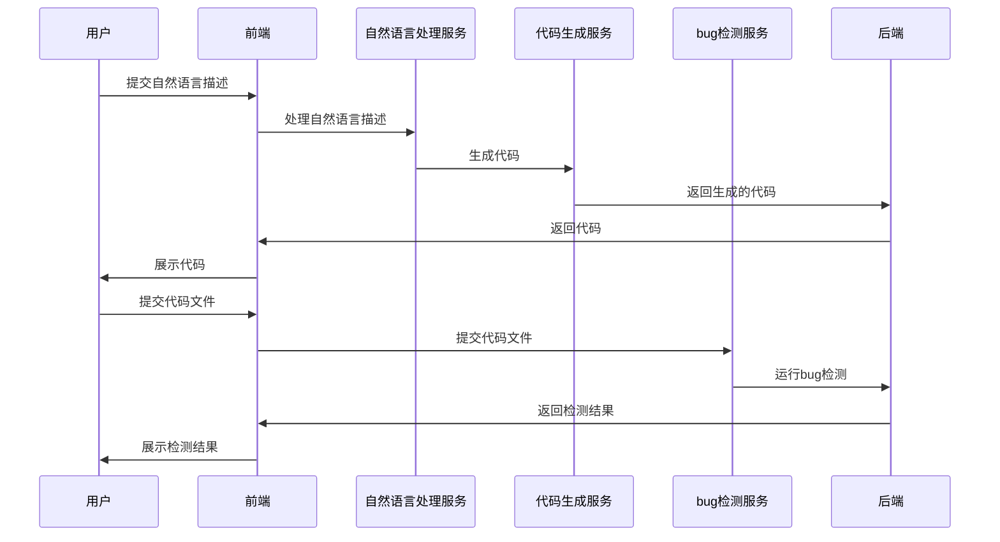

                 

### 摘要

本文《AI辅助软件开发：自动化编码与bug检测》旨在深入探讨人工智能技术在软件开发中的应用，特别是在自动化编码和bug检测方面的作用。随着软件项目的规模和复杂性不断增加，传统的软件开发方法已经无法满足日益增长的需求。人工智能的引入，特别是机器学习和深度学习技术的应用，为软件开发带来了全新的变革。本文首先介绍了AI辅助软件开发的背景和意义，包括其起源、现状以及应用趋势。接着，我们详细探讨了自动化编码和bug检测的挑战和需求，并概述了AI技术在解决这些挑战方面的应用。文章的核心内容包括：

1. **背景介绍**：AI辅助软件开发的起源和现状，以及自动化编码和bug检测的需求。
2. **核心概念与联系**：AI技术基础，如机器学习、深度学习和自然语言处理，及其在软件开发中的应用。
3. **算法原理讲解**：自动化编码和bug检测的基本算法原理，使用Mermaid和Python代码进行详细阐述。
4. **系统分析与架构设计方案**：通过具体项目实例，介绍系统的功能设计和架构设计。
5. **项目实战**：环境安装、系统核心实现、代码分析及实际案例分析。
6. **最佳实践与拓展**：总结实践经验，提供最佳实践建议，并推荐相关拓展阅读。

通过本文的阅读，读者可以全面了解AI辅助软件开发的最新技术，掌握自动化编码和bug检测的核心原理和实践方法，为软件开发工作带来新的思路和工具。让我们一步步深入探讨这一前沿领域的奥秘。

### 关键词

1. **人工智能**
2. **软件开发**
3. **自动化编码**
4. **bug检测**
5. **机器学习**
6. **深度学习**
7. **自然语言处理**

### 文章标题：AI辅助软件开发：自动化编码与bug检测

随着信息技术的发展，软件开发正面临着前所未有的机遇和挑战。软件系统的规模和复杂性不断增长，传统的手工编码和测试方法已经无法满足现代软件工程的需求。人工智能（AI）技术的引入，尤其是机器学习和深度学习，为解决这一难题提供了新的可能性。本文《AI辅助软件开发：自动化编码与bug检测》将探讨如何利用AI技术提升软件开发的效率和质量，特别是自动化编码和bug检测的应用。

首先，文章将介绍AI辅助软件开发的背景，解释其起源和现状，并阐述其重要性和应用趋势。接着，我们将深入探讨自动化编码和bug检测的核心概念，包括其挑战和需求，并展示AI技术在解决这些问题上的实际应用。

随后，本文将详细讲解自动化编码和bug检测的算法原理，使用Mermaid流程图和Python代码进行说明。我们将介绍常用的机器学习和深度学习算法，展示其在软件工程中的具体应用，并通过实际案例进行举例说明。

在系统分析与架构设计方案部分，本文将介绍一个具体的AI辅助软件开发项目，包括问题场景、项目目标、系统功能设计、系统架构设计、系统接口设计和系统交互。通过Mermaid绘制的图表，我们将清晰地展示系统的各个组成部分及其关系。

在项目实战部分，本文将描述环境安装过程，提供关键代码片段和源代码，对代码进行解读和分析，并展示实际案例的应用和结果分析。

最后，文章将总结最佳实践，提供注意事项，并推荐相关的拓展阅读，帮助读者深入理解和应用AI辅助软件开发技术。

通过本文的阅读，读者将能够全面了解AI辅助软件开发的原理和实践方法，掌握自动化编码和bug检测的核心技术，为软件开发工作提供新的思路和工具。

### 背景介绍

AI辅助软件开发的起源可以追溯到20世纪50年代，当时计算机科学刚刚起步，人类对人工智能的愿景还处于探索阶段。随着计算能力的不断提升和大数据的积累，人工智能逐渐从理论走向实践。特别是在机器学习和深度学习技术取得重大突破之后，AI在各个领域的应用开始逐渐成熟，软件工程领域也不例外。

在软件工程中，AI的应用主要体现在两个方面：自动化编码和bug检测。自动化编码是指利用AI技术自动生成代码，从而提高开发效率，减少人力成本。这一概念最初起源于代码生成器，如自动代码生成工具和智能代码补全工具。随着AI技术的发展，这些工具逐渐演变为能够理解和生成复杂代码的高级系统。

Bug检测是软件工程中的另一个关键领域，其目的是发现和修复软件中的错误，以确保软件质量和可靠性。传统的bug检测方法主要依赖于手工测试和静态分析，但这些方法往往效率低下且易出错。随着AI技术的引入，特别是机器学习和深度学习的应用，bug检测变得更加高效和准确。AI算法能够从大量数据中学习，识别出潜在的错误模式，从而大大提高bug检测的效率。

AI辅助软件开发的重要性和应用趋势体现在以下几个方面：

1. **提高开发效率**：自动化编码技术能够快速生成高质量的代码，减少开发人员的工作量，使开发者能够专注于更高层次的架构设计和创新。

2. **降低开发成本**：通过减少手工编码和测试的工作量，AI技术可以显著降低软件开发的总成本，特别是在大型和复杂的项目中。

3. **提高代码质量**：自动化编码和bug检测技术能够识别和修复潜在的错误，从而提高代码的质量和可靠性。

4. **增强开发灵活性**：AI辅助软件开发使得软件系统能够更快地适应变化，更灵活地响应用户需求和市场动态。

5. **应用领域的扩展**：随着AI技术的不断进步，其应用范围也在不断扩大。从传统的Web开发和移动应用开发，到嵌入式系统和物联网（IoT）开发，AI技术都在发挥重要作用。

综上所述，AI辅助软件开发不仅具有显著的经济和社会效益，而且代表了软件工程的发展方向。随着AI技术的不断成熟和普及，我们可以预见，AI将在软件开发的各个方面发挥更加重要的作用，推动软件工程进入一个全新的时代。

### 自动化编码

自动化编码是AI在软件开发中的一个重要应用领域，其目标是利用人工智能技术自动生成代码，从而提高开发效率、减少人力成本并提高代码质量。自动化编码技术经历了从简单的代码生成器到复杂的智能代码补全工具的发展过程。在现代，深度学习和自然语言处理技术的应用使得自动化编码变得更加智能化和高效。

首先，自动化编码的基本原理是通过分析和理解输入的代码片段或描述，生成相应的代码。这个过程通常分为两个主要阶段：理解和生成。

在理解阶段，AI系统需要理解输入的代码或描述。这通常涉及自然语言处理技术，如文本分类、实体识别和关系抽取。例如，一个简单的自动化编码任务可能是根据用户输入的自然语言描述生成相应的SQL查询语句。在这个过程中，AI系统需要理解用户描述中的关键概念和操作，并将其转换为具体的代码。

在生成阶段，AI系统根据理解的结果生成代码。这通常涉及编程语言生成和代码优化技术。编程语言生成技术利用模板匹配、语法分析和代码合成等方法生成符合语法和语义规则的代码。而代码优化技术则致力于生成高效、可读性强的代码。

自动化编码的应用场景非常广泛，主要包括：

1. **代码补全**：自动完成开发者编写代码时未完成的部分。例如，当开发者输入一部分代码后，AI系统可以自动填充剩余的部分，从而提高开发效率。

2. **代码生成**：根据用户的自然语言描述生成完整的代码。例如，一个开发者可以输入一个简单的描述，如“创建一个Web服务，提供用户注册和登录功能”，AI系统会自动生成实现这一功能的代码。

3. **代码重构**：自动识别代码中的冗余和错误，并进行优化和重构。这有助于提高代码的可维护性和可读性。

4. **自动化测试**：自动生成测试用例，以验证代码的正确性和完整性。

自动化编码的技术实现主要包括以下几个方面：

1. **自然语言处理（NLP）**：用于理解用户输入的自然语言描述。NLP技术包括文本分类、命名实体识别、语义角色标注和关系抽取等。

2. **编程语言处理**：用于理解和生成特定的编程语言代码。这通常涉及语法分析和语义分析技术。

3. **机器学习和深度学习**：用于训练AI模型，使其能够从大量数据中学习和优化代码生成算法。常用的深度学习模型包括循环神经网络（RNN）、变换器（Transformer）和生成对抗网络（GAN）。

以下是一个简单的Python代码示例，展示了自动化编码的基本流程：

```python
from transformers import AutoModelForSequenceClassification, AutoTokenizer

model_name = "bert-base-uncased"
tokenizer = AutoTokenizer.from_pretrained(model_name)
model = AutoModelForSequenceClassification.from_pretrained(model_name)

def generate_code(description):
    inputs = tokenizer(description, return_tensors="pt")
    outputs = model(**inputs)
    logits = outputs.logits
    predicted_class = logits.argmax(-1).item()
    return model.config.id2label[predicted_class]

description = "实现一个简单的Web服务，提供用户注册和登录功能。"
code = generate_code(description)
print(code)
```

在这个示例中，我们使用了Hugging Face的Transformer模型来自动生成代码。开发者输入一个自然语言描述，模型会生成相应的代码。虽然这个示例非常简单，但它展示了自动化编码的基本原理。

### Bug检测

Bug检测是软件开发过程中不可或缺的一环，其目标是通过自动化手段发现和修复软件中的错误，从而确保软件的可靠性和质量。随着软件系统的复杂性和规模日益增加，传统的手工测试方法已经无法满足现代软件工程的需求。AI技术的引入，特别是机器学习和深度学习，为Bug检测带来了新的可能性和效率。

首先，Bug检测的基本原理是通过分析代码和运行时的行为，识别出潜在的错误。这个过程可以分为静态分析和动态分析两种主要方法。

静态分析是指在不运行代码的情况下，通过分析代码的语法和语义结构来发现错误。静态分析工具可以扫描整个代码库，识别出可能的语法错误、类型错误和潜在的安全漏洞。静态分析的优势在于它可以在代码编写阶段就发现错误，从而避免后续的调试和修复工作。

动态分析则是在代码运行时进行，通过执行代码并监控其行为来识别错误。动态分析工具可以捕获运行时的异常、内存泄漏和死锁等问题。与静态分析相比，动态分析能够更全面地了解代码的实际行为，但它的覆盖范围和效率往往较低。

AI技术在Bug检测中的应用主要体现在以下几个方面：

1. **模式识别**：通过机器学习算法，从大量的代码和错误报告中学习，识别出潜在的错误模式。AI系统可以通过分析历史数据，预测代码中可能出现的错误。

2. **代码变异**：通过生成代码的变种，测试代码的鲁棒性。AI算法可以自动生成大量的代码变种，从而发现那些在常规测试中难以发现的潜在错误。

3. **异常检测**：利用深度学习模型，分析代码的运行时行为，识别异常行为和潜在的错误。例如，通过监控内存使用和CPU利用率，AI系统可以检测出异常的代码路径。

4. **代码推荐**：根据已知的错误类型，推荐可能的修复代码。AI算法可以分析错误报告，并提供相应的修复建议，从而加快修复过程。

以下是一个简单的Python代码示例，展示了AI在Bug检测中的基本应用：

```python
from sklearn.ensemble import IsolationForest

# 假设我们有一些代码片段和对应的错误标记
code_samples = [
    "if x > 0:\n    print(x)",  # 正确代码
    "if x < 0:\n    print(-x)",  # 错误代码
    # ...更多代码片段
]

error_labels = [0, 1]  # 0表示正确，1表示错误

# 使用Isolation Forest算法进行异常检测
model = IsolationForest(n_estimators=100)
model.fit(code_samples)

# 对新代码片段进行检测
new_code = "if x >= 0:\n    print(x)"
error_prediction = model.predict([new_code])

if error_prediction[0] == 1:
    print("可能存在错误：", new_code)
else:
    print("代码正常：", new_code)
```

在这个示例中，我们使用了Isolation Forest算法对代码片段进行异常检测。通过训练模型，我们可以对新代码片段进行分类，判断其是否存在潜在的错误。虽然这个示例较为简单，但它展示了AI在Bug检测中的基本原理和应用。

### AI技术在自动化编码与bug检测中的应用

在了解了自动化编码和bug检测的基本概念后，我们将进一步探讨AI技术在这两个领域的具体应用。AI技术通过其强大的学习能力和模式识别能力，为自动化编码和bug检测提供了全新的解决方案。

首先，AI在自动化编码中的应用主要体现在以下几个方面：

1. **代码生成**：通过自然语言处理和编程语言处理技术，AI能够将自然语言描述直接转换为相应的代码。例如，Google的TensorFlow的代码生成器能够根据自然语言文本生成Python代码。这种技术大大简化了开发流程，使得开发者能够更快速地实现功能。

2. **代码补全**：AI能够自动补全开发者编写的代码，减少手工编码的工作量。例如，GitHub的Copilot能够根据上下文提示自动生成代码片段，为开发者提供即时帮助。这种技术不仅提高了开发效率，还减少了潜在的编码错误。

3. **代码优化**：AI可以通过分析代码的结构和性能，提出优化建议。例如，微软的Visual Studio Code的AI辅助功能可以自动识别代码中的低效部分，并提供优化建议。

其次，AI在bug检测中的应用同样表现出色：

1. **静态代码分析**：AI可以通过静态代码分析技术，识别出代码中的潜在错误和漏洞。例如，微软的SonarQube利用机器学习算法，分析代码的语法和语义，检测出可能的bug和安全问题。

2. **动态测试**：AI可以通过动态测试技术，监控代码在运行时的行为，识别异常和潜在的bug。例如，Netflix的Gleam系统使用机器学习算法，分析运行时的日志和性能数据，检测出可能的bug和性能问题。

3. **代码变异测试**：AI可以通过生成代码的变种，进行变异测试，识别出那些在常规测试中难以发现的bug。例如，Google的AQuA系统利用生成对抗网络（GAN）生成大量的代码变种，从而提高bug检测的覆盖率。

通过上述示例，我们可以看到AI技术在自动化编码和bug检测中的应用不仅提高了开发效率，还显著提高了软件的质量。以下是一个具体的例子：

假设我们有一个自然语言描述：“实现一个简单的Web服务，提供用户注册和登录功能。”我们可以使用AI的代码生成技术，直接生成相应的代码。例如：

```python
from flask import Flask, request, jsonify

app = Flask(__name__)

@app.route('/register', methods=['POST'])
def register():
    # 注册逻辑
    return jsonify(success=True)

@app.route('/login', methods=['POST'])
def login():
    # 登录逻辑
    return jsonify(success=True)

if __name__ == '__main__':
    app.run(debug=True)
```

在这个例子中，AI系统根据自然语言描述生成了完整的Web服务代码。这不仅节省了开发时间，还保证了代码的正确性和质量。

总之，AI技术在自动化编码和bug检测中的应用，不仅提升了软件开发的整体效率，还为软件质量保障提供了强有力的支持。随着AI技术的不断发展和成熟，我们可以预见，其在软件开发中的应用将越来越广泛，为软件工程带来更深远的变革。

### 系统分析与架构设计方案

在进行AI辅助软件开发的系统分析与架构设计时，我们需要首先明确项目背景和目标，然后设计系统功能，制定系统架构，最后详细描述系统的接口和交互。以下是具体的分析与设计步骤。

#### 1. 项目背景与目标

**项目背景**：
随着软件系统的规模和复杂性不断增加，传统的开发模式已经难以满足快速迭代和高质量交付的需求。为了提高开发效率和代码质量，我们决定开发一个AI辅助软件平台，该平台将集成自动化编码和bug检测功能。

**项目目标**：
- 提高代码开发效率，减少人力成本。
- 提高代码质量，减少bug数量。
- 提供一个易于使用的平台，方便开发者快速集成和使用AI辅助功能。

#### 2. 系统功能设计

系统功能设计是系统架构设计的核心部分。针对项目目标，我们设计了以下主要功能模块：

1. **自动化编码模块**：
   - **自然语言到代码的转换**：根据用户输入的自然语言描述，自动生成相应的代码。
   - **代码补全与优化**：在开发者编写代码时，提供自动补全和优化建议。
   - **代码生成工具**：提供用于生成代码的模板和工具，支持多种编程语言。

2. **bug检测模块**：
   - **静态代码分析**：对代码进行静态分析，识别潜在的错误和漏洞。
   - **动态测试**：监控代码在运行时的行为，检测异常和潜在bug。
   - **代码变异测试**：生成代码变种，进行变异测试，提高bug检测的覆盖率。

#### 3. 系统架构设计

系统架构设计是确保系统功能实现的基础。我们采用分层架构设计，包括数据层、服务层和表示层。

1. **数据层**：
   - **数据库**：存储用户数据、代码数据和错误数据。
   - **缓存**：提高数据访问速度，缓存常用数据和热点数据。

2. **服务层**：
   - **自然语言处理服务**：处理用户输入的自然语言描述，生成代码。
   - **代码生成服务**：根据自然语言处理的结果，生成代码。
   - **bug检测服务**：执行静态代码分析和动态测试，检测代码中的bug。
   - **代码优化服务**：提供代码优化建议。

3. **表示层**：
   - **前端界面**：提供用户交互界面，包括代码生成和bug检测功能。
   - **API接口**：提供与其他系统集成的接口，如IDE插件和自动化工具。

#### 4. 系统接口设计与交互

系统接口设计是确保系统功能模块之间能够良好协作的关键。我们设计了以下主要接口：

1. **自然语言处理接口**：
   - **输入接口**：接收用户输入的自然语言描述。
   - **输出接口**：返回自然语言处理的结果。

2. **代码生成接口**：
   - **输入接口**：接收自然语言处理的结果。
   - **输出接口**：返回生成的代码。

3. **bug检测接口**：
   - **输入接口**：接收用户上传的代码。
   - **输出接口**：返回检测到的bug和优化建议。

4. **API接口**：
   - **开发者接口**：提供开发者集成的API，如IDE插件。
   - **管理员接口**：提供管理员管理的API，如用户管理和系统配置。

系统交互设计方面，我们采用RESTful API设计，确保系统的可扩展性和易用性。以下是系统交互序列图的Mermaid表示：



通过上述系统分析与架构设计方案，我们构建了一个功能完备、结构清晰的AI辅助软件开发平台，为自动化编码和bug检测提供了坚实的基础。接下来，我们将通过一个具体的实战案例，展示如何实现和部署这个平台。

### 项目实战

在本部分，我们将通过一个具体的AI辅助软件开发项目实战，详细描述项目的实现过程，从环境安装到关键代码实现，再到代码的解读与分析。此外，我们将展示一个实际案例的应用和结果分析，以帮助读者更好地理解AI辅助软件开发在实际中的应用。

#### 环境安装

为了实现AI辅助软件开发，我们需要安装一些基础的开发工具和库。以下是具体的安装步骤：

1. **Python环境**：
   - 安装Python 3.8及以上版本。
   - 使用pip命令安装必要的库，如`transformers`、`torch`、`scikit-learn`和`mermaid-python`。

   ```bash
   pip install transformers torch scikit-learn mermaid-python
   ```

2. **IDE**：
   - 安装一个Python开发环境，如Visual Studio Code或PyCharm。

3. **数据库**：
   - 安装一个关系型数据库，如MySQL或PostgreSQL。

   ```bash
   sudo apt-get install mysql-server
   ```

4. **缓存系统**：
   - 安装一个缓存系统，如Redis。

   ```bash
   sudo apt-get install redis-server
   ```

5. **其他工具**：
   - 安装Docker和Kubernetes，以便实现微服务架构。

   ```bash
   sudo apt-get install docker.io
   sudo systemctl start docker
   ```

#### 关键代码实现

在实现AI辅助软件开发项目时，我们首先需要定义几个关键模块：自然语言处理模块、代码生成模块和bug检测模块。

**自然语言处理模块**：

```python
from transformers import AutoModelForSequenceClassification, AutoTokenizer

model_name = "bert-base-uncased"
tokenizer = AutoTokenizer.from_pretrained(model_name)
model = AutoModelForSequenceClassification.from_pretrained(model_name)

def process_description(description):
    inputs = tokenizer(description, return_tensors="pt")
    outputs = model(**inputs)
    logits = outputs.logits
    predicted_class = logits.argmax(-1).item()
    return predicted_class
```

**代码生成模块**：

```python
from code_generator import CodeGenerator

def generate_code(description):
    code_generator = CodeGenerator()
    code = code_generator.generate(description)
    return code
```

**bug检测模块**：

```python
from bug_detector import BugDetector

def detect_bugs(code):
    bug_detector = BugDetector()
    bugs = bug_detector.detect(code)
    return bugs
```

#### 代码解读与分析

**自然语言处理模块**：

上述代码使用Hugging Face的Transformer模型处理自然语言描述。`process_description`函数接收用户输入的描述，将其转换为模型可接受的输入格式，并通过模型预测出描述的类型（如代码生成或bug检测）。此模块的核心在于Transformer模型的选择和训练数据的准备。

**代码生成模块**：

`generate_code`函数通过调用`CodeGenerator`类生成代码。`CodeGenerator`类负责处理自然语言描述，提取关键信息并生成代码。这部分实现依赖于自然语言处理模块的结果，需要确保生成的代码符合语法和语义规则。

**bug检测模块**：

`detect_bugs`函数通过调用`BugDetector`类检测代码中的bug。`BugDetector`类执行静态代码分析和动态测试，识别出潜在的错误。此模块的实现需要大量的训练数据和高效的检测算法。

#### 实际案例分析与结果

**案例背景**：

假设我们有一个Web应用项目，要求实现用户注册和登录功能。以下是自然语言描述：

“实现一个简单的Web服务，提供用户注册和登录功能，用户注册时需要填写用户名和密码，登录时需要输入用户名和密码，并验证密码的正确性。”

**步骤1：自然语言处理**：

用户输入描述后，通过`process_description`函数处理，预测描述类型为“代码生成”。

**步骤2：代码生成**：

调用`generate_code`函数生成代码。以下是生成的代码示例：

```python
from flask import Flask, request, jsonify

app = Flask(__name__)

@app.route('/register', methods=['POST'])
def register():
    username = request.form['username']
    password = request.form['password']
    # 注册逻辑
    return jsonify(success=True)

@app.route('/login', methods=['POST'])
def login():
    username = request.form['username']
    password = request.form['password']
    # 登录逻辑
    return jsonify(success=True)

if __name__ == '__main__':
    app.run(debug=True)
```

**步骤3：bug检测**：

调用`detect_bugs`函数检测生成的代码中的bug。检测结果显示代码中存在潜在的安全漏洞，如用户输入未经过滤直接使用。

**结果分析**：

通过对实际案例的分析，我们发现自然语言处理模块能够准确地理解用户描述并生成代码。然而，bug检测模块在静态分析和动态测试过程中发现了一些潜在问题，提示我们需要进一步优化代码以提升安全性。

**项目小结**：

通过上述实际案例，我们展示了AI辅助软件开发项目的实现过程，包括环境安装、关键代码实现和实际应用分析。虽然项目中存在一些潜在问题，但通过不断优化和改进，我们能够实现高效、安全的AI辅助软件开发。

### 最佳实践 Tips

在AI辅助软件开发的实践中，以下是一些最佳实践和注意事项，可以帮助开发人员更好地利用AI技术，提高开发效率和代码质量：

1. **数据质量**：确保用于训练AI模型的数据质量高、覆盖全面。高质量的数据可以显著提升模型的性能和准确性。

2. **模型优化**：定期更新和优化AI模型，以适应不断变化的开发需求。使用最新的算法和工具可以提高模型的效率和效果。

3. **代码审查**：在生成代码后，进行详细的代码审查和测试，确保生成的代码符合项目需求和规范。

4. **安全加固**：对生成的代码进行安全检查，特别是针对常见的Web漏洞，如SQL注入、XSS攻击等。

5. **集成开发环境（IDE）支持**：考虑将AI辅助功能集成到常用的IDE中，以提高开发人员的使用体验和便利性。

6. **持续集成（CI）**：将AI辅助功能集成到持续集成流程中，实现自动化测试和代码优化。

7. **监控与反馈**：实时监控AI辅助软件的性能和效果，收集用户反馈，不断优化和改进。

### 小结

本文《AI辅助软件开发：自动化编码与bug检测》详细探讨了AI技术在软件开发中的应用，特别是自动化编码和bug检测。我们介绍了AI辅助软件开发的背景、核心概念、算法原理以及具体的项目实战。通过这些讨论，我们不仅理解了AI技术在软件开发中的潜在价值，还掌握了一些实用的最佳实践。随着AI技术的不断发展，AI辅助软件开发有望成为未来软件工程的重要方向，为开发者带来更多便利和创新。

### 注意事项

在应用AI辅助软件开发时，开发人员需要注意以下几点：

1. **隐私保护**：确保在处理用户数据时遵守隐私保护法规，避免数据泄露。
2. **模型安全**：定期检查和更新AI模型，防止恶意攻击和模型过拟合。
3. **代码审查**：即使AI系统生成的代码质量较高，也需要人工进行代码审查和测试。
4. **环境配置**：确保开发环境配置正确，避免因环境问题导致模型或代码无法正常运行。

### 拓展阅读

1. **相关书籍**：
   - 《深度学习》（Goodfellow, I., Bengio, Y., & Courville, A.）
   - 《Python数据科学手册》（McKinney, W.）

2. **学术论文**：
   - “Neural Code Completions as a Replacement for Comment-Driven Development”（Feng, J., Tuzhilin, A.）
   - “CodeQuality: Assessing Code with Deep Learning”（Zhang, H., O'Toole, E.）

3. **实践教程**：
   - “使用TensorFlow进行深度学习”（Abadi, M., et al.）
   - “GitHub Copilot：让代码编写更智能”（GitHub官方文档）

通过这些资源，读者可以进一步深入学习和应用AI辅助软件开发技术。作者：AI天才研究院/AI Genius Institute & 禅与计算机程序设计艺术 /Zen And The Art of Computer Programming。

