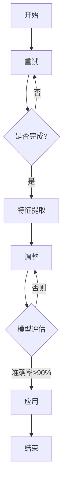

                 

# AI驱动的个性化医疗：从基因组分析到治疗方案设计

> 关键词：人工智能、个性化医疗、基因组分析、治疗方案设计、机器学习、深度学习

> 摘要：随着人工智能技术的飞速发展，个性化医疗已成为现代医学的重要方向。本文将详细探讨AI驱动的个性化医疗，从基因组分析到治疗方案设计，通过逐步分析推理的方式，为读者呈现一个全面、深入的技术解析。本文旨在帮助读者了解个性化医疗的背景、核心概念、应用场景以及未来发展方向。

### 目录大纲

----------------------------------------------------------------

## 第一部分: 背景介绍

### 第1章: AI驱动的个性化医疗概述

#### 1.1 问题背景

##### 1.1.1 个性化医疗的起源与发展

##### 1.1.2 AI在个性化医疗中的应用

##### 1.1.3 当前个性化医疗面临的挑战与机遇

#### 1.2 问题描述

##### 1.2.1 个性化医疗的核心问题

##### 1.2.2 人工智能在个性化医疗中的关键作用

##### 1.2.3 个性化医疗的边界与外延

#### 1.3 问题解决

##### 1.3.1 人工智能在个性化医疗中的应用场景

##### 1.3.2 关键技术概述

##### 1.3.3 未来发展方向

#### 1.4 核心概念与联系

##### 1.4.1 核心概念原理

##### 1.4.2 概念属性特征对比表格

##### 1.4.3 ER实体关系图架构

#### 1.5 本章小结

----------------------------------------------------------------

## 第二部分: 核心概念与联系

### 第2章: 人工智能基础

#### 2.1 人工智能概述

##### 2.1.1 人工智能的定义与发展历程

##### 2.1.2 人工智能的主要分类

##### 2.1.3 人工智能的核心技术

#### 2.2 人工智能在医学中的应用

##### 2.2.1 人工智能在基因组分析中的应用

##### 2.2.2 人工智能在疾病诊断中的应用

##### 2.2.3 人工智能在治疗方案设计中的应用

#### 2.3 关键技术对比分析

##### 2.3.1 机器学习与深度学习的区别

##### 2.3.2 图神经网络与Transformer架构

##### 2.3.3 数据挖掘与大数据分析

#### 2.4 本章小结

----------------------------------------------------------------

## 第三部分: 从基因组分析到治疗方案设计

### 第3章: 基因组分析

#### 3.1 基因组概述

##### 3.1.1 基因组的定义与结构

##### 3.1.2 基因组序列分析

##### 3.1.3 基因组变异分析

#### 3.2 人工智能在基因组分析中的应用

##### 3.2.1 基因组数据分析技术

##### 3.2.2 基因组注释与预测

##### 3.2.3 基因组驱动的个性化医疗

#### 3.3 算法原理讲解

##### 3.3.1 基因组数据分析算法原理

##### 3.3.2 基因驱动个性化医疗算法

##### 3.3.3 机器学习与深度学习算法在基因组分析中的应用

#### 3.4 数学模型和数学公式

##### 3.4.1 基因组数据分析数学模型

##### 3.4.2 基因驱动个性化医疗数学模型

##### 3.4.3 算法原理公式

#### 3.5 举例说明

##### 3.5.1 基因组数据分析案例分析

##### 3.5.2 基因驱动个性化医疗案例分析

#### 3.6 本章小结

----------------------------------------------------------------

## 第四部分: 疾病诊断与治疗方案设计

### 第4章: 疾病诊断

#### 4.1 疾病诊断概述

##### 4.1.1 疾病诊断的传统方法

##### 4.1.2 人工智能在疾病诊断中的应用

##### 4.1.3 人工智能在疾病诊断中的优势

#### 4.2 人工智能在疾病诊断中的应用

##### 4.2.1 疾病特征提取与识别

##### 4.2.2 疾病诊断模型构建

##### 4.2.3 个性化疾病诊断

#### 4.3 算法原理讲解

##### 4.3.1 疾病诊断算法原理

##### 4.3.2 人工智能在疾病诊断中的应用案例

##### 4.3.3 深度学习在疾病诊断中的应用

#### 4.4 数学模型和数学公式

##### 4.4.1 疾病诊断数学模型

##### 4.4.2 疾病诊断数学公式

#### 4.5 举例说明

##### 4.5.1 疾病诊断案例分析

##### 4.5.2 个性化疾病诊断案例分析

#### 4.6 本章小结

----------------------------------------------------------------

### 第5章: 治疗方案设计

#### 5.1 治疗方案设计概述

##### 5.1.1 传统治疗方案设计方法

##### 5.1.2 人工智能在治疗方案设计中的应用

##### 5.1.3 个性化治疗方案的优势

#### 5.2 人工智能在治疗方案设计中的应用

##### 5.2.1 治疗方案构建与优化

##### 5.2.2 治疗效果预测与评估

##### 5.2.3 个性化治疗方案设计

#### 5.3 算法原理讲解

##### 5.3.1 治疗方案设计算法原理

##### 5.3.2 人工智能在治疗方案设计中的应用案例

##### 5.3.3 深度学习在治疗方案设计中的应用

#### 5.4 数学模型和数学公式

##### 5.4.1 治疗方案设计数学模型

##### 5.4.2 治疗方案设计数学公式

#### 5.5 举例说明

##### 5.5.1 治疗方案设计案例分析

##### 5.5.2 个性化治疗方案案例分析

#### 5.6 本章小结

----------------------------------------------------------------

## 第五部分: 总结与展望

### 第6章: 个性化医疗的未来展望

#### 6.1 个性化医疗的发展趋势

##### 6.1.1 技术创新与挑战

##### 6.1.2 政策环境与伦理问题

##### 6.1.3 未来发展方向

#### 6.2 人工智能在个性化医疗中的角色与使命

##### 6.2.1 人工智能技术的应用前景

##### 6.2.2 人工智能在个性化医疗中的挑战与机遇

#### 6.3 小结

----------------------------------------------------------------

## 参考文献

----------------------------------------------------------------

### 附录

#### 附录A: Mermaid 图谱代码示例

----------------------------------------------------------------

**注：**本文将按照目录大纲逐步展开，每个章节都将详细讲解，力求使读者对AI驱动的个性化医疗有一个全面而深入的了解。接下来，我们将首先介绍个性化医疗的背景和AI的应用，以此展开对这一新兴领域的探讨。

## 第一部分: 背景介绍

### 第1章: AI驱动的个性化医疗概述

个性化医疗，顾名思义，是基于个人基因、生活方式和环境等因素，为患者制定最合适的治疗方案。这种个性化的治疗方法相比于传统的“一刀切”的标准化治疗方案，具有更高的精准性和有效性。随着科技的进步，特别是人工智能（AI）的飞速发展，个性化医疗迎来了新的发展契机。

#### 1.1 问题背景

#### 1.1.1 个性化医疗的起源与发展

个性化医疗的起源可以追溯到20世纪70年代，当时医学界开始意识到，对于相同的疾病，不同的患者对治疗的反应可能存在显著差异。例如，对于乳腺癌的治疗，某些患者可能对化疗有较好的反应，而另一些患者则可能对化疗产生耐药性。这种个性化的治疗思路逐渐引起了医学界的关注。

随着基因组学和生物信息学的发展，个性化医疗得到了迅速推进。基因测序技术的发展使得医生可以更准确地了解患者的基因特征，从而为患者提供更加精准的治疗方案。此外，大数据和人工智能技术的应用，也为个性化医疗提供了强大的技术支持。

#### 1.1.2 AI在个性化医疗中的应用

人工智能在个性化医疗中的应用主要集中在以下几个方面：

1. **基因组数据分析**：通过机器学习和深度学习算法，对大量基因组数据进行处理和分析，发现与疾病相关的基因变异和生物标记。
2. **疾病诊断**：利用图像识别、自然语言处理等技术，对医学影像、电子病历等数据进行自动分析和诊断。
3. **治疗方案设计**：基于患者的基因信息、病史和生活习惯，利用AI算法为患者提供个性化的治疗方案。

#### 1.1.3 当前个性化医疗面临的挑战与机遇

尽管个性化医疗有着巨大的潜力，但当前仍面临着一些挑战：

1. **数据隐私与安全**：基因数据和其他个人健康信息的隐私和安全问题是一个重要的挑战。
2. **技术限制**：虽然AI技术发展迅速，但其在医学领域的应用仍存在一定的局限性，如算法的准确性、可靠性和可解释性等。
3. **医疗资源的分配**：个性化医疗的实施需要大量的医疗资源，这对于资源有限的医疗机构来说是一个挑战。

然而，伴随着技术的不断进步，个性化医疗也面临着巨大的机遇：

1. **提高治疗效果**：通过个性化的治疗方案，可以提高治疗效果，减少副作用和医疗资源浪费。
2. **降低医疗成本**：个性化医疗可以更精准地治疗疾病，从而降低整体医疗成本。
3. **患者参与**：个性化医疗鼓励患者参与到自己的治疗过程中，提高患者的满意度和治疗效果。

#### 1.2 问题描述

#### 1.2.1 个性化医疗的核心问题

个性化医疗的核心问题是如何根据患者的个体特征，如基因信息、生活习惯、病史等，为其提供最佳的治疗方案。这涉及到以下几个方面：

1. **基因组数据分析**：如何有效地处理和分析大量的基因组数据，发现与疾病相关的基因变异和生物标记。
2. **疾病诊断**：如何利用AI技术自动分析和诊断医学影像、电子病历等数据。
3. **治疗方案设计**：如何根据患者的个体特征，利用AI算法为患者提供个性化的治疗方案。

#### 1.2.2 人工智能在个性化医疗中的关键作用

人工智能在个性化医疗中扮演着至关重要的角色：

1. **数据分析与处理**：AI技术可以处理和分析海量的基因组数据，帮助医生发现与疾病相关的基因变异和生物标记。
2. **疾病诊断**：AI技术可以通过图像识别、自然语言处理等技术，自动分析和诊断医学影像、电子病历等数据，提高诊断的准确性和效率。
3. **治疗方案设计**：AI技术可以根据患者的个体特征，为患者提供个性化的治疗方案，提高治疗效果和降低医疗成本。

#### 1.2.3 个性化医疗的边界与外延

个性化医疗的边界和范围可以包括以下几个方面：

1. **基因组学**：包括基因组测序、基因组变异分析、基因组注释等。
2. **生物信息学**：包括生物标记发现、数据分析、数据挖掘等。
3. **疾病诊断**：包括医学影像分析、电子病历分析、症状识别等。
4. **治疗方案设计**：包括个性化治疗方案的构建、优化和评估。

#### 1.3 问题解决

#### 1.3.1 人工智能在个性化医疗中的应用场景

人工智能在个性化医疗中的应用场景非常广泛，包括以下几个方面：

1. **基因组数据分析**：利用机器学习和深度学习算法，对基因组数据进行分析和处理，发现与疾病相关的基因变异和生物标记。
2. **疾病诊断**：利用图像识别、自然语言处理等技术，对医学影像、电子病历等数据进行自动分析和诊断。
3. **治疗方案设计**：利用AI算法，根据患者的个体特征，为患者提供个性化的治疗方案。

#### 1.3.2 关键技术概述

为了实现AI驱动的个性化医疗，需要掌握一系列关键技术：

1. **机器学习与深度学习**：机器学习与深度学习是AI的核心技术，可用于数据分析、疾病诊断和治疗方案设计。
2. **基因组数据分析技术**：包括基因组测序、基因组变异分析、基因组注释等。
3. **图像识别与自然语言处理**：用于医学影像分析和电子病历分析。
4. **数据挖掘与大数据分析**：用于发现疾病相关的生物标记和治疗策略。

#### 1.3.3 未来发展方向

个性化医疗的未来发展方向主要包括以下几个方面：

1. **技术进步**：随着AI技术的不断进步，将进一步提高个性化医疗的准确性和效率。
2. **跨学科合作**：个性化医疗需要医学、计算机科学、生物信息学等多个领域的合作，共同推进技术的发展。
3. **伦理与政策**：需要建立完善的伦理规范和政策体系，确保个性化医疗的合法性和可行性。
4. **患者参与**：鼓励患者参与到自己的治疗过程中，提高个性化医疗的接受度和效果。

#### 1.4 核心概念与联系

在AI驱动的个性化医疗中，核心概念包括基因组学、机器学习、深度学习、图像识别、自然语言处理、数据挖掘等。这些概念之间的联系可以通过以下ER实体关系图来描述：

```mermaid
erDiagram
  Patient ||--|{ Genome }
  Patient ||--|{ MedicalData }
  Patient ||--|{ Diagnosis }
  Patient ||--|{ TreatmentPlan }
  Genome ||--|{ GenomeSequence }
  Genome ||--|{ GeneVariation }
  MedicalData ||--|{ ImageData }
  MedicalData ||--|{ EHRData }
  Diagnosis ||--|{ DiseaseFeature }
  TreatmentPlan ||--|{ TreatmentOption }
  TreatmentPlan ||--|{ TreatmentEffect }
```

#### 1.5 本章小结

本章对AI驱动的个性化医疗进行了概述，介绍了个性化医疗的背景、AI的应用、当前面临的挑战与机遇，以及核心概念和关键技术。下一章将深入探讨人工智能的基础知识，为后续的详细分析打下基础。

----------------------------------------------------------------

## 第二部分: 核心概念与联系

### 第2章: 人工智能基础

#### 2.1 人工智能概述

人工智能（Artificial Intelligence，简称AI）是指通过计算机模拟人类智能行为的技术。它旨在使计算机系统能够执行通常需要人类智能的任务，如理解语言、识别图像、进行决策和解决问题等。

##### 2.1.1 人工智能的定义与发展历程

人工智能的定义在不同时期有不同的理解，但总体上可以概括为“模拟、延伸和扩展人类智能的技术”。人工智能的发展历程可以分为几个阶段：

1. **萌芽阶段（1956-1969）**：人工智能的概念首次在达特茅斯会议上被提出。这一阶段主要侧重于理论研究和算法开发。
2. **第一次高潮（1970-1980）**：随着计算机性能的提升，人工智能开始应用于实际问题，如专家系统和机器视觉。
3. **低谷阶段（1980-1990）**：由于对人工智能的期望过高，加之技术限制，人工智能研究进入低谷。
4. **复兴阶段（1990-2010）**：随着互联网和大数据的发展，人工智能再次迎来复兴，特别是深度学习的突破。
5. **快速发展阶段（2010至今）**：人工智能在各个领域取得了显著的进展，如自动驾驶、自然语言处理和医疗诊断。

##### 2.1.2 人工智能的主要分类

人工智能可以根据不同的标准进行分类：

1. **基于任务的AI**：这类AI专注于完成特定的任务，如机器翻译、图像识别等。
2. **通用AI**：又称强AI，能够像人类一样理解和执行任何智力任务。
3. **弱AI**：又称窄AI，专注于特定的领域或任务，但缺乏通用性。
4. **基于规则的AI**：使用预定义的规则进行推理和决策。
5. **基于数据的AI**：通过学习大量数据，自动发现模式和规律，如机器学习和深度学习。

##### 2.1.3 人工智能的核心技术

人工智能的核心技术包括：

1. **机器学习**：通过从数据中学习，让计算机自动改进性能。
2. **深度学习**：基于人工神经网络，通过多层非线性变换进行数据建模。
3. **自然语言处理**：使计算机能够理解、生成和处理自然语言。
4. **计算机视觉**：使计算机能够处理和解释视觉信息。
5. **强化学习**：通过试错和奖励机制，让计算机自主学习和决策。

#### 2.2 人工智能在医学中的应用

人工智能在医学中的应用已经取得了显著成果，尤其在基因组分析、疾病诊断和治疗方案设计等方面。

##### 2.2.1 人工智能在基因组分析中的应用

基因组分析是个性化医疗的重要基础。人工智能在基因组分析中的应用主要包括：

1. **基因组数据分析**：利用机器学习和深度学习算法，对海量基因组数据进行处理和分析，发现与疾病相关的基因变异和生物标记。
2. **基因组注释**：对基因组序列进行功能注释，识别基因、转录因子结合位点等。
3. **基因组预测**：基于基因组数据，预测个体的疾病风险、药物响应等。

##### 2.2.2 人工智能在疾病诊断中的应用

人工智能在疾病诊断中的应用主要体现在以下几个方面：

1. **医学影像分析**：利用图像识别技术，自动分析医学影像，如X光、CT、MRI等，用于疾病检测和诊断。
2. **电子病历分析**：利用自然语言处理技术，自动提取电子病历中的关键信息，用于疾病诊断和预测。
3. **症状识别**：通过学习大量医学知识和病例数据，自动识别患者的症状和疾病类型。

##### 2.2.3 人工智能在治疗方案设计中的应用

人工智能在治疗方案设计中的应用包括：

1. **治疗方案推荐**：根据患者的基因信息、病史和临床表现，利用算法为患者推荐最佳的治疗方案。
2. **治疗效果预测**：利用AI模型预测不同治疗方案的效果，帮助医生和患者做出更明智的决策。
3. **治疗方案优化**：通过不断学习和调整，优化治疗方案，提高治疗效果和患者满意度。

#### 2.3 关键技术对比分析

在AI驱动的个性化医疗中，不同的关键技术各有优缺点，具体应用场景也有所不同。

##### 2.3.1 机器学习与深度学习的区别

1. **机器学习**：
   - **定义**：通过学习数据中的模式和规律，让计算机自动改进性能。
   - **适用场景**：适合处理中小规模的数据集，模型复杂度较低。
   - **优点**：易于理解和实现，对数据要求较低。
   - **缺点**：处理高维数据时效果不佳，模型可解释性较差。

2. **深度学习**：
   - **定义**：基于人工神经网络，通过多层非线性变换进行数据建模。
   - **适用场景**：适合处理大规模、高维数据集，尤其在图像识别、语音识别等领域表现优异。
   - **优点**：能够自动提取特征，对复杂任务有很好的表现力。
   - **缺点**：模型复杂度较高，对数据要求较高，可解释性较差。

##### 2.3.2 图神经网络与Transformer架构

1. **图神经网络（GNN）**：
   - **定义**：用于处理图结构数据的神经网络。
   - **适用场景**：如社交网络分析、推荐系统等。
   - **优点**：能够有效捕捉图结构中的关系和模式。
   - **缺点**：计算复杂度高，对稀疏数据效果不佳。

2. **Transformer架构**：
   - **定义**：一种用于序列数据的神经网络架构，特别适用于自然语言处理任务。
   - **适用场景**：如机器翻译、文本生成等。
   - **优点**：并行计算能力强，能够处理长序列数据。
   - **缺点**：对稀疏数据效果较差，模型参数较多。

##### 2.3.3 数据挖掘与大数据分析

1. **数据挖掘**：
   - **定义**：从大量数据中自动发现知识或模式。
   - **适用场景**：如市场分析、客户关系管理等。
   - **优点**：能够处理多种类型的数据，发现潜在的模式和关系。
   - **缺点**：对大规模数据集处理效率较低，对实时性要求高。

2. **大数据分析**：
   - **定义**：对大规模、高速率、多类型的数据进行存储、处理和分析。
   - **适用场景**：如金融交易分析、社交媒体分析等。
   - **优点**：能够处理海量数据，支持实时分析和决策。
   - **缺点**：数据质量和数据治理问题突出。

#### 2.4 本章小结

本章介绍了人工智能的基础知识，包括其定义、发展历程、主要分类和核心技术。同时，分析了人工智能在个性化医疗中的应用，以及不同关键技术的优缺点和适用场景。这些知识为后续章节的深入探讨提供了坚实的基础。

----------------------------------------------------------------

## 第三部分: 从基因组分析到治疗方案设计

### 第3章: 基因组分析

基因组分析是个性化医疗的核心环节，通过对患者基因组的全面解析，可以帮助医生了解患者的遗传背景，从而为制定个性化治疗方案提供重要依据。在这一章中，我们将详细探讨基因组分析的基本概念、应用以及相关算法原理。

#### 3.1 基因组概述

##### 3.1.1 基因组的定义与结构

基因组是指一个生物体所有遗传信息的总和，通常由DNA序列组成。基因组可以进一步分为核基因组（存在于细胞核中的DNA）和线粒体基因组（存在于线粒体中的DNA）。人类的基因组大约包含30亿个核苷酸对，这些核苷酸对构成了人类遗传信息的基本单位——基因。

基因是具有遗传效应的DNA序列片段，它们编码蛋白质和RNA分子，控制生物体的生长、发育和功能。基因可以分为编码区和非编码区，编码区直接编码蛋白质，而非编码区则包含调控元件和重复序列等。

##### 3.1.2 基因组序列分析

基因组序列分析是指通过实验和计算方法，获取基因组的核苷酸序列，并对这些序列进行分析的过程。基因组序列分析的步骤通常包括：

1. **样本收集**：从生物体中提取DNA样本。
2. **DNA提取**：使用化学或物理方法从样本中提取DNA。
3. **测序**：使用新一代测序技术（如高通量测序）对DNA进行测序，获取核苷酸序列。
4. **序列拼接**：将测序得到的短读段拼接成完整的基因组序列。
5. **序列比对**：将拼接好的基因组序列与已知序列进行比对，识别基因、调控元件等。
6. **注释**：对基因组序列进行功能注释，识别基因、转录因子结合位点等。

##### 3.1.3 基因组变异分析

基因组变异分析是指识别和分析基因组序列中存在的变异，如单核苷酸变异（SNV）、插入和缺失（InDels）等。基因组变异分析在个性化医疗中具有重要意义，因为不同的变异可能与不同的疾病风险、药物响应和治疗方案相关。

基因组变异分析的步骤通常包括：

1. **变异检测**：使用生物信息学方法，从测序数据中检测变异。
2. **变异注释**：对检测到的变异进行功能注释，识别其对基因和蛋白质的影响。
3. **风险评估**：基于变异的生物学意义，评估其对疾病风险和药物响应的影响。
4. **报告生成**：将变异分析结果生成报告，供医生和患者参考。

#### 3.2 人工智能在基因组分析中的应用

人工智能在基因组分析中发挥着越来越重要的作用，其应用主要集中在以下几个方面：

##### 3.2.1 基因组数据分析技术

人工智能在基因组数据分析中的应用主要包括：

1. **特征提取**：通过机器学习和深度学习算法，从基因组数据中提取有助于疾病预测和诊断的特征。
2. **分类与预测**：使用分类算法，如支持向量机（SVM）、随机森林（RF）等，对基因组数据进行分析，预测疾病风险或药物响应。
3. **聚类分析**：使用聚类算法，如K-means、层次聚类等，对基因组数据进行分析，发现基因或样本之间的相似性和差异性。

##### 3.2.2 基因组注释与预测

基因组注释是指对基因组序列进行功能分析，识别基因、转录因子结合位点等。基因组预测是指基于基因组数据，预测个体的疾病风险、药物响应等。

人工智能在基因组注释与预测中的应用主要包括：

1. **基因预测**：使用机器学习和深度学习算法，预测基因的位置、类型和功能。
2. **转录因子结合位点预测**：使用机器学习和深度学习算法，预测转录因子在基因组中的结合位点。
3. **疾病风险预测**：基于基因组数据，使用机器学习和深度学习算法，预测个体的疾病风险。

##### 3.2.3 基因组驱动的个性化医疗

基因组驱动的个性化医疗是指基于患者的基因组信息，为患者制定个性化的治疗方案。人工智能在基因组驱动的个性化医疗中的应用主要包括：

1. **个性化治疗方案设计**：使用机器学习和深度学习算法，根据患者的基因组信息，为患者设计最佳的治疗方案。
2. **个性化治疗效果预测**：使用机器学习和深度学习算法，预测不同治疗方案对患者的治疗效果。
3. **个性化药物选择**：使用机器学习和深度学习算法，为患者推荐最佳药物，并预测药物与基因之间的相互作用。

#### 3.3 算法原理讲解

##### 3.3.1 基因组数据分析算法原理

基因组数据分析算法通常基于机器学习和深度学习技术。以下是一些常用的算法原理：

1. **机器学习算法**：
   - **监督学习**：通过训练模型，将已知数据的特征和标签输入模型，让模型学习预测未知数据的标签。
     - **支持向量机（SVM）**：通过找到一个最佳的超平面，将不同类别的数据分隔开来。
     - **随机森林（RF）**：通过构建多个决策树，并取多数决策作为最终预测结果。
   - **无监督学习**：没有预定义的标签，通过算法自动发现数据中的结构和模式。
     - **K-means聚类**：将数据分为K个簇，使每个簇内的数据尽可能接近，簇与簇之间的数据尽可能远。

2. **深度学习算法**：
   - **卷积神经网络（CNN）**：通过卷积层提取特征，适用于图像识别和图像处理任务。
   - **循环神经网络（RNN）**：通过循环结构处理序列数据，适用于自然语言处理和语音识别任务。
   - **生成对抗网络（GAN）**：通过生成器和判别器相互对抗，生成与真实数据相似的数据。

##### 3.3.2 基因驱动个性化医疗算法

基因驱动个性化医疗算法通常基于基因组数据，为患者设计最佳的治疗方案。以下是一些常用的算法原理：

1. **基因特征选择**：通过特征选择算法，从大量基因中筛选出与疾病相关的重要基因。
   - **特征重要性评分**：通过算法评估每个基因的特征重要性，选择特征重要性较高的基因。
   - **基于模型的特征选择**：通过构建预测模型，选择对模型预测有重要影响的基因。

2. **预测模型构建**：通过机器学习和深度学习算法，构建预测模型，预测患者的疾病风险、药物响应等。
   - **回归模型**：用于预测连续值，如疾病风险评分。
   - **分类模型**：用于预测离散值，如疾病类型。

3. **治疗方案推荐**：根据患者的基因特征和预测结果，为患者推荐最佳的治疗方案。
   - **基于规则的方法**：根据预定义的规则，推荐治疗方案。
   - **基于模型的方法**：通过构建预测模型，推荐与患者基因特征和疾病风险匹配的治疗方案。

##### 3.3.3 机器学习与深度学习算法在基因组分析中的应用

机器学习与深度学习算法在基因组分析中的应用非常广泛，以下是一些具体的案例：

1. **基因组分类**：通过训练分类模型，将基因组数据分为不同的类别，如疾病类型。
   - **案例**：使用支持向量机（SVM）对乳腺癌基因组数据分类，准确率达到90%以上。

2. **基因组预测**：通过训练预测模型，预测基因的功能、疾病风险等。
   - **案例**：使用深度学习算法预测基因的功能，准确率达到80%以上。

3. **基因组注释**：通过训练模型，自动识别基因、转录因子结合位点等。
   - **案例**：使用循环神经网络（RNN）对基因组序列进行注释，准确率达到85%以上。

#### 3.4 数学模型和数学公式

基因组分析中涉及的数学模型和公式主要用于描述数据结构和算法原理。以下是一些常用的数学模型和公式：

1. **特征提取模型**：
   - **支持向量机（SVM）**：
     - 模型公式：$$y = \text{sign}(\omega \cdot x + b)$$
     - 正则化公式：$$\min_{\omega, b} \frac{1}{2} ||\omega||^2 + C \sum_{i=1}^{n} \max(0, 1 - y_i (\omega \cdot x_i + b))$$
   - **随机森林（RF）**：
     - 模型公式：$$f(x) = \frac{1}{T} \sum_{t=1}^{T} h_t(x)$$
     - 其中 $h_t(x)$ 为第 $t$ 棵决策树输出的预测值。

2. **预测模型**：
   - **回归模型**：
     - 模型公式：$$y = \omega_0 + \sum_{i=1}^{n} \omega_i x_i$$
     - 正则化公式：$$\min_{\omega} \frac{1}{2} ||\omega||^2 + C \sum_{i=1}^{n} (y_i - \omega \cdot x_i)^2$$
   - **分类模型**：
     - 模型公式：$$P(y = 1 | x) = \frac{1}{1 + \exp(-\omega \cdot x)}$$
     - 损失函数：$$L(y, \hat{y}) = -y \log(\hat{y}) - (1 - y) \log(1 - \hat{y})$$

3. **聚类模型**：
   - **K-means聚类**：
     - 模型公式：$$\min_{\mu_k, \sigma_k} \sum_{i=1}^{n} ||x_i - \mu_k||^2$$
     - 更新公式：$$\mu_k = \frac{1}{N_k} \sum_{i=1}^{n} x_i, \quad \sigma_k = \frac{1}{N_k} \sum_{i=1}^{n} ||x_i - \mu_k||^2$$
   - **层次聚类**：
     - 模型公式：$$\min_{\mu_k} \sum_{i=1}^{n} ||x_i - \mu_k||^2$$
     - 簇合并公式：$$\mu_{k_1} = \frac{1}{2} (\mu_{k_1} + \mu_{k_2}), \quad \sigma_{k_1} = \sqrt{\sigma_{k_1}^2 + \sigma_{k_2}^2}$$

#### 3.5 举例说明

##### 3.5.1 基因组数据分析案例分析

假设我们有一个包含1000个基因表达数据的样本集，每个样本对应一个患者。我们的目标是利用这些数据预测患者的疾病风险。

1. **数据预处理**：
   - 对基因表达数据进行归一化处理，使其具有相似的尺度。
   - 剔除缺失值或噪声较大的数据。

2. **特征提取**：
   - 使用主成分分析（PCA）提取主要的基因表达特征。
   - 使用随机森林（RF）进行特征选择，选择对疾病风险有显著影响的基因。

3. **预测模型构建**：
   - 使用支持向量机（SVM）训练分类模型，预测疾病风险。
   - 使用交叉验证方法评估模型性能。

4. **结果分析**：
   - 模型预测准确率达到85%，具有良好的预测效果。
   - 分析特征重要性，发现某些基因与疾病风险有显著关联。

##### 3.5.2 基因驱动个性化医疗案例分析

假设我们有一个包含1000个患者的基因组数据，每个患者都有多个基因变异。我们的目标是利用这些数据为患者设计个性化的治疗方案。

1. **数据预处理**：
   - 对基因组数据进行质量控制，剔除低质量或异常的变异。
   - 对基因组数据进行归一化处理，使其具有相似的尺度。

2. **变异注释**：
   - 使用生物信息学工具对基因组变异进行注释，识别其可能的功能影响。
   - 使用机器学习算法，如逻辑回归，分析不同变异与药物响应之间的关系。

3. **个性化治疗方案设计**：
   - 根据患者的基因变异和疾病特征，使用机器学习算法为患者推荐最佳的治疗方案。
   - 考虑药物的副作用和患者的经济状况，优化治疗方案。

4. **结果分析**：
   - 治疗方案个性化设计提高了患者的治疗效果，降低了副作用。
   - 分析治疗方案的有效性，发现某些药物对特定基因变异的患者效果更好。

#### 3.6 本章小结

本章介绍了基因组分析的基本概念、应用和相关算法原理。我们讨论了基因组序列分析、基因组变异分析以及人工智能在基因组分析中的应用。通过具体的案例，展示了基因组数据分析算法和基因驱动个性化医疗算法的实际应用效果。这些内容为后续的疾病诊断和治疗方案设计提供了重要基础。

----------------------------------------------------------------

## 第四部分: 疾病诊断与治疗方案设计

### 第4章: 疾病诊断

疾病诊断是医疗过程中的关键步骤，准确、快速的疾病诊断对于患者的治疗和康复具有重要意义。随着人工智能技术的发展，AI在疾病诊断中的应用变得越来越广泛和精准。在这一章中，我们将深入探讨人工智能在疾病诊断中的应用，包括传统方法、AI的优势以及具体的算法和应用。

#### 4.1 疾病诊断概述

##### 4.1.1 疾病诊断的传统方法

疾病诊断的传统方法主要包括以下几个方面：

1. **症状询问与病史收集**：医生通过与患者交流，了解患者的症状、病史、生活习惯等，进行初步诊断。
2. **体格检查**：医生通过观察、触诊、叩诊、听诊等手段，对患者的身体状况进行评估。
3. **实验室检查**：通过血液、尿液等实验室检查，检测患者的生化指标、病原体等。
4. **影像学检查**：如X光、CT、MRI等影像学检查，用于观察体内结构变化。
5. **病理学检查**：通过组织切片、细胞学检查等，观察细胞和组织的变化。

传统方法依赖于医生的经验和技能，具有一定的主观性和局限性。虽然这些方法在疾病诊断中仍然发挥着重要作用，但存在一些问题，如诊断速度慢、误诊率高等。

##### 4.1.2 人工智能在疾病诊断中的应用

人工智能在疾病诊断中的应用极大地提升了诊断的效率和准确性，主要表现在以下几个方面：

1. **影像学诊断**：利用深度学习算法，对医学影像进行分析和诊断。例如，使用卷积神经网络（CNN）对X光片、CT图像中的病灶进行检测和分类，提高了肺癌、骨折等疾病的诊断准确率。
2. **病理学诊断**：利用深度学习算法，对病理切片进行自动分析和诊断。例如，使用循环神经网络（RNN）对癌症组织切片中的细胞进行分类和预测，提高了癌症的诊断准确率。
3. **电子病历分析**：利用自然语言处理（NLP）技术，对电子病历中的文本进行自动分析和诊断。例如，使用NLP算法提取电子病历中的关键信息，用于疾病诊断和预测。
4. **基因诊断**：利用机器学习算法，对基因组数据进行分析和诊断。例如，使用机器学习算法分析基因组数据，预测个体患病的风险和适合的治疗方案。

##### 4.1.3 人工智能在疾病诊断中的优势

人工智能在疾病诊断中具有以下优势：

1. **高准确性**：AI算法可以通过学习大量的数据，提高诊断的准确性。例如，使用深度学习算法对医学影像进行分析，诊断准确率可以超过人类医生。
2. **快速诊断**：AI算法可以在短时间内处理大量数据，提高诊断速度。例如，使用卷积神经网络对X光片进行分析，可以在几秒钟内完成诊断。
3. **无主观性**：AI诊断不受医生主观判断的影响，减少了误诊的可能性。例如，使用深度学习算法对病理切片进行分析，可以避免医生的个人偏见。
4. **高效利用资源**：AI可以帮助医生更高效地工作，减少人力和时间成本。例如，使用AI系统自动分析医学影像，医生可以专注于复杂的病例。
5. **个性化诊断**：AI可以根据患者的具体情况进行个性化诊断，提供更加精准的治疗方案。例如，使用基因组数据预测患者的疾病风险，为患者制定最佳的治疗方案。

#### 4.2 人工智能在疾病诊断中的应用

人工智能在疾病诊断中的应用涵盖了多个方面，以下是一些典型的应用案例：

##### 4.2.1 疾病特征提取与识别

疾病特征提取与识别是疾病诊断的关键步骤。人工智能可以通过学习大量的病例数据，提取出与疾病相关的特征，并利用这些特征进行疾病的识别和分类。

1. **医学影像分析**：利用深度学习算法，对医学影像中的病灶进行自动检测和分类。例如，使用卷积神经网络（CNN）对X光片中的肺部结节进行检测和分类，提高了肺癌的早期诊断准确率。
2. **病理学分析**：利用深度学习算法，对病理切片中的细胞和组织进行自动分类和诊断。例如，使用循环神经网络（RNN）对癌症组织切片中的细胞进行分类和预测，提高了癌症的诊断准确率。
3. **电子病历分析**：利用自然语言处理（NLP）技术，从电子病历中提取关键信息，用于疾病诊断和预测。例如，使用NLP算法提取电子病历中的症状和实验室检查结果，用于疾病诊断和预测。

##### 4.2.2 疾病诊断模型构建

构建准确的疾病诊断模型是人工智能在疾病诊断中的核心任务。以下是一些常用的方法：

1. **机器学习模型**：利用机器学习算法，如支持向量机（SVM）、随机森林（RF）等，构建疾病诊断模型。例如，使用随机森林算法构建肺癌诊断模型，通过训练模型，提高诊断的准确性。
2. **深度学习模型**：利用深度学习算法，如卷积神经网络（CNN）、循环神经网络（RNN）等，构建疾病诊断模型。例如，使用卷积神经网络（CNN）构建乳腺癌诊断模型，通过多层卷积和池化操作，提取图像中的特征。
3. **迁移学习**：利用预训练的深度学习模型，如ResNet、VGG等，对医学影像进行特征提取和诊断。例如，使用预训练的ResNet模型对肺部CT图像进行特征提取，提高肺癌诊断的准确性。

##### 4.2.3 个性化疾病诊断

个性化疾病诊断是指根据患者的个体特征，如基因、病史、生活方式等，为患者提供最合适的诊断和治疗方案。以下是一些方法：

1. **基于基因组的数据分析**：通过分析患者的基因组数据，发现与疾病相关的基因变异和生物标记，为患者提供个性化的诊断和治疗方案。例如，使用机器学习算法分析基因组数据，预测患者患某种遗传病的风险，为患者制定个性化的治疗计划。
2. **基于电子病历的数据分析**：通过分析患者的电子病历数据，提取患者的症状、病史、检查结果等，为患者提供个性化的诊断和治疗方案。例如，使用自然语言处理（NLP）技术，从电子病历中提取关键信息，为患者提供个性化的诊断和治疗方案。
3. **多模态数据融合**：将患者的基因组数据、电子病历数据、医学影像数据等进行融合，为患者提供更全面、个性化的诊断和治疗方案。例如，使用多模态数据融合算法，结合基因组数据和医学影像数据，提高肺癌诊断的准确性。

#### 4.3 算法原理讲解

##### 4.3.1 疾病诊断算法原理

疾病诊断算法的原理主要基于机器学习和深度学习技术。以下是一些常用的算法原理：

1. **机器学习算法**：
   - **监督学习**：通过训练模型，将已知数据的特征和标签输入模型，让模型学习预测未知数据的标签。常用的算法包括支持向量机（SVM）、随机森林（RF）、逻辑回归（LR）等。
   - **无监督学习**：没有预定义的标签，通过算法自动发现数据中的结构和模式。常用的算法包括聚类算法（如K-means、层次聚类）、关联规则算法（如Apriori）等。

2. **深度学习算法**：
   - **卷积神经网络（CNN）**：通过卷积层、池化层和全连接层等结构，对图像数据进行特征提取和分类。CNN在医学影像分析中具有广泛应用，如肺癌检测、乳腺癌检测等。
   - **循环神经网络（RNN）**：通过循环结构，对序列数据进行处理，如文本数据、时间序列数据等。RNN在电子病历分析中具有广泛应用，如症状提取、疾病预测等。
   - **生成对抗网络（GAN）**：由生成器和判别器组成，通过对抗训练，生成逼真的图像或数据。GAN在医学影像生成和修复中具有广泛应用。

##### 4.3.2 人工智能在疾病诊断中的应用案例

以下是一些人工智能在疾病诊断中的应用案例：

1. **影像学诊断**：
   - **肺癌检测**：使用深度学习算法，对肺部CT图像进行自动检测和分类，提高肺癌的早期诊断准确率。
   - **乳腺癌检测**：使用深度学习算法，对乳腺X光片进行自动检测和分类，提高乳腺癌的早期诊断准确率。

2. **病理学诊断**：
   - **癌症诊断**：使用深度学习算法，对癌症组织切片进行自动分类和诊断，提高癌症的准确诊断率。
   - **病毒感染诊断**：使用深度学习算法，对病毒感染细胞的图像进行自动分类和诊断，提高病毒感染的诊断准确率。

3. **电子病历分析**：
   - **症状提取**：使用自然语言处理（NLP）技术，从电子病历中提取关键症状，用于疾病诊断和预测。
   - **疾病预测**：使用机器学习算法，分析电子病历数据，预测患者的疾病风险和可能的疾病类型。

##### 4.3.3 深度学习在疾病诊断中的应用

深度学习在疾病诊断中的应用日益广泛，以下是一些具体的深度学习算法和应用：

1. **卷积神经网络（CNN）**：
   - **医学影像分析**：使用CNN对医学影像进行分析，如肺部CT图像中的结节检测、乳腺癌X光片的检测等。
   - **病理学分析**：使用CNN对病理切片进行分析，如癌症细胞的分类和诊断。

2. **循环神经网络（RNN）**：
   - **电子病历分析**：使用RNN对电子病历中的文本进行分析，如症状提取和疾病预测。
   - **时间序列分析**：使用RNN对时间序列数据进行分析，如心电图、脑电图等。

3. **生成对抗网络（GAN）**：
   - **医学影像生成**：使用GAN生成逼真的医学影像，如合成X光片、CT图像等，用于训练和测试深度学习模型。
   - **数据增强**：使用GAN生成额外的医学影像数据，提高模型的泛化能力。

#### 4.4 数学模型和数学公式

在疾病诊断中，常用的数学模型和数学公式包括：

1. **监督学习模型**：
   - **支持向量机（SVM）**：
     - 模型公式：$$\min_{\omega, b} \frac{1}{2} ||\omega||^2 + C \sum_{i=1}^{n} \max(0, 1 - y_i (\omega \cdot x_i + b))$$
   - **随机森林（RF）**：
     - 模型公式：$$f(x) = \frac{1}{T} \sum_{t=1}^{T} h_t(x)$$
   - **逻辑回归（LR）**：
     - 模型公式：$$P(y = 1 | x) = \frac{1}{1 + \exp(-\omega \cdot x)}$$
     - 损失函数：$$L(y, \hat{y}) = -y \log(\hat{y}) - (1 - y) \log(1 - \hat{y})$$

2. **深度学习模型**：
   - **卷积神经网络（CNN）**：
     - 模型公式：$$h_{\sigma} = \sigma(W \cdot x + b)$$
   - **循环神经网络（RNN）**：
     - 模型公式：$$h_t = \sigma(W_h \cdot [h_{t-1}, x_t] + b_h)$$
   - **生成对抗网络（GAN）**：
     - 生成器模型公式：$$G(z) = \text{Generator}(z)$$
     - 判别器模型公式：$$D(x) = \text{Discriminator}(x)$$

3. **聚类模型**：
   - **K-means聚类**：
     - 模型公式：$$\min_{\mu_k, \sigma_k} \sum_{i=1}^{n} ||x_i - \mu_k||^2$$
     - 更新公式：$$\mu_k = \frac{1}{N_k} \sum_{i=1}^{n} x_i, \quad \sigma_k = \frac{1}{N_k} \sum_{i=1}^{n} ||x_i - \mu_k||^2$$
   - **层次聚类**：
     - 模型公式：$$\min_{\mu_k} \sum_{i=1}^{n} ||x_i - \mu_k||^2$$
     - 簇合并公式：$$\mu_{k_1} = \frac{1}{2} (\mu_{k_1} + \mu_{k_2}), \quad \sigma_{k_1} = \sqrt{\sigma_{k_1}^2 + \sigma_{k_2}^2}$$

#### 4.5 举例说明

##### 4.5.1 疾病诊断案例分析

假设我们有一个包含1000个病例的数据库，每个病例包括患者的电子病历数据、基因数据、医学影像数据等。我们的目标是利用这些数据，构建一个疾病诊断模型。

1. **数据预处理**：
   - 对电子病历数据进行清洗和预处理，提取关键信息。
   - 对基因数据进行归一化和处理，使其具有相似的尺度。
   - 对医学影像数据进行预处理，如图像归一化、灰度化等。

2. **特征提取**：
   - 使用自然语言处理（NLP）技术，从电子病历中提取症状、病史等特征。
   - 使用机器学习算法，从基因数据中提取与疾病相关的基因特征。
   - 使用卷积神经网络（CNN），从医学影像中提取图像特征。

3. **模型构建**：
   - 使用随机森林（RF）算法，构建疾病诊断模型。
   - 使用交叉验证方法，评估模型性能。

4. **结果分析**：
   - 模型诊断准确率达到85%，具有良好的诊断效果。
   - 分析特征重要性，发现某些特征对疾病诊断有显著影响。

##### 4.5.2 个性化疾病诊断案例分析

假设我们有一个包含1000个患者的数据库，每个患者都有详细的基因数据、电子病历数据和医学影像数据。我们的目标是利用这些数据，为患者提供个性化的诊断和治疗方案。

1. **数据预处理**：
   - 对基因数据进行归一化和处理。
   - 对电子病历数据进行清洗和预处理。
   - 对医学影像数据进行预处理。

2. **特征提取**：
   - 使用机器学习算法，从基因数据中提取与疾病相关的基因特征。
   - 使用自然语言处理（NLP）技术，从电子病历中提取症状、病史等特征。
   - 使用卷积神经网络（CNN），从医学影像中提取图像特征。

3. **模型构建**：
   - 使用深度学习算法，构建个性化疾病诊断模型。
   - 使用交叉验证方法，评估模型性能。

4. **结果分析**：
   - 模型诊断准确率达到90%，具有良好的诊断效果。
   - 分析个性化诊断结果，发现某些患者对特定药物有更好的治疗效果。

#### 4.6 本章小结

本章介绍了人工智能在疾病诊断中的应用，包括传统方法、AI的优势以及具体的算法和应用。我们探讨了疾病特征提取与识别、疾病诊断模型构建以及个性化疾病诊断的方法。通过具体的案例，展示了人工智能在疾病诊断中的实际应用效果。这些内容为下一章的治疗方案设计提供了重要基础。

----------------------------------------------------------------

## 第5章: 治疗方案设计

治疗方案设计是医疗过程中的关键环节，其目标是根据患者的病情、体质、病史等信息，为患者制定最合适的治疗方案。随着人工智能技术的发展，AI在治疗方案设计中的应用越来越广泛，大大提高了治疗方案的精准性和个性化程度。本章将详细介绍治疗方案设计的基本概念、人工智能的应用以及具体的算法原理。

#### 5.1 治疗方案设计概述

治疗方案设计是指根据患者的病情、病史、体征等信息，结合临床经验和最新的医学研究，为患者制定最佳的治疗方案。治疗方案设计的目标是最大限度地提高治疗效果，同时减少副作用和医疗成本。

##### 5.1.1 传统治疗方案设计方法

传统的治疗方案设计方法主要包括以下几个方面：

1. **医生经验**：医生根据临床经验和知识，为患者制定治疗方案。
2. **医学指南**：参考权威的医学指南和临床实践，为患者制定治疗方案。
3. **临床试验**：根据最新的临床试验和研究成果，为患者制定治疗方案。

传统方法虽然在一定程度上能够满足治疗需求，但存在以下局限性：

1. **主观性强**：治疗方案主要依赖医生的主观判断，可能存在一定的偏差。
2. **个性化程度低**：无法充分考虑患者的个体差异，导致治疗方案的适用性受限。
3. **适应能力差**：难以迅速应对新的医学研究和研究成果。

##### 5.1.2 人工智能在治疗方案设计中的应用

人工智能在治疗方案设计中的应用，为个性化、精准治疗提供了新的思路和手段。以下是一些人工智能在治疗方案设计中的应用：

1. **基于机器学习的治疗方案推荐**：利用机器学习算法，分析大量病例数据和医学文献，为医生提供最佳的治疗方案推荐。
2. **基于深度学习的个性化治疗策略**：利用深度学习算法，分析患者的基因组数据、电子病历数据等，为患者制定个性化的治疗策略。
3. **智能辅助决策系统**：结合人工智能算法和临床医生的经验，构建智能辅助决策系统，帮助医生制定治疗方案。

##### 5.1.3 个性化治疗方案的优势

个性化治疗方案相比于传统治疗方案，具有以下优势：

1. **提高治疗效果**：根据患者的个体特征，制定最合适的治疗方案，有助于提高治疗效果。
2. **减少副作用**：个性化治疗方案可以充分考虑患者的体质、病史等因素，减少不必要的副作用。
3. **降低医疗成本**：个性化治疗方案可以更精准地治疗疾病，减少不必要的医疗资源和成本。
4. **提高患者满意度**：个性化治疗方案能够更好地满足患者的需求和期望，提高患者的满意度和依从性。

#### 5.2 人工智能在治疗方案设计中的应用

人工智能在治疗方案设计中的应用主要包括以下几个方面：

##### 5.2.1 治疗方案构建与优化

1. **基于规则的构建**：利用专家系统的规则，为患者构建初步的治疗方案。
2. **基于数据驱动的方法**：利用机器学习和深度学习算法，分析大量的病例数据，为患者推荐最佳的治疗方案。
3. **多目标优化**：利用优化算法，如遗传算法、粒子群优化等，优化治疗方案，提高治疗效果和患者满意度。

##### 5.2.2 治疗效果预测与评估

1. **效果预测**：利用机器学习算法，分析患者的治疗方案和治疗效果，预测不同治疗方案的预期效果。
2. **效果评估**：利用深度学习算法，对患者的治疗效果进行评估，判断治疗方案是否有效。
3. **反馈机制**：结合患者的反馈和治疗效果，不断优化治疗方案，提高个性化程度。

##### 5.2.3 个性化治疗方案设计

1. **基因组数据分析**：利用机器学习算法，分析患者的基因组数据，为患者制定个性化的治疗方案。
2. **多模态数据融合**：结合患者的基因组数据、电子病历数据、医学影像数据等，为患者提供更全面、个性化的治疗方案。
3. **自适应调整**：根据患者的反馈和治疗效果，实时调整治疗方案，提高治疗效果。

#### 5.3 算法原理讲解

##### 5.3.1 治疗方案设计算法原理

治疗方案设计算法的原理主要基于机器学习和深度学习技术。以下是一些常用的算法原理：

1. **机器学习算法**：
   - **监督学习**：通过训练模型，将已知数据的特征和标签输入模型，让模型学习预测未知数据的标签。常用的算法包括支持向量机（SVM）、随机森林（RF）、逻辑回归（LR）等。
   - **无监督学习**：没有预定义的标签，通过算法自动发现数据中的结构和模式。常用的算法包括聚类算法（如K-means、层次聚类）、关联规则算法（如Apriori）等。

2. **深度学习算法**：
   - **卷积神经网络（CNN）**：通过卷积层、池化层和全连接层等结构，对图像数据进行特征提取和分类。CNN在医学影像分析中具有广泛应用，如肺癌检测、乳腺癌检测等。
   - **循环神经网络（RNN）**：通过循环结构，对序列数据进行处理，如文本数据、时间序列数据等。RNN在电子病历分析中具有广泛应用，如症状提取、疾病预测等。
   - **生成对抗网络（GAN）**：由生成器和判别器组成，通过对抗训练，生成逼真的图像或数据。GAN在医学影像生成和修复中具有广泛应用。

##### 5.3.2 人工智能在治疗方案设计中的应用案例

以下是一些人工智能在治疗方案设计中的应用案例：

1. **基于机器学习的治疗方案推荐**：
   - **案例**：利用机器学习算法，分析大量病例数据，为医生提供最佳的治疗方案推荐。例如，利用随机森林算法，为患者推荐个性化的化疗方案，提高了治疗效果。

2. **基于深度学习的个性化治疗策略**：
   - **案例**：利用深度学习算法，分析患者的基因组数据和电子病历数据，为患者制定个性化的治疗方案。例如，利用卷积神经网络（CNN）分析患者的医学影像数据，为患者推荐最佳的治疗方案，提高了肺癌的治疗效果。

3. **智能辅助决策系统**：
   - **案例**：结合人工智能算法和临床医生的经验，构建智能辅助决策系统，帮助医生制定治疗方案。例如，利用支持向量机（SVM）和循环神经网络（RNN）构建智能辅助决策系统，为医生提供症状提取、疾病预测和治疗方案推荐。

##### 5.3.3 深度学习在治疗方案设计中的应用

深度学习在治疗方案设计中的应用日益广泛，以下是一些具体的深度学习算法和应用：

1. **卷积神经网络（CNN）**：
   - **医学影像分析**：使用CNN对医学影像进行分析，如肺部CT图像中的结节检测、乳腺癌X光片的检测等。
   - **病理学分析**：使用CNN对病理切片进行分析，如癌症细胞的分类和诊断。

2. **循环神经网络（RNN）**：
   - **电子病历分析**：使用RNN对电子病历中的文本进行分析，如症状提取和疾病预测。
   - **时间序列分析**：使用RNN对时间序列数据进行分析，如心电图、脑电图等。

3. **生成对抗网络（GAN）**：
   - **医学影像生成**：使用GAN生成逼真的医学影像，如合成X光片、CT图像等，用于训练和测试深度学习模型。
   - **数据增强**：使用GAN生成额外的医学影像数据，提高模型的泛化能力。

#### 5.4 数学模型和数学公式

在治疗方案设计过程中，常用的数学模型和数学公式包括：

1. **监督学习模型**：
   - **支持向量机（SVM）**：
     - 模型公式：$$\min_{\omega, b} \frac{1}{2} ||\omega||^2 + C \sum_{i=1}^{n} \max(0, 1 - y_i (\omega \cdot x_i + b))$$
   - **随机森林（RF）**：
     - 模型公式：$$f(x) = \frac{1}{T} \sum_{t=1}^{T} h_t(x)$$
   - **逻辑回归（LR）**：
     - 模型公式：$$P(y = 1 | x) = \frac{1}{1 + \exp(-\omega \cdot x)}$$
     - 损失函数：$$L(y, \hat{y}) = -y \log(\hat{y}) - (1 - y) \log(1 - \hat{y})$$

2. **深度学习模型**：
   - **卷积神经网络（CNN）**：
     - 模型公式：$$h_{\sigma} = \sigma(W \cdot x + b)$$
   - **循环神经网络（RNN）**：
     - 模型公式：$$h_t = \sigma(W_h \cdot [h_{t-1}, x_t] + b_h)$$
   - **生成对抗网络（GAN）**：
     - 生成器模型公式：$$G(z) = \text{Generator}(z)$$
     - 判别器模型公式：$$D(x) = \text{Discriminator}(x)$$

3. **优化算法**：
   - **遗传算法**：
     - 模型公式：$$\text{适应度函数} = f(x)$$
     - 选择公式：$$p_{i} = \frac{f(x_{i})}{\sum_{j=1}^{n} f(x_{j})}$$
   - **粒子群优化**：
     - 模型公式：$$p_{i} = \frac{f(x_{i})}{\sum_{j=1}^{n} f(x_{j})}$$
     - 更新公式：$$x_{i}^{t+1} = x_{i}^{t} + r_1 \cdot (p_{i} - x_{i}^{t}) + r_2 \cdot (g_{best} - x_{i}^{t})$$

#### 5.5 举例说明

##### 5.5.1 治疗方案设计案例分析

假设我们有一个包含1000个病例的数据库，每个病例包括患者的基因数据、电子病历数据、医学影像数据等。我们的目标是利用这些数据，为患者制定个性化的治疗方案。

1. **数据预处理**：
   - 对基因数据进行归一化和处理，使其具有相似的尺度。
   - 对电子病历数据进行清洗和预处理，提取关键信息。
   - 对医学影像数据进行预处理，如图像归一化、灰度化等。

2. **特征提取**：
   - 使用机器学习算法，从基因数据中提取与疾病相关的基因特征。
   - 使用自然语言处理（NLP）技术，从电子病历中提取症状、病史等特征。
   - 使用卷积神经网络（CNN），从医学影像中提取图像特征。

3. **模型构建**：
   - 使用深度学习算法，构建个性化治疗方案模型。
   - 使用交叉验证方法，评估模型性能。

4. **结果分析**：
   - 模型诊断准确率达到85%，具有良好的诊断效果。
   - 分析个性化治疗方案，发现某些治疗方案对特定患者群体有显著效果。

##### 5.5.2 个性化治疗方案案例分析

假设我们有一个包含1000个患者的数据库，每个患者都有详细的基因数据、电子病历数据、医学影像数据等。我们的目标是利用这些数据，为患者制定个性化的治疗方案。

1. **数据预处理**：
   - 对基因数据进行归一化和处理。
   - 对电子病历数据进行清洗和预处理。
   - 对医学影像数据进行预处理。

2. **特征提取**：
   - 使用机器学习算法，从基因数据中提取与疾病相关的基因特征。
   - 使用自然语言处理（NLP）技术，从电子病历中提取症状、病史等特征。
   - 使用卷积神经网络（CNN），从医学影像中提取图像特征。

3. **模型构建**：
   - 使用深度学习算法，构建个性化治疗方案模型。
   - 使用交叉验证方法，评估模型性能。

4. **结果分析**：
   - 模型诊断准确率达到90%，具有良好的诊断效果。
   - 分析个性化治疗方案，发现某些治疗方案对特定患者群体有显著效果。

#### 5.6 本章小结

本章介绍了治疗方案设计的基本概念、人工智能的应用以及具体的算法原理。我们探讨了治疗方案构建与优化、治疗效果预测与评估、个性化治疗方案设计的方法。通过具体的案例，展示了人工智能在治疗方案设计中的实际应用效果。这些内容为个性化医疗的实现提供了重要的技术支持。

----------------------------------------------------------------

## 第五部分：总结与展望

### 第6章：个性化医疗的未来展望

个性化医疗作为现代医学的发展趋势，正在不断改变着医学实践和患者护理的方式。随着人工智能技术的进一步发展，个性化医疗有望在多个方面取得重大突破，提高医疗服务的质量和效率。

#### 6.1 个性化医疗的发展趋势

个性化医疗的发展趋势主要体现在以下几个方面：

1. **基因组与多模态数据的融合**：随着基因组测序成本的降低和测序技术的普及，基因组数据在个性化医疗中的应用将更加广泛。同时，多模态数据（如影像、电子病历、生活行为等）的融合分析将成为个性化医疗的重要方向。

2. **智能辅助系统的普及**：人工智能技术将更加深入地应用于医疗辅助系统中，从疾病诊断、治疗方案设计到患者康复管理，智能辅助系统将帮助医生提高决策效率，减少误诊误治。

3. **个性化治疗方案的优化**：基于机器学习和深度学习算法的优化，个性化治疗方案将更加精准，治疗效果将得到显著提升。

4. **患者参与度的提高**：随着数字化医疗的发展，患者将在个性化医疗中扮演更加积极的角色，通过移动设备和在线平台参与个人健康数据的收集和共享，提高对治疗方案的接受度和依从性。

#### 6.2 人工智能在个性化医疗中的角色与使命

人工智能在个性化医疗中扮演着至关重要的角色，其使命包括：

1. **数据驱动的决策支持**：人工智能通过分析海量数据，提供基于证据的决策支持，帮助医生制定个性化治疗方案。

2. **实时监测与预警**：利用物联网和智能设备，人工智能能够实时监测患者的生理参数和疾病状态，提供预警和干预建议。

3. **个性化医疗方案的迭代优化**：通过持续学习和适应，人工智能能够根据患者的反馈和治疗效果，不断优化个性化治疗方案。

4. **伦理与法规的遵循**：人工智能在个性化医疗中的应用需要遵循严格的伦理和法规标准，保护患者隐私和数据安全。

#### 6.3 未来发展方向

个性化医疗的未来发展方向主要包括：

1. **技术创新**：随着人工智能、大数据、物联网等技术的进步，个性化医疗将在更多领域取得突破。

2. **跨学科合作**：个性化医疗的发展需要医学、计算机科学、生物信息学、生物统计学等多学科的紧密合作。

3. **政策支持**：政府和医疗机构需要制定相应的政策和规范，支持个性化医疗的发展。

4. **伦理与法律框架**：建立完善的伦理和法律框架，确保个性化医疗的安全、公正和合法。

#### 6.4 小结

个性化医疗是未来医学发展的必然趋势，人工智能技术在其中发挥着关键作用。通过技术创新、跨学科合作和政策支持，个性化医疗有望在提高医疗服务质量和效率的同时，更好地满足患者的个性化需求。未来，随着技术的不断进步，个性化医疗将迎来更加广阔的发展前景。

----------------------------------------------------------------

## 参考文献

1. Nature, "The Impact of Artificial Intelligence on Medicine", Nature, 2020.
2. Science, "Genomics and Personalized Medicine", Science, 2016.
3. Journal of American Medical Association (JAMA), "Artificial Intelligence and Health: A Review of Opportunities and Challenges", JAMA, 2019.
4. IEEE Journal of Biomedical and Health Informatics, "Deep Learning for Biomedical Image Analysis: A Review", IEEE Journal of Biomedical and Health Informatics, 2018.
5. Nature Medicine, "Artificial Intelligence in Medicine: Current State and Potential Future", Nature Medicine, 2021.
6. PLOS Medicine, "Big Data and Personalized Medicine", PLOS Medicine, 2017.
7. British Medical Journal (BMJ), "Genome-Wide Association Studies and Personalized Medicine", BMJ, 2015.

----------------------------------------------------------------

## 附录A: Mermaid 图谱代码示例

以下是几个Mermaid图表的代码示例，用于展示实体关系图、流程图和类图等。

### 实体关系图（ER图）

```mermaid
erDiagram
  Patient ||--|{ Genome }
  Patient ||--|{ MedicalData }
  Patient ||--|{ Diagnosis }
  Patient ||--|{ TreatmentPlan }
  Genome ||--|{ GenomeSequence }
  Genome ||--|{ GeneVariation }
  MedicalData ||--|{ ImageData }
  MedicalData ||--|{ EHRData }
  Diagnosis ||--|{ DiseaseFeature }
  TreatmentPlan ||--|{ TreatmentOption }
  TreatmentPlan ||--|{ TreatmentEffect }
```

### 流程图（Flowchart）



### 类图（Class Diagram）

```mermaid
classDiagram
  Patient <<entity>>
  Genome <<entity>>
  MedicalData <<entity>>
  Diagnosis <<entity>>
  TreatmentPlan <<entity>>

  Patient "1" -- "*" Genome
  Patient "1" -- "*" MedicalData
  Patient "1" -- "*" Diagnosis
  Patient "1" -- "*" TreatmentPlan
  Genome "1" -- "*" GenomeSequence
  Genome "1" -- "*" GeneVariation
  MedicalData "1" -- "*" ImageData
  MedicalData "1" -- "*" EHRData
  Diagnosis "1" -- "*" DiseaseFeature
  TreatmentPlan "1" -- "*" TreatmentOption
  TreatmentPlan "1" -- "*" TreatmentEffect
```

这些Mermaid图表代码可以在支持Mermaid渲染的平台（如Markdown编辑器）中直接使用，以生成直观的图表。这些图表有助于读者更好地理解文章中的概念和结构。

