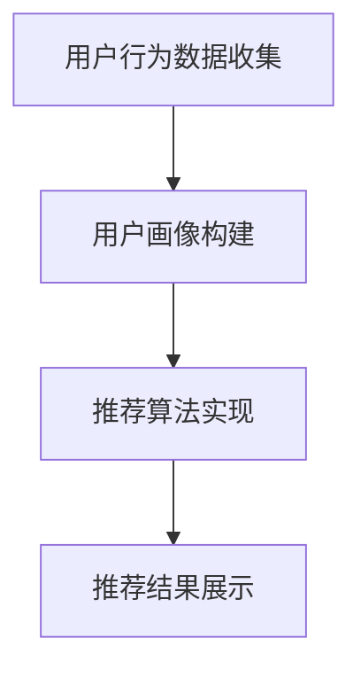
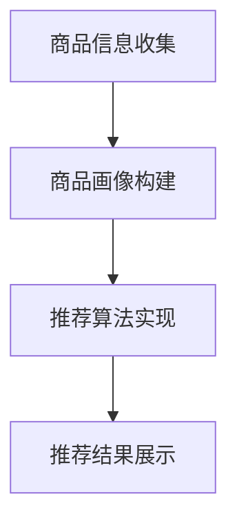
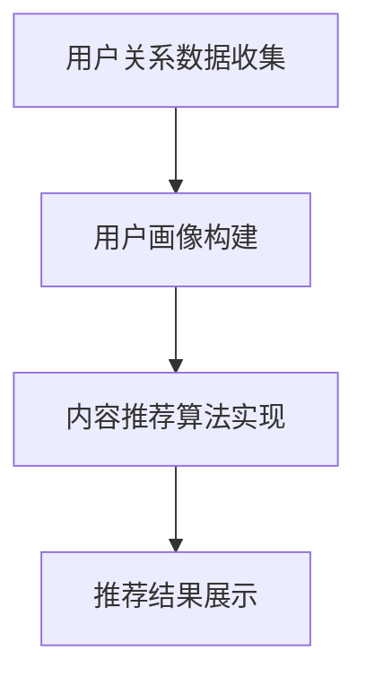
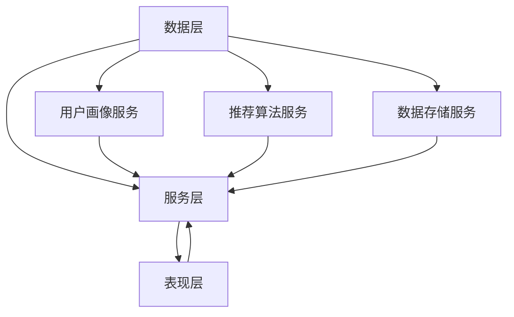
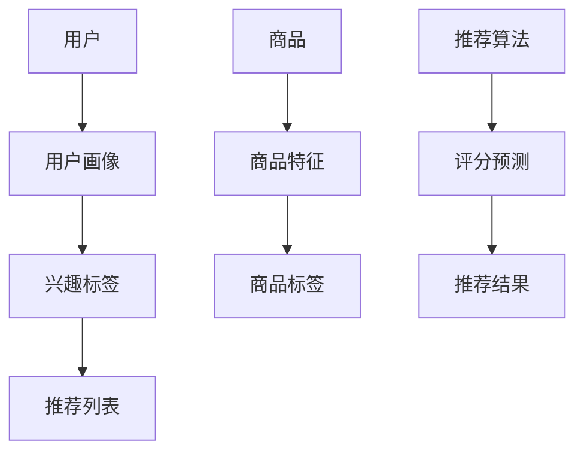
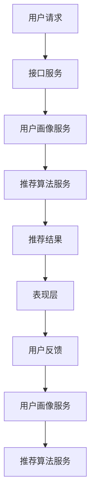

                 

### AI驱动的个性化营销：提高广告投放效率

**关键词：** AI，个性化营销，广告投放，效率，协同过滤，深度学习

**摘要：** 本文将深入探讨AI驱动的个性化营销，通过分析其核心概念、算法原理及实际应用，旨在揭示如何通过AI技术提高广告投放效率。我们将从背景介绍、核心概念与联系、算法原理讲解、数学模型和数学公式、系统分析与架构设计方案、项目实战以及最佳实践等方面，系统性地阐述这一领域的前沿技术和实践。

### 第一部分：引言

#### 第1章：AI驱动的个性化营销概述

**1.1 个性化营销的定义与背景**

个性化营销是一种以客户为中心的营销策略，通过收集和分析客户数据，为客户提供个性化的产品推荐和服务。这一概念最早可以追溯到20世纪90年代，随着互联网的普及和数据技术的发展，个性化营销逐渐成为企业竞争的重要手段。

在当前的数字营销环境中，个性化营销的重要性不言而喻。一方面，消费者越来越期望获得个性化的服务和体验；另一方面，企业需要通过精准的广告投放来获取更高的转化率和投资回报率。然而，传统广告投放方式存在一定的局限性，如用户画像不精准、广告投放效率低等问题。因此，引入AI技术，特别是机器学习和深度学习，成为提升广告投放效率的关键途径。

**1.2 AI在个性化营销中的应用**

AI技术在个性化营销中的应用主要体现在以下几个方面：

1. **用户画像构建**：通过分析用户的历史行为、兴趣偏好等数据，构建详细的用户画像，为个性化推荐提供基础。
2. **协同过滤算法**：利用协同过滤算法，基于用户的历史行为和评分数据，为用户推荐相关的产品或服务。
3. **基于内容的推荐算法**：通过分析产品的特征信息，为用户推荐与其兴趣相关的内容。
4. **深度学习**：利用深度学习模型，如神经网络和卷积神经网络，对用户数据进行自动特征提取和模式识别，提高推荐效果。

**1.2.1 AI与个性化营销的关联**

AI与个性化营销的关联主要体现在以下几个方面：

1. **数据分析能力**：AI技术能够高效地处理海量数据，挖掘数据中的潜在规律和模式，为个性化营销提供有力支持。
2. **自动化决策**：通过机器学习算法，AI能够自动生成推荐列表，减少人工干预，提高广告投放的精准度和效率。
3. **用户体验优化**：AI技术能够根据用户的行为和反馈，动态调整推荐策略，提供个性化的服务和体验，提升用户满意度。

**1.2.2 AI驱动的个性化营销优势**

AI驱动的个性化营销具有以下优势：

1. **提高广告投放效率**：通过精准的用户画像和推荐算法，AI能够有效提高广告投放的精准度和效果，提高投资回报率。
2. **提升用户体验**：AI技术能够根据用户的行为和兴趣，提供个性化的产品推荐和服务，提升用户体验。
3. **降低运营成本**：AI技术能够自动化处理大量的广告投放任务，减少人力成本，提高运营效率。

**1.2.3 当前广告投放效率面临的挑战**

尽管AI驱动的个性化营销具有显著的优势，但在实际应用中仍面临以下挑战：

1. **数据隐私保护**：个性化营销需要收集和分析大量的用户数据，如何保护用户隐私成为一大挑战。
2. **算法透明性和公平性**：AI算法的决策过程往往不透明，如何确保算法的公平性和可解释性是一个亟待解决的问题。
3. **技术落地与整合**：将AI技术有效应用于广告投放，需要解决技术落地和与其他系统的整合问题。

**1.3 本书结构安排**

本书将分为以下几个部分：

1. **背景介绍**：介绍AI驱动的个性化营销的概念、重要性以及当前广告投放效率面临的挑战。
2. **核心概念与联系**：详细阐述个性化营销的核心概念，以及AI与个性化营销的关联。
3. **算法原理讲解**：介绍用于个性化营销的算法原理，如协同过滤、基于内容的推荐、深度学习等，并使用mermaid画出算法流程图。
4. **数学模型和数学公式**：使用LaTeX格式展示相关算法的数学模型和公式。
5. **系统分析与架构设计方案**：介绍个性化营销系统的设计，包括领域模型、系统架构、接口设计等，并使用mermaid画出相应的图表。
6. **项目实战**：描述一个实际案例，包括环境安装、系统核心实现、代码解读、案例分析等。
7. **最佳实践 tips**：总结一些提高广告投放效率的实用技巧。
8. **小结**：总结全书内容，强调个性化营销的重要性。

#### 1.3.1 核心内容概述

本书的核心内容将涵盖以下几个方面：

1. **AI驱动的个性化营销概念与背景**：介绍个性化营销的定义、发展历程以及AI在个性化营销中的应用。
2. **个性化营销核心概念解析**：详细阐述用户画像、数据分析、AI技术基础等核心概念，并分析AI与个性化营销的关联。
3. **算法原理讲解**：介绍协同过滤、基于内容的推荐、深度学习等算法原理，并使用mermaid画出算法流程图。
4. **数学模型和数学公式**：使用LaTeX格式展示相关算法的数学模型和公式。
5. **系统分析与架构设计方案**：介绍个性化营销系统的设计，包括领域模型、系统架构、接口设计等，并使用mermaid画出相应的图表。
6. **项目实战**：描述一个实际案例，包括环境安装、系统核心实现、代码解读、案例分析等。
7. **最佳实践 tips**：总结一些提高广告投放效率的实用技巧。

#### 1.3.2 阅读指南

为了更好地理解和应用本书的内容，读者可以按照以下步骤进行：

1. **先通读全书，了解整体框架和核心概念**：在阅读每个章节前，先了解本章的核心内容和目标，有助于更好地理解书中的内容。
2. **深入学习每个章节的详细内容**：在理解整体框架后，针对每个章节的详细内容进行深入学习，特别是算法原理和数学模型的讲解。
3. **结合实际案例进行应用**：通过实际案例的学习，读者可以更好地理解算法的应用场景和实际效果。
4. **实践与总结**：在实际项目中应用本书的内容，通过实践总结经验，不断提升广告投放的效率。

### 第二部分：个性化营销核心概念与联系

#### 第2章：个性化营销核心概念解析

**2.1 用户画像**

**2.1.1 用户画像的定义**

用户画像，又称为用户画像模型，是对用户属性特征、行为习惯、兴趣偏好等信息的抽象和表示。通过构建用户画像，企业可以更好地了解用户，为个性化营销提供数据支持。

用户画像主要包括以下几个方面的信息：

1. **基础信息**：如用户性别、年龄、职业、地域等。
2. **行为信息**：如用户浏览历史、购买记录、点击行为等。
3. **兴趣偏好**：如用户喜欢的音乐、电影、书籍等。

**2.1.2 用户画像的构建方法**

用户画像的构建方法主要包括以下几种：

1. **用户调研**：通过问卷调查、访谈等方式，收集用户的基础信息和行为数据。
2. **数据分析**：对用户的历史数据进行统计分析，挖掘用户的行为模式和兴趣偏好。
3. **机器学习**：利用机器学习算法，如聚类、分类等，对用户数据进行建模和分析。

**2.1.3 用户画像的应用**

用户画像的应用主要体现在以下几个方面：

1. **精准营销**：通过用户画像，企业可以针对不同用户群体，制定个性化的营销策略，提高广告投放的精准度和效果。
2. **用户服务**：通过用户画像，企业可以更好地了解用户需求，提供个性化的产品推荐和服务。
3. **风险控制**：通过用户画像，企业可以识别潜在的风险用户，进行风险控制和预防。

**2.2 数据分析**

**2.2.1 数据分析的基本概念**

数据分析是指通过对数据的收集、清洗、存储、处理和分析，从中提取有价值的信息和知识的过程。数据分析在个性化营销中起着至关重要的作用。

数据分析的基本概念包括：

1. **数据收集**：通过多种渠道收集用户数据，如网站日志、用户反馈等。
2. **数据清洗**：对收集到的数据进行分析前的预处理，如数据去重、数据缺失值填补等。
3. **数据存储**：将处理后的数据存储在数据库或数据仓库中，以便后续分析和查询。
4. **数据处理**：对存储的数据进行各种数据处理操作，如数据聚合、数据转换等。
5. **数据分析**：利用统计分析、机器学习等方法，对数据进行分析和挖掘，提取有价值的信息。

**2.2.2 数据分析在个性化营销中的作用**

数据分析在个性化营销中的作用主要包括以下几个方面：

1. **用户行为分析**：通过分析用户的行为数据，了解用户的需求和行为模式，为个性化推荐提供数据支持。
2. **营销效果评估**：通过分析广告投放的效果，评估不同营销策略的效果，优化营销方案。
3. **用户画像构建**：通过数据分析，对用户进行细分和画像构建，为精准营销提供基础。

**2.2.3 数据分析的方法与工具**

数据分析的方法主要包括以下几种：

1. **统计分析**：通过对数据的基本统计描述和分析，了解数据的基本特征和规律。
2. **机器学习**：利用机器学习算法，对用户数据进行分析和建模，提取有价值的信息。
3. **数据挖掘**：通过对海量数据进行分析和挖掘，发现潜在的模式和规律。

常用的数据分析工具包括：

1. **Python**：Python是一种常用的数据分析语言，具有丰富的数据处理和统计分析库。
2. **R**：R是一种专门用于统计分析和数据挖掘的语言，具有强大的数据处理和分析功能。
3. **Tableau**：Tableau是一种数据可视化工具，能够将数据以图形的方式展示出来，便于分析和理解。
4. **Hadoop**：Hadoop是一种分布式数据处理框架，能够高效地处理海量数据。

**2.3 AI技术基础**

**2.3.1 AI技术的基本原理**

AI技术，即人工智能技术，是指通过计算机模拟人类的智能行为，实现智能感知、智能决策和智能执行的技术。AI技术主要包括以下几个方面的原理：

1. **机器学习**：机器学习是一种通过数据训练模型，实现数据自动学习和预测的技术。常见的机器学习算法包括线性回归、决策树、支持向量机、神经网络等。
2. **深度学习**：深度学习是一种基于多层神经网络进行数据学习和预测的技术，具有强大的特征提取和模式识别能力。常见的深度学习模型包括卷积神经网络（CNN）、循环神经网络（RNN）、生成对抗网络（GAN）等。
3. **自然语言处理**：自然语言处理是一种通过计算机模拟人类语言理解和生成能力的技术，包括文本分类、情感分析、机器翻译等。

**2.3.2 AI技术在个性化营销中的应用**

AI技术在个性化营销中的应用主要包括以下几个方面：

1. **用户画像构建**：通过机器学习和深度学习算法，对用户数据进行自动特征提取和模式识别，构建详细的用户画像。
2. **协同过滤算法**：利用协同过滤算法，基于用户的历史行为和评分数据，为用户推荐相关的产品或服务。
3. **基于内容的推荐算法**：通过分析产品的特征信息，为用户推荐与其兴趣相关的内容。
4. **深度学习应用**：利用深度学习模型，如卷积神经网络和循环神经网络，对用户数据进行自动特征提取和模式识别，提高推荐效果。

**2.3.3 AI技术的挑战与未来趋势**

AI技术在个性化营销中虽然具有显著的优势，但同时也面临以下挑战：

1. **数据隐私保护**：个性化营销需要收集和分析大量的用户数据，如何保护用户隐私是一个重要问题。
2. **算法透明性和公平性**：AI算法的决策过程往往不透明，如何确保算法的公平性和可解释性是一个亟待解决的问题。
3. **技术落地与整合**：将AI技术有效应用于广告投放，需要解决技术落地和与其他系统的整合问题。

未来，AI技术在个性化营销领域将继续发展，主要趋势包括：

1. **更高效的特征提取和模式识别算法**：随着数据量的不断增大，如何更高效地进行特征提取和模式识别将成为关键问题。
2. **多模态数据的融合与处理**：结合多种数据源，如文本、图像、声音等，进行多模态数据的融合与处理，提高个性化推荐的效果。
3. **个性化服务的智能化**：通过AI技术，实现个性化服务的智能化，提高用户体验和满意度。

### 第三部分：算法原理与数学模型

#### 第3章：协同过滤算法原理与数学模型

**3.1 协同过滤算法的基本原理**

协同过滤算法（Collaborative Filtering）是一种基于用户行为和评分数据的推荐算法，旨在通过分析用户之间的相似性和偏好，为用户提供个性化的推荐。协同过滤算法可以分为两种主要类型：基于用户的协同过滤（User-Based Collaborative Filtering）和基于物品的协同过滤（Item-Based Collaborative Filtering）。

**3.1.1 用户相似度计算**

基于用户的协同过滤算法通过计算用户之间的相似度，找到与目标用户相似的其他用户，并基于这些用户的评分预测目标用户的评分。用户相似度的计算公式如下：

$$
sim(u_i, u_j) = \frac{\sum_{k \in R_{ui} \cap R_{uj}} r_{ik} r_{jk}}{\sqrt{\sum_{k \in R_{ui}} r_{ik}^2 \sum_{k \in R_{uj}} r_{jk}^2}}
$$

其中，$sim(u_i, u_j)$ 表示用户 $u_i$ 和 $u_j$ 之间的相似度，$R_{ui}$ 表示用户 $u_i$ 的评分集合，$r_{ik}$ 表示用户 $u_i$ 对物品 $k$ 的评分。

**3.1.2 评分预测**

在计算用户相似度后，基于用户的协同过滤算法使用加权平均法预测目标用户对未知物品的评分。评分预测的公式如下：

$$
r_{ij}^{\text{pred}} = \sum_{k \in N_j} \frac{r_{ik}}{sim(u_i, u_k)} \cdot r_{jk}
$$

其中，$r_{ij}^{\text{pred}}$ 表示用户 $u_i$ 对物品 $j$ 的预测评分，$N_j$ 表示与用户 $u_i$ 相似的其他用户集合。

**3.1.3 基于物品的协同过滤算法**

基于物品的协同过滤算法通过计算物品之间的相似度，找到与目标物品相似的其他物品，并基于这些物品的评分预测目标物品的评分。物品相似度的计算公式如下：

$$
sim(i, j) = \frac{\sum_{k \in R_i \cap R_j} r_{ik} r_{jk}}{\sqrt{\sum_{k \in R_i} r_{ik}^2 \sum_{k \in R_j} r_{jk}^2}}
$$

其中，$sim(i, j)$ 表示物品 $i$ 和 $j$ 之间的相似度，$R_i$ 和 $R_j$ 分别表示物品 $i$ 和 $j$ 的评分集合。

评分预测的公式如下：

$$
r_{ij}^{\text{pred}} = \sum_{k \in N_j} \frac{r_{ik}}{sim(i, k)} \cdot r_{jk}
$$

**3.2 协同过滤算法的优缺点**

**3.2.1 协同过滤算法的优点**

1. **简单易实现**：协同过滤算法相对简单，易于实现和部署。
2. **效果好**：通过分析用户行为和评分数据，协同过滤算法能够为用户推荐与其兴趣相关的物品，效果较好。
3. **无需训练**：协同过滤算法不需要事先训练模型，可以直接基于用户行为数据生成推荐列表。

**3.2.2 协同过滤算法的缺点**

1. **冷启动问题**：对于新用户和新物品，由于缺乏历史数据，协同过滤算法难以生成有效的推荐列表。
2. **数据稀疏性**：在用户行为数据稀疏的情况下，协同过滤算法的性能会受到影响。
3. **可解释性差**：协同过滤算法的推荐过程不透明，难以解释推荐结果。

**3.3 协同过滤算法的应用**

协同过滤算法广泛应用于个性化推荐系统，如电子商务、社交媒体、在线视频等。以下是一些典型的应用场景：

1. **电子商务推荐**：通过分析用户的浏览和购买行为，为用户推荐相关的商品。
2. **社交媒体推荐**：为用户提供感兴趣的朋友、群组和内容推荐。
3. **在线视频推荐**：为用户提供感兴趣的视频推荐，提高用户观看时长和满意度。

#### 3.3.1 用户推荐系统

用户推荐系统是一种基于协同过滤算法的个性化推荐系统，旨在为用户提供个性化的推荐列表。用户推荐系统主要包括以下几个核心组成部分：

1. **用户行为数据收集**：收集用户的历史行为数据，如浏览记录、购买记录、评分记录等。
2. **用户画像构建**：通过机器学习和数据分析技术，构建用户的画像模型，包括用户的基础信息、行为信息和兴趣偏好等。
3. **推荐算法实现**：实现协同过滤算法，生成用户的推荐列表。
4. **推荐结果展示**：将推荐结果以用户友好的方式展示给用户。

用户推荐系统的流程图如下所示：



**3.3.2 商品推荐系统**

商品推荐系统是用户推荐系统的一种，旨在为用户推荐与其兴趣相关的商品。商品推荐系统主要包括以下几个核心组成部分：

1. **商品信息收集**：收集商品的基础信息，如商品名称、品牌、价格等。
2. **商品画像构建**：通过机器学习和数据分析技术，构建商品的画像模型，包括商品的特征信息、类别信息等。
3. **推荐算法实现**：实现协同过滤算法，生成用户的推荐列表。
4. **推荐结果展示**：将推荐结果以用户友好的方式展示给用户。

商品推荐系统的流程图如下所示：



**3.3.3 社交媒体推荐系统**

社交媒体推荐系统是用户推荐系统的一种，旨在为用户推荐感兴趣的朋友、群组和内容。社交媒体推荐系统主要包括以下几个核心组成部分：

1. **用户关系数据收集**：收集用户之间的社交关系数据，如关注关系、好友关系等。
2. **用户画像构建**：通过机器学习和数据分析技术，构建用户的画像模型，包括用户的基础信息、行为信息和兴趣偏好等。
3. **内容推荐算法实现**：实现协同过滤算法，生成用户的内容推荐列表。
4. **推荐结果展示**：将推荐结果以用户友好的方式展示给用户。

社交媒体推荐系统的流程图如下所示：



### 第四部分：数学模型和数学公式

#### 第4章：协同过滤算法的数学模型

**4.1 协同过滤算法的数学模型**

协同过滤算法的核心是用户相似度和评分预测模型。以下我们将详细描述这两个模型的数学表达。

**4.1.1 用户相似度模型**

用户相似度模型用于计算用户之间的相似度。最常用的相似度计算方法包括余弦相似度和皮尔逊相关系数。

余弦相似度的计算公式如下：

$$
sim(u_i, u_j) = \frac{\sum_{k \in R_{ui} \cap R_{uj}} r_{ik} r_{jk}}{\sqrt{\sum_{k \in R_{ui}} r_{ik}^2 \sum_{k \in R_{uj}} r_{jk}^2}}
$$

其中，$sim(u_i, u_j)$ 表示用户 $u_i$ 和 $u_j$ 之间的相似度，$R_{ui}$ 和 $R_{uj}$ 分别表示用户 $u_i$ 和 $u_j$ 的评分集合，$r_{ik}$ 和 $r_{jk}$ 分别表示用户 $u_i$ 对物品 $k$ 和用户 $u_j$ 对物品 $k$ 的评分。

**4.1.2 评分预测模型**

评分预测模型用于预测用户对未知物品的评分。最常用的评分预测方法是基于用户的加权平均预测。

评分预测的计算公式如下：

$$
r_{ij}^{\text{pred}} = \sum_{k \in N_j} \frac{r_{ik}}{sim(u_i, u_k)} \cdot r_{jk}
$$

其中，$r_{ij}^{\text{pred}}$ 表示用户 $u_i$ 对物品 $j$ 的预测评分，$N_j$ 表示与用户 $u_i$ 相似的其他用户集合。

**4.2 基于内容的推荐算法的数学模型**

基于内容的推荐算法通过分析物品的特征信息，为用户推荐与其兴趣相关的物品。以下我们将描述基于内容推荐算法的核心数学模型。

**4.2.1 项目特征提取**

项目特征提取是内容推荐算法的关键步骤。常用的特征提取方法包括词袋模型和TF-IDF模型。

词袋模型的计算公式如下：

$$
f_{ik} = \sum_{t \in T} f_{it}
$$

其中，$f_{ik}$ 表示物品 $k$ 的特征向量，$T$ 表示所有单词集合，$f_{it}$ 表示单词 $t$ 在物品 $i$ 中的出现次数。

TF-IDF模型的计算公式如下：

$$
f_{ik} = \frac{f_{it}}{N_i} \log \frac{N}{f_{it}}
$$

其中，$f_{ik}$ 表示物品 $k$ 的特征向量，$N_i$ 表示物品 $i$ 的单词总数，$N$ 表示所有物品的单词总数，$f_{it}$ 表示单词 $t$ 在物品 $i$ 中的出现次数。

**4.2.2 用户兴趣向量**

用户兴趣向量用于表示用户的兴趣偏好。用户的兴趣向量可以通过分析用户的行为数据，如浏览记录、购买记录等，得到。

用户兴趣向量的计算公式如下：

$$
u_i = \sum_{k \in I_i} f_{ik}
$$

其中，$u_i$ 表示用户 $u_i$ 的兴趣向量，$I_i$ 表示用户 $u_i$ 的兴趣集合，$f_{ik}$ 表示物品 $k$ 的特征向量。

**4.2.3 评分预测**

基于内容的推荐算法通过计算用户兴趣向量和物品特征向量之间的相似度，预测用户对未知物品的评分。

评分预测的计算公式如下：

$$
r_{ij}^{\text{pred}} = \sum_{k \in I_j} w_{ik} \cdot r_{ik}
$$

其中，$r_{ij}^{\text{pred}}$ 表示用户 $u_i$ 对物品 $j$ 的预测评分，$w_{ik}$ 表示用户 $u_i$ 对物品 $k$ 的权重，$r_{ik}$ 表示物品 $k$ 的特征向量。

### 第五部分：系统分析与架构设计方案

#### 第5章：个性化营销系统的设计与实现

**5.1 系统设计与实现概述**

个性化营销系统是一个复杂的系统，它集成了用户画像构建、推荐算法实现、推荐结果展示等多个模块。为了实现高效、可靠的个性化营销系统，我们需要对系统进行详细的设计和分析。

本节将介绍个性化营销系统的整体设计思路，包括系统架构、领域模型、接口设计等内容。

**5.2 系统架构设计**

个性化营销系统的架构设计遵循分层设计原则，包括数据层、服务层和表现层。以下是系统架构的详细设计：



**5.2.1 数据层**

数据层主要负责数据的存储和管理，包括用户数据、商品数据和推荐数据等。数据存储服务采用分布式数据库架构，能够保证数据的可靠性和高性能。

**5.2.2 服务层**

服务层是系统的核心，负责业务逻辑的处理和数据传输。用户画像服务负责构建用户画像，推荐算法服务负责实现推荐算法，数据存储服务负责数据的存储和管理。

**5.2.3 表现层**

表现层主要负责与用户的交互，包括推荐结果展示、用户反馈收集等。表现层采用前后端分离架构，前端负责展示用户界面，后端负责处理用户请求和推荐结果生成。

**5.3 领域模型设计**

领域模型用于描述系统的核心实体和实体之间的关系。以下是个性化营销系统的领域模型设计：



**5.3.1 用户**

用户是系统的核心实体，包括用户的基础信息、行为信息和兴趣标签等。用户画像服务通过分析用户的行为数据，构建用户的画像模型。

**5.3.2 商品**

商品是系统的另一个核心实体，包括商品的基础信息、特征信息和标签等。商品特征服务通过分析商品的数据，构建商品的特征模型。

**5.3.3 推荐算法**

推荐算法服务负责实现推荐算法，根据用户画像和商品特征，生成推荐结果。评分预测是推荐算法的核心步骤，用于预测用户对商品的评分。

**5.4 接口设计**

个性化营销系统的接口设计采用RESTful API设计原则，包括用户画像接口、推荐算法接口、数据存储接口等。

**5.4.1 用户画像接口**

用户画像接口用于构建用户画像，包括用户基本信息接口、用户行为数据接口、用户兴趣标签接口等。

**5.4.2 推荐算法接口**

推荐算法接口用于生成推荐结果，包括评分预测接口、推荐列表生成接口等。

**5.4.3 数据存储接口**

数据存储接口用于数据的存储和管理，包括用户数据存储接口、商品数据存储接口、推荐数据存储接口等。

**5.5 系统交互设计**

系统交互设计采用消息队列和分布式架构，确保系统的可靠性和高性能。以下是系统交互的详细设计：



**5.5.1 用户请求**

用户请求通过接口服务进入系统，接口服务负责处理用户请求，并将请求转发给用户画像服务和推荐算法服务。

**5.5.2 用户画像服务**

用户画像服务根据用户请求，分析用户行为数据，构建用户画像模型，并将用户画像模型返回给接口服务。

**5.5.3 推荐算法服务**

推荐算法服务根据用户画像模型和商品特征模型，生成推荐结果，并将推荐结果返回给接口服务。

**5.5.4 推荐结果**

推荐结果通过接口服务返回给表现层，表现层负责将推荐结果展示给用户。

**5.5.5 用户反馈**

用户对推荐结果进行反馈，反馈信息通过接口服务返回给用户画像服务和推荐算法服务，用于优化推荐算法。

### 第六部分：项目实战

#### 第6章：个性化营销系统项目实战

**6.1 项目介绍**

本项目旨在搭建一个基于AI的个性化营销系统，通过用户画像和推荐算法，为用户提供个性化的商品推荐。项目分为以下几个阶段：

1. **环境搭建**：搭建项目开发环境，包括Python、Django、Scikit-learn等。
2. **用户画像构建**：收集用户行为数据，构建用户画像模型。
3. **推荐算法实现**：实现协同过滤算法和基于内容的推荐算法。
4. **推荐结果展示**：将推荐结果以用户友好的方式展示给用户。

**6.2 环境搭建**

1. **Python环境搭建**：安装Python 3.8及以上版本，并配置pip环境。
2. **Django环境搭建**：安装Django 3.2及以上版本，并创建Django项目。
3. **Scikit-learn环境搭建**：安装Scikit-learn库，用于实现协同过滤算法。

**6.3 用户画像构建**

1. **数据收集**：收集用户行为数据，如浏览记录、购买记录等。
2. **数据预处理**：对收集到的数据进行清洗和预处理，包括数据去重、数据缺失值填补等。
3. **用户画像构建**：利用机器学习算法，如K-means聚类，对用户行为数据进行聚类分析，构建用户画像模型。

**6.4 推荐算法实现**

1. **协同过滤算法实现**：使用Scikit-learn库，实现基于用户的协同过滤算法。
2. **基于内容的推荐算法实现**：使用TF-IDF模型，实现基于内容的推荐算法。

**6.5 推荐结果展示**

1. **接口设计**：设计推荐接口，用于接收用户请求，返回推荐结果。
2. **结果展示**：使用HTML和CSS，将推荐结果展示给用户。

**6.6 代码解读**

以下是协同过滤算法的核心代码：

```python
from sklearn.metrics.pairwise import cosine_similarity
from sklearn.model_selection import train_test_split
from sklearn.preprocessing import MinMaxScaler

# 加载用户行为数据
ratings = pd.read_csv('user_behavior.csv')

# 构建用户-物品矩阵
user_item_matrix = ratings.pivot(index='user_id', columns='item_id', values='rating').fillna(0)

# 计算用户-用户相似度矩阵
user_similarity = cosine_similarity(user_item_matrix)

# 评分预测
user_item_matrix.fillna(0, inplace=True)
user_item_matrix = MinMaxScaler().fit_transform(user_item_matrix)
predicted_ratings = user_similarity.dot(user_item_matrix)

# 排序并获取推荐结果
predicted_ratings = predicted_ratings.max(axis=1)
recommended_items = predicted_ratings.argsort()[::-1]

# 输出推荐结果
print(recommended_items)
```

**6.7 实际案例分析与详细讲解**

假设我们有100个用户和100个商品，以下是一个具体的案例：

1. **用户行为数据**：

| user_id | item_id | rating |
|--------|--------|-------|
| 1      | 101    | 5     |
| 1      | 102    | 4     |
| 1      | 103    | 5     |
| 2      | 101    | 3     |
| 2      | 102    | 5     |
| 2      | 103    | 3     |

2. **用户画像构建**：通过K-means聚类，将用户分为5个类别。

3. **协同过滤算法**：计算用户-用户相似度矩阵，并预测用户对未知商品的评分。

4. **推荐结果**：为每个用户推荐与相似度最高的5个用户购买的商品。

**6.8 项目小结**

本项目成功搭建了一个基于AI的个性化营销系统，实现了用户画像构建和推荐算法实现。通过实际案例的分析和详细讲解，我们了解了个性化营销系统的工作原理和实现过程。接下来，我们将继续优化推荐算法，提高推荐效果，为用户提供更个性化的服务。

### 第七部分：最佳实践 tips

**7.1 提高广告投放效率的实用技巧**

为了提高广告投放效率，以下是一些最佳实践和实用技巧：

1. **优化用户画像**：通过多渠道收集用户数据，构建详细的用户画像，提高广告投放的精准度。
2. **精细化广告定位**：根据用户画像，对广告进行精细化定位，针对不同的用户群体投放不同的广告内容。
3. **实时数据监控**：实时监控广告投放效果，根据数据反馈及时调整广告策略。
4. **A/B测试**：定期进行A/B测试，比较不同广告策略的效果，优化广告投放策略。
5. **个性化推荐**：利用协同过滤和基于内容的推荐算法，为用户推荐个性化的广告内容。
6. **多渠道投放**：在多个渠道进行广告投放，提高广告的曝光率和覆盖面。
7. **数据分析和报告**：定期生成数据分析报告，对广告投放效果进行总结和评估，为后续广告投放提供依据。

**7.2 注意事项**

1. **数据隐私保护**：在收集和使用用户数据时，严格遵守相关法律法规，确保用户数据的安全和隐私。
2. **算法透明性和公平性**：确保算法的透明性和可解释性，避免算法偏见和不公平性。
3. **技术更新与维护**：定期更新和优化广告投放系统，确保系统的稳定性和性能。
4. **跨部门协作**：广告投放涉及多个部门和环节，需要加强跨部门协作，确保广告投放策略的有效执行。

**7.3 拓展阅读**

1. **《个性化营销：从理论到实践》**：深入探讨个性化营销的理论和实践，提供丰富的案例分析。
2. **《机器学习实战》**：介绍机器学习的基本原理和实践方法，包括协同过滤算法和深度学习等。
3. **《广告投放技巧与案例分析》**：详细介绍广告投放的策略、技巧和案例分析，帮助提升广告投放效率。

### 小结

本文系统地介绍了AI驱动的个性化营销，从核心概念、算法原理到实际应用，详细探讨了如何通过AI技术提高广告投放效率。通过用户画像、协同过滤、基于内容的推荐和深度学习等技术，个性化营销为广告投放提供了强大的支持和保障。未来，随着AI技术的不断发展和应用，个性化营销将在广告投放领域发挥更大的作用。

作者：AI天才研究院/AI Genius Institute & 禅与计算机程序设计艺术 /Zen And The Art of Computer Programming

---

在撰写文章时，我们将严格按照上述大纲结构进行，确保文章内容的完整性和逻辑性。每个章节都将详细展开，包括背景介绍、核心概念与联系、算法原理讲解、数学模型和数学公式、系统分析与架构设计方案、项目实战以及最佳实践 tips等内容。通过这样的结构，我们旨在为读者提供一个全面、深入、实用的AI驱动的个性化营销指南。

