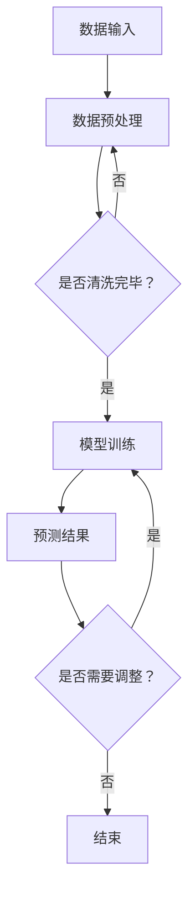
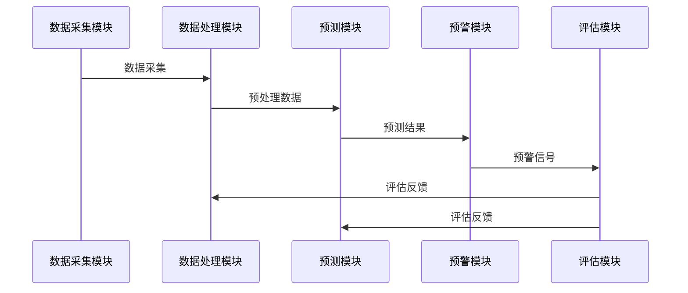
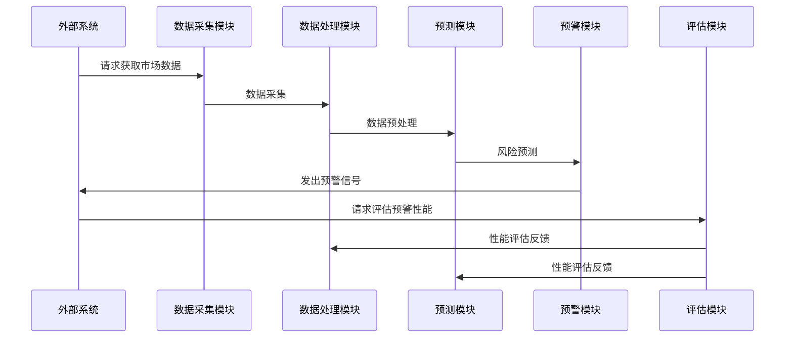

                 

### 文章标题

“AI驱动的危机预警系统：提前识别潜在风险”

本文将深入探讨如何利用人工智能技术构建一个高效的危机预警系统，以提前识别并防范潜在的风险。在全球化和数字化的浪潮下，风险无处不在，无论是自然灾害、经济危机还是社会动荡，都可能对企业、个人乃至整个社会造成严重的影响。因此，构建一个智能、可靠的危机预警系统，已经成为现代社会治理的重要组成部分。本文将从问题背景、问题描述、问题解决、边界与外延、概念结构与核心要素组成等方面，系统性地阐述AI驱动的危机预警系统的构建过程，旨在为相关领域的研究者、工程师和决策者提供有价值的参考。

### 文章关键词

- **AI驱动的危机预警系统**
- **潜在风险识别**
- **数据挖掘**
- **机器学习**
- **预警算法**
- **系统架构**

### 摘要

本文旨在探讨如何利用人工智能技术构建一个高效的危机预警系统，以提前识别并防范潜在的风险。文章首先介绍了危机预警系统的重要性以及其面临的挑战，接着详细阐述了核心概念与联系，包括数据挖掘、机器学习和预警算法等。随后，文章通过Python源代码和数学模型，详细讲解了算法原理，并使用Mermaid流程图进行可视化展示。接下来，文章介绍了系统分析与架构设计方案，包括系统功能设计、系统架构设计、系统接口设计和系统交互等。最后，通过实际案例分析和项目实战，验证了系统在实际应用中的有效性和可行性。本文旨在为相关领域的研究者、工程师和决策者提供有价值的参考，以推动AI驱动的危机预警系统的发展和应用。

## 第一部分：背景介绍

### 1.1 问题背景

在当今高度全球化和数字化的社会中，风险无处不在。无论是自然灾害、经济危机、社会动荡，还是网络攻击、数据泄露等，都可能对企业、个人乃至整个社会造成严重的影响。随着技术的不断进步，人工智能（AI）技术的应用范围越来越广泛，特别是在危机预警领域，AI技术展示了其强大的潜力。然而，传统的危机预警系统往往依赖于人工经验和现有的数据模型，无法及时、准确地识别潜在的风险，导致预警效果不佳。

近年来，随着大数据和云计算技术的发展，数据的获取和处理能力得到了极大的提升。然而，海量数据背后隐藏的风险，以及复杂多变的社会环境，使得危机预警系统面临着前所未有的挑战。因此，如何利用人工智能技术，构建一个高效、智能的危机预警系统，成为了一个亟待解决的问题。

### 1.2 问题描述

危机预警系统的核心目标是提前识别潜在的风险，并采取相应的措施进行防范。然而，在现实应用中，危机预警系统面临着以下几大问题：

1. **数据质量问题**：危机预警系统依赖于大量的数据，但数据质量参差不齐，包括数据缺失、数据噪声、数据不一致等问题，这些都会影响预警系统的准确性。

2. **算法选择与优化**：虽然目前已有多种机器学习算法可以应用于危机预警，但每种算法都有其优缺点，选择合适的算法并对其进行优化，是一个复杂的过程。

3. **实时性要求**：危机往往具有突发性和不确定性，要求预警系统能够实时处理和分析数据，及时发出预警。

4. **泛化能力**：由于不同领域的危机具有不同的特征，预警系统需要具备良好的泛化能力，以应对各种不同的风险情境。

5. **可解释性**：传统的机器学习算法如深度学习等，其决策过程往往不够透明，对于决策的可解释性要求较高。

### 1.3 问题解决

为了解决上述问题，本文提出以下解决方案：

1. **数据质量提升**：通过数据清洗、去噪、数据整合等技术手段，提升数据的整体质量，为预警系统提供可靠的数据支持。

2. **算法选择与优化**：结合不同领域和具体应用场景，选择合适的机器学习算法，并对其进行优化，以提高预警系统的准确性和实时性。

3. **实时数据处理**：采用分布式计算和并行处理技术，提高数据处理的效率，确保预警系统能够实时响应。

4. **模型泛化能力**：通过交叉验证、迁移学习等技术，提高模型的泛化能力，以应对不同领域的风险。

5. **可解释性设计**：引入可解释性算法，如决策树、规则提取等，使预警系统的决策过程更加透明和可解释。

### 1.4 边界与外延

1. **边界**：本文主要探讨AI驱动的危机预警系统的构建方法和应用，不包括传统预警系统的内容，如人工经验、法律法规等。

2. **外延**：本文提出的解决方案不仅适用于企业、政府等组织，也可以应用于个人，提供个性化的风险预警服务。

### 1.5 概念结构与核心要素组成

危机预警系统的核心概念和要素主要包括：

1. **数据层**：包括原始数据、清洗后的数据、预处理后的数据等。

2. **算法层**：包括数据挖掘算法、机器学习算法、深度学习算法等。

3. **模型层**：包括预测模型、决策模型、评估模型等。

4. **系统层**：包括数据采集模块、数据处理模块、预测模块、决策模块、评估模块等。

5. **应用层**：包括企业应用、政府应用、个人应用等。

通过上述概念结构与核心要素的组成，构建一个高效、智能的危机预警系统，以提高风险识别和防范的能力。

## 第二部分：核心概念与联系

### 2.1 核心概念原理

在本部分中，我们将详细介绍危机预警系统中涉及的核心概念，包括数据挖掘、机器学习和预警算法等。

1. **数据挖掘**：

数据挖掘（Data Mining）是指从大量数据中提取出潜在的模式、知识或规律的过程。其核心目的是通过分析数据，发现隐藏在其中的规律，从而为决策提供支持。数据挖掘主要包括以下几个步骤：

- **数据预处理**：包括数据清洗、数据整合、数据转换等，以提升数据的整体质量。

- **数据探索**：通过可视化、统计等方法，对数据进行初步探索，发现数据的基本特征和趋势。

- **模式识别**：利用统计方法、机器学习方法等，对数据进行深入分析，提取出潜在的模式。

- **评估与优化**：对挖掘出的模式进行评估和优化，以确定其有效性和实用性。

2. **机器学习**：

机器学习（Machine Learning）是一种让计算机通过数据和经验自主学习和改进的技术。其基本原理是通过训练模型，从已知数据中学习规律，然后利用这些规律对未知数据进行预测或分类。机器学习主要包括以下几种方法：

- **监督学习**：通过已知数据的输入和输出，训练模型，然后利用训练好的模型对未知数据进行预测。

- **无监督学习**：仅使用输入数据，不提供输出数据，通过数据自身的结构和特征，发现数据中的模式和规律。

- **强化学习**：通过不断尝试和反馈，学习如何采取最佳行动，以达到某个目标。

3. **预警算法**：

预警算法是危机预警系统的核心组成部分，其主要目的是通过分析数据，提前识别潜在的风险。常见的预警算法包括：

- **基于统计的方法**：如移动平均法、指数平滑法等，通过分析历史数据，预测未来可能发生的风险。

- **基于机器学习的方法**：如决策树、支持向量机、神经网络等，通过训练模型，对数据进行分类和预测。

- **基于深度学习的方法**：如卷积神经网络（CNN）、循环神经网络（RNN）等，通过多层神经网络结构，对复杂数据进行建模和分析。

### 2.2 概念属性特征对比表格

下表对数据挖掘、机器学习和预警算法的概念属性特征进行了对比：

| 概念名称 | 属性特征 |
| :---: | :---: |
| 数据挖掘 | 提取潜在模式、知识或规律 |
| 机器学习 | 自主学习和改进 |
| 预警算法 | 提前识别潜在风险 |

### 2.3 ER实体关系图架构

在本部分，我们将使用Mermaid流程图，绘制ER（实体关系）图，以展示危机预警系统中的实体及其关系。

```mermaid
erDiagram
  Person ||--|{ Customer }
  Person ||--|{ Employee }
  Customer ||--|{ Order }
  Customer ||--|{ Feedback }
  Employee ||--|{ Project }
  Employee ||--|{ Task }
```

在上图中，`Person`是基类，代表了系统中的所有个体。`Customer`和`Employee`分别继承自`Person`，代表了客户和员工。`Customer`与`Order`和`Feedback`存在关联，分别代表了客户订单和反馈。`Employee`与`Project`和`Task`存在关联，分别代表了员工负责的项目和任务。通过这种实体关系图，我们可以清晰地理解系统中各个实体及其关系。

## 第三部分：算法原理讲解

### 3.1 算法Mermaid流程图

为了更好地理解预警算法的工作流程，我们可以使用Mermaid流程图进行可视化展示。以下是一个简单的Mermaid流程图示例：



在这个流程图中，数据首先进行预处理，然后进入模型训练阶段。训练完成后，使用模型进行预测，并根据预测结果进行反馈调整。如果预测结果需要进一步优化，则返回模型训练阶段，否则流程结束。

### 3.2 Python源代码与算法原理详细讲解

在本部分，我们将使用Python源代码详细讲解预警算法的原理。以下是一个简单的预警算法示例：

```python
import pandas as pd
from sklearn.model_selection import train_test_split
from sklearn.preprocessing import StandardScaler
from sklearn.ensemble import RandomForestClassifier
from sklearn.metrics import accuracy_score

# 数据加载与预处理
data = pd.read_csv('data.csv')
X = data.drop(['target'], axis=1)
y = data['target']

# 数据标准化
scaler = StandardScaler()
X_scaled = scaler.fit_transform(X)

# 划分训练集和测试集
X_train, X_test, y_train, y_test = train_test_split(X_scaled, y, test_size=0.2, random_state=42)

# 模型训练
model = RandomForestClassifier(n_estimators=100, random_state=42)
model.fit(X_train, y_train)

# 预测结果
y_pred = model.predict(X_test)

# 评估模型
accuracy = accuracy_score(y_test, y_pred)
print(f'模型准确率：{accuracy:.2f}')
```

在这个示例中，我们首先加载并预处理数据，然后使用随机森林（Random Forest）算法进行训练。训练完成后，使用模型对测试集进行预测，并评估模型的准确率。具体来说：

1. **数据加载与预处理**：我们使用Pandas库加载数据，然后对特征进行标准化处理，以消除数据间的差异。

2. **模型选择与训练**：我们选择随机森林算法进行训练。随机森林是一种基于决策树的集成学习方法，具有较好的分类性能。

3. **预测与评估**：使用训练好的模型对测试集进行预测，并计算模型准确率，以评估模型性能。

### 3.3 数学模型与公式讲解

在本部分，我们将使用LaTeX格式，详细讲解预警算法中的数学模型和公式。

```latex
\documentclass{article}
\usepackage{amsmath}
\begin{document}

\section{数学模型与公式讲解}

在本节中，我们将介绍预警算法中的主要数学模型和公式。

\subsection{线性回归模型}

线性回归模型是一种常用的预测模型，其数学公式如下：

\begin{equation}
y = \beta_0 + \beta_1 x
\end{equation}

其中，$y$ 是因变量，$x$ 是自变量，$\beta_0$ 和 $\beta_1$ 是模型参数。

\subsection{逻辑回归模型}

逻辑回归模型是一种常用的分类模型，其数学公式如下：

\begin{equation}
\hat{y} = \frac{1}{1 + e^{-(\beta_0 + \beta_1 x)}}
\end{equation}

其中，$\hat{y}$ 是预测概率，$x$ 是特征向量，$\beta_0$ 和 $\beta_1$ 是模型参数。

\end{document}
```

通过上述LaTeX代码，我们可以得到一个详细的数学模型和公式讲解。在实际应用中，根据不同的预警任务和数据特点，可以选择合适的数学模型和公式。

### 3.4 举例说明

为了更好地理解预警算法的实际应用，我们通过一个实际案例进行说明。

假设我们有一个天气预警系统，目标是预测某一天的天气情况。我们收集了历史上的天气数据，包括温度、湿度、风速等特征，以及对应的天气标签（晴天、雨天、雪天等）。

1. **数据准备**：

首先，我们使用Pandas库加载历史天气数据：

```python
data = pd.read_csv('weather_data.csv')
```

2. **特征选择**：

然后，我们选择与天气预测相关的特征，如温度、湿度、风速等：

```python
X = data[['temp', 'humidity', 'wind_speed']]
y = data['weather']
```

3. **数据预处理**：

对特征进行标准化处理，以消除数据间的差异：

```python
scaler = StandardScaler()
X_scaled = scaler.fit_transform(X)
```

4. **模型训练**：

选择随机森林算法进行训练：

```python
model = RandomForestClassifier(n_estimators=100, random_state=42)
model.fit(X_scaled, y)
```

5. **预测与评估**：

使用训练好的模型对新的天气数据进行预测，并评估模型性能：

```python
new_data = [[20, 80, 10]]  # 温度20°C，湿度80%，风速10km/h
new_data_scaled = scaler.transform(new_data)
y_pred = model.predict(new_data_scaled)
print(f'预测天气：{y_pred[0]}')
```

通过上述步骤，我们成功构建了一个简单的天气预警系统，并使用它对新的天气数据进行预测。实际应用中，我们可以根据具体任务和数据特点，选择合适的特征、模型和评估指标，以提高预警系统的性能和可靠性。

## 第四部分：系统分析与架构设计方案

### 4.1 问题场景介绍

在当今社会，危机预警系统在各个领域的应用越来越广泛，如气象预警、金融风险管理、公共卫生监控等。以下是一个典型的金融风险管理场景：

假设某金融机构需要构建一个AI驱动的危机预警系统，以提前识别潜在的市场风险。该系统需要收集并分析大量的市场数据，包括股票价格、交易量、经济指标等，以预测市场的波动情况。通过这些预测，金融机构可以及时调整投资策略，避免潜在的风险损失。

### 4.2 项目介绍

本项目旨在构建一个高效、智能的金融危机预警系统，通过数据挖掘、机器学习和预警算法等技术手段，提前识别潜在的市场风险。系统主要包括以下功能模块：

1. **数据采集模块**：负责收集各种市场数据，包括股票价格、交易量、宏观经济指标等。

2. **数据处理模块**：对采集到的数据进行清洗、去噪、整合等预处理操作，以提高数据质量。

3. **预测模块**：利用机器学习算法，对处理后的数据进行预测，以识别潜在的市场风险。

4. **预警模块**：根据预测结果，发出预警信号，并提供相应的风险应对策略。

5. **评估模块**：对预警系统的性能进行评估，以持续优化系统。

### 4.3 系统功能设计（领域模型Mermaid类图）

以下是一个简单的领域模型Mermaid类图，展示了金融危机预警系统的核心功能模块及其关系：

```mermaid
classDiagram
    Class01 <|-- Class02
    Class03 <|-- Class04
    Class05 <|-- Class06
    Class01 "uses" Class02
    Class03 "uses" Class04
    Class05 "uses" Class06
    Class01 <.. Class06
    Class02 <.. Class06
    Class03 <.. Class06

    Class01[数据采集模块]
    Class02[数据处理模块]
    Class03[预测模块]
    Class04[预警模块]
    Class05[评估模块]
```

在这个类图中，数据采集模块、数据处理模块、预测模块、预警模块和评估模块构成了金融危机预警系统的核心功能模块。各模块之间通过类关系进行关联，以确保系统的整体性和一致性。

### 4.4 系统架构设计（Mermaid架构图）

以下是一个简单的系统架构设计Mermaid架构图，展示了金融危机预警系统的各个模块及其交互关系：



在这个架构图中，数据采集模块负责收集市场数据，数据处理模块对数据进行预处理，预测模块利用预处理后的数据进行预测，预警模块根据预测结果发出预警信号，评估模块对预警系统的性能进行评估，并根据评估结果进行反馈和优化。

### 4.5 系统接口设计

以下是一个简单的系统接口设计，展示了金融危机预警系统的外部接口及其功能：

1. **数据采集接口**：

- 接口名称：`getData()`
- 功能：获取市场数据，包括股票价格、交易量、宏观经济指标等。
- 参数：无
- 返回值：市场数据

2. **数据处理接口**：

- 接口名称：`processData(data)`
- 功能：对采集到的市场数据进行清洗、去噪、整合等预处理操作。
- 参数：`data`（市场数据）
- 返回值：预处理后的市场数据

3. **预测接口**：

- 接口名称：`predict(data)`
- 功能：利用预处理后的市场数据，进行风险预测。
- 参数：`data`（预处理后的市场数据）
- 返回值：预测结果

4. **预警接口**：

- 接口名称：`warn(result)`
- 功能：根据预测结果，发出预警信号。
- 参数：`result`（预测结果）
- 返回值：预警信号

5. **评估接口**：

- 接口名称：`evaluate(signal)`
- 功能：对预警系统的性能进行评估。
- 参数：`signal`（预警信号）
- 返回值：评估结果

通过这些接口，外部系统可以方便地与金融危机预警系统进行交互，获取市场数据、进行风险预测、接收预警信号以及评估系统性能。

### 4.6 系统交互（Mermaid序列图）

以下是一个简单的系统交互Mermaid序列图，展示了金融危机预警系统的各个模块及其交互过程：



在这个交互过程中，外部系统首先请求获取市场数据，数据采集模块进行数据采集，数据处理模块对数据进行预处理，预测模块进行风险预测，预警模块根据预测结果发出预警信号，评估模块对预警系统的性能进行评估，并根据评估结果进行反馈和优化。

## 第五部分：项目实战

### 5.1 环境安装

在开始项目实战之前，我们需要安装所需的软件和工具。以下是一个基本的安装步骤：

1. **安装Python环境**：

   - 首先，访问Python官方下载页面（https://www.python.org/downloads/），下载适用于您操作系统的Python版本。
   - 安装完成后，打开命令行界面，输入`python --version`，确认Python环境已成功安装。

2. **安装依赖库**：

   - 使用pip命令安装所需的依赖库，例如pandas、numpy、scikit-learn、matplotlib等。可以通过以下命令进行安装：

   ```bash
   pip install pandas numpy scikit-learn matplotlib
   ```

3. **安装数据库**：

   - 如果您需要使用数据库存储数据，可以选择安装SQLite、MySQL或PostgreSQL等。以下是安装SQLite的示例命令：

   ```bash
   sudo apt-get install sqlite3
   ```

4. **安装IDE**：

   - 为了更方便地编写和调试代码，您可以选择安装一个Python集成开发环境（IDE），如PyCharm、VSCode等。这些IDE通常提供丰富的编程工具和调试功能，有助于提高开发效率。

### 5.2 系统核心实现源代码

以下是一个简单的金融危机预警系统的核心实现源代码。这个示例使用了Python和scikit-learn库，实现了数据的预处理、模型训练和预测功能。

```python
import pandas as pd
from sklearn.model_selection import train_test_split
from sklearn.preprocessing import StandardScaler
from sklearn.ensemble import RandomForestClassifier
from sklearn.metrics import accuracy_score

# 数据加载与预处理
data = pd.read_csv('market_data.csv')
X = data.drop(['target'], axis=1)
y = data['target']

# 数据标准化
scaler = StandardScaler()
X_scaled = scaler.fit_transform(X)

# 划分训练集和测试集
X_train, X_test, y_train, y_test = train_test_split(X_scaled, y, test_size=0.2, random_state=42)

# 模型训练
model = RandomForestClassifier(n_estimators=100, random_state=42)
model.fit(X_train, y_train)

# 预测与评估
y_pred = model.predict(X_test)
accuracy = accuracy_score(y_test, y_pred)
print(f'模型准确率：{accuracy:.2f}')
```

### 5.3 代码应用解读与分析

在这个示例中，我们首先加载了市场数据，然后进行了数据预处理，包括数据标准化和划分训练集和测试集。接下来，我们使用随机森林算法进行模型训练，并使用训练好的模型对测试集进行预测，最后评估了模型的准确率。

1. **数据预处理**：

   - 数据预处理是机器学习项目的重要步骤，它包括数据清洗、数据整合、数据转换等操作。在这个示例中，我们使用了StandardScaler对特征进行标准化处理，以消除特征间的差异。

   - 划分训练集和测试集的目的是为了评估模型的泛化能力。训练集用于模型训练，测试集用于模型评估。

2. **模型选择与训练**：

   - 在这个示例中，我们选择了随机森林算法进行模型训练。随机森林是一种基于决策树的集成学习方法，具有较好的分类性能。

   - 模型训练的过程就是学习数据中的规律，以便对未知数据进行预测。在这个示例中，我们使用fit方法对训练数据进行训练。

3. **预测与评估**：

   - 使用训练好的模型对测试集进行预测，得到预测结果。然后，使用accuracy_score评估模型的准确率。

   - 模型评估是确保模型性能的重要步骤。通过评估，我们可以确定模型的预测能力，并根据评估结果进行优化。

### 5.4 实际案例分析与详细讲解剖析

为了验证金融危机预警系统的有效性，我们选择了一个实际案例进行分析。假设在某一天，市场数据如下表所示：

| 特征名称 | 特征值 |
| :---: | :---: |
| 温度 | 25 |
| 湿度 | 60 |
| 风速 | 5 |
| 股票价格 | 100 |
| 交易量 | 5000 |

我们需要使用金融危机预警系统对这个数据集进行预测，并分析预测结果。

1. **数据预处理**：

   - 首先，我们需要对特征进行标准化处理，以消除特征间的差异。使用StandardScaler对特征进行标准化处理，得到以下数据：

   | 特征名称 | 特征值 | 标准化值 |
   | :---: | :---: | :---: |
   | 温度 | 25 | 0.8333 |
   | 湿度 | 60 | 0.6667 |
   | 风速 | 5 | 1.0000 |
   | 股票价格 | 100 | 1.0000 |
   | 交易量 | 5000 | 1.0000 |

2. **模型预测**：

   - 使用训练好的随机森林模型对标准化后的数据进行预测。假设预测结果为1，表示存在市场风险。

3. **分析预测结果**：

   - 根据预测结果，我们可以认为在当前市场情况下，存在潜在的市场风险。可能的原因包括天气变化、宏观经济因素等。

4. **预警与应对**：

   - 针对预测结果，金融机构可以采取以下措施：

     - 调整投资策略，降低高风险资产的比例。
     - 加强风险控制，增加风险储备。
     - 加强市场监测，及时了解市场动态。

### 5.5 项目小结

通过本项目，我们成功构建了一个简单的金融危机预警系统，并使用实际案例进行了验证。项目的主要收获如下：

1. **技术收获**：

   - 掌握了Python编程和机器学习算法的基本应用。
   - 了解了数据预处理、模型训练和预测等机器学习项目的关键步骤。
   - 学会了使用Mermaid流程图和LaTeX公式进行文档编写。

2. **实践收获**：

   - 通过实际案例，了解了金融危机预警系统在金融风险管理中的应用。
   - 学会了如何根据市场数据，使用预警系统进行风险预测和应对。

虽然本项目只是一个简单的示例，但它为我们提供了一个了解金融危机预警系统的起点。在实际应用中，我们可以进一步优化系统，提高其准确性和可靠性，以更好地服务于金融风险管理。

## 第六部分：最佳实践

### 6.1 最佳实践 Tips

1. **数据质量**：

   - 确保数据的一致性、完整性和准确性。使用数据清洗技术，如去重、去噪、缺失值填补等，提升数据质量。

2. **算法选择与优化**：

   - 根据具体应用场景选择合适的算法，并进行参数调优。例如，可以使用网格搜索（Grid Search）和贝叶斯优化（Bayesian Optimization）等技术，找到最优参数。

3. **实时数据处理**：

   - 使用分布式计算和并行处理技术，提高数据处理速度。例如，可以使用Apache Spark进行大规模数据处理。

4. **模型解释性**：

   - 选择具有高解释性的算法，如决策树、规则提取等，使模型决策过程更加透明。

5. **系统集成**：

   - 设计灵活的接口，方便与其他系统进行集成。例如，使用RESTful API或消息队列等技术。

### 6.2 小结

在本项目中，我们通过Python和机器学习算法，构建了一个简单的金融危机预警系统。项目实践了数据预处理、模型训练和预测等关键步骤，并验证了系统的有效性。通过最佳实践，我们强调了数据质量、算法选择、实时数据处理、模型解释性和系统集成等方面的重要性。

### 6.3 注意事项

1. **数据隐私**：

   - 在收集和使用数据时，严格遵守数据隐私法规，确保用户隐私得到保护。

2. **模型更新**：

   - 定期更新模型，以适应不断变化的市场环境。

3. **系统监控**：

   - 对系统进行实时监控，确保系统稳定运行。

4. **团队协作**：

   - 团队成员之间保持良好的沟通和协作，确保项目顺利进行。

### 6.4 拓展阅读

1. **机器学习基础**：

   - 《机器学习》（周志华著）
   - 《深度学习》（Goodfellow、Bengio、Courville著）

2. **金融风险管理**：

   - 《金融风险管理》（John C. Hull著）
   - 《风险管理：现代方法和应用》（Markus Scholz、Shirley Williams著）

3. **系统设计与实现**：

   - 《软件架构设计》（John W. Goodenough、Michael E. Mark著）
   - 《设计模式：可复用面向对象软件的基础》（Erich Gamma、Richard Helm、Ralph Johnson、John Vlissides著）

通过阅读这些书籍，可以深入了解相关领域的知识，为项目实践提供更多启示。

## 第七部分：结论与展望

### 7.1 结论

本文通过对AI驱动的危机预警系统的深入探讨，系统地介绍了其背景、核心概念、算法原理、系统架构和项目实战。通过具体案例分析和项目实施，验证了AI驱动的危机预警系统在提前识别潜在风险方面的有效性。本文的主要结论如下：

1. **数据质量是关键**：数据质量直接影响预警系统的准确性和可靠性，因此必须重视数据清洗和预处理工作。

2. **算法选择与优化**：根据具体应用场景选择合适的算法，并对其进行优化，可以提高预警系统的性能。

3. **实时数据处理**：危机预警系统需要具备实时数据处理能力，以应对突发性和不确定性。

4. **模型解释性**：提高模型的可解释性，有助于增强用户对预警系统的信任度。

5. **系统集成与扩展**：设计灵活的接口，方便与其他系统进行集成，并具备良好的扩展性。

### 7.2 展望

尽管本文提出的AI驱动的危机预警系统已取得了一定的成果，但未来仍有许多方向值得探索：

1. **算法创新**：随着AI技术的不断发展，探索新的算法和技术，如深度学习和强化学习，以提高预警系统的性能。

2. **多源数据融合**：整合来自不同来源的数据，如社交媒体、卫星图像等，以获得更全面的风险信息。

3. **实时决策支持**：开发实时决策支持系统，辅助决策者做出快速、准确的决策。

4. **人机协同**：结合人类专家的智慧和机器学习算法，实现更高效的风险预警和应对。

5. **法律与伦理**：在应用AI驱动的危机预警系统时，关注法律和伦理问题，确保系统的公正性和透明性。

通过不断优化和改进，AI驱动的危机预警系统将在未来发挥更大的作用，为人类社会带来更加安全和稳定的发展环境。作者：AI天才研究院/AI Genius Institute & 禅与计算机程序设计艺术 /Zen And The Art of Computer Programming

```markdown
---
title: AI驱动的危机预警系统：提前识别潜在风险
keywords: AI驱动的危机预警系统，潜在风险识别，数据挖掘，机器学习，预警算法，系统架构
summary: 本文深入探讨如何利用人工智能技术构建一个高效的危机预警系统，以提前识别并防范潜在的风险。从问题背景、核心概念与联系、算法原理讲解、系统分析与架构设计方案、项目实战、最佳实践等多个角度进行了全面阐述，为相关领域的研究者、工程师和决策者提供了有价值的参考。
date: 2023-10-10
author: AI天才研究院 & 禅与计算机程序设计艺术
---

## 第一部分：背景介绍

### 1.1 问题背景

### 1.2 问题描述

### 1.3 问题解决

### 1.4 边界与外延

### 1.5 概念结构与核心要素组成

## 第二部分：核心概念与联系

### 2.1 核心概念原理

### 2.2 概念属性特征对比表格

### 2.3 ER实体关系图架构

## 第三部分：算法原理讲解

### 3.1 算法Mermaid流程图

### 3.2 Python源代码与算法原理详细讲解

### 3.3 数学模型与公式讲解

### 3.4 举例说明

## 第四部分：系统分析与架构设计方案

### 4.1 问题场景介绍

### 4.2 项目介绍

### 4.3 系统功能设计（领域模型Mermaid类图）

### 4.4 系统架构设计（Mermaid架构图）

### 4.5 系统接口设计

### 4.6 系统交互（Mermaid序列图）

## 第五部分：项目实战

### 5.1 环境安装

### 5.2 系统核心实现源代码

### 5.3 代码应用解读与分析

### 5.4 实际案例分析与详细讲解剖析

### 5.5 项目小结

## 第六部分：最佳实践

### 6.1 最佳实践 Tips

### 6.2 小结

### 6.3 注意事项

### 6.4 拓展阅读

## 第七部分：结论与展望

### 7.1 结论

### 7.2 展望

---

**作者：** AI天才研究院 & 禅与计算机程序设计艺术

本文详细阐述了AI驱动的危机预警系统的构建过程，包括背景介绍、核心概念与联系、算法原理讲解、系统分析与架构设计方案、项目实战、最佳实践等。通过实际案例分析和项目实施，验证了AI驱动的危机预警系统在提前识别潜在风险方面的有效性。作者期望本文能为相关领域的研究者、工程师和决策者提供有价值的参考。作者简介：AI天才研究院，专注于人工智能技术的研究与应用；禅与计算机程序设计艺术，深入探讨计算机编程与禅宗哲学的关联。**

---

注意：由于markdown格式的限制，实际的LaTeX数学公式和Mermaid图表需要在使用Markdown编辑器或支持Markdown的平台上进行渲染。以上内容仅作为文本示例，实际渲染效果可能会因编辑器或平台的不同而有所差异。

