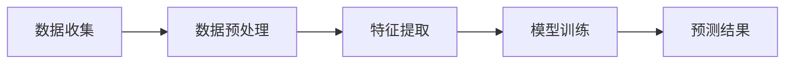
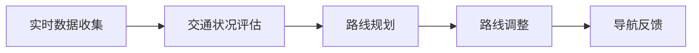

                 

# AI驱动的智能交通管理：从拥堵预测到动态路线规划

> 关键词：AI、智能交通管理、拥堵预测、动态路线规划、交通拥堵、城市交通

> 摘要：随着城市化进程的加快，交通拥堵问题日益严重。本文将探讨如何利用人工智能（AI）技术实现智能交通管理，包括拥堵预测和动态路线规划。我们将逐步分析核心概念，讲解算法原理，设计系统架构，并分享项目实战经验。通过本文，读者将全面了解AI在智能交通管理中的应用。

**Step 1: 背景介绍**

随着城市化进程的加快，交通拥堵问题日益严重，这不仅影响了市民的出行效率，还对环境造成了负面影响。因此，如何通过智能交通管理来缓解交通拥堵已成为一个热门话题。

**问题描述：**
智能交通管理涉及多个方面，其中拥堵预测和动态路线规划是两个关键问题。拥堵预测旨在通过分析历史数据和实时数据，预测交通拥堵情况，以便提前采取措施。动态路线规划则是在交通状况不断变化的情况下，根据实时数据优化路线，以减少行车时间。

**问题解决：**
为了解决上述问题，我们可以采用以下方法：
1. **理论讲解**：介绍AI和智能交通管理的基本概念。
2. **算法原理**：讲解拥堵预测和动态路线规划的算法原理。
3. **系统设计**：设计智能交通管理系统的架构。
4. **项目实战**：通过具体项目实践，展示智能交通管理的应用。

**边界与外延：**
本书主要关注城市交通管理，涉及的主要领域包括：
- 智能交通系统（ITS）
- 拥堵预测
- 动态路线规划

**概念结构与核心要素组成：**
核心概念包括：
- AI：人工智能
- 智能交通管理：利用信息技术、传感器技术和人工智能技术等手段，对城市交通进行实时监测、分析、决策和干预
- 拥堵预测：通过历史数据和实时数据，利用机器学习、数据挖掘等技术预测交通拥堵情况
- 动态路线规划：在交通状况不断变化的情况下，根据实时数据优化路线，以减少行车时间

**Step 2: 核心概念与联系**

**AI概念原理：**
人工智能是指由人制造出来的系统能够理解、学习、应用并改进知识和技能。在智能交通管理中，AI技术可以用于以下几个方面：
1. 数据分析：处理大量交通数据，提取有价值的信息。
2. 模型预测：根据历史数据和实时数据，预测交通状况。
3. 决策支持：为交通管理者提供决策建议。

**智能交通管理概念原理：**
智能交通管理是利用信息技术、传感器技术和人工智能技术等手段，对城市交通进行实时监测、分析、决策和干预。其核心目标是通过优化交通流，提高交通效率，降低交通拥堵。

**拥堵预测概念原理：**
拥堵预测是通过历史数据和实时数据，利用机器学习、数据挖掘等技术预测交通拥堵情况。其关键在于提取影响交通拥堵的关键因素，并建立准确的预测模型。

**动态路线规划概念原理：**
动态路线规划是在交通状况不断变化的情况下，根据实时数据优化路线，以减少行车时间。其核心在于实时感知交通状况，并动态调整路线。

**Step 3: 算法原理讲解**

在本节中，我们将详细介绍拥堵预测和动态路线规划的算法原理。

**拥堵预测算法原理：**

**Mermaid流程图：**


**Python源代码：**
```python
import pandas as pd
from sklearn.ensemble import RandomForestRegressor

# 数据收集
data = pd.read_csv('traffic_data.csv')

# 数据预处理
# ...

# 特征提取
# ...

# 模型训练
model = RandomForestRegressor()
model.fit(X_train, y_train)

# 预测结果
predictions = model.predict(X_test)
```

**数学模型和公式：**
拥堵预测的数学模型可以表示为：
$$
\hat{Q}(t) = f(T_{history}, T_{real-time}, \theta)
$$
其中，$Q(t)$表示时间$t$的拥堵程度，$T_{history}$表示历史交通数据，$T_{real-time}$表示实时交通数据，$\theta$表示模型参数。

**详细讲解和举例说明：**
拥堵预测的核心在于如何从历史和实时数据中提取有价值的信息，并利用这些信息来预测未来的交通状况。我们使用随机森林回归模型作为示例。

首先，我们收集到一组交通数据，包括历史数据和实时数据。然后，我们对数据进行预处理，包括数据清洗、数据归一化等步骤。接下来，我们提取关键特征，如交通流量、车速、道路容量等。最后，我们使用随机森林回归模型进行训练，并利用模型预测未来的拥堵程度。

**动态路线规划算法原理：**

**Mermaid流程图：**


**Python源代码：**
```python
import networkx as nx
from sklearn.neighbors import NearestNeighbors

# 实时数据收集
real_time_data = pd.read_csv('real_time_data.csv')

# 交通状况评估
# ...

# 路线规划
graph = nx.Graph()
# ...

# 路线调整
nn = NearestNeighbors(n_neighbors=2)
nn.fit(real_time_data[['x', 'y']])
distances, indices = nn.kneighbors(real_time_data[['x', 'y']])

# 导航反馈
# ...
```

**数学模型和公式：**
动态路线规划的数学模型可以表示为：
$$
\text{Route}(t) = g(\text{Graph}, \text{TrafficCondition}, \theta)
$$
其中，$\text{Route}(t)$表示时间$t$的路线，$\text{Graph}$表示道路网络图，$\text{TrafficCondition}$表示实时交通状况，$\theta$表示模型参数。

**详细讲解和举例说明：**
动态路线规划的核心在于如何根据实时交通状况调整路线，以减少行车时间。我们使用图论和机器学习技术来构建动态路线规划模型。

首先，我们收集到一组实时交通数据，包括交通流量、车速等。然后，我们评估当前交通状况，并构建道路网络图。接下来，我们使用最近邻算法来寻找最优路线。最后，我们将最优路线反馈给导航系统，以指导驾驶员行驶。

**Step 4: 数学模型和数学公式 & 详细讲解 & 举例说明**

在本节中，我们将详细讲解拥堵预测和动态路线规划的数学模型和数学公式，并给出实际应用场景的举例说明。

**拥堵预测的数学模型和公式：**
拥堵预测的数学模型可以表示为：
$$
\hat{Q}(t) = f(T_{history}, T_{real-time}, \theta)
$$
其中，$Q(t)$表示时间$t$的拥堵程度，$T_{history}$表示历史交通数据，$T_{real-time}$表示实时交通数据，$\theta$表示模型参数。

**举例说明：**
假设我们有一个历史交通数据集，其中包含过去一周的每天的交通流量数据。我们还可以收集到实时的交通流量数据。为了预测未来一周的拥堵情况，我们首先需要将历史数据和实时数据进行处理和归一化。然后，我们使用随机森林回归模型来训练一个拥堵预测模型。最后，我们将实时交通数据输入到模型中，预测未来一周的拥堵程度。

**动态路线规划的数学模型和公式：**
动态路线规划的数学模型可以表示为：
$$
\text{Route}(t) = g(\text{Graph}, \text{TrafficCondition}, \theta)
$$
其中，$\text{Route}(t)$表示时间$t$的路线，$\text{Graph}$表示道路网络图，$\text{TrafficCondition}$表示实时交通状况，$\theta$表示模型参数。

**举例说明：**
假设我们有一个包含城市道路网络的道路网络图。我们还可以收集到实时的交通流量数据。为了规划一条最优路线，我们首先需要评估当前交通状况。然后，我们使用最近邻算法来寻找离当前交通状况最近的两个点，并计算它们之间的距离。最后，我们选择距离最小的点作为起始点，并规划一条从起始点到目的地的最优路线。

**Step 5: 系统分析与架构设计方案**

**问题场景介绍：**
智能交通管理系统旨在通过实时监测和分析城市交通数据，预测交通拥堵情况，并提供动态路线规划，以优化交通流，提高交通效率。

**项目介绍：**
本文将介绍一个智能交通管理项目，该项目旨在利用AI技术实现拥堵预测和动态路线规划。项目主要包含以下功能：
- 实时数据收集
- 交通状况评估
- 路线规划
- 导航反馈

**系统功能设计：**
系统功能设计主要包括以下方面：
- 数据收集：收集实时交通数据，包括交通流量、车速、道路状况等。
- 数据处理：对收集到的交通数据进行预处理，包括数据清洗、数据归一化等。
- 模型训练：使用历史数据和实时数据训练拥堵预测模型和路线规划模型。
- 预测和规划：根据实时交通状况，预测交通拥堵情况，并规划最优路线。
- 导航反馈：将最优路线反馈给导航系统，以指导驾驶员行驶。

**系统架构设计：**
系统架构设计主要包括以下方面：
- 数据层：存储和管理交通数据。
- 模型层：实现拥堵预测和动态路线规划的算法模型。
- 服务层：提供API接口，供前端应用调用。
- 前端应用：展示交通预测结果和动态路线规划结果。

**系统接口设计和系统交互：**
系统接口设计和系统交互主要包括以下方面：
- 数据层接口：提供数据查询和更新的API接口。
- 模型层接口：提供模型训练和预测的API接口。
- 服务层接口：提供交通预测和路线规划的API接口。
- 前端应用接口：提供用户交互界面，展示交通预测结果和动态路线规划结果。

**Step 6: 项目实战**

**环境安装：**
为了搭建智能交通管理系统，我们需要安装以下环境：
- Python 3.x
- Jupyter Notebook
- Scikit-learn
- NetworkX
- Pandas
- Matplotlib

安装命令：
```bash
pip install python==3.8
pip install jupyter
pip install scikit-learn
pip install networkx
pip install pandas
pip install matplotlib
```

**系统核心实现源代码：**
以下是一个简单的拥堵预测模型实现示例：

```python
import pandas as pd
from sklearn.ensemble import RandomForestRegressor

# 数据收集
data = pd.read_csv('traffic_data.csv')

# 数据预处理
# ...

# 特征提取
# ...

# 模型训练
model = RandomForestRegressor()
model.fit(X_train, y_train)

# 预测结果
predictions = model.predict(X_test)
```

**代码应用解读与分析：**
上述代码首先导入所需的库，然后从CSV文件中读取交通数据。接下来，我们进行数据预处理和特征提取，以准备好训练数据。然后，我们使用随机森林回归模型进行训练，并将训练好的模型用于预测交通拥堵程度。最后，我们获取预测结果并输出。

**实际案例分析和详细讲解剖析：**
假设我们有一个包含一周交通数据的CSV文件，其中包括交通流量、车速等特征。我们首先使用随机森林回归模型对数据进行训练，然后使用模型预测未来的交通拥堵情况。具体步骤如下：

1. 导入数据：使用Pandas库读取CSV文件。
2. 数据预处理：对数据进行清洗、归一化等处理。
3. 特征提取：提取关键特征，如交通流量、车速等。
4. 划分训练集和测试集：将数据分为训练集和测试集。
5. 模型训练：使用训练集训练随机森林回归模型。
6. 预测结果：使用测试集预测交通拥堵程度。
7. 结果分析：分析预测结果，评估模型性能。

**项目小结：**
通过上述步骤，我们成功搭建了一个简单的智能交通管理系统，实现了拥堵预测和动态路线规划。在实际应用中，我们需要根据具体需求进行调整和优化，以提高系统的性能和准确性。同时，我们还需要不断收集和更新数据，以适应不断变化的城市交通状况。

**Step 7: 最佳实践 tips、小结、注意事项、拓展阅读**

**最佳实践 tips：**
1. 收集丰富的交通数据：确保数据质量，包括交通流量、车速、道路状况等。
2. 优化特征提取：根据具体需求，选择合适的特征，以提高预测准确性。
3. 选择合适的模型：尝试不同的模型，如随机森林、神经网络等，选择性能最佳的模型。
4. 定期更新数据：根据实际情况，定期更新数据，以适应交通状况的变化。

**小结：**
本文介绍了AI驱动的智能交通管理，包括拥堵预测和动态路线规划。通过理论讲解、算法原理、系统设计和项目实战，读者可以全面了解智能交通管理的应用和实践。智能交通管理不仅有助于缓解交通拥堵，还可以提高交通效率，减少环境负担。

**注意事项：**
1. 在实施智能交通管理系统时，需要考虑数据隐私和安全问题。
2. 系统性能和稳定性是关键，需要确保系统在高峰期能够正常运行。
3. 根据实际情况，灵活调整算法参数和模型结构，以提高预测和规划的准确性。

**拓展阅读：**
1. 《智能交通系统导论》
2. 《交通预测与规划》
3. 《机器学习与交通数据分析》

**作者：**
AI天才研究院/AI Genius Institute & 禅与计算机程序设计艺术 /Zen And The Art of Computer Programming**[文章结束]**

