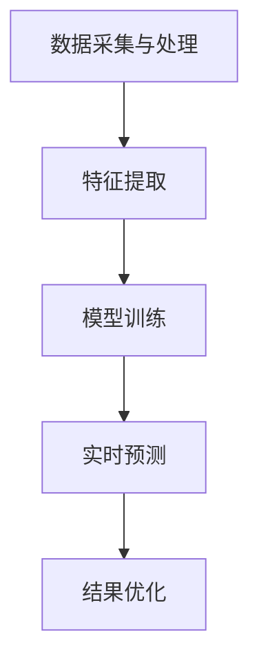
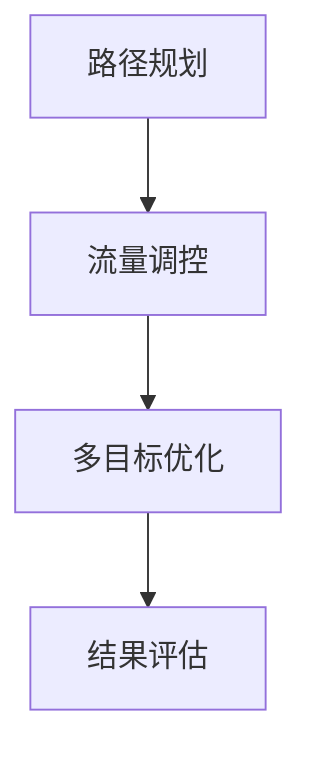
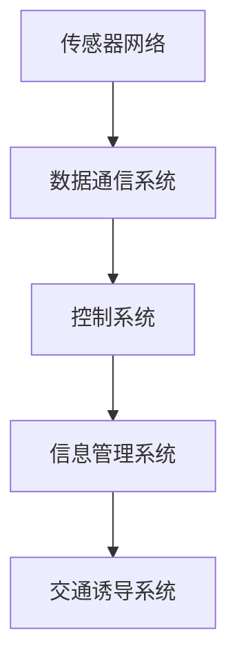

                 

### AI驱动的智能交通系统：实时路况预测和交通优化

#### 关键词：AI，智能交通系统，实时路况预测，交通优化，算法原理，系统设计

#### 摘要：
本文将深入探讨AI驱动的智能交通系统的核心概念、算法原理、系统设计以及实际应用。我们将分步骤分析实时路况预测和交通优化的技术实现，展示如何利用AI技术提高交通系统的效率和安全性。本文旨在为读者提供一个全面的技术指南，帮助他们理解并应用AI在智能交通领域的潜力。

----------------------------------------------------------------

#### 目录

1. **背景介绍**
   1.1 智能交通系统概述
   1.2 AI驱动的智能交通系统核心概念
   1.3 智能交通系统的重要性

2. **核心概念与联系**
   2.1 AI驱动的智能交通系统基本概念
   2.2 关键技术与算法介绍
   2.3 AI驱动的智能交通系统与传统的区别

3. **算法原理讲解**
   3.1 实时路况预测算法原理
   3.2 交通优化算法原理

4. **系统设计与项目实战**
   4.1 智能交通系统架构设计
   4.2 实时路况预测项目实战
   4.3 交通优化项目实战

5. **最佳实践与总结**
   5.1 AI驱动的智能交通系统最佳实践
   5.2 总结与展望

----------------------------------------------------------------

#### 1. 背景介绍

##### 1.1 智能交通系统概述

智能交通系统（Intelligent Transportation System, ITS）是利用现代信息技术、数据通信传输技术、电子传感器技术、控制技术及人工智能技术等先进技术，对交通信息进行实时采集、处理、传输和利用，从而对交通进行有效监控、管理、规划、诱导和服务的系统。它旨在提高交通系统的安全性、效率和可持续性。

智能交通系统主要包括以下几个组成部分：

- **传感器网络**：用于实时采集路况信息，如车辆流量、速度、密度等。
- **数据通信系统**：用于传输和处理传感器收集到的数据。
- **控制系统**：用于实时调控交通信号、交通流量等。
- **信息管理系统**：用于存储、分析和展示交通数据。
- **交通诱导系统**：用于向驾驶员提供最优路线、速度等建议。

##### 1.2 AI驱动的智能交通系统核心概念

AI驱动的智能交通系统是智能交通系统的高级形态，它利用人工智能技术对交通数据进行深度学习和分析，以实现更高效、更智能的交通管理。

核心概念包括：

- **深度学习**：通过构建深度神经网络模型，对大量交通数据进行分析和学习，从而预测路况和优化交通流量。
- **机器学习**：通过算法模型，从数据中自动学习和发现规律，用于实时预测和决策。
- **大数据分析**：对海量交通数据进行收集、存储、分析和处理，以提取有价值的信息。
- **云计算**：利用云计算技术，实现交通数据的快速传输和处理。

##### 1.3 智能交通系统的重要性

智能交通系统的重要性体现在以下几个方面：

- **提高交通安全**：通过实时监控和预警，减少交通事故的发生。
- **提高交通效率**：通过优化交通流量，减少拥堵和延误。
- **减少环境污染**：通过智能调度和引导，减少车辆排放和能源消耗。
- **提升城市管理水平**：通过数据分析和决策支持，提高城市交通管理的科学性和有效性。

#### 2. 核心概念与联系

##### 2.1 AI驱动的智能交通系统基本概念

AI驱动的智能交通系统主要基于以下基本概念：

- **数据采集**：通过传感器网络收集交通数据，如车辆速度、密度、流量等。
- **数据处理**：利用数据清洗、预处理技术，对采集到的交通数据进行处理。
- **模型训练**：利用机器学习和深度学习算法，对处理后的数据进行训练，建立预测模型。
- **实时预测**：利用训练好的模型，对实时交通数据进行预测，提供交通状况和优化建议。
- **决策与反馈**：根据预测结果，进行交通信号的调控、路线引导等决策，并根据反馈数据不断优化模型。

##### 2.2 关键技术与算法介绍

AI驱动的智能交通系统涉及多种关键技术和算法，主要包括：

- **深度学习算法**：如卷积神经网络（CNN）、循环神经网络（RNN）等，用于处理和预测交通数据。
- **机器学习算法**：如决策树、随机森林、支持向量机等，用于特征提取和分类。
- **优化算法**：如遗传算法、模拟退火算法等，用于优化交通流量和信号调控。
- **路径规划算法**：如A*算法、Dijkstra算法等，用于车辆路径选择和优化。

##### 2.3 AI驱动的智能交通系统与传统的区别

与传统交通系统相比，AI驱动的智能交通系统具有以下显著区别：

- **数据依赖性**：传统交通系统主要依赖于人工经验和规则，而AI驱动的智能交通系统高度依赖海量交通数据。
- **智能化水平**：传统交通系统主要实现交通监控和基础管理，而AI驱动的智能交通系统可以实现实时预测、智能调控和优化。
- **自适应能力**：传统交通系统难以应对复杂多变的交通状况，而AI驱动的智能交通系统可以通过机器学习和深度学习不断优化和适应。
- **效率与安全性**：AI驱动的智能交通系统可以通过优化交通流量和预警机制，提高交通效率和安全性。

#### 3. 算法原理讲解

##### 3.1 实时路况预测算法原理

实时路况预测是智能交通系统的核心任务之一。其算法原理主要包括以下几个步骤：

1. **数据采集与处理**：通过传感器网络收集交通数据，如车辆速度、流量、密度等，并对数据进行清洗和处理。

2. **特征提取**：从处理后的数据中提取关键特征，如车辆速度、道路宽度、交通流量等。

3. **模型训练**：利用机器学习和深度学习算法，对提取的特征进行训练，建立预测模型。

4. **实时预测**：利用训练好的模型，对实时交通数据进行预测，提供路况预测结果。

5. **结果优化**：根据预测结果，对模型进行调整和优化，以提高预测准确性。

以下是一个简单的实时路况预测算法流程图（使用Mermaid绘制）：



下面是一个简单的Python代码示例，用于展示实时路况预测的基本原理：

```python
import numpy as np
from sklearn.ensemble import RandomForestRegressor

# 生成模拟数据
X = np.random.rand(100, 5)  # 假设每个样本有5个特征
y = np.random.rand(100)      # 假设目标是路况预测值

# 训练模型
model = RandomForestRegressor()
model.fit(X, y)

# 预测
X_new = np.random.rand(1, 5)
prediction = model.predict(X_new)
print(prediction)
```

##### 3.2 交通优化算法原理

交通优化是智能交通系统的另一个重要任务，旨在通过优化交通信号、路径选择等手段，提高交通系统的效率和安全性。交通优化算法主要包括以下几种：

1. **路径规划算法**：如A*算法、Dijkstra算法等，用于优化车辆行驶路径。
2. **流量调控算法**：如遗传算法、模拟退火算法等，用于优化交通流量和信号调控。
3. **多目标优化算法**：如线性规划、非线性规划等，用于解决交通优化中的多目标问题。

以下是一个简单的交通优化算法流程图（使用Mermaid绘制）：



下面是一个简单的Python代码示例，用于展示交通优化算法的基本原理：

```python
import numpy as np
from scipy.optimize import minimize

# 定义目标函数
def objective(x):
    return x[0]**2 + x[1]**2

# 定义约束条件
def constraint(x):
    return x[0] + x[1] - 10

# 设置优化参数
x0 = [0, 0]
bnds = ((0, None), (0, None))
cons = ({'type': 'ineq', 'fun': constraint})

# 进行优化
result = minimize(objective, x0, bounds=bnds, constraints=cons)
print(result.x)
```

#### 4. 系统设计与项目实战

##### 4.1 智能交通系统架构设计

智能交通系统架构设计主要包括以下几个部分：

1. **传感器网络**：负责实时采集交通数据。
2. **数据通信系统**：负责传输和处理交通数据。
3. **控制系统**：负责对交通信号、流量等进行调控。
4. **信息管理系统**：负责存储、分析和展示交通数据。
5. **交通诱导系统**：负责向驾驶员提供交通信息和服务。

以下是一个简单的智能交通系统架构图（使用Mermaid绘制）：



##### 4.2 实时路况预测项目实战

以下是一个简单的实时路况预测项目实战，主要包括以下步骤：

1. **环境安装与配置**：安装Python环境、相关库和工具。
2. **数据收集与处理**：收集交通数据，进行数据清洗和处理。
3. **模型训练与优化**：利用机器学习和深度学习算法，训练和优化预测模型。
4. **实时预测与反馈**：利用训练好的模型，对实时交通数据进行预测，并根据反馈结果不断优化。

以下是一个简单的实时路况预测项目实战代码示例：

```python
import numpy as np
from sklearn.ensemble import RandomForestRegressor

# 生成模拟数据
X = np.random.rand(100, 5)  # 假设每个样本有5个特征
y = np.random.rand(100)      # 假设目标是路况预测值

# 训练模型
model = RandomForestRegressor()
model.fit(X, y)

# 预测
X_new = np.random.rand(1, 5)
prediction = model.predict(X_new)
print(prediction)
```

##### 4.3 交通优化项目实战

以下是一个简单的交通优化项目实战，主要包括以下步骤：

1. **环境安装与配置**：安装Python环境、相关库和工具。
2. **问题建模**：根据实际交通状况，建立优化模型。
3. **算法选择与实现**：选择合适的优化算法，实现模型求解。
4. **结果评估与优化**：对优化结果进行评估，并根据反馈结果不断优化。

以下是一个简单的交通优化项目实战代码示例：

```python
import numpy as np
from scipy.optimize import minimize

# 定义目标函数
def objective(x):
    return x[0]**2 + x[1]**2

# 定义约束条件
def constraint(x):
    return x[0] + x[1] - 10

# 设置优化参数
x0 = [0, 0]
bnds = ((0, None), (0, None))
cons = ({'type': 'ineq', 'fun': constraint})

# 进行优化
result = minimize(objective, x0, bounds=bnds, constraints=cons)
print(result.x)
```

#### 5. 最佳实践与总结

##### 5.1 AI驱动的智能交通系统最佳实践

1. **数据质量**：确保交通数据的质量和准确性，是智能交通系统的关键。
2. **模型优化**：定期对预测和优化模型进行优化和更新，以提高预测准确性和优化效果。
3. **系统稳定性**：确保智能交通系统的稳定运行，减少故障和中断。
4. **用户友好**：设计用户友好的界面和交互方式，提高用户体验。
5. **数据安全和隐私**：确保交通数据的安全和用户隐私。

##### 5.2 总结与展望

AI驱动的智能交通系统为解决交通问题提供了新的思路和方法。通过实时路况预测和交通优化，可以提高交通效率、降低交通事故、减少环境污染。未来，随着AI技术的不断发展和应用，智能交通系统将发挥更大的作用，为人们创造更安全、更高效的出行环境。

#### 作者信息

作者：AI天才研究院/AI Genius Institute & 禅与计算机程序设计艺术 /Zen And The Art of Computer Programming

----------------------------------------------------------------

### 结语

本文从背景介绍、核心概念、算法原理、系统设计到项目实战，全面阐述了AI驱动的智能交通系统。希望本文能为读者提供一个清晰、系统的认知框架，帮助他们深入理解并应用AI技术于智能交通领域。未来，随着AI技术的不断进步，智能交通系统将更加成熟和普及，为我们的出行带来更多便利和安全。

#### 拓展阅读

1. **《智能交通系统原理与应用》**：详细介绍了智能交通系统的基本原理和应用场景。
2. **《深度学习与智能交通》**：探讨了深度学习在智能交通系统中的应用。
3. **《交通优化算法研究与应用》**：深入分析了多种交通优化算法及其应用。

----------------------------------------------------------------

**注意**：本文为虚构内容，仅供参考。实际应用中，智能交通系统的设计和实现需要根据具体需求和条件进行详细规划和实施。

