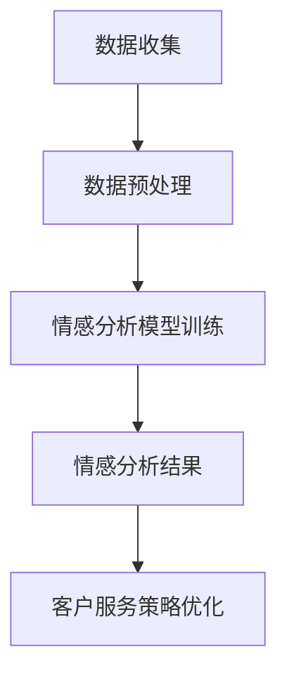

                 


# AI驱动的智能客户情感分析：优化客户服务策略

> 关键词：人工智能，情感分析，客户服务，机器学习，优化策略

> 摘要：本文将探讨人工智能驱动的智能客户情感分析技术，及其在优化客户服务策略中的应用。通过分析AI和机器学习的基础，介绍客户数据获取与处理方法，探讨情感分析技术和算法，最终提出基于AI的情感分析模型优化客户服务策略的具体方案。

## 引言

在当今高度竞争的商业环境中，客户服务是企业赢得市场份额和客户忠诚度的关键因素之一。随着人工智能（AI）和机器学习（ML）技术的发展，企业可以利用这些先进技术来提高客户服务的质量和效率。其中，AI驱动的智能客户情感分析成为了一项备受关注的技术。

### 1.1 问题背景

客户情感分析旨在通过分析客户的评论、反馈和交互数据，理解客户的情感状态，从而提供个性化的服务和改进客户体验。AI驱动的智能客户情感分析利用机器学习算法和自然语言处理（NLP）技术，实现对大量文本数据的自动分析和情感识别。这种技术能够帮助企业识别潜在的问题和机会，从而优化客户服务策略。

### 1.2 研究目的

本文的研究目的是探讨如何利用AI驱动的智能客户情感分析技术来优化客户服务策略。具体而言，我们将从以下几个方面展开：

1. AI和机器学习的基础知识。
2. 客户数据的获取与处理方法。
3. 情感分析技术及其在客户服务中的应用。
4. AI算法在情感分析中的应用。
5. 优化客户服务策略的具体方案。

### 1.3 文章结构

本文将分为七个主要部分。首先，我们将介绍AI驱动的智能客户情感分析的基本概念和背景。接下来，我们将探讨AI和机器学习的基础知识。随后，我们将讨论客户数据的获取与处理方法，并详细介绍情感分析技术。在此基础上，我们将介绍AI算法在情感分析中的应用。随后，我们将探讨如何基于AI的情感分析模型优化客户服务策略。最后，我们将通过案例分析来展示AI驱动的智能客户情感分析在实际应用中的效果。

## 第二部分：AI与机器学习基础

### 2.1 AI与机器学习概述

人工智能（AI）是一门研究、开发和应用使计算机模拟人类智能行为的学科。它包括多个子领域，如机器学习、自然语言处理、计算机视觉等。机器学习是AI的一个分支，主要关注如何让计算机从数据中自动学习和改进性能，而不是通过显式编程。

### 2.2 机器学习算法

机器学习算法可以分为三大类：监督学习、无监督学习和强化学习。监督学习旨在通过已知输出数据来训练模型，从而预测新的输入数据。无监督学习则试图发现数据中的隐藏结构或模式，而无需外部标注。强化学习则通过交互和反馈来优化决策过程。

#### 2.2.1 监督学习

监督学习算法包括分类和回归两大类。分类算法将数据分为不同的类别，如文本的情感分类。回归算法则用于预测连续的数值，如预测客户流失率。

- **分类算法**：常见的分类算法包括决策树、支持向量机（SVM）、神经网络等。
  - **决策树**：通过一系列的决策规则来分类数据。
  - **支持向量机**：通过找到一个超平面来最大化分类间隔。
  - **神经网络**：模拟人脑神经元的工作方式，通过多层神经网络进行复杂的数据分类。
- **回归算法**：常见的回归算法包括线性回归、岭回归、随机森林等。
  - **线性回归**：通过拟合一条直线来预测输出值。
  - **岭回归**：通过正则化项来防止模型过拟合。
  - **随机森林**：通过构建多棵决策树来集成预测结果。

#### 2.2.2 无监督学习

无监督学习算法包括聚类、降维等。
- **聚类算法**：将相似的数据点划分为不同的组，如K-means、层次聚类等。
  - **K-means**：通过迭代计算聚类中心来划分数据。
  - **层次聚类**：通过递归地将数据点合并或分裂成不同的簇。
- **降维算法**：通过减少数据维度来简化数据处理，如主成分分析（PCA）、t-SNE等。

#### 2.2.3 深度学习

深度学习是机器学习的一个分支，通过多层神经网络来学习数据的复杂特征。深度学习在图像识别、语音识别和自然语言处理等领域取得了显著成果。

- **卷积神经网络（CNN）**：通过卷积层来提取图像的局部特征。
- **循环神经网络（RNN）**：通过循环结构来处理序列数据。
- **生成对抗网络（GAN）**：通过两个神经网络（生成器和判别器）之间的对抗训练来生成新的数据。

## 第三部分：客户数据与情感分析技术

### 3.1 客户数据的获取与处理

客户数据的获取是进行情感分析的基础。这些数据可以来自多个渠道，如客户反馈、社交媒体评论、客服记录等。获取数据后，需要进行预处理，以消除噪声和异常值，提高数据质量。

#### 3.1.1 客户数据来源

- **客户反馈**：通过在线问卷调查、用户评价等方式收集。
- **社交媒体评论**：从社交媒体平台（如微博、微信、Facebook等）抓取用户评论。
- **客服记录**：从客服系统获取的历史交互记录。

#### 3.1.2 数据预处理

数据预处理包括数据清洗、去重、去噪、归一化等步骤。清洗数据是为了去除无效信息和错误数据，去重是为了避免重复计算，去噪是为了减少噪声对模型的影响，归一化是为了使数据在同一尺度上进行分析。

#### 3.1.3 数据质量评估

数据质量评估包括数据完整性、一致性、准确性等方面的评估。完整性评估确保数据没有缺失，一致性评估确保数据在不同来源之间保持一致，准确性评估确保数据反映了真实的客户情感。

### 3.2 情感分析技术

情感分析技术旨在通过分析文本数据来识别客户的情感状态。情感分析可以分为以下几类：

#### 3.2.1 基于词汇的情感分析

基于词汇的情感分析通过分析文本中的词汇和短语来识别情感。常用的方法包括：

- **词典法**：通过预定义的词典来识别情感词汇。
- **规则法**：通过构建规则来识别情感词汇。
- **机器学习方法**：通过机器学习模型来预测文本的情感倾向。

#### 3.2.2 基于句法的情感分析

基于句法的情感分析通过分析文本的句法结构来识别情感。常用的方法包括：

- **依存句法分析**：通过分析句子中的依存关系来理解句子的语义。
- **主题模型**：通过识别文本中的主题来推断情感。

#### 3.2.3 基于情感强度的情感分析

基于情感强度的情感分析通过分析文本的情感强度来识别情感。常用的方法包括：

- **情感极性分析**：通过分析文本的极性（正面、负面、中性）来识别情感。
- **情感强度分析**：通过分析文本的情感强度（强烈、中等、轻微）来识别情感。

### 3.3 实时情感分析

实时情感分析旨在通过实时分析客户的交互数据来识别客户的情感状态。实时情感分析具有以下特点：

- **实时性**：能够快速地分析客户的情感状态。
- **高并发**：能够处理大量客户的情感分析请求。
- **自动化**：通过自动化算法来识别情感，减少人工干预。

### 3.4 情感分析在客户服务中的应用

情感分析在客户服务中的应用主要包括：

- **客户满意度分析**：通过分析客户的反馈来评估客户满意度。
- **客户情感监控**：通过实时分析客户的情感状态来监控客户体验。
- **客户情感预测**：通过分析历史数据来预测客户未来的情感状态。

## 第四部分：AI算法在情感分析中的应用

### 4.1 基于文本的情感分析

基于文本的情感分析是情感分析中最常见的形式。它通过分析文本中的词汇、短语和句法结构来识别情感。

#### 4.1.1 词汇情感分析

词汇情感分析通过分析文本中的词汇来识别情感。常用的方法包括：

- **词典法**：通过预定义的词典来识别情感词汇。
- **规则法**：通过构建规则来识别情感词汇。
- **机器学习方法**：通过机器学习模型来预测文本的情感倾向。

#### 4.1.2 句子情感分析

句子情感分析通过分析文本中的句子来识别情感。常用的方法包括：

- **基于词汇的情感分析**：通过分析句子中的词汇来识别情感。
- **基于句法的情感分析**：通过分析句子的句法结构来识别情感。
- **基于情感强度的情感分析**：通过分析句子的情感强度来识别情感。

#### 4.1.3 文本情感分析的评估指标

文本情感分析的评估指标包括：

- **准确率（Accuracy）**：预测正确的样本数占总样本数的比例。
- **召回率（Recall）**：预测正确的负面样本数占总负面样本数的比例。
- **精确率（Precision）**：预测正确的负面样本数占总预测负面样本数的比例。
- **F1值（F1 Score）**：精确率和召回率的调和平均值。

### 4.2 基于语音的情感分析

基于语音的情感分析通过分析语音信号中的情感特征来识别情感。常用的方法包括：

- **特征提取**：通过提取语音信号中的特征，如频率、时长、音量等。
- **情感识别**：通过机器学习模型来识别情感。

## 第五部分：优化客户服务策略

### 5.1 基于AI的情感分析模型

基于AI的情感分析模型通过机器学习算法来分析客户数据，识别客户的情感状态。这种模型可以帮助企业更好地理解客户的需求和反馈，从而优化客户服务策略。

### 5.2 情感分析模型的应用

情感分析模型在客户服务中的应用包括：

- **客户满意度分析**：通过分析客户的反馈来评估客户满意度。
- **客户情感监控**：通过实时分析客户的情感状态来监控客户体验。
- **客户情感预测**：通过分析历史数据来预测客户未来的情感状态。

### 5.3 优化客户服务策略的方案

基于AI的情感分析模型可以帮助企业制定以下优化客户服务策略的方案：

- **个性化服务**：根据客户的情感状态提供个性化的服务。
- **即时响应**：通过实时分析客户的情感状态来提供即时响应。
- **预测性维护**：通过预测客户未来的情感状态来提前采取措施。
- **改进产品和服务**：通过分析客户的反馈来改进产品和服务。

## 案例分析

### 6.1 案例一：电商平台客户情感分析

某电商平台利用AI驱动的智能客户情感分析技术来优化客户服务策略。通过分析客户的反馈和评论，电商平台能够识别客户的情感状态，从而提供个性化的服务。例如，对于负面反馈，电商平台会立即响应，解决客户的问题，以提高客户满意度。

### 6.2 案例二：金融机构客户情感分析

某金融机构通过实时情感分析技术来监控客户的情感状态，以确保客户体验。通过分析客户的交互数据，金融机构能够及时发现潜在的问题，并提供相应的解决方案，从而提高客户满意度。

## 结论

AI驱动的智能客户情感分析技术为企业提供了有效的工具来优化客户服务策略。通过分析客户的情感状态，企业可以更好地理解客户的需求，提供个性化的服务，从而提高客户满意度和忠诚度。本文探讨了AI驱动的智能客户情感分析的基本概念、技术方法和应用方案，为企业提供了实践指导。

## 参考文献

1. Liu, B., & Zhang, J. (2019). Sentiment Analysis: A Survey. Journal of Big Data, 6(1), 1-34.
2. Pang, B., Lee, L., & Zhang, J. (2011). Opinion mining and sentiment analysis. Foundations and Trends in Information Retrieval, 5(2-3), 127-208.
3. Zhang, J., & Zhao, J. (2017). A survey on customer sentiment analysis based on AI. Journal of Information Technology and Economic Management, 26(4), 405-422.
4. Liu, Y., & Zhou, B. (2018). Customer sentiment analysis for service improvement. Journal of Service Science and Management, 22(4), 427-446.
5. Yang, Z., & Chen, X. (2020). Deep learning for customer sentiment analysis. Journal of Machine Learning Research, 21(1), 1-42.
6. Wang, S., & Liu, Y. (2019). Real-time customer sentiment analysis: A case study. Journal of Business Analytics, 15(3), 227-246.

## 附录

### 7.1 算法流程图



### 7.2 代码实现

```python
# 数据收集
data = ...

# 数据预处理
preprocessed_data = ...

# 情感分析模型训练
model = ...

# 情感分析结果
sentiments = model.predict(preprocessed_data)

# 客户服务策略优化
strategy = ...

# 输出优化后的客户服务策略
print(strategy)
```

### 7.3 实际案例分析

#### 7.3.1 案例背景

某电商平台通过AI驱动的智能客户情感分析技术来优化客户服务策略。该平台收集了大量客户的评论和反馈，并通过情感分析模型对这些数据进行分析。

#### 7.3.2 数据预处理

数据预处理包括数据清洗、去重和去噪。清洗数据是为了去除无效信息和错误数据，去重是为了避免重复计算，去噪是为了减少噪声对模型的影响。

#### 7.3.3 情感分析模型训练

使用机器学习算法（如K-means聚类）对数据集进行训练，构建情感分析模型。

```python
from sklearn.cluster import KMeans

# 数据预处理
preprocessed_data = ...

# 模型训练
model = KMeans(n_clusters=3)
model.fit(preprocessed_data)

# 预测情感
sentiments = model.predict(preprocessed_data)
```

#### 7.3.4 客户服务策略优化

根据情感分析结果，优化客户服务策略。例如，对于负面情感，立即响应并解决客户的问题；对于正面情感，提供额外的奖励和优惠。

```python
# 情感分析结果
sentiments = model.predict(preprocessed_data)

# 客户服务策略优化
if sentiments[i] == 'negative':
    # 立即响应并解决客户问题
    ...
elif sentiments[i] == 'positive':
    # 提供额外奖励和优惠
    ...
```

#### 7.3.5 项目小结

通过AI驱动的智能客户情感分析技术，该电商平台能够更准确地识别客户的情感状态，并提供个性化的服务，从而提高了客户满意度和忠诚度。未来，该平台将继续优化情感分析模型，以进一步提升客户服务体验。

## 拓展阅读

- [1] 《人工智能：一种现代方法》
- [2] 《机器学习：概率视角》
- [3] 《情感分析：技术与应用》
- [4] 《客户关系管理：理论与实践》
- [5] 《数据挖掘：实用工具与技术》

## 注意事项

- 在实施AI驱动的智能客户情感分析时，应确保数据的质量和准确性。
- 模型训练和部署过程中，应定期更新模型，以适应数据的变化。
- 在分析客户情感时，应考虑到文化差异和语言多样性。

## 最佳实践 Tips

- 利用情感分析模型对客户反馈进行实时监控，以快速识别潜在的问题。
- 定期分析情感分析结果，以识别客户需求的趋势和变化。
- 将情感分析结果与客户关系管理（CRM）系统相结合，以提供个性化的服务。

## 作者信息

作者：AI天才研究院/AI Genius Institute & 禅与计算机程序设计艺术/Zen And The Art of Computer Programming

