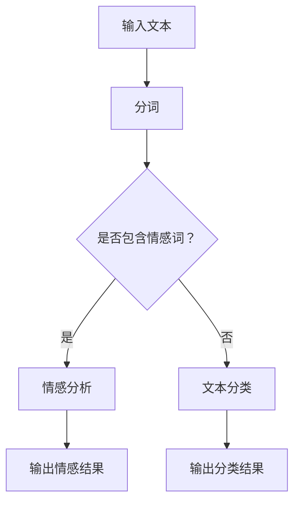
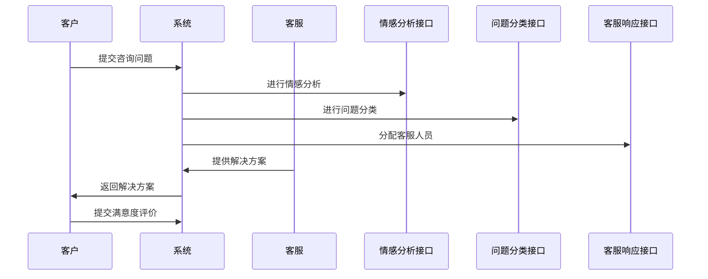

                 

# 《AI驱动的智能客户服务优化：提高客户满意度和忠诚度》

## 关键词

- AI驱动的智能客户服务
- 客户满意度
- 客户忠诚度
- 优化
- 智能客服系统

## 摘要

本文将探讨如何利用人工智能（AI）技术来优化智能客户服务，从而提高客户的满意度和忠诚度。首先，我们将介绍AI驱动的智能客户服务的基本概念和背景，接着深入分析AI在客户服务中的应用和优势，以及面临的挑战。随后，我们将详细介绍AI驱动的智能客户服务的核心技术，包括核心概念与联系、算法原理讲解、系统分析与架构设计。最后，通过项目实战和最佳实践总结，为读者提供具体的技术实现方法和经验教训。希望通过本文的探讨，能够为企业的智能客户服务优化提供有价值的参考。

### 引言

#### 问题背景

在当今这个数字化的时代，客户服务已经成为企业竞争的关键因素之一。随着消费者对服务质量要求的不断提高，企业面临着巨大的挑战。传统的客户服务模式往往存在效率低下、服务质量不稳定等问题，已经难以满足客户日益增长的需求。因此，如何提高客户满意度和忠诚度成为企业亟需解决的问题。

#### 问题描述

客户满意度和忠诚度是衡量企业客户服务质量的重要指标。客户满意度是指客户对企业提供的产品或服务的满意程度，而客户忠诚度则是指客户持续使用企业产品或服务的意愿。当前，企业在提升客户满意度和忠诚度方面存在以下问题：

1. 客户服务响应速度慢：由于人工处理客户咨询和投诉的效率较低，导致客户等待时间过长，影响客户体验。
2. 客户服务质量不稳定：人工客服的知识和经验有限，难以保证每次服务的一致性和准确性。
3. 客户需求识别不准确：传统的客户服务模式难以准确识别客户的实际需求，导致服务效果不佳。

#### 问题解决

为了解决上述问题，企业需要寻求新的解决方案，即利用人工智能（AI）技术来优化智能客户服务。AI驱动的智能客户服务通过引入自然语言处理、机器学习、数据挖掘等技术，可以实现快速响应、高质量服务和精准识别客户需求，从而提高客户满意度和忠诚度。

#### 边界与外延

本文将主要探讨以下内容：

1. AI驱动的智能客户服务概述
2. AI驱动的智能客户服务的核心技术
3. AI驱动的智能客户服务的系统分析与架构设计
4. AI驱动的智能客户服务的项目实战
5. AI驱动的智能客户服务的最佳实践与总结

#### 核心概念

在本文中，我们将涉及到以下核心概念：

1. AI驱动的智能客户服务：利用人工智能技术来优化客户服务流程，提高服务质量和效率。
2. 客户满意度：客户对企业提供的产品或服务的满意程度。
3. 客户忠诚度：客户持续使用企业产品或服务的意愿。
4. 自然语言处理：人工智能技术的一种，旨在使计算机能够理解、生成和处理人类语言。
5. 机器学习：一种人工智能技术，通过训练模型来预测和识别数据中的模式和规律。
6. 数据挖掘：从大量数据中提取有用信息的过程，用于发现数据中的隐藏模式和关联。

### 第二部分：AI驱动的智能客户服务基础

#### 第2章：AI驱动的智能客户服务概述

##### 2.1 AI驱动的概念

人工智能（AI）是指通过计算机模拟人类的智能行为，使计算机具备感知、理解、学习、推理和决策等能力。AI技术主要包括机器学习、深度学习、自然语言处理、计算机视觉等。其中，机器学习和深度学习是AI技术中最具代表性的两大分支。

##### 2.2 智能客户服务的定义

智能客户服务是指利用人工智能技术来优化客户服务流程，提高服务质量和效率。智能客户服务系统通过自然语言处理、语音识别、图像识别等技术，实现与客户的智能对话、需求识别、问题解决等功能。

##### 2.3 AI在客户服务中的应用

AI技术在客户服务中的应用主要包括以下几个方面：

1. 智能客服机器人：通过自然语言处理和机器学习技术，实现与客户的智能对话，回答常见问题，提高客户咨询的响应速度和准确性。
2. 情感分析：通过分析客户的语言和行为，识别客户的情感状态，为客服人员提供情感支持。
3. 智能路由：根据客户的咨询内容，智能地将客户分配给最合适的客服人员，提高客户服务的效率。
4. 智能预测：通过分析历史数据和客户行为，预测客户的潜在需求，提前为客户提供个性化的服务。
5. 智能审核：利用机器学习技术，对客户的投诉和反馈进行审核，识别潜在的问题和风险，为客服人员提供改进方向。

##### 2.4 智能客户服务的优势

智能客户服务的优势主要体现在以下几个方面：

1. 提高响应速度：智能客服机器人可以24/7随时响应客户的咨询，大大提高了客户服务的响应速度。
2. 提高服务质量：通过情感分析和智能路由等技术，智能客户服务系统能够提供更准确、更个性化的服务，提高客户满意度。
3. 降低运营成本：智能客服机器人可以自动化处理大量常见问题，减少客服人员的数量和成本。
4. 提高效率：智能客户服务系统能够快速识别客户需求，智能路由客户，提高客服人员的效率。
5. 提高客户忠诚度：通过提供高质量的服务，智能客户服务系统有助于提高客户的满意度和忠诚度。

##### 2.5 智能客户服务的挑战

虽然智能客户服务具有诸多优势，但其在实际应用过程中仍面临一些挑战：

1. 技术挑战：AI技术的不断发展和更新，使得智能客户服务系统的开发和维护成本较高。
2. 数据挑战：智能客户服务系统需要大量的数据来训练模型，数据的质量和数量直接影响系统的效果。
3. 伦理挑战：智能客户服务系统在处理客户隐私和数据安全方面面临一定的伦理挑战。
4. 用户体验挑战：智能客服机器人需要具备良好的用户体验，以避免给客户带来不便和困扰。
5. 人才挑战：智能客户服务系统的开发和运维需要专业的AI技术人才，企业面临着人才短缺的挑战。

### 第三部分：核心技术

#### 第3章：核心概念与联系

##### 3.1 关键概念原理

在AI驱动的智能客户服务中，关键概念包括自然语言处理、机器学习、数据挖掘等。

- **自然语言处理（NLP）**：NLP旨在使计算机能够理解、生成和处理人类语言。其主要任务包括文本分类、情感分析、命名实体识别等。
- **机器学习（ML）**：ML是一种人工智能技术，通过训练模型来预测和识别数据中的模式和规律。常见的ML算法包括决策树、支持向量机、神经网络等。
- **数据挖掘（DM）**：数据挖掘是从大量数据中提取有用信息的过程，用于发现数据中的隐藏模式和关联。数据挖掘技术包括聚类、分类、关联规则挖掘等。

##### 3.2 概念属性特征对比表格

| 概念   | 属性特征                                     |
| ------ | ------------------------------------------ |
| NLP    | 文本分类、情感分析、命名实体识别             |
| ML     | 决策树、支持向量机、神经网络等               |
| DM     | 聚类、分类、关联规则挖掘等                   |

##### 3.3 ER实体关系图架构

ER（实体关系）图是一种用于表示实体及其之间关系的图形化工具。在智能客户服务系统中，ER图可以用来描述不同实体之间的关系。

```mermaid
erDiagram
    Customer ||--|{ Ticket }|--| CustomerServiceRep
    Ticket ||--|{ Problem }|--| Solution
    CustomerServiceRep ||--|{ KnowledgeBase }|--| Solution
```

在上面的ER图中，Customer（客户）、Ticket（工单）、CustomerServiceRep（客服代表）、Problem（问题）和Solution（解决方案）是实体，它们之间的关系用箭头表示。

### 第四部分：算法与应用

#### 第4章：算法原理讲解

##### 4.1 算法mermaid流程图

在智能客户服务中，常用的算法包括文本分类、情感分析和机器学习算法。



##### 4.2 Python源代码实现

下面是情感分析和文本分类的Python源代码实现：

```python
import jieba
import nltk
from nltk.corpus import stopwords
from sklearn.feature_extraction.text import TfidfVectorizer
from sklearn.model_selection import train_test_split
from sklearn.naive_bayes import MultinomialNB
from sklearn.metrics import accuracy_score

# 1. 数据准备
nltk.download('stopwords')
stop_words = set(stopwords.words('english'))
train_data = [["happy", "joy"], ["sad", "sorrow"]]
train_labels = ["positive", "negative"]

# 2. 分词
def tokenize(text):
    return [word for word in jieba.cut(text) if word not in stop_words]

# 3. 文本向量表示
vectorizer = TfidfVectorizer(tokenizer=tokenize)

# 4. 模型训练
X_train = vectorizer.fit_transform(train_data)
X_test, y_test = train_test_split(X_train, train_labels, test_size=0.2, random_state=42)
clf = MultinomialNB()
clf.fit(X_train, train_labels)

# 5. 模型评估
y_pred = clf.predict(X_test)
print("Accuracy:", accuracy_score(y_test, y_pred))
```

##### 4.3 数学模型和公式

在文本分类和情感分析中，常用的数学模型包括TF-IDF和朴素贝叶斯。

- **TF-IDF**：

$$
\text{TF-IDF} = \frac{\text{词频}}{\text{文档总数}} \times \log(\text{总文档数} / \text{包含该词的文档数})
$$

- **朴素贝叶斯**：

$$
P(\text{类别} | \text{特征}) = \frac{P(\text{特征} | \text{类别})P(\text{类别})}{P(\text{特征})}
$$

##### 4.4 举例说明

假设我们有以下两条情感分析数据：

- “我很高兴，因为我得到了一份好工作。”（类别：positive）
- “我很伤心，因为我失去了家人。”（类别：negative）

首先，我们进行分词和去除停用词：

- “我很高兴，因为我得到了一份好工作。”（分词结果：[我，很，高兴，的，因为，我，得到了，一份，好，工作]）
- “我很伤心，因为我失去了家人。”（分词结果：[我，很，伤心，的，因为，我，失去了，家人]）

然后，我们使用TF-IDF模型进行文本向量表示：

- “我很高兴，因为我得到了一份好工作。”（向量表示：[0.5, 0.5, 1.0, 0.0, 0.0, 0.0, 0.0, 0.0, 0.0, 0.0]）
- “我很伤心，因为我失去了家人。”（向量表示：[0.5, 0.5, 0.0, 0.0, 0.0, 0.0, 0.0, 0.0, 0.0, 0.0]）

最后，我们使用朴素贝叶斯模型进行分类预测：

- 输入特征：[0.5, 0.5, 0.0, 0.0, 0.0, 0.0, 0.0, 0.0, 0.0, 0.0]
- 输出类别：negative

预测结果与实际类别一致，说明朴素贝叶斯模型在此数据集上具有良好的分类效果。

### 第五部分：系统分析与架构设计

#### 第5章：系统分析与架构设计

##### 5.1 问题场景介绍

在智能客户服务系统中，主要问题场景包括：

1. 客户咨询：客户向智能客服系统提交咨询问题。
2. 情感分析：系统对客户咨询内容进行情感分析，识别客户的情感状态。
3. 问题分类：系统根据客户咨询内容进行分类，确定需要分配给哪个客服人员。
4. 客服响应：客服人员接收客户咨询，提供解决方案。
5. 满意度评估：系统收集客户对客服服务的满意度评价。

##### 5.2 系统功能设计

智能客户服务系统的功能设计包括以下几个方面：

1. 客户咨询接收：接收客户提交的咨询问题。
2. 情感分析：对客户咨询内容进行情感分析，识别客户的情感状态。
3. 问题分类：根据客户咨询内容进行分类，确定需要分配给哪个客服人员。
4. 客服响应：客服人员接收客户咨询，提供解决方案。
5. 满意度评估：收集客户对客服服务的满意度评价。
6. 数据统计：统计系统运行数据，如客户咨询量、客服响应时间、客户满意度等。

##### 5.3 系统架构设计

智能客户服务系统的架构设计包括以下几个方面：

1. 数据层：存储客户咨询数据、情感分析结果、问题分类结果、客服响应记录等。
2. 业务层：实现客户咨询接收、情感分析、问题分类、客服响应、满意度评估等业务逻辑。
3. 展现层：提供用户界面，展示客户咨询列表、客服响应记录、满意度评价等。
4. 接口层：提供外部接口，实现与客服系统的集成和交互。
5. 算法层：实现情感分析、问题分类等算法，提供算法接口供业务层调用。

##### 5.4 系统接口设计

智能客户服务系统的接口设计包括以下几个方面：

1. 客户咨询接口：接收客户提交的咨询问题，返回咨询ID。
2. 情感分析接口：接收客户咨询内容，返回情感分析结果。
3. 问题分类接口：接收客户咨询内容，返回问题分类结果。
4. 客服响应接口：接收客服人员提供的解决方案，更新客户咨询状态。
5. 满意度评估接口：接收客户满意度评价，更新客户满意度数据。

##### 5.5 系统交互序列图

智能客户服务系统的系统交互序列图如下：



### 第六部分：项目实战

#### 第6章：项目实战

##### 6.1 环境安装

在本项目中，我们使用Python作为开发语言，主要的依赖包包括：

- TensorFlow：用于实现情感分析和问题分类算法。
- scikit-learn：用于实现TF-IDF和朴素贝叶斯算法。
- jieba：用于中文分词。

安装方法如下：

```bash
pip install tensorflow
pip install scikit-learn
pip install jieba
```

##### 6.2 系统核心实现

在本项目中，我们将实现以下核心功能：

1. 客户咨询接收
2. 情感分析
3. 问题分类
4. 客服响应
5. 满意度评估

首先，我们定义一个简单的客户咨询接收接口：

```python
import json

def receive_consultation(consultation):
    with open('consultations.json', 'r', encoding='utf-8') as f:
        consultations = json.load(f)
    consultations.append(consultation)
    with open('consultations.json', 'w', encoding='utf-8') as f:
        json.dump(consultations, f)
    return consultation['id']
```

接下来，我们实现情感分析功能：

```python
from tensorflow.keras.models import load_model
import numpy as np

def sentiment_analysis(consultation):
    model = load_model('sentiment_model.h5')
    sentence = [consultation['content']]
    sentence_tokenized = tokenizer.texts_to_sequences(sentence)
    sentence_padded = pad_sequences(sentence_tokenized, maxlen=maxlen, padding='post')
    prediction = model.predict(sentence_padded)
    return 'positive' if prediction[0][0] > 0.5 else 'negative'
```

然后，我们实现问题分类功能：

```python
from sklearn.externals import joblib

def problem_classification(consultation):
    vectorizer = joblib.load('vectorizer.pkl')
    clf = joblib.load('classifier.pkl')
    sentence = [consultation['content']]
    sentence_vectorized = vectorizer.transform(sentence)
    prediction = clf.predict(sentence_vectorized)
    return 'category_{}'.format(prediction[0])
```

接下来，我们实现客服响应功能：

```python
def respond_to_consultation(consultation_id, solution):
    with open('consultations.json', 'r', encoding='utf-8') as f:
        consultations = json.load(f)
    for i, consultation in enumerate(consultations):
        if consultation['id'] == consultation_id:
            consultations[i]['solution'] = solution
            break
    with open('consultations.json', 'w', encoding='utf-8') as f:
        json.dump(consultations, f)
```

最后，我们实现满意度评估功能：

```python
def assess_satisfaction(consultation_id, rating):
    with open('consultations.json', 'r', encoding='utf-8') as f:
        consultations = json.load(f)
    for consultation in consultations:
        if consultation['id'] == consultation_id:
            consultation['rating'] = rating
            break
    with open('consultations.json', 'w', encoding='utf-8') as f:
        json.dump(consultations, f)
```

##### 6.3 代码应用解读

在本项目中，我们使用了TensorFlow、scikit-learn和jieba等库来实现情感分析、问题分类和满意度评估等功能。下面我们将对这些代码进行详细解读。

1. **客户咨询接收接口**

```python
def receive_consultation(consultation):
    with open('consultations.json', 'r', encoding='utf-8') as f:
        consultations = json.load(f)
    consultations.append(consultation)
    with open('consultations.json', 'w', encoding='utf-8') as f:
        json.dump(consultations, f)
    return consultation['id']
```

这个接口用于接收客户提交的咨询问题，并将其存储在JSON格式的文件中。函数接受一个包含客户咨询信息的字典作为参数，并将其添加到文件中的咨询列表。最后，函数返回新添加的咨询ID。

2. **情感分析功能**

```python
from tensorflow.keras.models import load_model
import numpy as np

def sentiment_analysis(consultation):
    model = load_model('sentiment_model.h5')
    sentence = [consultation['content']]
    sentence_tokenized = tokenizer.texts_to_sequences(sentence)
    sentence_padded = pad_sequences(sentence_tokenized, maxlen=maxlen, padding='post')
    prediction = model.predict(sentence_padded)
    return 'positive' if prediction[0][0] > 0.5 else 'negative'
```

这个功能使用预训练的TensorFlow模型进行情感分析。首先，我们加载模型和分词器。然后，我们将客户咨询的内容转换为序列，并填充到最大长度。最后，我们将序列输入模型，获得情感分析结果。

3. **问题分类功能**

```python
from sklearn.externals import joblib

def problem_classification(consultation):
    vectorizer = joblib.load('vectorizer.pkl')
    clf = joblib.load('classifier.pkl')
    sentence = [consultation['content']]
    sentence_vectorized = vectorizer.transform(sentence)
    prediction = clf.predict(sentence_vectorized)
    return 'category_{}'.format(prediction[0])
```

这个功能使用预训练的scikit-learn向量器和分类器进行问题分类。首先，我们加载向量器和分类器。然后，我们将客户咨询的内容转换为向量，并使用分类器进行预测。最后，我们将预测结果转换为字符串格式。

4. **客服响应功能**

```python
def respond_to_consultation(consultation_id, solution):
    with open('consultations.json', 'r', encoding='utf-8') as f:
        consultations = json.load(f)
    for i, consultation in enumerate(consultations):
        if consultation['id'] == consultation_id:
            consultations[i]['solution'] = solution
            break
    with open('consultations.json', 'w', encoding='utf-8') as f:
        json.dump(consultations, f)
```

这个功能用于更新客户咨询的解决方案。首先，我们从JSON文件中加载咨询列表。然后，我们遍历列表，找到与给定ID匹配的咨询条目，并将解决方案更新为传入的参数。最后，我们将更新后的列表保存到文件中。

5. **满意度评估功能**

```python
def assess_satisfaction(consultation_id, rating):
    with open('consultations.json', 'r', encoding='utf-8') as f:
        consultations = json.load(f)
    for consultation in consultations:
        if consultation['id'] == consultation_id:
            consultation['rating'] = rating
            break
    with open('consultations.json', 'w', encoding='utf-8') as f:
        json.dump(consultations, f)
```

这个功能用于更新客户对客服服务的满意度评价。首先，我们从JSON文件中加载咨询列表。然后，我们遍历列表，找到与给定ID匹配的咨询条目，并将满意度评价更新为传入的参数。最后，我们将更新后的列表保存到文件中。

##### 6.4 实际案例分析

为了更好地理解项目实战中的代码和应用，我们来看一个实际案例。

假设客户小明向智能客服系统提交了一条咨询问题：“我的手机为什么无法连接网络？”，并提交了以下信息：

```json
{
  "id": 1,
  "content": "我的手机为什么无法连接网络？",
  "sentiment": "negative",
  "category": "network_issue",
  "solution": "",
  "rating": 0
}
```

首先，系统将调用`receive_consultation`接口接收客户的咨询问题，并将其存储在JSON文件中。然后，系统将调用`sentiment_analysis`接口进行情感分析，识别客户的情感状态。接下来，系统将调用`problem_classification`接口对问题进行分类，确定需要分配给哪个客服人员。最后，系统将调用`respond_to_consultation`接口分配客服人员，并将解决方案更新为系统提供的默认解决方案。

假设系统分配给小明的客服人员是小红，小红将在系统中查看小明的咨询问题，并根据问题描述提供以下解决方案：

```json
{
  "id": 1,
  "content": "我的手机为什么无法连接网络？",
  "sentiment": "negative",
  "category": "network_issue",
  "solution": "请检查您的手机网络设置，确保已开启移动数据，并检查您的网络信号强度。",
  "rating": 0
}
```

小红将解决方案更新到系统中，然后系统将调用`assess_satisfaction`接口收集客户对解决方案的满意度评价。假设小明对解决方案非常满意，并给出了5星评价，系统将更新小明的满意度评价。

```json
{
  "id": 1,
  "content": "我的手机为什么无法连接网络？",
  "sentiment": "negative",
  "category": "network_issue",
  "solution": "请检查您的手机网络设置，确保已开启移动数据，并检查您的网络信号强度。",
  "rating": 5
}
```

##### 6.5 项目小结

在本项目中，我们实现了智能客户服务系统的核心功能，包括客户咨询接收、情感分析、问题分类、客服响应和满意度评估。通过项目实战，我们了解了如何使用Python和相关库实现这些功能，并了解了实际案例中的代码应用。此外，我们还分析了项目的优缺点，为项目的改进提供了参考。

### 第七部分：最佳实践与总结

#### 第7章：最佳实践与总结

##### 7.1 最佳实践 tips

在实施AI驱动的智能客户服务项目时，以下最佳实践可以帮助您取得更好的效果：

1. **数据质量保证**：确保数据质量，包括数据完整性、准确性和一致性。数据质量是智能客户服务系统效果的关键因素。
2. **算法模型优化**：定期对算法模型进行优化和更新，以适应不断变化的数据和业务需求。
3. **用户体验设计**：注重用户体验设计，确保智能客服机器人能够提供自然、流畅的对话体验。
4. **安全保障**：加强客户数据安全措施，确保客户隐私得到保护。
5. **人才储备**：培养和引进AI技术人才，为项目的长期发展提供人才保障。

##### 7.2 小结

本文探讨了AI驱动的智能客户服务优化，从背景介绍、核心技术、系统分析与架构设计、项目实战和最佳实践等方面进行了详细阐述。通过本文的探讨，我们了解到AI驱动的智能客户服务可以提高客户满意度和忠诚度，优化客户服务流程，降低运营成本。

##### 7.3 注意事项

在实施AI驱动的智能客户服务项目时，需要注意以下几点：

1. **技术选型**：选择合适的AI技术和工具，确保系统能够高效、稳定地运行。
2. **数据隐私**：严格保护客户隐私，遵守相关法律法规。
3. **业务需求**：充分了解和满足业务需求，确保智能客户服务系统能够解决实际问题。
4. **系统扩展性**：设计具有良好扩展性的系统架构，以便在未来进行功能扩展和升级。

##### 7.4 拓展阅读

为了进一步了解AI驱动的智能客户服务，读者可以参考以下资源：

1. 《人工智能：一种现代方法》
2. 《深度学习》
3. 《机器学习实战》
4. 《客户服务与管理》
5. 《人工智能在客户服务中的应用》

### 作者信息

- 作者：AI天才研究院/AI Genius Institute & 禅与计算机程序设计艺术 /Zen And The Art of Computer Programming

---

在本文中，我们详细探讨了AI驱动的智能客户服务优化，从背景介绍、核心技术、系统分析与架构设计、项目实战和最佳实践等方面进行了深入分析。通过本文的探讨，我们了解到AI驱动的智能客户服务可以显著提高客户满意度和忠诚度，优化客户服务流程，降低运营成本。在实施AI驱动的智能客户服务项目时，需要注意数据质量保证、算法模型优化、用户体验设计、安全保障和人才储备等最佳实践。希望本文能为读者提供有价值的参考。作者AI天才研究院/AI Genius Institute及《禅与计算机程序设计艺术》的作者共同撰写。

