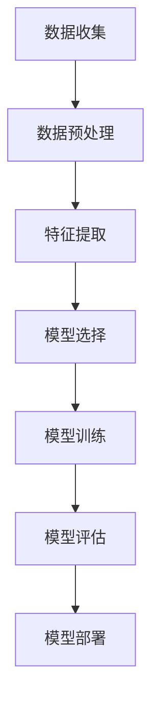
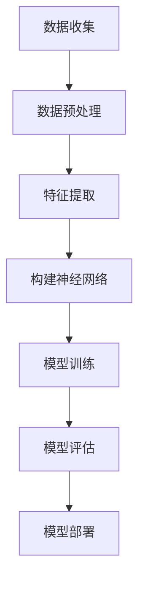
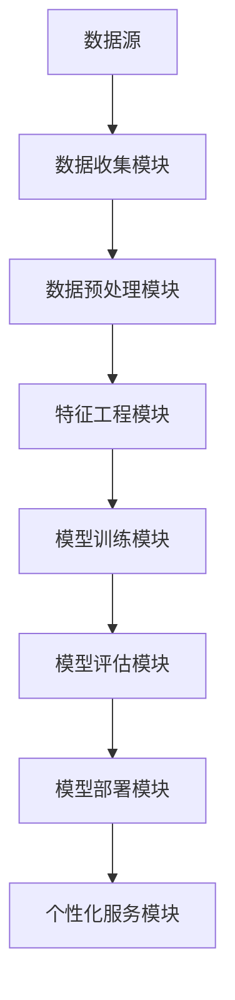

                 

# AI驱动的智能客户画像：深化用户洞察和个性化服务

## 关键词

- 人工智能
- 客户画像
- 个性化服务
- 数据分析
- 用户洞察
- 深度学习

## 摘要

随着大数据和人工智能技术的飞速发展，智能客户画像作为一种深化的用户洞察工具，已成为企业提升服务质量、实现个性化营销的关键。本文从背景与概念、AI在客户画像中的应用、构建智能客户画像的方法、个性化服务设计以及智能客户画像的优化与迭代五个方面，系统地探讨了AI驱动的智能客户画像技术，旨在为企业和开发者提供有价值的参考。

## 目录大纲

- **第1章：问题背景与核心概念**
  - 1.1 问题背景
  - 1.2 核心概念
  - 1.3 概念联系
- **第2章：AI在客户画像中的应用**
  - 2.1 AI概述
  - 2.2 AI在客户画像中的应用
  - 2.3 案例分析
- **第3章：数据收集与预处理**
  - 3.1 数据源选择
  - 3.2 数据预处理
- **第4章：特征工程**
  - 4.1 特征提取
  - 4.2 特征选择
- **第5章：构建客户画像模型**
  - 5.1 模型选择
  - 5.2 模型训练与评估
- **第6章：个性化服务设计**
  - 6.1 个性化服务策略
  - 6.2 实施案例
- **第7章：智能客户画像的优化与迭代**
  - 7.1 评估与反馈
  - 7.2 画像更新与迭代
  - 7.3 持续优化
- **第8章：小结与展望**
  - 8.1 小结
  - 8.2 展望未来

## 第1章：问题背景与核心概念

### 1.1 问题背景

随着互联网技术的飞速发展，企业和品牌面临着前所未有的机遇与挑战。消费者群体越来越多样化，个性化需求日益突出，这要求企业能够深入理解客户，提供更加精准、个性化的服务。在这一背景下，智能客户画像作为一种新兴的技术手段，正逐渐成为企业深化用户洞察和提供个性化服务的关键工具。

#### 1.1.1 消费者行为分析的重要性

消费者行为分析是指通过收集、处理和分析消费者在购买、使用、分享产品过程中的各种数据，以预测和影响其未来行为的一种方法。这种行为分析不仅有助于企业了解客户需求，还可以指导产品开发、市场营销和客户服务等方面的决策。在当今高度竞争的市场环境中，掌握消费者行为分析的重要性不言而喻。

#### 1.1.2 个性化服务需求增长

随着消费者个性化需求的增长，企业越来越意识到，提供个性化的产品和服务是赢得市场竞争的关键。个性化服务不仅能提高客户满意度，还能增强品牌忠诚度和转化率。因此，如何通过智能客户画像来实现个性化服务，成为企业关注的焦点。

#### 1.1.3 数据驱动的决策

数据驱动的决策是一种基于数据分析的决策方法，通过收集和分析大量的数据来支持决策过程。在智能客户画像的应用中，数据驱动的决策能够帮助企业更准确地预测客户需求，优化营销策略，提升运营效率。

### 1.2 核心概念

#### 1.2.1 智能客户画像

智能客户画像是指通过大数据、人工智能等技术，对客户的各类数据进行收集、分析和建模，形成的一个多维度的客户信息图谱。这个图谱能够反映客户的个性化特征、需求和行为模式，为企业的决策提供有力支持。

#### 1.2.2 用户洞察

用户洞察是指通过深入分析和理解用户的行为、需求和偏好，从而获得对用户的深刻认知。用户洞察是构建智能客户画像的基础，也是实现个性化服务的关键。

#### 1.2.3 个性化服务

个性化服务是指根据用户的个性化需求和偏好，为用户提供定制化的产品和服务。个性化服务能够提高用户满意度，增强用户黏性，从而为企业带来更多的商业价值。

### 1.3 概念联系

- **客户画像与用户洞察的关系**

客户画像是对用户洞察的一种可视化表达，通过构建客户画像，企业能够更好地理解和把握用户的需求和行为特征，从而提供更加精准、个性化的服务。

- **个性化服务与AI驱动的客户画像**

AI驱动的客户画像能够帮助企业更深入地洞察用户需求，从而实现更高质量的个性化服务。通过AI技术，企业能够从海量数据中提取出有价值的用户特征，构建出精细化的客户画像，为个性化服务的实施提供数据支撑。

## 第2章：AI在客户画像中的应用

### 2.1 AI概述

人工智能（Artificial Intelligence，AI）是计算机科学的一个分支，旨在使计算机具备人类智能的能力。AI技术主要包括机器学习、深度学习、自然语言处理、计算机视觉等，这些技术为智能客户画像的构建提供了强大的工具和算法支持。

#### 2.1.1 机器学习基础

机器学习是一种通过算法从数据中学习规律、预测未来的方法。在智能客户画像中，机器学习算法可用于数据的分类、聚类、回归等操作，以提取出用户的特征和模式。

#### 2.1.2 深度学习基础

深度学习是机器学习的一个分支，它通过多层神经网络来模拟人脑的神经网络结构，具有强大的特征自动提取能力。在客户画像中，深度学习算法如卷积神经网络（CNN）和循环神经网络（RNN）可以用于处理复杂的非线性关系和特征。

### 2.2 AI在客户画像中的应用

#### 2.2.1 数据收集与预处理

在构建客户画像时，首先需要收集大量的用户数据，包括行为数据、社交网络数据、交易数据等。然后，通过数据预处理技术，如数据清洗、数据整合和特征提取，将这些原始数据进行转换和处理，以获得高质量的输入数据。

#### 2.2.2 特征工程

特征工程是构建客户画像的关键步骤。通过特征工程，可以从原始数据中提取出对用户行为和需求有显著影响的关键特征。这些特征可以用于训练机器学习模型，以构建用户画像。

#### 2.2.3 模型选择与训练

在特征工程完成后，需要选择合适的机器学习模型进行训练。常见的模型包括决策树、随机森林、支持向量机（SVM）和神经网络等。通过模型训练，可以将特征转化为用户画像，从而实现对用户的个性化理解。

### 2.3 案例分析

#### 2.3.1 成功案例

某电商公司利用AI技术构建了智能客户画像系统，通过对用户的购买行为、浏览历史和社交网络数据进行分析，成功实现了个性化推荐。该系统不仅提高了用户满意度，还大幅提升了销售转化率。

#### 2.3.2 失败案例

某初创公司尝试使用AI技术构建客户画像，但由于数据质量不佳和特征选择不当，导致模型效果不佳。此外，公司缺乏专业的数据科学团队，导致项目进展缓慢，最终失败。

### 2.4 挑战与对策

在构建智能客户画像的过程中，企业可能会面临以下挑战：

- **数据质量**：数据质量是智能客户画像成功的关键。企业需要确保数据来源的可靠性和数据的完整性，通过数据清洗和去重技术提高数据质量。
- **特征选择**：特征选择是构建高质量客户画像的关键步骤。企业需要通过实验和比较不同特征对模型性能的影响，选择最合适的特征。
- **模型解释性**：深度学习模型往往具有较好的性能，但缺乏解释性。企业需要通过模型可视化、敏感度分析等方法提高模型的可解释性，以更好地理解模型决策。

## 第3章：数据收集与预处理

### 3.1 数据源选择

构建智能客户画像的第一步是选择合适的数据源。数据源的选择取决于企业业务需求和数据获取能力。常见的数据源包括：

- **用户行为数据**：如浏览历史、购买记录、搜索查询等。
- **社交网络数据**：如用户在社交媒体上的活动、好友关系等。
- **交易数据**：如订单信息、支付方式、退款记录等。
- **第三方数据**：如人口统计数据、经济数据等。

### 3.2 数据预处理

数据预处理是确保数据质量的重要步骤。数据预处理包括以下内容：

- **数据清洗**：去除重复数据、缺失数据和错误数据，保证数据的准确性。
- **数据标准化**：将不同来源和格式的数据进行转换和归一化，使其符合模型的输入要求。
- **数据集成**：将来自不同数据源的数据进行整合，形成统一的视图。

### 3.3 数据预处理技术

常用的数据预处理技术包括：

- **数据清洗技术**：如去重、填补缺失值、异常值检测等。
- **数据标准化技术**：如最小-最大标准化、Z-score标准化等。
- **数据集成技术**：如数据转换、数据融合、数据挖掘等。

## 第4章：特征工程

### 4.1 特征提取

特征提取是从原始数据中提取出对用户行为和需求有显著影响的关键特征的过程。特征提取的目的是提高模型的性能和解释性。常见的特征提取方法包括：

- **统计特征**：如均值、方差、标准差等。
- **文本特征**：如词频、词向量等。
- **图像特征**：如颜色直方图、纹理特征等。

### 4.2 特征选择

特征选择是从提取出的特征中选出对模型性能有显著贡献的特征的过程。特征选择的目的是减少模型的复杂度，提高模型的解释性和泛化能力。常见的特征选择方法包括：

- **过滤法**：通过计算特征的重要性分数，选择重要性较高的特征。
- **包裹法**：通过迭代搜索特征子集，选择最优特征组合。
- **嵌入式方法**：在模型训练过程中，自动选择对模型性能有显著贡献的特征。

## 第5章：构建客户画像模型

### 5.1 模型选择

在构建客户画像模型时，需要选择合适的机器学习模型。常见的模型包括：

- **传统机器学习模型**：如决策树、随机森林、支持向量机（SVM）等。
- **深度学习模型**：如卷积神经网络（CNN）、循环神经网络（RNN）、Transformer等。

### 5.2 模型训练与评估

模型训练是指通过训练数据集，调整模型的参数，使其能够对未知数据进行预测。模型评估是指通过测试数据集，评估模型的性能和泛化能力。常见的评估指标包括准确率、召回率、F1分数等。

### 5.3 模型优化

模型优化是指通过调整模型结构、超参数等方法，提高模型的性能。常见的优化方法包括：

- **调参**：通过搜索和优化模型超参数，提高模型性能。
- **模型融合**：将多个模型进行融合，提高预测性能。

## 第6章：个性化服务设计

### 6.1 个性化服务策略

个性化服务策略是根据用户画像，为用户提供定制化的产品和服务。常见的个性化服务策略包括：

- **产品推荐**：根据用户画像，为用户推荐感兴趣的产品。
- **客户关怀**：根据用户画像，为用户提供个性化的关怀和服务。
- **营销活动**：根据用户画像，设计个性化的营销活动，提高用户参与度和转化率。

### 6.2 实施案例

#### 6.2.1 成功案例

某电商企业利用AI技术，构建了智能客户画像系统，通过分析用户的浏览记录和购买行为，为用户提供个性化推荐。该系统不仅提高了用户满意度，还大幅提升了销售转化率。

#### 6.2.2 挑战与解决

某初创企业尝试利用AI技术构建智能客户画像系统，但由于数据质量和特征选择问题，导致模型效果不佳。经过数据清洗、特征工程和模型调优，企业最终成功构建了高质量的客户画像系统。

## 第7章：智能客户画像的优化与迭代

### 7.1 评估与反馈

评估与反馈是智能客户画像优化的重要环节。企业需要定期评估客户画像的准确性、覆盖率和效果，并根据用户反馈调整画像模型和个性化服务策略。

### 7.2 画像更新与迭代

随着用户行为和数据的变化，智能客户画像需要不断更新和迭代。企业可以通过定期更新数据集、调整特征工程和优化模型结构，保持客户画像的实时性和准确性。

### 7.3 持续优化

持续优化是智能客户画像长期发展的关键。企业需要不断探索新技术和方法，提高客户画像的精度和效率，从而实现更高的商业价值。

## 第8章：小结与展望

### 8.1 小结

本文系统地探讨了AI驱动的智能客户画像技术，包括问题背景、核心概念、AI应用、数据预处理、特征工程、模型构建、个性化服务设计和优化迭代等方面。通过智能客户画像，企业可以更深入地洞察用户需求，实现个性化服务，提升用户体验和商业价值。

### 8.2 展望未来

随着人工智能技术的不断进步，智能客户画像技术将更加成熟和普及。未来，企业可以通过更高效的数据收集和分析方法、更精准的特征工程和更智能的模型算法，构建出更加精细化的客户画像，实现更高质量的个性化服务。

## 作者信息

- 作者：AI天才研究院/AI Genius Institute & 禅与计算机程序设计艺术 /Zen And The Art of Computer Programming

## 附录

- **背景介绍**

智能客户画像作为一种新兴技术，正逐渐成为企业提升服务质量和实现个性化营销的关键。本文从核心概念、问题背景、技术方法等方面，全面探讨了智能客户画像的应用和实践。

- **核心概念与联系**

智能客户画像、用户洞察、个性化服务是本文的核心概念。它们之间的关系如图1所示：

```
+----------------+      +----------------+      +----------------+
|    智能客户画像    |      |      用户洞察      |      |   个性化服务   |
+----------------+      +----------------+      +----------------+
           |                      |                      |
           |                      |                      |
           |                      |                      |
           +----------------------+                      +
                                      |
                                      |
                                      |
                                      |
                                      |
                                 +----------------------+
                                 |   AI技术方法         |
                                 +----------------------+
```

- **算法原理讲解**

本文中涉及的算法主要包括机器学习模型和深度学习模型。以下是一个简单的机器学习模型的mermaid流程图：



以下是一个简单的深度学习模型的mermaid流程图：



- **系统分析与架构设计方案**

假设我们要构建一个智能客户画像系统，以下是其mermaid架构图：



- **项目实战**

在本节中，我们将通过一个简单的Python代码示例，展示如何实现一个基于K-means算法的客户画像聚类。

```python
from sklearn.cluster import KMeans
from sklearn.datasets import make_blobs
import matplotlib.pyplot as plt

# 创建样本数据
X, y = make_blobs(n_samples=100, centers=3, cluster_std=1.0, random_state=0)

# 使用K-means算法进行聚类
kmeans = KMeans(n_clusters=3, random_state=0).fit(X)
predicted_labels = kmeans.predict(X)

# 可视化聚类结果
plt.figure(figsize=(10, 6))
plt.scatter(X[:, 0], X[:, 1], c=predicted_labels, cmap='viridis')
plt.scatter(kmeans.cluster_centers_[:, 0], kmeans.cluster_centers_[:, 1], s=300, c='red', label='Centroids')
plt.title('K-means Clustering')
plt.xlabel('Feature 1')
plt.ylabel('Feature 2')
plt.legend()
plt.show()
```

- **最佳实践 tips**

1. 确保数据质量，进行充分的数据清洗和预处理。
2. 选择合适的特征，进行有效的特征选择。
3. 调整模型参数，进行模型调优。
4. 定期评估模型效果，进行模型更新和迭代。

- **小结**

本文系统地探讨了AI驱动的智能客户画像技术，从背景与概念、AI应用、数据预处理、特征工程、模型构建、个性化服务设计和优化迭代等方面进行了深入分析。智能客户画像作为一种重要的技术手段，将在未来为企业提供更精准、个性化的服务。

- **注意事项**

1. 构建智能客户画像时，需要确保数据的隐私保护和合规性。
2. 在使用深度学习模型时，需要注意模型的解释性问题。
3. 持续优化和迭代是智能客户画像成功的关键。

- **拓展阅读**

1. 《机器学习实战》
2. 《深度学习》
3. 《数据挖掘：实用机器学习技术》

以上是关于《AI驱动的智能客户画像：深化用户洞察和个性化服务》的技术博客文章。文章内容丰富，涵盖了智能客户画像的各个关键方面，旨在为读者提供全面的技术指导和应用建议。希望本文能够对您在构建智能客户画像的过程中有所帮助。

