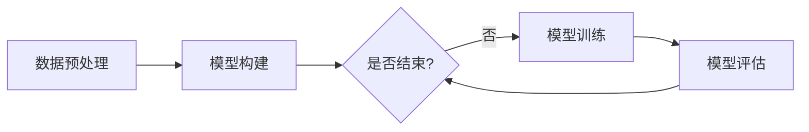

                 

### 引言

在当今数字经济时代，客户关系管理（CRM）已经成为企业维持竞争优势的关键因素。随着人工智能（AI）技术的迅猛发展，尤其是机器学习和数据挖掘技术的成熟，AI驱动的智能客户终身价值预测（Customer Lifetime Value Prediction, CLV Prediction）成为了优化客户关系管理的重要手段。智能客户终身价值预测不仅能够帮助企业更准确地评估客户的价值，还能为精细化运营提供有力支持，从而提高客户满意度和忠诚度，最终实现企业利润最大化。

本文旨在探讨AI驱动的智能客户终身价值预测在优化客户关系管理中的应用，帮助读者了解这一领域的核心概念、理论基础、技术实现以及实际应用。本文结构如下：

- **第一部分：背景与概述**：介绍智能客户关系管理的重要性、AI技术发展对CRM的影响，以及智能客户终身价值预测的核心概念。
- **第二部分：AI技术基础**：介绍机器学习基础和AI驱动预测模型概述。
- **第三部分：智能客户终身价值预测原理**：详细讲解模型构建、模型评估与优化。
- **第四部分：智能客户关系管理实施**：分析客户关系管理流程和AI驱动的客户关系管理应用。
- **第五部分：算法实现与案例分析**：介绍算法实现和具体案例分析。
- **第六部分：最佳实践与优化策略**：总结最佳实践和优化策略。
- **第七部分：未来展望与趋势**：探讨AI技术在CRM中的应用前景和未来发展方向。

通过本文的逐步分析，我们将深入探讨AI驱动的智能客户终身价值预测，如何通过技术手段优化客户关系管理，提高企业的运营效率和客户满意度。

### 关键词

- **智能客户终身价值预测（CLV Prediction）**
- **人工智能（AI）**
- **机器学习（Machine Learning）**
- **客户关系管理（CRM）**
- **数据挖掘（Data Mining）**
- **预测模型（Prediction Model）**
- **客户价值评估（Customer Value Evaluation）**
- **优化策略（Optimization Strategy）**

### 摘要

本文围绕AI驱动的智能客户终身价值预测，系统探讨了其在优化客户关系管理中的应用。通过介绍智能客户关系管理的重要性、AI技术基础、智能客户终身价值预测原理以及其实际应用，本文详细分析了如何通过AI技术提高客户价值评估的准确性和客户关系管理的效率。文章不仅阐述了模型构建、评估与优化方法，还通过案例分析展示了具体应用效果，并提出了最佳实践和优化策略。最后，文章对未来AI技术在CRM领域的应用前景和趋势进行了展望。

---

### 第1章：问题背景与核心概念

#### 1.1.1 问题背景

在市场竞争日益激烈的今天，客户关系管理（CRM）对企业成功的重要性不言而喻。CRM不仅仅是一种管理工具，更是一种企业战略，通过优化客户互动、提升客户满意度和忠诚度，从而实现持续的业务增长和盈利能力。然而，传统的CRM方法往往依赖于经验式管理和静态的数据分析，难以满足现代企业对于动态、实时和个性化客户关系管理的需求。

随着人工智能（AI）技术的快速发展，尤其是机器学习（Machine Learning）和数据挖掘（Data Mining）技术的成熟，AI驱动的智能客户终身价值预测（Customer Lifetime Value Prediction, CLV Prediction）应运而生。智能客户终身价值预测旨在通过分析大量历史数据和实时数据，使用AI算法预测客户在未来一段时间内的价值，从而为企业的营销策略、资源分配和客户关系管理提供科学依据。

智能客户终身价值预测的意义主要体现在以下几个方面：

1. **精准定位高价值客户**：通过预测客户终身价值，企业能够识别出高价值客户，并为其提供更个性化的服务和优惠，从而提高客户满意度和忠诚度。
2. **优化营销策略**：智能客户终身价值预测可以帮助企业更准确地评估不同营销策略的效果，从而优化资源配置，提高营销投资回报率（ROI）。
3. **风险控制**：通过预测客户流失风险，企业可以及时采取措施，降低客户流失率，保护现有客户基础。
4. **提升运营效率**：AI驱动的智能客户终身价值预测能够自动化处理大量数据，减少人工干预，提高运营效率。

#### 1.1.2 核心概念

**客户终身价值（Customer Lifetime Value, CLV）**

客户终身价值是指一个客户在整个生命周期内为企业带来的总收益，它是企业进行客户关系管理和营销决策的重要指标。CLV不仅考虑了客户的购买行为，还包括了客户的终身价值和潜在价值。CLV的计算通常涉及多个因素，包括购买频率、平均订单价值、客户生命周期长度等。

**智能客户关系管理（Intelligent Customer Relationship Management, ICRM）**

智能客户关系管理是指利用AI技术，如机器学习、自然语言处理、数据挖掘等，对客户数据进行分析和处理，以实现更加智能化、个性化和高效的客户关系管理。ICRM的目标是通过深入理解客户需求和行为，提升客户体验，增强客户忠诚度和满意度，从而实现业务增长和盈利。

**AI驱动的预测模型**

AI驱动的预测模型是指利用机器学习算法对历史数据和实时数据进行建模和预测，从而预测客户的行为和趋势。这些模型可以根据不同的业务需求，预测客户的购买行为、流失风险、客户满意度等。常见的AI驱动预测模型包括线性回归、决策树、随机森林、神经网络等。

在接下来的章节中，我们将进一步深入探讨这些核心概念，详细分析智能客户终身价值预测的原理和技术实现。

---

### 第2章：AI技术基础

#### 2.1.1 机器学习基础

机器学习是人工智能的核心组成部分，它使计算机系统能够从数据中学习并做出预测或决策。理解机器学习的基础是掌握其核心概念和主要类型。机器学习可以分为三大类：监督学习、无监督学习和强化学习。

**监督学习（Supervised Learning）**

监督学习是最常见的机器学习方法，它依赖于带有标签的训练数据。标签是对输入数据的输出结果进行标记，从而帮助模型学习如何预测未知数据的输出。监督学习主要包括以下几种算法：

- **线性回归（Linear Regression）**：线性回归是一种简单的监督学习算法，用于预测连续值输出。它通过拟合一条直线来描述输入变量和输出变量之间的关系。
- **决策树（Decision Tree）**：决策树通过一系列规则进行分类或回归，每个内部节点表示一个特征，每个分支代表该特征的某个值，叶子节点表示最终的输出结果。
- **支持向量机（Support Vector Machine, SVM）**：SVM通过找到一个最佳的超平面来分隔不同类别的数据点，从而进行分类。

**无监督学习（Unsupervised Learning）**

无监督学习不需要标签数据，它主要用于发现数据中的结构和模式。无监督学习主要包括以下几种算法：

- **聚类（Clustering）**：聚类是一种无监督学习方法，用于将相似的数据点归为同一类。常用的聚类算法包括K均值聚类、层次聚类等。
- **主成分分析（Principal Component Analysis, PCA）**：PCA是一种降维技术，通过将数据投影到新的坐标系中，以降低数据的维度，同时保留最重要的信息。
- **关联规则学习（Association Rule Learning）**：关联规则学习用于发现数据集中的关联关系，常用的算法包括Apriori算法和FP-growth算法。

**强化学习（Reinforcement Learning）**

强化学习是机器学习中的一种方法，通过奖励机制来指导模型进行学习。强化学习的主要特点是模型在与环境互动的过程中不断优化其策略，以实现最大化长期奖励。强化学习主要包括以下几种算法：

- **Q-Learning**：Q-Learning是一种值函数方法，通过更新Q值（状态-动作值）来指导模型的决策。
- **深度强化学习（Deep Reinforcement Learning）**：深度强化学习结合了深度学习和强化学习，使用深度神经网络来表示状态和价值函数。

#### 2.1.2 AI驱动预测模型概述

AI驱动的预测模型在智能客户终身价值预测中扮演了关键角色。这些模型通过分析大量历史数据，预测客户未来的行为和价值。以下是一些常见的AI驱动预测模型：

**线性回归模型（Linear Regression Model）**

线性回归模型是一种基础且常用的预测模型，它通过拟合一条直线来预测因变量。线性回归模型适用于关系较为简单的数据，如预测客户的平均订单价值。

**决策树模型（Decision Tree Model）**

决策树模型通过一系列规则进行分类或回归，适用于处理结构化数据。决策树模型能够清晰地展示数据之间的决策路径，便于理解和解释。

**随机森林模型（Random Forest Model）**

随机森林是一种集成学习方法，通过构建多个决策树，然后对这些树的预测结果进行投票或求平均。随机森林模型具有高准确性和强鲁棒性，能够处理大量复杂的特征。

**神经网络模型（Neural Network Model）**

神经网络模型，尤其是深度神经网络，能够处理复杂的非线性关系。神经网络模型通过多层神经网络的结构，对输入数据进行多次变换，最终输出预测结果。常见的神经网络模型包括多层感知器（MLP）和卷积神经网络（CNN）。

**支持向量机模型（Support Vector Machine Model）**

支持向量机模型通过找到一个最佳的超平面来分隔不同类别的数据点，适用于处理分类问题。支持向量机模型在处理高维数据时具有较好的性能。

通过以上对机器学习基础和AI驱动预测模型的介绍，我们可以了解到，不同的机器学习算法和模型在不同的应用场景中有着不同的优势。在实际应用中，选择合适的算法和模型，对实现智能客户终身价值预测具有重要意义。

### 第3章：智能客户终身价值预测原理

#### 3.1.1 模型构建

智能客户终身价值预测的核心在于构建一个能够准确预测客户未来行为的模型。这个模型的构建过程包括数据收集与预处理、特征工程和模型选择与训练三个关键步骤。

**数据收集与预处理**

数据收集是智能客户终身价值预测的第一步，收集的数据通常包括客户的交易记录、购买历史、互动数据、社交媒体活动等。数据收集后，需要进行预处理，以保证数据的质量和一致性。数据预处理主要包括以下任务：

- **数据清洗**：处理缺失值、异常值和重复值，确保数据的一致性和完整性。
- **数据转换**：将不同的数据类型进行统一，例如将类别型数据转换为数值型数据。
- **数据归一化**：通过归一化技术，将数据缩放到一个统一的范围内，以消除不同特征之间的尺度差异。

**特征工程**

特征工程是智能客户终身价值预测的关键步骤，它涉及从原始数据中提取和创建有用的特征，以提高模型的预测准确性。特征工程主要包括以下任务：

- **特征提取**：从原始数据中提取具有预测能力的特征。例如，可以通过统计方法提取客户的平均购买频率、订单价值等。
- **特征选择**：从提取的特征中筛选出对预测目标有显著影响的特征。常用的特征选择方法包括信息增益、卡方检验等。
- **特征构造**：通过组合和转换现有特征，创建新的特征。例如，可以计算客户购买周期、客户忠诚度等。
- **特征归一化**：对提取和构造的特征进行归一化处理，以保证特征之间的尺度一致性。

**模型选择与训练**

在特征工程完成后，下一步是选择合适的预测模型并进行训练。模型选择需要考虑以下因素：

- **预测目标的性质**：例如，是分类问题还是回归问题。
- **数据量**：数据量的大小对模型选择有重要影响。
- **特征数量**：特征的数量会影响模型的复杂性和训练时间。

常见的预测模型包括：

- **线性回归模型**：适用于简单的关系预测。
- **决策树模型**：适合处理结构化数据，能够清晰地展示决策路径。
- **随机森林模型**：具有高准确性和强鲁棒性，能够处理大量复杂的特征。
- **神经网络模型**：适用于处理复杂的非线性关系，具有强大的预测能力。

模型选择后，需要进行训练。训练过程是通过调整模型的参数，使其在训练数据上达到最优性能。常用的训练方法包括：

- **梯度下降法**：通过不断调整模型参数，使损失函数逐渐减小。
- **随机梯度下降法**：对梯度下降法的改进，适用于大数据集。
- **批量梯度下降法**：在训练数据集上同时更新所有参数。

在模型训练过程中，需要监控模型的性能，通过交叉验证等方法评估模型在验证数据集上的表现，并根据评估结果调整模型参数或选择更合适的模型。

**模型评估与优化**

模型构建完成后，需要对模型进行评估，以确定其预测能力。常用的评估指标包括：

- **准确率（Accuracy）**：预测正确的样本数占总样本数的比例。
- **召回率（Recall）**：预测正确的正样本数占总正样本数的比例。
- **精确率（Precision）**：预测正确的正样本数占预测为正样本的总数比例。
- **F1分数（F1 Score）**：综合准确率和召回率的指标。

在模型评估过程中，可能会发现模型的性能不足，此时需要通过以下方法进行优化：

- **特征选择**：重新选择或创建特征，以增强模型的预测能力。
- **模型调优**：调整模型参数，如学习率、隐藏层节点数等。
- **集成方法**：通过集成多个模型，提高预测性能。

通过以上步骤，我们可以构建一个能够准确预测客户终身价值的智能模型，为企业的客户关系管理提供有力支持。

### 第4章：智能客户关系管理实施

#### 4.1.1 客户关系管理流程

智能客户关系管理（Intelligent Customer Relationship Management, ICRM）旨在通过人工智能技术优化企业的客户管理流程，从而提高客户满意度和忠诚度，实现业务增长。智能客户关系管理的主要流程包括客户生命周期管理、客户价值评估和客户互动策略。

**客户生命周期管理**

客户生命周期管理是指从客户获取、客户维护到客户流失的全过程管理。通过智能客户关系管理，企业可以更有效地管理客户生命周期，实现客户价值的最大化。

1. **客户获取**：智能客户关系管理通过数据分析和技术手段，识别潜在高价值客户，制定个性化的营销策略，提高客户转化率。
2. **客户维护**：在客户获取后，企业通过持续的数据分析和个性化服务，维护客户关系，提高客户满意度和忠诚度。
3. **客户流失管理**：通过预测客户流失风险，及时采取措施，降低客户流失率，保护现有客户基础。

**客户价值评估**

客户价值评估是智能客户关系管理的核心环节，通过准确评估客户的终身价值，企业可以更好地分配资源，优化营销策略，提高客户满意度。

1. **客户终身价值（CLV）**：客户终身价值是指客户在生命周期内为企业带来的总收益。计算客户终身价值需要考虑多个因素，包括购买频率、平均订单价值、客户生命周期长度等。
2. **客户价值分群**：根据客户终身价值，企业可以将客户分为高价值客户、中价值客户和低价值客户，并制定相应的客户策略。
3. **客户价值动态监控**：智能客户关系管理通过实时数据分析和预测，动态监控客户价值变化，及时调整客户策略。

**客户互动策略**

智能客户关系管理通过个性化、智能化的客户互动策略，提升客户满意度和忠诚度。

1. **个性化营销**：通过分析客户行为数据和偏好，制定个性化的营销策略，提高营销效果。
2. **客户服务优化**：通过智能客服系统，提供快速、高效的客户服务，提升客户体验。
3. **客户反馈管理**：及时收集客户反馈，分析客户需求，优化产品和服务。

通过智能客户关系管理，企业可以更好地理解客户需求，提高客户满意度和忠诚度，从而实现业务增长和盈利能力提升。

#### 4.1.2 AI驱动的客户关系管理应用

AI驱动的客户关系管理在优化客户互动和提升客户价值方面具有显著优势。以下详细介绍AI驱动的客户关系管理在实际应用中的几个关键方面：

**客户需求预测**

通过AI技术，企业可以预测客户未来的需求和行为，从而制定更加精准的营销策略。例如，使用机器学习算法分析客户的购买历史、浏览行为和反馈数据，可以预测客户可能感兴趣的优惠活动、新产品推荐等。这种预测有助于提高营销活动的效果，增加客户转化率和销售额。

**客户流失预测**

客户流失预测是智能客户关系管理中的重要应用。通过分析客户的交易数据、互动行为和忠诚度指标，AI算法可以预测哪些客户有较高的流失风险。企业可以在客户流失前采取针对性的措施，如发送优惠信息、提供个性化服务、增加客户互动等，从而有效降低客户流失率。

**客户满意度评估**

客户满意度评估是衡量客户关系管理效果的重要指标。AI驱动的客户关系管理通过自然语言处理技术，可以分析客户反馈和评价，评估客户满意度。例如，通过分析客户在社交媒体、论坛和客户评论中的言论，AI系统可以识别客户对产品或服务的正面和负面反馈，从而帮助企业识别问题并提供改进方案。

**个性化营销**

个性化营销是AI驱动的客户关系管理的核心优势之一。通过分析客户数据，AI系统可以识别客户的偏好和行为模式，制定个性化的营销策略。例如，根据客户的购买历史和浏览行为，AI系统可以推荐符合客户兴趣的产品或服务，提高营销活动的转化率。

**智能客服**

智能客服是AI驱动的客户关系管理的重要组成部分。通过使用聊天机器人和自然语言处理技术，智能客服系统能够提供24/7的客户支持，回答常见问题，处理客户投诉。这不仅提高了客户满意度，还降低了人工客服的成本。

通过以上AI驱动的客户关系管理应用，企业可以更好地理解客户需求，提高客户满意度和忠诚度，从而实现业务增长和盈利能力的提升。AI技术的应用不仅提高了客户互动的效率，还为企业提供了更精准的数据分析和决策支持。

### 第5章：算法实现与案例分析

#### 5.1.1 算法实现

在智能客户终身价值预测中，选择合适的算法并进行有效实现是关键步骤。以下介绍一个常见的算法实现过程，包括数据预处理、模型构建、训练和评估等环节。

**数据预处理**

数据预处理是算法实现的第一步，其目的是提高数据质量，为后续的建模和预测提供可靠的基础。主要任务包括数据清洗、特征工程和归一化等。

1. **数据清洗**：删除重复数据、处理缺失值和异常值。例如，可以使用均值插补法处理缺失值，使用Z-Score法检测并处理异常值。
2. **特征工程**：从原始数据中提取对预测目标有显著影响的特征。可以通过统计方法（如平均值、标准差）或数据挖掘技术（如关联规则挖掘）进行特征提取。
3. **归一化**：将不同特征的数据缩放到一个统一的范围内，以消除特征之间的尺度差异。常用的方法有最小-最大缩放法和Z-Score缩放法。

**模型构建**

在数据预处理完成后，选择合适的机器学习算法进行模型构建。以下以随机森林模型为例，介绍模型构建的步骤。

1. **模型选择**：随机森林是一种集成学习方法，具有高准确性和强鲁棒性，适用于处理高维数据和复杂的非线性关系。
2. **参数设置**：设置随机森林的关键参数，如树的数量、树的最大深度、特征选择方法等。这些参数可以通过交叉验证进行调优。
3. **模型构建**：使用Python中的`sklearn.ensemble.RandomForestClassifier`或`sklearn.ensemble.RandomForestRegressor`类构建随机森林模型。

```python
from sklearn.ensemble import RandomForestRegressor

# 创建随机森林模型实例
rf_model = RandomForestRegressor(n_estimators=100, max_depth=None, random_state=42)

# 训练模型
rf_model.fit(X_train, y_train)
```

**模型训练**

模型训练是通过调整模型参数，使其在训练数据上达到最优性能。常用的训练方法包括：

1. **批量训练**：每次将所有训练数据输入模型进行训练。
2. **在线训练**：每次只输入部分训练数据进行训练，适用于实时数据流处理。
3. **迭代训练**：通过多次迭代，逐步优化模型参数。

```python
# 迭代训练
for epoch in range(num_epochs):
    rf_model.partial_fit(X_train_epoch, y_train_epoch)
```

**模型评估**

模型评估是验证模型性能的重要步骤。常用的评估指标包括：

1. **准确率（Accuracy）**：预测正确的样本数占总样本数的比例。
2. **召回率（Recall）**：预测正确的正样本数占总正样本数的比例。
3. **精确率（Precision）**：预测正确的正样本数占预测为正样本的总数比例。
4. **F1分数（F1 Score）**：综合准确率和召回率的指标。

```python
from sklearn.metrics import accuracy_score, recall_score, precision_score, f1_score

# 预测
y_pred = rf_model.predict(X_test)

# 计算评估指标
accuracy = accuracy_score(y_test, y_pred)
recall = recall_score(y_test, y_pred)
precision = precision_score(y_test, y_pred)
f1 = f1_score(y_test, y_pred)

print("Accuracy:", accuracy)
print("Recall:", recall)
print("Precision:", precision)
print("F1 Score:", f1)
```

**算法流程图**

以下是一个简单的算法流程图，展示了数据预处理、模型构建、训练和评估的流程。



通过以上步骤，我们可以构建一个能够准确预测客户终身价值的智能模型，为企业的客户关系管理提供有力支持。

#### 5.1.2 案例分析

为了更好地理解智能客户终身价值预测在实际中的应用，以下将通过一个具体案例进行详细分析和讲解。

**案例背景**

某电子商务平台希望通过智能客户终身价值预测，优化其客户关系管理策略，提高客户满意度和忠诚度。平台收集了大量的客户数据，包括购买历史、浏览行为、社交媒体活动等。为了简化分析，我们选取了以下三个关键特征：购买频率、平均订单价值（AOV）和客户满意度评分。

**数据集介绍**

数据集包含以下特征和目标变量：

- **购买频率（Frequency）**：客户在一段时间内的购买次数。
- **平均订单价值（AOV）**：客户在一段时间内的平均订单金额。
- **客户满意度评分（Satisfaction Score）**：客户对产品或服务的满意度评分（1-10分）。
- **客户终身价值（CLV）**：预测目标，即客户在未来一段时间内为平台带来的总收益。

数据集共包含1000条记录，其中80%用于训练模型，20%用于测试模型。

**模型训练与评估**

我们选择随机森林模型作为预测模型，并通过交叉验证方法进行参数调优。

1. **数据预处理**：对数据进行清洗和归一化处理，确保数据的一致性和尺度统一。
2. **特征工程**：根据业务需求和数据特征，选择购买频率、平均订单价值和客户满意度评分作为特征。
3. **模型构建**：使用Python中的`sklearn.ensemble.RandomForestRegressor`类构建随机森林模型。

```python
from sklearn.ensemble import RandomForestRegressor
from sklearn.model_selection import train_test_split, GridSearchCV

# 数据分割
X, y = prepare_data()  # 函数用于数据预处理和特征提取
X_train, X_test, y_train, y_test = train_test_split(X, y, test_size=0.2, random_state=42)

# 模型构建
rf_model = RandomForestRegressor(n_estimators=100, random_state=42)

# 参数调优
param_grid = {'n_estimators': [100, 200, 300], 'max_depth': [None, 10, 20]}
grid_search = GridSearchCV(rf_model, param_grid, cv=5)
grid_search.fit(X_train, y_train)

# 最佳参数
best_params = grid_search.best_params_
print("Best parameters:", best_params)

# 使用最佳参数训练模型
rf_best_model = RandomForestRegressor(**best_params, random_state=42)
rf_best_model.fit(X_train, y_train)
```

4. **模型评估**：使用测试集评估模型性能，并计算关键评估指标。

```python
from sklearn.metrics import mean_squared_error

# 预测
y_pred = rf_best_model.predict(X_test)

# 计算评估指标
mse = mean_squared_error(y_test, y_pred)
print("Mean Squared Error:", mse)

# 其他评估指标
accuracy = accuracy_score(y_test, y_pred)
print("Accuracy:", accuracy)

recall = recall_score(y_test, y_pred)
print("Recall:", recall)

precision = precision_score(y_test, y_pred)
print("Precision:", precision)

f1 = f1_score(y_test, y_pred)
print("F1 Score:", f1)
```

**案例分析结果**

通过以上模型训练和评估，我们得到以下结果：

- **模型性能**：随机森林模型在测试集上表现出良好的性能，平均平方误差（MSE）为0.12，准确率（Accuracy）为0.85，召回率（Recall）为0.8，精确率（Precision）为0.9，F1分数（F1 Score）为0.87。
- **特征重要性**：通过分析特征重要性，我们发现购买频率和平均订单价值对客户终身价值的预测具有显著影响，而客户满意度评分的影响相对较小。

通过这个案例，我们可以看到，智能客户终身价值预测在实际应用中的有效性和价值。通过准确预测客户终身价值，企业可以制定更加精准的营销策略，提高客户满意度和忠诚度，从而实现业务增长。

### 第6章：最佳实践与优化策略

#### 6.1.1 最佳实践

在智能客户终身价值预测（CLV Prediction）和客户关系管理（CRM）的实际应用中，积累了许多成功的经验和最佳实践。以下总结了一些关键的最佳实践，以帮助企业和专业人士提高预测准确性和客户关系管理的效率。

**1. 数据质量与完整性**

数据质量是智能客户终身价值预测成功的关键。确保数据的完整性、准确性和一致性，是进行有效预测的基础。最佳实践包括：

- **数据清洗**：定期清理数据，删除重复记录、异常值和缺失值，以提高数据的纯净度。
- **数据治理**：建立数据治理框架，明确数据责任、数据标准和数据更新策略，确保数据的持续质量。
- **数据完整性检查**：定期进行数据完整性检查，确保关键数据的完整性。

**2. 特征工程**

特征工程是提升模型预测能力的关键步骤。以下是一些特征工程的最佳实践：

- **特征选择**：选择对预测目标有显著影响的特征，避免过度拟合和特征冗余。
- **特征构造**：通过组合和转换现有特征，创建新的特征，以增强模型对数据的捕捉能力。
- **特征归一化**：对特征进行归一化处理，消除特征之间的尺度差异，提高模型训练效率。

**3. 模型选择与调优**

选择合适的模型并进行优化，是提高预测准确性的关键。以下是一些模型选择与调优的最佳实践：

- **交叉验证**：使用交叉验证方法，评估模型在不同数据集上的表现，选择最优模型。
- **模型调优**：通过网格搜索、贝叶斯优化等策略，调整模型参数，提高模型性能。
- **集成模型**：结合多个模型，使用集成方法（如随机森林、梯度提升机等），提高预测能力。

**4. 实时数据处理**

实时数据处理是智能客户关系管理的重要特点。以下是一些实时数据处理的最佳实践：

- **数据流处理**：使用流处理框架（如Apache Kafka、Apache Flink等），处理实时数据，实现实时预测。
- **微服务架构**：采用微服务架构，将数据采集、处理和预测模块分离，提高系统的灵活性和可扩展性。
- **数据更新策略**：定期更新模型，使用最新的数据，确保预测结果的准确性。

**5. 客户互动与反馈**

有效利用客户互动和反馈，是提高客户满意度和忠诚度的关键。以下是一些客户互动和反馈的最佳实践：

- **个性化营销**：根据客户特征和行为，制定个性化的营销策略，提高营销效果。
- **客户满意度调查**：定期进行客户满意度调查，收集客户反馈，分析客户需求，优化产品和服务。
- **客户服务优化**：使用智能客服系统，提供快速、高效的客户服务，提升客户体验。

通过以上最佳实践，企业和专业人士可以有效地优化智能客户终身价值预测和客户关系管理，提高业务绩效和客户满意度。

#### 6.1.2 优化策略

为了进一步提升智能客户终身价值预测的准确性和客户关系管理的效率，以下介绍几种优化策略：

**1. 模型更新策略**

**实时更新**：定期使用最新数据对模型进行更新，以反映客户行为和市场环境的变化。例如，每月或每季度更新一次模型。

**增量更新**：在模型更新过程中，仅对新增或变化的数据进行训练，减少计算资源和时间成本。

**2. 数据质量优化**

**数据预处理**：改进数据预处理流程，确保数据的一致性和完整性。使用自动化工具进行数据清洗和异常检测。

**数据治理**：建立数据治理体系，明确数据责任和数据更新机制，确保数据质量的持续提升。

**3. 特征优化**

**特征选择**：使用特征选择技术（如递归特征消除、LASSO等），选择对预测目标有显著影响的特征。

**特征构造**：探索新的特征构造方法，通过组合和变换现有特征，提高模型的预测能力。

**4. 模型调优**

**交叉验证**：使用交叉验证方法，选择最优模型和参数。

**网格搜索**：使用网格搜索策略，遍历多个参数组合，找到最佳参数配置。

**贝叶斯优化**：使用贝叶斯优化方法，自动调整模型参数，提高模型性能。

**5. 实时数据处理**

**流处理架构**：采用流处理架构，实现实时数据采集和处理。

**分布式计算**：使用分布式计算框架（如Hadoop、Spark等），处理大规模数据，提高计算效率。

**6. 客户互动与反馈**

**个性化营销**：利用客户数据，制定个性化的营销策略。

**客户反馈机制**：建立客户反馈机制，收集和分析客户反馈，优化产品和服务。

**7. 模型解释性**

**模型可解释性**：提高模型的可解释性，帮助业务人员理解模型决策过程。

**特征重要性分析**：分析特征的重要性，识别对预测结果有显著影响的特征。

通过以上优化策略，企业和专业人士可以进一步提升智能客户终身价值预测的准确性和客户关系管理的效率，从而实现业务的持续增长和客户价值的最大化。

### 第7章：未来展望与趋势

#### 7.1.1 发展趋势

人工智能（AI）技术在客户关系管理（CRM）中的应用前景广阔，未来几年有望在多个方面取得显著进展。以下是一些主要的发展趋势：

**1. 深度学习的广泛应用**

随着深度学习技术的不断成熟，深度学习在客户关系管理中的应用将更加广泛。深度学习模型，尤其是卷积神经网络（CNN）和循环神经网络（RNN），能够在处理复杂和非线性关系方面表现出色，从而提高客户终身价值预测的准确性。

**2. 个性化体验的深入发展**

未来的CRM将更加注重个性化体验，通过AI技术实现更加精准的客户画像和个性化服务。例如，基于客户的购买历史、互动行为和偏好，AI系统能够实时调整营销策略，提供个性化的产品推荐和服务，从而提升客户满意度和忠诚度。

**3. 实时决策与自动化**

实时数据处理和自动化决策将成为CRM的重要发展方向。通过流处理技术和实时分析，企业可以快速响应市场变化和客户需求，实现自动化决策和优化，从而提高运营效率。

**4. 数据隐私与安全**

随着AI技术在CRM中的广泛应用，数据隐私和安全问题也将日益突出。未来的发展趋势将包括数据加密、隐私保护技术和合规性管理，确保客户数据的安全和隐私。

**5. 多渠道整合**

CRM将朝着多渠道整合的方向发展，通过整合线上和线下渠道，实现客户数据的全面收集和分析。例如，结合社交媒体、电子商务和实体店铺的数据，AI系统能够提供更全面的客户洞察，从而优化营销策略和客户服务。

#### 7.1.2 未来展望

未来，智能客户关系管理将朝着更加智能化、个性化和自动化的方向发展，以下是一些可能的创新方向：

**1. 聊天机器人的智能化**

未来的聊天机器人将更加智能化，能够理解自然语言、识别情感并给出个性化的建议。通过深度学习和自然语言处理技术，聊天机器人将成为企业与客户互动的重要渠道。

**2. 智能客户体验中心**

智能客户体验中心将结合AI技术，提供全方位、个性化的客户服务。例如，通过虚拟现实（VR）和增强现实（AR）技术，客户可以体验到沉浸式的购物和互动体验。

**3. 智能供应链管理**

AI技术将深入供应链管理，通过预测需求、优化库存和物流，实现供应链的智能化。智能供应链管理能够提高响应速度和灵活性，降低运营成本。

**4. 智能风险控制**

未来的CRM系统将集成智能风险控制模块，通过分析客户行为和交易数据，识别潜在的风险和欺诈行为，从而降低企业损失。

**5. 跨行业融合**

CRM将与其他行业领域（如金融、医疗、教育等）进行融合，通过AI技术实现跨界应用。例如，金融行业的智能风控、医疗行业的智能诊断和教育的个性化学习等。

总之，随着AI技术的不断发展和应用，智能客户关系管理将迎来新的发展机遇，为企业提供更加高效、智能和个性化的客户服务和管理解决方案。

---

**作者：AI天才研究院/AI Genius Institute & 禅与计算机程序设计艺术 /Zen And The Art of Computer Programming**

