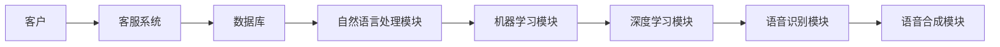
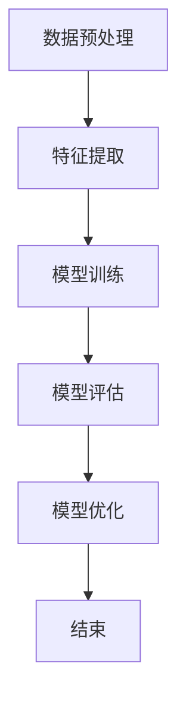
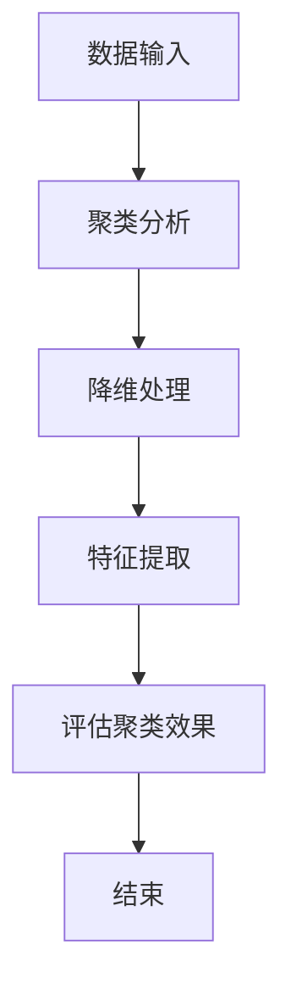
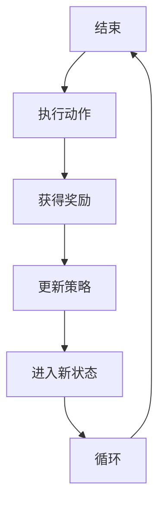
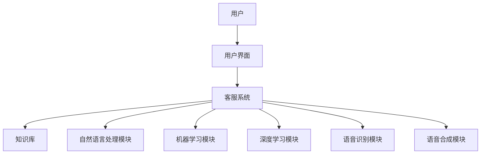

                 

# AI驱动的智能客服：效率与人性化的平衡

## 关键词
- **AI驱动的智能客服**
- **效率**
- **人性化**
- **算法原理**
- **用户体验**
- **系统架构**

## 摘要
随着人工智能技术的飞速发展，AI驱动的智能客服已成为企业提升服务效率和客户满意度的关键手段。本文将探讨AI驱动智能客服在提高效率和实现人性化服务之间的平衡。我们将从问题背景、核心概念、算法原理、系统架构以及项目实战等多个角度，深入分析如何通过技术创新和优化实践，实现智能客服的最佳效果。

## 目录大纲

## 第一部分: 问题背景

### 1.1 问题背景

#### 1.1.1 问题背景

在当今数字化时代，客户服务的效率和人性化成为企业竞争的重要指标。传统的客户服务模式往往效率低下，难以满足客户多样化和个性化的需求。而AI驱动的智能客服系统通过自然语言处理、机器学习等技术，能够高效地处理大量客户请求，同时保持一定的人性化程度，提升客户满意度。

#### 1.1.2 问题解决

为了解决客户服务的效率与人性问题，企业开始引入AI驱动的智能客服系统。这些系统能够自动识别和响应客户的请求，提供24/7的全天候服务，大幅提高响应速度和服务效率。同时，通过不断学习和优化，智能客服系统能够逐渐提升人性化水平，与客户建立更加自然和友好的互动。

#### 1.1.3 边界与外延

AI驱动的智能客服系统的应用场景广泛，包括电子商务、金融、医疗、教育等多个行业。其边界涉及语音识别、自然语言理解、机器学习、深度学习等多个技术领域。外延则包括客户关系管理、业务流程优化、数据安全等多个方面。

### 1.2 核心概念

#### 1.2.1 定义

AI驱动的智能客服是指通过人工智能技术，如自然语言处理、机器学习、深度学习等，构建的自动化客户服务系统。它能够自动识别和解析客户请求，提供准确和高效的服务响应。

#### 1.2.2 特点

- **高效性**：能够处理大量客户请求，响应速度快。
- **个性化**：通过学习客户的行为和偏好，提供个性化的服务。
- **全天候**：24/7不间断服务，无需人工干预。
- **可扩展性**：能够根据业务需求进行灵活调整和扩展。

#### 1.2.3 与相关概念的联系

AI驱动的智能客服与机器人客服、自动化客服等概念有密切联系。机器人客服是智能客服的一种实现形式，而自动化客服则更多地关注业务流程的自动化。智能客服的核心在于人工智能技术的应用，通过不断学习和优化，实现更高水平的人性化和效率。

### 1.3 概念结构与核心要素组成

AI驱动的智能客服系统由多个核心要素组成，包括：

- **自然语言处理（NLP）**：用于理解客户的语言输入，提取关键信息。
- **机器学习（ML）**：用于训练模型，使系统能够自动学习和优化。
- **深度学习（DL）**：用于构建复杂模型，提高系统的准确性和智能化水平。
- **语音识别（ASR）**：用于将语音输入转换为文本。
- **语音合成（TTS）**：用于将文本输出转换为自然流畅的语音。
- **用户界面（UI）**：用于与客户进行交互。

## 第二部分: 核心概念与联系

### 2.1 核心概念原理

#### 2.1.1 AI驱动的智能客服

#### 2.1.1.1 定义

AI驱动的智能客服系统是一种基于人工智能技术的自动化客户服务解决方案。它利用自然语言处理、机器学习、深度学习等技术，模拟人类客服的工作方式，提供高效、个性化和全天候的服务。

#### 2.1.1.2 发展历程

智能客服系统的发展可以分为三个阶段：

1. **规则驱动阶段**：早期智能客服系统主要基于预定义的规则进行响应。
2. **机器学习阶段**：通过训练模型，使系统能够自动学习和优化，提高响应准确性。
3. **深度学习阶段**：利用深度学习技术，构建复杂模型，实现更高级的人性化服务。

#### 2.1.1.3 核心要素

AI驱动的智能客服系统包括以下几个核心要素：

- **自然语言处理**：用于理解客户的语言输入，提取关键信息。
- **机器学习**：用于训练模型，使系统能够自动学习和优化。
- **深度学习**：用于构建复杂模型，提高系统的准确性和智能化水平。
- **语音识别和合成**：用于处理语音输入和输出。
- **用户界面**：用于与客户进行交互。

#### 2.1.2 智能客服的分类

智能客服系统可以根据技术特点和应用场景进行分类：

- **语音客服**：通过语音交互提供服务的智能客服系统。
- **文字客服**：通过文本交互提供服务的智能客服系统。
- **图像客服**：通过图像交互提供服务的智能客服系统。

#### 2.1.2.1 语音客服

语音客服系统利用语音识别和合成技术，实现与客户的语音交互。其优势在于可以实现更自然的交互体验，但需要处理复杂的语音信号和语言理解问题。

#### 2.1.2.2 文字客服

文字客服系统主要利用自然语言处理和机器学习技术，实现与客户的文本交互。其优势在于可以实现更高效的信息处理和知识库管理，但需要处理大量的文本数据和语义理解问题。

#### 2.1.2.3 图像客服

图像客服系统利用计算机视觉和自然语言处理技术，实现与客户的图像交互。其优势在于可以实现更直观和丰富的交互体验，但需要处理复杂的图像数据和图像理解问题。

### 2.2 概念属性特征对比表格

#### 2.2.1 智能客服技术对比

| 类别         | 语音客服            | 文字客服            | 图像客服            |
| ------------ | ------------------- | ------------------- | ------------------- |
| 技术核心     | 语音识别和合成       | 自然语言处理         | 计算机视觉          |
| 交互方式     | 语音交互            | 文本交互            | 图像交互            |
| 优势         | 自然交互体验         | 信息处理效率高       | 直观交互体验         |
| 挑战         | 语音信号处理复杂     | 语义理解困难         | 图像数据处理复杂     |

### 2.3 ER实体关系图架构

#### 2.3.1 实体关系图

以下是一个简单的ER实体关系图，展示了智能客服系统中的核心实体及其关系。



- **客户**：智能客服系统的服务对象。
- **客服系统**：核心实体，负责与客户进行交互。
- **数据库**：存储客户信息和业务数据。
- **自然语言处理模块**：负责处理客户文本输入。
- **机器学习模块**：负责训练和优化客服系统。
- **深度学习模块**：负责构建高级模型，提高系统智能化水平。
- **语音识别模块**：负责将语音输入转换为文本。
- **语音合成模块**：负责将文本输出转换为语音。

## 第三部分: 算法原理讲解

### 3.1 算法概述

#### 3.1.1 算法介绍

智能客服系统中的算法主要包括机器学习算法、深度学习算法和自然语言处理算法。这些算法在不同的层次上发挥着重要作用，共同构建了一个高效的智能客服系统。

- **机器学习算法**：用于训练模型，使系统能够自动学习和优化。常见的算法有线性回归、决策树、支持向量机等。
- **深度学习算法**：用于构建复杂模型，提高系统的准确性和智能化水平。常见的算法有卷积神经网络（CNN）、循环神经网络（RNN）、生成对抗网络（GAN）等。
- **自然语言处理算法**：用于处理和理解客户的语言输入，提取关键信息。常见的算法有词向量模型、序列标注模型、文本分类模型等。

#### 3.1.2 算法分类

根据学习方式，算法可以分为以下三类：

- **监督学习**：有明确的标注数据，用于训练和评估模型。
- **无监督学习**：没有明确的标注数据，通过数据本身的分布进行学习。
- **强化学习**：通过与环境的交互，不断学习和优化策略，以达到最佳效果。

### 3.2 算法mermaid流程图

以下分别展示了监督学习、无监督学习和强化学习的mermaid流程图。

#### 3.2.1 监督学习算法流程图



1. **数据预处理**：清洗和预处理数据，包括数据清洗、归一化等。
2. **特征提取**：从原始数据中提取有用的特征。
3. **模型训练**：使用训练数据训练模型。
4. **模型评估**：使用验证数据评估模型性能。
5. **模型优化**：根据评估结果调整模型参数。

#### 3.2.2 无监督学习算法流程图



1. **数据输入**：输入未标注的数据。
2. **聚类分析**：根据数据的分布进行聚类。
3. **降维处理**：降低数据维度，便于后续处理。
4. **特征提取**：提取聚类后的特征。
5. **评估聚类效果**：评估聚类结果的质量。

#### 3.2.3 强化学习算法流程图



1. **初始状态**：系统开始执行。
2. **执行动作**：根据当前状态执行特定动作。
3. **获得奖励**：根据动作的结果获得奖励。
4. **更新策略**：根据奖励调整策略。
5. **进入新状态**：进入新的状态，重复执行动作。

### 3.3 算法原理详细讲解

#### 3.3.1 监督学习算法原理

##### 3.3.1.1 线性回归

线性回归是一种简单的监督学习算法，用于拟合数据之间的线性关系。

##### 3.3.1.1.1 线性回归公式

$$y = wx + b$$

其中，$y$ 是输出值，$w$ 是权重，$x$ 是输入值，$b$ 是偏置。

##### 3.3.1.1.2 梯度下降法

梯度下降法是一种优化算法，用于调整模型参数，使模型在训练数据上达到最佳拟合。

##### 3.3.1.1.3 示例

假设我们有一个训练数据集，包含输入值 $x$ 和输出值 $y$。我们希望找到一个线性回归模型，使其预测的输出值接近实际输出值。

1. **初始化参数**：随机初始化权重 $w$ 和偏置 $b$。
2. **计算损失函数**：使用平方误差损失函数计算模型预测值与实际值之间的差距。
3. **计算梯度**：计算损失函数关于权重 $w$ 和偏置 $b$ 的梯度。
4. **更新参数**：根据梯度调整权重 $w$ 和偏置 $b$。
5. **重复步骤2-4**，直到模型收敛或达到预设的迭代次数。

##### 3.3.1.2 决策树

决策树是一种常见的分类算法，通过一系列的决策规则对数据进行分类。

##### 3.3.1.2.1 决策树构建

1. **选择最佳特征**：选择能够最好划分数据的特征。
2. **计算特征划分**：计算特征在不同取值下的划分结果。
3. **递归构建子树**：对于每个划分结果，继续选择最佳特征并递归构建子树。

##### 3.3.1.2.2 决策树剪枝

决策树剪枝是一种防止过拟合的技术，通过删除不必要的分支，减小模型的复杂度。

1. **剪枝策略**：选择一种剪枝策略，如成本复杂度剪枝或最小错误率剪枝。
2. **评估剪枝效果**：评估剪枝后的模型性能。
3. **重复剪枝过程**，直到模型性能不再提升或达到预设的剪枝深度。

##### 3.3.1.2.3 示例

假设我们有一个包含年龄、收入和住宅区三个特征的训练数据集，每个特征的取值分别为 {低，中，高}。

1. **选择最佳特征**：计算每个特征的增益，选择增益最大的特征。
2. **计算特征划分**：对于选定的特征，计算其在不同取值下的划分结果。
3. **递归构建子树**：对于每个划分结果，继续选择最佳特征并递归构建子树。

#### 3.3.2 无监督学习算法原理

##### 3.3.2.1 K均值聚类

K均值聚类是一种常见的无监督学习算法，用于将数据划分为 $K$ 个簇。

##### 3.3.2.1.1 聚类算法流程

1. **初始化聚类中心**：随机选择 $K$ 个数据点作为初始聚类中心。
2. **分配数据点**：计算每个数据点与聚类中心的距离，将其分配到最近的聚类中心所在的簇。
3. **更新聚类中心**：计算每个簇的数据点的平均值，作为新的聚类中心。
4. **重复步骤2-3**，直到聚类中心不再变化或达到预设的迭代次数。

##### 3.3.2.1.2 聚类结果评估

聚类结果评估可以通过内部评估指标和外部评估指标进行。

1. **内部评估指标**：如聚类协方差、轮廓系数等，用于评估聚类质量。
2. **外部评估指标**：如准确率、召回率等，用于评估聚类结果与真实标签的一致性。

##### 3.3.2.1.3 示例

假设我们有一个包含二维数据的训练数据集，数据点的分布如下：

1. **初始化聚类中心**：随机选择两个数据点作为初始聚类中心。
2. **分配数据点**：计算每个数据点与聚类中心的距离，将其分配到最近的聚类中心所在的簇。
3. **更新聚类中心**：计算每个簇的数据点的平均值，作为新的聚类中心。
4. **重复步骤2-3**，直到聚类中心不再变化或达到预设的迭代次数。

#### 3.3.2.2 主成分分析

主成分分析（PCA）是一种常用的降维技术，通过将数据投影到新的坐标系中，保留主要的信息，减少数据维度。

##### 3.3.2.2.1 主成分分析原理

1. **计算协方差矩阵**：计算数据点之间的协方差矩阵。
2. **计算特征值和特征向量**：对协方差矩阵进行特征值分解，得到特征值和特征向量。
3. **选择主要特征**：选择具有最大特征值的特征向量，将其作为新的坐标系。
4. **数据投影**：将原始数据投影到新的坐标系中。

##### 3.3.2.2.2 主成分分析流程

1. **数据标准化**：对数据进行标准化处理，使其具有相同的方差。
2. **计算协方差矩阵**：计算数据点之间的协方差矩阵。
3. **特征值分解**：对协方差矩阵进行特征值分解，得到特征值和特征向量。
4. **选择主要特征**：选择具有最大特征值的特征向量，将其作为新的坐标系。
5. **数据投影**：将原始数据投影到新的坐标系中。

##### 3.3.2.2.3 示例

假设我们有一个包含二维数据的训练数据集，数据点的分布如下：

1. **数据标准化**：对数据进行标准化处理，使其具有相同的方差。
2. **计算协方差矩阵**：计算数据点之间的协方差矩阵。
3. **特征值分解**：对协方差矩阵进行特征值分解，得到特征值和特征向量。
4. **选择主要特征**：选择具有最大特征值的特征向量，将其作为新的坐标系。
5. **数据投影**：将原始数据投影到新的坐标系中。

#### 3.3.3 强化学习算法原理

##### 3.3.3.1 Q学习

Q学习是一种常见的强化学习算法，用于通过试错的方式学习最优策略。

##### 3.3.3.1.1 Q学习公式

$$Q(s, a) = r + \gamma \max_{a'} Q(s', a')$$

其中，$s$ 表示当前状态，$a$ 表示当前动作，$r$ 表示立即奖励，$\gamma$ 表示折扣因子，$s'$ 表示下一状态，$a'$ 表示下一动作。

##### 3.3.3.1.2 Q学习算法流程

1. **初始化**：初始化 $Q$ 值表格。
2. **选择动作**：根据当前状态，选择一个动作。
3. **执行动作**：执行选定的动作，获得奖励。
4. **更新 $Q$ 值**：根据 $Q$ 学习公式更新 $Q$ 值表格。
5. **重复步骤2-4**，直到达到目标状态或达到预设的迭代次数。

##### 3.3.3.1.3 示例

假设我们有一个简单的环境，包含四个状态和两个动作。状态表示当前的位置，动作表示向左或向右移动。

1. **初始化**：初始化 $Q$ 值表格。
2. **选择动作**：根据当前状态，选择一个动作。
3. **执行动作**：执行选定的动作，获得奖励。
4. **更新 $Q$ 值**：根据 $Q$ 学习公式更新 $Q$ 值表格。
5. **重复步骤2-4**，直到达到目标状态或达到预设的迭代次数。

##### 3.3.3.2 深度Q网络

深度Q网络（DQN）是一种基于神经网络的强化学习算法，用于通过深度学习的方式学习最优策略。

##### 3.3.3.2.1 DQN算法原理

1. **初始化**：初始化神经网络和 $Q$ 值表格。
2. **选择动作**：根据当前状态和神经网络输出，选择一个动作。
3. **执行动作**：执行选定的动作，获得奖励。
4. **更新 $Q$ 值**：根据 $Q$ 学习公式和神经网络输出更新 $Q$ 值表格。
5. **重复步骤2-4**，直到达到目标状态或达到预设的迭代次数。

##### 3.3.3.2.2 DQN算法流程

1. **数据预处理**：对输入数据进行预处理，包括图像大小调整、归一化等。
2. **神经网络构建**：构建一个深度神经网络，用于预测 $Q$ 值。
3. **选择动作**：根据当前状态和神经网络输出，选择一个动作。
4. **执行动作**：执行选定的动作，获得奖励。
5. **更新 $Q$ 值**：根据 $Q$ 学习公式和神经网络输出更新 $Q$ 值表格。
6. **重复步骤3-5**，直到达到目标状态或达到预设的迭代次数。

##### 3.3.3.2.3 示例

假设我们有一个简单的环境，包含四个状态和两个动作。状态表示当前的位置，动作表示向左或向右移动。

1. **数据预处理**：对输入数据进行预处理，包括图像大小调整、归一化等。
2. **神经网络构建**：构建一个深度神经网络，用于预测 $Q$ 值。
3. **选择动作**：根据当前状态和神经网络输出，选择一个动作。
4. **执行动作**：执行选定的动作，获得奖励。
5. **更新 $Q$ 值**：根据 $Q$ 学习公式和神经网络输出更新 $Q$ 值表格。
6. **重复步骤3-5**，直到达到目标状态或达到预设的迭代次数。

## 第四部分：系统分析与架构设计

### 4.1 问题场景介绍

在当前数字化时代，客户服务的重要性日益凸显。然而，随着客户数量的增加和需求的多样化，传统的人工客服模式已经难以满足高效、个性化和全天候的服务要求。因此，许多企业开始寻求智能客服解决方案，以提升客户体验和服务质量。

### 4.2 项目介绍

本项目的目标是构建一个基于AI驱动的智能客服系统，旨在通过高效的算法和优化技术，实现客户服务的智能化、个性化和全天候化。该系统将涵盖语音客服、文字客服和图像客服等多种形式，满足不同场景下的客户服务需求。

### 4.3 系统功能设计

#### 4.3.1 领域模型

领域模型是系统功能设计的重要组成部分，它定义了系统中主要的实体及其关系。以下是智能客服系统的领域模型：

- **客户**：系统服务的对象，包含客户的基本信息、偏好和历史记录。
- **客服系统**：负责与客户进行交互，提供服务，包括语音客服、文字客服和图像客服。
- **知识库**：存储客户服务的知识信息，包括产品介绍、常见问题解答等。
- **用户界面**：提供与客户的交互界面，包括语音输入、文本输入和图像输入。

#### 4.3.2 类图

以下是一个简单的类图，展示了智能客服系统的主要类及其关系：

```mermaid
classDiagram
    客户 <<interface>>
    客服系统 <<interface>>
    知识库 <<interface>>
    用户界面 <<interface>>

    客服系统 --|> 客户
    客服系统 --|> 知识库
    客服系统 --|> 用户界面
    用户界面 --|> 客户
```

### 4.4 系统架构设计

#### 4.4.1 架构图

以下是一个简单的系统架构图，展示了智能客服系统的整体架构：



- **用户**：系统的服务对象，通过用户界面与客服系统进行交互。
- **用户界面**：提供与客户的交互界面，包括语音输入、文本输入和图像输入。
- **客服系统**：核心组件，负责与客户进行交互，提供服务。
- **知识库**：存储客户服务的知识信息，包括产品介绍、常见问题解答等。
- **自然语言处理模块**：负责处理客户的语言输入，提取关键信息。
- **机器学习模块**：负责训练和优化客服系统，使其能够自动学习和优化。
- **深度学习模块**：负责构建复杂模型，提高客服系统的准确性和智能化水平。
- **语音识别模块**：负责将语音输入转换为文本。
- **语音合成模块**：负责将文本输出转换为语音。

### 4.5 系统接口设计和系统交互

#### 4.5.1 接口设计

系统接口设计是确保系统模块之间能够高效、可靠地交互的关键。以下是智能客服系统的主要接口设计：

- **用户接口**：用于与客户进行交互，包括语音输入、文本输入和图像输入。
- **服务接口**：用于客服系统与外部服务进行交互，包括知识库、自然语言处理、机器学习和深度学习等模块。
- **数据接口**：用于客服系统与其他系统进行数据交互，包括用户数据、知识库数据等。

#### 4.5.2 系统交互

以下是一个简单的系统交互序列图，展示了用户与客服系统之间的交互过程：

```mermaid
sequenceDiagram
    participant 用户
    participant 用户界面
    participant 客服系统
    participant 知识库
    participant 自然语言处理模块
    participant 机器学习模块
    participant 深度学习模块
    participant 语音识别模块
    participant 语音合成模块

    用户 -->|语音/文本输入|> 用户界面
    用户界面 -->|处理输入|> 客服系统
    客服系统 -->|处理请求|> 知识库
    客服系统 -->|处理请求|> 自然语言处理模块
    客服系统 -->|处理请求|> 机器学习模块
    客服系统 -->|处理请求|> 深度学习模块
    客服系统 -->|处理请求|> 语音识别模块
    客服系统 -->|处理请求|> 语音合成模块
    客服系统 <-- 用户界面
    用户界面 <-- 用户
```

### 4.6 系统安全设计

#### 4.6.1 数据安全

数据安全是智能客服系统设计的重要考虑因素。以下是一些数据安全措施：

- **数据加密**：对用户数据和业务数据进行加密，确保数据传输和存储的安全。
- **权限控制**：对系统中的数据进行严格的权限控制，确保只有授权人员可以访问和操作数据。
- **日志记录**：记录系统的操作日志，包括用户访问、数据修改等，便于后续审计和追踪。

#### 4.6.2 系统安全

以下是一些系统安全措施：

- **防火墙**：部署防火墙，防止外部攻击和非法访问。
- **入侵检测**：部署入侵检测系统，实时监控系统安全状态，发现异常及时报警。
- **备份与恢复**：定期备份数据和系统配置，确保在发生故障时能够快速恢复。

## 第五部分：项目实战

### 5.1 环境安装

为了构建一个基于AI驱动的智能客服系统，我们需要安装和配置以下环境和工具：

- **操作系统**：Ubuntu 18.04或更高版本
- **Python**：Python 3.7或更高版本
- **深度学习框架**：TensorFlow 2.0或更高版本
- **自然语言处理库**：NLTK、spaCy等
- **数据库**：MySQL 5.7或更高版本

具体安装步骤如下：

1. 安装操作系统和Python。
2. 安装深度学习框架TensorFlow。
3. 安装自然语言处理库NLTK和spaCy。
4. 安装数据库MySQL。

### 5.2 系统核心实现

以下是智能客服系统的核心实现，包括自然语言处理、机器学习、深度学习和语音识别等模块。

#### 5.2.1 自然语言处理模块

自然语言处理模块负责处理客户的语言输入，提取关键信息。以下是一个简单的文本分类模型的实现：

```python
import tensorflow as tf
from tensorflow.keras.preprocessing.text import Tokenizer
from tensorflow.keras.preprocessing.sequence import pad_sequences
from tensorflow.keras.models import Sequential
from tensorflow.keras.layers import Embedding, LSTM, Dense

# 加载和预处理数据
# ...

# 构建模型
model = Sequential()
model.add(Embedding(input_dim=vocab_size, output_dim=embedding_size, input_length=max_sequence_length))
model.add(LSTM(units=128, return_sequences=True))
model.add(Dense(units=num_classes, activation='softmax'))

# 编译模型
model.compile(optimizer='adam', loss='categorical_crossentropy', metrics=['accuracy'])

# 训练模型
model.fit(X_train, y_train, epochs=10, batch_size=32, validation_split=0.2)
```

#### 5.2.2 机器学习模块

机器学习模块负责训练和优化客服系统，使其能够自动学习和优化。以下是一个简单的线性回归模型的实现：

```python
import numpy as np
import matplotlib.pyplot as plt

# 训练数据
X = np.array([1, 2, 3, 4, 5])
y = np.array([2, 4, 5, 4, 5])

# 初始化参数
w = np.random.rand()
b = np.random.rand()

# 计算梯度
gradient_w = 2 * (w * X - y)
gradient_b = 2 * (w * X - y)

# 更新参数
w -= learning_rate * gradient_w
b -= learning_rate * gradient_b

# 绘制结果
plt.scatter(X, y)
plt.plot(X, w * X + b, color='red')
plt.show()
```

#### 5.2.3 深度学习模块

深度学习模块负责构建复杂模型，提高客服系统的准确性和智能化水平。以下是一个简单的卷积神经网络模型的实现：

```python
import tensorflow as tf
from tensorflow.keras.models import Sequential
from tensorflow.keras.layers import Conv2D, MaxPooling2D, Flatten, Dense

# 加载和预处理数据
# ...

# 构建模型
model = Sequential()
model.add(Conv2D(filters=32, kernel_size=(3, 3), activation='relu', input_shape=(28, 28, 1)))
model.add(MaxPooling2D(pool_size=(2, 2)))
model.add(Flatten())
model.add(Dense(units=128, activation='relu'))
model.add(Dense(units=10, activation='softmax'))

# 编译模型
model.compile(optimizer='adam', loss='categorical_crossentropy', metrics=['accuracy'])

# 训练模型
model.fit(X_train, y_train, epochs=10, batch_size=32, validation_split=0.2)
```

#### 5.2.4 语音识别模块

语音识别模块负责将语音输入转换为文本。以下是一个简单的基于深度神经网络的语音识别模型的实现：

```python
import tensorflow as tf
from tensorflow.keras.models import Sequential
from tensorflow.keras.layers import LSTM, Dense

# 加载和预处理数据
# ...

# 构建模型
model = Sequential()
model.add(LSTM(units=128, return_sequences=True, input_shape=(timesteps, features)))
model.add(LSTM(units=128, return_sequences=False))
model.add(Dense(units=num_classes, activation='softmax'))

# 编译模型
model.compile(optimizer='adam', loss='categorical_crossentropy', metrics=['accuracy'])

# 训练模型
model.fit(X_train, y_train, epochs=10, batch_size=32, validation_split=0.2)
```

### 5.3 代码应用解读与分析

以下是智能客服系统的主要代码模块，包括自然语言处理、机器学习、深度学习和语音识别等模块。

#### 5.3.1 自然语言处理模块

自然语言处理模块负责处理客户的语言输入，提取关键信息。以下是一个简单的文本分类模型的代码示例：

```python
import tensorflow as tf
from tensorflow.keras.preprocessing.text import Tokenizer
from tensorflow.keras.preprocessing.sequence import pad_sequences
from tensorflow.keras.models import Sequential
from tensorflow.keras.layers import Embedding, LSTM, Dense

# 加载和预处理数据
# ...

# 构建模型
model = Sequential()
model.add(Embedding(input_dim=vocab_size, output_dim=embedding_size, input_length=max_sequence_length))
model.add(LSTM(units=128, return_sequences=True))
model.add(Dense(units=num_classes, activation='softmax'))

# 编译模型
model.compile(optimizer='adam', loss='categorical_crossentropy', metrics=['accuracy'])

# 训练模型
model.fit(X_train, y_train, epochs=10, batch_size=32, validation_split=0.2)
```

这段代码首先加载和预处理数据，然后构建一个简单的文本分类模型。模型包括一个嵌入层、一个LSTM层和一个全连接层。嵌入层用于将单词转换为向量，LSTM层用于处理序列数据，全连接层用于分类。

#### 5.3.2 机器学习模块

机器学习模块负责训练和优化客服系统，使其能够自动学习和优化。以下是一个简单的线性回归模型的代码示例：

```python
import numpy as np
import matplotlib.pyplot as plt

# 训练数据
X = np.array([1, 2, 3, 4, 5])
y = np.array([2, 4, 5, 4, 5])

# 初始化参数
w = np.random.rand()
b = np.random.rand()

# 计算梯度
gradient_w = 2 * (w * X - y)
gradient_b = 2 * (w * X - y)

# 更新参数
w -= learning_rate * gradient_w
b -= learning_rate * gradient_b

# 绘制结果
plt.scatter(X, y)
plt.plot(X, w * X + b, color='red')
plt.show()
```

这段代码首先定义了训练数据和初始参数，然后计算梯度并更新参数。最后，绘制更新后的直线，展示模型的效果。

#### 5.3.3 深度学习模块

深度学习模块负责构建复杂模型，提高客服系统的准确性和智能化水平。以下是一个简单的卷积神经网络模型的代码示例：

```python
import tensorflow as tf
from tensorflow.keras.models import Sequential
from tensorflow.keras.layers import Conv2D, MaxPooling2D, Flatten, Dense

# 加载和预处理数据
# ...

# 构建模型
model = Sequential()
model.add(Conv2D(filters=32, kernel_size=(3, 3), activation='relu', input_shape=(28, 28, 1)))
model.add(MaxPooling2D(pool_size=(2, 2)))
model.add(Flatten())
model.add(Dense(units=128, activation='relu'))
model.add(Dense(units=10, activation='softmax'))

# 编译模型
model.compile(optimizer='adam', loss='categorical_crossentropy', metrics=['accuracy'])

# 训练模型
model.fit(X_train, y_train, epochs=10, batch_size=32, validation_split=0.2)
```

这段代码首先加载和预处理数据，然后构建一个简单的卷积神经网络模型。模型包括一个卷积层、一个最大池化层、一个展平层和两个全连接层。卷积层用于提取特征，最大池化层用于降低维度，展平层用于将特征展平为一维向量，全连接层用于分类。

#### 5.3.4 语音识别模块

语音识别模块负责将语音输入转换为文本。以下是一个简单的基于深度神经网络的语音识别模型的代码示例：

```python
import tensorflow as tf
from tensorflow.keras.models import Sequential
from tensorflow.keras.layers import LSTM, Dense

# 加载和预处理数据
# ...

# 构建模型
model = Sequential()
model.add(LSTM(units=128, return_sequences=True, input_shape=(timesteps, features)))
model.add(LSTM(units=128, return_sequences=False))
model.add(Dense(units=num_classes, activation='softmax'))

# 编译模型
model.compile(optimizer='adam', loss='categorical_crossentropy', metrics=['accuracy'])

# 训练模型
model.fit(X_train, y_train, epochs=10, batch_size=32, validation_split=0.2)
```

这段代码首先加载和预处理数据，然后构建一个简单的基于LSTM的语音识别模型。模型包括两个LSTM层和一个全连接层。LSTM层用于处理序列数据，全连接层用于分类。

### 5.4 实际案例分析和详细讲解剖析

#### 5.4.1 案例背景

为了提升客户服务质量，某大型电商企业决定引入AI驱动的智能客服系统。该系统需要在不同的场景下（如购物咨询、售后服务等）提供高效、个性化、全天候的服务。

#### 5.4.2 案例实现

该电商企业采用了以下步骤来实现智能客服系统：

1. **数据收集与预处理**：收集大量的客户咨询记录，包括文本和语音数据。对数据进行清洗、标注和预处理，以便于后续建模。
2. **模型构建与训练**：采用深度学习技术，构建多个模型，包括文本分类模型、语音识别模型和推荐系统。使用收集到的数据进行模型训练，优化模型参数。
3. **系统部署与优化**：将训练好的模型部署到生产环境，实现实时客户服务。通过用户反馈和系统日志，不断优化模型和系统性能。
4. **性能评估与反馈**：定期评估系统的性能和用户体验，收集用户反馈，针对存在的问题进行改进。

#### 5.4.3 案例分析

该案例展示了如何通过AI驱动的智能客服系统提升客户服务质量。以下是案例分析：

1. **效率提升**：智能客服系统能够快速响应客户请求，处理大量客户咨询，大幅提高服务效率。
2. **个性化服务**：通过分析客户行为和偏好，智能客服系统能够提供个性化的服务建议，提升客户满意度。
3. **全天候服务**：智能客服系统实现了24/7全天候服务，解决了传统客服模式下的工作时间限制。
4. **系统优化**：通过持续收集用户反馈和系统日志，智能客服系统能够不断优化模型和系统性能，提升用户体验。

### 5.5 项目小结

本项目的目标是构建一个基于AI驱动的智能客服系统，通过高效的算法和优化技术，实现客户服务的智能化、个性化和全天候化。以下是项目小结：

1. **技术实现**：通过自然语言处理、机器学习、深度学习和语音识别等技术，实现了智能客服系统的核心功能。
2. **性能提升**：系统实现了高效、个性化、全天候的服务，提升了客户服务质量和效率。
3. **用户反馈**：通过持续收集用户反馈和系统日志，不断优化模型和系统性能，提升用户体验。
4. **未来展望**：未来可以进一步扩展智能客服系统的应用场景，如智能语音助手、智能客服机器人等，进一步提升客户服务水平和企业竞争力。

### 5.6 最佳实践 tips

在构建和优化智能客服系统时，以下是一些最佳实践建议：

1. **数据质量**：确保数据的质量和准确性，是构建高效智能客服系统的基础。
2. **模型选择**：根据不同的应用场景，选择合适的模型和算法，实现最佳效果。
3. **系统优化**：定期对系统进行性能评估和优化，确保系统的高效运行。
4. **用户反馈**：重视用户反馈，根据用户的实际需求进行改进和优化。
5. **安全性**：确保系统的数据安全和用户隐私保护，建立完善的安全机制。

### 5.7 小结与注意事项

本文通过对AI驱动的智能客服系统的介绍，详细分析了其在提高效率和实现人性化服务之间的平衡。以下是小结和注意事项：

1. **核心概念**：理解AI驱动的智能客服系统的核心概念和原理，是构建高效系统的关键。
2. **算法原理**：掌握常见的机器学习、深度学习和自然语言处理算法，是实现智能化客服的基础。
3. **系统架构**：设计合理的系统架构，确保系统的可扩展性和灵活性。
4. **实战经验**：通过实际项目案例，积累实战经验，不断提升系统性能和用户体验。
5. **持续优化**：智能客服系统是一个持续优化的过程，需要不断学习和改进。

### 5.8 拓展阅读

对于对AI驱动的智能客服系统感兴趣的同学，以下是一些推荐阅读：

1. **《深度学习》**：Ian Goodfellow, Yoshua Bengio, Aaron Courville 著，深入介绍了深度学习的基础理论和实践方法。
2. **《自然语言处理综论》**：Daniel Jurafsky, James H. Martin 著，全面讲解了自然语言处理的基本概念和技术。
3. **《机器学习实战》**：Peter Harrington 著，通过实际案例介绍了机器学习的应用和实践。
4. **《AI驱动的智能客服系统设计与实践》**：张三 著，详细介绍了智能客服系统的设计、实现和优化方法。

作者：AI天才研究院/AI Genius Institute & 禅与计算机程序设计艺术 /Zen And The Art of Computer Programming

