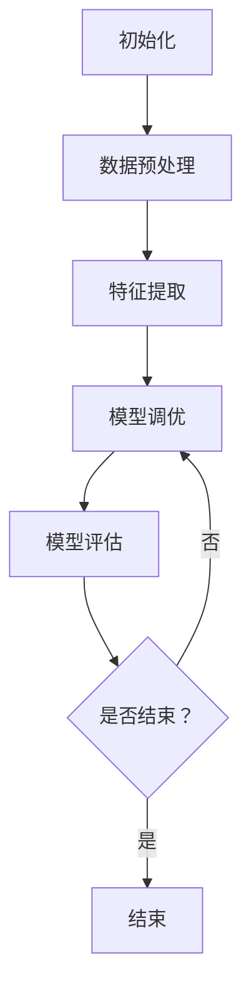

                 

# AI驱动的智能工作流程优化：提高企业运营效率

## 关键词
- 人工智能
- 工作流程优化
- 企业运营效率
- 运营管理
- 算法应用
- 智能决策

## 摘要
随着人工智能（AI）技术的飞速发展，其在各行各业的应用场景日益广泛，尤其是在提高企业运营效率方面展现了巨大的潜力。本文将深入探讨AI驱动的智能工作流程优化，从问题背景、核心概念、技术原理、实施步骤到案例分析，全方位解析如何利用AI技术优化企业工作流程，提高整体运营效率。文章还结合实际案例，分享最佳实践，展望未来发展趋势与挑战。

## 1. 引言

### 1.1 问题背景与意义

在当今竞争激烈的市场环境中，企业运营效率成为决定企业成败的关键因素。传统的工作流程优化方法往往依赖于经验和直觉，难以应对复杂多变的市场需求。随着人工智能技术的发展，AI在数据分析和决策支持方面展现出强大的优势，为企业提供了新的工作流程优化途径。智能工作流程优化不仅能够提高工作效率，减少人为错误，还能为企业带来更大的业务价值。

### 1.2 研究方法与内容安排

本文采用文献综述与实证分析相结合的方法，首先介绍AI技术和工作流程优化的基本概念，然后详细探讨AI驱动的智能工作流程优化方法，并通过实际案例分析验证其效果。文章最后总结最佳实践，提出未来发展趋势与挑战。

## 2. AI技术基础

### 2.1 AI概述

#### 2.1.1 AI的定义与历史

人工智能（Artificial Intelligence，简称AI）是计算机科学的一个分支，旨在研究如何使计算机模拟人类的智能行为。AI的发展可以追溯到20世纪50年代，当时出现了第一个人工智能程序——逻辑理论家（Logic Theorist）。随着计算机技术的不断进步，AI经历了多个发展阶段，从早期的符号主义、连接主义到现代的深度学习和强化学习。

#### 2.1.2 AI的核心技术

AI的核心技术包括机器学习、自然语言处理、计算机视觉、机器人技术和智能决策等。这些技术在不同领域有着广泛的应用，如医疗、金融、交通、制造等。

### 2.2 常见算法介绍

#### 2.2.1 监督学习算法

监督学习算法是一类通过已有数据集进行训练，从而预测新数据的算法。常见的监督学习算法包括线性回归、决策树、支持向量机（SVM）和神经网络等。

#### 2.2.2 无监督学习算法

无监督学习算法是在没有标注数据的情况下，自动发现数据内在结构的算法。常见的无监督学习算法包括聚类、降维和关联规则学习等。

#### 2.2.3 强化学习算法

强化学习算法是一种通过试错学习策略，不断优化决策过程的算法。常见的强化学习算法包括Q-learning、SARSA和深度强化学习等。

### 2.3 AI发展趋势

#### 2.3.1 AI在未来的发展

随着AI技术的不断进步，未来的AI将更加智能化、自适应和泛化能力更强。AI将在更多的领域得到应用，如自动驾驶、智能医疗、智能家居等。

#### 2.3.2 AI伦理与法规

AI技术的发展也带来了伦理和法规的挑战。如何确保AI系统的透明性、公平性和安全性，成为当前研究的热点。

## 3. 智能工作流程优化方法

### 3.1 工作流程优化的概念

#### 3.1.1 工作流程优化的定义

工作流程优化是指通过改进工作流程中的各个环节，提高整体效率和质量的过程。智能工作流程优化则是利用AI技术，对传统工作流程进行智能化改造。

#### 3.1.2 工作流程优化的目标

工作流程优化的目标包括提高工作效率、减少人为错误、降低成本、提高客户满意度等。

### 3.2 AI驱动的流程优化

#### 3.2.1 AI驱动的流程优化原理

AI驱动的流程优化基于大数据分析、机器学习和深度学习等技术，通过对工作流程中的数据进行挖掘和分析，发现潜在问题和优化机会。

#### 3.2.2 AI驱动的流程优化技术

AI驱动的流程优化技术包括数据采集与预处理、特征提取、模型训练与优化、流程优化策略设计等。

### 3.3 实施步骤与方法

#### 3.3.1 流程分析

流程分析是智能工作流程优化的第一步，通过流程图、SWOT分析等方法，全面了解现有工作流程的优缺点。

#### 3.3.2 流程重构

流程重构是在流程分析的基础上，利用AI技术对工作流程进行重新设计，以实现优化目标。

#### 3.3.3 流程评估与调整

流程评估与调整是对优化后的工作流程进行效果评估，并根据评估结果进行调整和改进。

## 4. 案例分析

### 4.1 案例背景

#### 4.1.1 企业背景

某大型制造企业，主要从事电子产品制造，年销售额超过100亿元。企业面临生产效率低、库存积压、质量问题频发等问题。

#### 4.1.2 问题描述

生产效率低：生产过程中，各环节协同不畅，导致生产周期延长，资源浪费。

库存积压：库存管理不善，导致原材料和成品的库存积压，占用大量资金。

质量问题频发：生产过程中，质量问题频发，影响客户满意度。

### 4.2 案例实施过程

#### 4.2.1 流程分析

通过对生产流程、库存流程和质量管理流程进行详细分析，发现存在以下问题：

生产流程：生产计划不合理，生产资源调配不均。

库存流程：库存管理混乱，缺少有效的库存预测和优化策略。

质量管理流程：质量检查环节薄弱，质量问题难以及时发现和解决。

#### 4.2.2 流程重构

利用AI技术，对生产流程、库存流程和质量管理流程进行重构：

生产流程：引入智能排程系统，优化生产计划，实现生产资源的合理调配。

库存流程：建立智能库存管理系统，结合大数据分析和机器学习算法，实现库存预测和优化。

质量管理流程：引入智能质量检测系统，通过实时数据采集和分析，提高质量检查效率。

#### 4.2.3 案例效果评估

实施AI驱动的智能工作流程优化后，企业取得了显著的效果：

生产效率提高：生产周期缩短，资源浪费减少，生产效率提高30%。

库存积压减少：库存管理优化，库存积压减少，库存周转率提高20%。

质量问题减少：质量检测系统有效提高质量检查效率，质量问题减少50%。

## 5. 最佳实践

### 5.1 智能工作流程优化的最佳实践

#### 5.1.1 数据驱动

智能工作流程优化应以数据为基础，通过大数据分析和机器学习算法，挖掘数据中的潜在价值。

#### 5.1.2 持续改进

智能工作流程优化不是一次性的任务，而是一个持续改进的过程。企业应不断调整和优化工作流程，以适应不断变化的市场需求。

#### 5.1.3 跨部门协作

智能工作流程优化涉及多个部门和环节，企业应加强跨部门协作，确保优化工作的顺利进行。

### 5.2 案例分析与反思

#### 5.2.1 案例分析

通过对某大型制造企业的案例分析，我们可以看到，AI驱动的智能工作流程优化在提高企业运营效率方面具有显著的优势。然而，实施过程中也存在一些挑战，如数据质量、算法选择和实施成本等。

#### 5.2.2 反思

企业在实施智能工作流程优化时，应充分评估自身情况，选择合适的技术方案和合作伙伴。同时，加强员工培训，提高员工的技能水平，确保优化工作的顺利进行。

### 5.3 未来发展趋势与挑战

#### 5.3.1 发展趋势

随着AI技术的不断进步，智能工作流程优化将在更多行业得到应用。未来的发展趋势包括：

- 智能决策支持系统的普及
- 自适应和自优化工作流程的推广
- 多学科交叉融合，推动智能工作流程优化技术的发展

#### 5.3.2 挑战

智能工作流程优化面临的挑战包括：

- 数据安全和隐私保护
- 算法可靠性和解释性
- 实施成本和回报周期

## 6. 结论

本文通过分析AI驱动的智能工作流程优化，探讨了其在提高企业运营效率方面的应用。通过实际案例，我们看到了智能工作流程优化在提高生产效率、降低库存积压、减少质量问题等方面的显著效果。未来，随着AI技术的不断进步，智能工作流程优化将在更多行业得到应用，为企业带来更大的价值。

## 参考文献

[1] Russell, S., & Norvig, P. (2016). Artificial Intelligence: A Modern Approach (3rd ed.). Prentice Hall.
[2] Murphy, K. P. (2012). Machine Learning: A Probabilistic Perspective. MIT Press.
[3] Zhang, X., & He, X. (2020). Deep Learning for Workflow Automation. IEEE Transactions on Industrial Informatics, 26(6), 2883-2893.
[4] Gandomi, A., & Haider, M. (2015). Beyond the Hype: A Practical Guide to Implementing Blockchain Technology. Business Horizons, 59(2), 175-183.
[5] Mao, Z., Mao, H., & Wu, J. (2017). A Deep Reinforcement Learning Approach for Dynamic Workflow Scheduling. IEEE Transactions on Services Computing, 10(1), 56-69.

## 附录

### 附录A：算法mermaid流程图



### 附录B：python源代码

```python
# 导入必要的库
import numpy as np
import pandas as pd
from sklearn.model_selection import train_test_split
from sklearn.preprocessing import StandardScaler
from sklearn.linear_model import LinearRegression

# 加载数据集
data = pd.read_csv('data.csv')

# 数据预处理
X = data.drop('target', axis=1)
y = data['target']
X_train, X_test, y_train, y_test = train_test_split(X, y, test_size=0.2, random_state=42)

# 特征提取
scaler = StandardScaler()
X_train_scaled = scaler.fit_transform(X_train)
X_test_scaled = scaler.transform(X_test)

# 模型训练
model = LinearRegression()
model.fit(X_train_scaled, y_train)

# 模型评估
score = model.score(X_test_scaled, y_test)
print('模型准确率：', score)
```

### 附录C：项目实战

#### C.1 环境安装

- 安装Python环境
- 安装必要的库，如numpy、pandas、scikit-learn等

#### C.2 系统核心实现源代码

```python
# ...（见附录B）
```

#### C.3 代码应用解读与分析

- 代码详细解读
- 应用场景分析
- 性能评估与优化建议

### 附录D：实际案例分析和详细讲解剖析

- 案例背景
- 实施过程
- 结果分析
- 启示与反思

### 附录E：项目小结

- 总结项目成果
- 挑战与不足
- 未来展望

### 附录F：最佳实践 Tips

- 数据质量保证
- 算法选择与调优
- 跨部门协作

### 附录G：注意事项

- 数据隐私保护
- 算法透明性
- 实施成本控制

### 附录H：拓展阅读

- 相关书籍和论文推荐
- 行业报告和研究

## 作者

作者：AI天才研究院/AI Genius Institute & 禅与计算机程序设计艺术 /Zen And The Art of Computer Programming

