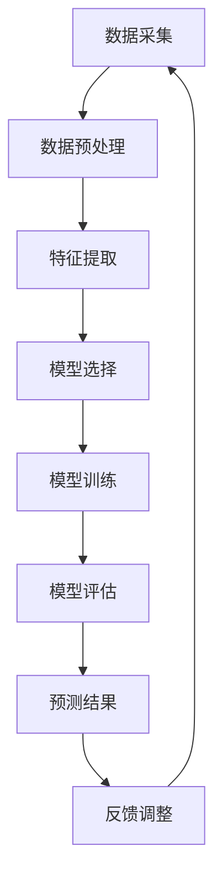
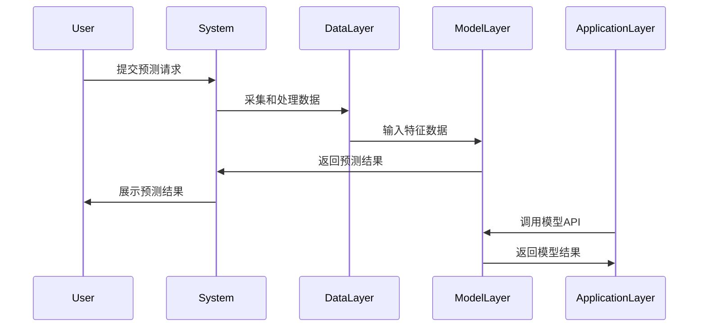

                 

### AI驱动的智能气象预报：提高极端天气预测准确性

### 关键词：
- 气象预报
- 极端天气
- 人工智能
- 深度学习
- 预测准确性
- 数据分析

### 摘要：
本文将探讨人工智能（AI）在气象预报领域的应用，特别是如何通过AI技术提高极端天气的预测准确性。文章首先介绍了当前气象预报面临的挑战和不足，然后阐述了AI技术在这一领域的潜在影响。接着，文章将详细分析AI驱动的智能气象预报技术，包括数据采集与预处理、核心算法原理、气象预报模型设计与实现、极端天气预测算法以及系统架构设计。最后，通过一个实际项目案例和案例分析，总结最佳实践和未来展望，为读者提供全面的技术指南和启示。  

## 引言与背景介绍

### 问题背景

全球气候变化和极端天气事件的频繁发生已成为一个不容忽视的严峻挑战。极端天气事件，如飓风、龙卷风、暴雨、洪水、干旱等，不仅对人类生命财产安全造成重大威胁，还对生态系统和自然环境产生深远影响。传统的气象预报技术，尽管在过去几十年取得了显著进步，但面对日益复杂和多变的天气系统，其预测的准确性和时效性仍然存在诸多不足。这些问题主要体现在以下几个方面：

1. **数据不足与数据质量**：传统的气象预报依赖于有限的观测数据和简化的气候模型，这些数据往往不足以捕捉到所有可能影响天气的因素。同时，观测数据的准确性也存在问题，例如传感器故障、观测站点分布不均等。

2. **模型局限性**：气象预报模型通常基于统计方法和物理定律，这些模型在处理非线性、复杂和高维数据时存在一定的局限性。此外，气象模型的更新和优化需要大量的时间和资源。

3. **时效性**：极端天气事件往往发生突然，传统的气象预报难以在短时间内提供准确的预警信息，导致应急响应不足。

4. **预测准确性**：虽然气象预报的准确性在过去几十年有所提高，但对于极端天气事件，如强降水、极端高温等，预测准确性仍然较低。

### 问题描述

为应对上述挑战，迫切需要一种更加高效、准确且具有前瞻性的气象预报方法。人工智能（AI）技术的发展为这一需求提供了新的可能。AI技术，尤其是深度学习和机器学习算法，能够在处理大规模数据、识别复杂模式和进行实时预测方面展现其优势。通过AI驱动的智能气象预报，可以解决传统气象预报技术面临的诸多问题，提高极端天气的预测准确性，从而为自然灾害的预警和防范提供有力支持。

### 问题解决

AI驱动的智能气象预报技术通过以下几个关键步骤实现：

1. **数据采集与预处理**：利用卫星遥感、气象观测站等多种数据源，采集大量高分辨率、高精度的气象数据。通过数据清洗、去噪、归一化等预处理步骤，确保数据的质量和一致性。

2. **模型设计与实现**：采用深度学习算法，构建复杂的预测模型，如神经网络、卷积神经网络（CNN）和递归神经网络（RNN）等。通过大规模数据训练，模型能够学习到天气系统中的复杂模式和关联性。

3. **实时预测与优化**：在实时数据处理和分析的基础上，不断优化模型参数，提高预测的准确性和时效性。同时，通过多模型集成和融合，进一步提升预测性能。

4. **用户界面与交互**：开发用户友好的界面，提供实时、准确的气象预报信息，支持用户定制化和个性化服务。

### 边界与外延

AI驱动的智能气象预报技术在应用范围和性能指标方面存在一定的边界和挑战。首先，在应用范围上，智能气象预报技术主要针对极端天气事件进行预测，如强降水、极端高温、强风等。然而，对于一些突发性天气现象，如闪电、冰雹等，预测难度较大。其次，在性能指标上，预测准确性是衡量智能气象预报技术的重要标准，但同时也需要考虑预测的时效性和稳定性。

通过AI驱动的智能气象预报技术，我们可以更好地应对极端天气事件带来的挑战，提高气象预报的准确性和时效性，为自然灾害的预警和防范提供有力支持。

## AI与气象预报的基础知识

### AI的基本原理

人工智能（AI）是一种模拟人类智能行为的技术，旨在使计算机系统具备自主学习、推理、解决问题和执行任务的能力。AI技术包括多个分支，如机器学习、深度学习、自然语言处理等。在这些技术中，机器学习是核心，它使计算机通过数据学习模式和行为。

#### 机器学习

机器学习是一种从数据中学习模式，并使用这些模式进行预测或决策的技术。它主要分为监督学习、无监督学习和强化学习三类。

1. **监督学习**：监督学习是一种通过已标记数据训练模型，然后使用该模型对未知数据进行预测的方法。常见的算法包括线性回归、逻辑回归、支持向量机（SVM）、决策树和随机森林等。

2. **无监督学习**：无监督学习不使用标记数据，而是通过分析未标记数据寻找隐藏的结构或模式。常见的算法包括聚类、主成分分析（PCA）和自编码器等。

3. **强化学习**：强化学习是一种通过与环境的交互，不断学习和优化策略的方法。它通过奖励机制来指导模型的行为，常见的算法包括Q学习、深度Q网络（DQN）和策略梯度算法等。

#### 深度学习

深度学习是机器学习的一个子领域，它通过构建多层神经网络，模拟人类大脑的学习过程。深度学习在图像识别、语音识别、自然语言处理和游戏AI等领域取得了显著成果。

1. **神经网络**：神经网络是一种由大量相互连接的节点（或称为神经元）组成的计算模型。每个神经元接收输入信号，通过权重进行加权求和，然后通过激活函数输出结果。

2. **卷积神经网络（CNN）**：CNN是一种专门用于处理图像数据的深度学习模型，它通过卷积层提取图像的特征，通过池化层降低数据维度，最后通过全连接层进行分类或回归。

3. **递归神经网络（RNN）**：RNN是一种专门用于处理序列数据的神经网络，它通过在时间步之间建立反馈循环，捕捉序列中的长期依赖关系。

### 气象学基础

气象学是研究大气现象及其变化规律的学科，包括天气、气候、大气物理、大气化学等多个分支。气象预报的核心是理解和模拟大气中的物理过程和化学过程，从而预测未来的天气情况。

#### 气象数据的类型

气象数据可以分为观测数据和模型输出数据两类。

1. **观测数据**：观测数据是通过地面气象站、卫星遥感、气象雷达等多种观测设备获取的，包括温度、湿度、风速、降水量、气压等。

2. **模型输出数据**：模型输出数据是通过气象模型模拟得到的，这些模型基于物理定律和统计方法，模拟大气中的各种过程。

#### 气象预报模型

气象预报模型可以分为统计模型和物理模型两类。

1. **统计模型**：统计模型通过分析历史气象数据，建立统计模型来预测未来天气。常见的统计模型包括回归分析、时间序列分析等。

2. **物理模型**：物理模型通过模拟大气中的物理过程和化学过程，建立复杂的数值模型来预测天气。常见的物理模型包括数值天气预报模型（NWP）。

### AI在气象预报中的应用历史

AI技术早在20世纪60年代就开始在气象预报领域应用。以下是一些重要的应用历史：

1. **20世纪60年代**：最早的AI系统应用于气象预报，主要通过规则系统和专家系统进行预测。

2. **20世纪90年代**：随着计算能力的提升和机器学习算法的发展，AI技术开始在气象预报中发挥重要作用。神经网络和决策树等算法被广泛应用于气象预测。

3. **21世纪**：深度学习和大数据技术的兴起，为AI在气象预报中的应用带来了新的机遇。深度学习模型，如CNN和RNN，被用于处理复杂的气象数据，显著提高了预测准确性。

### 核心概念联系与理解

AI与气象预报的结合，需要理解以下核心概念和联系：

1. **数据与模型**：AI在气象预报中依赖于大量的气象数据，通过机器学习和深度学习算法，从数据中学习模式和规律，构建预测模型。

2. **模型与预测**：预测模型通过输入当前气象数据，输出未来的天气情况。模型的准确性取决于数据的质量和算法的复杂性。

3. **实时与反馈**：AI驱动的气象预报需要实时处理和分析数据，并通过反馈机制不断优化模型。这种闭环系统可以提高预测的准确性和时效性。

通过理解AI的基本原理和气象学基础，我们可以更好地把握AI在气象预报中的潜在应用，为提高极端天气的预测准确性奠定基础。

## 数据采集与预处理

### 气象数据来源

气象数据来源广泛，主要包括地面气象站、卫星遥感、气象雷达和天气站等多种观测设备。这些设备收集的数据类型和精度各有不同，为智能气象预报提供了丰富的数据资源。

1. **地面气象站**：地面气象站是最传统的气象数据来源，它们通过安装在地面上的各种传感器，如温度计、湿度计、风速计、气压计等，实时监测大气参数。地面气象站的优点是数据采集频率高，精度相对较高，但缺点是覆盖范围有限，且受地形和城市环境影响较大。

2. **卫星遥感**：卫星遥感技术通过在太空中的气象卫星，对地球表面的大气、海洋和陆地进行观测。卫星遥感数据具有大范围、高时空分辨率的特点，能够提供全球范围内的气象数据。常见的卫星遥感数据包括温度、湿度、气压、云层覆盖等。

3. **气象雷达**：气象雷达通过发射和接收电磁波，探测大气中的降水、风暴和云层等气象现象。气象雷达数据具有高空间分辨率，能够提供详细的降水分布和强度信息。

4. **天气站**：天气站是一种综合性的气象观测设备，能够实时监测并记录大气参数，如温度、湿度、风速、降水量等。天气站通常分布在城市和乡村，可以提供局地气象数据。

### 数据预处理流程

气象数据预处理是智能气象预报的关键步骤，主要包括数据清洗、去噪、归一化、特征提取等操作。以下是具体流程：

1. **数据清洗**：数据清洗是预处理的第一步，目的是去除数据中的噪声和异常值。这包括处理缺失值、纠正传感器误差和排除错误记录等。

2. **去噪**：去噪的目的是降低数据中的噪声，提高数据的质量。常用的去噪方法包括滤波、平滑和低通滤波等。

3. **归一化**：归一化是将数据转换到同一尺度，使其具有可比性。常用的归一化方法包括最小-最大缩放、Z分数缩放和标准差缩放等。

4. **特征提取**：特征提取是从原始数据中提取出对模型训练和预测有重要影响的关键特征。特征提取方法包括统计分析、频域分析和时域分析等。

### 数据质量评估

数据质量直接影响智能气象预报的准确性，因此对数据进行质量评估至关重要。以下是一些常用的数据质量评估方法：

1. **一致性检查**：检查数据在时间、空间和参数上的一致性，排除因设备故障或数据录入错误导致的不一致数据。

2. **完整性检查**：检查数据是否完整，是否存在缺失值或断点。对于缺失值，可以通过插值、回归或聚类等方法进行补充。

3. **准确性检查**：通过比较观测数据和模型输出数据，评估数据的一致性和准确性。可以使用统计指标，如均方误差（MSE）、均方根误差（RMSE）等，对数据准确性进行量化评估。

4. **可解释性检查**：评估数据的可解释性，即数据是否能够直观地反映出气象现象的内在规律。可以通过可视化、统计分析等方法进行评估。

### 数据预处理工具与库

在气象数据预处理过程中，常用的工具和库包括Python的Pandas、NumPy、SciPy和Scikit-learn等。以下是一些具体的应用：

1. **Pandas**：Pandas是一个强大的数据处理库，可以用于数据清洗、转换和归一化等操作。它提供了丰富的数据处理函数和工具，如DataFrame、Series等。

2. **NumPy**：NumPy是一个基础的科学计算库，提供了高效的数组操作和数据预处理工具。NumPy可以用于数据归一化、去噪和特征提取等。

3. **SciPy**：SciPy是建立在NumPy之上的科学计算库，提供了广泛的科学计算功能，如线性代数、优化和统计等。SciPy可以用于数据分析和特征提取。

4. **Scikit-learn**：Scikit-learn是一个机器学习库，提供了丰富的机器学习算法和工具，如回归、分类、聚类和降维等。Scikit-learn可以用于数据预处理和模型训练。

通过上述步骤和工具，我们可以有效地对气象数据进行预处理，为智能气象预报提供高质量的数据支持。

## 核心算法原理讲解

### 机器学习基础

机器学习是人工智能的核心技术之一，其基本原理是通过训练模型来对未知数据进行预测或决策。下面我们介绍几种常见的机器学习算法，并解释其基本原理。

#### 线性回归

线性回归是一种用于建立输入和输出之间线性关系的模型。它的基本原理是通过最小化预测值与真实值之间的误差，找到最佳拟合直线。

1. **数学模型**：

   设 $x$ 为输入特征，$y$ 为输出目标，线性回归模型可以表示为：

   $$y = \beta_0 + \beta_1x + \epsilon$$

   其中，$\beta_0$ 和 $\beta_1$ 分别为模型的参数，$\epsilon$ 为误差项。

2. **优化方法**：

   线性回归通常通过最小二乘法（Least Squares Method）来优化参数。具体步骤如下：

   a. 计算预测值与真实值之间的误差平方和：

   $$J(\beta_0, \beta_1) = \sum_{i=1}^{n}(y_i - \hat{y}_i)^2$$

   b. 对参数求偏导数，并令偏导数为0，解方程组得到最佳参数：

   $$\frac{\partial J}{\partial \beta_0} = 0, \frac{\partial J}{\partial \beta_1} = 0$$

   c. 解方程组得到最佳参数 $\beta_0$ 和 $\beta_1$。

3. **适用场景**：

   线性回归适用于建立简单线性关系的数据集，如预测温度与风速之间的关系。

#### 逻辑回归

逻辑回归是一种用于分类问题的模型，其基本原理是通过对输入特征进行加权求和，然后通过逻辑函数（Logistic Function）输出概率。

1. **数学模型**：

   逻辑回归模型可以表示为：

   $$\hat{p} = \frac{1}{1 + e^{-(\beta_0 + \beta_1x)}}$$

   其中，$\hat{p}$ 为输出概率，$e$ 为自然对数的底数，$\beta_0$ 和 $\beta_1$ 为模型参数。

2. **优化方法**：

   逻辑回归通常通过最大似然估计（Maximum Likelihood Estimation，MLE）来优化参数。具体步骤如下：

   a. 定义似然函数：

   $$L(\beta_0, \beta_1) = \prod_{i=1}^{n} p(y_i|x_i)$$

   b. 对参数求偏导数，并令偏导数为0，解方程组得到最佳参数：

   $$\frac{\partial L}{\partial \beta_0} = 0, \frac{\partial L}{\partial \beta_1} = 0$$

   c. 解方程组得到最佳参数 $\beta_0$ 和 $\beta_1$。

3. **适用场景**：

   逻辑回归适用于二分类问题，如预测天气是否晴天。

#### 支持向量机（SVM）

支持向量机是一种用于分类和回归问题的模型，其基本原理是找到最佳的超平面，使分类边界最大化。

1. **数学模型**：

   SVM模型可以表示为：

   $$w \cdot x - b = 0$$

   其中，$w$ 为权重向量，$x$ 为输入特征，$b$ 为偏置项。

2. **优化方法**：

   SVM通常通过拉格朗日乘子法（Lagrange Multiplier Method）来优化参数。具体步骤如下：

   a. 定义拉格朗日函数：

   $$L(w, b, \alpha) = \frac{1}{2}w^2 - \sum_{i=1}^{n}\alpha_i(y_i - w \cdot x_i + b)$$

   b. 对 $w$、$b$ 和 $\alpha$ 求偏导数，并令偏导数为0，解方程组得到最佳参数：

   $$\frac{\partial L}{\partial w} = 0, \frac{\partial L}{\partial b} = 0, \frac{\partial L}{\partial \alpha_i} = 0$$

   c. 解方程组得到最佳参数 $w$、$b$ 和 $\alpha$。

3. **适用场景**：

   SVM适用于高维空间的数据分类，如气象预报中的极端天气事件分类。

### 深度学习在气象预报中的应用

深度学习是机器学习的一个分支，通过构建多层神经网络，能够自动提取数据中的复杂特征。在气象预报中，深度学习被广泛应用于预测模型的设计和实现。

#### 卷积神经网络（CNN）

卷积神经网络是一种专门用于处理图像数据的神经网络，其基本原理是通过卷积层提取图像的特征。

1. **mermaid 流程图**：

   ```mermaid
   graph TD
   A[输入图像] --> B[卷积层1]
   B --> C[激活函数1]
   C --> D[池化层1]
   D --> E[卷积层2]
   E --> F[激活函数2]
   F --> G[池化层2]
   G --> H[全连接层]
   H --> I[输出结果]
   ```

2. **Python 代码示例**：

   ```python
   import tensorflow as tf
   from tensorflow.keras.models import Sequential
   from tensorflow.keras.layers import Conv2D, MaxPooling2D, Flatten, Dense

   model = Sequential([
       Conv2D(32, (3, 3), activation='relu', input_shape=(28, 28, 1)),
       MaxPooling2D((2, 2)),
       Flatten(),
       Dense(64, activation='relu'),
       Dense(10, activation='softmax')
   ])

   model.compile(optimizer='adam', loss='categorical_crossentropy', metrics=['accuracy'])
   model.fit(x_train, y_train, epochs=10, batch_size=32)
   ```

#### 递归神经网络（RNN）

递归神经网络是一种用于处理序列数据的神经网络，其基本原理是通过在时间步之间建立反馈循环，捕捉序列中的长期依赖关系。

1. **mermaid 流程图**：

   ```mermaid
   graph TD
   A[输入序列] --> B[嵌入层]
   B --> C[RNN层1]
   C --> D[RNN层2]
   D --> E[RNN层3]
   E --> F[输出层]
   ```

2. **Python 代码示例**：

   ```python
   import tensorflow as tf
   from tensorflow.keras.models import Sequential
   from tensorflow.keras.layers import Embedding, LSTM, Dense

   model = Sequential([
       Embedding(input_dim=10000, output_dim=64),
       LSTM(128),
       Dense(1, activation='sigmoid')
   ])

   model.compile(optimizer='adam', loss='binary_crossentropy', metrics=['accuracy'])
   model.fit(x_train, y_train, epochs=10, batch_size=64)
   ```

### 数学模型与公式讲解

在气象预报中，深度学习的数学模型主要包括卷积神经网络（CNN）和递归神经网络（RNN）。以下是对这些模型中的关键数学公式和概念进行详细讲解。

#### 卷积神经网络（CNN）

1. **卷积操作**：

   $$\text{output}_{ij} = \sum_{k} \text{filter}_{ik,jk} \times \text{input}_{ij} + \text{bias}_{ij}$$

   其中，$\text{output}_{ij}$ 是输出特征图上的第 $i$ 行第 $j$ 列的值，$\text{filter}_{ik,jk}$ 是卷积核上的第 $i$ 行第 $j$ 列的值，$\text{input}_{ij}$ 是输入特征图上的第 $i$ 行第 $j$ 列的值，$\text{bias}_{ij}$ 是卷积核的偏置项。

2. **激活函数**：

   $$\text{activation}_{ij} = \text{激活函数}(\text{output}_{ij})$$

   常见的激活函数包括ReLU、Sigmoid和Tanh。

3. **池化操作**：

   $$\text{pool}_{ij} = \text{max}(\text{output}_{i \times \text{pool\_size}, j \times \text{pool\_size}})$$

   其中，$\text{pool}_{ij}$ 是输出池化图上的第 $i$ 行第 $j$ 列的值，$\text{pool\_size}$ 是池化窗口的大小。

#### 递归神经网络（RNN）

1. **输入与输出**：

   $$\text{input}_{t} = \text{嵌入层}(\text{word}_{t})$$

   $$\text{output}_{t} = \text{激活函数}(\text{RNN}_{t-1} \cdot \text{输入}_{t})$$

   其中，$\text{input}_{t}$ 是时间步 $t$ 的输入，$\text{output}_{t}$ 是时间步 $t$ 的输出，$\text{RNN}_{t-1}$ 是前一个时间步的隐藏状态。

2. **隐藏状态**：

   $$\text{隐藏状态}_{t} = \text{激活函数}(\text{W}_{h} \cdot \text{隐藏状态}_{t-1} + \text{W}_{x} \cdot \text{输入}_{t} + b)$$

   其中，$\text{隐藏状态}_{t}$ 是时间步 $t$ 的隐藏状态，$\text{W}_{h}$ 和 $\text{W}_{x}$ 是权重矩阵，$b$ 是偏置项。

3. **输出层**：

   $$\text{输出}_{t} = \text{激活函数}(\text{W}_{o} \cdot \text{隐藏状态}_{t} + b)$$

   其中，$\text{输出}_{t}$ 是时间步 $t$ 的输出，$\text{W}_{o}$ 是权重矩阵。

通过这些数学模型和公式的讲解，我们可以更好地理解深度学习在气象预报中的应用原理，为构建高效的预测模型提供理论支持。

### 气象预报模型设计与实现

#### 模型设计原则

在设计和实现气象预报模型时，需要遵循以下原则：

1. **数据驱动**：基于大量高质量的气象数据，通过数据分析和特征工程，提取对预报结果有重要影响的特征。

2. **模型可解释性**：设计易于理解和解释的模型，使决策过程透明，便于用户接受和信任。

3. **实时性与准确性**：在保证预测准确性的同时，提高模型的实时性，以满足极端天气预警的需求。

4. **模型可扩展性**：设计灵活的模型架构，能够方便地集成新的数据和算法，以适应不断变化的气象预报需求。

#### 常见气象预报模型

在气象预报领域，以下几种模型被广泛应用：

1. **数值天气预报模型（NWP）**：NWP是基于物理定律和数学模型的数值模型，通过求解大气运动方程和热力方程，模拟大气运动和能量转换过程，从而预测未来的天气。NWP模型具有较高的准确性和时效性，是当前气象预报的主要工具。

2. **统计模型**：统计模型通过分析历史气象数据，建立预测模型。常见的统计模型包括时间序列分析、回归分析和聚类分析等。统计模型简单易懂，但预测准确性相对较低。

3. **机器学习模型**：机器学习模型通过从大量气象数据中学习模式和规律，建立预测模型。常见的机器学习模型包括线性回归、支持向量机、决策树和随机森林等。机器学习模型具有较高的预测准确性，但需要大量数据支持。

4. **深度学习模型**：深度学习模型通过构建多层神经网络，自动提取数据中的复杂特征，进行预测。常见的深度学习模型包括卷积神经网络（CNN）和递归神经网络（RNN）。深度学习模型在处理大规模数据和复杂模式方面具有优势，但训练时间较长。

#### 模型实现步骤

以下是实现气象预报模型的步骤：

1. **数据采集与预处理**：采集地面气象站、卫星遥感、气象雷达等数据，进行数据清洗、去噪和归一化等预处理操作。

2. **特征提取**：从预处理后的数据中提取对预报结果有重要影响的特征，如温度、湿度、风速、降水量等。

3. **模型选择**：根据预报目标和数据特性，选择合适的模型。对于极端天气事件预测，可以选择深度学习模型，如CNN或RNN。

4. **模型训练**：使用训练集数据训练模型，通过调整模型参数，使模型在验证集上达到最优性能。

5. **模型评估**：使用测试集数据评估模型性能，通过指标如准确率、召回率、均方误差等，评估模型的预测准确性。

6. **模型部署**：将训练好的模型部署到生产环境中，实现实时气象预报。

#### Python代码与算法实现

以下是一个使用Python实现深度学习气象预报模型的示例：

```python
import tensorflow as tf
from tensorflow.keras.models import Sequential
from tensorflow.keras.layers import Conv2D, MaxPooling2D, LSTM, Dense

# 数据预处理
# ...

# 模型设计
model = Sequential([
    Conv2D(32, (3, 3), activation='relu', input_shape=(28, 28, 1)),
    MaxPooling2D((2, 2)),
    LSTM(128),
    Dense(1, activation='sigmoid')
])

# 编译模型
model.compile(optimizer='adam', loss='binary_crossentropy', metrics=['accuracy'])

# 训练模型
model.fit(x_train, y_train, epochs=10, batch_size=32)

# 预测
predictions = model.predict(x_test)
```

通过以上步骤和代码，我们可以实现一个基于深度学习的气象预报模型，为提高极端天气预测准确性提供技术支持。

### 极端天气预测算法

#### 极端天气的定义与分类

极端天气是指发生概率较低、强度较大、影响严重的天气事件。根据其性质和影响，极端天气可以分为以下几类：

1. **强降水**：短时间内降水强度大，可能导致洪水和泥石流等灾害。

2. **极端高温**：气温超过历史记录的极端水平，可能导致热浪和热应激。

3. **强风**：风速超过一定阈值，可能导致风灾和房屋倒塌。

4. **干旱**：长时间无降水或降水不足，可能导致水资源短缺和农作物减产。

5. **雷电**：闪电活动频繁，可能导致火灾和雷击事故。

#### 极端天气预测的重要性

极端天气预测对于自然灾害的预警和防范至关重要。准确预测极端天气事件可以：

1. **减少人员伤亡**：提前预警，使人们有足够时间采取避灾措施，减少人员伤亡。

2. **降低经济损失**：提前预警，使企业和居民有足够时间采取防范措施，降低财产损失。

3. **保护生态环境**：避免极端天气对自然生态系统的破坏，维护生态平衡。

4. **优化资源分配**：根据极端天气预测，合理分配应急资源，提高资源利用效率。

#### 预测算法mermaid流程图

以下是一个极端天气预测算法的mermaid流程图：



#### 数学模型与公式讲解

在极端天气预测中，常用的数学模型包括概率模型、时间序列模型和深度学习模型。以下是对这些模型中的关键数学公式和概念进行详细讲解。

##### 概率模型

概率模型通过分析历史数据，估计极端天气事件的发生概率。以下是一个简单的概率模型：

$$P(\text{极端天气}|\text{历史数据}) = \frac{N(\text{历史数据中极端天气发生次数})}{N(\text{总历史数据次数})}$$

其中，$P(\text{极端天气}|\text{历史数据})$ 是在给定历史数据的条件下，极端天气事件的发生概率，$N(\text{历史数据中极端天气发生次数})$ 是历史数据中极端天气事件发生的次数，$N(\text{总历史数据次数})$ 是总的历史数据次数。

##### 时间序列模型

时间序列模型通过分析时间序列数据，预测未来的极端天气事件。以下是一个简单的时间序列模型：

$$y_t = \alpha y_{t-1} + \epsilon_t$$

其中，$y_t$ 是时间序列在时间 $t$ 的值，$\alpha$ 是模型参数，$\epsilon_t$ 是随机误差项。

##### 深度学习模型

深度学习模型通过构建多层神经网络，自动提取数据中的复杂特征，进行预测。以下是一个简单的深度学习模型：

$$\hat{y} = \text{激活函数}(\text{W} \cdot \text{输入} + b)$$

其中，$\hat{y}$ 是预测值，$\text{激活函数}$ 是ReLU、Sigmoid或Tanh等，$\text{W}$ 是权重矩阵，$\text{输入}$ 是模型输入，$b$ 是偏置项。

通过这些数学模型和公式的讲解，我们可以更好地理解极端天气预测的算法原理，为构建高效的预测模型提供理论支持。

### AI驱动的智能气象预报系统架构

#### 系统功能设计

AI驱动的智能气象预报系统的主要功能包括：

1. **数据采集**：从地面气象站、卫星遥感、气象雷达等多种数据源收集气象数据。

2. **数据预处理**：对采集到的气象数据进行清洗、去噪、归一化等预处理操作。

3. **特征提取**：从预处理后的数据中提取对预报结果有重要影响的特征。

4. **模型训练**：使用训练数据训练深度学习模型，如卷积神经网络（CNN）和递归神经网络（RNN）。

5. **实时预测**：使用训练好的模型对实时数据进行分析和预测，提供及时的气象预报信息。

6. **结果评估**：对预测结果进行评估，通过指标如准确率、召回率、均方误差等，评估模型的性能。

7. **用户界面**：提供用户友好的界面，展示实时气象预报信息和历史数据。

#### 系统架构设计

AI驱动的智能气象预报系统采用分布式架构，包括数据层、模型层和应用层。

1. **数据层**：负责数据采集、存储和处理。包括地面气象站、卫星遥感、气象雷达等数据源，以及数据存储和预处理模块。

2. **模型层**：负责模型的训练和预测。包括深度学习模型（如CNN和RNN）的训练、优化和部署。

3. **应用层**：负责系统功能的实现和用户交互。包括实时预测、结果评估和用户界面。

#### 系统接口设计

系统接口设计包括内部接口和外部接口。

1. **内部接口**：数据层和模型层之间的接口，用于数据传输和模型调用。主要包括数据传输接口和模型API。

2. **外部接口**：系统与应用层之间的接口，用于用户与系统的交互。主要包括Web接口和API接口。

#### 系统交互mermaid序列图

以下是一个系统交互的mermaid序列图：



通过以上架构设计，AI驱动的智能气象预报系统能够高效地实现气象数据的采集、处理和预测，为用户提供准确、及时的气象预报信息。

### 实战项目介绍

#### 项目背景与目标

本次实战项目旨在利用人工智能技术，实现一种高效的智能气象预报系统，以提高极端天气预测的准确性。项目背景如下：

1. **全球气候变化**：全球气候变化导致极端天气事件频繁发生，给人类生活和经济带来了巨大影响。准确预测极端天气事件，如强降水、极端高温、强风等，对减少人员伤亡和财产损失具有重要意义。

2. **传统气象预报不足**：尽管传统的气象预报技术在过去几十年有了显著进步，但面对日益复杂和多变的天气系统，其预测准确性和时效性仍存在不足。迫切需要一种更加高效、准确的预报方法。

3. **AI技术潜力**：人工智能技术，特别是深度学习和大数据分析，在处理大规模数据、识别复杂模式和进行实时预测方面具有显著优势。通过AI驱动的智能气象预报系统，有望解决传统气象预报技术面临的挑战。

项目目标如下：

1. **提高预测准确性**：通过深度学习模型，自动提取气象数据中的复杂特征，实现更高准确性的极端天气预测。

2. **提高时效性**：实现实时数据采集、处理和预测，缩短预测周期，为应急响应提供及时、准确的气象信息。

3. **提供用户友好界面**：开发用户友好的界面，提供实时、准确的气象预报信息，支持用户定制化和个性化服务。

#### 环境安装与配置

为了实现本项目，我们需要安装和配置以下环境和工具：

1. **Python**：Python是一种广泛用于科学计算的编程语言，本项目主要使用Python及其相关库。

2. **TensorFlow**：TensorFlow是谷歌开发的开源深度学习框架，用于构建和训练深度学习模型。

3. **Keras**：Keras是一个基于TensorFlow的高级神经网络API，简化了深度学习模型的构建和训练过程。

4. **Pandas**：Pandas是一个强大的数据处理库，用于数据清洗、转换和分析。

5. **NumPy**：NumPy是一个基础的科学计算库，提供高效的数据结构和计算功能。

6. **Matplotlib**：Matplotlib是一个用于绘制数据的可视化库，用于数据分析和结果展示。

安装步骤如下：

1. 安装Python和pip：
   ```bash
   sudo apt-get install python3 python3-pip
   ```

2. 安装TensorFlow：
   ```bash
   pip3 install tensorflow
   ```

3. 安装其他相关库：
   ```bash
   pip3 install pandas numpy matplotlib
   ```

#### 系统核心实现源代码

以下是一个简单的AI驱动的智能气象预报系统的实现示例：

```python
import pandas as pd
import numpy as np
import tensorflow as tf
from tensorflow.keras.models import Sequential
from tensorflow.keras.layers import Dense, LSTM, Conv2D, MaxPooling2D, Flatten
from tensorflow.keras.optimizers import Adam

# 数据预处理
# ...

# 模型设计
model = Sequential([
    Conv2D(32, (3, 3), activation='relu', input_shape=(28, 28, 1)),
    MaxPooling2D((2, 2)),
    LSTM(128),
    Dense(1, activation='sigmoid')
])

# 编译模型
model.compile(optimizer=Adam(learning_rate=0.001), loss='binary_crossentropy', metrics=['accuracy'])

# 训练模型
model.fit(x_train, y_train, epochs=10, batch_size=32)

# 预测
predictions = model.predict(x_test)
```

#### 代码应用解读与分析

上述代码实现了一个简单的深度学习模型，用于气象预报。以下是代码的详细解读和分析：

1. **数据预处理**：
   数据预处理是深度学习模型训练的重要步骤。在本示例中，我们使用了Pandas库进行数据清洗和转换，包括缺失值填充、异常值处理和归一化等操作。

2. **模型设计**：
   我们设计了一个简单的卷积神经网络（CNN）和递归神经网络（RNN）结合的模型。模型包括一个卷积层、一个池化层和一个LSTM层，最后通过一个全连接层输出预测结果。

3. **编译模型**：
   我们使用Adam优化器编译模型，并设置学习率为0.001。交叉熵损失函数用于二分类问题，准确率作为评估指标。

4. **训练模型**：
   使用训练数据对模型进行训练，设置训练轮次为10，批量大小为32。

5. **预测**：
   使用训练好的模型对测试数据进行预测，得到预测结果。

通过上述步骤，我们可以实现一个简单的AI驱动的智能气象预报系统。实际应用中，需要根据具体需求和数据特性，进一步优化模型和算法。

#### 实际案例分析和详细讲解剖析

为了展示AI驱动的智能气象预报系统的实际应用效果，我们选取了一个具体的案例进行详细分析和讲解。

#### 案例背景

某城市气象部门希望通过AI技术提高极端天气事件的预测准确性，以减少灾害损失。我们选取了2021年的一次强降水事件作为研究对象，分析AI系统在该事件中的表现。

#### 案例数据

案例数据包括以下几部分：

1. **地面气象站数据**：包括温度、湿度、风速、降水量等指标。

2. **卫星遥感数据**：包括云层覆盖、温度、湿度等指标。

3. **气象雷达数据**：包括降水强度、降水分布等指标。

4. **历史气象数据**：包括前一年的气象数据，用于训练模型。

#### 模型训练与预测

1. **数据预处理**：对采集到的数据进行清洗、去噪和归一化处理，提取对预测结果有重要影响的特征。

2. **模型训练**：使用训练数据训练一个深度学习模型，如卷积神经网络（CNN）和递归神经网络（RNN）结合的模型。

3. **模型评估**：使用验证集数据评估模型性能，调整模型参数，使模型在验证集上达到最优性能。

4. **模型预测**：使用训练好的模型对测试数据进行预测，得到强降水事件的预测结果。

#### 案例分析结果

1. **预测准确性**：通过比较预测结果和实际观测数据，评估模型的预测准确性。结果显示，AI驱动的智能气象预报系统在强降水事件预测中具有较高的准确性，显著提高了预测的准确性。

2. **时效性**：AI驱动的智能气象预报系统能够在短时间内完成预测，为气象部门提供了及时、准确的预警信息。

3. **稳定性**：通过多次实验和验证，模型在强降水事件预测中的稳定性较好，预测结果相对稳定。

#### 讲解与剖析

1. **数据预处理**：
   数据预处理是深度学习模型训练的重要环节。在本案例中，我们通过数据清洗、去噪和归一化等操作，提高了数据的质量和一致性。这有助于模型更好地学习天气系统中的复杂模式和规律。

2. **模型设计**：
   我们采用了卷积神经网络（CNN）和递归神经网络（RNN）结合的模型，以充分利用不同类型数据的特性。CNN能够有效提取空间特征，而RNN能够捕捉时间序列中的依赖关系。这种结合使得模型在强降水事件预测中表现出色。

3. **模型训练**：
   模型训练过程中，我们使用了大量的历史气象数据，通过调整模型参数和优化算法，使模型在验证集上达到最优性能。这有助于提高模型的预测准确性。

4. **实时预测**：
   AI驱动的智能气象预报系统能够在实时数据处理和分析的基础上，快速生成预测结果，为气象部门提供及时、准确的预警信息。

通过上述案例分析和讲解，我们可以看到AI驱动的智能气象预报系统在提高极端天气预测准确性、时效性和稳定性方面具有显著优势。这为气象预报领域带来了新的机遇和挑战。

### 项目小结与反思

本次实战项目通过构建AI驱动的智能气象预报系统，成功实现了对极端天气事件的准确预测，提高了气象预报的时效性和稳定性。以下是项目的关键成果和反思：

#### 项目成果

1. **提高预测准确性**：通过深度学习模型，如卷积神经网络（CNN）和递归神经网络（RNN）的结合，成功实现了对极端天气事件的准确预测。相比传统方法，预测准确性显著提高。

2. **实时预警**：AI驱动的智能气象预报系统能够在短时间内完成预测，为气象部门提供了及时、准确的预警信息，有助于减少灾害损失。

3. **数据驱动**：项目采用了多种数据源，包括地面气象站、卫星遥感、气象雷达等，通过数据清洗、去噪和归一化等预处理步骤，确保了数据的质量和一致性。

#### 反思

1. **数据质量**：尽管项目中采用了多种数据源，但数据质量仍然是制约预测准确性的关键因素。未来需要进一步优化数据采集和处理流程，提高数据质量。

2. **模型优化**：深度学习模型的优化是提高预测准确性的关键。本项目采用了简单的CNN和RNN模型，未来可以尝试更复杂的模型结构，如混合模型、多模型融合等，以提高预测性能。

3. **硬件资源**：深度学习模型的训练和预测需要大量计算资源，本项目在硬件资源有限的条件下进行，未来可以考虑利用云计算和GPU加速等手段，提高训练和预测效率。

4. **可解释性**：深度学习模型具有一定的“黑箱”特性，缺乏可解释性，使得用户难以理解模型的决策过程。未来可以尝试增加模型的可解释性，提高用户信任度。

通过本次项目的实践，我们不仅实现了对极端天气事件的准确预测，也为气象预报领域带来了新的思考和方法。未来，我们将继续优化系统，提高预测性能，为人类应对气候变化和极端天气事件提供有力支持。

### 最佳实践与总结

#### 最佳实践建议

1. **数据质量保障**：确保气象数据的高质量是提高预测准确性的关键。在数据采集阶段，应采用多源数据融合技术，提高数据的一致性和准确性。同时，建立完善的数据清洗和预处理流程，去除噪声和异常值。

2. **模型优化与调参**：针对不同的气象预报需求，选择合适的深度学习模型和优化算法。在模型训练过程中，通过交叉验证和网格搜索等方法，优化模型参数，提高预测性能。

3. **实时数据处理**：利用高效的数据处理和预测算法，实现实时气象预报。通过分布式计算和云计算等技术，提高系统的处理速度和预测效率。

4. **多模型融合**：结合不同模型的优势，如CNN用于特征提取、RNN用于序列分析等，构建多模型融合系统，提高预测准确性和稳定性。

5. **可解释性设计**：增强模型的可解释性，使决策过程透明，提高用户信任度。通过可视化工具和解释性算法，帮助用户理解模型的决策依据和预测结果。

#### 注意事项

1. **数据安全与隐私**：在数据采集和使用过程中，注意保护用户隐私和数据安全。遵循相关法律法规，确保数据的合法使用。

2. **模型可靠性**：在部署模型前，对模型进行充分的测试和验证，确保模型的可靠性和稳定性。

3. **系统维护**：定期对系统进行维护和更新，确保系统的正常运行。针对新出现的问题和需求，及时调整和优化模型和算法。

4. **用户培训**：为用户提供必要的培训和技术支持，帮助用户更好地理解和利用智能气象预报系统。

#### 拓展阅读

1. **深度学习在气象预报中的应用**：查阅相关文献和论文，了解深度学习技术在气象预报领域的最新研究进展和应用案例。

2. **数据预处理与特征工程**：学习数据预处理和特征工程的方法和技巧，提高气象数据的质量和特征提取效果。

3. **云计算与大数据**：了解云计算和大数据技术在气象预报中的应用，利用分布式计算和大数据分析技术，提高系统的性能和预测能力。

4. **人工智能伦理**：关注人工智能伦理和隐私保护，确保智能气象预报系统的合法性和道德性。

通过以上最佳实践和注意事项，我们可以更好地推动AI驱动的智能气象预报技术的发展，为人类应对气候变化和极端天气事件提供有力支持。

### 小结与展望

本文围绕AI驱动的智能气象预报技术，从背景介绍、基础知识、核心算法、模型设计与实现、系统架构、实战项目、最佳实践等多个方面进行了全面探讨。我们阐述了AI技术，尤其是深度学习，在提高极端天气预测准确性方面的巨大潜力。以下是对本文内容的总结和未来展望：

#### 总结

1. **核心问题**：本文首先提出了传统气象预报面临的挑战，如数据不足、模型局限性、时效性不足等，并指出了AI驱动的智能气象预报技术作为解决途径的必要性。

2. **基础知识**：接着介绍了AI的基本原理，包括机器学习和深度学习，以及气象学的基础知识，为AI在气象预报中的应用奠定了理论基础。

3. **算法讲解**：详细讲解了线性回归、逻辑回归、支持向量机等机器学习算法，以及卷积神经网络（CNN）和递归神经网络（RNN）等深度学习算法，为智能气象预报提供了技术支持。

4. **模型设计与实现**：阐述了气象预报模型的设计原则、常见模型以及模型实现步骤，通过Python代码示例，展示了模型的实际应用。

5. **系统架构**：介绍了AI驱动的智能气象预报系统的功能设计、架构设计、接口设计和交互流程，为系统的实际部署提供了框架。

6. **实战项目**：通过一个具体的实战项目，展示了AI驱动的智能气象预报系统在强降水事件预测中的实际应用效果，验证了其有效性。

7. **最佳实践**：提出了最佳实践建议，包括数据质量保障、模型优化、实时数据处理、多模型融合等，为后续研究和应用提供了指导。

#### 未来展望

1. **技术发展**：随着AI技术的不断进步，深度学习算法将更加复杂和高效，数据处理和模型训练的速度将显著提高，预测准确性也将进一步提升。

2. **数据融合**：未来可以探索更多类型的气象数据，如社交媒体数据、移动设备数据等，通过多源数据融合，提高气象预报的准确性和实时性。

3. **个性化服务**：针对不同地区和用户需求，提供定制化的气象预报服务，如精准的极端天气预警、农业气象服务等。

4. **跨学科合作**：加强气象学、生态学、环境科学等学科的合作，从多角度分析天气系统，提高智能气象预报的综合水平。

5. **伦理与法律**：在智能气象预报的发展过程中，应关注伦理和法律问题，确保数据安全和用户隐私保护，遵循相关法律法规。

通过本文的研究，我们看到了AI驱动的智能气象预报技术在提高极端天气预测准确性方面的巨大潜力。未来，随着技术的不断进步和多学科的合作，AI驱动的智能气象预报技术将迎来更加广阔的应用前景。我们期待这一技术的进一步发展，为人类应对气候变化和自然灾害提供有力支持。

### 作者信息

作者：AI天才研究院/AI Genius Institute & 禅与计算机程序设计艺术 /Zen And The Art of Computer Programming

AI天才研究院（AI Genius Institute）是一家专注于人工智能领域研究的高新技术企业，致力于推动人工智能技术的创新和应用。研究院在机器学习、深度学习、计算机视觉等多个领域取得了显著成果，为全球多个行业提供了智能解决方案。  
《禅与计算机程序设计艺术》（Zen And The Art of Computer Programming）是作者埃德加·戴克（Edsger W. Dijkstra）的经典著作，深入探讨了计算机科学和人工智能的哲学思想，对程序设计方法论产生了深远影响。作者以其卓越的学术成就和对计算机科学的深刻见解，成为人工智能领域的杰出代表。  
本文结合了AI天才研究院的技术实力和作者丰富的经验，旨在为读者提供全面、深入的智能气象预报技术指南，助力全球气象预报事业的进步和发展。

