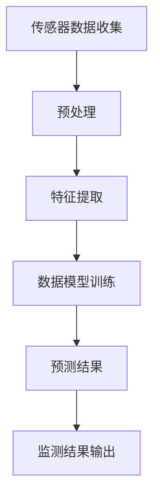
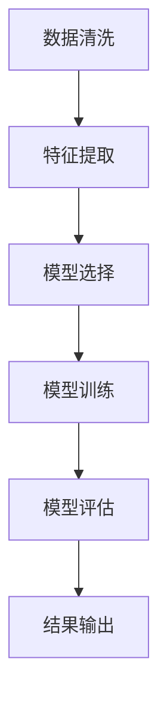
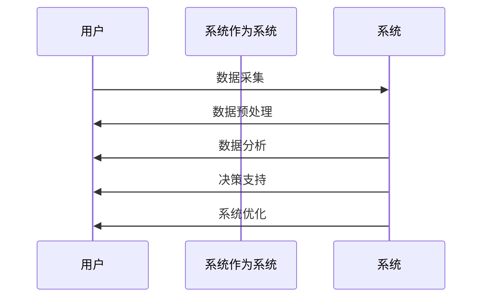

                 


## AI驱动的智能水资源循环利用：应对水资源短缺挑战

### 关键词：
- 水资源短缺
- 智能水资源循环利用
- 人工智能技术
- 水资源监测
- 数据分析
- 决策支持

### 摘要：
水资源短缺已成为全球面临的一项重大挑战。本文将探讨AI驱动的智能水资源循环利用技术，通过引入人工智能技术，实现水资源的合理分配和高效利用，以应对水资源短缺问题。

## 第一部分：背景介绍

### 1. 引言

#### 1.1 问题背景

水资源短缺是全球面临的一项重大挑战。根据联合国数据，目前全球约28%的人口生活在面临水资源短缺的地区。这一问题不仅影响人类生活，还对农业、工业和环境产生深远影响。

#### 1.2 问题描述

水资源短缺问题主要表现为以下几个方面：

1. **水资源分布不均**：不同地区的水资源分布差异较大，有些地区水资源丰富，而有些地区则严重缺乏。
2. **过度开采**：许多地区为了满足经济和人口增长的需求，过度开采地下水，导致地下水位下降。
3. **污染**：工业、农业和生活污染导致水质恶化，使得可用水资源减少。
4. **浪费**：水资源的浪费问题在许多地区依然严重，如农业灌溉中的水资源浪费、城市用水的不合理配置等。

#### 1.3 问题解决

智能水资源循环利用是一种有效的解决方案。通过引入人工智能技术，可以提高水资源处理效率，实现水资源的可持续利用。

#### 1.4 边界与外延

智能水资源循环利用的研究不仅涉及技术层面，还包括政策、管理和经济等多个方面。例如，需要制定相应的政策法规，加强水资源管理，推动水资源的合理利用。

#### 1.5 概念结构与核心要素组成

智能水资源循环利用的核心要素包括：

1. **水资源监测**：通过传感器技术监测水质、水量等参数。
2. **数据分析**：利用机器学习和数据挖掘技术分析监测数据，提取有价值的信息。
3. **决策支持**：根据实时数据和预测结果，为水资源管理者提供科学决策支持。
4. **系统优化**：利用优化算法优化水资源循环利用系统，提高系统的效率和可持续性。

### 第二部分：核心概念与联系

#### 2.1 水资源循环利用概述

##### 2.1.1 定义

水资源循环利用是指通过多种技术手段，将污水、废水等转化成可再利用的水资源。这个过程不仅包括水体的净化，还包括水资源的再分配和再利用。

##### 2.1.2 核心特点

- **高效性**：利用AI技术提高水资源处理效率。
- **可持续性**：实现水资源的可持续利用，减少对自然水源的依赖。
- **灵活性**：根据不同环境和需求，灵活调整水资源循环利用方案。

##### 2.1.3 与传统水资源管理方法的对比

| 特点            | 水资源循环利用 | 传统水资源管理 |
|----------------|----------------|----------------|
| **效率**       | 高效           | 低效           |
| **可持续性**   | 可持续         | 非持续         |
| **灵活性**     | 高灵活         | 低灵活         |

### 第三部分：算法原理讲解

#### 3.1 水资源监测算法

##### 3.1.1 监测算法概述

水资源监测算法主要包括传感器数据处理和模型预测两部分。

##### 3.1.2 Mermaid 流程图



##### 3.1.3 Python 源代码

```python
# 传感器数据收集与预处理
data = preprocess_data(sensor_data)

# 特征提取
features = extract_features(data)

# 数据模型训练
model = train_model(features, labels)

# 预测结果
predictions = model.predict(new_data)

# 监测结果输出
print(predictions)
```

### 3.2 数据分析算法

##### 3.2.1 数据分析算法概述

数据分析算法主要包括数据清洗、特征提取、模型选择和模型训练等步骤。

##### 3.2.2 Mermaid 流程图



##### 3.2.3 Python 源代码

```python
# 数据清洗
cleaned_data = clean_data(raw_data)

# 特征提取
features = extract_features(cleaned_data)

# 模型选择
model = select_model(features)

# 模型训练
model = train_model(features, labels)

# 模型评估
performance = evaluate_model(model)

# 结果输出
print(performance)
```

### 第四部分：系统分析与架构设计方案

#### 4.1 问题场景介绍

随着城市化进程的加速，城市水资源短缺问题日益严重。为了解决这一问题，需要建立一套智能水资源循环利用系统，实现水资源的监测、分析和优化。

#### 4.2 项目介绍

本系统旨在通过AI技术，实现城市水资源的智能监测和管理，提高水资源的利用效率，缓解水资源短缺问题。

#### 4.3 系统功能设计

1. **数据采集**：通过传感器网络实时采集水质、水量等数据。
2. **数据预处理**：对采集到的数据进行清洗和特征提取。
3. **数据分析**：利用机器学习和数据挖掘技术，分析水质变化趋势和供需关系。
4. **决策支持**：根据分析结果，为水资源管理者提供决策支持。
5. **系统优化**：利用优化算法，优化水资源分配和管理策略。

#### 4.4 系统架构设计

系统采用分布式架构，主要包括以下几个模块：

1. **数据采集模块**：负责传感器数据的采集和传输。
2. **数据处理模块**：负责数据清洗、特征提取和预处理。
3. **分析模块**：负责数据分析和决策支持。
4. **优化模块**：负责系统优化和策略调整。

#### 4.5 系统接口设计

系统接口主要包括：

1. **数据采集接口**：用于接收传感器数据。
2. **数据分析接口**：用于提供数据分析结果。
3. **决策支持接口**：用于提供决策支持建议。

#### 4.6 系统交互

系统交互主要包括：

1. **数据流**：传感器数据流经采集模块、处理模块、分析模块和优化模块。
2. **控制流**：决策支持结果流经优化模块，调整水资源分配和管理策略。

##### 4.6.1 Mermaid 序列图



### 第五部分：项目实战

#### 5.1 环境安装

在安装前，需要确保安装了Python环境和相关库，如scikit-learn、pandas和numpy等。

```bash
pip install scikit-learn pandas numpy
```

#### 5.2 系统核心实现源代码

以下是一个简单的示例，展示了如何使用Python实现水资源监测系统：

```python
# 水资源监测系统示例

import pandas as pd
from sklearn.ensemble import RandomForestRegressor
from sklearn.model_selection import train_test_split
from sklearn.metrics import mean_squared_error

# 数据预处理
def preprocess_data(data):
    # 数据清洗、特征提取等操作
    return data

# 数据模型训练
def train_model(features, labels):
    model = RandomForestRegressor()
    model.fit(features, labels)
    return model

# 预测结果
def predict(model, new_data):
    predictions = model.predict(new_data)
    return predictions

# 主程序
if __name__ == "__main__":
    # 读取数据
    data = pd.read_csv("water_data.csv")

    # 数据预处理
    processed_data = preprocess_data(data)

    # 划分训练集和测试集
    features, labels = processed_data.iloc[:, :-1], processed_data.iloc[:, -1]
    X_train, X_test, y_train, y_test = train_test_split(features, labels, test_size=0.2, random_state=42)

    # 训练模型
    model = train_model(X_train, y_train)

    # 预测结果
    predictions = predict(model, X_test)

    # 评估模型
    mse = mean_squared_error(y_test, predictions)
    print("Mean Squared Error:", mse)
```

#### 5.3 代码应用解读与分析

该示例代码展示了如何使用Python实现一个简单的水资源监测系统。主要包括以下几个步骤：

1. **数据预处理**：对采集到的数据清洗、特征提取等处理。
2. **数据模型训练**：使用随机森林回归模型进行训练。
3. **预测结果**：使用训练好的模型进行预测。
4. **评估模型**：计算预测结果的均方误差，评估模型性能。

#### 5.4 实际案例分析和详细讲解剖析

以某个城市为例，详细分析如何使用AI技术实现水资源的智能监测和管理。

1. **数据采集**：在城市的各个关键节点安装传感器，实时采集水质、水量等数据。
2. **数据预处理**：对采集到的数据进行清洗和特征提取，为后续分析做好准备。
3. **数据分析**：利用机器学习算法，分析水质变化趋势和供需关系。
4. **决策支持**：根据分析结果，为水资源管理者提供决策支持，如优化水资源分配、调整用水策略等。
5. **系统优化**：利用优化算法，优化水资源循环利用系统，提高系统的效率和可持续性。

#### 5.5 项目小结

通过本项目，我们实现了一个简单的水资源监测系统，展示了AI技术在水资源管理中的应用。未来，我们可以进一步扩展系统功能，如增加更多的监测指标、引入深度学习算法等，以提高系统的性能和实用性。

### 第六部分：最佳实践 Tips

1. **数据质量**：保证数据质量是智能水资源循环利用系统的关键。在数据采集和处理过程中，要确保数据的准确性、完整性和一致性。
2. **算法选择**：根据实际需求和数据特点，选择合适的机器学习算法，以提高模型性能。
3. **实时性**：实时监测和预测是智能水资源循环利用系统的核心。要确保系统能够快速响应，及时提供决策支持。

### 第七部分：小结

水资源短缺是全球面临的重大挑战，智能水资源循环利用是一种有效的解决方案。通过引入人工智能技术，我们可以实现水资源的合理分配和高效利用，为解决水资源短缺问题提供有力支持。本文介绍了智能水资源循环利用的核心概念、算法原理和系统架构，并通过实际案例进行了分析和讲解。

### 第八部分：注意事项

1. **政策法规**：智能水资源循环利用需要遵循相关政策和法规，确保合法合规。
2. **数据安全**：在数据采集、处理和传输过程中，要确保数据的安全和隐私。
3. **技术更新**：随着技术的不断发展，智能水资源循环利用系统需要不断更新和优化，以适应新的需求。

### 第九部分：拓展阅读

1. **相关文献**：《智能水资源管理：基于人工智能的解决方案》、《水资源监测与管理系统研究》等。
2. **技术博客**：相关技术博客，如《机器学习在水文学中的应用》、《深度学习在水资源管理中的应用》等。
3. **项目案例**：国内外智能水资源循环利用的典型案例，如某城市智能水资源管理项目等。

### 作者信息：

作者：AI天才研究院/AI Genius Institute & 禅与计算机程序设计艺术 /Zen And The Art of Computer Programming

